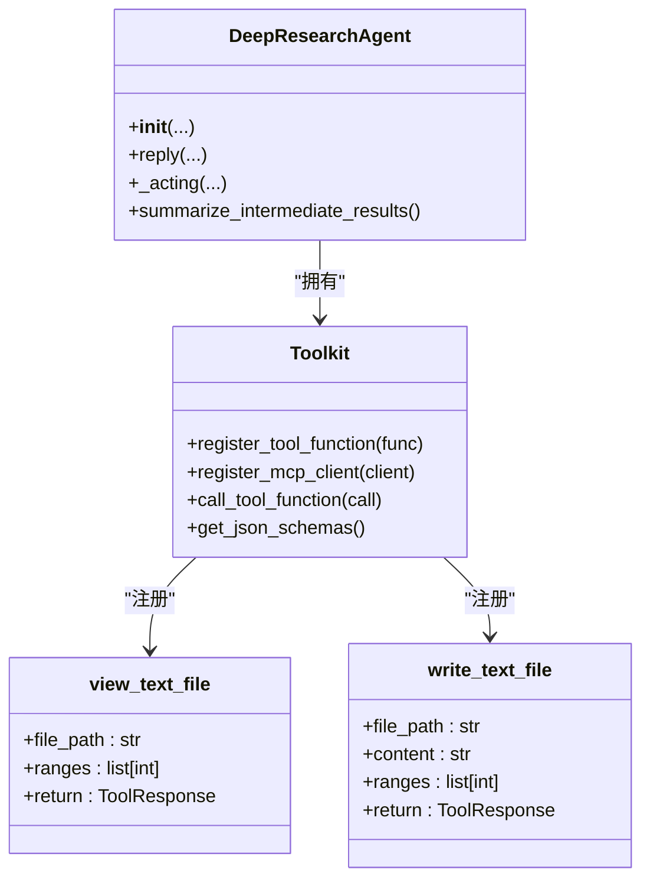
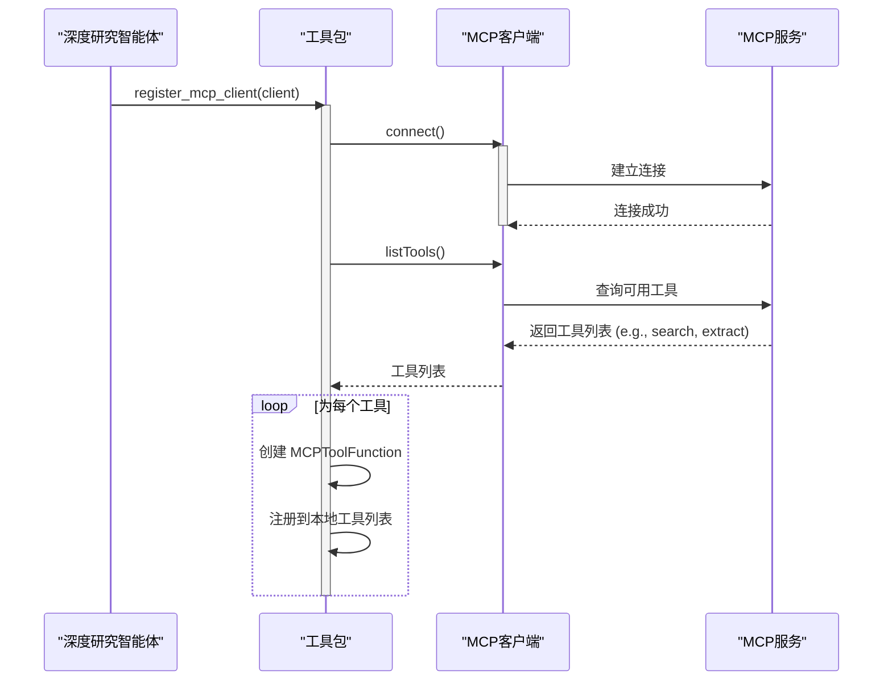
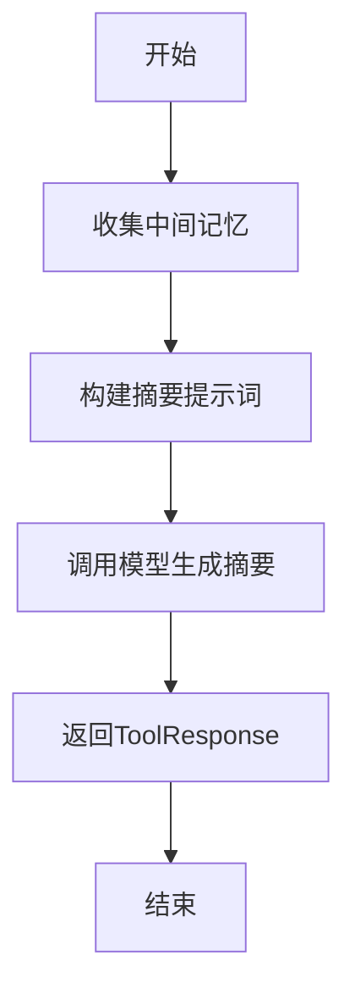

# 工具集成

<cite>
**本文档中引用的文件**   
- [deep_research_agent.py](file://examples/agent/deep_research_agent/deep_research_agent.py)
- [main.py](file://examples/agent/deep_research_agent/main.py)
- [utils.py](file://examples/agent/deep_research_agent/utils.py)
- [_toolkit.py](file://src/agentscope/tool/_toolkit.py)
- [_view_text_file.py](file://src/agentscope/tool/_text_file/_view_text_file.py)
- [_write_text_file.py](file://src/agentscope/tool/_text_file/_write_text_file.py)
- [_mcp_function.py](file://src/agentscope/mcp/_mcp_function.py)
- [toolkit_basic_test.py](file://tests/toolkit_basic_test.py)
</cite>

## 目录
1. [引言](#引言)
2. [工具包初始化与内置工具注册](#工具包初始化与内置工具注册)
3. [MCP客户端工具集成](#mcp客户端工具集成)
4. [_acting方法中的工具调用处理](#_acting方法中的工具调用处理)
5. [自定义工具函数的设计与注册](#自定义工具函数的设计与注册)
6. [工具调用决策逻辑](#工具调用决策逻辑)
7. [性能考虑](#性能考虑)
8. [结论](#结论)

## 引言
在自定义智能体中，工具集成是实现复杂任务处理能力的核心机制。以深度研究智能体（Deep Research Agent）为例，该智能体通过一个功能强大的工具包（Toolkit）来管理各种工具，包括内置的文件操作工具和通过MCP（Model Control Protocol）协议集成的外部服务工具。本文档将全面阐述这一工具集成的实现方法，涵盖从工具注册、调用处理到自定义工具设计的各个方面。

## 工具包初始化与内置工具注册

在深度研究智能体的`__init__`方法中，工具集成的第一步是创建一个`Toolkit`实例。这个工具包是所有工具的管理中心，负责注册、管理和调用各种功能。

智能体通过`toolkit.register_tool_function()`方法将内置工具函数注册到工具包中。这些内置工具是智能体自身实现的Python函数，可以直接在本地执行。在深度研究智能体的例子中，两个关键的内置工具被注册：

1.  **`view_text_file`**: 用于读取指定文本文件的内容。该函数接受文件路径和可选的行号范围作为参数，返回文件的指定部分内容。
2.  **`write_text_file`**: 用于创建或修改文本文件。该函数可以覆盖整个文件，也可以在指定行号处插入或替换内容。

这些工具函数在`src/agentscope/tool/_text_file/`目录下实现，并通过`src/agentscope/tool/__init__.py`被导入和暴露。通过在初始化时注册这些工具，智能体获得了直接与文件系统交互的能力，这对于保存中间结果、读取参考资料等任务至关重要。

**图源**
- [deep_research_agent.py](file://examples/agent/deep_research_agent/deep_research_agent.py#L167-L168)
- [_toolkit.py](file://src/agentscope/tool/_toolkit.py#L206-L233)
- [_view_text_file.py](file://src/agentscope/tool/_text_file/_view_text_file.py#L13-L82)
- [_write_text_file.py](file://src/agentscope/tool/_text_file/_write_text_file.py#L107-L241)

**本节来源**
- [deep_research_agent.py](file://examples/agent/deep_research_agent/deep_research_agent.py#L167-L168)

## MCP客户端工具集成

除了内置工具，智能体还需要与外部服务进行交互，例如进行网络搜索。这是通过MCP（Model Control Protocol）客户端实现的。MCP是一种允许智能体与外部工具服务器通信的协议。

在深度研究智能体的`__init__`方法中，通过`toolkit.register_mcp_client()`方法将一个MCP客户端（如`search_mcp_client`）注册到工具包中。这个客户端通常是一个与特定MCP服务器（如Tavily搜索服务）建立连接的实例。

当调用`register_mcp_client`时，工具包会向MCP服务器查询其提供的所有可用工具（通过`listTools`方法），然后为每个工具创建一个`MCPToolFunction`对象，并将其注册到本地的工具包中。这样，原本在远程服务器上的工具，就变成了智能体可以直接调用的本地工具。

值得注意的是，`register_mcp_client`是一个异步方法，因此在`__init__`中需要使用`asyncio.get_running_loop().create_task()`来启动一个后台任务进行注册，避免阻塞智能体的初始化过程。

**图源**
- [deep_research_agent.py](file://examples/agent/deep_research_agent/deep_research_agent.py#L169-L171)
- [_toolkit.py](file://src/agentscope/tool/_toolkit.py#L727-L787)
- [_mcp_function.py](file://src/agentscope/mcp/_mcp_function.py#L55-L86)

**本节来源**
- [deep_research_agent.py](file://examples/agent/deep_research_agent/deep_research_agent.py#L169-L171)

## _acting方法中的工具调用处理

当智能体的推理模型决定调用一个工具时，它会生成一个`ToolUseBlock`对象，其中包含了工具名称和参数。`_acting`方法负责处理这个调用。

处理流程如下：
1.  **执行调用**: 调用`self.toolkit.call_tool_function(tool_call)`来执行工具。工具包会根据工具名称找到对应的函数并执行。
2.  **异步生成器处理**: `call_tool_function`的返回值总是一个异步生成器（AsyncGenerator），即使原始工具函数是同步的。这是通过`_async_generator_wrapper`等包装器实现的，确保了统一的流式接口。
3.  **流式响应处理**: `_acting`方法使用`async for chunk in tool_res:`循环来逐个处理工具返回的响应块（`ToolResponse`）。这允许智能体在工具执行过程中逐步接收和处理结果。
4.  **结果截断**: 对于像网络搜索这样可能返回大量文本的工具，为了避免超出模型的上下文长度限制，代码中会调用`truncate_search_result`函数对结果进行截断。该函数根据预设的最大字数（`max_tool_results_words`）来限制输出长度。
5.  **错误处理**: 整个调用过程被`try...finally`块包围。如果在执行过程中发生异常（如`asyncio.CancelledError`），包装器会捕获它并生成一个包含中断信息的`ToolResponse`，确保错误信息能被智能体感知和处理。无论成功与否，最终都会将工具调用结果添加到中间记忆（`intermediate_memory`）中，供后续步骤使用。

**本节来源**
- [deep_research_agent.py](file://examples/agent/deep_research_agent/deep_research_agent.py#L279-L379)
- [_toolkit.py](file://src/agentscope/tool/_toolkit.py#L594-L725)
- [utils.py](file://examples/agent/deep_research_agent/utils.py#L56-L74)

## 自定义工具函数的设计与注册

智能体不仅可以使用预定义的工具，还可以设计和注册自定义的工具函数。在深度研究智能体中，`summarize_intermediate_results`就是一个典型的自定义工具。

这个函数的目的是将当前工作计划的执行结果汇总成一份草稿报告。它从`intermediate_memory`中收集所有相关的工具调用和结果，然后通过一个提示词（prompt）让模型生成结构化的摘要。这个摘要随后可以被保存为文件或用于指导下一步的研究。

设计自定义工具函数的关键在于：
- **返回`ToolResponse`对象**: 所有工具函数的返回值都必须是`ToolResponse`类型，该对象包含`content`（工具输出内容）、`metadata`（元数据，可用于传递结构化数据）等字段。
- **注册到工具包**: 通过`toolkit.register_tool_function(self.summarize_intermediate_results)`将函数注册到工具包中，使其对智能体的推理模型可见。

通过这种方式，开发者可以将复杂的业务逻辑封装成工具，让智能体通过自然语言推理来调用，极大地扩展了智能体的能力。

**图源**
- [deep_research_agent.py](file://examples/agent/deep_research_agent/deep_research_agent.py#L723-L799)
- [_response.py](file://src/agentscope/tool/_response.py#L11-L33)

**本节来源**
- [deep_research_agent.py](file://examples/agent/deep_research_agent/deep_research_agent.py#L188-L192)

## 工具调用决策逻辑

智能体选择使用哪个工具的决策逻辑主要由其推理模型和系统提示词共同驱动。在深度研究智能体中，这一逻辑体现在其`reply`方法的循环中：

1.  **生成推理提示**: 智能体首先构建一个包含当前任务目标、工作计划和知识缺口的提示词。
2.  **模型推理**: 将提示词发送给模型，模型会根据其训练和当前上下文，决定下一步是直接回复用户，还是调用某个工具来获取更多信息。
3.  **工具选择**: 模型从工具包提供的所有可用工具（通过`get_json_schemas()`获取）中选择最合适的工具。例如，当需要查找信息时，它会选择`search_mcp_client`提供的搜索工具；当需要记录信息时，它会选择`write_text_file`。
4.  **循环迭代**: 工具调用的结果会被添加到记忆中，然后智能体进入下一轮推理，根据新信息决定下一步行动，直到任务完成。

这种决策是动态的，基于任务的当前状态和可用工具的能力。

**本节来源**
- [deep_research_agent.py](file://examples/agent/deep_research_agent/deep_research_agent.py#L194-L277)

## 性能考虑

在工具集成中，性能是一个重要的考量因素，主要体现在以下几个方面：

1.  **并发执行**: 在`__init__`方法中注册MCP客户端时，使用`create_task`启动一个后台任务，避免了同步等待连接建立，提高了初始化效率。
2.  **结果缓存**: 虽然在当前示例中未直接体现，但`toolkit`的设计支持通过`preset_kwargs`为工具预设参数，这可以用于实现简单的缓存机制。例如，可以将频繁访问的数据存储在`preset_kwargs`中，避免重复的网络请求。
3.  **上下文管理**: 通过`max_tool_results_words`参数对工具结果进行截断，有效控制了返回给模型的上下文长度，防止因上下文过长而导致性能下降或超出模型限制。
4.  **流式处理**: 使用异步生成器处理工具调用，允许智能体在工具执行的同时进行其他操作，提高了整体的响应速度和资源利用率。

**本节来源**
- [deep_research_agent.py](file://examples/agent/deep_research_agent/deep_research_agent.py#L101-L102)
- [_toolkit.py](file://src/agentscope/tool/_toolkit.py#L210-L211)

## 结论
综上所述，自定义智能体中的工具集成是一个系统性的工程。通过`Toolkit`类，智能体能够统一管理内置工具和MCP客户端工具。在`__init__`方法中完成工具的注册，在`_acting`方法中处理调用、流式响应、截断和错误。开发者可以设计返回`ToolResponse`的自定义函数并将其注册，从而扩展智能体的能力。工具的选择由模型的推理过程动态决定，而性能则通过并发、流式处理和结果管理等策略得到保障。这套机制为构建功能强大、灵活可靠的智能体奠定了坚实的基础。