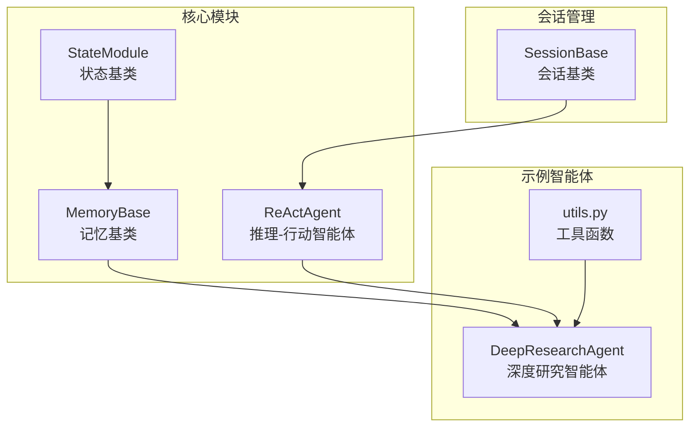
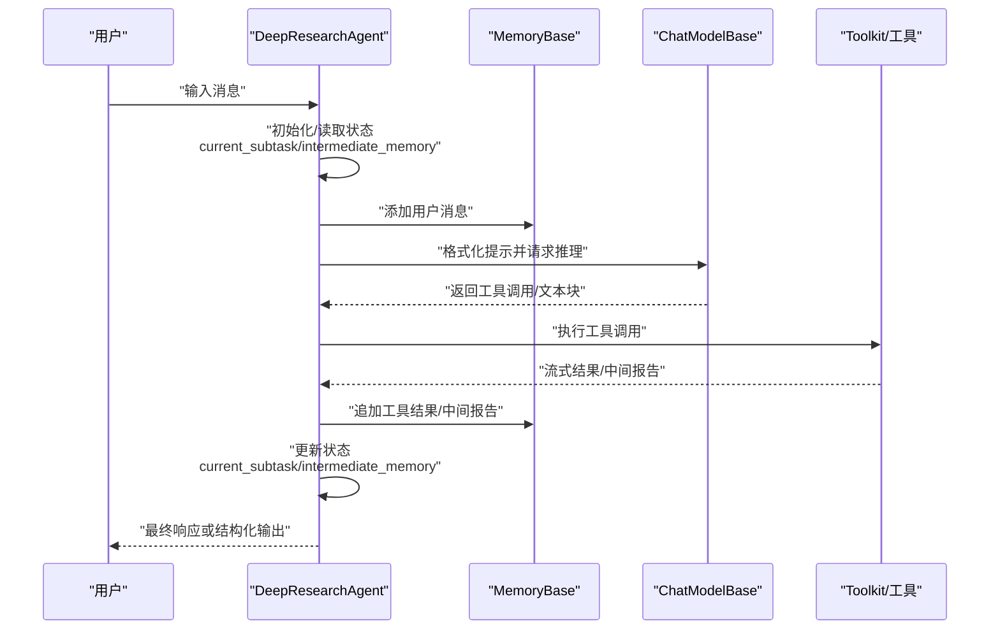
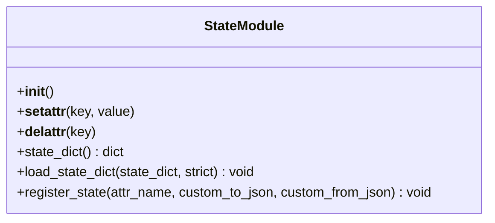
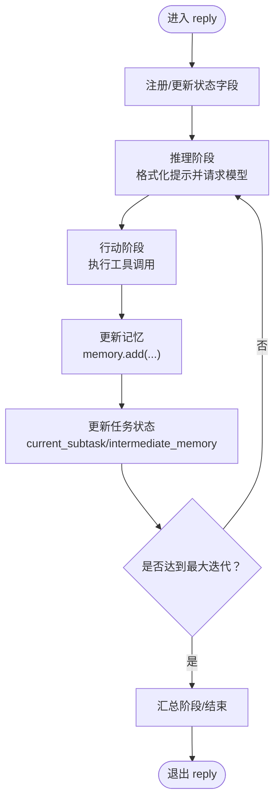
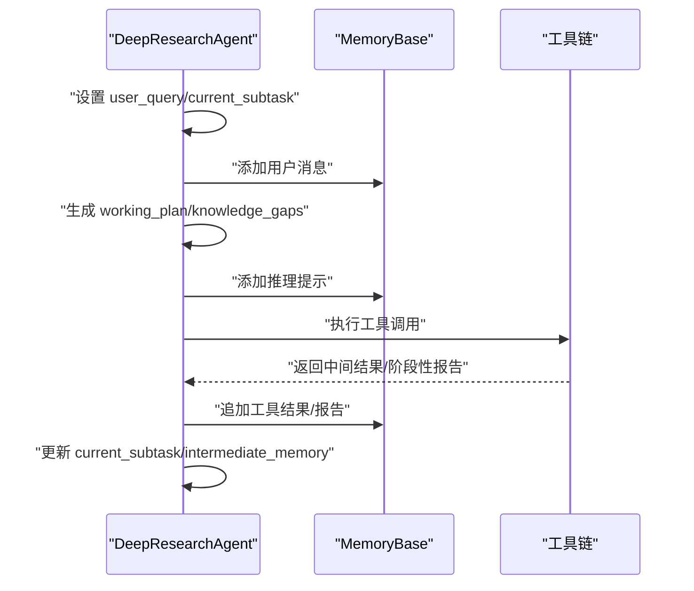
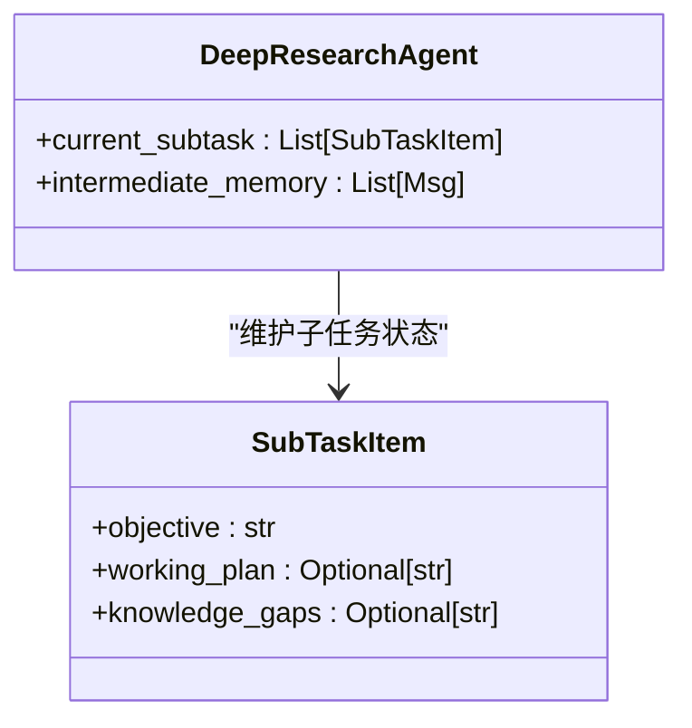
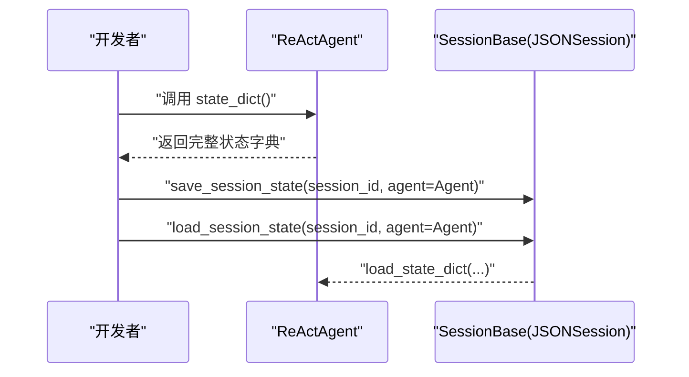
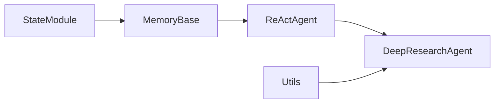

# 状态管理

<cite>
**本文引用的文件**
- [src/agentscope/module/_state_module.py](file://src/agentscope/module/_state_module.py)
- [src/agentscope/agent/_react_agent.py](file://src/agentscope/agent/_react_agent.py)
- [src/agentscope/memory/_memory_base.py](file://src/agentscope/memory/_memory_base.py)
- [examples/agent/deep_research_agent/deep_research_agent.py](file://examples/agent/deep_research_agent/deep_research_agent.py)
- [examples/agent/deep_research_agent/utils.py](file://examples/agent/deep_research_agent/utils.py)
- [src/agentscope/session/_session_base.py](file://src/agentscope/session/_session_base.py)
- [docs/tutorial/zh_CN/src/task_state.py](file://docs/tutorial/zh_CN/src/task_state.py)
</cite>

## 目录
1. [引言](#引言)
2. [项目结构](#项目结构)
3. [核心组件](#核心组件)
4. [架构总览](#架构总览)
5. [详细组件分析](#详细组件分析)
6. [依赖关系分析](#依赖关系分析)
7. [性能考量](#性能考量)
8. [故障排查指南](#故障排查指南)
9. [结论](#结论)
10. [附录](#附录)

## 引言
本篇文档围绕自定义智能体中的状态管理最佳实践展开，以深度研究智能体（DeepResearchAgent）为例，系统阐述如何在类属性中维护任务状态（如 current_subtask、intermediate_memory），如何利用 StateModule 基类提供的状态管理能力，如何在 reply 方法中读取与更新智能体状态，以及如何通过内存系统（memory）持久化对话历史。同时，我们将给出状态数据结构设计建议（使用 Pydantic 模型 SubTaskItem 提升类型安全与数据完整性），并总结状态管理中的常见陷阱（如状态污染与内存泄漏）及应对策略。

## 项目结构
本仓库采用分层与按功能组织的结构：核心状态管理位于 module 层，智能体与记忆系统分别位于 agent 与 memory 子模块，示例智能体位于 examples 下。状态管理的关键在于 StateModule 基类及其派生类（如 MemoryBase、ReActAgent），它们共同构成可序列化、可恢复的状态图谱。

图表来源
- [src/agentscope/module/_state_module.py](file://src/agentscope/module/_state_module.py#L1-L152)
- [src/agentscope/memory/_memory_base.py](file://src/agentscope/memory/_memory_base.py#L1-L45)
- [src/agentscope/agent/_react_agent.py](file://src/agentscope/agent/_react_agent.py#L1-L200)
- [examples/agent/deep_research_agent/deep_research_agent.py](file://examples/agent/deep_research_agent/deep_research_agent.py#L1-L200)
- [examples/agent/deep_research_agent/utils.py](file://examples/agent/deep_research_agent/utils.py#L1-L120)
- [src/agentscope/session/_session_base.py](file://src/agentscope/session/_session_base.py#L1-L34)

章节来源
- [src/agentscope/module/_state_module.py](file://src/agentscope/module/_state_module.py#L1-L152)
- [src/agentscope/memory/_memory_base.py](file://src/agentscope/memory/_memory_base.py#L1-L45)
- [src/agentscope/agent/_react_agent.py](file://src/agentscope/agent/_react_agent.py#L1-L200)
- [examples/agent/deep_research_agent/deep_research_agent.py](file://examples/agent/deep_research_agent/deep_research_agent.py#L1-L200)
- [examples/agent/deep_research_agent/utils.py](file://examples/agent/deep_research_agent/utils.py#L1-L120)
- [src/agentscope/session/_session_base.py](file://src/agentscope/session/_session_base.py#L1-L34)

## 核心组件
- StateModule：提供嵌套状态注册、序列化与反序列化能力，支持自动跟踪继承自自身的子模块与手动注册的属性。
- MemoryBase：记忆系统的抽象基类，继承自 StateModule，具备 add/delete/retrieve/state_dict/load_state_dict 等接口。
- ReActAgent：推理-行动智能体，内置记忆、工具集、知识检索等，支持结构化输出与状态注册。
- DeepResearchAgent：示例智能体，演示如何在类属性中维护任务状态（current_subtask、intermediate_memory），并通过 memory 持久化对话历史。
- SessionBase：会话级状态管理抽象，用于保存/加载一组 StateModule 实例的状态。

章节来源
- [src/agentscope/module/_state_module.py](file://src/agentscope/module/_state_module.py#L1-L152)
- [src/agentscope/memory/_memory_base.py](file://src/agentscope/memory/_memory_base.py#L1-L45)
- [src/agentscope/agent/_react_agent.py](file://src/agentscope/agent/_react_agent.py#L230-L260)
- [examples/agent/deep_research_agent/deep_research_agent.py](file://examples/agent/deep_research_agent/deep_research_agent.py#L140-L200)
- [src/agentscope/session/_session_base.py](file://src/agentscope/session/_session_base.py#L1-L34)

## 架构总览
下图展示了状态管理在智能体与记忆系统中的交互路径，以及示例智能体如何在 reply 流程中读写状态并持久化到 memory。

图表来源
- [examples/agent/deep_research_agent/deep_research_agent.py](file://examples/agent/deep_research_agent/deep_research_agent.py#L194-L278)
- [src/agentscope/agent/_react_agent.py](file://src/agentscope/agent/_react_agent.py#L253-L409)
- [src/agentscope/memory/_memory_base.py](file://src/agentscope/memory/_memory_base.py#L1-L45)

## 详细组件分析

### StateModule 基类与状态注册
StateModule 提供了三类关键能力：
- 自动跟踪：当类属性为 StateModule 实例时，自动纳入状态字典。
- 手动注册：通过 register_state 将非 StateModule 属性纳入状态管理，可指定自定义 JSON 序列化/反序列化函数。
- 状态导出/导入：state_dict 与 load_state_dict 支持嵌套模块的递归序列化与恢复。

图表来源
- [src/agentscope/module/_state_module.py](file://src/agentscope/module/_state_module.py#L1-L152)

章节来源
- [src/agentscope/module/_state_module.py](file://src/agentscope/module/_state_module.py#L1-L152)

### ReActAgent 的状态注册与记忆集成
ReActAgent 在初始化时显式注册若干状态字段（如 name、_sys_prompt），并在 reply 流程中统一管理记忆与工具调用。这体现了“状态即数据快照”的理念：每次推理-行动循环都会更新状态，并通过 memory 持久化对话历史。

图表来源
- [src/agentscope/agent/_react_agent.py](file://src/agentscope/agent/_react_agent.py#L253-L409)

章节来源
- [src/agentscope/agent/_react_agent.py](file://src/agentscope/agent/_react_agent.py#L233-L260)
- [src/agentscope/agent/_react_agent.py](file://src/agentscope/agent/_react_agent.py#L253-L409)

### DeepResearchAgent 的任务状态与内存持久化
DeepResearchAgent 在类属性中维护两类关键状态：
- current_subtask：列表，记录当前子任务的目标、工作计划与知识缺口，作为多阶段任务的核心状态。
- intermediate_memory：列表，记录推理提示、工具调用与工具结果等中间交互，用于后续总结与报告生成。

在 reply 方法中：
- 初始化用户查询与子任务列表，向 memory 添加用户消息。
- 在推理-行动循环中，动态更新 working_plan 与 knowledge_gaps，并将中间内容写入 intermediate_memory。
- 通过 memory.add 持久化对话历史；在工具调用完成后，根据需要清空或重置 intermediate_memory 并写入阶段性报告。

图表来源
- [examples/agent/deep_research_agent/deep_research_agent.py](file://examples/agent/deep_research_agent/deep_research_agent.py#L194-L278)
- [examples/agent/deep_research_agent/deep_research_agent.py](file://examples/agent/deep_research_agent/deep_research_agent.py#L279-L418)
- [examples/agent/deep_research_agent/deep_research_agent.py](file://examples/agent/deep_research_agent/deep_research_agent.py#L506-L573)
- [examples/agent/deep_research_agent/deep_research_agent.py](file://examples/agent/deep_research_agent/deep_research_agent.py#L575-L721)
- [examples/agent/deep_research_agent/deep_research_agent.py](file://examples/agent/deep_research_agent/deep_research_agent.py#L723-L800)

章节来源
- [examples/agent/deep_research_agent/deep_research_agent.py](file://examples/agent/deep_research_agent/deep_research_agent.py#L160-L190)
- [examples/agent/deep_research_agent/deep_research_agent.py](file://examples/agent/deep_research_agent/deep_research_agent.py#L194-L278)
- [examples/agent/deep_research_agent/deep_research_agent.py](file://examples/agent/deep_research_agent/deep_research_agent.py#L279-L418)
- [examples/agent/deep_research_agent/deep_research_agent.py](file://examples/agent/deep_research_agent/deep_research_agent.py#L506-L573)
- [examples/agent/deep_research_agent/deep_research_agent.py](file://examples/agent/deep_research_agent/deep_research_agent.py#L575-L721)
- [examples/agent/deep_research_agent/deep_research_agent.py](file://examples/agent/deep_research_agent/deep_research_agent.py#L723-L800)

### 使用 Pydantic 模型保证类型安全与数据完整性
DeepResearchAgent 定义了 SubTaskItem 模型，用于约束子任务的字段（如 objective、working_plan、knowledge_gaps），从而在赋值与序列化过程中提升类型安全与数据一致性。

图表来源
- [examples/agent/deep_research_agent/deep_research_agent.py](file://examples/agent/deep_research_agent/deep_research_agent.py#L57-L64)
- [examples/agent/deep_research_agent/deep_research_agent.py](file://examples/agent/deep_research_agent/deep_research_agent.py#L160-L190)

章节来源
- [examples/agent/deep_research_agent/deep_research_agent.py](file://examples/agent/deep_research_agent/deep_research_agent.py#L57-L64)
- [examples/agent/deep_research_agent/deep_research_agent.py](file://examples/agent/deep_research_agent/deep_research_agent.py#L160-L190)

### 会话级状态管理与恢复
示例教程展示了如何使用 StateModule 的 state_dict/load_state_dict 能力，以及通过 SessionBase 保存/加载一组状态模块。这为复杂场景下的断点续跑、多实例协作提供了基础。

图表来源
- [docs/tutorial/zh_CN/src/task_state.py](file://docs/tutorial/zh_CN/src/task_state.py#L1-L124)
- [src/agentscope/session/_session_base.py](file://src/agentscope/session/_session_base.py#L1-L34)

章节来源
- [docs/tutorial/zh_CN/src/task_state.py](file://docs/tutorial/zh_CN/src/task_state.py#L1-L124)
- [src/agentscope/session/_session_base.py](file://src/agentscope/session/_session_base.py#L1-L34)

## 依赖关系分析
- StateModule 为 MemoryBase 与 ReActAgent 等组件提供状态管理基础。
- DeepResearchAgent 继承 ReActAgent，复用其状态注册与记忆机制。
- 工具函数 utils.py 提供结构化输出与提示词加载，支撑 DeepResearchAgent 的状态转换逻辑。

图表来源
- [src/agentscope/module/_state_module.py](file://src/agentscope/module/_state_module.py#L1-L152)
- [src/agentscope/memory/_memory_base.py](file://src/agentscope/memory/_memory_base.py#L1-L45)
- [src/agentscope/agent/_react_agent.py](file://src/agentscope/agent/_react_agent.py#L1-L200)
- [examples/agent/deep_research_agent/deep_research_agent.py](file://examples/agent/deep_research_agent/deep_research_agent.py#L1-L200)
- [examples/agent/deep_research_agent/utils.py](file://examples/agent/deep_research_agent/utils.py#L1-L120)

章节来源
- [src/agentscope/module/_state_module.py](file://src/agentscope/module/_state_module.py#L1-L152)
- [src/agentscope/memory/_memory_base.py](file://src/agentscope/memory/_memory_base.py#L1-L45)
- [src/agentscope/agent/_react_agent.py](file://src/agentscope/agent/_react_agent.py#L1-L200)
- [examples/agent/deep_research_agent/deep_research_agent.py](file://examples/agent/deep_research_agent/deep_research_agent.py#L1-L200)
- [examples/agent/deep_research_agent/utils.py](file://examples/agent/deep_research_agent/utils.py#L1-L120)

## 性能考量
- 状态序列化成本：register_state 可通过自定义 to_json/load_json 减少不必要的序列化开销，避免对不可序列化对象进行默认 JSON 编码。
- 记忆容量控制：在 DeepResearchAgent 中，通过中间记忆 intermediate_memory 与截断策略（如按词数截断）控制上下文长度，降低模型输入负担。
- 并行工具调用：ReActAgent 支持并行工具调用，合理利用并发可缩短整体响应时间，但需注意资源竞争与内存峰值。
- 长期记忆与检索：结合长期记忆（如 ReMe）可减少重复检索，但需权衡检索延迟与存储成本。

[本节为通用指导，不直接分析具体文件]

## 故障排查指南
- 状态无法序列化：若 register_state 未提供自定义序列化函数且属性不可 JSON 序列化，将抛出异常。请为该属性提供 custom_to_json/custom_from_json 或确保属性本身可序列化。
- 状态缺失导致加载失败：load_state_dict 在 strict=True 时，若状态字典缺少必要键会抛 KeyError。可通过 strict=False 跳过缺失项，或检查状态注册是否完整。
- 内存泄漏与状态污染：
  - 避免在 current_subtask/intermediate_memory 中累积无关对象，定期清理或重置。
  - 对于大型工具结果，使用截断策略（如 truncate_search_result）限制单次上下文大小。
  - 在工具调用结束后及时清空或替换 intermediate_memory，防止历史信息污染后续推理。
- 结构化输出校验失败：generate_response 在参数校验失败时返回错误信息与 metadata.success=False。请检查传入参数与模型输出结构是否一致。

章节来源
- [src/agentscope/module/_state_module.py](file://src/agentscope/module/_state_module.py#L108-L152)
- [examples/agent/deep_research_agent/utils.py](file://examples/agent/deep_research_agent/utils.py#L56-L75)
- [src/agentscope/agent/_react_agent.py](file://src/agentscope/agent/_react_agent.py#L688-L740)

## 结论
通过 StateModule 基类与 MemoryBase/ReActAgent 的协同，智能体可以在类属性中高效维护任务状态（如 current_subtask、intermediate_memory），并在 reply 流程中持续更新与持久化。借助 Pydantic 模型（如 SubTaskItem）可显著提升状态的类型安全与数据完整性。配合会话级状态管理（SessionBase），可实现断点续跑与多实例协作。在实践中，应关注状态序列化成本、记忆容量控制与工具调用并发，避免状态污染与内存泄漏，确保复杂任务的稳定执行。

[本节为总结性内容，不直接分析具体文件]

## 附录
- 示例教程展示了 StateModule 的使用方式与会话级状态管理流程，可作为快速上手参考。
- DeepResearchAgent 的完整实现提供了多阶段任务状态转换与内存持久化的实际范例。

章节来源
- [docs/tutorial/zh_CN/src/task_state.py](file://docs/tutorial/zh_CN/src/task_state.py#L1-L124)
- [examples/agent/deep_research_agent/deep_research_agent.py](file://examples/agent/deep_research_agent/deep_research_agent.py#L1-L200)