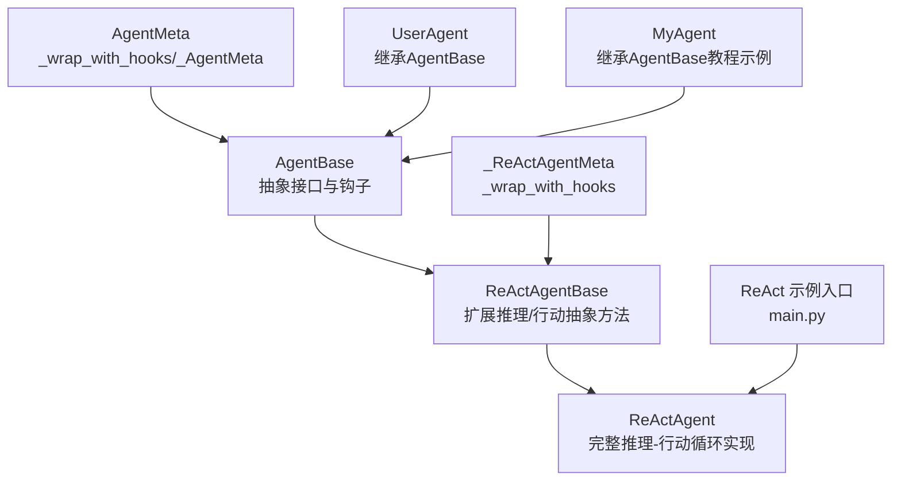
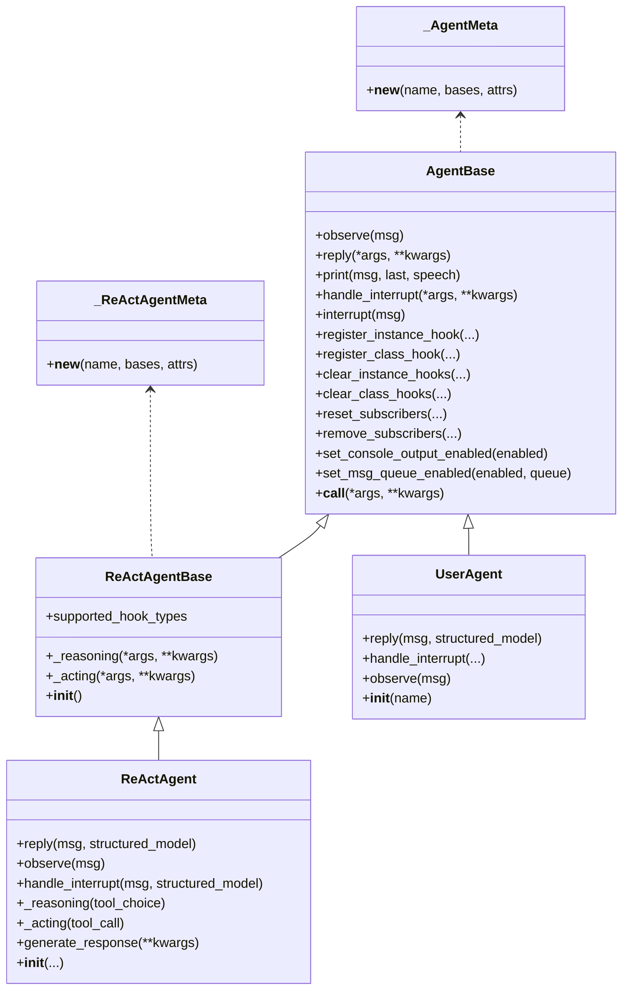
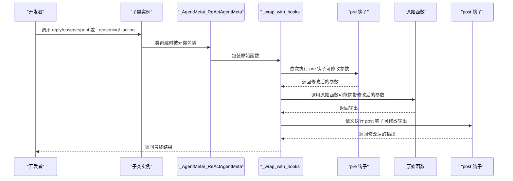
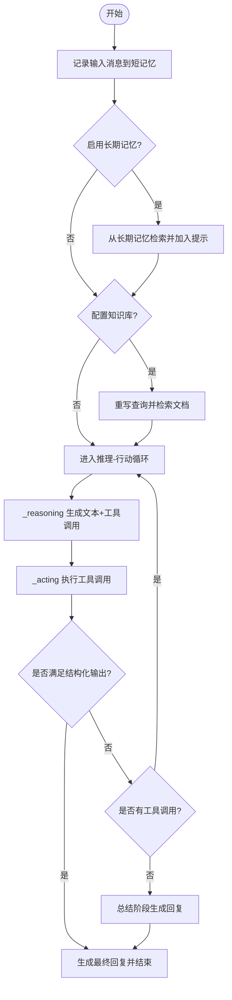
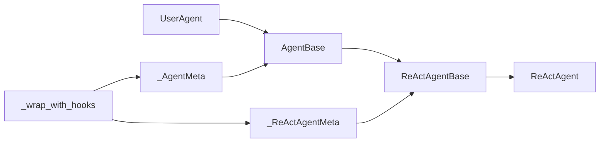

# 继承模式

<cite>
**本文引用的文件**
- [src/agentscope/agent/_agent_base.py](file://src/agentscope/agent/_agent_base.py)
- [src/agentscope/agent/_react_agent_base.py](file://src/agentscope/agent/_react_agent_base.py)
- [src/agentscope/agent/_react_agent.py](file://src/agentscope/agent/_react_agent.py)
- [src/agentscope/agent/_agent_meta.py](file://src/agentscope/agent/_agent_meta.py)
- [src/agentscope/agent/_user_agent.py](file://src/agentscope/agent/_user_agent.py)
- [docs/tutorial/zh_CN/src/quickstart_agent.py](file://docs/tutorial/zh_CN/src/quickstart_agent.py)
- [examples/agent/react_agent/main.py](file://examples/agent/react_agent/main.py)
</cite>

## 目录
1. [简介](#简介)
2. [项目结构](#项目结构)
3. [核心组件](#核心组件)
4. [架构总览](#架构总览)
5. [详细组件分析](#详细组件分析)
6. [依赖关系分析](#依赖关系分析)
7. [性能考量](#性能考量)
8. [故障排查指南](#故障排查指南)
9. [结论](#结论)

## 简介
本节聚焦于 agentscope 中“自定义智能体”的两种继承模式：
- 直接继承 AgentBase：适合完全自定义逻辑的智能体，开发者仅需实现抽象方法并利用框架提供的打印、订阅与钩子机制。
- 继承 ReActAgentBase：在 AgentBase 基础上扩展 ReAct 推理-行动循环，新增 _reasoning 与 _acting 两个抽象方法，并由元类自动注入前后置钩子，便于标准化地组织推理与工具调用流程。

两种模式均通过在子类构造函数中调用 super().__init__() 完成必要的初始化，确保实例级钩子、消息队列、订阅者等基础设施正确建立。

## 项目结构
围绕继承模式的关键文件与职责：
- AgentBase：异步智能体基类，定义 observe/reply/print/handle_interrupt 等抽象接口，内置钩子注册与广播机制。
- ReActAgentBase：在 AgentBase 上扩展 _reasoning 与 _acting 抽象方法，并引入 ReAct 钩子类型（pre/post reasoning/acting）。
- ReActAgent：ReActAgentBase 的具体实现，提供完整的推理-行动循环、工具调用、长短期记忆、结构化输出等能力。
- _agent_meta：定义通用钩子包装器与元类，为 AgentBase 的 reply/print/observe 以及 ReActAgentBase 的 _reasoning/_acting 注入前后置钩子。
- 示例与教程：展示如何在子类中调用 super().__init__() 并实现抽象方法。

图表来源
- [src/agentscope/agent/_agent_base.py](file://src/agentscope/agent/_agent_base.py#L1-L220)
- [src/agentscope/agent/_react_agent_base.py](file://src/agentscope/agent/_react_agent_base.py#L1-L117)
- [src/agentscope/agent/_react_agent.py](file://src/agentscope/agent/_react_agent.py#L1-L120)
- [src/agentscope/agent/_agent_meta.py](file://src/agentscope/agent/_agent_meta.py#L147-L181)
- [src/agentscope/agent/_user_agent.py](file://src/agentscope/agent/_user_agent.py#L12-L77)
- [docs/tutorial/zh_CN/src/quickstart_agent.py](file://docs/tutorial/zh_CN/src/quickstart_agent.py#L160-L220)
- [examples/agent/react_agent/main.py](file://examples/agent/react_agent/main.py#L1-L51)

章节来源
- [src/agentscope/agent/_agent_base.py](file://src/agentscope/agent/_agent_base.py#L1-L220)
- [src/agentscope/agent/_react_agent_base.py](file://src/agentscope/agent/_react_agent_base.py#L1-L117)
- [src/agentscope/agent/_react_agent.py](file://src/agentscope/agent/_react_agent.py#L1-L120)
- [src/agentscope/agent/_agent_meta.py](file://src/agentscope/agent/_agent_meta.py#L147-L181)
- [src/agentscope/agent/_user_agent.py](file://src/agentscope/agent/_user_agent.py#L12-L77)
- [docs/tutorial/zh_CN/src/quickstart_agent.py](file://docs/tutorial/zh_CN/src/quickstart_agent.py#L160-L220)
- [examples/agent/react_agent/main.py](file://examples/agent/react_agent/main.py#L1-L51)

## 核心组件
- AgentBase
  - 抽象方法：observe、reply、handle_interrupt（在基类中抛出未实现异常）
  - 已实现方法：print、__call__、interrupt、订阅与广播、钩子注册/移除/清空
  - 初始化要点：在子类 __init__ 中调用 super().__init__()，以完成实例级钩子字典、消息队列、订阅者表等的初始化
- ReActAgentBase
  - 在 AgentBase 基础上新增：_reasoning、_acting 两个抽象方法
  - 扩展支持的钩子类型：pre_reasoning/post_reasoning/pre_acting/post_acting
  - 初始化要点：同样需在子类 __init__ 中调用 super().__init__()，以初始化推理/行动钩子字典
- ReActAgent
  - 实现了 AgentBase 的 observe/reply/handle_interrupt，以及 ReActAgentBase 的 _reasoning/_acting
  - 内置推理-行动循环、工具调用、长短期记忆、RAG、计划笔记本、结构化输出等高级能力
- 元类与钩子
  - _AgentMeta：为 reply/print/observe 注入前后置钩子
  - _ReActAgentMeta：为 _reasoning/_acting 注入前后置钩子
  - _wrap_with_hooks：统一参数绑定、预钩子链式执行、原函数调用、后置钩子链式修改输出

章节来源
- [src/agentscope/agent/_agent_base.py](file://src/agentscope/agent/_agent_base.py#L140-L220)
- [src/agentscope/agent/_react_agent_base.py](file://src/agentscope/agent/_react_agent_base.py#L1-L117)
- [src/agentscope/agent/_react_agent.py](file://src/agentscope/agent/_react_agent.py#L250-L410)
- [src/agentscope/agent/_agent_meta.py](file://src/agentscope/agent/_agent_meta.py#L147-L181)

## 架构总览
下图展示了两类智能体的继承关系与钩子注入路径，以及 ReActAgent 的推理-行动主循环。

图表来源
- [src/agentscope/agent/_agent_base.py](file://src/agentscope/agent/_agent_base.py#L1-L220)
- [src/agentscope/agent/_react_agent_base.py](file://src/agentscope/agent/_react_agent_base.py#L1-L117)
- [src/agentscope/agent/_react_agent.py](file://src/agentscope/agent/_react_agent.py#L1-L120)
- [src/agentscope/agent/_agent_meta.py](file://src/agentscope/agent/_agent_meta.py#L147-L181)
- [src/agentscope/agent/_user_agent.py](file://src/agentscope/agent/_user_agent.py#L12-L77)

## 详细组件分析

### 直接继承 AgentBase 的实现要点
- 子类构造函数必须调用 super().__init__()，以确保：
  - 初始化实例级钩子字典（pre/post_reply、pre/post_observe、pre/post_print）
  - 初始化消息队列与控制台输出开关
  - 建立订阅者表，以便 reply 结果广播给订阅者
- 必须实现的抽象方法：
  - observe：接收消息但不生成回复（可写入内存、状态等）
  - reply：根据当前状态与输入生成回复消息 Msg
  - handle_interrupt：当用户或其他原因中断时的后处理逻辑
- 可选增强：
  - 使用 register_instance_hook/register_class_hook 注册钩子，拦截或修改 reply/print/observe 的行为
  - 使用 print 流式打印消息内容块，支持文本、思考块与多媒体块
  - 使用 __call__ 触发 reply，并自动广播结果到订阅者

示例参考（构造函数中调用 super().__init__()）：
- 教程示例 MyAgent：[构造函数与初始化](file://docs/tutorial/zh_CN/src/quickstart_agent.py#L165-L178)
- UserAgent：[构造函数与初始化](file://src/agentscope/agent/_user_agent.py#L21-L30)

章节来源
- [src/agentscope/agent/_agent_base.py](file://src/agentscope/agent/_agent_base.py#L140-L220)
- [docs/tutorial/zh_CN/src/quickstart_agent.py](file://docs/tutorial/zh_CN/src/quickstart_agent.py#L165-L178)
- [src/agentscope/agent/_user_agent.py](file://src/agentscope/agent/_user_agent.py#L21-L30)

### 继承 ReActAgentBase 的实现要点
- 子类构造函数必须调用 super().__init__()，以确保：
  - 初始化推理与行动的实例级钩子字典（pre/post reasoning/acting）
  - 继承 AgentBase 的所有能力（钩子、打印、订阅、中断等）
- 必须实现的抽象方法：
  - _reasoning：进行一次推理步骤，返回包含文本与工具调用的消息
  - _acting：执行单个工具调用，返回结构化输出（如成功则返回结构化数据）
- 可选增强：
  - 使用 register_instance_hook/register_class_hook 注册 pre/post reasoning/acting 钩子
  - 利用元类自动注入的钩子链，实现推理前后的日志、限流、校验等横切关注点

ReActAgent 的完整实现参考：
- [ReActAgent.__init__ 参数与初始化](file://src/agentscope/agent/_react_agent.py#L53-L135)
- [ReActAgent.reply 主循环](file://src/agentscope/agent/_react_agent.py#L253-L409)
- [ReActAgent._reasoning 推理步骤](file://src/agentscope/agent/_react_agent.py#L411-L522)
- [ReActAgent._acting 行动步骤](file://src/agentscope/agent/_react_agent.py#L523-L581)

章节来源
- [src/agentscope/agent/_react_agent_base.py](file://src/agentscope/agent/_react_agent_base.py#L1-L117)
- [src/agentscope/agent/_react_agent.py](file://src/agentscope/agent/_react_agent.py#L53-L135)
- [src/agentscope/agent/_react_agent.py](file://src/agentscope/agent/_react_agent.py#L253-L409)
- [src/agentscope/agent/_react_agent.py](file://src/agentscope/agent/_react_agent.py#L411-L581)

### 钩子系统与元类注入
- _wrap_with_hooks：将原始异步函数包裹为带钩子的包装器，负责：
  - 参数规范化（绑定签名、填充默认值）
  - 依次执行实例级与类级 pre 钩子，允许修改参数
  - 调用原始函数，得到输出
  - 依次执行实例级与类级 post 钩子，允许修改输出
- _AgentMeta：为 AgentBase 的 reply/print/observe 注入钩子
- _ReActAgentMeta：为 ReActAgentBase 的 _reasoning/_acting 注入钩子

图表来源
- [src/agentscope/agent/_agent_meta.py](file://src/agentscope/agent/_agent_meta.py#L55-L145)
- [src/agentscope/agent/_agent_meta.py](file://src/agentscope/agent/_agent_meta.py#L147-L181)

章节来源
- [src/agentscope/agent/_agent_meta.py](file://src/agentscope/agent/_agent_meta.py#L55-L145)
- [src/agentscope/agent/_agent_meta.py](file://src/agentscope/agent/_agent_meta.py#L147-L181)

### 推理-行动主循环（ReActAgent.reply）
ReActAgent.reply 实现了标准的推理-行动迭代流程：
- 记录输入消息到短记忆
- 可选：从长期记忆与知识库检索信息
- 进入推理-行动循环（最多 max_iters 次）：
  - 调用 _reasoning 生成包含文本与工具调用的消息
  - 并行或串行执行 _acting，收集结构化输出
  - 若要求结构化输出且尚未满足，则插入提示消息，引导下一步推理
  - 若无工具调用且已满足条件，退出循环并生成最终回复
- 达到最大迭代仍未满足条件时，进入总结阶段生成回复

图表来源
- [src/agentscope/agent/_react_agent.py](file://src/agentscope/agent/_react_agent.py#L253-L409)
- [src/agentscope/agent/_react_agent.py](file://src/agentscope/agent/_react_agent.py#L411-L522)
- [src/agentscope/agent/_react_agent.py](file://src/agentscope/agent/_react_agent.py#L523-L581)

章节来源
- [src/agentscope/agent/_react_agent.py](file://src/agentscope/agent/_react_agent.py#L253-L409)
- [src/agentscope/agent/_react_agent.py](file://src/agentscope/agent/_react_agent.py#L411-L581)

### 示例入口：ReActAgent 的使用
- 示例入口展示了如何创建 ReActAgent，注册工具函数，并与 UserAgent 协作进行对话演示
- 关键点：构造函数中传入模型、格式化器、工具包与内存；随后通过 agent(msg) 触发回复

章节来源
- [examples/agent/react_agent/main.py](file://examples/agent/react_agent/main.py#L1-L51)

## 依赖关系分析
- 继承关系
  - AgentBase 是所有智能体的基础
  - ReActAgentBase 继承 AgentBase，扩展推理-行动抽象
  - ReActAgent 继承 ReActAgentBase，提供完整实现
  - UserAgent 继承 AgentBase，作为用户交互代理
- 元类依赖
  - _AgentMeta 包装 AgentBase 的 reply/print/observe
  - _ReActAgentMeta 包装 ReActAgentBase 的 _reasoning/_acting
- 钩子链
  - 预钩子先于原函数执行，可修改参数
  - 后置钩子在原函数返回后执行，可修改输出
  - 实例级钩子优先于类级钩子执行

图表来源
- [src/agentscope/agent/_agent_base.py](file://src/agentscope/agent/_agent_base.py#L1-L220)
- [src/agentscope/agent/_react_agent_base.py](file://src/agentscope/agent/_react_agent_base.py#L1-L117)
- [src/agentscope/agent/_react_agent.py](file://src/agentscope/agent/_react_agent.py#L1-L120)
- [src/agentscope/agent/_agent_meta.py](file://src/agentscope/agent/_agent_meta.py#L147-L181)

章节来源
- [src/agentscope/agent/_agent_base.py](file://src/agentscope/agent/_agent_base.py#L1-L220)
- [src/agentscope/agent/_react_agent_base.py](file://src/agentscope/agent/_react_agent_base.py#L1-L117)
- [src/agentscope/agent/_react_agent.py](file://src/agentscope/agent/_react_agent.py#L1-L120)
- [src/agentscope/agent/_agent_meta.py](file://src/agentscope/agent/_agent_meta.py#L147-L181)

## 性能考量
- 推理-行动循环的迭代次数与工具调用数量直接影响延迟与资源占用，建议合理设置 max_iters，并在工具调用失败时及时中断
- 并行工具调用可提升吞吐，但会增加并发开销与锁竞争，应根据工具特性与资源限制权衡
- 长期记忆与知识库检索会带来额外的 I/O 成本，建议在必要时才启用，并对检索结果进行缓存
- 流式输出与音频播放会占用 CPU 与 I/O，生产环境可通过禁用控制台输出与消息队列进行优化

## 故障排查指南
- 子类未调用 super().__init__()
  - 现象：实例级钩子字典未初始化，导致 clear_instance_hooks 报错或钩子无效
  - 处理：在子类 __init__ 中显式调用 super().__init__()
- 未实现抽象方法
  - 现象：调用 observe/reply/handle_interrupt 时抛出未实现异常
  - 处理：在子类中实现对应抽象方法
- 钩子返回类型错误
  - 现象：pre 钩子未返回字典或 post 钩子返回非预期类型
  - 处理：严格遵循钩子签名，pre 钩子返回参数字典，post 钩子返回可选输出
- 中断处理
  - 现象：用户中断后未正确生成响应或记录工具调用结果
  - 处理：在子类中实现 handle_interrupt，并在 _acting 中正确抛出取消异常以触发中断分支

章节来源
- [src/agentscope/agent/_agent_base.py](file://src/agentscope/agent/_agent_base.py#L629-L733)
- [src/agentscope/agent/_react_agent.py](file://src/agentscope/agent/_react_agent.py#L582-L687)

## 结论
- 选择继承模式的依据：
  - AgentBase：当你需要完全自定义逻辑，或不需要标准推理-行动循环时
  - ReActAgentBase：当你希望采用标准化的推理-行动范式，并利用框架提供的钩子与工具集成能力
- 无论哪种模式，都必须在子类构造函数中调用 super().__init__()，以确保初始化钩子、消息队列与订阅者等基础设施
- ReActAgent 展示了如何在统一的元类与钩子体系下，将推理、行动、工具、记忆、知识库等模块化能力整合为可扩展的智能体