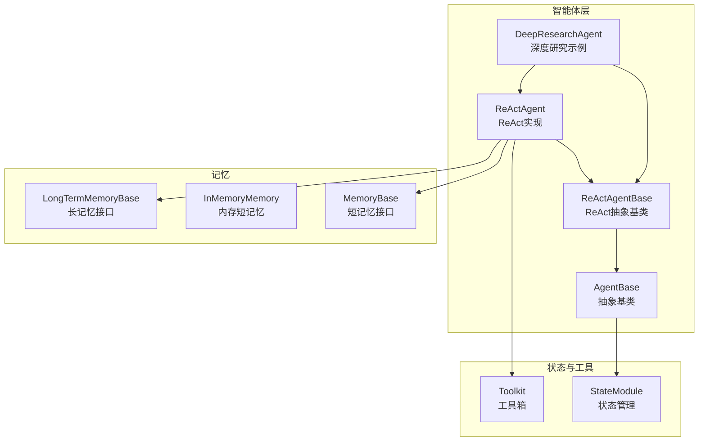
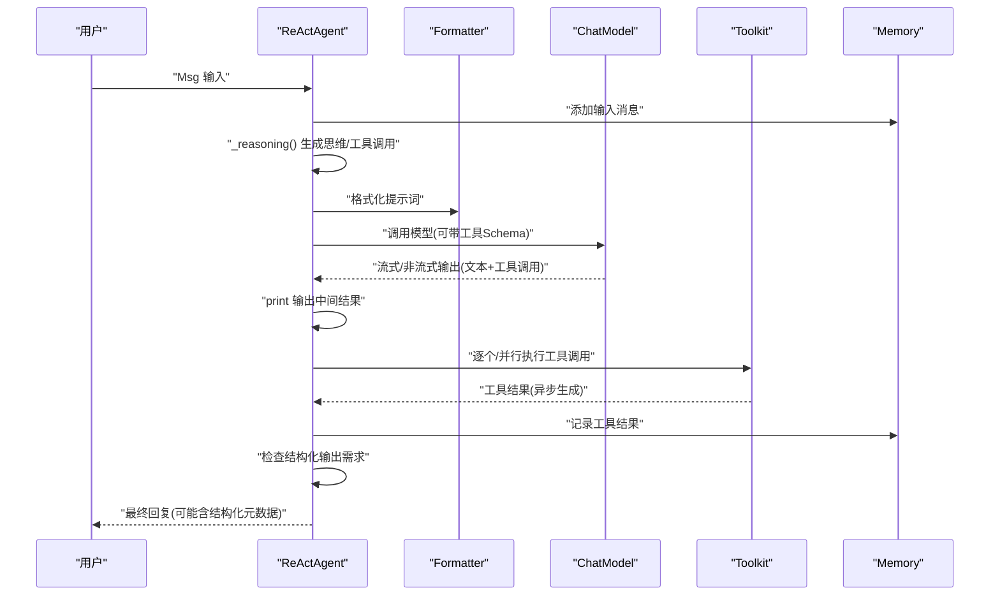
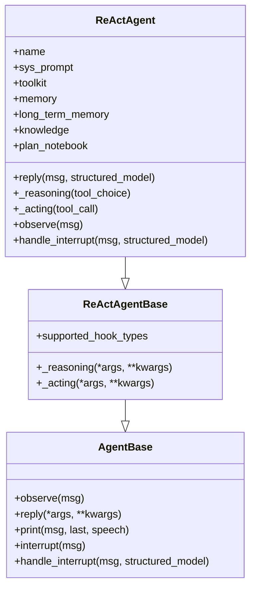
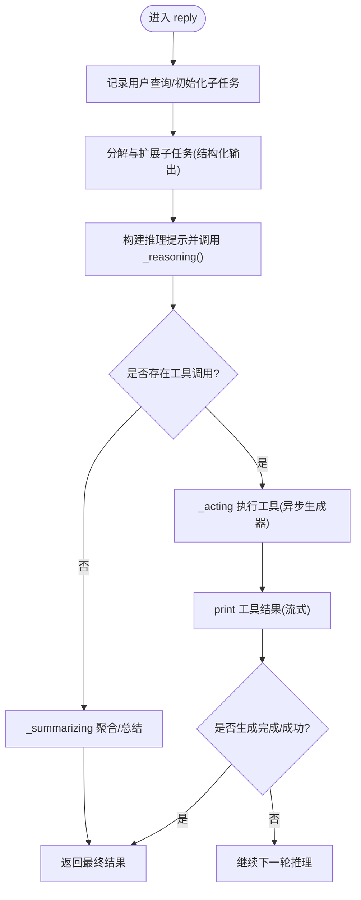
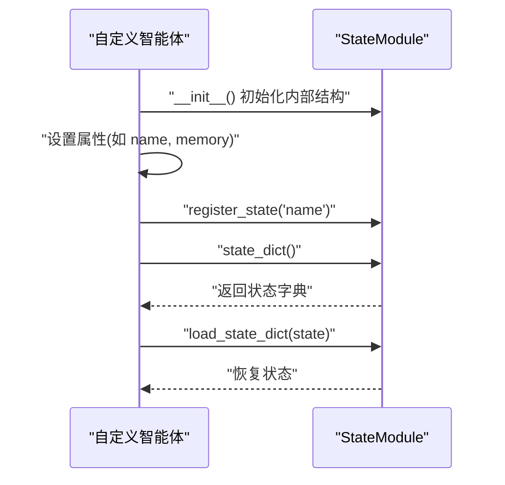
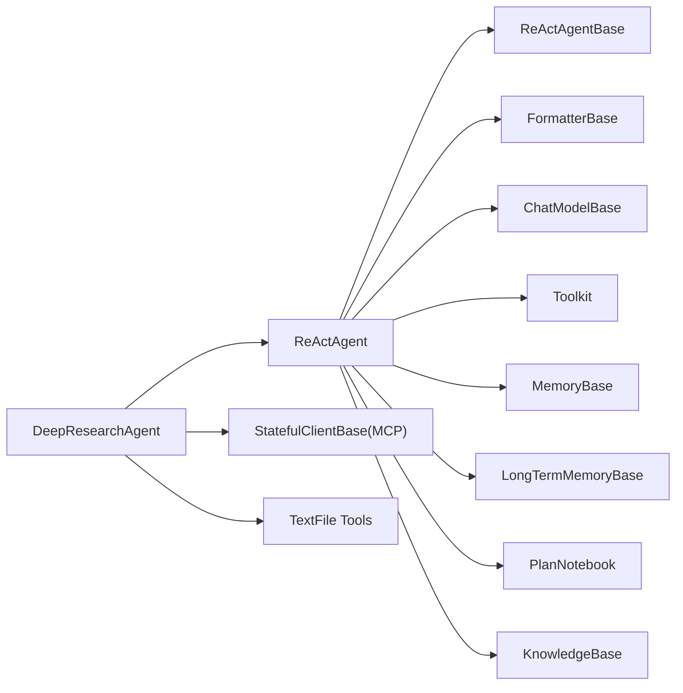

# 自定义智能体实现方法

<cite>
**本文引用的文件**
- [src/agentscope/agent/_agent_base.py](file://src/agentscope/agent/_agent_base.py)
- [src/agentscope/agent/_react_agent_base.py](file://src/agentscope/agent/_react_agent_base.py)
- [src/agentscope/agent/_react_agent.py](file://src/agentscope/agent/_react_agent.py)
- [src/agentscope/module/_state_module.py](file://src/agentscope/module/_state_module.py)
- [examples/agent/deep_research_agent/deep_research_agent.py](file://examples/agent/deep_research_agent/deep_research_agent.py)
- [examples/agent/deep_research_agent/main.py](file://examples/agent/deep_research_agent/main.py)
- [examples/agent/react_agent/main.py](file://examples/agent/react_agent/main.py)
- [src/agentscope/tool/__init__.py](file://src/agentscope/tool/__init__.py)
- [src/agentscope/memory/__init__.py](file://src/agentscope/memory/__init__.py)
</cite>

## 目录
1. [引言](#引言)
2. [项目结构](#项目结构)
3. [核心组件](#核心组件)
4. [架构总览](#架构总览)
5. [详细组件分析](#详细组件分析)
6. [依赖关系分析](#依赖关系分析)
7. [性能与可扩展性建议](#性能与可扩展性建议)
8. [故障排查指南](#故障排查指南)
9. [结论](#结论)
10. [附录：从零开始的实践步骤](#附录从零开始的实践步骤)

## 引言
本指南面向希望从零实现自定义智能体的开发者，基于 agentscope 的 AgentBase 与 ReActAgentBase，系统讲解如何：
- 继承 AgentBase 或 ReActAgentBase 并重写核心方法（reply、observe）
- 在子类构造函数中正确调用 super().__init__() 完成初始化
- 集成模型、工具与记忆系统
- 使用 StateModule 管理智能体状态
- 设计复杂任务的内部逻辑（多轮交互、工具调用决策与结果聚合）

我们将以深度研究智能体（DeepResearchAgent）为完整示例，逐步拆解其设计思路与实现要点，并给出可直接复用的实践步骤。

## 项目结构
agentscope 将智能体相关能力按职责拆分为多个模块：
- agent：智能体基类与具体实现（AgentBase、ReActAgentBase、ReActAgent）
- module：状态管理（StateModule）
- tool：工具与工具箱（Toolkit）
- memory：短长期记忆接口与实现
- examples：示例智能体（如 DeepResearchAgent、ReActAgent 示例）

图表来源
- [src/agentscope/agent/_agent_base.py](file://src/agentscope/agent/_agent_base.py#L1-L200)
- [src/agentscope/agent/_react_agent_base.py](file://src/agentscope/agent/_react_agent_base.py#L1-L117)
- [src/agentscope/agent/_react_agent.py](file://src/agentscope/agent/_react_agent.py#L1-L200)
- [src/agentscope/module/_state_module.py](file://src/agentscope/module/_state_module.py#L1-L152)
- [src/agentscope/tool/__init__.py](file://src/agentscope/tool/__init__.py#L1-L45)
- [src/agentscope/memory/__init__.py](file://src/agentscope/memory/__init__.py#L1-L23)

章节来源
- [src/agentscope/agent/_agent_base.py](file://src/agentscope/agent/_agent_base.py#L1-L200)
- [src/agentscope/agent/_react_agent_base.py](file://src/agentscope/agent/_react_agent_base.py#L1-L117)
- [src/agentscope/agent/_react_agent.py](file://src/agentscope/agent/_react_agent.py#L1-L200)
- [src/agentscope/module/_state_module.py](file://src/agentscope/module/_state_module.py#L1-L152)
- [src/agentscope/tool/__init__.py](file://src/agentscope/tool/__init__.py#L1-L45)
- [src/agentscope/memory/__init__.py](file://src/agentscope/memory/__init__.py#L1-L23)

## 核心组件
- AgentBase：异步智能体抽象基类，定义 observe/reply/print 等核心接口，内置钩子系统与消息广播机制；支持通过 StateModule 进行状态序列化/反序列化。
- ReActAgentBase：在 AgentBase 基础上增加 ReAct 思维与行动的抽象接口（_reasoning、_acting），并扩展钩子类型。
- ReActAgent：ReActAgentBase 的具体实现，集成模型、格式化器、工具箱、短长期记忆、RAG、计划书等，提供完整的推理-行动循环与中断处理。
- StateModule：提供嵌套状态的序列化/反序列化能力，支持注册属性为状态变量。
- Toolkit：工具集合与工具调用执行器，支持动态注册与并行工具调用。
- Memory/LT Memory：短长期记忆接口与实现，用于对话历史与知识检索。

章节来源
- [src/agentscope/agent/_agent_base.py](file://src/agentscope/agent/_agent_base.py#L1-L200)
- [src/agentscope/agent/_react_agent_base.py](file://src/agentscope/agent/_react_agent_base.py#L1-L117)
- [src/agentscope/agent/_react_agent.py](file://src/agentscope/agent/_react_agent.py#L1-L200)
- [src/agentscope/module/_state_module.py](file://src/agentscope/module/_state_module.py#L1-L152)
- [src/agentscope/tool/__init__.py](file://src/agentscope/tool/__init__.py#L1-L45)
- [src/agentscope/memory/__init__.py](file://src/agentscope/memory/__init__.py#L1-L23)

## 架构总览
下图展示了 ReActAgent 的核心工作流：输入消息经格式化器转为模型输入，模型生成包含文本与工具调用的响应；工具执行后将结果写入记忆并通过打印输出；根据是否需要结构化输出决定退出条件或继续推理。

图表来源
- [src/agentscope/agent/_react_agent.py](file://src/agentscope/agent/_react_agent.py#L250-L408)
- [src/agentscope/agent/_react_agent.py](file://src/agentscope/agent/_react_agent.py#L523-L581)
- [src/agentscope/agent/_react_agent.py](file://src/agentscope/agent/_react_agent.py#L411-L522)

章节来源
- [src/agentscope/agent/_react_agent.py](file://src/agentscope/agent/_react_agent.py#L250-L408)
- [src/agentscope/agent/_react_agent.py](file://src/agentscope/agent/_react_agent.py#L523-L581)
- [src/agentscope/agent/_react_agent.py](file://src/agentscope/agent/_react_agent.py#L411-L522)

## 详细组件分析

### ReActAgentBase 与 ReActAgent
- ReActAgentBase 扩展了 AgentBase，新增 _reasoning 与 _acting 抽象方法，并引入 ReAct 钩子类型（pre/post reasoning/acting）。
- ReActAgent 实现了完整的推理-行动循环：先推理生成文本与工具调用，再执行工具，根据是否需要结构化输出决定退出或继续推理；支持中断与 TTS 输出。

图表来源
- [src/agentscope/agent/_agent_base.py](file://src/agentscope/agent/_agent_base.py#L180-L204)
- [src/agentscope/agent/_react_agent_base.py](file://src/agentscope/agent/_react_agent_base.py#L1-L117)
- [src/agentscope/agent/_react_agent.py](file://src/agentscope/agent/_react_agent.py#L1-L200)

章节来源
- [src/agentscope/agent/_react_agent_base.py](file://src/agentscope/agent/_react_agent_base.py#L1-L117)
- [src/agentscope/agent/_react_agent.py](file://src/agentscope/agent/_react_agent.py#L1-L200)

### DeepResearchAgent（完整示例）
DeepResearchAgent 继承 ReActAgent，展示了如何：
- 在构造函数中调用 super().__init__() 完成 ReActAgent 初始化
- 注册工具（本地文件读写、MCP 搜索客户端）、设置系统提示、限制工具结果长度
- 在 reply 中进行子任务分解与扩展、多轮推理-行动、中间结果聚合与总结
- 在 _acting 中处理工具异步生成器、打印中间结果、更新记忆与触发后续子任务

图表来源
- [examples/agent/deep_research_agent/deep_research_agent.py](file://examples/agent/deep_research_agent/deep_research_agent.py#L194-L278)
- [examples/agent/deep_research_agent/deep_research_agent.py](file://examples/agent/deep_research_agent/deep_research_agent.py#L279-L379)
- [src/agentscope/agent/_react_agent.py](file://src/agentscope/agent/_react_agent.py#L250-L408)

章节来源
- [examples/agent/deep_research_agent/deep_research_agent.py](file://examples/agent/deep_research_agent/deep_research_agent.py#L194-L379)
- [src/agentscope/agent/_react_agent.py](file://src/agentscope/agent/_react_agent.py#L250-L408)

### StateModule 状态管理最佳实践
- 在智能体构造函数中必须先调用 super().__init__()，以初始化 StateModule 的内部结构（模块字典与属性字典），否则在设置属性时会抛出异常。
- 使用 register_state 注册需要持久化的状态变量，支持自定义 JSON 序列化/反序列化函数。
- 通过 state_dict/load_state_dict 实现智能体状态的保存与恢复，便于多轮运行与断点续跑。

图表来源
- [src/agentscope/module/_state_module.py](file://src/agentscope/module/_state_module.py#L1-L152)
- [src/agentscope/agent/_react_agent.py](file://src/agentscope/agent/_react_agent.py#L233-L242)

章节来源
- [src/agentscope/module/_state_module.py](file://src/agentscope/module/_state_module.py#L1-L152)
- [src/agentscope/agent/_react_agent.py](file://src/agentscope/agent/_react_agent.py#L233-L242)

### 集成模型、工具与记忆系统
- 模型：通过 ChatModelBase 提供统一的模型接口，支持流式/非流式输出与多模态语音合成。
- 工具：使用 Toolkit 注册工具函数，支持并行工具调用；工具执行通过异步生成器返回增量结果，ReActAgent 在 _acting 中逐块打印并记录。
- 记忆：短记忆 InMemoryMemory 存储对话历史；可选长记忆 LongTermMemoryBase 在静态/代理控制模式下参与检索与记录。

章节来源
- [src/agentscope/agent/_react_agent.py](file://src/agentscope/agent/_react_agent.py#L135-L226)
- [src/agentscope/tool/__init__.py](file://src/agentscope/tool/__init__.py#L1-L45)
- [src/agentscope/memory/__init__.py](file://src/agentscope/memory/__init__.py#L1-L23)

## 依赖关系分析
- ReActAgent 依赖 ReActAgentBase、FormatterBase、ChatModelBase、Toolkit、MemoryBase、LongTermMemoryBase、PlanNotebook、KnowledgeBase 等组件。
- DeepResearchAgent 依赖 ReActAgent，并额外集成 MCP 客户端与本地文件工具，形成“搜索-提取-反思-总结”的闭环。

图表来源
- [src/agentscope/agent/_react_agent.py](file://src/agentscope/agent/_react_agent.py#L1-L200)
- [examples/agent/deep_research_agent/deep_research_agent.py](file://examples/agent/deep_research_agent/deep_research_agent.py#L1-L120)

章节来源
- [src/agentscope/agent/_react_agent.py](file://src/agentscope/agent/_react_agent.py#L1-L200)
- [examples/agent/deep_research_agent/deep_research_agent.py](file://examples/agent/deep_research_agent/deep_research_agent.py#L1-L120)

## 性能与可扩展性建议
- 工具调用并行化：当模型一次性生成多个工具调用时，可启用 parallel_tool_calls 以提升吞吐。
- 流式输出与 TTS：利用 print 的流式输出与 TTS 合成，改善用户体验；注意在中断场景下及时清理资源。
- 记忆与检索：合理配置长短期记忆模式与知识库检索策略，避免上下文过长导致性能下降。
- 结构化输出：仅在必要时启用结构化输出，减少不必要的推理-行动迭代次数。

[本节为通用建议，不直接分析具体文件]

## 故障排查指南
- 构造函数未调用 super().__init__()：StateModule 在设置属性前会校验初始化，未初始化将抛出异常。请确保在自定义智能体构造函数中先调用父类初始化。
- 钩子注册与移除：若实例/类级钩子未生效，请确认已正确注册且名称唯一；移除时需匹配正确的钩子类型与名称。
- 工具调用中断：ReActAgent 在工具执行过程中支持中断，中断后会生成“被中断”的工具结果并写入记忆；可在 handle_interrupt 中定制中断后的响应。
- 日志与调试：DeepResearchAgent 示例中使用 setup_logger 输出日志，便于定位问题；ReActAgent 的 main 示例展示了基本的用户-智能体交互流程。

章节来源
- [src/agentscope/module/_state_module.py](file://src/agentscope/module/_state_module.py#L1-L152)
- [src/agentscope/agent/_agent_base.py](file://src/agentscope/agent/_agent_base.py#L630-L658)
- [src/agentscope/agent/_react_agent.py](file://src/agentscope/agent/_react_agent.py#L582-L687)
- [examples/agent/deep_research_agent/main.py](file://examples/agent/deep_research_agent/main.py#L1-L84)
- [examples/agent/react_agent/main.py](file://examples/agent/react_agent/main.py#L1-L51)

## 结论
通过 AgentBase/ReActAgentBase 的抽象与 ReActAgent 的实现，agentscope 提供了高度可扩展的智能体框架。结合 StateModule 的状态管理、Toolkit 的工具集成与 Memory/LT Memory 的记忆能力，开发者可以快速构建从简单到复杂的多轮交互智能体。DeepResearchAgent 作为完整示例，展示了如何在真实任务中组织推理-行动循环、工具调用与结果聚合。

[本节为总结，不直接分析具体文件]

## 附录：从零开始的实践步骤

### 步骤一：选择基类并继承
- 若需要标准的异步智能体能力（observe/reply/print），继承 AgentBase，并重写 observe 与 reply。
- 若需要 ReAct 流程（推理-行动），继承 ReActAgentBase，并实现 _reasoning 与 _acting；或直接继承 ReActAgent 以获得完整实现。

章节来源
- [src/agentscope/agent/_agent_base.py](file://src/agentscope/agent/_agent_base.py#L180-L204)
- [src/agentscope/agent/_react_agent_base.py](file://src/agentscope/agent/_react_agent_base.py#L1-L117)
- [src/agentscope/agent/_react_agent.py](file://src/agentscope/agent/_react_agent.py#L1-L200)

### 步骤二：在构造函数中正确初始化
- 必须在自定义智能体构造函数中调用 super().__init__()，以初始化 StateModule 内部结构。
- 注册需要持久化的状态变量，使用 register_state 并提供必要的 JSON 序列化/反序列化函数。

章节来源
- [src/agentscope/module/_state_module.py](file://src/agentscope/module/_state_module.py#L1-L152)
- [src/agentscope/agent/_react_agent.py](file://src/agentscope/agent/_react_agent.py#L233-L242)

### 步骤三：集成模型、工具与记忆
- 模型：注入 ChatModelBase 实例，支持流式输出与多模态语音合成。
- 工具：使用 Toolkit 注册工具函数，支持并行工具调用；在 _acting 中处理工具异步生成器并打印中间结果。
- 记忆：注入 MemoryBase 与可选 LongTermMemoryBase，配合检索/记录策略优化上下文长度与质量。

章节来源
- [src/agentscope/agent/_react_agent.py](file://src/agentscope/agent/_react_agent.py#L135-L226)
- [src/agentscope/tool/__init__.py](file://src/agentscope/tool/__init__.py#L1-L45)
- [src/agentscope/memory/__init__.py](file://src/agentscope/memory/__init__.py#L1-L23)

### 步骤四：设计内部逻辑（多轮交互、工具调用与聚合）
- 在 reply 中组织多轮推理-行动循环，依据是否需要结构化输出决定退出条件。
- 在 _acting 中处理工具调用的异步生成器，逐块打印并记录至记忆，必要时触发后续子任务。
- 使用中间记忆与总结工具对阶段性结果进行聚合，最终生成报告或答案。

章节来源
- [examples/agent/deep_research_agent/deep_research_agent.py](file://examples/agent/deep_research_agent/deep_research_agent.py#L194-L379)
- [src/agentscope/agent/_react_agent.py](file://src/agentscope/agent/_react_agent.py#L250-L408)

### 步骤五：参考示例与运行验证
- 参考 ReActAgent 示例，了解基本的用户-智能体交互流程。
- 参考 DeepResearchAgent 示例，学习复杂任务的组织方式与工具链集成。

章节来源
- [examples/agent/react_agent/main.py](file://examples/agent/react_agent/main.py#L1-L51)
- [examples/agent/deep_research_agent/main.py](file://examples/agent/deep_research_agent/main.py#L1-L84)