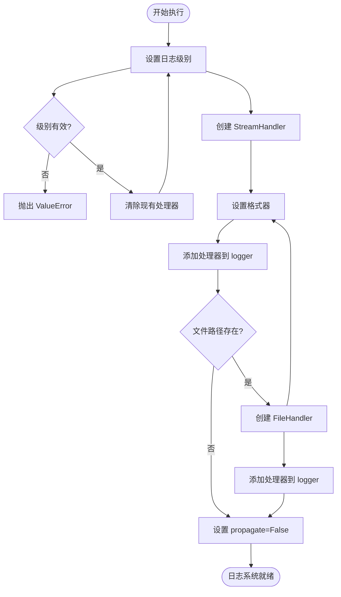
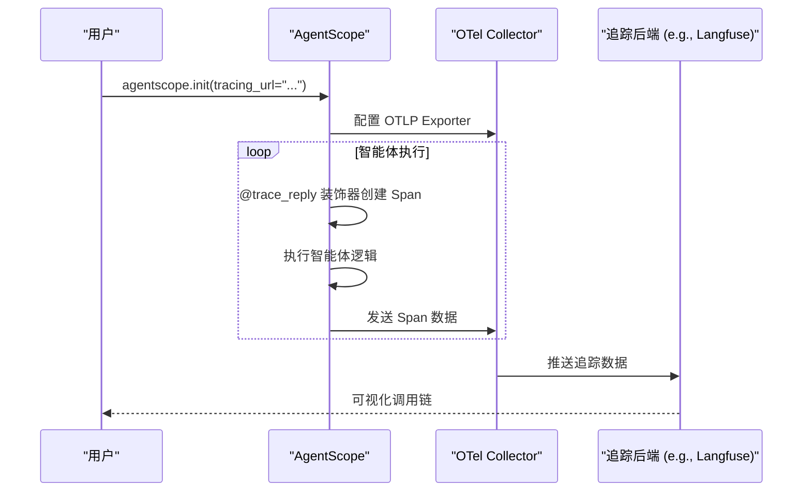
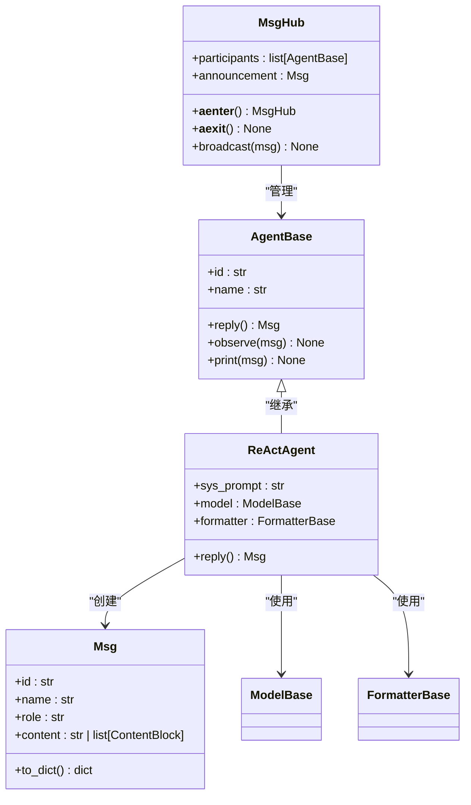

# 可维护性

<cite>
**本文档中引用的文件**  
- [__init__.py](file://src/agentscope/__init__.py)
- [_logging.py](file://src/agentscope/_logging.py)
- [tracing/_setup.py](file://src/agentscope/tracing/_setup.py)
- [tracing/_trace.py](file://src/agentscope/tracing/_trace.py)
- [agent/_agent_base.py](file://src/agentscope/agent/_agent_base.py)
- [pipeline/_msghub.py](file://src/agentscope/pipeline/_msghub.py)
- [message/_message_base.py](file://src/agentscope/message/_message_base.py)
- [module/_state_module.py](file://src/agentscope/module/_state_module.py)
- [hooks/_studio_hooks.py](file://src/agentscope/hooks/_studio_hooks.py)
- [CONTRIBUTING.md](file://CONTRIBUTING.md)
- [examples/workflows/multiagent_conversation/main.py](file://examples/workflows/multiagent_conversation/main.py)
- [examples/agent/deep_research_agent/main.py](file://examples/agent/deep_research_agent/main.py)
</cite>

## 目录
1. [引言](#引言)
2. [代码组织原则](#代码组织原则)
3. [日志记录策略](#日志记录策略)
4. [监控集成方法](#监控集成方法)
5. [文档编写规范](#文档编写规范)
6. [多智能体系统可维护性实践](#多智能体系统可维护性实践)
7. [结论](#结论)

## 引言

AgentScope 是一个用于构建多智能体系统的框架，其设计充分考虑了可维护性。本指南将深入探讨该框架在代码组织、日志记录、监控集成和文档编写方面的最佳实践，旨在帮助开发者构建易于维护、调试和扩展的多智能体应用。

通过分析其源代码结构和设计模式，我们可以看到 AgentScope 采用了模块化、分层和关注点分离的设计原则。核心功能被清晰地划分为独立的模块，如 `agent`、`model`、`message`、`tracing` 等，每个模块都有明确的职责。这种设计不仅提高了代码的可读性和可测试性，也为未来的功能扩展和维护提供了坚实的基础。

**Section sources**
- [__init__.py](file://src/agentscope/__init__.py#L1-L183)

## 代码组织原则

### 模块划分

AgentScope 的代码库遵循清晰的模块化结构，将不同的功能职责分离到独立的包中。这种划分方式极大地提升了代码的可维护性。

- **`agent` 模块**: 包含所有与智能体行为相关的逻辑，如 `AgentBase` 基类和 `ReActAgent` 等具体实现。它负责处理智能体的回复、观察和交互逻辑。
- **`model` 模块**: 封装了与大语言模型（LLM）的交互，如 `OpenAIModel`、`DashScopeModel` 等。它抽象了不同模型提供商的API差异。
- **`message` 模块**: 定义了消息的结构和格式，核心是 `Msg` 类，用于在智能体之间传递信息。
- **`tracing` 模块**: 负责集成 OpenTelemetry 进行分布式追踪，包含 `setup_tracing` 和 `trace` 装饰器等。
- **`pipeline` 模块**: 提供了构建智能体工作流的工具，如 `MsgHub` 用于管理智能体间的通信。
- **`formatter` 模块**: 处理消息格式化，将内部的 `Msg` 对象转换为特定模型API所需的格式。
- **`tool` 模块**: 管理工具调用，允许智能体使用外部工具来增强其能力。

这种基于功能的模块划分使得开发者可以快速定位相关代码，理解系统架构，并在不影响其他部分的情况下独立地修改或扩展特定功能。

```mermaid
graph TD
subgraph "核心模块"
A[agent]
B[model]
C[message]
D[tracing]
E[pipeline]
F[formatter]
G[tool]
end
A --> C : "发送/接收"
B --> F : "格式化请求"
F --> B : "发送API调用"
A --> B : "生成回复"
E --> A : "协调通信"
D --> A : "追踪执行"
G --> A : "提供工具"
```

**Diagram sources**
- [__init__.py](file://src/agentscope/__init__.py#L44-L59)
- [agent/_agent_base.py](file://src/agentscope/agent/_agent_base.py#L30-L733)
- [model/_model_base.py](file://src/agentscope/model/_model_base.py)
- [message/_message_base.py](file://src/agentscope/message/_message_base.py#L21-L242)

### 命名规范

AgentScope 严格遵守 Python 的命名约定，并在此基础上建立了一套清晰的内部规范。

- **类名**: 采用大驼峰命名法（PascalCase），如 `AgentBase`、`MsgHub`、`ReActAgent`。这使得类在代码中非常醒目。
- **函数和方法名**: 采用小写下划线命名法（snake_case），如 `setup_logger`、`register_instance_hook`。这符合 Python 的 PEP 8 风格指南。
- **变量名**: 同样使用小写下划线命名法，对于私有或内部使用的变量，通常以单下划线开头，如 `_config`、`_disable_console_output`。
- **模块和包名**: 使用小写字母，多个单词间用下划线连接，如 `tracing`、`_logging`。

此外，项目还通过 `__all__` 变量明确地导出了公共API，这有助于区分内部实现和外部接口，防止用户依赖未公开的内部细节。

**Section sources**
- [__init__.py](file://src/agentscope/__init__.py#L159-L182)
- [agent/_agent_base.py](file://src/agentscope/agent/_agent_base.py#L30-L733)

## 日志记录策略

### 日志级别设置

AgentScope 的日志系统设计灵活，支持多种日志级别，以适应不同的运行环境和调试需求。

通过 `setup_logger` 函数，用户可以设置日志级别为 "INFO"、"DEBUG"、"WARNING"、"ERROR" 或 "CRITICAL"。默认级别为 "INFO"，这在生产环境中提供了足够的信息而不会产生过多的噪音。

- **DEBUG**: 用于输出详细的调试信息，例如智能体内部状态、消息处理的详细步骤等。在开发和故障排查时非常有用。
- **INFO**: 记录程序运行的关键事件，如初始化完成、智能体开始回复等。这是默认级别，适合常规监控。
- **WARNING**: 记录潜在的问题，例如无法连接到某个服务，但程序仍能继续运行。
- **ERROR** 和 **CRITICAL**: 记录导致程序部分或完全失败的严重错误。

在示例代码中，可以通过 `logger.setLevel("DEBUG")` 来启用更详细的日志输出，这对于理解智能体的决策过程至关重要。

### 结构化日志输出

AgentScope 采用结构化的日志格式，这极大地提高了日志的可解析性和可读性。

日志格式定义为：
`%(asctime)s | %(levelname)-7s | %(module)s:%(funcName)s:%(lineno)s - %(message)s`

这个格式包含了：
- **时间戳** (`%(asctime)s`): 精确到毫秒，便于追踪事件发生的时间顺序。
- **日志级别** (`%(levelname)-7s`): 清晰地标明日志的严重程度。
- **模块、函数和行号** (`%(module)s:%(funcName)s:%(lineno)s`): 精确定位日志的来源，这是调试的关键。
- **消息内容** (`%(message)s`): 实际的日志信息。

这种结构化的输出使得日志可以轻松地被 ELK Stack、Loki 等日志分析平台收集和分析。

### 追踪ID传播

虽然日志系统本身不直接处理追踪ID，但它与 `tracing` 模块紧密集成。当启用 OpenTelemetry 追踪时，每个追踪（Trace）和跨度（Span）都有唯一的ID。这些ID会作为属性被记录在日志中，从而实现了日志与追踪的关联。开发者可以通过追踪ID在日志系统中搜索到与特定请求相关的所有日志条目，形成完整的调用链视图。



**Diagram sources**
- [_logging.py](file://src/agentscope/_logging.py#L15-L47)

**Section sources**
- [_logging.py](file://src/agentscope/_logging.py#L1-L48)

## 监控集成方法

### OpenTelemetry 支持

AgentScope 原生支持 OpenTelemetry (OTel) 标准，这是实现可观察性的行业标准。通过 `tracing` 模块，开发者可以轻松地将应用的追踪数据发送到任何兼容 OTLP (OpenTelemetry Protocol) 的后端。

核心集成点包括：
- **`setup_tracing(endpoint: str)`**: 此函数初始化 OpenTelemetry TracerProvider 并配置一个 `OTLPSpanExporter`，将追踪数据发送到指定的 `endpoint`。
- **`@trace`, `@trace_reply`, `@trace_llm` 等装饰器**: 这些装饰器可以自动为函数调用创建跨度（Spans），记录函数的输入、输出和执行时间。

### 集成第三方平台

AgentScope 可以无缝集成多种第三方监控和可观测性平台。



**Diagram sources**
- [tracing/_setup.py](file://src/agentscope/tracing/_setup.py#L11-L39)
- [tracing/_trace.py](file://src/agentscope/tracing/_trace.py#L369-L404)
- [docs/tutorial/zh_CN/src/task_tracing.py](file://docs/tutorial/zh_CN/src/task_tracing.py#L44-L72)

#### 阿里云云监控 (Alibaba Cloud CloudMonitor)

要连接到阿里云云监控，只需在 `agentscope.init()` 中设置 `tracing_url` 参数：

```python
agentscope.init(tracing_url="https://tracing-cn-hangzhou.arms.aliyuncs.com/adapt_xxx/api/otlp/traces")
```

#### Arize-Phoenix 和 Langfuse

同样，对于 Arize-Phoenix 或 Langfuse，提供它们的 OTLP 兼容端点即可：

```python
agentscope.init(tracing_url="https://api.arize.com/v1/traces")
# 或
agentscope.init(tracing_url="https://cloud.langfuse.com/api/public/trace")
```

这种标准化的集成方式使得切换监控后端变得非常简单，无需修改应用代码，只需更改配置。

**Section sources**
- [tracing/_setup.py](file://src/agentscope/tracing/_setup.py#L11-L50)
- [__init__.py](file://src/agentscope/__init__.py#L72-L157)
- [docs/tutorial/zh_CN/src/task_tracing.py](file://docs/tutorial/zh_CN/src/task_tracing.py#L44-L72)

## 文档编写规范

### 代码注释与外部文档同步

AgentScope 项目严格遵守文档编写规范，确保代码注释与外部文档保持同步。

- **代码内文档字符串 (Docstrings)**: 所有公共类、函数和方法都包含详细的文档字符串，遵循 Google 或 Sphinx 风格。这些文档字符串描述了参数、返回值、异常和函数用途。
- **外部文档**: 位于 `docs/` 目录下的教程和 API 文档是自动生成的，其源码来自代码中的文档字符串。这确保了外部文档与代码实现的一致性。
- **贡献指南**: `CONTRIBUTING.md` 文件明确规定了贡献者在添加新功能时必须更新相关文档，包括 README 和示例。

### 示例驱动的开发

项目采用“示例优先”的开发流程。新的功能和智能体首先在 `examples/` 目录下作为原型实现。这些示例本身就是最好的文档，展示了如何使用框架的各个部分。当一个模式被证明是通用和有价值的，它才会被抽象并集成到核心库中。

例如，`examples/workflows/multiagent_conversation/main.py` 清晰地展示了如何使用 `MsgHub` 和 `sequential_pipeline` 构建一个多智能体对话。

**Section sources**
- [CONTRIBUTING.md](file://CONTRIBUTING.md#L1-L246)
- [examples/workflows/multiagent_conversation/main.py](file://examples/workflows/multiagent_conversation/main.py#L1-L81)

## 多智能体系统可维护性实践

### 实际案例：多智能体对话

让我们通过一个实际案例来展示如何构建一个易于维护的多智能体系统。



**Diagram sources**
- [agent/_agent_base.py](file://src/agentscope/agent/_agent_base.py#L30-L733)
- [message/_message_base.py](file://src/agentscope/message/_message_base.py#L21-L242)
- [pipeline/_msghub.py](file://src/agentscope/pipeline/_msghub.py#L14-L157)
- [examples/workflows/multiagent_conversation/main.py](file://examples/workflows/multiagent_conversation/main.py#L1-L81)

#### 代码结构分析

1.  **初始化**: 调用 `agentscope.init()` 来配置项目名称、日志路径和追踪URL。这一步集中了所有全局配置。
2.  **创建智能体**: 使用 `ReActAgent` 类创建多个智能体实例，每个实例都有独特的名称、系统提示和模型配置。这体现了配置与代码的分离。
3.  **构建通信枢纽**: 使用 `MsgHub` 上下文管理器将智能体组织在一起。`MsgHub` 自动处理智能体间的 `observe` 调用，极大地简化了通信逻辑。
4.  **执行工作流**: 使用 `sequential_pipeline` 函数按顺序执行智能体，代码简洁明了。

这种结构将复杂的多智能体交互分解为清晰、可复用的组件，使得系统易于理解、测试和修改。

**Section sources**
- [examples/workflows/multiagent_conversation/main.py](file://examples/workflows/multiagent_conversation/main.py#L1-L81)
- [__init__.py](file://src/agentscope/__init__.py#L72-L157)
- [pipeline/_msghub.py](file://src/agentscope/pipeline/_msghub.py#L14-L157)

## 结论

AgentScope 框架通过精心设计的代码组织、强大的日志和追踪功能以及严格的文档规范，为构建可维护的多智能体系统提供了坚实的基础。其模块化架构、对 OpenTelemetry 的原生支持以及示例驱动的开发模式，共同确保了系统的长期可维护性。

遵循本指南中的原则，开发者可以构建出不仅功能强大，而且易于调试、监控和扩展的智能体应用。通过利用 `MsgHub` 简化通信、使用结构化日志进行故障排查、以及通过 OpenTelemetry 追踪性能瓶颈，可以显著降低多智能体系统的运维复杂度。