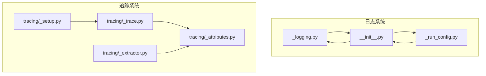
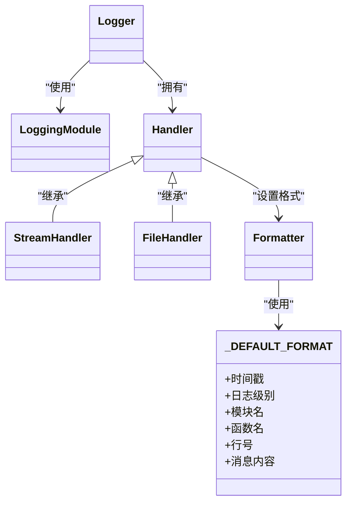
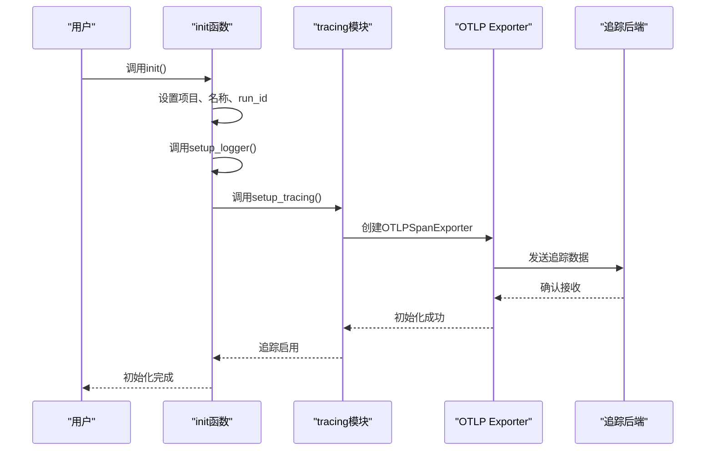
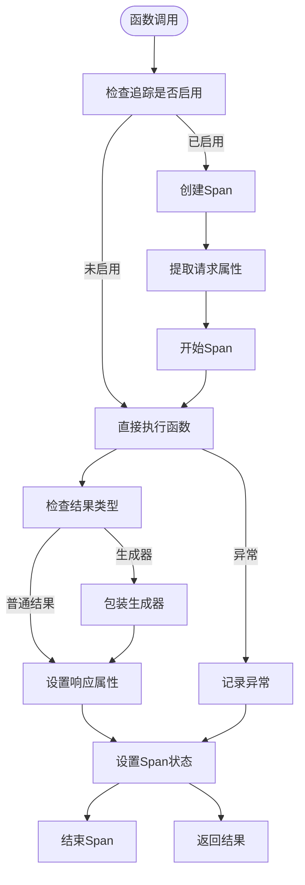
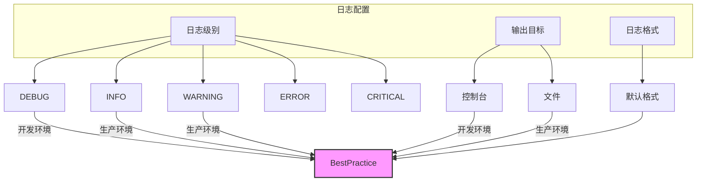

# 日志记录

<cite>
**本文档中引用的文件**  
- [src\agentscope\_logging.py](file://src\agentscope\_logging.py)
- [src\agentscope\__init__.py](file://src\agentscope\__init__.py)
- [src\agentscope\_run_config.py](file://src\agentscope\_run_config.py)
- [src\agentscope\tracing\_setup.py](file://src\agentscope\tracing\_setup.py)
- [src\agentscope\tracing\_trace.py](file://src\agentscope\tracing\_trace.py)
- [src\agentscope\tracing\_attributes.py](file://src\agentscope\tracing\_attributes.py)
- [src\agentscope\tracing\_extractor.py](file://src\agentscope\tracing\_extractor.py)
</cite>

## 目录
1. [项目结构](#项目结构)
2. [核心日志系统设计](#核心日志系统设计)
3. [日志与追踪系统集成](#日志与追踪系统集成)
4. [结构化日志生成机制](#结构化日志生成机制)
5. [日志配置最佳实践](#日志配置最佳实践)

## 项目结构

agentscope的日志系统主要分布在`src\agentscope`目录下的多个模块中，核心日志功能由`_logging.py`文件实现，而追踪系统则分布在`tracing`子模块中。

**图源**
- [src\agentscope\_logging.py](file://src\agentscope\_logging.py)
- [src\agentscope\__init__.py](file://src\agentscope\__init__.py)
- [src\agentscope\_run_config.py](file://src\agentscope\_run_config.py)
- [src\agentscope\tracing\_setup.py](file://src\agentscope\tracing\_setup.py)
- [src\agentscope\tracing\_trace.py](file://src\agentscope\tracing\_trace.py)
- [src\agentscope\tracing\_attributes.py](file://src\agentscope\tracing\_attributes.py)
- [src\agentscope\tracing\_extractor.py](file://src\agentscope\tracing\_extractor.py)

**章节来源**
- [src\agentscope\_logging.py](file://src\agentscope\_logging.py)
- [src\agentscope\__init__.py](file://src\agentscope\__init__.py)

## 核心日志系统设计

agentscope的日志系统基于Python标准库的`logging`模块进行封装，提供了简洁的API来配置日志级别、格式和输出目标。系统通过`_logging.py`文件中的`setup_logger`函数实现日志配置。

日志系统的核心设计特点包括：

1. **统一日志格式**：使用预定义的`_DEFAULT_FORMAT`格式字符串，包含时间戳、日志级别、模块名、函数名、行号和消息内容。
2. **灵活的输出目标**：支持同时输出到控制台和文件，通过`filepath`参数指定日志文件路径。
3. **日志级别控制**：支持"INFO"、"DEBUG"、"WARNING"、"ERROR"、"CRITICAL"五种日志级别，通过`level`参数配置。
4. **命名空间隔离**：使用"as"作为日志记录器名称，避免与其他库的日志冲突。

**图源**
- [src\agentscope\_logging.py](file://src\agentscope\_logging.py)

**章节来源**
- [src\agentscope\_logging.py](file://src\agentscope\_logging.py)

## 日志与追踪系统集成

agentscope的日志系统与追踪系统深度集成，通过OpenTelemetry实现分布式追踪，确保`trace_id`在分布式上下文中的传播一致性。这种集成主要通过`tracing`模块实现。

系统通过`init`函数中的`setup_tracing`调用来配置追踪端点，支持连接到第三方OpenTelemetry平台（如Arize-Phoenix和Langfuse）或AgentScope Studio的追踪端点。当`tracing_url`或`studio_url`提供时，系统会自动启用追踪功能。

**图源**
- [src\agentscope\__init__.py](file://src\agentscope\__init__.py)
- [src\agentscope\tracing\_setup.py](file://src\agentscope\tracing\_setup.py)

**章节来源**
- [src\agentscope\__init__.py](file://src\agentscope\__init__.py)
- [src\agentscope\tracing\_setup.py](file://src\agentscope\tracing\_setup.py)

## 结构化日志生成机制

agentscope通过装饰器模式实现结构化日志的生成，将智能体交互、模型调用等关键事件以JSON格式记录。系统使用一系列装饰器（如`trace`、`trace_llm`、`trace_reply`等）来捕获函数调用的输入、输出和异常信息。

结构化日志的生成机制主要包括：

1. **通用追踪装饰器**：`trace`装饰器用于同步和异步函数，自动捕获函数调用的请求和响应。
2. **专用追踪装饰器**：针对不同组件（如LLM调用、工具调用、格式化等）提供专用装饰器，如`trace_llm`、`trace_toolkit`、`trace_format`等。
3. **属性提取**：通过`_extractor.py`中的函数提取通用属性、代理请求属性、LLM请求属性等，并将其作为追踪上下文的一部分。
4. **Span管理**：使用OpenTelemetry的Span概念来表示操作的执行范围，自动处理Span的开始和结束。

**图源**
- [src\agentscope\tracing\_trace.py](file://src\agentscope\tracing\_trace.py)
- [src\agentscope\tracing\_extractor.py](file://src\agentscope\tracing\_extractor.py)

**章节来源**
- [src\agentscope\tracing\_trace.py](file://src\agentscope\tracing\_trace.py)
- [src\agentscope\tracing\_extractor.py](file://src\agentscope\tracing\_extractor.py)

## 日志配置最佳实践

为了根据部署环境调整日志verbosity，建议遵循以下最佳实践：

1. **开发环境**：使用"DEBUG"级别，便于调试和问题排查。
2. **生产环境**：使用"INFO"或"WARNING"级别，避免过多的日志输出影响性能。
3. **错误排查**：临时将级别调整为"DEBUG"，收集必要的调试信息后恢复原级别。
4. **日志文件管理**：定期轮转和清理日志文件，避免占用过多磁盘空间。
5. **敏感信息保护**：确保日志中不包含敏感信息，如API密钥、用户密码等。

通过`init`函数的`logging_level`和`logging_path`参数，可以方便地配置日志级别和输出路径。系统默认使用"INFO"级别，并将日志输出到控制台。

**图源**
- [src\agentscope\_logging.py](file://src\agentscope\_logging.py)
- [src\agentscope\__init__.py](file://src\agentscope\__init__.py)

**章节来源**
- [src\agentscope\_logging.py](file://src\agentscope\_logging.py)
- [src\agentscope\__init__.py](file://src\agentscope\__init__.py)