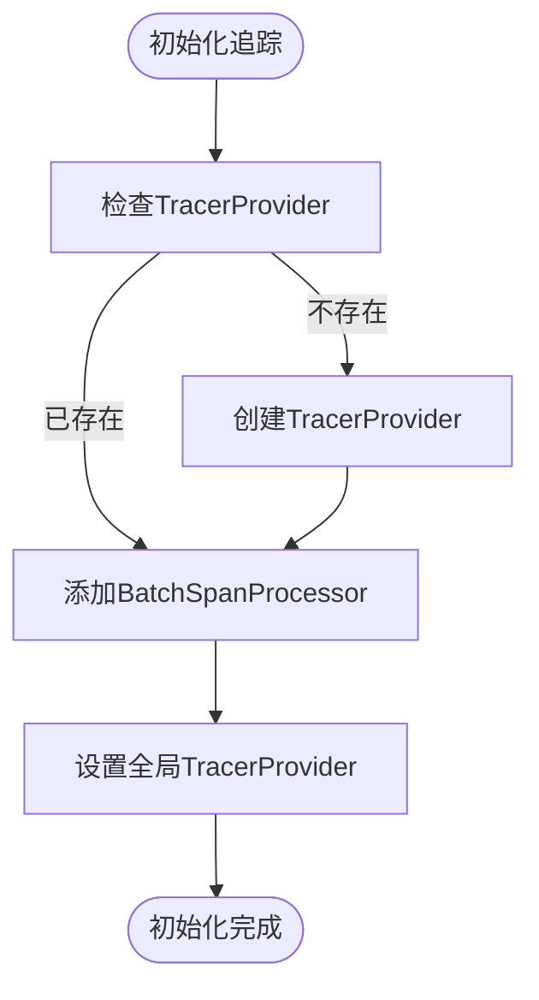
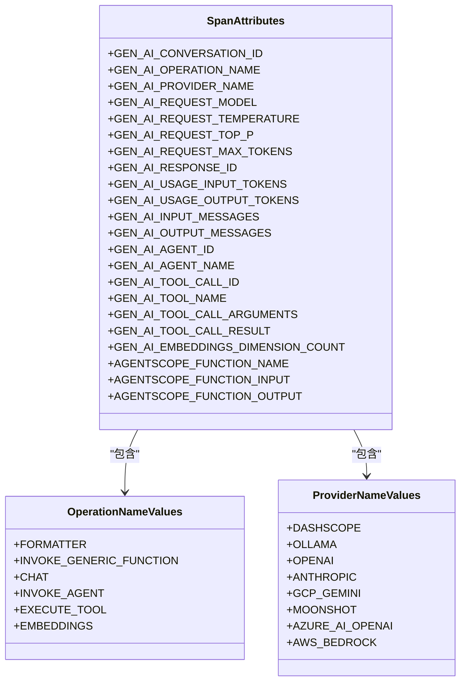
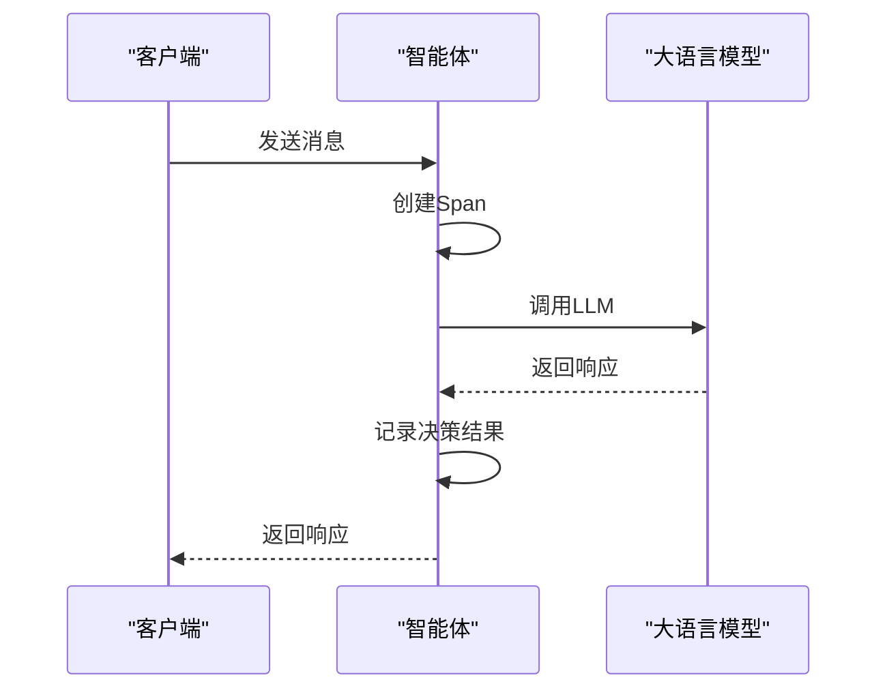
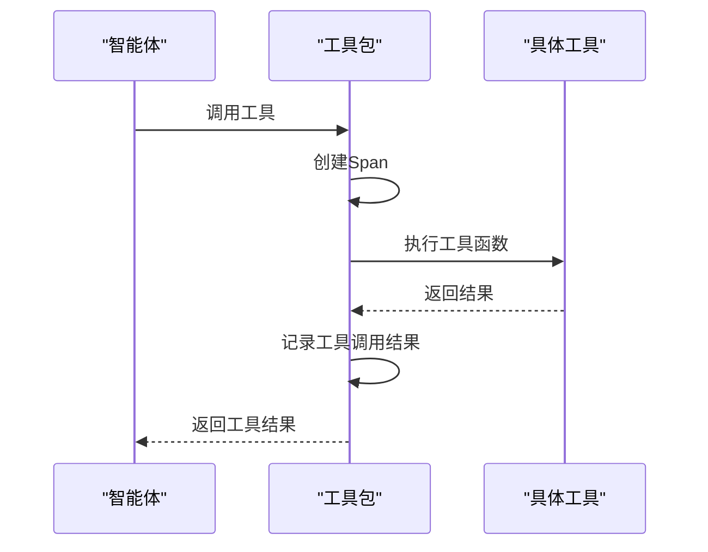
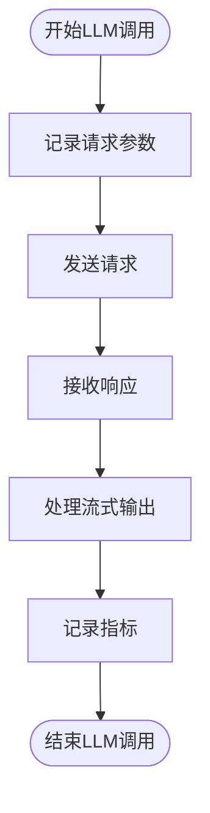

# 监控集成

<cite>
**本文档引用的文件**   
- [__init__.py](file://src/agentscope/tracing/__init__.py)
- [_setup.py](file://src/agentscope/tracing/_setup.py)
- [_trace.py](file://src/agentscope/tracing/_trace.py)
- [_attributes.py](file://src/agentscope/tracing/_attributes.py)
- [_extractor.py](file://src/agentscope/tracing/_extractor.py)
- [_converter.py](file://src/agentscope/tracing/_converter.py)
- [_utils.py](file://src/agentscope/tracing/_utils.py)
- [task_tracing.py](file://docs/tutorial/zh_CN/src/task_tracing.py)
</cite>

## 目录
1. [引言](#引言)
2. [OpenTelemetry标准追踪实现](#opentelemetry标准追踪实现)
3. [关键性能指标采集](#关键性能指标采集)
4. [主流APM平台集成](#主流apm平台集成)
5. [性能监控最佳实践](#性能监控最佳实践)
6. [多智能体系统优化案例](#多智能体系统优化案例)
7. [结论](#结论)

## 引言

AgentScope提供了一套基于OpenTelemetry标准的全面监控与追踪能力，旨在帮助开发者深入理解智能体系统的运行状态和性能特征。通过内置的追踪机制，系统能够自动采集智能体决策过程、工具调用链路和模型推理耗时等关键性能指标，为系统优化和故障排查提供数据支持。本文档将详细介绍AgentScope的监控追踪能力，包括其技术实现、集成方法和最佳实践。

## OpenTelemetry标准追踪实现

AgentScope的追踪能力基于OpenTelemetry标准实现，通过一系列装饰器和工具函数，实现了对系统各组件的无缝监控。

### Span创建与管理

追踪的核心是Span的创建与管理。AgentScope通过`setup_tracing`函数初始化追踪配置，设置追踪数据的导出端点。该函数会创建一个`TracerProvider`，并配置`BatchSpanProcessor`和`OTLPSpanExporter`来处理和导出追踪数据。



**Diagram sources**
- [_setup.py](file://src/agentscope/tracing/_setup.py#L11-L38)

### 属性设置与上下文传播

AgentScope定义了一套丰富的属性系统，用于描述追踪数据的上下文信息。这些属性分为多个类别：

- **通用属性**：包括会话ID等跨组件的通用信息
- **LLM请求属性**：包括模型名称、温度、top_p等生成参数
- **智能体属性**：包括智能体ID、名称、描述等
- **工具调用属性**：包括工具名称、参数、结果等
- **嵌入式模型属性**：包括维度计数等

这些属性通过`_get_common_attributes`、`_get_llm_request_attributes`等提取器函数从相应组件中获取，并在创建Span时设置。



**Diagram sources**
- [_attributes.py](file://src/agentscope/tracing/_attributes.py#L8-L184)

**Section sources**
- [_attributes.py](file://src/agentscope/tracing/_attributes.py#L8-L184)

### 上下文传播机制

AgentScope通过OpenTelemetry的上下文传播机制，确保追踪信息能够在组件间正确传递。当一个Span创建时，它会成为当前上下文中的"current span"，后续创建的子Span会自动链接到父Span，形成完整的调用链。

## 关键性能指标采集

AgentScope能够自动采集多种关键性能指标，为系统监控和优化提供数据支持。

### 智能体决策过程追踪

智能体的决策过程通过`@trace_reply`装饰器进行追踪。该装饰器会自动创建Span，记录智能体的输入消息、系统提示、决策结果等信息。



**Diagram sources**
- [_trace.py](file://src/agentscope/tracing/_trace.py#L369-L435)
- [_extractor.py](file://src/agentscope/tracing/_extractor.py#L447-L505)

### 工具调用链路追踪

工具调用链路通过`@trace_toolkit`装饰器进行追踪。该装饰器会记录工具调用的名称、参数、执行时间和结果。



**Diagram sources**
- [_trace.py](file://src/agentscope/tracing/_trace.py#L322-L366)
- [_extractor.py](file://src/agentscope/tracing/_extractor.py#L552-L607)

### 模型推理耗时采集

模型推理耗时通过`@trace_llm`装饰器进行采集。该装饰器会记录模型调用的各个阶段耗时，包括请求发送、响应接收和流式输出处理。



**Diagram sources**
- [_trace.py](file://src/agentscope/tracing/_trace.py#L569-L648)
- [_extractor.py](file://src/agentscope/tracing/_extractor.py#L198-L267)

## 主流APM平台集成

AgentScope支持与多种主流APM平台集成，通过OpenTelemetry协议将追踪数据导出到外部系统。

### Jaeger集成

通过配置OTLP导出器，可以将追踪数据发送到Jaeger后端。需要设置`tracing_url`参数为Jaeger的OTLP端点。

```python
agentscope.init(tracing_url="http://jaeger-host:4317/v1/traces")
```

### Zipkin集成

Zipkin同样支持OTLP协议，可以通过类似方式集成。需要确保Zipkin版本支持OTLP。

```python
agentscope.init(tracing_url="http://zipkin-host:9411/api/v2/spans")
```

### 其他平台集成

AgentScope还支持与阿里云云监控、Arize-Phoenix、Langfuse等平台集成。这些集成通常需要额外的认证配置。

```python
# 阿里云云监控
agentscope.init(tracing_url="https://tracing-cn-hangzhou.arms.aliyuncs.com/adapt_xxx/api/otlp/traces")

# Arize Phoenix
os.environ["OTEL_EXPORTER_OTLP_HEADERS"] = f"api_key={PHOENIX_API_KEY}"
agentscope.init(tracing_url="https://app.phoenix.arize.com/v1/traces")

# Langfuse
os.environ["OTEL_EXPORTER_OTLP_HEADERS"] = f"Authorization=Basic {LANGFUSE_AUTH}"
agentscope.init(tracing_url="https://cloud.langfuse.com/api/public/otel/v1/traces")
```

**Section sources**
- [task_tracing.py](file://docs/tutorial/zh_CN/src/task_tracing.py#L42-L102)

## 性能监控最佳实践

### 告警规则设置

基于采集的性能指标，可以设置多种告警规则：

- **高延迟告警**：当LLM调用耗时超过阈值时触发
- **错误率告警**：当工具调用失败率超过阈值时触发
- **资源消耗告警**：当token使用量异常时触发

### 性能瓶颈分析

通过分析追踪数据，可以识别系统性能瓶颈：

- **热点分析**：识别调用频率最高或耗时最长的组件
- **依赖分析**：分析组件间的调用关系和依赖链
- **异常分析**：定位错误发生的具体位置和原因

### 数据可视化

利用APM平台的可视化功能，可以创建仪表板来监控系统状态：

- **调用链视图**：展示完整的请求处理路径
- **性能趋势图**：展示关键指标随时间的变化
- **拓扑图**：展示系统组件间的调用关系

## 多智能体系统优化案例

### 并发工作流优化

在多智能体并发工作流中，通过追踪可以分析各智能体的执行时间和资源消耗，优化任务分配策略。

```python
async def main():
    alice = ExampleAgent("Alice")
    bob = ExampleAgent("Bob")
    chalice = ExampleAgent("Chalice")
    
    # 使用fanout_pipeline并发执行
    collected_res = await fanout_pipeline(
        agents=[alice, bob, chalice],
        enable_gather=True,
    )
    
    # 分析各智能体的执行时间
    for res in collected_res:
        print(f"{res.name}: {res.metadata['time']} seconds")
```

### 对话系统优化

在多智能体对话系统中，通过追踪可以分析对话轮次、消息传递延迟等指标，优化对话流程。

```python
async with MsgHub(participants=[alice, bob, charlie]) as hub:
    await sequential_pipeline([alice, bob, charlie])
    # 追踪对话过程中的消息传递和处理耗时
```

## 结论

AgentScope的监控追踪能力为智能体系统的开发和运维提供了强大的支持。通过基于OpenTelemetry标准的实现，系统能够自动采集关键性能指标，并与主流APM平台集成。这些能力不仅有助于及时发现和解决性能问题，还能为系统优化提供数据支持。建议在实际应用中充分利用这些功能，建立完善的监控体系，确保智能体系统的稳定高效运行。