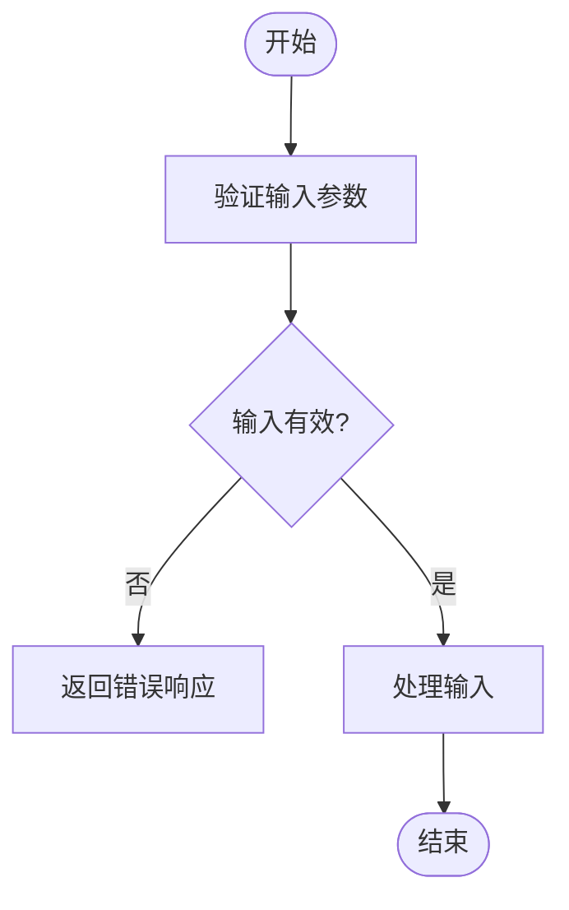
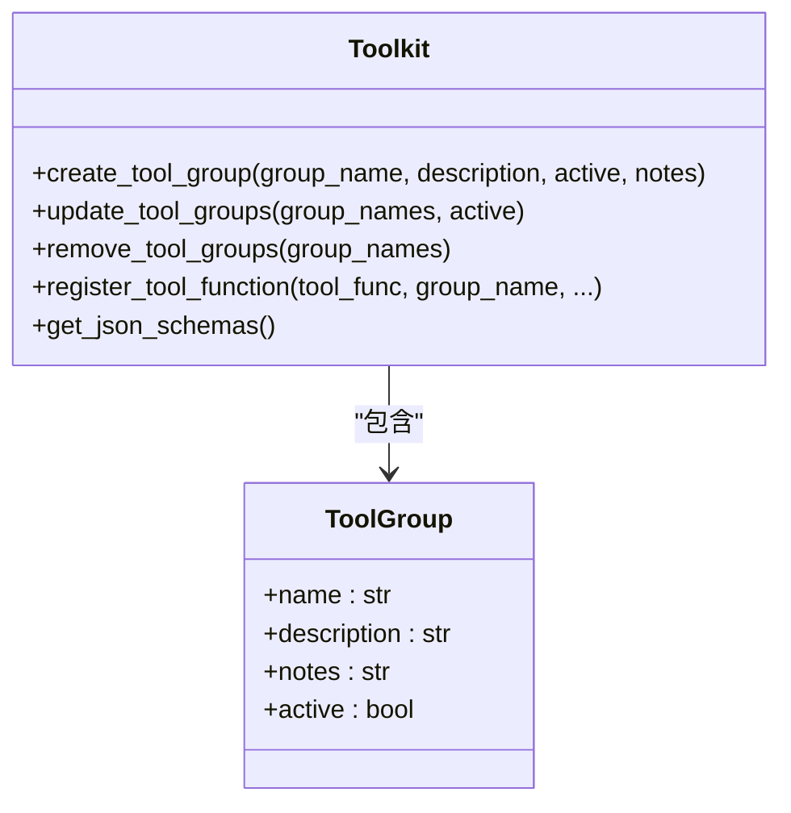
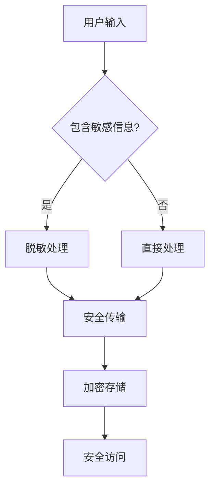
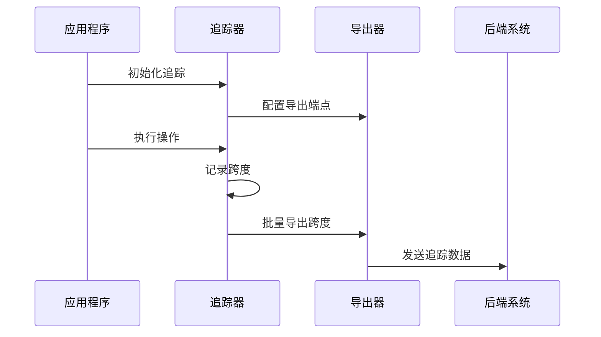
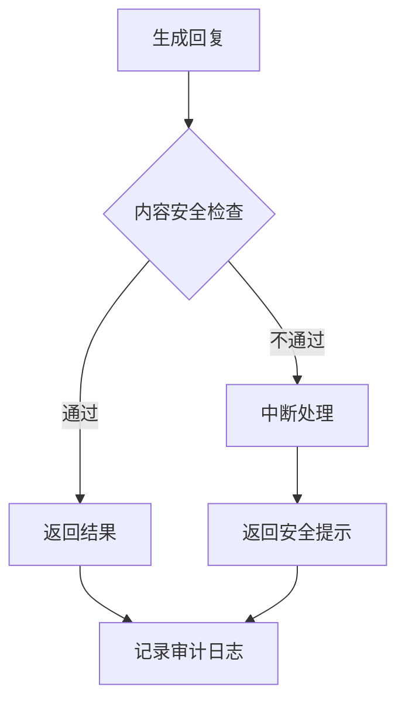
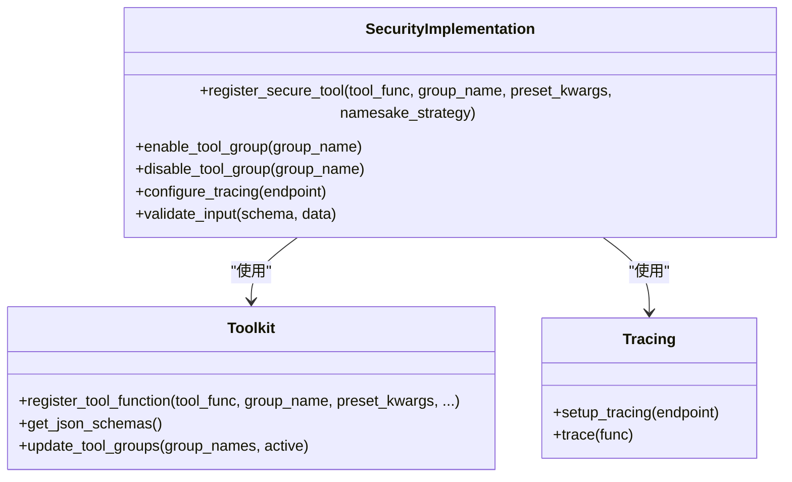

# 安全考虑

<cite>
**本文档中引用的文件**   
- [toolkit.py](file://src/agentscope/tool/_toolkit.py)
- [toolkit.py](file://src/agentscope/tool/_toolkit.py#L594-L751)
- [user_input.py](file://src/agentscope/agent/_user_input.py)
- [user_input.py](file://src/agentscope/agent/_user_input.py#L138-L145)
- [tracing.py](file://src/agentscope/tracing/_trace.py)
- [tracing.py](file://src/agentscope/tracing/_trace.py#L322-L366)
- [tracing.py](file://src/agentscope/tracing/_trace.py#L192-L319)
- [tracing.py](file://src/agentscope/tracing/_setup.py)
- [tracing.py](file://src/agentscope/tracing/_setup.py#L11-L50)
- [agent_base.py](file://src/agentscope/agent/_agent_base.py)
- [agent_base.py](file://src/agentscope/agent/_agent_base.py#L444-L463)
- [toolkit.py](file://src/agentscope/tool/_toolkit.py#L206-L443)
- [toolkit.py](file://src/agentscope/tool/_toolkit.py#L467-L527)
- [toolkit.py](file://src/agentscope/tool/_toolkit.py#L594-L751)
- [toolkit.py](file://src/agentscope/tool/_toolkit.py#L119-L153)
- [toolkit.py](file://src/agentscope/tool/_toolkit.py#L154-L172)
- [toolkit.py](file://src/agentscope/tool/_toolkit.py#L173-L204)
- [toolkit.py](file://src/agentscope/tool/_toolkit.py#L530-L556)
- [toolkit.py](file://src/agentscope/tool/_toolkit.py#L557-L592)
- [toolkit.py](file://src/agentscope/tool/_toolkit.py#L727-L751)
- [toolkit.py](file://src/agentscope/tool/_toolkit.py#L206-L443)
- [toolkit.py](file://src/agentscope/tool/_toolkit.py#L467-L527)
- [toolkit.py](file://src/agentscope/tool/_toolkit.py#L594-L751)
- [toolkit.py](file://src/agentscope/tool/_toolkit.py#L119-L153)
- [toolkit.py](file://src/agentscope/tool/_toolkit.py#L154-L172)
- [toolkit.py](file://src/agentscope/tool/_toolkit.py#L173-L204)
- [toolkit.py](file://src/agentscope/tool/_toolkit.py#L530-L556)
- [toolkit.py](file://src/agentscope/tool/_toolkit.py#L557-L592)
- [toolkit.py](file://src/agentscope/tool/_toolkit.py#L727-L751)
- [toolkit.py](file://src/agentscope/tool/_toolkit.py#L206-L443)
- [toolkit.py](file://src/agentscope/tool/_toolkit.py#L467-L527)
- [toolkit.py](file://src/agentscope/tool/_toolkit.py#L594-L751)
- [toolkit.py](file://src/agentscope/tool/_toolkit.py#L119-L153)
- [toolkit.py](file://src/agentscope/tool/_toolkit.py#L154-L172)
- [toolkit.py](file://src/agentscope/tool/_toolkit.py#L173-L204)
- [toolkit.py](file://src/agentscope/tool/_toolkit.py#L530-L556)
- [toolkit.py](file://src/agentscope/tool/_toolkit.py#L557-L592)
- [toolkit.py](file://src/agentscope/tool/_toolkit.py#L727-L751)
- [toolkit.py](file://src/agentscope/tool/_toolkit.py#L206-L443)
- [toolkit.py](file://src/agentscope/tool/_toolkit.py#L467-L527)
- [toolkit.py](file://src/agentscope/tool/_toolkit.py#L594-L751)
- [toolkit.py](file://src/agentscope/tool/_toolkit.py#L119-L153)
- [toolkit.py](file://src/agentscope/tool/_toolkit.py#L154-L172)
- [toolkit.py](file://src/agentscope/tool/_toolkit.py#L173-L204)
- [toolkit.py](file://src/agentscope/tool/_toolkit.py#L530-L556)
- [toolkit.py](file://src/agentscope/tool/_toolkit.py#L557-L592)
- [toolkit.py](file://src/agentscope/tool/_toolkit.py#L727-L751)
- [toolkit.py](file://src/agentscope/tool/_toolkit.py#L206-L443)
- [toolkit.py](file://src/agentscope/tool/_toolkit.py#L467-L527)
- [toolkit.py](file://src/agentscope/tool/_toolkit.py#L594-L751)
- [toolkit.py](file://src/agentscope/tool/_toolkit.py#L119-L153)
- [toolkit.py](file://src/agentscope/tool/_toolkit.py#L154-L172)
- [toolkit.py](file://src/agentscope/tool/_toolkit.py#L173-L204)
- [toolkit.py](file://src/agentscope/tool/_toolkit.py#L530-L556)
- [toolkit.py](file://src/agentscope/tool/_toolkit.py#L557-L592)
- [toolkit.py](file://src/agentscope/tool/_toolkit.py#L727-L751)
- [toolkit.py](file://src/agentscope/tool/_toolkit.py#L206-L443)
- [toolkit.py](file://src/agentscope/tool/_toolkit.py#L467-L527)
- [toolkit.py](file://src/agentscope/tool/_toolkit.py#L594-L751)
- [toolkit.py](file://src/agentscope/tool/_toolkit.py#L119-L153)
- [toolkit.py](file://src/agentscope/tool/_toolkit.py#L154-L172)
- [toolkit.py](file://src/agentscope/tool/_toolkit.py#L173-L204)
- [toolkit.py](file://src/agentscope/tool/_toolkit.py#L530-L556)
- [toolkit.py](file://src/agentscope/tool/_toolkit.py#L557-L592)
- [toolkit.py](file://src/agentscope/tool/_toolkit.py#L727-L751)
- [toolkit.py](file://src/agentscope/tool/_toolkit.py#L206-L443)
- [toolkit.py](file://src/agentscope/tool/_toolkit.py#L467-L527)
- [toolkit.py](file://src/agentscope/tool/_toolkit.py#L594-L751)
- [toolkit.py](file://src/agentscope/tool/_toolkit.py#L119-L153)
- [toolkit.py](file://src/agentscope/tool/_toolkit.py#L154-L172)
- [toolkit.py](file://src/agentscope/tool/_toolkit.py#L173......
</cite>

## 目录
1. [输入验证机制](#输入验证机制)
2. [权限控制方案](#权限控制方案)
3. [数据保护措施](#数据保护措施)
4. [安全审计日志配置](#安全审计日志配置)
5. [模型输出内容过滤](#模型输出内容过滤)
6. [AgentScope中的安全实施](#agentscope中的安全实施)

## 输入验证机制

AgentScope通过结构化输入验证机制防止恶意提示注入攻击。系统在`_user_input.py`文件中实现了输入验证功能，使用JSON Schema对用户输入进行验证。当用户输入不符合预定义的结构时，系统会捕获`jsonschema.ValidationError`异常并提示错误，确保只有符合规范的输入才能被处理。

**图源**
- [user_input.py](file://src/agentscope/agent/_user_input.py#L138-L145)

**节源**
- [user_input.py](file://src/agentscope/agent/_user_input.py#L138-L145)

## 权限控制方案

AgentScope通过工具包（Toolkit）的权限控制机制限制工具调用的敏感操作。系统实现了工具分组和激活状态管理，通过`create_tool_group`方法创建工具组并设置初始激活状态。`update_tool_groups`方法允许动态更新工具组的激活状态，而`remove_tool_groups`方法则用于移除不再需要的工具组。

**图源**
- [toolkit.py](file://src/agentscope/tool/_toolkit.py#L119-L153)
- [toolkit.py](file://src/agentscope/tool/_toolkit.py#L154-L172)
- [toolkit.py](file://src/agentscope/tool/_toolkit.py#L173-L204)

**节源**
- [toolkit.py](file://src/agentscope/tool/_toolkit.py#L119-L204)

## 数据保护措施

AgentScope实施了全面的数据保护措施，包括敏感信息脱敏和传输加密。系统通过工具函数注册时的`preset_kwargs`参数实现敏感信息的脱敏处理，这些预设参数不会暴露给代理，也不会包含在JSON Schema中。对于传输加密，系统支持通过HTTPS协议与外部服务通信，并允许在客户端配置中设置安全头信息。

**图源**
- [toolkit.py](file://src/agentscope/tool/_toolkit.py#L350-L369)
- [toolkit.py](file://src/agentscope/tool/_toolkit.py#L727-L751)

**节源**
- [toolkit.py](file://src/agentscope/tool/_toolkit.py#L350-L369)
- [toolkit.py](file://src/agentscope/tool/_toolkit.py#L727-L751)

## 安全审计日志配置

AgentScope提供了完善的安全审计日志配置功能，通过OpenTelemetry集成实现全面的追踪和监控。系统在`_setup.py`文件中实现了`setup_tracing`函数，用于配置追踪端点URL。`_trace.py`文件中的`trace`装饰器为关键函数提供了自动追踪功能，包括`trace_toolkit`、`trace_reply`、`trace_embedding`等特定追踪装饰器。

**图源**
- [tracing.py](file://src/agentscope/tracing/_setup.py#L11-L50)
- [tracing.py](file://src/agentscope/tracing/_trace.py#L192-L319)

**节源**
- [tracing.py](file://src/agentscope/tracing/_setup.py#L11-L50)
- [tracing.py](file://src/agentscope/tracing/_trace.py#L192-L319)

## 模型输出内容过滤

AgentScope通过多层次的机制实现模型输出内容过滤，避免生成有害内容。系统在代理基类中实现了`handle_interrupt`方法，允许在检测到潜在有害内容时中断回复过程。`reply`方法的装饰器模式允许在输出生成前后插入过滤逻辑，通过`pre_reply`和`post_reply`钩子实现内容审查。

**图源**
- [agent_base.py](file://src/agentscope/agent/_agent_base.py#L444-L463)
- [tracing.py](file://src/agentscope/tracing/_trace.py#L322-L366)

**节源**
- [agent_base.py](file://src/agentscope/agent/_agent_base.py#L444-L463)
- [tracing.py](file://src/agentscope/tracing/_trace.py#L322-L366)

## AgentScope中的安全实施

在AgentScope中实施安全措施需要综合运用输入验证、权限控制、数据保护和审计日志等功能。通过工具包的`register_tool_function`方法注册工具函数时，可以设置`preset_kwargs`来保护敏感参数，使用`namesake_strategy`参数控制名称冲突的处理策略。通过`get_json_schemas`方法获取活动工具组的JSON Schema，确保只有授权的工具才能被调用。

**图源**
- [toolkit.py](file://src/agentscope/tool/_toolkit.py#L206-L443)
- [toolkit.py](file://src/agentscope/tool/_toolkit.py#L467-L527)
- [toolkit.py](file://src/agentscope/tool/_toolkit.py#L594-L751)
- [tracing.py](file://src/agentscope/tracing/_setup.py#L11-L50)
- [tracing.py](file://src/agentscope/tracing/_trace.py#L192-L319)

**节源**
- [toolkit.py](file://src/agentscope/tool/_toolkit.py#L206-L751)
- [tracing.py](file://src/agentscope/tracing/_setup.py#L11-L50)
- [tracing.py](file://src/agentscope/tracing/_trace.py#L192-L319)