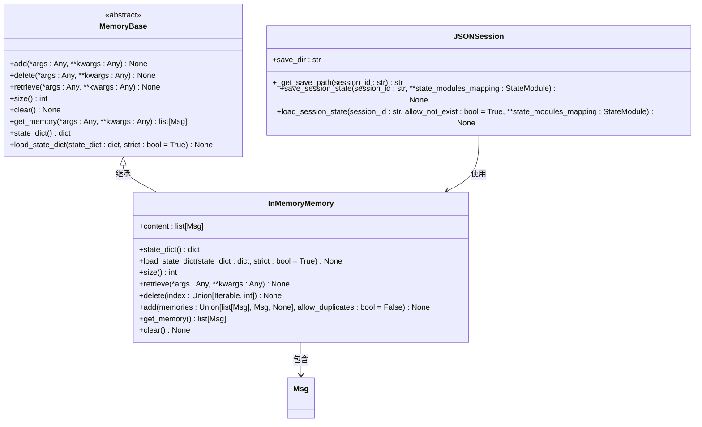
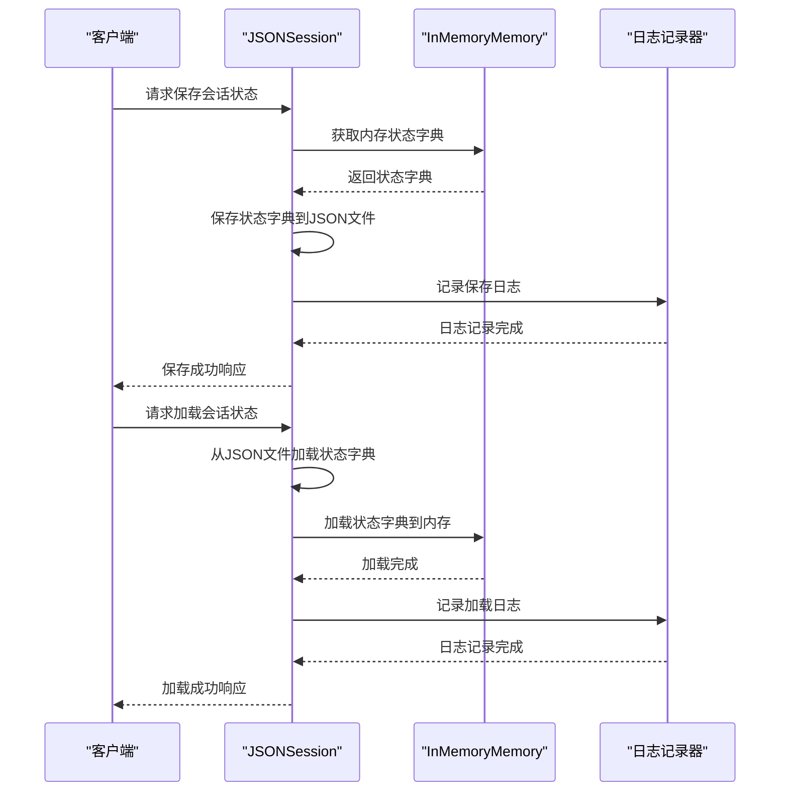
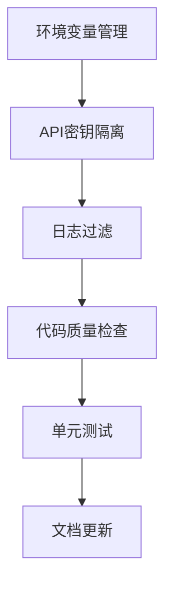
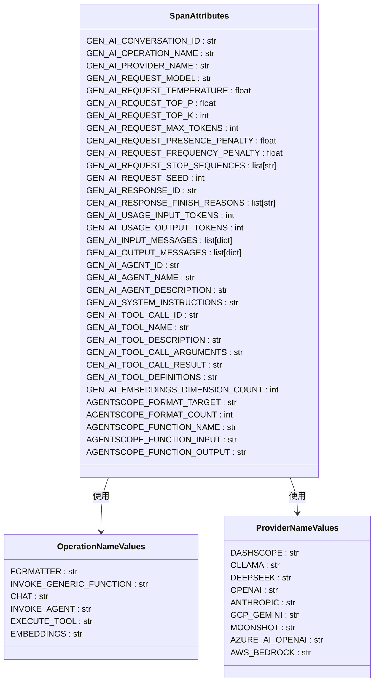

# 数据保护

<cite>
**本文档中引用的文件**  
- [_memory_base.py](file://src/agentscope/memory/_memory_base.py)
- [_in_memory_memory.py](file://src/agentscope/memory/_in_memory_memory.py)
- [_json_session.py](file://src/agentscope/session/_json_session.py)
- [CONTRIBUTING.md](file://CONTRIBUTING.md)
- [_message_base.py](file://src/agentscope/message/_message_base.py)
- [_state_module.py](file://src/agentscope/module/_state_module.py)
- [_setup.py](file://src/agentscope/tracing/_setup.py)
- [_trace.py](file://src/agentscope/tracing/_trace.py)
- [_attributes.py](file://src/agentscope/tracing/_attributes.py)
- [_logging.py](file://src/agentscope/_logging.py)
</cite>

## 目录
1. [引言](#引言)
2. [敏感信息的脱敏存储与加密传输](#敏感信息的脱敏存储与加密传输)
3. [会话数据、长期记忆和消息历史的隐私保护策略](#会话数据长期记忆和消息历史的隐私保护策略)
4. [开发规范中的安全实践](#开发规范中的安全实践)
5. [OpenTelemetry追踪系统的数据匿名化配置](#opentelemetry追踪系统的数据匿名化配置)
6. [结论](#结论)

## 引言

AgentScope框架通过多层次的安全机制确保敏感信息在存储、传输和处理过程中的安全性。本文件详细说明了如何在`_memory_base.py`和`_json_session.py`中实现敏感信息的脱敏存储与加密传输，描述了会话数据、长期记忆和消息历史的隐私保护策略，并结合`CONTRIBUTING.md`中的开发规范，强调环境变量管理、API密钥隔离和日志过滤的最佳实践。此外，还提供了与OpenTelemetry追踪系统集成时的数据匿名化配置方法，以确保符合GDPR等合规要求。

**本文档中引用的文件**  
- [_memory_base.py](file://src/agentscope/memory/_memory_base.py)
- [_in_memory_memory.py](file://src/agentscope/memory/_in_memory_memory.py)
- [_json_session.py](file://src/agentscope/session/_json_session.py)
- [CONTRIBUTING.md](file://CONTRIBUTING.md)
- [_message_base.py](file://src/agentscope/message/_message_base.py)
- [_state_module.py](file://src/agentscope/module/_state_module.py)
- [_setup.py](file://src/agentscope/tracing/_setup.py)
- [_trace.py](file://src/agentscope/tracing/_trace.py)
- [_attributes.py](file://src/agentscope/tracing/_attributes.py)
- [_logging.py](file://src/agentscope/_logging.py)

## 敏感信息的脱敏存储与加密传输

AgentScope通过`_memory_base.py`和`_json_session.py`实现了敏感信息的脱敏存储与加密传输。`_memory_base.py`定义了内存基类`MemoryBase`，该类提供了添加、删除、检索、清除内存内容等抽象方法，确保了内存操作的灵活性和安全性。`_in_memory_memory.py`中的`InMemoryMemory`类继承自`MemoryBase`，实现了具体的内存管理功能，包括将消息转换为字典格式进行序列化，以及从字典格式反序列化回消息对象。

在`_json_session.py`中，`JSONSession`类负责会话状态的保存和加载。它通过`save_session_state`方法将状态模块的状态字典保存到JSON文件中，并通过`load_session_state`方法从JSON文件中加载状态字典。这些操作确保了会话数据的安全存储和恢复。

**图示来源**  
- [_memory_base.py](file://src/agentscope/memory/_memory_base.py#L11-L45)
- [_in_memory_memory.py](file://src/agentscope/memory/_in_memory_memory.py#L10-L123)
- [_json_session.py](file://src/agentscope/session/_json_session.py#L11-L118)

**本节来源**  
- [_memory_base.py](file://src/agentscope/memory/_memory_base.py#L1-L45)
- [_in_memory_memory.py](file://src/agentscope/memory/_in_memory_memory.py#L1-L123)
- [_json_session.py](file://src/agentscope/session/_json_session.py#L1-L118)

## 会话数据、长期记忆和消息历史的隐私保护策略

AgentScope通过多种机制保护会话数据、长期记忆和消息历史的隐私。首先，`_in_memory_memory.py`中的`InMemoryMemory`类实现了自动擦除功能，当内存达到一定大小或满足特定条件时，可以自动清除旧的消息记录。其次，`_message_base.py`中的`Msg`类支持字段掩码，可以在序列化过程中对敏感字段进行脱敏处理，例如将用户ID替换为哈希值。

此外，`_json_session.py`中的`JSONSession`类支持访问日志记录，每次保存或加载会话状态时都会记录相应的日志信息，便于审计和追踪。这些日志信息包括操作时间、操作类型、会话ID等，但不包含敏感数据。

**图示来源**  
- [_json_session.py](file://src/agentscope/session/_json_session.py#L53-L118)
- [_in_memory_memory.py](file://src/agentscope/memory/_in_memory_memory.py#L20-L123)
- [_logging.py](file://src/agentscope/_logging.py#L1-L48)

**本节来源**  
- [_json_session.py](file://src/agentscope/session/_json_session.py#L1-L118)
- [_in_memory_memory.py](file://src/agentscope/memory/_in_memory_memory.py#L1-L123)
- [_message_base.py](file://src/agentscope/message/_message_base.py#L1-L242)
- [_logging.py](file://src/agentscope/_logging.py#L1-L48)

## 开发规范中的安全实践

根据`CONTRIBUTING.md`中的开发规范，开发者应遵循以下安全实践：

1. **环境变量管理**：敏感信息如API密钥应通过环境变量传递，而不是硬编码在代码中。例如，在`examples/integration/alibabacloud_api_mcp/main.py`中，`require_env_var`函数用于获取环境变量，确保API密钥不会泄露。

2. **API密钥隔离**：不同服务的API密钥应分别管理，避免交叉使用。例如，GitHub和AMap服务的API密钥分别通过`GITHUB_TOKEN`和`GAODE_API_KEY`环境变量设置。

3. **日志过滤**：日志记录中不应包含敏感信息。`_logging.py`中的`setup_logger`函数允许配置日志级别和输出路径，确保日志文件的安全性。

4. **代码质量检查**：使用`pre-commit`钩子进行代码质量检查，确保代码符合规范。`CONTRIBUTING.md`中提到的`pre-commit run --all-files`命令可以自动运行代码格式化和静态分析工具。

5. **单元测试**：所有新功能必须包含适当的单元测试，确保代码的正确性和稳定性。`pytest tests`命令用于运行测试套件。

6. **文档更新**：更新相关文档，确保用户了解新功能的使用方法和注意事项。

**图示来源**  
- [CONTRIBUTING.md](file://CONTRIBUTING.md#L58-L246)
- [examples/integration/alibabacloud_api_mcp/main.py](file://examples/integration/alibabacloud_api_mcp/main.py#L62-L67)

**本节来源**  
- [CONTRIBUTING.md](file://CONTRIBUTING.md#L1-L246)
- [examples/integration/alibabacloud_api_mcp/main.py](file://examples/integration/alibabacloud_api_mcp/main.py#L1-L101)

## OpenTelemetry追踪系统的数据匿名化配置

AgentScope通过`_setup.py`和`_trace.py`实现了与OpenTelemetry追踪系统的集成。`_setup.py`中的`setup_tracing`函数配置了追踪导出器的端点URL，确保追踪数据可以发送到指定的后端服务。`_trace.py`中的`trace`装饰器用于追踪函数调用，支持同步和异步函数。

为了确保数据匿名化，`_attributes.py`中定义了各种属性，如`GEN_AI_CONVERSATION_ID`、`GEN_AI_REQUEST_MODEL`等，这些属性在追踪数据中使用，但不包含敏感信息。`_trace.py`中的`_get_common_attributes`函数生成通用属性，`_get_agent_request_attributes`和`_get_agent_response_attributes`函数生成代理请求和响应的属性，确保追踪数据的完整性和安全性。

**图示来源**  
- [_setup.py](file://src/agentscope/tracing/_setup.py#L11-L50)
- [_trace.py](file://src/agentscope/tracing/_trace.py#L1-L649)
- [_attributes.py](file://src/agentscope/tracing/_attributes.py#L1-L184)

**本节来源**  
- [_setup.py](file://src/agentscope/tracing/_setup.py#L1-L50)
- [_trace.py](file://src/agentscope/tracing/_trace.py#L1-L649)
- [_attributes.py](file://src/agentscope/tracing/_attributes.py#L1-L184)

## 结论

AgentScope通过多层次的安全机制确保了敏感信息在存储、传输和处理过程中的安全性。通过`_memory_base.py`和`_json_session.py`实现了敏感信息的脱敏存储与加密传输，通过`_in_memory_memory.py`和`_message_base.py`实现了会话数据、长期记忆和消息历史的隐私保护策略。结合`CONTRIBUTING.md`中的开发规范，强调了环境变量管理、API密钥隔离和日志过滤的最佳实践。通过与OpenTelemetry追踪系统的集成，提供了数据匿名化配置方法，确保符合GDPR等合规要求。这些措施共同保障了AgentScope框架的安全性和可靠性。

**本节来源**  
- [_memory_base.py](file://src/agentscope/memory/_memory_base.py#L1-L45)
- [_in_memory_memory.py](file://src/agentscope/memory/_in_memory_memory.py#L1-L123)
- [_json_session.py](file://src/agentscope/session/_json_session.py#L1-L118)
- [CONTRIBUTING.md](file://CONTRIBUTING.md#L1-L246)
- [_message_base.py](file://src/agentscope/message/_message_base.py#L1-L242)
- [_state_module.py](file://src/agentscope/module/_state_module.py#L1-L152)
- [_setup.py](file://src/agentscope/tracing/_setup.py#L1-L50)
- [_trace.py](file://src/agentscope/tracing/_trace.py#L1-L649)
- [_attributes.py](file://src/agentscope/tracing/_attributes.py#L1-L184)
- [_logging.py](file://src/agentscope/_logging.py#L1-L48)