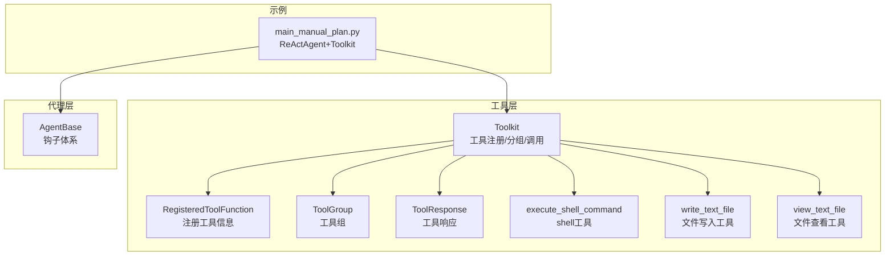
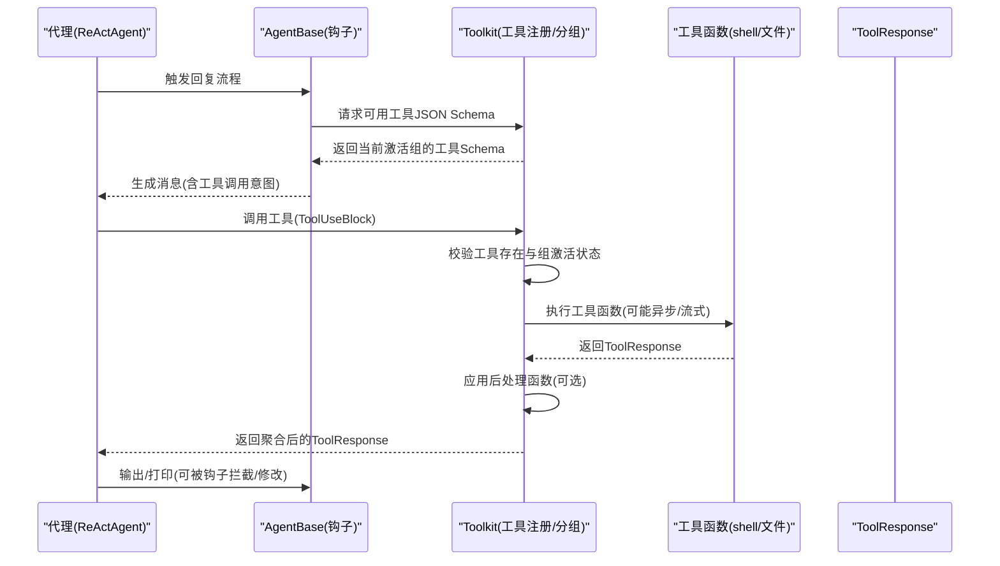
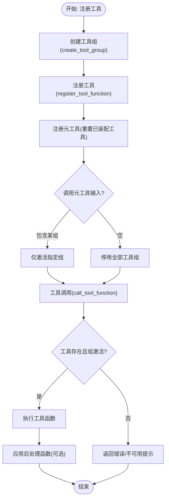
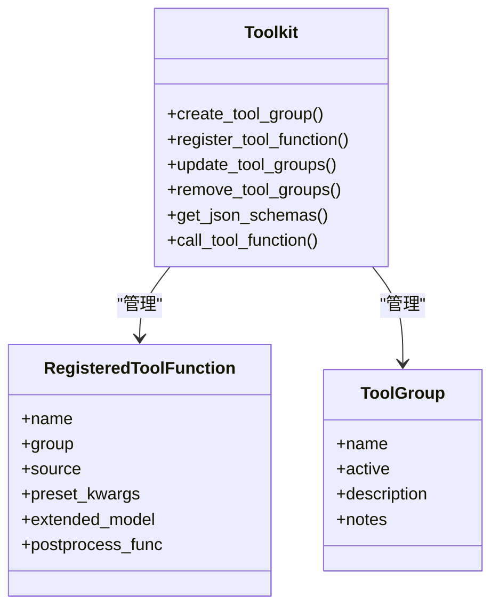
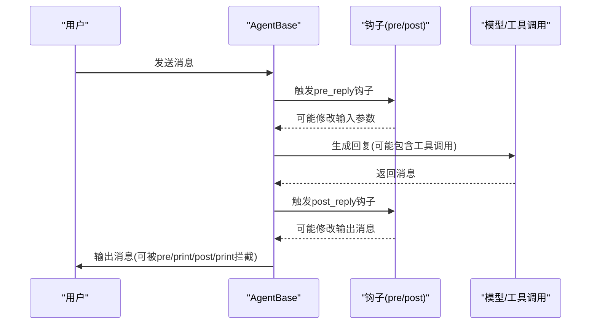
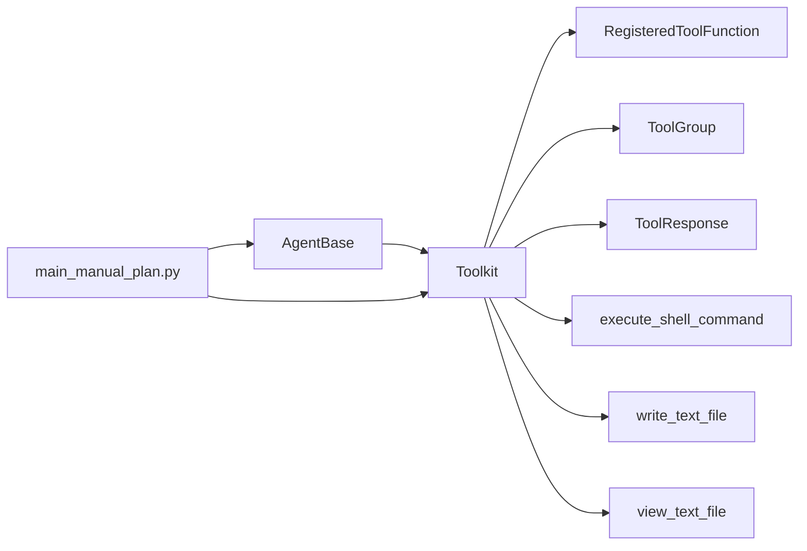

# 权限控制

<cite>
**本文引用的文件**
- [src/agentscope/tool/_toolkit.py](file://src/agentscope/tool/_toolkit.py)
- [src/agentscope/tool/_types.py](file://src/agentscope/tool/_types.py)
- [src/agentscope/tool/_response.py](file://src/agentscope/tool/_response.py)
- [src/agentscope/tool/_coding/_shell.py](file://src/agentscope/tool/_coding/_shell.py)
- [src/agentscope/tool/_text_file/_write_text_file.py](file://src/agentscope/tool/_text_file/_write_text_file.py)
- [src/agentscope/tool/_text_file/_view_text_file.py](file://src/agentscope/tool/_text_file/_view_text_file.py)
- [src/agentscope/tool/__init__.py](file://src/agentscope/tool/__init__.py)
- [src/agentscope/agent/_agent_base.py](file://src/agentscope/agent/_agent_base.py)
- [examples/functionality/plan/main_manual_plan.py](file://examples/functionality/plan/main_manual_plan.py)
- [tests/toolkit_meta_tool_test.py](file://tests/toolkit_meta_tool_test.py)
- [tests/tool_test.py](file://tests/tool_test.py)
- [tests/hook_test.py](file://tests/hook_test.py)
</cite>

## 目录
1. [引言](#引言)
2. [项目结构](#项目结构)
3. [核心组件](#核心组件)
4. [架构总览](#架构总览)
5. [详细组件分析](#详细组件分析)
6. [依赖关系分析](#依赖关系分析)
7. [性能考量](#性能考量)
8. [故障排查指南](#故障排查指南)
9. [结论](#结论)
10. [附录](#附录)

## 引言
本文件围绕“细粒度权限控制”目标，系统梳理 AgentScope 的工具调用权限机制与代理行为可控性设计。重点包括：
- 基于 Toolkit 的工具注册与分组管理，通过“激活/停用工具组”实现最小权限暴露；
- 通过元工具“重置已装配工具”实现运行时动态启停工具组；
- 通过代理钩子（hooks）在运行时进行干预与拦截；
- 结合示例工程 main_manual_plan.py 展示如何为不同智能体按需装配工具；
- 提出与 RBAC 集成的建议，将角色映射到工具组与钩子策略。

## 项目结构
围绕权限控制的关键模块与文件如下：
- 工具层：Toolkit、RegisteredToolFunction、ToolGroup、ToolResponse、具体工具（shell、文件读写等）
- 代理层：AgentBase 及其钩子体系
- 示例：main_manual_plan.py 展示如何为 ReActAgent 装配工具
- 测试：验证元工具、钩子、敏感工具（shell、文件）的行为

图表来源
- [src/agentscope/tool/_toolkit.py](file://src/agentscope/tool/_toolkit.py#L1-L120)
- [src/agentscope/tool/_types.py](file://src/agentscope/tool/_types.py#L1-L157)
- [src/agentscope/tool/_response.py](file://src/agentscope/tool/_response.py#L1-L33)
- [src/agentscope/tool/_coding/_shell.py](file://src/agentscope/tool/_coding/_shell.py#L1-L78)
- [src/agentscope/tool/_text_file/_write_text_file.py](file://src/agentscope/tool/_text_file/_write_text_file.py#L107-L166)
- [src/agentscope/tool/_text_file/_view_text_file.py](file://src/agentscope/tool/_text_file/_view_text_file.py#L1-L82)
- [src/agentscope/agent/_agent_base.py](file://src/agentscope/agent/_agent_base.py#L1-L120)
- [examples/functionality/plan/main_manual_plan.py](file://examples/functionality/plan/main_manual_plan.py#L1-L102)

章节来源
- [src/agentscope/tool/_toolkit.py](file://src/agentscope/tool/_toolkit.py#L1-L120)
- [src/agentscope/tool/_types.py](file://src/agentscope/tool/_types.py#L1-L157)
- [src/agentscope/tool/_response.py](file://src/agentscope/tool/_response.py#L1-L33)
- [src/agentscope/tool/_coding/_shell.py](file://src/agentscope/tool/_coding/_shell.py#L1-L78)
- [src/agentscope/tool/_text_file/_write_text_file.py](file://src/agentscope/tool/_text_file/_write_text_file.py#L107-L166)
- [src/agentscope/tool/_text_file/_view_text_file.py](file://src/agentscope/tool/_text_file/_view_text_file.py#L1-L82)
- [src/agentscope/agent/_agent_base.py](file://src/agentscope/agent/_agent_base.py#L1-L120)
- [examples/functionality/plan/main_manual_plan.py](file://examples/functionality/plan/main_manual_plan.py#L1-L102)

## 核心组件
- Toolkit：统一注册、分组、激活/停用工具；提供元工具“重置已装配工具”以动态切换工具组；封装工具调用与后处理。
- RegisteredToolFunction：记录工具名称、所属组、源类型、预设参数、扩展模型、后处理函数等。
- ToolGroup：定义工具组的名称、是否激活、描述与使用提示。
- ToolResponse：标准化工具输出块（文本/图片/音频/视频），支持流式与中断标记。
- 敏感工具：shell 命令执行、文件读写等，具备潜在风险，需严格控制暴露范围与调用条件。
- AgentBase 钩子：在回复前后、打印前后、观察前后注入自定义逻辑，支持运行时干预与拦截。

章节来源
- [src/agentscope/tool/_toolkit.py](file://src/agentscope/tool/_toolkit.py#L120-L220)
- [src/agentscope/tool/_types.py](file://src/agentscope/tool/_types.py#L15-L157)
- [src/agentscope/tool/_response.py](file://src/agentscope/tool/_response.py#L1-L33)
- [src/agentscope/agent/_agent_base.py](file://src/agentscope/agent/_agent_base.py#L30-L120)

## 架构总览
下图展示了权限控制在系统中的位置与交互路径：代理通过 Toolkit 获取可用工具的 JSON Schema，仅当工具组处于激活状态时才允许调用；工具执行前可通过后处理函数与钩子进行二次加工或拦截。

图表来源
- [src/agentscope/tool/_toolkit.py](file://src/agentscope/tool/_toolkit.py#L594-L726)
- [src/agentscope/agent/_agent_base.py](file://src/agentscope/agent/_agent_base.py#L444-L520)

## 详细组件分析

### Toolkit 与工具组权限控制
- 工具注册与冲突处理：register_tool_function 支持同名策略（抛错/覆盖/跳过/重命名），避免重复注册导致的不可控暴露。
- 工具组创建与激活：create_tool_group 定义组；update_tool_groups 动态切换激活状态；remove_tool_groups 可移除整组工具。
- 元工具“重置已装配工具”：通过动态扩展模型为元工具生成布尔参数，调用后一次性设置所有工具组的最终状态，确保上下文最小化与权限收敛。
- 工具调用校验：call_tool_function 在执行前检查工具是否存在以及所属组是否激活，未激活则返回错误提示，防止越权执行。

图表来源
- [src/agentscope/tool/_toolkit.py](file://src/agentscope/tool/_toolkit.py#L119-L220)
- [src/agentscope/tool/_toolkit.py](file://src/agentscope/tool/_toolkit.py#L504-L528)
- [src/agentscope/tool/_toolkit.py](file://src/agentscope/tool/_toolkit.py#L594-L726)
- [tests/toolkit_meta_tool_test.py](file://tests/toolkit_meta_tool_test.py#L90-L171)

章节来源
- [src/agentscope/tool/_toolkit.py](file://src/agentscope/tool/_toolkit.py#L119-L220)
- [src/agentscope/tool/_toolkit.py](file://src/agentscope/tool/_toolkit.py#L504-L528)
- [src/agentscope/tool/_toolkit.py](file://src/agentscope/tool/_toolkit.py#L594-L726)
- [tests/toolkit_meta_tool_test.py](file://tests/toolkit_meta_tool_test.py#L90-L171)

### 敏感工具与最小权限
- shell 命令工具：execute_shell_command 允许执行任意命令，需谨慎暴露；通过仅在必要任务中激活对应工具组，降低风险面。
- 文件读写工具：write_text_file、insert_text_file、view_text_file 涉及文件系统操作，应限定在受控目录与范围内。
- 最小权限实践：在示例 main_manual_plan.py 中，仅在需要时将上述工具注册到 Toolkit，并通过元工具按任务动态启用/停用。

图表来源
- [src/agentscope/tool/_toolkit.py](file://src/agentscope/tool/_toolkit.py#L119-L220)
- [src/agentscope/tool/_types.py](file://src/agentscope/tool/_types.py#L15-L157)

章节来源
- [src/agentscope/tool/_coding/_shell.py](file://src/agentscope/tool/_coding/_shell.py#L1-L78)
- [src/agentscope/tool/_text_file/_write_text_file.py](file://src/agentscope/tool/_text_file/_write_text_file.py#L107-L166)
- [src/agentscope/tool/_text_file/_view_text_file.py](file://src/agentscope/tool/_text_file/_view_text_file.py#L1-L82)
- [examples/functionality/plan/main_manual_plan.py](file://examples/functionality/plan/main_manual_plan.py#L66-L88)
- [tests/tool_test.py](file://tests/tool_test.py#L1-L234)

### 代理行为可控性与运行时干预
- 钩子类型：pre_reply、post_reply、pre_print、post_print、pre_observe、post_observe。
- 实例级与类级钩子：支持为单个实例或全类注册钩子，便于在不同智能体上差异化控制。
- 运行时中断：AgentBase 提供 interrupt 与 handle_interrupt，用于取消当前回复并进行收尾处理。
- 干预点：可在 pre_reply 修改输入参数，在 post_reply 修改输出消息；在 print/observe 前后插入日志、审计或阻断逻辑。

图表来源
- [src/agentscope/agent/_agent_base.py](file://src/agentscope/agent/_agent_base.py#L30-L120)
- [src/agentscope/agent/_agent_base.py](file://src/agentscope/agent/_agent_base.py#L444-L520)
- [tests/hook_test.py](file://tests/hook_test.py#L190-L414)

章节来源
- [src/agentscope/agent/_agent_base.py](file://src/agentscope/agent/_agent_base.py#L30-L120)
- [src/agentscope/agent/_agent_base.py](file://src/agentscope/agent/_agent_base.py#L444-L520)
- [tests/hook_test.py](file://tests/hook_test.py#L190-L414)

### 基于角色的访问控制（RBAC）集成建议
- 角色到工具组映射：为每个角色定义一组允许使用的工具组（如“只读审计员”仅启用“文件查看组”，“运维工程师”启用“shell+文件写入组”）。
- 角色到钩子策略映射：对高风险角色启用更强的 pre/post 钩子策略，如强制审计日志、二次确认、阻断敏感操作。
- 生命周期管理：角色变更时，通过元工具一次性重置工具组状态，确保权限即时生效与收敛。
- 最佳实践：
  - 使用“仅在需要时启用”的原则，任务完成后立即停用相关工具组；
  - 对 shell 与文件写入工具组采用“默认停用+显式激活”的策略；
  - 为不同角色配置不同的“使用提示”（notes），在元工具激活时向代理强调安全规范。

[本节为概念性建议，无需代码来源]

## 依赖关系分析
- Toolkit 依赖 RegisteredToolFunction、ToolGroup、ToolResponse、工具函数（shell/文件）等；
- AgentBase 依赖钩子注册与广播机制，支持跨组件的运行时干预；
- 示例 main_manual_plan.py 将 ReActAgent 与 Toolkit 组合，演示按任务装配工具。

图表来源
- [src/agentscope/tool/_toolkit.py](file://src/agentscope/tool/_toolkit.py#L1-L120)
- [src/agentscope/tool/_types.py](file://src/agentscope/tool/_types.py#L1-L157)
- [src/agentscope/tool/_response.py](file://src/agentscope/tool/_response.py#L1-L33)
- [src/agentscope/tool/_coding/_shell.py](file://src/agentscope/tool/_coding/_shell.py#L1-L78)
- [src/agentscope/tool/_text_file/_write_text_file.py](file://src/agentscope/tool/_text_file/_write_text_file.py#L107-L166)
- [src/agentscope/tool/_text_file/_view_text_file.py](file://src/agentscope/tool/_text_file/_view_text_file.py#L1-L82)
- [src/agentscope/agent/_agent_base.py](file://src/agentscope/agent/_agent_base.py#L1-L120)
- [examples/functionality/plan/main_manual_plan.py](file://examples/functionality/plan/main_manual_plan.py#L66-L88)

章节来源
- [src/agentscope/tool/_toolkit.py](file://src/agentscope/tool/_toolkit.py#L1-L120)
- [src/agentscope/tool/_types.py](file://src/agentscope/tool/_types.py#L1-L157)
- [src/agentscope/tool/_response.py](file://src/agentscope/tool/_response.py#L1-L33)
- [src/agentscope/tool/_coding/_shell.py](file://src/agentscope/tool/_coding/_shell.py#L1-L78)
- [src/agentscope/tool/_text_file/_write_text_file.py](file://src/agentscope/tool/_text_file/_write_text_file.py#L107-L166)
- [src/agentscope/tool/_text_file/_view_text_file.py](file://src/agentscope/tool/_text_file/_view_text_file.py#L1-L82)
- [src/agentscope/agent/_agent_base.py](file://src/agentscope/agent/_agent_base.py#L1-L120)
- [examples/functionality/plan/main_manual_plan.py](file://examples/functionality/plan/main_manual_plan.py#L66-L88)

## 性能考量
- 工具组激活状态查询与 Schema 合并开销较小，主要成本在于工具函数执行与 I/O；
- 对 shell 与文件操作建议设置合理超时与范围限制，避免长时间阻塞；
- 流式工具响应通过统一包装器处理，减少上层适配复杂度；
- 钩子链路应尽量轻量，避免在 pre/post 中执行重型同步操作。

[本节为通用指导，无需代码来源]

## 故障排查指南
- 工具未找到：当调用不存在的工具名时，Toolkit 返回错误提示，检查工具是否注册与组是否激活。
- 工具组未激活：若工具存在但所属组未激活，Toolkit 返回不可用提示，需通过元工具激活相应组。
- 同名冲突：register_tool_function 的同名策略可选择抛错、覆盖、跳过或重命名，根据需求调整策略。
- 钩子未生效：确认钩子类型是否在 supported_hook_types 内，实例钩子需在实例上调用注册，类钩子对所有实例生效。
- 敏感工具误用：shell 与文件写入工具应在受控目录与范围内使用，必要时通过钩子拦截异常输入。

章节来源
- [src/agentscope/tool/_toolkit.py](file://src/agentscope/tool/_toolkit.py#L594-L726)
- [src/agentscope/tool/_toolkit.py](file://src/agentscope/tool/_toolkit.py#L383-L443)
- [src/agentscope/agent/_agent_base.py](file://src/agentscope/agent/_agent_base.py#L548-L604)
- [tests/tool_test.py](file://tests/tool_test.py#L1-L234)

## 结论
通过 Toolkit 的工具组与元工具机制，AgentScope 能够在“最小权限暴露”的前提下，按任务动态启用/停用工具，有效降低越权风险。配合 AgentBase 的钩子体系，可以在运行时对代理行为进行可控干预与拦截。结合 RBAC 设计，将角色映射到工具组与钩子策略，可进一步提升系统的安全性与合规性。

[本节为总结，无需代码来源]

## 附录
- 示例入口：examples/functionality/plan/main_manual_plan.py
- 关键 API 路径参考：
  - 工具注册与调用：[src/agentscope/tool/_toolkit.py](file://src/agentscope/tool/_toolkit.py#L206-L726)
  - 工具组与注册信息：[src/agentscope/tool/_types.py](file://src/agentscope/tool/_types.py#L15-L157)
  - 工具响应结构：[src/agentscope/tool/_response.py](file://src/agentscope/tool/_response.py#L1-L33)
  - shell 工具实现：[src/agentscope/tool/_coding/_shell.py](file://src/agentscope/tool/_coding/_shell.py#L1-L78)
  - 文件写入工具实现：[src/agentscope/tool/_text_file/_write_text_file.py](file://src/agentscope/tool/_text_file/_write_text_file.py#L107-L166)
  - 文件查看工具实现：[src/agentscope/tool/_text_file/_view_text_file.py](file://src/agentscope/tool/_text_file/_view_text_file.py#L1-L82)
  - 代理钩子与中断：[src/agentscope/agent/_agent_base.py](file://src/agentscope/agent/_agent_base.py#L30-L120), [src/agentscope/agent/_agent_base.py](file://src/agentscope/agent/_agent_base.py#L444-L520)
  - 示例装配工具：[examples/functionality/plan/main_manual_plan.py](file://examples/functionality/plan/main_manual_plan.py#L66-L88)