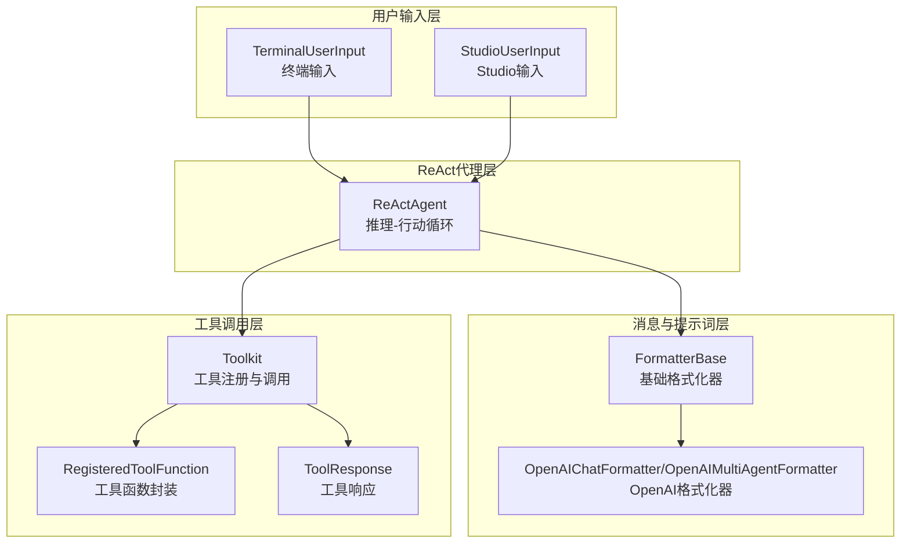
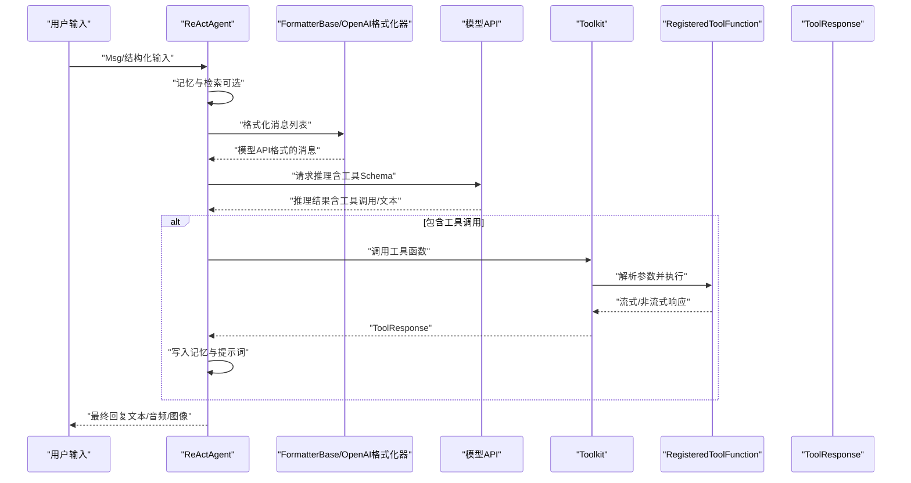
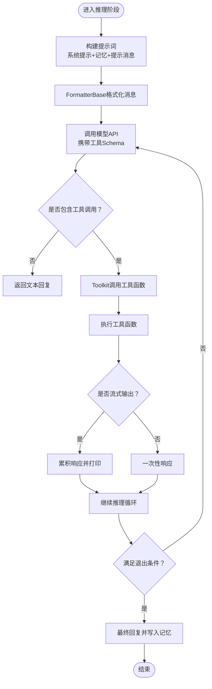
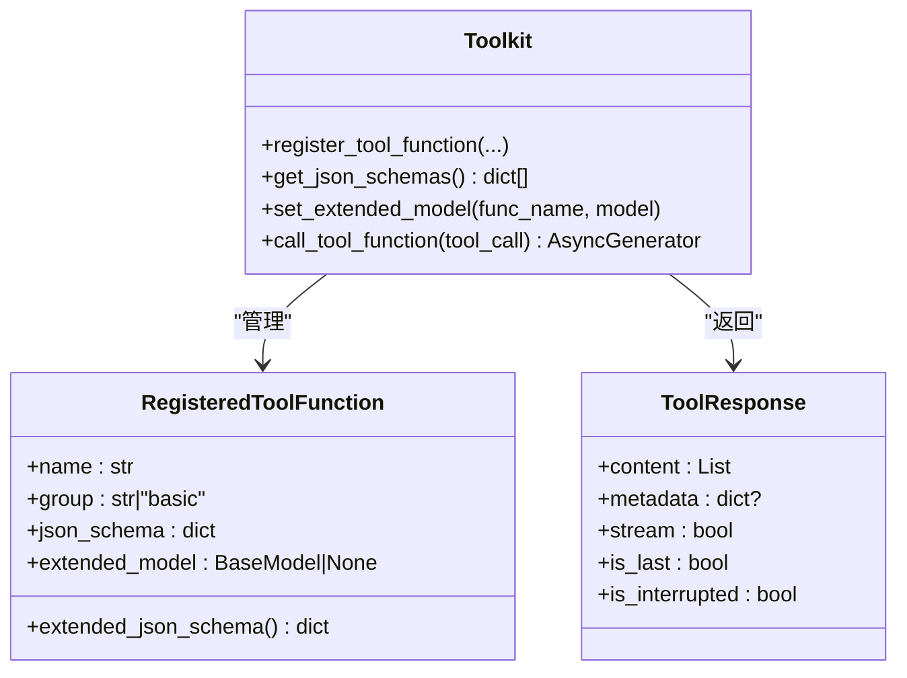
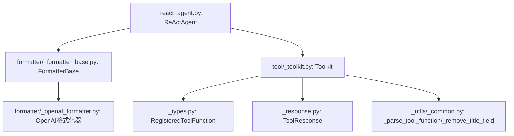

# 输入验证

<cite>
**本文引用的文件**
- [src/agentscope/agent/_react_agent.py](file://src/agentscope/agent/_react_agent.py)
- [src/agentscope/tool/_toolkit.py](file://src/agentscope/tool/_toolkit.py)
- [src/agentscope/formatter/_formatter_base.py](file://src/agentscope/formatter/_formatter_base.py)
- [src/agentscope/formatter/_openai_formatter.py](file://src/agentscope/formatter/_openai_formatter.py)
- [src/agentscope/agent/_user_input.py](file://src/agentscope/agent/_user_input.py)
- [src/agentscope/tool/_types.py](file://src/agentscope/tool/_types.py)
- [src/agentscope/tool/_response.py](file://src/agentscope/tool/_response.py)
- [src/agentscope/_utils/_common.py](file://src/agentscope/_utils/_common.py)
</cite>

## 目录
1. [简介](#简介)
2. [项目结构](#项目结构)
3. [核心组件](#核心组件)
4. [架构总览](#架构总览)
5. [详细组件分析](#详细组件分析)
6. [依赖关系分析](#依赖关系分析)
7. [性能考量](#性能考量)
8. [故障排查指南](#故障排查指南)
9. [结论](#结论)
10. [附录](#附录)

## 简介
本文件围绕AgentScope的输入验证安全规范展开，聚焦于用户输入、提示词（系统提示与消息）与工具参数三类输入的验证与防护，旨在防止提示注入攻击与恶意代码执行。文档结合模型抽象层与工具调用机制，系统阐述在_react_agent.py与_toolkit.py中如何实施输入过滤与转义策略；并通过_formatter模块对输入内容进行预处理与格式化，确保其符合不同模型API的要求；同时讨论异步输入处理中的安全边界控制，给出可操作的实践建议与最佳实践。

## 项目结构
AgentScope将输入验证与安全控制贯穿于以下层次：
- 用户输入层：终端与Studio两种输入方式，支持结构化输入与非结构化文本输入。
- 消息与提示词层：FormatterBase及其子类负责将消息转换为模型API所需的格式，保障内容安全与合规。
- 工具调用层：Toolkit注册与管理工具函数，生成JSON Schema并进行参数校验与后处理。
- ReAct代理层：在推理与行动阶段整合消息、工具与提示词，控制迭代与输出。

图表来源
- [src/agentscope/agent/_react_agent.py](file://src/agentscope/agent/_react_agent.py#L253-L408)
- [src/agentscope/formatter/_formatter_base.py](file://src/agentscope/formatter/_formatter_base.py#L11-L29)
- [src/agentscope/formatter/_openai_formatter.py](file://src/agentscope/formatter/_openai_formatter.py#L158-L357)
- [src/agentscope/tool/_toolkit.py](file://src/agentscope/tool/_toolkit.py#L594-L726)
- [src/agentscope/tool/_types.py](file://src/agentscope/tool/_types.py#L15-L57)
- [src/agentscope/tool/_response.py](file://src/agentscope/tool/_response.py#L11-L33)

章节来源
- [src/agentscope/agent/_react_agent.py](file://src/agentscope/agent/_react_agent.py#L253-L408)
- [src/agentscope/formatter/_formatter_base.py](file://src/agentscope/formatter/_formatter_base.py#L11-L29)
- [src/agentscope/formatter/_openai_formatter.py](file://src/agentscope/formatter/_openai_formatter.py#L158-L357)
- [src/agentscope/tool/_toolkit.py](file://src/agentscope/tool/_toolkit.py#L594-L726)
- [src/agentscope/tool/_types.py](file://src/agentscope/tool/_types.py#L15-L57)
- [src/agentscope/tool/_response.py](file://src/agentscope/tool/_response.py#L11-L33)

## 核心组件
- ReActAgent：负责消息接收、提示词构建、推理与行动、工具调用与结果处理，是输入验证与安全控制的关键入口。
- Toolkit：统一管理工具函数注册、激活/停用、参数校验与流式响应包装，是工具参数安全的核心防线。
- FormatterBase/OpenAI格式化器：将消息转换为模型API所需格式，包含对多模态数据与工具结果的处理，承担提示词与工具结果的预处理职责。
- 用户输入：TerminalUserInput与StudioUserInput分别从终端与Studio接收输入，支持结构化输入的JSON Schema校验。

章节来源
- [src/agentscope/agent/_react_agent.py](file://src/agentscope/agent/_react_agent.py#L253-L408)
- [src/agentscope/tool/_toolkit.py](file://src/agentscope/tool/_toolkit.py#L594-L726)
- [src/agentscope/formatter/_formatter_base.py](file://src/agentscope/formatter/_formatter_base.py#L11-L29)
- [src/agentscope/formatter/_openai_formatter.py](file://src/agentscope/formatter/_openai_formatter.py#L158-L357)
- [src/agentscope/agent/_user_input.py](file://src/agentscope/agent/_user_input.py#L68-L151)

## 架构总览
下图展示了ReActAgent在一次回复中如何串联用户输入、提示词格式化与工具调用，并在每个环节实施安全控制：

图表来源
- [src/agentscope/agent/_react_agent.py](file://src/agentscope/agent/_react_agent.py#L411-L521)
- [src/agentscope/formatter/_openai_formatter.py](file://src/agentscope/formatter/_openai_formatter.py#L209-L357)
- [src/agentscope/tool/_toolkit.py](file://src/agentscope/tool/_toolkit.py#L594-L726)
- [src/agentscope/tool/_types.py](file://src/agentscope/tool/_types.py#L15-L57)

## 详细组件分析

### ReActAgent 的输入验证与安全控制
- 提示词与消息构建
  - ReActAgent在推理阶段通过FormatterBase将消息序列格式化为模型API所需格式，保证消息类型与字段合法。
  - 在格式化前，会将系统提示、短期记忆、长短期记忆检索结果与推理提示合并，形成最终提示词。
- 工具调用与参数校验
  - ReActAgent根据是否需要结构化输出动态启用/禁用工具调用，避免不必要的工具暴露。
  - 工具调用由Toolkit统一调度，参数来自ToolUseBlock，Toolkit在执行前进行存在性与分组激活状态检查。
- 结构化输出
  - 当需要结构化输出时，ReActAgent注册专用工具函数并设置扩展模型，通过Pydantic模型对参数进行严格校验，失败时返回错误信息而非执行工具。

图表来源
- [src/agentscope/agent/_react_agent.py](file://src/agentscope/agent/_react_agent.py#L411-L521)
- [src/agentscope/tool/_toolkit.py](file://src/agentscope/tool/_toolkit.py#L594-L726)

章节来源
- [src/agentscope/agent/_react_agent.py](file://src/agentscope/agent/_react_agent.py#L253-L408)
- [src/agentscope/agent/_react_agent.py](file://src/agentscope/agent/_react_agent.py#L411-L521)
- [src/agentscope/tool/_toolkit.py](file://src/agentscope/tool/_toolkit.py#L594-L726)

### Toolkit 的工具参数验证与转义
- 工具注册与Schema生成
  - Toolkit从函数签名与docstring提取JSON Schema，自动移除可能误导LLM的“title”字段，确保Schema简洁与安全。
  - 支持手动传入JSON Schema并进行合法性断言，避免恶意Schema注入。
- 参数预设与必填项处理
  - 预设参数从Schema中剔除，避免暴露给LLM或用户；必填项动态维护，减少误用风险。
- 工具调用执行
  - 执行前检查工具是否存在与分组是否激活；异常捕获并返回标准化错误；支持异步中断与流式响应包装。
- 扩展模型与结构化输出
  - 通过扩展模型合并参数Schema，配合Pydantic模型对参数进行二次校验，失败时返回明确错误信息。

图表来源
- [src/agentscope/tool/_toolkit.py](file://src/agentscope/tool/_toolkit.py#L206-L443)
- [src/agentscope/tool/_toolkit.py](file://src/agentscope/tool/_toolkit.py#L529-L556)
- [src/agentscope/tool/_toolkit.py](file://src/agentscope/tool/_toolkit.py#L594-L726)
- [src/agentscope/tool/_types.py](file://src/agentscope/tool/_types.py#L15-L57)
- [src/agentscope/tool/_response.py](file://src/agentscope/tool/_response.py#L11-L33)

章节来源
- [src/agentscope/tool/_toolkit.py](file://src/agentscope/tool/_toolkit.py#L206-L443)
- [src/agentscope/tool/_toolkit.py](file://src/agentscope/tool/_toolkit.py#L529-L556)
- [src/agentscope/tool/_toolkit.py](file://src/agentscope/tool/_toolkit.py#L594-L726)
- [src/agentscope/tool/_types.py](file://src/agentscope/tool/_types.py#L15-L57)
- [src/agentscope/tool/_response.py](file://src/agentscope/tool/_response.py#L11-L33)

### Formatter 模块的输入预处理与安全边界
- 基础校验
  - FormatterBase提供输入类型断言，确保传入的是消息列表且元素均为Msg对象，避免非法类型污染后续流程。
- 多模态与工具结果处理
  - 将工具结果转换为文本形式，必要时保存本地文件并返回路径，避免直接拼接不可信的原始数据。
- OpenAI格式化器
  - 对图片与音频来源进行白名单校验（扩展名与媒体类型），拒绝不支持的类型；对本地文件进行安全读取与编码；对Web URL进行有效性与可访问性检查。
  - 在工具调用结果中，若存在多模态数据，可选择提升为用户消息，但会插入显式的系统提示标签，避免被LLM误认为用户输入。

章节来源
- [src/agentscope/formatter/_formatter_base.py](file://src/agentscope/formatter/_formatter_base.py#L11-L29)
- [src/agentscope/formatter/_formatter_base.py](file://src/agentscope/formatter/_formatter_base.py#L37-L129)
- [src/agentscope/formatter/_openai_formatter.py](file://src/agentscope/formatter/_openai_formatter.py#L158-L357)
- [src/agentscope/formatter/_openai_formatter.py](file://src/agentscope/formatter/_openai_formatter.py#L107-L156)

### 用户输入的结构化与非结构化校验
- 终端输入
  - 支持结构化输入：基于Pydantic模型生成JSON Schema，逐项进行jsonschema校验；整数类型采用更严格的解析策略，失败时提示重试。
  - 非结构化文本：进行UTF-8编码清洗，忽略解码错误字符，避免异常字符导致崩溃。
- Studio输入
  - 通过WebSocket与HTTP接口接收输入，连接状态具备重连与超时控制，确保异步输入的稳定性与安全性。

章节来源
- [src/agentscope/agent/_user_input.py](file://src/agentscope/agent/_user_input.py#L68-L151)
- [src/agentscope/agent/_user_input.py](file://src/agentscope/agent/_user_input.py#L154-L416)

## 依赖关系分析
- ReActAgent依赖FormatterBase进行消息格式化，依赖Toolkit进行工具调用，依赖模型抽象层进行推理。
- Toolkit内部依赖工具类型定义与响应封装，依赖通用工具库进行Schema生成与修复。
- Formatter依赖消息类型与多模态数据处理工具，确保输入预处理的安全性。

图表来源
- [src/agentscope/agent/_react_agent.py](file://src/agentscope/agent/_react_agent.py#L253-L408)
- [src/agentscope/formatter/_formatter_base.py](file://src/agentscope/formatter/_formatter_base.py#L11-L29)
- [src/agentscope/formatter/_openai_formatter.py](file://src/agentscope/formatter/_openai_formatter.py#L158-L357)
- [src/agentscope/tool/_toolkit.py](file://src/agentscope/tool/_toolkit.py#L206-L443)
- [src/agentscope/tool/_types.py](file://src/agentscope/tool/_types.py#L15-L57)
- [src/agentscope/tool/_response.py](file://src/agentscope/tool/_response.py#L11-L33)
- [src/agentscope/_utils/_common.py](file://src/agentscope/_utils/_common.py#L301-L332)
- [src/agentscope/_utils/_common.py](file://src/agentscope/_utils/_common.py#L215-L239)

章节来源
- [src/agentscope/agent/_react_agent.py](file://src/agentscope/agent/_react_agent.py#L253-L408)
- [src/agentscope/tool/_toolkit.py](file://src/agentscope/tool/_toolkit.py#L206-L443)
- [src/agentscope/formatter/_formatter_base.py](file://src/agentscope/formatter/_formatter_base.py#L11-L29)
- [src/agentscope/formatter/_openai_formatter.py](file://src/agentscope/formatter/_openai_formatter.py#L158-L357)
- [src/agentscope/tool/_types.py](file://src/agentscope/tool/_types.py#L15-L57)
- [src/agentscope/tool/_response.py](file://src/agentscope/tool/_response.py#L11-L33)
- [src/agentscope/_utils/_common.py](file://src/agentscope/_utils/_common.py#L301-L332)
- [src/agentscope/_utils/_common.py](file://src/agentscope/_utils/_common.py#L215-L239)

## 性能考量
- 异步与流式处理
  - ReActAgent与Toolkit均采用异步与流式接口，降低阻塞与内存占用，提高交互流畅度。
- 提示词截断与令牌计数
  - OpenAI格式化器支持令牌计数与截断，避免过长提示词导致成本与延迟上升。
- 工具调用并发
  - 支持并行工具调用，缩短整体响应时间，但需注意资源竞争与限流。

[本节为通用指导，无需列出具体文件来源]

## 故障排查指南
- 工具调用失败
  - 检查工具是否存在与分组是否激活；确认参数Schema与扩展模型一致；查看ToolResponse的元数据与中断标志。
- 提示词格式错误
  - 确认FormatterBase的输入断言通过；检查OpenAI格式化器对多模态来源的白名单校验是否触发。
- 用户输入异常
  - 终端输入中整数解析失败或结构化输入校验失败时，查看提示并重新输入；Studio输入需确认连接状态与重连日志。

章节来源
- [src/agentscope/tool/_toolkit.py](file://src/agentscope/tool/_toolkit.py#L616-L726)
- [src/agentscope/formatter/_formatter_base.py](file://src/agentscope/formatter/_formatter_base.py#L11-L29)
- [src/agentscope/formatter/_openai_formatter.py](file://src/agentscope/formatter/_openai_formatter.py#L107-L156)
- [src/agentscope/agent/_user_input.py](file://src/agentscope/agent/_user_input.py#L68-L151)

## 结论
AgentScope通过“输入层-消息层-工具层-代理层”的分层设计，在多个关键节点实施输入验证与安全控制：
- 用户输入层：结构化输入采用JSON Schema校验，非结构化输入进行编码清洗。
- 消息层：FormatterBase与OpenAI格式化器对多模态与工具结果进行白名单与类型校验，避免不可信数据进入模型。
- 工具层：Toolkit对工具注册、Schema生成、参数校验与执行进行全链路控制，失败与中断均有明确反馈。
- 代理层：ReActAgent在推理与行动阶段动态启用工具调用，结合结构化输出模型，进一步降低提示注入风险。

上述机制共同构成一套可落地的输入验证与安全规范，既满足功能需求，又有效防范提示注入与恶意代码执行风险。

## 附录

### 实施建议与最佳实践
- 正则表达式与白名单
  - 在用户输入与工具参数中，优先使用白名单校验（如允许的扩展名、媒体类型、参数键名）替代黑名单，避免漏检。
  - 对可变输入（如文件路径、URL）使用白名单与路径规范化策略，拒绝相对路径与越权访问。
- 长度限制
  - 对提示词与工具参数设置合理上限，结合令牌计数进行截断，避免过度膨胀。
- 转义与序列化
  - 工具参数在序列化为字符串时，确保使用安全的JSON序列化策略，避免特殊字符逃逸。
- 异步输入处理的安全边界
  - 对异步输入源（如WebSocket）建立连接状态监控与超时控制；对流式响应进行累积与完整性校验，防止半包与截断注入。
- 结构化输出与参数校验
  - 使用Pydantic模型强制参数结构，失败时返回明确错误信息，避免执行未知逻辑。

[本节为通用指导，无需列出具体文件来源]