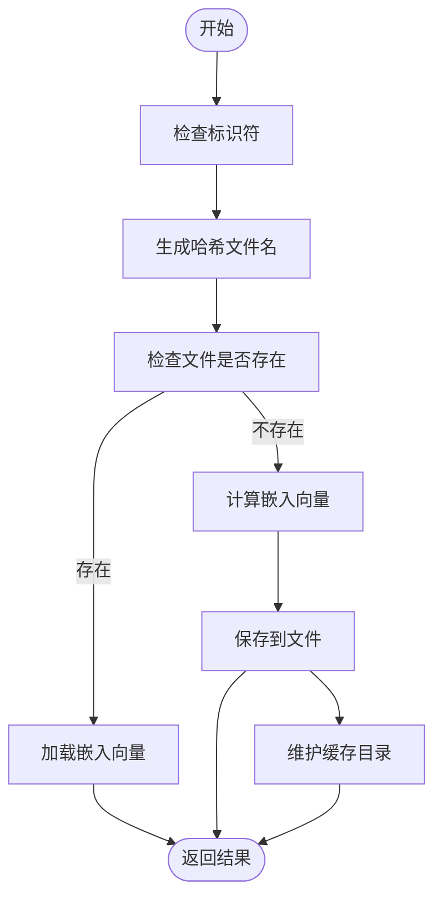
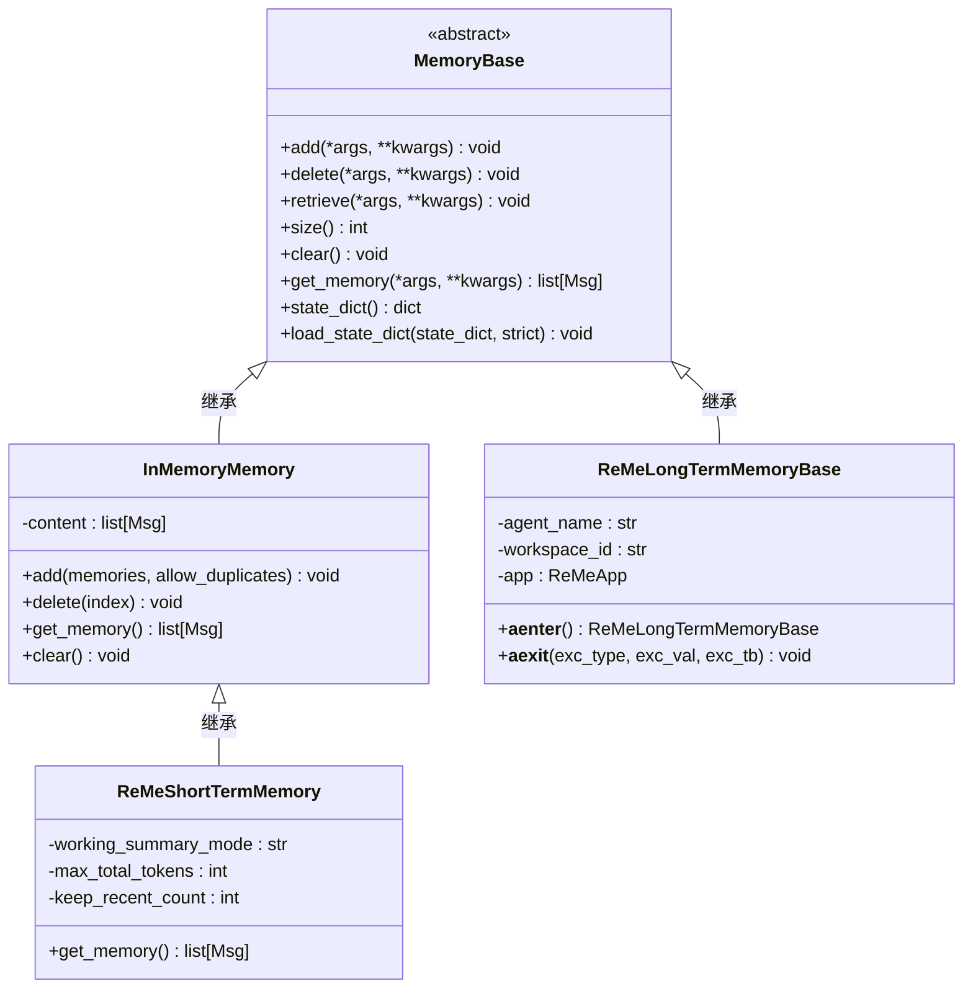

# 内存管理

<cite>
**本文档引用的文件**   
- [memory_base.py](file://src/agentscope/memory/_memory_base.py)
- [in_memory_memory.py](file://src/agentscope/memory/_in_memory_memory.py)
- [file_cache.py](file://src/agentscope/embedding/_file_cache.py)
- [cache_base.py](file://src/agentscope/embedding/_cache_base.py)
- [state_module.py](file://src/agentscope/module/_state_module.py)
- [agent_base.py](file://src/agentscope/agent/_agent_base.py)
- [reme_long_term_memory_base.py](file://src/agentscope/memory/_reme/_reme_long_term_memory_base.py)
- [reme_short_term_memory.py](file://examples/functionality/short_term_memory/reme/reme_short_term_memory.py)
- [memory_with_compress.py](file://examples/functionality/memory/memory_with_compression/_memory_with_compress.py)
- [message_base.py](file://src/agentscope/message/_message_base.py)
</cite>

## 目录
1. [智能体对象生命周期管理](#智能体对象生命周期管理)
2. [嵌入向量缓存机制](#嵌入向量缓存机制)
3. [记忆系统内存占用与优化](#记忆系统内存占用与优化)
4. [内存泄漏检测与垃圾回收调优](#内存泄漏检测与垃圾回收调优)
5. [多智能体场景下的内存策略](#多智能体场景下的内存策略)

## 智能体对象生命周期管理

智能体对象的生命周期管理是内存优化的核心。在AgentScope框架中，所有智能体均继承自`AgentBase`类，该类通过`StateModule`机制实现了完整的生命周期控制。智能体的创建通过标准的Python对象初始化完成，其唯一标识符`id`由`shortuuid`库生成，确保了分布式环境下的唯一性。

智能体的使用遵循异步编程模式，主要通过`reply`、`observe`和`print`等核心方法进行交互。这些方法通过异步上下文管理器进行协调，确保资源的有序使用。当智能体完成其任务或需要被销毁时，应通过`clear_instance_hooks`和`remove_subscribers`等方法显式清理其持有的资源引用，如钩子函数和订阅者列表，以避免内存泄漏。

特别需要注意的是，智能体内部维护了`_reply_task`属性来跟踪当前的回复任务。当需要中断一个正在进行的回复时，应调用`interrupt`方法，该方法会取消底层的异步任务，从而安全地终止执行。这种设计模式确保了智能体对象可以在运行时被精确控制，是实现高效内存管理的关键。

**Section sources**
- [agent_base.py](file://src/agentscope/agent/_agent_base.py#L140-L145)
- [agent_base.py](file://src/agentscope/agent/_agent_base.py#L197-L203)
- [agent_base.py](file://src/agentscope/agent/_agent_base.py#L486-L490)

## 嵌入向量缓存机制

### 实现原理

嵌入向量（embedding）的计算通常是一个高开销的操作。为了减少重复计算，AgentScope提供了基于文件的嵌入向量缓存机制。该机制的核心是`FileEmbeddingCache`类，它实现了`EmbeddingCacheBase`抽象基类所定义的接口。

缓存的实现原理如下：当需要存储一个嵌入向量时，系统首先将输入的`identifier`（一个JSON可序列化对象）通过`json.dumps`转换为字符串，然后使用`SHA256`哈希算法生成一个唯一的文件名（`.npy`扩展名）。嵌入向量数据则使用`numpy.save`函数以二进制格式保存到该文件中。当需要检索时，系统根据相同的`identifier`重新计算哈希值，定位到对应的文件，并使用`numpy.load`加载数据。这种设计确保了相同输入的嵌入向量只需计算一次，后续调用均可直接从磁盘读取，极大地提升了效率。

### 配置方法

`FileEmbeddingCache`提供了灵活的配置选项来管理缓存的生命周期和大小：
- **`cache_dir`**: 指定缓存文件的存储目录，默认为`./.cache/embeddings`。
- **`max_file_number`**: 设置缓存目录中允许的最大文件数量。当文件数超过此限制时，系统会自动删除最旧的文件。
- **`max_cache_size`**: 设置缓存目录的最大大小（以MB为单位）。当目录总大小超过此限制时，系统会持续删除最旧的文件，直到总大小符合要求。

这些配置项使得开发者可以根据应用的内存和存储需求，精确地控制缓存行为，避免缓存无限增长导致的磁盘空间耗尽。

**Diagram sources **
- [file_cache.py](file://src/agentscope/embedding/_file_cache.py#L23-L45)
- [file_cache.py](file://src/agentscope/embedding/_file_cache.py#L53-L131)

**Section sources**
- [file_cache.py](file://src/agentscope/embedding/_file_cache.py#L19-L188)
- [cache_base.py](file://src/agentscope/embedding/_cache_base.py#L12-L64)

## 记忆系统内存占用与优化

### 内存占用特性

AgentScope的记忆系统由多个组件构成，其内存占用特性各不相同：
- **短期记忆 (Short-Term Memory)**: 通常基于`InMemoryMemory`实现，将所有消息（`Msg`对象）存储在内存列表中。其内存占用与对话历史的长度和每条消息的内容大小直接成正比，是内存消耗的主要来源。
- **长期记忆 (Long-Term Memory)**: 如`ReMeLongTermMemoryBase`，其内存占用相对稳定。它主要在运行时维护一个与外部服务（如ReMe）的连接实例，实际的数据存储在外部持久化系统中。
- **压缩记忆 (MemoryWithCompress)**: 这是一种混合模式，它同时维护原始消息的存储（`chat_history_storage`）和压缩后消息的存储（`memory_storage`）。其内存占用取决于`max_token`配置和压缩算法的效率。

### 资源使用优化

针对不同的记忆组件，可以采取以下优化策略：
- **短期记忆优化**: 使用`ReMeShortTermMemory`。该类实现了自动化的内存管理管道，包括**压缩**（Compaction）和**压缩**（Compression）。当工具返回的响应过大时，系统会将其完整内容存储到外部文件，并在内存中只保留一个简短的预览；当总token数超过阈值时，系统会调用LLM将旧的对话历史压缩成一个简洁的摘要。这能有效控制内存占用。
- **长期记忆优化**: 通过`async with`语句正确管理其生命周期。`ReMeLongTermMemoryBase`实现了异步上下文管理器协议，确保在进入上下文时初始化资源，在退出时正确清理，防止连接泄漏。
- **通用优化**: 所有记忆类都继承自`StateModule`，支持`state_dict`和`load_state_dict`方法。这允许将记忆状态序列化到磁盘或数据库，从而在长时间运行的应用中释放内存。

**Diagram sources **
- [memory_base.py](file://src/agentscope/memory/_memory_base.py#L11-L45)
- [in_memory_memory.py](file://src/agentscope/memory/_in_memory_memory.py#L10-L123)
- [reme_short_term_memory.py](file://examples/functionality/short_term_memory/reme/reme_short_term_memory.py#L17-L350)
- [reme_long_term_memory_base.py](file://src/agentscope/memory/_reme/_reme_long_term_memory_base.py#L83-L371)

**Section sources**
- [in_memory_memory.py](file://src/agentscope/memory/_in_memory_memory.py#L10-L123)
- [reme_short_term_memory.py](file://examples/functionality/short_term_memory/reme/reme_short_term_memory.py#L17-L350)
- [memory_with_compress.py](file://examples/functionality/memory/memory_with_compression/_memory_with_compress.py#L64-L714)

## 内存泄漏检测与垃圾回收调优

### 内存泄漏检测

在AgentScope中，最常见的内存泄漏源于未正确清理的资源引用。检测方法包括：
1.  **监控对象引用**: 使用Python的`gc`模块或`tracemalloc`库来跟踪`AgentBase`和`MemoryBase`实例的数量。如果在智能体销毁后，其数量没有减少，则可能存在泄漏。
2.  **检查循环引用**: `AgentBase`类内部的`_subscribers`字典和`_reply_task`属性是潜在的循环引用点。应确保在智能体销毁前，调用`remove_subscribers`并等待`_reply_task`完成或取消。
3.  **分析钩子函数**: 通过`register_instance_hook`注册的实例级钩子函数会持有对智能体的引用。使用`clear_instance_hooks`定期清理不再需要的钩子是必要的。

### 垃圾回收调优

Python的垃圾回收器（GC）通常能有效处理大部分情况，但在高负载的智能体系统中，可以进行以下调优：
- **手动触发GC**: 在关键的内存密集型操作（如处理完一个大型任务）后，可以调用`gc.collect()`强制进行垃圾回收，及时释放内存。
- **调整GC阈值**: 使用`gc.set_threshold()`可以调整GC的触发频率。对于创建和销毁大量智能体的场景，可以适当降低阈值，让GC更频繁地运行，防止内存峰值过高。
- **利用上下文管理器**: 严格使用`async with`语句来管理`ReMeLongTermMemoryBase`和`ReMeShortTermMemory`等资源。这能确保即使发生异常，资源也能被正确释放，是预防泄漏的最有效手段。

**Section sources**
- [agent_base.py](file://src/agentscope/agent/_agent_base.py#L168-L169)
- [agent_base.py](file://src/agentscope/agent/_agent_base.py#L629-L658)
- [reme_long_term_memory_base.py](file://src/agentscope/memory/_reme/_reme_long_term_memory_base.py#L293-L371)
- [state_module.py](file://src/agentscope/module/_state_module.py#L20-L152)

## 多智能体场景下的内存策略

在多智能体协作场景中，内存管理策略需要在共享与隔离之间取得平衡。

### 内存共享策略

内存共享主要通过消息传递实现。一个智能体可以通过`observe`方法接收来自其他智能体的消息，这些消息会被添加到其记忆中。例如，在`MsgHub`模式下，多个智能体可以订阅同一个消息中心，实现信息的广播和共享。这种方式下，共享的是消息的**内容**，而非直接共享内存地址，保证了数据的一致性和安全性。

### 内存隔离策略

每个智能体都拥有独立的内存实例（`memory`属性），这是实现隔离的基础。即使多个智能体使用相同的消息，这些消息在各自的内存中都是独立的副本。这种设计确保了：
- **状态独立**: 一个智能体修改其记忆不会影响其他智能体。
- **错误隔离**: 一个智能体的内存问题（如内存泄漏）不会直接波及到其他智能体。
- **个性化**: 每个智能体可以根据自己的策略对共享的消息进行不同的处理和记忆。

通过结合共享的消息内容和隔离的内存空间，AgentScope实现了既高效协作又安全独立的多智能体系统架构。

**Section sources**
- [agent_base.py](file://src/agentscope/agent/_agent_base.py#L168-L169)
- [agent_base.py](file://src/agentscope/agent/_agent_base.py#L465-L473)
- [message_base.py](file://src/agentscope/message/_message_base.py#L21-L242)