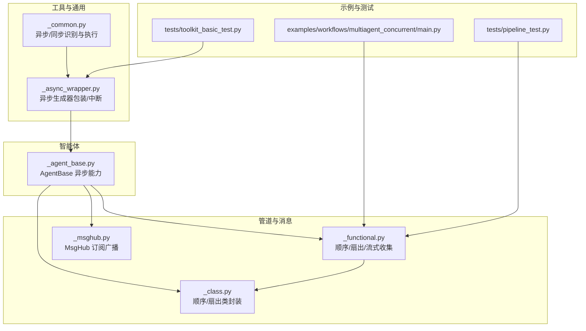
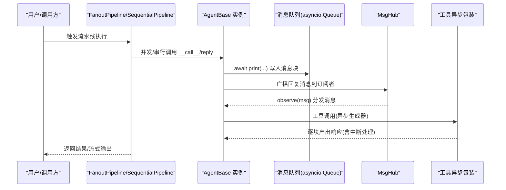
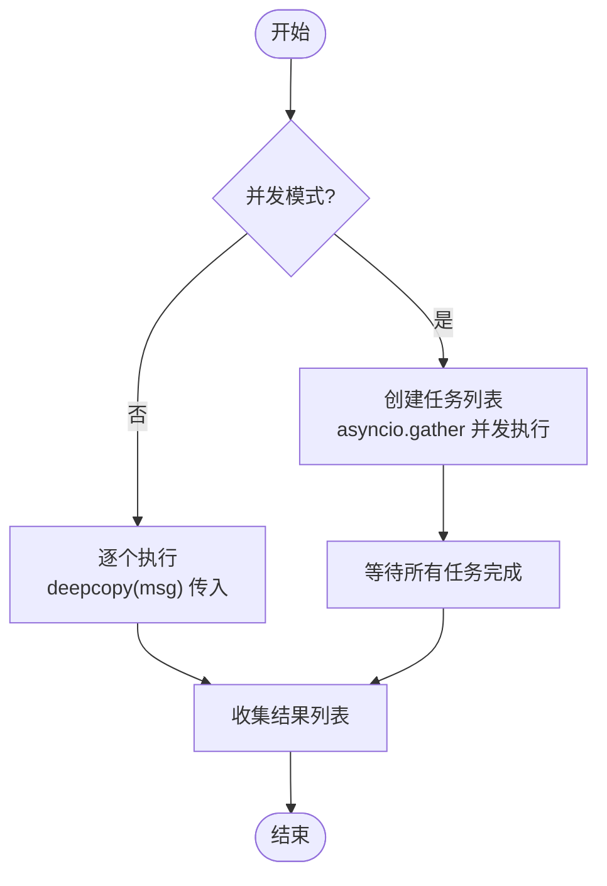
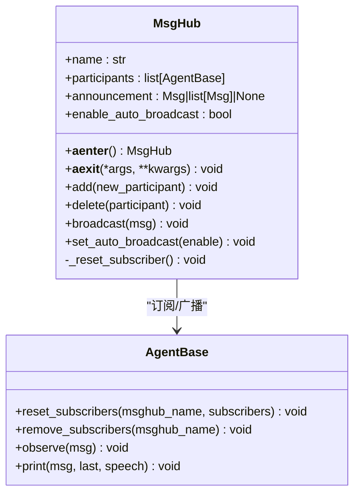
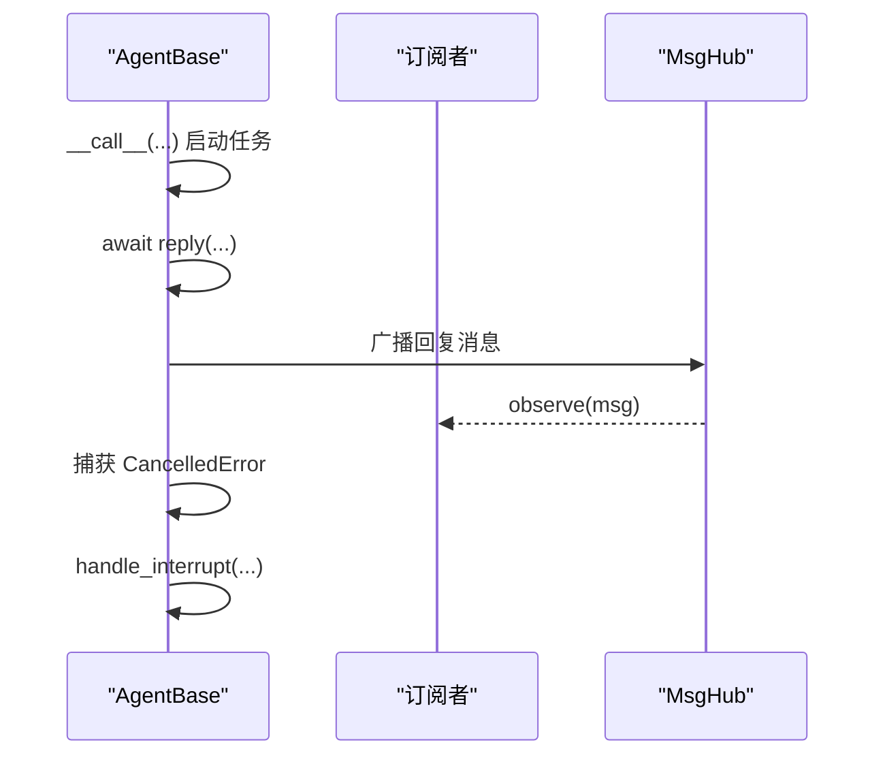
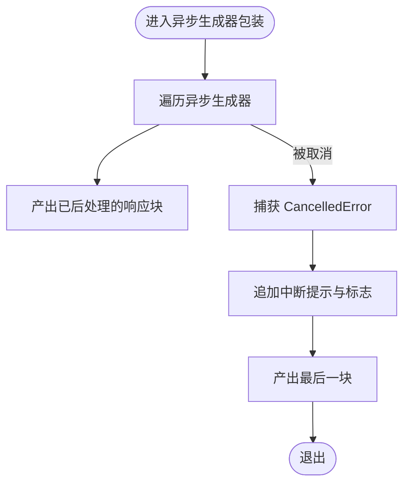
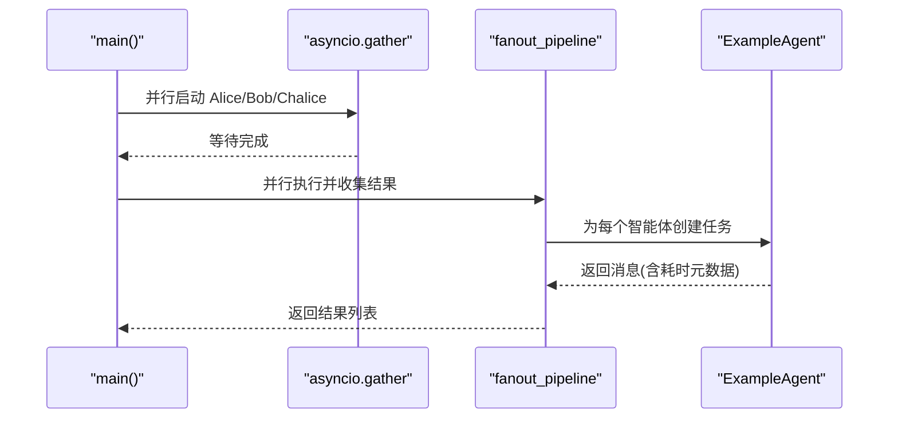
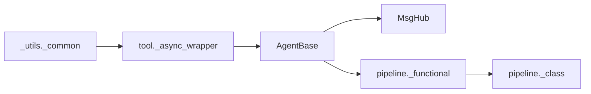

# 异步处理

<cite>
**本文引用的文件**
- [src/agentscope/pipeline/_msghub.py](file://src/agentscope/pipeline/_msghub.py)
- [src/agentscope/agent/_agent_base.py](file://src/agentscope/agent/_agent_base.py)
- [src/agentscope/pipeline/_functional.py](file://src/agentscope/pipeline/_functional.py)
- [src/agentscope/pipeline/_class.py](file://src/agentscope/pipeline/_class.py)
- [src/agentscope/tool/_async_wrapper.py](file://src/agentscope/tool/_async_wrapper.py)
- [src/agentscope/_utils/_common.py](file://src/agentscope/_utils/_common.py)
- [examples/workflows/multiagent_concurrent/main.py](file://examples/workflows/multiagent_concurrent/main.py)
- [tests/pipeline_test.py](file://tests/pipeline_test.py)
- [tests/toolkit_basic_test.py](file://tests/toolkit_basic_test.py)
</cite>

## 目录
1. [简介](#简介)
2. [项目结构](#项目结构)
3. [核心组件](#核心组件)
4. [架构总览](#架构总览)
5. [详细组件分析](#详细组件分析)
6. [依赖关系分析](#依赖关系分析)
7. [性能考量](#性能考量)
8. [故障排查指南](#故障排查指南)
9. [结论](#结论)
10. [附录](#附录)

## 简介
本指南围绕 agentscope 中的异步处理能力展开，重点讲解基于 async/await 的异步 IO 模型在多智能体系统中的应用，展示如何通过协程实现高并发任务处理；详解消息管道（pipeline）的异步执行机制，特别是 MsgHub 的事件分发优化；通过并发工作流示例演示并行智能体协作带来的性能优势；指导异步函数调用的批处理与节流策略，避免事件循环阻塞；最后提供异步代码调试技巧与常见性能陷阱的规避方法。

## 项目结构
agentscope 的异步处理主要分布在以下模块：
- 消息管道与订阅：pipeline 子模块提供顺序与扇出（fanout）两类异步流水线，以及基于 asyncio.gather 的并发执行；MsgHub 负责智能体间的自动广播与订阅管理。
- 智能体基类：AgentBase 定义了异步回复、打印、中断、订阅广播等异步能力，并内置消息队列用于流式输出收集。
- 工具与响应包装：tool 子模块提供异步生成器包装与中断处理，确保异步工具在被取消时仍能产出“已中断”的响应。
- 通用工具：_utils 提供异步/同步函数识别与统一执行逻辑，便于在混合场景中安全调度。

图表来源
- [src/agentscope/pipeline/_functional.py](file://src/agentscope/pipeline/_functional.py#L1-L193)
- [src/agentscope/pipeline/_class.py](file://src/agentscope/pipeline/_class.py#L1-L91)
- [src/agentscope/pipeline/_msghub.py](file://src/agentscope/pipeline/_msghub.py#L1-L157)
- [src/agentscope/agent/_agent_base.py](file://src/agentscope/agent/_agent_base.py#L1-L733)
- [src/agentscope/tool/_async_wrapper.py](file://src/agentscope/tool/_async_wrapper.py#L1-L110)
- [src/agentscope/_utils/_common.py](file://src/agentscope/_utils/_common.py#L1-L432)
- [examples/workflows/multiagent_concurrent/main.py](file://examples/workflows/multiagent_concurrent/main.py#L1-L94)
- [tests/pipeline_test.py](file://tests/pipeline_test.py#L256-L400)
- [tests/toolkit_basic_test.py](file://tests/toolkit_basic_test.py#L638-L745)

章节来源
- [src/agentscope/pipeline/_functional.py](file://src/agentscope/pipeline/_functional.py#L1-L193)
- [src/agentscope/pipeline/_class.py](file://src/agentscope/pipeline/_class.py#L1-L91)
- [src/agentscope/pipeline/_msghub.py](file://src/agentscope/pipeline/_msghub.py#L1-L157)
- [src/agentscope/agent/_agent_base.py](file://src/agentscope/agent/_agent_base.py#L1-L733)
- [src/agentscope/tool/_async_wrapper.py](file://src/agentscope/tool/_async_wrapper.py#L1-L110)
- [src/agentscope/_utils/_common.py](file://src/agentscope/_utils/_common.py#L1-L432)
- [examples/workflows/multiagent_concurrent/main.py](file://examples/workflows/multiagent_concurrent/main.py#L1-L94)
- [tests/pipeline_test.py](file://tests/pipeline_test.py#L256-L400)
- [tests/toolkit_basic_test.py](file://tests/toolkit_basic_test.py#L638-L745)

## 核心组件
- 异步流水线
  - 顺序流水线：按序执行多个智能体，前一智能体输出作为下一智能体输入。
  - 扇出流水线：将同一输入同时发送给多个智能体，可选择并发（asyncio.gather）或串行执行。
  - 流式消息收集：通过消息队列与异步生成器，逐块产出智能体打印的消息，支持语音块联动。
- MsgHub
  - 基于上下文管理器，自动为参与者设置订阅关系；支持进入时广播公告消息；退出时清理订阅。
  - 支持动态增删参与者，并可切换自动广播模式。
- AgentBase
  - 异步回复、中断、打印、订阅广播、消息队列启用等能力。
  - 内置钩子注册与清理，支持预/后置回调。
- 工具异步包装
  - 统一封装对象、同步生成器、异步生成器为异步生成器。
  - 在异步生成器被取消时，追加“已中断”提示并延迟 CancelledError，保证可观测性。
- 通用异步工具
  - 判断函数是否为异步（含生成器），并统一执行，兼容同步/异步混合场景。

章节来源
- [src/agentscope/pipeline/_functional.py](file://src/agentscope/pipeline/_functional.py#L1-L193)
- [src/agentscope/pipeline/_class.py](file://src/agentscope/pipeline/_class.py#L1-L91)
- [src/agentscope/pipeline/_msghub.py](file://src/agentscope/pipeline/_msghub.py#L1-L157)
- [src/agentscope/agent/_agent_base.py](file://src/agentscope/agent/_agent_base.py#L1-L733)
- [src/agentscope/tool/_async_wrapper.py](file://src/agentscope/tool/_async_wrapper.py#L1-L110)
- [src/agentscope/_utils/_common.py](file://src/agentscope/_utils/_common.py#L1-L432)

## 架构总览
下图展示了多智能体系统中异步处理的整体交互：AgentBase 通过异步回复与中断机制驱动工作流；MsgHub 负责订阅与广播；流水线（顺序/扇出）协调多个智能体的并发/串行执行；工具异步包装保障异步工具的可观测中断；流式消息收集通过消息队列与异步生成器实现。

图表来源
- [src/agentscope/pipeline/_functional.py](file://src/agentscope/pipeline/_functional.py#L1-L193)
- [src/agentscope/pipeline/_class.py](file://src/agentscope/pipeline/_class.py#L1-L91)
- [src/agentscope/pipeline/_msghub.py](file://src/agentscope/pipeline/_msghub.py#L1-L157)
- [src/agentscope/agent/_agent_base.py](file://src/agentscope/agent/_agent_base.py#L1-L733)
- [src/agentscope/tool/_async_wrapper.py](file://src/agentscope/tool/_async_wrapper.py#L1-L110)

## 详细组件分析

### 组件A：消息管道（顺序/扇出/流式）
- 顺序流水线
  - 逐个调用智能体，上一个输出作为下一个输入，最终返回最后一个智能体输出。
- 扇出流水线
  - 并发模式使用 asyncio.gather 并行执行；串行模式逐个执行。
  - 支持 deepcopy 输入，确保各智能体独立处理原始消息。
- 流式消息收集
  - 为每个智能体启用消息队列，执行给定协程任务，异步生成器逐块产出消息。
  - 支持语音块联动输出；以特殊结束信号控制生成器退出；异常在消费完成后抛出。

图表来源
- [src/agentscope/pipeline/_functional.py](file://src/agentscope/pipeline/_functional.py#L1-L193)

章节来源
- [src/agentscope/pipeline/_functional.py](file://src/agentscope/pipeline/_functional.py#L1-L193)
- [src/agentscope/pipeline/_class.py](file://src/agentscope/pipeline/_class.py#L1-L91)
- [tests/pipeline_test.py](file://tests/pipeline_test.py#L256-L400)

### 组件B：MsgHub 事件分发优化
- 上下文管理器入口/出口
  - 进入时重置订阅并可选广播公告消息。
  - 退出时移除订阅，避免资源泄漏。
- 动态参与者管理
  - 支持添加/删除参与者，并重新建立订阅映射。
- 自动广播开关
  - 可切换自动广播模式；关闭时仅手动广播。

图表来源
- [src/agentscope/pipeline/_msghub.py](file://src/agentscope/pipeline/_msghub.py#L1-L157)
- [src/agentscope/agent/_agent_base.py](file://src/agentscope/agent/_agent_base.py#L1-L733)

章节来源
- [src/agentscope/pipeline/_msghub.py](file://src/agentscope/pipeline/_msghub.py#L1-L157)
- [src/agentscope/agent/_agent_base.py](file://src/agentscope/agent/_agent_base.py#L1-L733)

### 组件C：AgentBase 异步能力与订阅广播
- 异步回复与中断
  - __call__ 包裹 reply，捕获 CancelledError 并调用 handle_interrupt。
  - interrupt 可取消当前任务，若未完成则触发中断处理。
- 订阅广播
  - _broadcast_to_subscribers 将消息广播给所有订阅者。
  - reset_subscribers/remove_subscribers 管理订阅集合。
- 流式输出与消息队列
  - print 将消息块写入队列（若启用），并支持语音播放。
  - set_msg_queue_enabled 控制队列启停与容量。
- 钩子机制
  - 支持类级/实例级钩子注册与清理，覆盖 pre/post 回调点。

图表来源
- [src/agentscope/agent/_agent_base.py](file://src/agentscope/agent/_agent_base.py#L1-L733)
- [src/agentscope/pipeline/_msghub.py](file://src/agentscope/pipeline/_msghub.py#L1-L157)

章节来源
- [src/agentscope/agent/_agent_base.py](file://src/agentscope/agent/_agent_base.py#L1-L733)

### 组件D：工具异步包装与中断处理
- 统一包装
  - 将对象、同步生成器、异步生成器包装为异步生成器，便于统一消费。
- 中断处理
  - 当异步生成器被取消时，追加“已中断”提示信息，并延迟 CancelledError，使调用方可感知中断状态。
  - 保持 is_interrupted/is_last 标志，便于上层判断与传播。

图表来源
- [src/agentscope/tool/_async_wrapper.py](file://src/agentscope/tool/_async_wrapper.py#L1-L110)

章节来源
- [src/agentscope/tool/_async_wrapper.py](file://src/agentscope/tool/_async_wrapper.py#L1-L110)
- [tests/toolkit_basic_test.py](file://tests/toolkit_basic_test.py#L638-L745)

### 组件E：并发工作流示例（并行智能体协作）
- 示例要点
  - 使用 asyncio.gather 并行启动多个智能体。
  - 通过 fanout_pipeline 并行执行并收集结果。
  - 结合 print 输出时间元数据，统计平均耗时，验证并行收益。
- 性能优势
  - 并行执行显著缩短总耗时，适用于 I/O 密集型任务。

图表来源
- [examples/workflows/multiagent_concurrent/main.py](file://examples/workflows/multiagent_concurrent/main.py#L1-L94)
- [src/agentscope/pipeline/_functional.py](file://src/agentscope/pipeline/_functional.py#L1-L193)

章节来源
- [examples/workflows/multiagent_concurrent/main.py](file://examples/workflows/multiagent_concurrent/main.py#L1-L94)
- [tests/pipeline_test.py](file://tests/pipeline_test.py#L256-L400)

## 依赖关系分析
- 组件耦合
  - AgentBase 与 MsgHub：通过订阅/广播解耦，降低耦合度。
  - 流水线与 AgentBase：流水线通过异步调用与消息队列与 AgentBase 解耦。
  - 工具异步包装与 AgentBase：工具调用经由包装器统一处理，屏蔽同步/异步差异。
- 外部依赖
  - asyncio：并发执行、任务创建、队列、取消。
  - typing/asyncio.Queue：类型标注与消息队列。
- 潜在环路
  - 无直接循环导入；MsgHub 与 AgentBase 通过方法调用交互，不形成环。

图表来源
- [src/agentscope/agent/_agent_base.py](file://src/agentscope/agent/_agent_base.py#L1-L733)
- [src/agentscope/pipeline/_msghub.py](file://src/agentscope/pipeline/_msghub.py#L1-L157)
- [src/agentscope/pipeline/_functional.py](file://src/agentscope/pipeline/_functional.py#L1-L193)
- [src/agentscope/pipeline/_class.py](file://src/agentscope/pipeline/_class.py#L1-L91)
- [src/agentscope/tool/_async_wrapper.py](file://src/agentscope/tool/_async_wrapper.py#L1-L110)
- [src/agentscope/_utils/_common.py](file://src/agentscope/_utils/_common.py#L1-L432)

章节来源
- [src/agentscope/agent/_agent_base.py](file://src/agentscope/agent/_agent_base.py#L1-L733)
- [src/agentscope/pipeline/_msghub.py](file://src/agentscope/pipeline/_msghub.py#L1-L157)
- [src/agentscope/pipeline/_functional.py](file://src/agentscope/pipeline/_functional.py#L1-L193)
- [src/agentscope/pipeline/_class.py](file://src/agentscope/pipeline/_class.py#L1-L91)
- [src/agentscope/tool/_async_wrapper.py](file://src/agentscope/tool/_async_wrapper.py#L1-L110)
- [src/agentscope/_utils/_common.py](file://src/agentscope/_utils/_common.py#L1-L432)

## 性能考量
- 并发策略
  - I/O 密集型任务优先使用 asyncio.gather 并行执行，减少总等待时间。
  - 对 CPU 密集型任务，建议拆分为多个 I/O 密集型子任务或使用进程池，避免阻塞事件循环。
- 资源管理
  - 合理设置消息队列容量，避免内存压力；及时清理订阅与任务句柄。
  - 使用 deepcopy 传递输入，避免共享状态导致的竞争与错误。
- 中断与可观测性
  - 异步生成器被取消时，包装器追加中断提示，便于上层快速感知并采取措施。
- 调试与监控
  - 使用日志记录关键路径耗时；对异常进行分类处理，避免吞掉底层错误。
  - 在高频调用场景下，考虑限流与背压策略，防止事件循环过载。

[本节为通用指导，无需特定文件引用]

## 故障排查指南
- 中断与取消
  - 若工具函数为异步生成器，被取消时应看到包含中断标记的响应块；若为同步函数，需在智能体层面处理中断。
- 流式输出异常
  - 流式消息收集在消费完成后会抛出任务异常，注意在上层捕获并处理。
- 订阅广播问题
  - 确认 MsgHub 是否正确设置自动广播；退出时订阅是否被清理。
- 并发执行异常
  - 并发模式下，任一智能体异常可能影响整体结果；建议对每个任务单独 try/except 并聚合错误信息。

章节来源
- [src/agentscope/tool/_async_wrapper.py](file://src/agentscope/tool/_async_wrapper.py#L1-L110)
- [src/agentscope/pipeline/_functional.py](file://src/agentscope/pipeline/_functional.py#L118-L193)
- [src/agentscope/pipeline/_msghub.py](file://src/agentscope/pipeline/_msghub.py#L73-L157)
- [tests/toolkit_basic_test.py](file://tests/toolkit_basic_test.py#L638-L745)
- [tests/pipeline_test.py](file://tests/pipeline_test.py#L380-L400)

## 结论
agentscope 的异步处理体系以 AgentBase 为核心，结合 MsgHub 的订阅广播、流水线的顺序/扇出执行、工具异步包装与消息队列，构建了高并发、可观测、可中断的多智能体执行框架。通过并发工作流示例可直观验证并行带来的性能提升；借助统一的异步/同步识别与执行工具，可在混合场景中安全调度。遵循本文的性能与调试建议，可进一步提升系统的稳定性与可观测性。

[本节为总结，无需特定文件引用]

## 附录
- 关键实现路径参考
  - 顺序流水线：[sequential_pipeline](file://src/agentscope/pipeline/_functional.py#L10-L45)
  - 扇出流水线：[fanout_pipeline](file://src/agentscope/pipeline/_functional.py#L47-L105)
  - 流式消息收集：[stream_printing_messages](file://src/agentscope/pipeline/_functional.py#L107-L193)
  - MsgHub 订阅广播：[__aenter__/__aexit__/broadcast](file://src/agentscope/pipeline/_msghub.py#L73-L157)
  - AgentBase 异步回复与中断：[__call__/interrupt/handle_interrupt](file://src/agentscope/agent/_agent_base.py#L444-L490)
  - 工具异步包装与中断：[_async_generator_wrapper](file://src/agentscope/tool/_async_wrapper.py#L63-L110)
  - 异步/同步识别与执行：[_is_async_func/_execute_async_or_sync_func](file://src/agentscope/_utils/_common.py#L92-L132)
- 示例与测试参考
  - 并发工作流示例：[multiagent_concurrent/main.py](file://examples/workflows/multiagent_concurrent/main.py#L1-L94)
  - 流水线并发/串行测试：[tests/pipeline_test.py](file://tests/pipeline_test.py#L256-L357)
  - 工具中断测试：[tests/toolkit_basic_test.py](file://tests/toolkit_basic_test.py#L638-L745)

[本节为索引，无需特定文件引用]