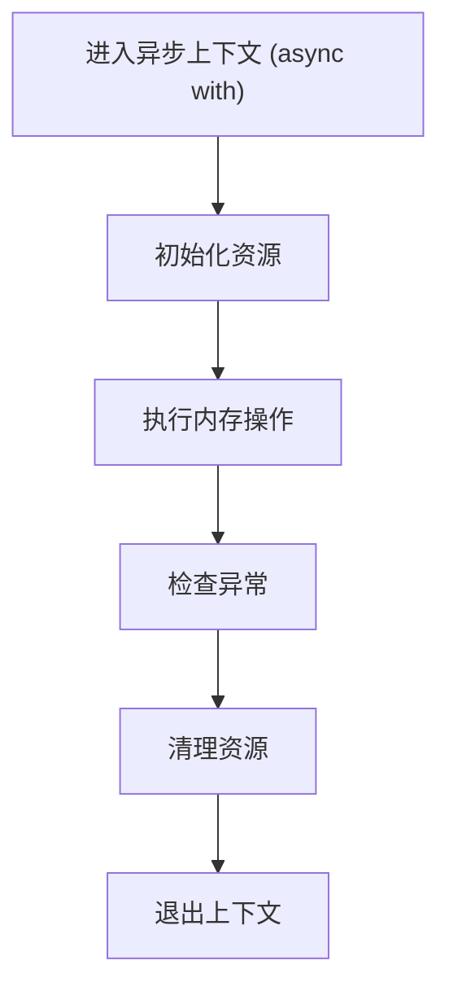
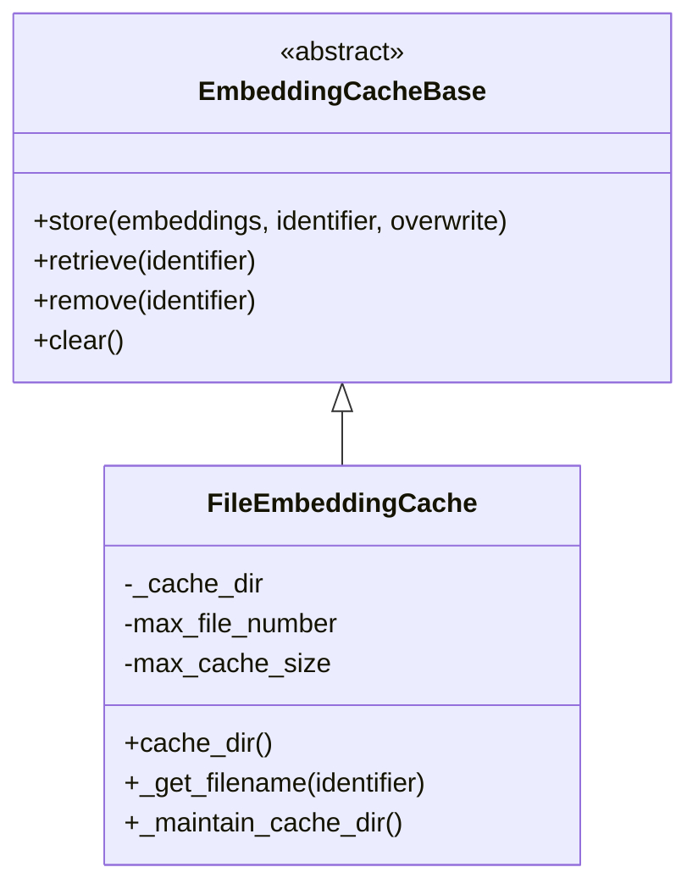
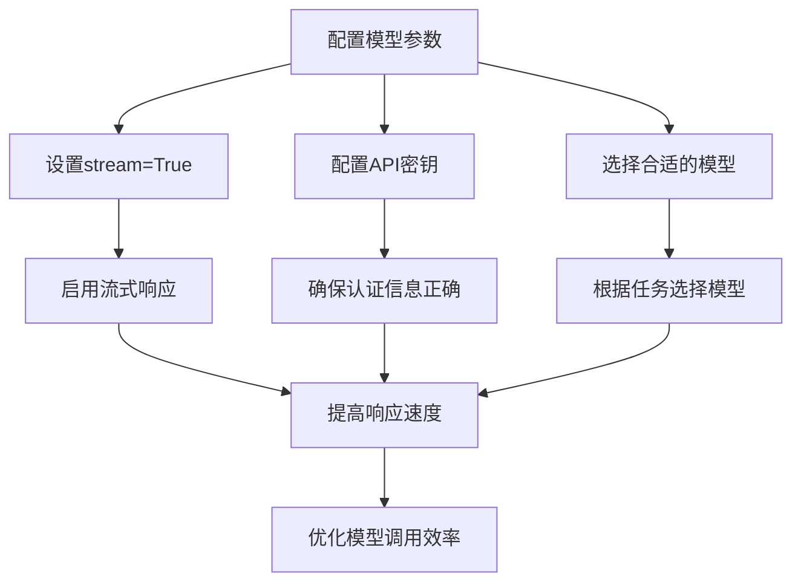
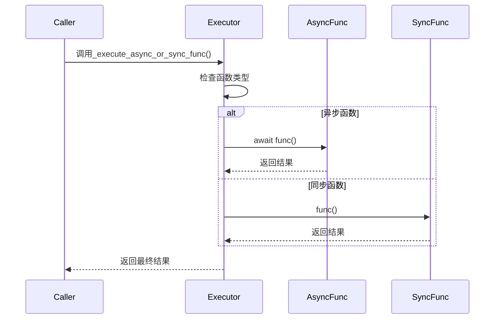
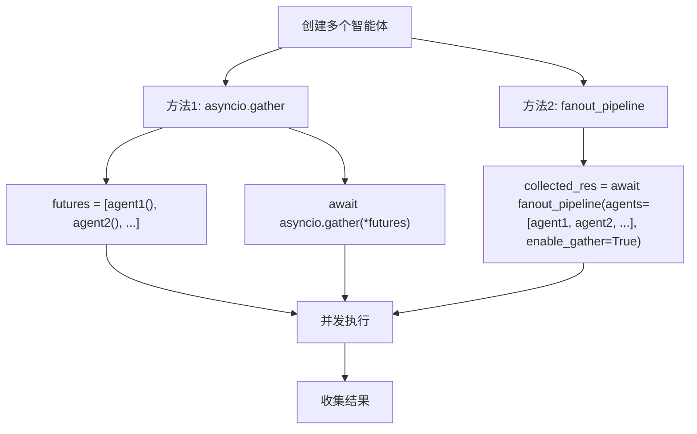
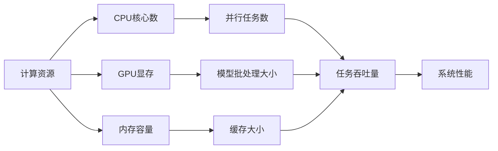
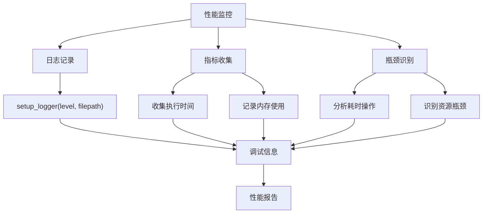

# 性能优化

<cite>
**本文档中引用的文件**   
- [embedding/_cache_base.py](file://src/agentscope/embedding/_cache_base.py)
- [embedding/_file_cache.py](file://src/agentscope/embedding/_file_cache.py)
- [tool/_async_wrapper.py](file://src/agentscope/tool/_async_wrapper.py)
- [pipeline/_functional.py](file://src/agentscope/pipeline/_functional.py)
- [model/_model_base.py](file://src/agentscope/model/_model_base.py)
- [_utils/_common.py](file://src/agentscope/_utils/_common.py)
- [memory/_reme/_reme_long_term_memory_base.py](file://src/agentscope/memory/_reme/_reme_long_term_memory_base.py)
- [examples/workflows/multiagent_concurrent/main.py](file://examples/workflows/multiagent_concurrent/main.py)
- [examples/functionality/short_term_memory/reme/README.md](file://examples/functionality/short_term_memory/reme/README.md)
- [_logging.py](file://src/agentscope/_logging.py)
</cite>

## 目录
1. [简介](#简介)
2. [内存管理策略](#内存管理策略)
3. [连接池配置](#连接池配置)
4. [异步IO最佳实践](#异步io最佳实践)
5. [多智能体工作流优化](#多智能体工作流优化)
6. [资源配置建议](#资源配置建议)
7. [性能监控与瓶颈识别](#性能监控与瓶颈识别)

## 简介
本指南详细阐述了AgentScope框架中的性能优化策略，涵盖内存管理、连接池配置、异步IO处理、多智能体工作流优化、资源配置以及性能监控等方面。通过深入分析框架的核心组件和实现机制，为开发者提供全面的性能优化指导，以提升模型调用效率和系统响应速度。

## 内存管理策略

### 对象生命周期管理
在AgentScope中，对象的生命周期管理主要通过异步上下文管理器（async context manager）实现。关键组件如`ReMeLongTermMemoryBase`和`ReMeShortTermMemory`都实现了`__aenter__`和`__aexit__`方法，确保资源的正确初始化和清理。



**内存管理流程**
- **初始化**：在`__aenter__`方法中初始化ReMe应用上下文
- **执行**：在上下文块内执行内存记录和检索操作
- **清理**：在`__aexit__`方法中正确关闭资源，即使发生异常也能确保清理

**Section sources**
- [memory/_reme/_reme_long_term_memory_base.py](file://src/agentscope/memory/_reme/_reme_long_term_memory_base.py#L293-L371)

### 缓存机制
AgentScope提供了基于文件的嵌入缓存机制，通过`FileEmbeddingCache`类实现，有效避免重复计算嵌入向量。



**缓存特性**
- **持久化存储**：嵌入向量以二进制文件（.npy）形式存储在本地
- **容量控制**：支持最大文件数和最大缓存大小限制
- **自动维护**：当缓存超出限制时，自动删除最旧的文件

**Diagram sources**
- [embedding/_cache_base.py](file://src/agentscope/embedding/_cache_base.py#L12-L64)
- [embedding/_file_cache.py](file://src/agentscope/embedding/_file_cache.py#L19-L188)

**Section sources**
- [embedding/_file_cache.py](file://src/agentscope/embedding/_file_cache.py#L19-L188)

## 连接池配置

### 模型调用优化
通过合理配置模型调用参数，可以显著提高调用效率。关键配置包括：



**配置建议**
- **流式响应**：设置`stream=True`以启用流式输出，减少等待时间
- **连接复用**：利用HTTP连接池复用底层连接，减少连接建立开销
- **超时设置**：合理配置连接和读取超时，避免长时间等待

**Section sources**
- [model/_model_base.py](file://src/agentscope/model/_model_base.py#L19-L37)

## 异步IO最佳实践

### async/await模式
AgentScope充分利用Python的异步特性，通过`async/await`实现高并发处理。核心工具函数`_execute_async_or_sync_func`能够自动识别并执行同步或异步函数。



**最佳实践**
- **避免阻塞**：将耗时操作（如网络请求、文件IO）包装为异步函数
- **并发执行**：使用`asyncio.gather()`并行执行多个异步任务
- **资源管理**：始终使用异步上下文管理器确保资源正确释放

**Diagram sources**
- [_utils/_common.py](file://src/agentscope/_utils/_common.py#L108-L131)

**Section sources**
- [_utils/_common.py](file://src/agentscope/_utils/_common.py#L108-L131)

## 多智能体工作流优化

### 并发执行模式
AgentScope提供了多种多智能体并发执行模式，包括`asyncio.gather`和`fanout_pipeline`。



**性能对比**
- **asyncio.gather**：直接使用Python标准库，灵活性高
- **fanout_pipeline**：封装了更高级的抽象，支持启用/禁用并发

**代码示例**
```python
# 使用asyncio.gather
futures = [alice(), bob(), chalice()]
await asyncio.gather(*futures)

# 使用fanout_pipeline
collected_res = await fanout_pipeline(
    agents=[alice, bob, chalice],
    enable_gather=True,
)
```

**Section sources**
- [examples/workflows/multiagent_concurrent/main.py](file://examples/workflows/multiagent_concurrent/main.py#L73-L82)
- [pipeline/_functional.py](file://src/agentscope/pipeline/_functional.py#L47-L105)

## 资源配置建议

### 计算密集型任务平衡
合理配置资源参数，平衡计算密集型任务与响应速度：



**配置参数**
- **max_total_tokens**：设置为模型上下文窗口的20%-50%
- **keep_recent_count**：生产环境中建议设置为10，保持对话连贯性
- **working_summary_mode**：推荐使用"auto"模式，结合压缩和紧凑化策略

**Section sources**
- [examples/functionality/short_term_memory/reme/README.md](file://examples/functionality/short_term_memory/reme/README.md#L130-L162)

## 性能监控与瓶颈识别

### 监控方法
通过日志记录和性能指标监控系统运行状态：



**监控策略**
- **日志级别**：根据需要设置INFO、DEBUG、WARNING等不同级别
- **性能计时**：记录关键操作的执行时间，识别耗时环节
- **资源跟踪**：监控内存和缓存使用情况，及时发现资源瓶颈

**Section sources**
- [_logging.py](file://src/agentscope/_logging.py#L15-L48)
- [examples/workflows/multiagent_concurrent/main.py](file://examples/workflows/multiagent_concurrent/main.py#L48-L51)