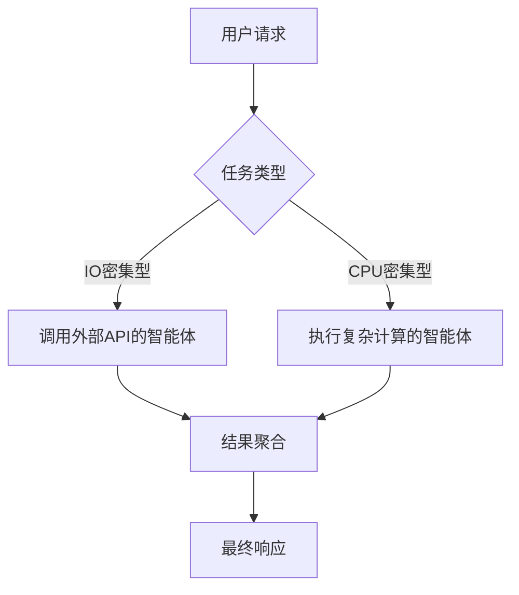
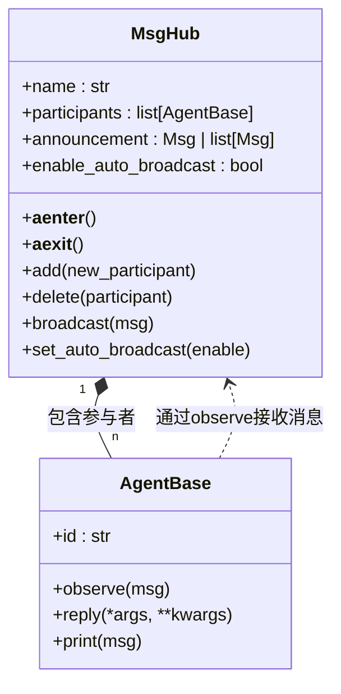
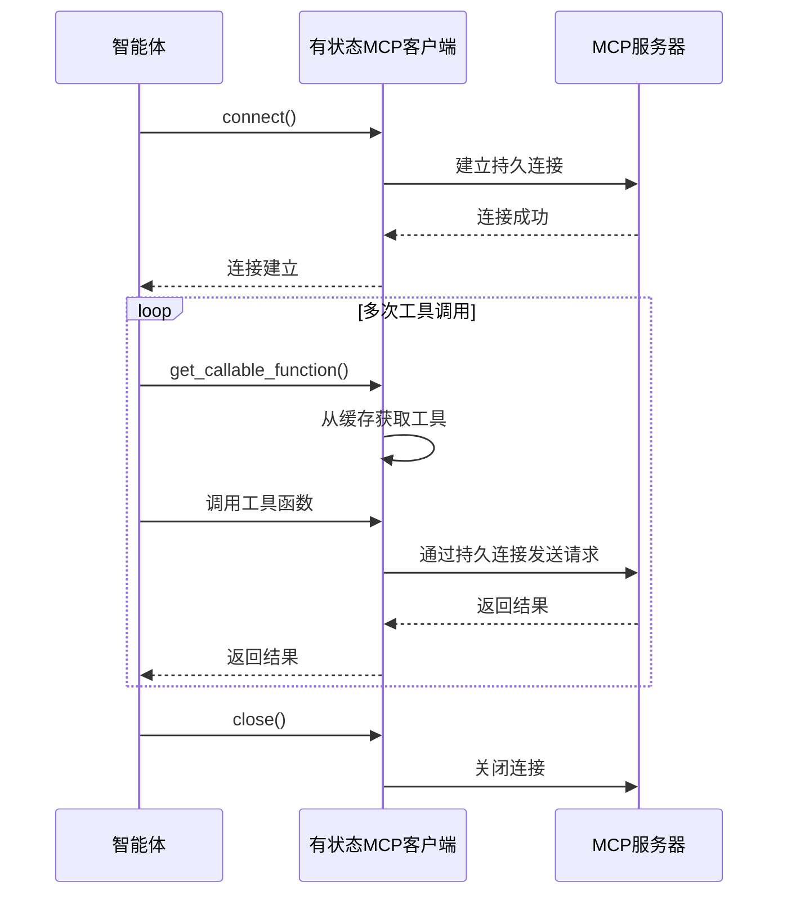

# 资源调度

<cite>
**本文档中引用的文件**   
- [MsgHub](file://src/agentscope/pipeline/_msghub.py)
- [模型基础类](file://src/agentscope/model/_model_base.py)
- [MCP有状态客户端](file://src/agentscope/mcp/_http_stateful_client.py)
- [MCP客户端基础类](file://src/agentscope/mcp/_stateful_client_base.py)
- [Agent基础类](file://src/agentscope/agent/_agent_base.py)
- [运行配置](file://src/agentscope/_run_config.py)
- [异步包装器](file://src/agentscope/tool/_async_wrapper.py)
</cite>

## 目录
1. [引言](#引言)
2. [模型调用连接池与复用机制](#模型调用连接池与复用机制)
3. [多智能体环境下的计算资源分配](#多智能体环境下的计算资源分配)
4. [消息中心负载均衡配置](#消息中心负载均衡配置)
5. [动态资源调整方案](#动态资源调整方案)
6. [第三方服务调用的限流与重试策略](#第三方服务调用的限流与重试策略)
7. [结论](#结论)

## 引言
本指南旨在为AgentScope框架提供全面的资源调度优化方案。通过深入分析框架的架构和核心组件，我们将详细阐述如何优化模型调用、智能体通信和资源管理，以降低网络开销、提高系统吞吐量，并实现高效的跨智能体通信。本指南将涵盖连接池配置、计算资源分配、负载均衡、动态伸缩和第三方服务调用策略等关键主题。

## 模型调用连接池与复用机制

AgentScope框架通过其模型调用机制实现了高效的连接管理和资源复用。核心在于`ChatModelBase`类的设计，它为所有聊天模型提供了统一的基类接口。

模型连接的复用主要通过以下机制实现：
- **持久化客户端实例**：当创建一个模型实例（如`OpenAIChatModel`或`DashScopeChatModel`）时，该实例会维护一个到后端API的持久化连接。这个实例可以在整个应用生命周期内被重复使用，避免了为每次调用建立新连接的开销。
- **异步调用支持**：模型的`__call__`方法是异步的，允许在单个连接上并发处理多个请求，从而最大化连接的利用率。
- **配置集中管理**：模型的配置（如API密钥、端点URL）在实例化时被封装，确保了连接参数的一致性和安全性。

通过复用模型实例，可以显著降低网络延迟和认证开销，提高系统的整体吞吐量。

**Section sources**
- [模型基础类](file://src/agentscope/model/_model_base.py#L13-L44)

## 多智能体环境下的计算资源分配

在多智能体系统中，合理分配CPU和IO密集型任务是优化性能的关键。AgentScope通过其异步架构和灵活的流水线设计来实现这一目标。

### CPU与IO密集型任务平衡

AgentScope的智能体（`AgentBase`）本质上是异步协程，这使得系统能够高效地处理IO密集型任务。当一个智能体等待模型响应或工具调用结果时，事件循环可以将控制权交给其他智能体，从而充分利用CPU资源。

对于任务分配，框架提供了两种主要的流水线模式：

1.  **顺序流水线 (`SequentialPipeline`)**：适用于任务间有强依赖关系的场景。前一个智能体的输出作为后一个智能体的输入，确保了逻辑的正确性。
2.  **扇出流水线 (`FanoutPipeline`)**：适用于可以并行处理的任务。通过设置`enable_gather=True`，可以并发执行多个智能体，显著提高处理速度。

通过将IO密集型任务（如调用外部API）与CPU密集型任务（如复杂的逻辑推理）分配给不同的智能体，并利用扇出流水线进行并行处理，可以实现计算资源的最优平衡。

**Diagram sources**
- [流水线类](file://src/agentscope/pipeline/_class.py#L10-L90)
- [流水线函数](file://src/agentscope/pipeline/_functional.py#L47-L85)

**Section sources**
- [流水线类](file://src/agentscope/pipeline/_class.py#L10-L90)
- [流水线函数](file://src/agentscope/pipeline/_functional.py#L47-L85)
- [Agent基础类](file://src/agentscope/agent/_agent_base.py#L30-L44)

## 消息中心负载均衡配置

`MsgHub`是AgentScope中用于在一组智能体之间共享消息的核心组件，它充当了消息中心的角色，其设计直接影响跨智能体通信的效率。

### 负载均衡与通信优化

`MsgHub`通过以下方式优化通信效率：

- **自动广播**：当`enable_auto_broadcast=True`（默认）时，任何参与智能体的回复消息都会自动广播给所有其他参与者。这极大地简化了代码，避免了手动调用`observe`方法的繁琐过程。
- **动态成员管理**：`MsgHub`支持在运行时通过`add()`和`delete()`方法动态添加或移除参与者，提供了灵活的负载均衡能力。可以根据负载情况将任务动态分配给不同的智能体组。
- **公告机制**：通过`announcement`参数，可以在`MsgHub`启动时向所有参与者广播初始消息，确保所有智能体在一致的上下文中开始工作。

这种中心化的消息分发模式减少了点对点通信的复杂性，实现了通信负载的均衡。

**Diagram sources**
- [MsgHub](file://src/agentscope/pipeline/_msghub.py#L14-L157)

**Section sources**
- [MsgHub](file://src/agentscope/pipeline/_msghub.py#L14-L157)

## 动态资源调整方案

根据系统负载动态调整智能体实例是实现弹性伸缩的关键。虽然AgentScope本身不直接提供自动伸缩功能，但其模块化设计为实现此功能提供了坚实的基础。

### 基于负载的智能体实例伸缩

一个可行的动态调整方案如下：

1.  **监控**：实现一个监控服务，持续跟踪关键指标，如消息队列长度、智能体处理延迟和系统资源利用率。
2.  **决策**：当监控指标超过预设阈值（如队列积压严重）时，决策引擎触发伸缩操作。
3.  **伸缩**：
    -   **扩容**：创建新的智能体实例，并将其动态添加到现有的`MsgHub`或工作池中。这可以通过调用`MsgHub.add()`方法实现。
    -   **缩容**：当负载降低时，从`MsgHub`中移除智能体实例（通过`MsgHub.delete()`），并优雅地关闭这些实例。

此方案利用了`MsgHub`的动态成员管理能力，实现了智能体实例的按需伸缩，从而优化了资源利用率。

**Section sources**
- [MsgHub](file://src/agentscope/pipeline/_msghub.py#L95-L128)

## 第三方服务调用的限流与重试策略

与外部服务（如MCP服务器）的交互是多智能体系统的重要组成部分。AgentScope通过其MCP客户端提供了对连接和会话的精细控制。

### 有状态与无状态客户端

AgentScope支持两种MCP客户端模式，适用于不同的资源管理策略：

-   **有状态客户端 (`HttpStatefulClient`)**：在客户端生命周期内维持与MCP服务器的持久会话。这适用于需要保持会话状态的服务（如浏览器自动化）。开发者需要显式调用`connect()`和`close()`来管理连接生命周期，这为实现连接池和复用提供了可能。
-   **无状态客户端 (`HttpStatelessClient`)**：每次工具调用都创建一个新会话，并在调用完成后立即销毁。这种方式更轻量，但不适合需要会话状态的场景。

### 限流与重试配置

虽然核心代码中未直接体现限流和重试逻辑，但其设计为集成这些策略提供了清晰的接口：

-   **限流**：可以在`HttpStatefulClient`的`__init__`方法中传入的`client_kwargs`参数里，集成支持限流的HTTP客户端（如`aiohttp`的`Throttler`）。
-   **重试**：同样，可以在`client_kwargs`中配置支持重试策略的HTTP客户端，或在调用`get_callable_function()`返回的工具函数外层包裹重试逻辑。

通过利用`client_kwargs`这一扩展点，可以轻松地为第三方服务调用添加健壮的限流和重试机制。

**Diagram sources**
- [有状态MCP客户端](file://src/agentscope/mcp/_http_stateful_client.py#L11-L85)
- [MCP客户端基础类](file://src/agentscope/mcp/_stateful_client_base.py#L16-L173)

**Section sources**
- [有状态MCP客户端](file://src/agentscope/mcp/_http_stateful_client.py#L11-L85)
- [MCP客户端基础类](file://src/agentscope/mcp/_stateful_client_base.py#L16-L173)

## 结论
本指南详细阐述了在AgentScope框架中进行资源调度优化的多种策略。通过复用模型连接、合理分配CPU与IO密集型任务、利用`MsgHub`进行高效的跨智能体通信、实现基于负载的动态伸缩，以及为第三方服务调用配置限流和重试，可以构建出高性能、高可用且资源高效的多智能体系统。这些策略共同作用，能够显著降低网络开销，提高系统吞吐量，并确保系统在各种负载条件下的稳定运行。