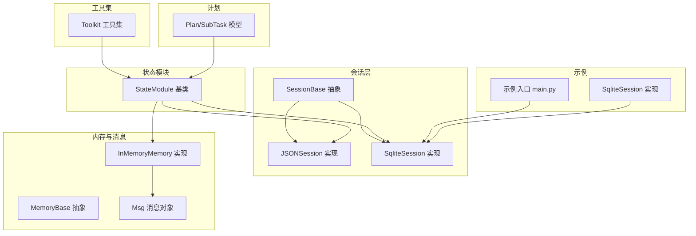
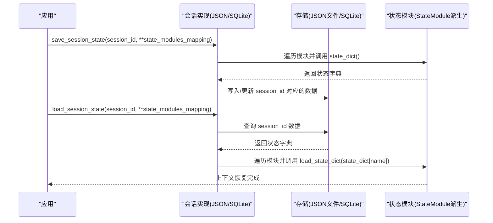
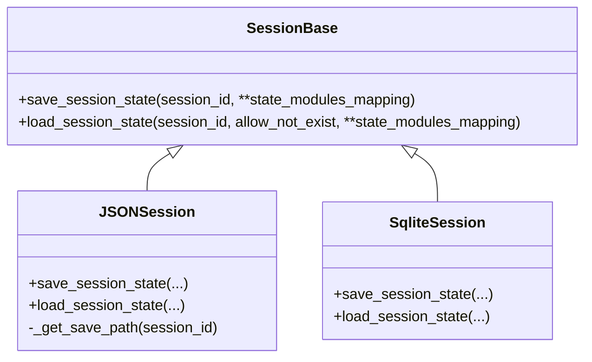
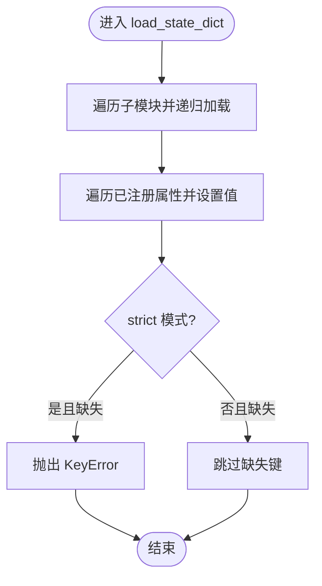
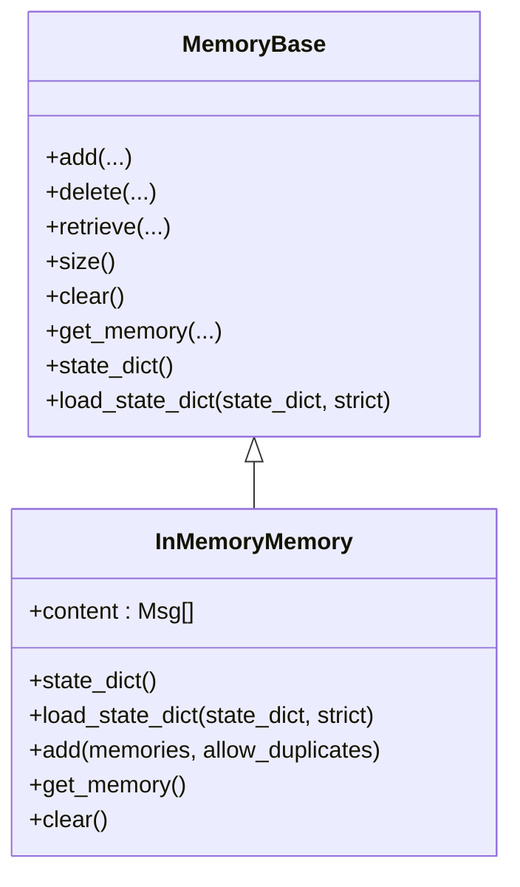
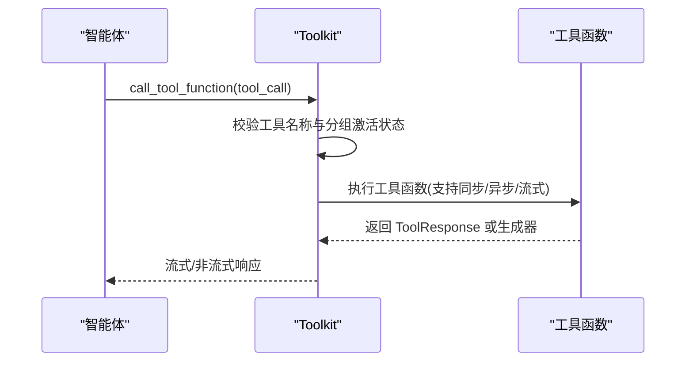
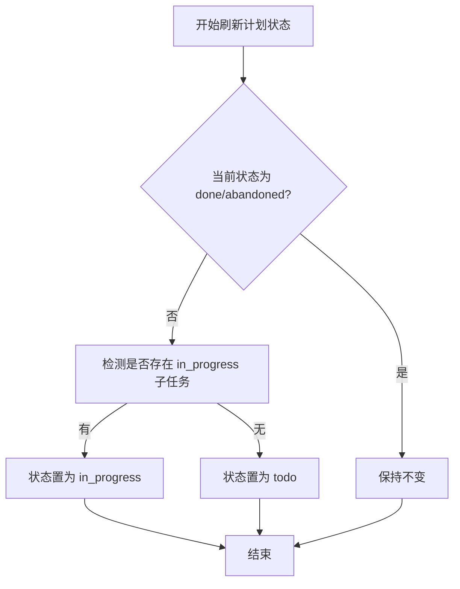
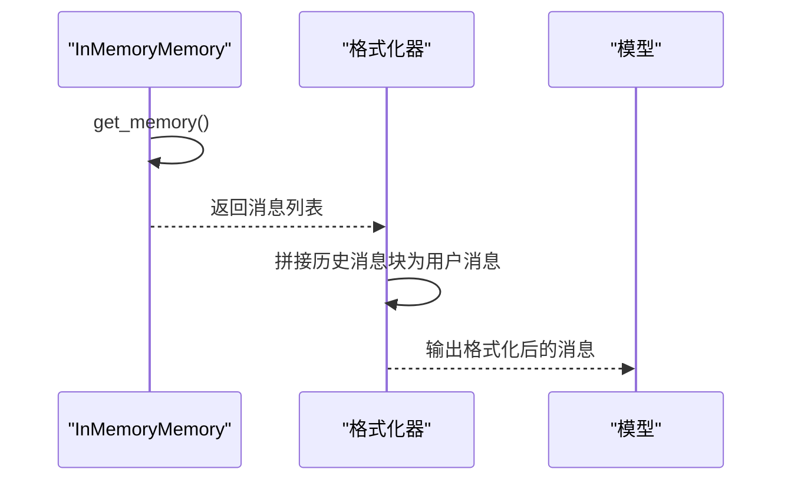
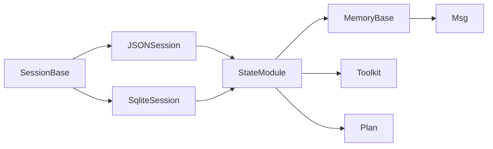

# 上下文恢复

<cite>
**本文引用的文件**
- [src/agentscope/session/_session_base.py](file://src/agentscope/session/_session_base.py)
- [src/agentscope/session/_json_session.py](file://src/agentscope/session/_json_session.py)
- [examples/functionality/session_with_sqlite/sqlite_session.py](file://examples/functionality/session_with_sqlite/sqlite_session.py)
- [examples/functionality/session_with_sqlite/main.py](file://examples/functionality/session_with_sqlite/main.py)
- [src/agentscope/module/_state_module.py](file://src/agentscope/module/_state_module.py)
- [src/agentscope/memory/_memory_base.py](file://src/agentscope/memory/_memory_base.py)
- [src/agentscope/memory/_in_memory_memory.py](file://src/agentscope/memory/_in_memory_memory.py)
- [src/agentscope/tool/_toolkit.py](file://src/agentscope/tool/_toolkit.py)
- [src/agentscope/plan/_plan_model.py](file://src/agentscope/plan/_plan_model.py)
- [src/agentscope/message/_message_base.py](file://src/agentscope/message/_message_base.py)
- [src/agentscope/message/_message_block.py](file://src/agentscope/message/_message_block.py)
- [src/agentscope/formatter/_formatter_base.py](file://src/agentscope/formatter/_formatter_base.py)
- [src/agentscope/formatter/_deepseek_formatter.py](file://src/agentscope/formatter/_deepseek_formatter.py)
- [src/agentscope/agent/_react_agent.py](file://src/agentscope/agent/_react_agent.py)
- [src/agentscope/agent/_agent_base.py](file://src/agentscope/agent/_agent_base.py)
- [src/agentscope/pipeline/_msghub.py](file://src/agentscope/pipeline/_msghub.py)
- [src/agentscope/plan/_plan_notebook.py](file://src/agentscope/plan/_plan_notebook.py)
</cite>

## 目录
1. [引言](#引言)
2. [项目结构](#项目结构)
3. [核心组件](#核心组件)
4. [架构总览](#架构总览)
5. [详细组件分析](#详细组件分析)
6. [依赖关系分析](#依赖关系分析)
7. [性能考量](#性能考量)
8. [故障排查指南](#故障排查指南)
9. [结论](#结论)
10. [附录](#附录)

## 引言
本文件系统性阐述对话中断后的上下文恢复机制，聚焦于如何通过“状态模块”与“会话存储”在会话重启后重建执行上下文。内容覆盖：
- 智能体状态的持久化与加载流程
- 消息历史重建、计划进度恢复与工具调用状态同步
- 从文件与数据库加载上下文的实现路径
- 版本兼容性与状态迁移策略
- 常见失败原因与应对措施

## 项目结构
围绕上下文恢复的关键目录与文件如下：
- 会话抽象与实现：session 层提供 SessionBase 抽象与 JSON/SQLite 两种具体实现
- 状态模块：StateModule 提供嵌套序列化/反序列化能力
- 内存与消息：MemoryBase/InMemoryMemory 负责消息历史的持久化与恢复
- 工具集：Toolkit 维护工具函数注册、分组与激活状态
- 计划模型：Plan/SubTask 描述任务进度与状态
- 消息与格式化：Msg 及各格式化器用于历史拼接与展示
- 示例：SQLite 会话示例演示了完整的保存/加载流程

图表来源
- [src/agentscope/session/_session_base.py](file://src/agentscope/session/_session_base.py#L1-L34)
- [src/agentscope/session/_json_session.py](file://src/agentscope/session/_json_session.py#L1-L118)
- [examples/functionality/session_with_sqlite/sqlite_session.py](file://examples/functionality/session_with_sqlite/sqlite_session.py#L1-L168)
- [src/agentscope/module/_state_module.py](file://src/agentscope/module/_state_module.py#L1-L152)
- [src/agentscope/memory/_memory_base.py](file://src/agentscope/memory/_memory_base.py#L1-L45)
- [src/agentscope/memory/_in_memory_memory.py](file://src/agentscope/memory/_in_memory_memory.py#L1-L123)
- [src/agentscope/tool/_toolkit.py](file://src/agentscope/tool/_toolkit.py#L1-L800)
- [src/agentscope/plan/_plan_model.py](file://src/agentscope/plan/_plan_model.py#L1-L201)
- [examples/functionality/session_with_sqlite/main.py](file://examples/functionality/session_with_sqlite/main.py#L1-L77)

章节来源
- [src/agentscope/session/_session_base.py](file://src/agentscope/session/_session_base.py#L1-L34)
- [src/agentscope/session/_json_session.py](file://src/agentscope/session/_json_session.py#L1-L118)
- [examples/functionality/session_with_sqlite/sqlite_session.py](file://examples/functionality/session_with_sqlite/sqlite_session.py#L1-L168)
- [src/agentscope/module/_state_module.py](file://src/agentscope/module/_state_module.py#L1-L152)
- [src/agentscope/memory/_memory_base.py](file://src/agentscope/memory/_memory_base.py#L1-L45)
- [src/agentscope/memory/_in_memory_memory.py](file://src/agentscope/memory/_in_memory_memory.py#L1-L123)
- [src/agentscope/tool/_toolkit.py](file://src/agentscope/tool/_toolkit.py#L1-L800)
- [src/agentscope/plan/_plan_model.py](file://src/agentscope/plan/_plan_model.py#L1-L201)
- [examples/functionality/session_with_sqlite/main.py](file://examples/functionality/session_with_sqlite/main.py#L1-L77)

## 核心组件
- 会话接口与实现
  - SessionBase 定义 save_session_state/load_session_state 的异步接口，约定以 session_id 为键、state_modules_mapping 为值进行状态持久化与恢复
  - JSONSession 将状态字典写入/读取 JSON 文件，支持允许不存在时跳过
  - SqliteSession 将状态字典序列化为 JSON 存入 SQLite 表，支持表不存在/记录不存在时按 allow_not_exist 控制行为
- 状态模块
  - StateModule 提供 state_dict/load_state_dict 的递归序列化/反序列化，并支持自定义属性的 JSON 序列化钩子
- 内存与消息
  - MemoryBase 定义 add/delete/retrieve/size/clear/get_memory/state_dict/load_state_dict 接口
  - InMemoryMemory 实现基于列表的消息存储，state_dict/load_state_dict 支持消息对象的序列化与还原
- 工具集
  - Toolkit 继承 StateModule，维护工具函数、分组与激活状态；其 state_dict/load_state_dict 保证工具注册与分组状态可恢复
- 计划模型
  - Plan/SubTask 维护子任务状态与完成时间等字段，支持刷新计划状态与完成标记

章节来源
- [src/agentscope/session/_session_base.py](file://src/agentscope/session/_session_base.py#L1-L34)
- [src/agentscope/session/_json_session.py](file://src/agentscope/session/_json_session.py#L1-L118)
- [examples/functionality/session_with_sqlite/sqlite_session.py](file://examples/functionality/session_with_sqlite/sqlite_session.py#L1-L168)
- [src/agentscope/module/_state_module.py](file://src/agentscope/module/_state_module.py#L1-L152)
- [src/agentscope/memory/_memory_base.py](file://src/agentscope/memory/_memory_base.py#L1-L45)
- [src/agentscope/memory/_in_memory_memory.py](file://src/agentscope/memory/_in_memory_memory.py#L1-L123)
- [src/agentscope/tool/_toolkit.py](file://src/agentscope/tool/_toolkit.py#L1-L800)
- [src/agentscope/plan/_plan_model.py](file://src/agentscope/plan/_plan_model.py#L1-L201)

## 架构总览
上下文恢复的整体流程如下：
- 保存阶段：遍历 state_modules_mapping，逐个调用 state_dict()，将模块名到状态字典的映射写入 JSON 或 SQLite
- 加载阶段：根据 session_id 查询对应数据，逐个模块调用 load_state_dict()，恢复内部状态
- 关键点：StateModule 的递归序列化确保嵌套模块与属性均可恢复；MemoryBase 的 get_memory/state_dict/load_state_dict 保障消息历史可重建；Toolkit 的工具注册与分组状态可恢复；Plan/SubTask 的状态字段可恢复

图表来源
- [src/agentscope/session/_session_base.py](file://src/agentscope/session/_session_base.py#L1-L34)
- [src/agentscope/session/_json_session.py](file://src/agentscope/session/_json_session.py#L53-L118)
- [examples/functionality/session_with_sqlite/sqlite_session.py](file://examples/functionality/session_with_sqlite/sqlite_session.py#L27-L168)
- [src/agentscope/module/_state_module.py](file://src/agentscope/module/_state_module.py#L49-L152)

## 详细组件分析

### 会话层：SessionBase、JSONSession、SqliteSession
- SessionBase
  - 定义 save_session_state/load_session_state 两个抽象方法，参数包含 session_id 与 state_modules_mapping
- JSONSession
  - 保存：将 state_modules_mapping 中每个模块的 state_dict() 合并为字典，写入 session_id.json
  - 加载：若文件存在则读取 JSON 并逐模块调用 load_state_dict；否则按 allow_not_exist 决定抛错或跳过
- SqliteSession
  - 保存：创建 as_session 表，使用 session_id 作为主键，插入或冲突更新 session_data(JSON)，同时更新时间戳
  - 加载：检查数据库/表是否存在；查询 session_id 对应记录；逐模块调用 load_state_dict；缺失模块时抛错

图表来源
- [src/agentscope/session/_session_base.py](file://src/agentscope/session/_session_base.py#L1-L34)
- [src/agentscope/session/_json_session.py](file://src/agentscope/session/_json_session.py#L1-L118)
- [examples/functionality/session_with_sqlite/sqlite_session.py](file://examples/functionality/session_with_sqlite/sqlite_session.py#L1-L168)

章节来源
- [src/agentscope/session/_session_base.py](file://src/agentscope/session/_session_base.py#L1-L34)
- [src/agentscope/session/_json_session.py](file://src/agentscope/session/_json_session.py#L1-L118)
- [examples/functionality/session_with_sqlite/sqlite_session.py](file://examples/functionality/session_with_sqlite/sqlite_session.py#L1-L168)

### 状态模块：StateModule
- 作用：为任意继承该基类的对象提供统一的 state_dict/load_state_dict 能力，支持嵌套模块与自定义属性序列化钩子
- 关键点：
  - __setattr__/__delattr__ 自动追踪 StateModule 子模块
  - state_dict 递归收集子模块状态与已注册属性
  - load_state_dict 递归加载子模块状态与属性，strict 模式下缺失键会报错

图表来源
- [src/agentscope/module/_state_module.py](file://src/agentscope/module/_state_module.py#L49-L152)

章节来源
- [src/agentscope/module/_state_module.py](file://src/agentscope/module/_state_module.py#L1-L152)

### 内存与消息：MemoryBase、InMemoryMemory
- MemoryBase
  - 定义 add/delete/retrieve/size/clear/get_memory/state_dict/load_state_dict 等抽象方法
- InMemoryMemory
  - 使用列表存储消息，state_dict 将消息转为字典列表，load_state_dict 从字典重建 Msg 对象
  - add 支持去重与类型校验；delete 支持索引过滤；retrieve 未在该实现中实现
- 消息对象
  - Msg 提供 to_dict/from_dict，便于序列化与反序列化

图表来源
- [src/agentscope/memory/_memory_base.py](file://src/agentscope/memory/_memory_base.py#L1-L45)
- [src/agentscope/memory/_in_memory_memory.py](file://src/agentscope/memory/_in_memory_memory.py#L1-L123)
- [src/agentscope/message/_message_base.py](file://src/agentscope/message/_message_base.py#L1-L200)
- [src/agentscope/message/_message_block.py](file://src/agentscope/message/_message_block.py#L1-L200)

章节来源
- [src/agentscope/memory/_memory_base.py](file://src/agentscope/memory/_memory_base.py#L1-L45)
- [src/agentscope/memory/_in_memory_memory.py](file://src/agentscope/memory/_in_memory_memory.py#L1-L123)
- [src/agentscope/message/_message_base.py](file://src/agentscope/message/_message_base.py#L1-L200)
- [src/agentscope/message/_message_block.py](file://src/agentscope/message/_message_block.py#L1-L200)

### 工具集：Toolkit
- Toolkit 继承 StateModule，维护 tools、groups、skills 等状态
- 注册工具函数时支持多种策略（覆盖/跳过/重命名/抛错），并生成 JSON Schema
- 工具调用支持同步/异步/流式返回，并内置中断处理
- 通过 state_dict/load_state_dict 可恢复工具注册与分组激活状态

图表来源
- [src/agentscope/tool/_toolkit.py](file://src/agentscope/tool/_toolkit.py#L593-L726)

章节来源
- [src/agentscope/tool/_toolkit.py](file://src/agentscope/tool/_toolkit.py#L1-L800)

### 计划：Plan/SubTask
- Plan/SubTask 维护子任务状态（todo/in_progress/done/abandoned）、创建/完成时间、预期/实际结果
- 刷新计划状态 refresh_plan_state 基于子任务状态切换计划状态
- 完成 finish 标记计划完成并记录完成时间与结果

图表来源
- [src/agentscope/plan/_plan_model.py](file://src/agentscope/plan/_plan_model.py#L148-L167)

章节来源
- [src/agentscope/plan/_plan_model.py](file://src/agentscope/plan/_plan_model.py#L1-L201)

### 消息历史重建与格式化
- 消息历史重建
  - 通过 MemoryBase.get_memory()/state_dict/load_state_dict 获取历史消息集合
  - InMemoryMemory 将消息序列化为字典列表，再从字典重建 Msg 对象
- 格式化器
  - 多种格式化器支持将消息块拼接为用户消息，便于在重启后继续对话
  - DeepSeek 格式化器示例展示了如何将历史消息块包裹为带标签的历史段落

图表来源
- [src/agentscope/memory/_in_memory_memory.py](file://src/agentscope/memory/_in_memory_memory.py#L116-L123)
- [src/agentscope/formatter/_deepseek_formatter.py](file://src/agentscope/formatter/_deepseek_formatter.py#L220-L265)

章节来源
- [src/agentscope/memory/_in_memory_memory.py](file://src/agentscope/memory/_in_memory_memory.py#L1-L123)
- [src/agentscope/formatter/_deepseek_formatter.py](file://src/agentscope/formatter/_deepseek_formatter.py#L220-L265)

### 从持久化存储加载上下文的代码示例
- SQLite 示例入口
  - 在 main.py 中，先通过 SqliteSession.load_session_state 按 session_id 加载智能体状态，再进行对话，最后保存
  - 参考路径：[examples/functionality/session_with_sqlite/main.py](file://examples/functionality/session_with_sqlite/main.py#L1-L77)
- SQLite 会话实现
  - 保存：创建 as_session 表，INSERT OR REPLACE 更新 session_data 与时间戳
  - 加载：检查数据库/表存在性，查询 session_id，逐模块 load_state_dict
  - 参考路径：[examples/functionality/session_with_sqlite/sqlite_session.py](file://examples/functionality/session_with_sqlite/sqlite_session.py#L27-L168)

章节来源
- [examples/functionality/session_with_sqlite/main.py](file://examples/functionality/session_with_sqlite/main.py#L1-L77)
- [examples/functionality/session_with_sqlite/sqlite_session.py](file://examples/functionality/session_with_sqlite/sqlite_session.py#L1-L168)

## 依赖关系分析
- 低耦合高内聚
  - SessionBase 仅定义接口，具体实现（JSON/SQLite）与存储介质解耦
  - StateModule 与具体模块（Memory/Toolkit/Plan）通过 state_dict/load_state_dict 解耦
- 关键依赖链
  - 会话实现依赖 StateModule 的序列化能力
  - 内存模块依赖 Msg 的序列化能力
  - 工具集依赖注册信息与分组状态
  - 计划模块依赖子任务状态字段

图表来源
- [src/agentscope/session/_session_base.py](file://src/agentscope/session/_session_base.py#L1-L34)
- [src/agentscope/session/_json_session.py](file://src/agentscope/session/_json_session.py#L1-L118)
- [examples/functionality/session_with_sqlite/sqlite_session.py](file://examples/functionality/session_with_sqlite/sqlite_session.py#L1-L168)
- [src/agentscope/module/_state_module.py](file://src/agentscope/module/_state_module.py#L1-L152)
- [src/agentscope/memory/_memory_base.py](file://src/agentscope/memory/_memory_base.py#L1-L45)
- [src/agentscope/tool/_toolkit.py](file://src/agentscope/tool/_toolkit.py#L1-L800)
- [src/agentscope/plan/_plan_model.py](file://src/agentscope/plan/_plan_model.py#L1-L201)
- [src/agentscope/message/_message_base.py](file://src/agentscope/message/_message_base.py#L1-L200)

章节来源
- [src/agentscope/session/_session_base.py](file://src/agentscope/session/_session_base.py#L1-L34)
- [src/agentscope/session/_json_session.py](file://src/agentscope/session/_json_session.py#L1-L118)
- [examples/functionality/session_with_sqlite/sqlite_session.py](file://examples/functionality/session_with_sqlite/sqlite_session.py#L1-L168)
- [src/agentscope/module/_state_module.py](file://src/agentscope/module/_state_module.py#L1-L152)
- [src/agentscope/memory/_memory_base.py](file://src/agentscope/memory/_memory_base.py#L1-L45)
- [src/agentscope/tool/_toolkit.py](file://src/agentscope/tool/_toolkit.py#L1-L800)
- [src/agentscope/plan/_plan_model.py](file://src/agentscope/plan/_plan_model.py#L1-L201)
- [src/agentscope/message/_message_base.py](file://src/agentscope/message/_message_base.py#L1-L200)

## 性能考量
- 序列化开销
  - JSON/SQLite 序列化/反序列化成本与模块数量、消息长度成正比
  - 建议仅持久化必要模块，避免冗余状态
- I/O 模式
  - JSON 文件适合小规模状态；SQLite 更适合多会话、并发场景
- 内存占用
  - InMemoryMemory 将所有消息驻留内存，建议结合清理策略或采用长程记忆方案
- 并发与一致性
  - SQLite 使用单表主键冲突更新，保证同一 session_id 的原子性；跨进程需注意锁与事务隔离

## 故障排查指南
- 常见失败原因
  - 会话文件/数据库不存在
    - JSONSession：allow_not_exist=True 时跳过，False 时抛错
    - SqliteSession：数据库/表不存在时按 allow_not_exist 控制行为
  - 缺失模块键
    - load_state_dict(strict=True) 时，若模块键不存在则抛 KeyError
  - 工具函数缺失或分组未激活
    - Toolkit.call_tool_function 会在找不到函数或分组未激活时返回错误响应
  - 消息历史不完整
    - InMemoryMemory.add 会去重，重复消息不会被再次添加
- 应对措施
  - 明确 allow_not_exist 与 strict 参数，合理配置容错策略
  - 在保存前确认 state_modules_mapping 的键与模块一致
  - 对工具注册与分组激活进行幂等管理，避免运行时状态漂移
  - 对消息历史进行定期清理与备份，防止内存膨胀

章节来源
- [src/agentscope/session/_json_session.py](file://src/agentscope/session/_json_session.py#L77-L118)
- [examples/functionality/session_with_sqlite/sqlite_session.py](file://examples/functionality/session_with_sqlite/sqlite_session.py#L69-L168)
- [src/agentscope/module/_state_module.py](file://src/agentscope/module/_state_module.py#L74-L152)
- [src/agentscope/tool/_toolkit.py](file://src/agentscope/tool/_toolkit.py#L593-L726)
- [src/agentscope/memory/_in_memory_memory.py](file://src/agentscope/memory/_in_memory_memory.py#L78-L123)

## 结论
上下文恢复通过“状态模块 + 会话存储”的组合实现：
- StateModule 提供统一的序列化/反序列化能力，确保嵌套模块与属性可恢复
- 会话实现负责将状态持久化到 JSON 或 SQLite，并在重启时按 session_id 恢复
- 消息历史、工具注册与分组、计划状态均可通过上述机制恢复
- 通过合理的 allow_not_exist 与 strict 配置、模块选择与清理策略，可在可用性与性能之间取得平衡

## 附录
- 版本兼容性与迁移建议
  - 使用 StateModule.register_state 为自定义属性提供 JSON 序列化钩子，避免未来字段变更导致的反序列化失败
  - 对于新增字段，建议在 load_state_dict 中以默认值处理，strict 可临时关闭以容忍缺失键
  - 对于工具函数命名冲突，使用 Toolkit.register_tool_function 的重命名策略，避免破坏既有会话
  - 对于计划状态，新增状态枚举或字段时，应在刷新逻辑中兼容旧状态
- 代码示例参考路径
  - 会话保存/加载：[examples/functionality/session_with_sqlite/main.py](file://examples/functionality/session_with_sqlite/main.py#L1-L77)
  - SQLite 实现：[examples/functionality/session_with_sqlite/sqlite_session.py](file://examples/functionality/session_with_sqlite/sqlite_session.py#L1-L168)
  - JSON 实现：[src/agentscope/session/_json_session.py](file://src/agentscope/session/_json_session.py#L1-L118)
  - 状态模块：[src/agentscope/module/_state_module.py](file://src/agentscope/module/_state_module.py#L1-L152)
  - 内存与消息：[src/agentscope/memory/_in_memory_memory.py](file://src/agentscope/memory/_in_memory_memory.py#L1-L123)
  - 工具集：[src/agentscope/tool/_toolkit.py](file://src/agentscope/tool/_toolkit.py#L1-L800)
  - 计划模型：[src/agentscope/plan/_plan_model.py](file://src/agentscope/plan/_plan_model.py#L1-L201)