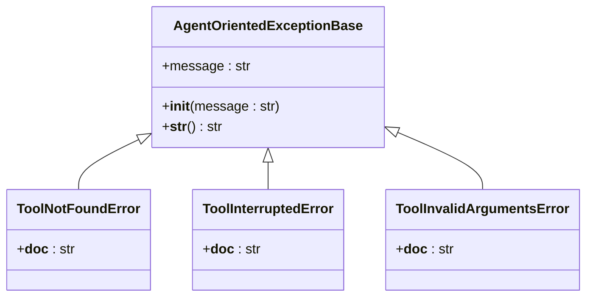

# 异常类型

<cite>
**本文档中引用的文件**  
- [src\agentscope\exception\_exception_base.py](file://src\agentscope\exception\_exception_base.py)
- [src\agentscope\exception\_tool.py](file://src\agentscope\exception\_tool.py)
- [src\agentscope\exception\__init__.py](file://src\agentscope\exception\__init__.py)
- [src\agentscope\tool\_coding\_python.py](file://src\agentscope\tool\_coding\_python.py)
- [src\agentscope\tool\_coding\_shell.py](file://src\agentscope\tool\_coding\_shell.py)
- [src\agentscope\memory\_reme\_reme_personal_long_term_memory.py](file://src\agentscope\memory\_reme\_reme_personal_long_term_memory.py)
- [src\agentscope\model\_dashscope_model.py](file://src\agentscope\model\_dashscope_model.py)
- [src\agentscope\mcp\_stateful_client_base.py](file://src\agentscope\mcp\_stateful_client_base.py)
</cite>

## 目录
1. [异常体系概述](#异常体系概述)
2. [基础异常类结构](#基础异常类结构)
3. [具体异常类型分类](#具体异常类型分类)
4. [异常触发条件与错误码设计](#异常触发条件与错误码设计)
5. [异常捕获与处理示例](#异常捕获与处理示例)
6. [自定义异常扩展方法](#自定义异常扩展方法)

## 异常体系概述

AgentScope框架设计了一套面向智能体的异常处理体系，旨在确保在运行时能够捕获并暴露异常给智能体，使其能够适当地处理错误。该体系以`AgentOrientedExceptionBase`为基类，构建了层次化的异常分类结构，涵盖了工具执行、网络通信、模型响应解析和记忆存储等多个关键领域。

**本节来源**  
- [src\agentscope\exception\_exception_base.py](file://src\agentscope\exception\_exception_base.py#L5-L18)

## 基础异常类结构

AgentScope的异常体系核心是`AgentOrientedExceptionBase`类，它继承自Python的内置`Exception`类。所有面向智能体的异常都应从此基类派生，以确保一致的异常处理行为。



**图示来源**  
- [src\agentscope\exception\_exception_base.py](file://src\agentscope\exception\_exception_base.py#L5-L18)
- [src\agentscope\exception\_tool.py](file://src\agentscope\exception\_tool.py#L7-L17)

**本节来源**  
- [src\agentscope\exception\_exception_base.py](file://src\agentscope\exception\_exception_base.py#L5-L18)
- [src\agentscope\exception\_tool.py](file://src\agentscope\exception\_tool.py#L7-L17)

## 具体异常类型分类

AgentScope框架定义了多种具体的异常类型，主要分为以下几类：

### 工具执行相关异常

工具执行失败是智能体运行中最常见的异常类型之一。AgentScope提供了专门的异常类来处理此类问题：

- **ToolNotFoundError**：当请求调用的工具未注册或不存在时抛出。
- **ToolInterruptedError**：当工具调用被用户或其他外部因素中断时抛出。
- **ToolInvalidArgumentsError**：当传递给工具的参数不符合其签名定义时抛出。

这些异常均定义在`_tool.py`文件中，并通过`__init__.py`导出供外部使用。

### 网络通信异常

在网络通信层面，框架使用标准的Python异常（如`RuntimeError`）来处理连接问题。例如，在MCP（Model Context Protocol）客户端中，如果连接未建立就尝试使用客户端，会抛出`RuntimeError`提示连接未建立。

### 模型响应解析异常

在处理大模型响应时，可能会遇到解析错误。虽然框架本身未定义专门的异常类，但在实际代码中会捕获`ValidationError`（来自Pydantic库）来处理结构化输出验证失败的情况。

### 记忆存储错误

在记忆存储操作中，如果未正确初始化上下文就尝试记录记忆，会抛出`RuntimeError`。例如，`ReMePersonalLongTermMemory`类在`record_to_memory`方法中检查应用上下文是否已启动，否则抛出运行时错误。

**本节来源**  
- [src\agentscope\exception\_tool.py](file://src\agentscope\exception\_tool.py#L7-L17)
- [src\agentscope\mcp\_stateful_client_base.py](file://src\agentscope\mcp\_stateful_client_base.py#L160-L172)
- [src\agentscope\memory\_reme\_reme_personal_long_term_memory.py](file://src\agentscope\memory\_reme\_reme_personal_long_term_memory.py#L73-L77)
- [src\agentscope\model\_dashscope_model.py](file://src\agentscope\model\_dashscope_model.py#L283-L286)

## 异常触发条件与错误码设计

### 触发条件

每种异常都有明确的触发条件：
- `ToolNotFoundError`在工具注册表中查找失败时触发。
- `ToolInterruptedError`在用户主动中断工具执行流程时触发。
- `ToolInvalidArgumentsError`在参数验证失败时触发。
- 网络通信异常在HTTP状态码非OK或连接超时时触发。
- 记忆存储错误在存储后端未正确初始化或健康检查失败时触发。

### 错误码设计原则

AgentScope的异常设计遵循以下原则：
1. **语义明确**：异常名称应清晰表达错误类型。
2. **可捕获性**：所有异常都应能被智能体捕获并处理。
3. **信息丰富**：异常消息应包含足够的上下文信息以便调试。
4. **层次化**：通过继承结构组织异常，便于统一处理。

**本节来源**  
- [src\agentscope\exception\_exception_base.py](file://src\agentscope\exception\_exception_base.py#L6-L9)
- [src\agentscope\exception\_tool.py](file://src\agentscope\exception\_tool.py#L8-L16)

## 异常捕获与处理示例

以下代码展示了如何在AgentScope中进行异常捕获和差异化处理：

```python
try:
    result = await tool.execute()
except ToolNotFoundError as e:
    # 处理工具未找到的情况
    logger.warning(f"工具未找到: {e}")
    return create_error_response("无法找到指定工具，请检查工具名称")
except ToolInvalidArgumentsError as e:
    # 处理参数无效的情况
    logger.error(f"工具参数错误: {e}")
    return create_error_response("工具参数错误，请检查输入")
except ToolInterruptedError as e:
    # 处理执行中断的情况
    logger.info(f"工具执行被中断: {e}")
    return create_interrupt_response()
except Exception as e:
    # 处理其他未预期的异常
    logger.exception(f"工具执行出错: {e}")
    return create_error_response("工具执行失败")
```

在实际应用中，可以通过`isinstance()`函数进行类型判断，实现精细化的异常处理策略。

**本节来源**  
- [src\agentscope\tool\_coding\_python.py](file://src\agentscope\tool\_coding\_python.py#L55-L80)
- [src\agentscope\tool\_coding\_shell.py](file://src\agentscope\tool\_coding\_shell.py#L47-L65)
- [src\agentscope\memory\_reme\_reme_personal_long_term_memory.py](file://src\agentscope\memory\_reme\_reme_personal_long_term_memory.py#L144-L153)

## 自定义异常扩展方法

要扩展AgentScope的异常体系，应遵循以下步骤确保与现有体系兼容：

1. **继承基类**：所有自定义异常必须继承`AgentOrientedExceptionBase`。
2. **保持命名规范**：异常类名应以"Error"结尾，采用PascalCase命名法。
3. **提供清晰文档**：为异常类添加详细的文档字符串说明触发条件。
4. **导出异常**：在模块的`__init__.py`中将新异常添加到`__all__`列表中。

示例：
```python
from ._exception_base import AgentOrientedExceptionBase

class CustomToolExecutionError(AgentOrientedExceptionBase):
    """自定义工具执行错误。"""
    pass
```

通过这种方式，可以无缝集成新的异常类型到现有的异常处理框架中。

**本节来源**  
- [src\agentscope\exception\_exception_base.py](file://src\agentscope\exception\_exception_base.py#L5-L18)
- [src\agentscope\exception\__init__.py](file://src\agentscope\exception\__init__.py#L4-L9)