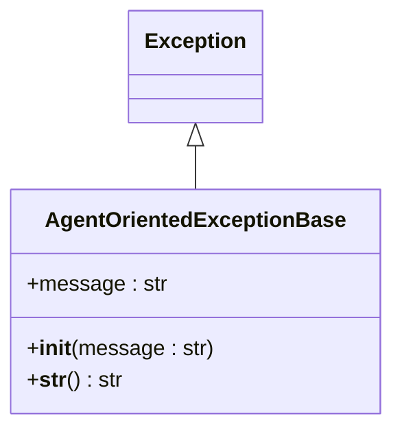
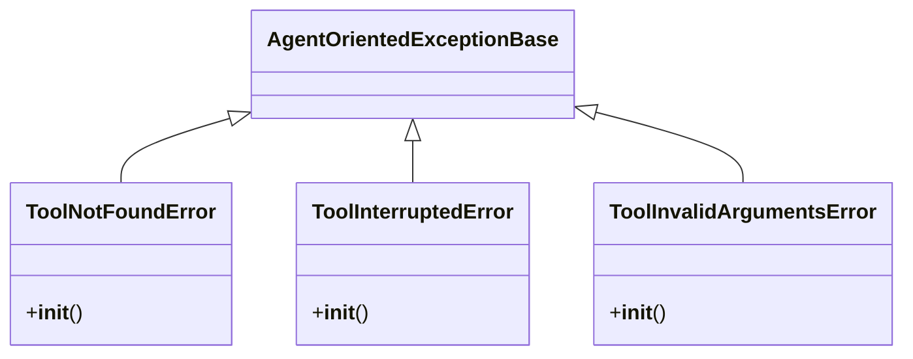
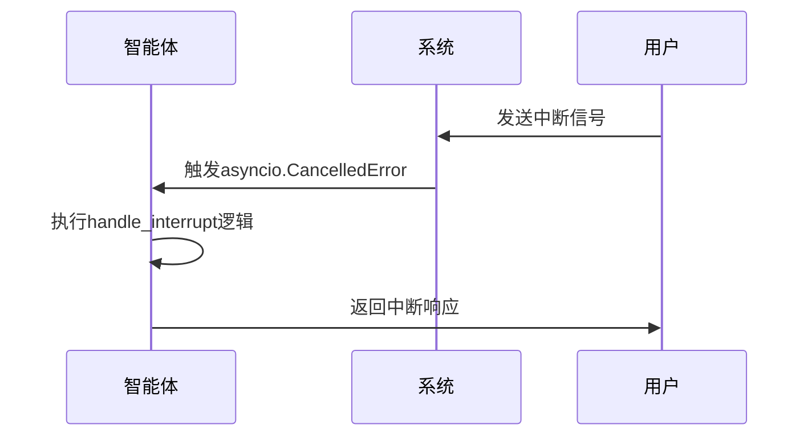
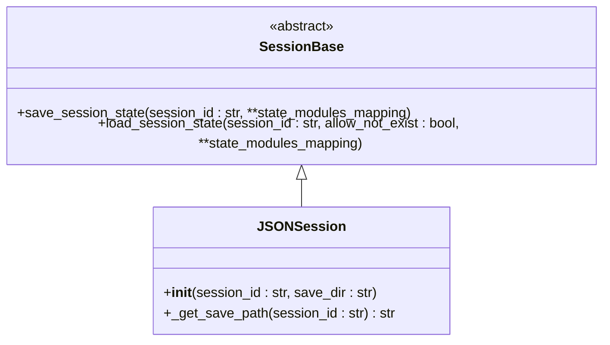
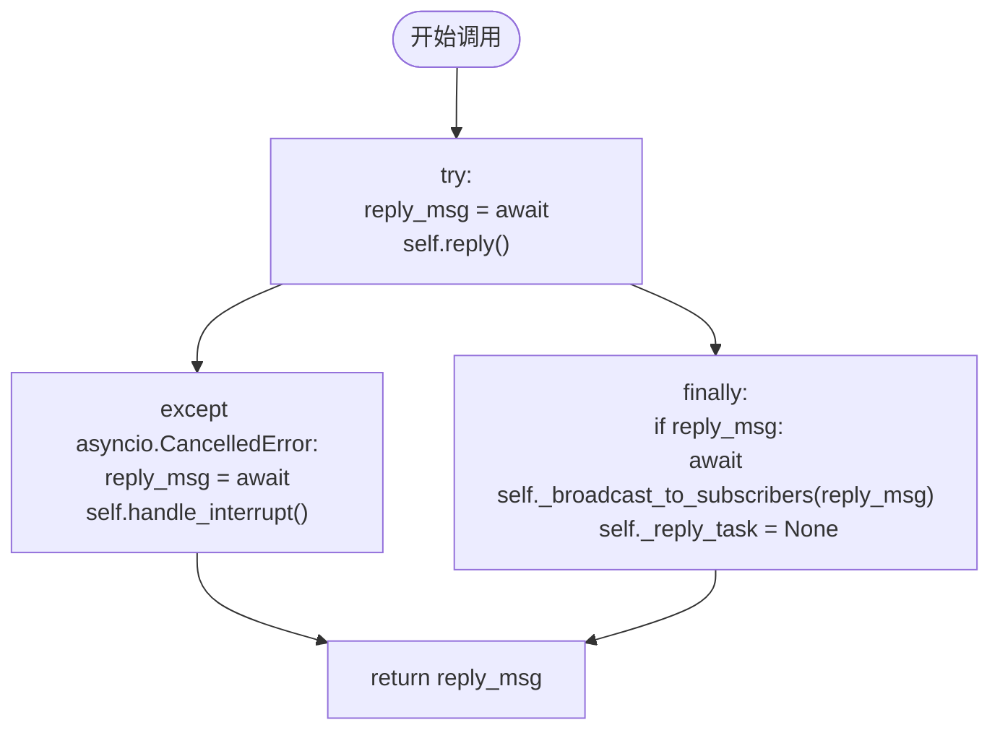
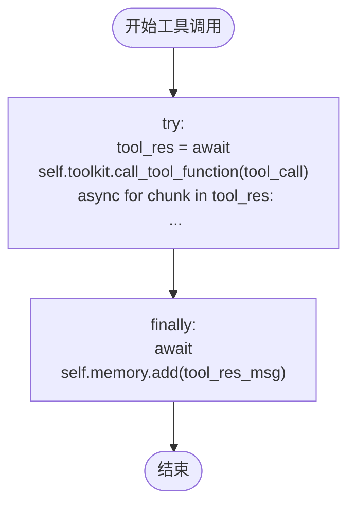

# 错误处理

<cite>
**本文档中引用的文件**  
- [__init__.py](file://src/agentscope/exception/__init__.py)
- [_exception_base.py](file://src/agentscope/exception/_exception_base.py)
- [_tool.py](file://src/agentscope/exception/_tool.py)
- [_agent_base.py](file://src/agentscope/agent/_agent_base.py)
- [_react_agent.py](file://src/agentscope/agent/_react_agent.py)
- [_toolkit.py](file://src/agentscope/tool/_toolkit.py)
- [_response.py](file://src/agentscope/tool/_response.py)
- [_session_base.py](file://src/agentscope/session/_session_base.py)
- [_json_session.py](file://src/agentscope/session/_json_session.py)
- [task_agent.py](file://docs/tutorial/zh_CN/src/task_agent.py)
- [short_term_memory_example.py](file://examples/functionality/short_term_memory/reme/short_term_memory_example.py)
</cite>

## 目录
1. [引言](#引言)
2. [异常分类体系](#异常分类体系)
3. [重试机制与指数退避策略](#重试机制与指数退避策略)
4. [上下文恢复方案](#上下文恢复方案)
5. [AgentScope中的try-catch模式应用](#agentscope中的try-catch模式应用)
6. [常见错误代码及解决方案](#常见错误代码及解决方案)
7. [总结](#总结)

## 引言
AgentScope框架提供了一套完整的错误处理与异常恢复机制，旨在确保智能体系统在面对网络错误、模型响应异常、工具调用失败等场景时能够稳定运行并具备自我恢复能力。本文档详细阐述了AgentScope的统一异常分类体系、重试机制设计原则、上下文恢复方案以及具体的代码实现方式。

## 异常分类体系
AgentScope定义了一个统一的异常分类体系，所有异常均继承自`AgentOrientedExceptionBase`基类，确保异常能够被智能体在运行时捕获并适当处理。

### 基础异常类
`AgentOrientedExceptionBase`是所有面向智能体异常的基类，它继承自Python的`Exception`类，并提供了统一的初始化和字符串表示方法。



**图源**  
- [_exception_base.py](file://src/agentscope/exception/_exception_base.py#L5-L18)

### 工具调用相关异常
工具调用过程中可能发生的特定异常，均继承自`AgentOrientedExceptionBase`。



**图源**  
- [_tool.py](file://src/agentscope/exception/_tool.py#L7-L16)

**节源**  
- [_tool.py](file://src/agentscope/exception/_tool.py#L7-L16)

## 重试机制与指数退避策略
AgentScope通过异步异常处理机制实现了重试能力，特别是利用`asyncio.CancelledError`来处理用户中断和超时情况。

### 中断处理机制
当智能体的回复过程被中断时，系统会捕获`asyncio.CancelledError`异常，并调用`handle_interrupt`方法进行后处理。



**图源**  
- [_agent_base.py](file://src/agentscope/agent/_agent_base.py#L449-L455)

### 指数退避策略实现
虽然代码中未直接展示指数退避算法，但通过异步任务的取消和重试机制，为实现指数退避提供了基础。开发者可以在`handle_interrupt`或工具调用失败处理中实现自定义的重试逻辑。

## 上下文恢复方案
AgentScope提供了会话状态管理机制，确保在智能体对话中断后能够正确续接。

### 会话状态持久化
通过`SessionBase`基类和`JSONSession`实现，支持将智能体的状态保存到JSON文件中，并在需要时重新加载。



**图源**  
- [_session_base.py](file://src/agentscope/session/_session_base.py#L8-L33)
- [_json_session.py](file://src/agentscope/session/_json_session.py#L11-L117)

**节源**  
- [_session_base.py](file://src/agentscope/session/_session_base.py#L8-L33)
- [_json_session.py](file://src/agentscope/session/_json_session.py#L11-L117)

### 短期记忆管理
`ReMeShortTermMemory`实现了异步上下文管理器协议，确保资源的正确初始化和清理。

```python
async with short_term_memory:
    await short_term_memory.add(messages)
    response = await agent(msg)
```

**节源**  
- [short_term_memory_example.py](file://examples/functionality/short_term_memory/reme/short_term_memory_example.py#L112-L113)

## AgentScope中的try-catch模式应用
AgentScope在核心组件中广泛使用了try-catch模式来处理异常。

### 智能体回复流程中的异常处理
在`AgentBase`类的`__call__`方法中，使用try-except-finally结构来处理回复过程中的异常。



**图源**  
- [_agent_base.py](file://src/agentscope/agent/_agent_base.py#L449-L463)

**节源**  
- [_agent_base.py](file://src/agentscope/agent/_agent_base.py#L449-L463)

### 工具调用中的异常处理
在`ReActAgent`的`_acting`方法中，使用try-finally结构确保工具结果被正确记录到内存中。



**图源**  
- [_react_agent.py](file://src/agentscope/agent/_react_agent.py#L549-L579)

**节源**  
- [_react_agent.py](file://src/agentscope/agent/_react_agent.py#L549-L579)

## 常见错误代码及解决方案
### 工具未找到错误 (ToolNotFoundError)
**错误代码**: `ToolNotFoundError`  
**原因**: 请求调用的工具在工具包中未注册  
**解决方案**: 确保工具已正确注册到`Toolkit`实例中

### 工具参数无效错误 (ToolInvalidArgumentsError)
**错误代码**: `ToolInvalidArgumentsError`  
**原因**: 传递给工具的参数不符合预期格式或类型  
**解决方案**: 检查工具调用参数，确保符合工具的JSON Schema定义

### 工具调用中断错误 (ToolInterruptedError)
**错误代码**: `ToolInterruptedError`  
**原因**: 用户在工具执行过程中中断了操作  
**解决方案**: 在`handle_interrupt`方法中实现适当的中断处理逻辑

### 会话状态加载失败
**错误代码**: `ValueError`  
**原因**: 指定的会话文件不存在且`allow_not_exist=False`  
**解决方案**: 设置`allow_not_exist=True`以允许创建新会话，或确保会话文件存在

## 总结
AgentScope提供了一套完整的错误处理与异常恢复策略，包括统一的异常分类体系、基于异步异常的中断处理机制、会话状态持久化和上下文恢复方案。通过这些机制，智能体系统能够在面对各种异常情况时保持稳定运行，并具备自我恢复能力。