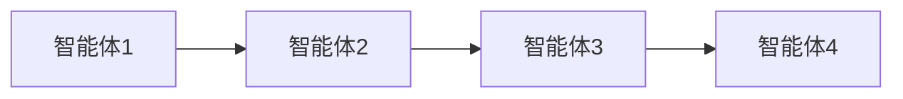
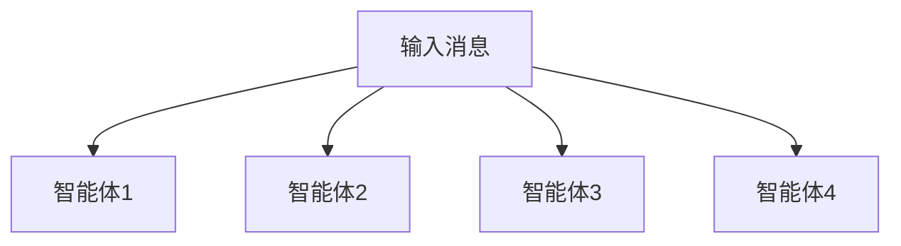
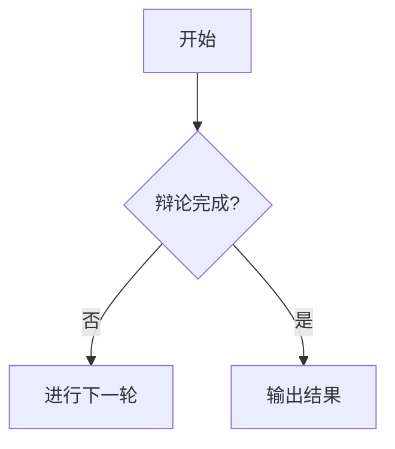
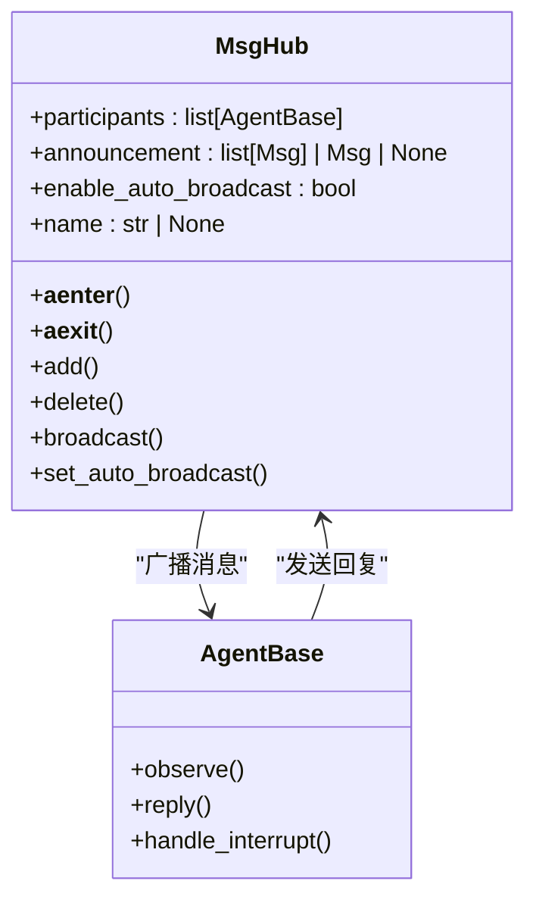
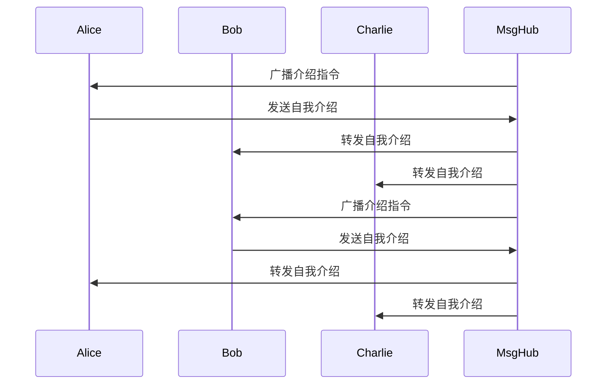
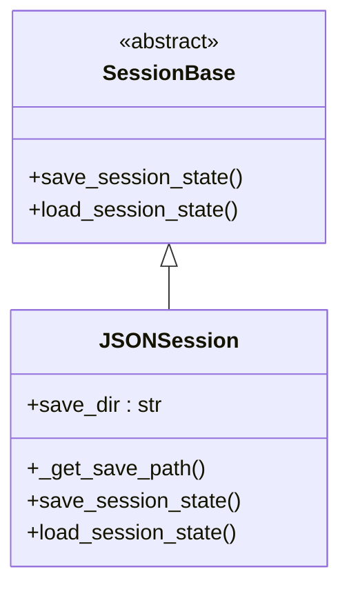
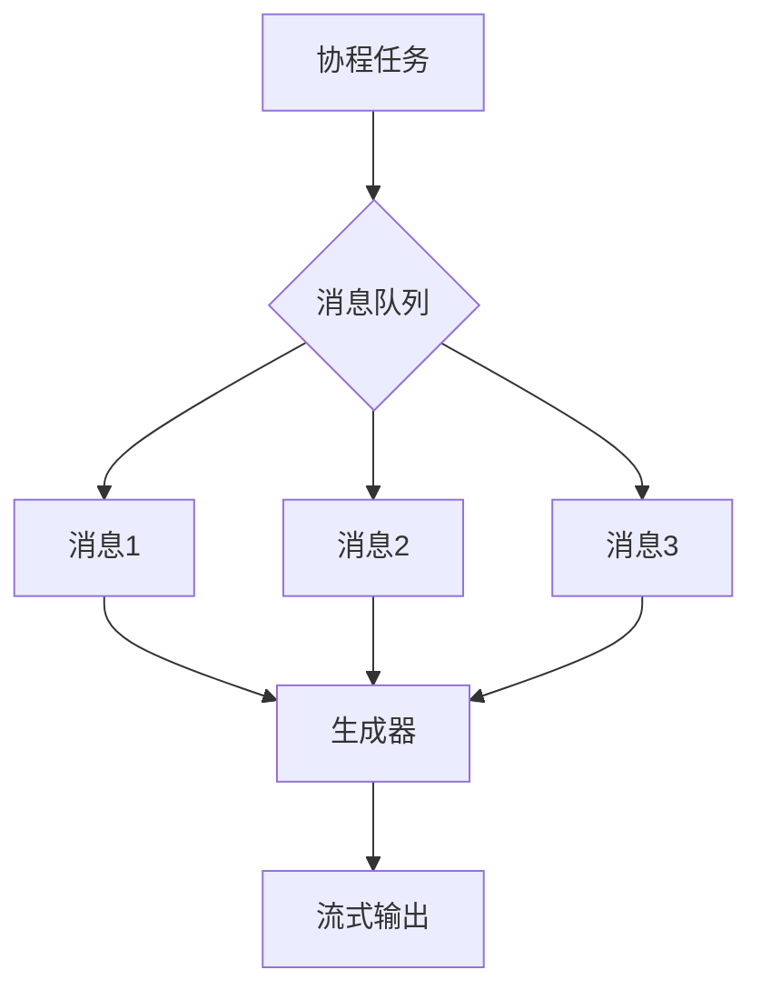

# 工作流

<cite>
**本文档中引用的文件**  
- [__init__.py](file://src/agentscope/pipeline/__init__.py)
- [_class.py](file://src/agentscope/pipeline/_class.py)
- [_functional.py](file://src/agentscope/pipeline/_functional.py)
- [_msghub.py](file://src/agentscope/pipeline/_msghub.py)
- [main.py](file://examples/workflows/multiagent_concurrent/main.py)
- [main.py](file://examples/workflows/multiagent_conversation/main.py)
- [main.py](file://examples/workflows/multiagent_debate/main.py)
- [task_pipeline.py](file://docs/tutorial/zh_CN/src/task_pipeline.py)
- [pipeline_test.py](file://tests/pipeline_test.py)
- [_json_session.py](file://src/agentscope/session/_json_session.py)
- [_session_base.py](file://src/agentscope/session/_session_base.py)
- [sqlite_session.py](file://examples/functionality/session_with_sqlite/sqlite_session.py)
- [task_tracing.py](file://docs/tutorial/zh_CN/src/task_tracing.py)
</cite>

## 目录
1. [引言](#引言)
2. [工作流编排核心机制](#工作流编排核心机制)
3. [MsgHub消息中心](#msghub消息中心)
4. [上下文管理器与对话循环](#上下文管理器与对话循环)
5. [工作流状态持久化与恢复](#工作流状态持久化与恢复)
6. [性能监控与调试工具](#性能监控与调试工具)
7. [复杂工作流设计最佳实践](#复杂工作流设计最佳实践)
8. [结论](#结论)

## 引言

AgentScope框架提供了一套完整的多智能体协作解决方案，其中工作流（Pipeline）是实现智能体间协同工作的核心机制。通过工作流，开发者可以轻松构建复杂的多智能体系统，实现智能体间的自动消息传递、协作编排和状态管理。本文档将深入探讨AgentScope中工作流的概念和实现机制，包括顺序执行、并发执行、条件分支等编排模式，以及MsgHub消息中心如何简化多智能体协作的复杂性。

**Section sources**
- [task_pipeline.py](file://docs/tutorial/zh_CN/src/task_pipeline.py#L1-L284)

## 工作流编排核心机制

AgentScope框架提供了多种工作流编排模式，包括顺序执行、并发执行和条件分支，以满足不同场景下的多智能体协作需求。

### 顺序执行模式

顺序执行模式通过`sequential_pipeline`函数或`SequentialPipeline`类实现，按照预定义的顺序逐个执行智能体。前一个智能体的输出会自动作为下一个智能体的输入，形成一个链式处理流程。



**Diagram sources**
- [_functional.py](file://src/agentscope/pipeline/_functional.py#L10-L44)
- [_class.py](file://src/agentscope/pipeline/_class.py#L10-L41)

### 并发执行模式

并发执行模式通过`fanout_pipeline`函数或`FanoutPipeline`类实现，将相同的输入消息同时分发给多个智能体，并收集所有响应。这种模式支持两种执行方式：通过`enable_gather=True`参数使用`asyncio.gather()`并发执行，或通过`enable_gather=False`参数顺序执行。



**Diagram sources**
- [_functional.py](file://src/agentscope/pipeline/_functional.py#L47-L104)
- [_class.py](file://src/agentscope/pipeline/_class.py#L43-L91)

### 条件分支模式

虽然框架未直接提供条件分支的API，但开发者可以通过结合`MsgHub`和条件判断语句实现复杂的分支逻辑。例如，在辩论场景中，可以根据评委的判断结果决定是否继续下一轮辩论。



**Section sources**
- [_functional.py](file://src/agentscope/pipeline/_functional.py#L10-L104)
- [main.py](file://examples/workflows/multiagent_debate/main.py#L85-L130)

## MsgHub消息中心

MsgHub是AgentScope中实现智能体间自动消息广播和订阅管理的核心组件，它通过异步上下文管理器的方式简化了多智能体协作的复杂性。

### 自动消息广播机制

MsgHub作为异步上下文管理器，接收一组智能体作为参与者。当任一参与者生成回复消息时，该消息会自动广播给所有其他参与者，通过调用它们的`observe`方法实现。



**Diagram sources**
- [_msghub.py](file://src/agentscope/pipeline/_msghub.py#L14-L157)

### 动态参与者管理

MsgHub支持在运行时动态管理参与者，提供了`add`、`delete`和`broadcast`等方法。这些方法允许在工作流执行过程中添加或移除智能体，并向当前所有参与者广播消息。

```python
async with MsgHub(participants=[alice]) as hub:
    # 添加新参与者
    hub.add(david)
    
    # 移除参与者
    hub.delete(alice)
    
    # 向所有当前参与者广播
    await hub.broadcast(
        Msg("system", "现在我们开始...", "system"),
    )
```

**Section sources**
- [_msghub.py](file://src/agentscope/pipeline/_msghub.py#L95-L157)
- [task_pipeline.py](file://docs/tutorial/zh_CN/src/task_pipeline.py#L112-L135)

## 上下文管理器与对话循环

通过上下文管理器，开发者可以轻松构建对话循环和协作场景，实现复杂的多智能体交互。

### 对话循环实现

在多智能体对话场景中，通过`MsgHub`上下文管理器可以实现智能体间的自动消息传递。例如，在会议场景中，每个智能体的自我介绍会自动广播给其他参与者。



**Diagram sources**
- [main.py](file://examples/workflows/multiagent_conversation/main.py#L38-L80)
- [task_pipeline.py](file://docs/tutorial/zh_CN/src/task_pipeline.py#L58-L63)

### 协作场景构建

在辩论场景中，通过结合`MsgHub`和`sequential_pipeline`，可以构建复杂的协作流程。辩论参与者在`MsgHub`上下文中进行讨论，而评委在外部进行评估。

```python
async with MsgHub(participants=[alice, bob, moderator]):
    await alice(Msg("user", "请表达你的观点。", "user"))
    await bob(Msg("user", "请表达你的观点。", "user"))

# 评委进行评估
msg_judge = await moderator(
    Msg("user", "现在你已经听到了各方的回答，辩论是否完成？", "user"),
    structured_model=JudgeModel,
)
```

**Section sources**
- [main.py](file://examples/workflows/multiagent_debate/main.py#L85-L130)
- [main.py](file://examples/workflows/multiagent_conversation/main.py#L38-L80)

## 工作流状态持久化与恢复

AgentScope提供了工作流状态的持久化和恢复机制，支持长时间运行的任务。

### 状态持久化机制

通过`SessionBase`基类和`JSONSession`实现，工作流状态可以被保存到文件系统中。`save_session_state`方法将状态模块的字典保存为JSON文件。



**Diagram sources**
- [_session_base.py](file://src/agentscope/session/_session_base.py#L8-L34)
- [_json_session.py](file://src/agentscope/session/_json_session.py#L11-L118)

### 状态恢复实现

`load_session_state`方法从JSON文件中加载状态字典，并通过`load_state_dict`方法恢复各个状态模块的状态。这使得长时间运行的工作流可以在中断后从上次保存的状态继续执行。

```python
# 保存会话状态
await json_session.save_session_state(
    session_id="workflow_001",
    pipeline=pipeline,
    msg_hub=msg_hub,
)

# 恢复会话状态
await json_session.load_session_state(
    session_id="workflow_001",
    pipeline=pipeline,
    msg_hub=msg_hub,
)
```

**Section sources**
- [_json_session.py](file://src/agentscope/session/_json_session.py#L77-L118)
- [sqlite_session.py](file://examples/functionality/session_with_sqlite/sqlite_session.py#L69-L81)

## 性能监控与调试工具

AgentScope提供了完善的性能监控和调试工具，包括执行轨迹记录和瓶颈分析。

### 执行轨迹记录

通过集成OpenTelemetry，AgentScope实现了对LLM、工具、智能体等组件的内置追踪。执行轨迹可以在AgentScope Studio中进行可视化，也可以连接到第三方平台如阿里云云监控、Arize-Phoenix、Langfuse等。

```python
import agentscope

# 连接到AgentScope Studio
agentscope.init(studio_url="http://xxx:port")

# 连接到第三方追踪平台
agentscope.init(tracing_url="https://your-tracing-backend:port/traces")
```

**Section sources**
- [task_tracing.py](file://docs/tutorial/zh_CN/src/task_tracing.py#L1-L72)

### 瓶颈分析

通过`stream_printing_messages`函数，可以将智能体在回复过程中调用`self.print`打印的消息转换为异步生成器，从而实现流式获取中间消息，帮助开发者进行性能分析和调试。



**Diagram sources**
- [_functional.py](file://src/agentscope/pipeline/_functional.py#L107-L193)
- [pipeline_test.py](file://tests/pipeline_test.py#L379-L439)

## 复杂工作流设计最佳实践

在设计复杂工作流时，需要考虑错误处理、超时控制和资源管理等关键因素。

### 错误处理策略

在`stream_printing_messages`函数中，即使在处理过程中发生异常，也会在处理完所有消息后重新抛出异常，确保不会丢失已处理的消息。

```python
try:
    async for msg, _ in stream_printing_messages(
        [error_agent],
        error_agent(),
    ):
        messages_received.append(msg)
except ValueError as e:
    exception_raised = True
    self.assertEqual(str(e), "Error after printing")
```

**Section sources**
- [pipeline_test.py](file://tests/pipeline_test.py#L411-L439)

### 超时控制与资源管理

通过`enable_gather=False`参数，可以将并发执行模式切换为顺序执行，避免同时向外部服务发送过多请求。同时，`MsgHub`的`delete`方法可以及时移除不再需要的参与者，释放相关资源。

```python
# 顺序执行以控制资源使用
results = await fanout_pipeline(
    [agent1, agent2, agent3],
    msg_input,
    enable_gather=False
)

# 移除不再需要的参与者
hub.delete(bob)
```

**Section sources**
- [_functional.py](file://src/agentscope/pipeline/_functional.py#L96-L104)
- [_msghub.py](file://src/agentscope/pipeline/_msghub.py#L109-L129)

## 结论

AgentScope框架通过工作流机制为多智能体系统提供了强大的编排能力。从简单的顺序执行到复杂的并发协作，从自动消息广播到状态持久化，再到性能监控和调试，AgentScope为开发者提供了一套完整的工具链。通过合理运用这些机制和最佳实践，可以构建出高效、可靠且易于维护的多智能体应用系统。