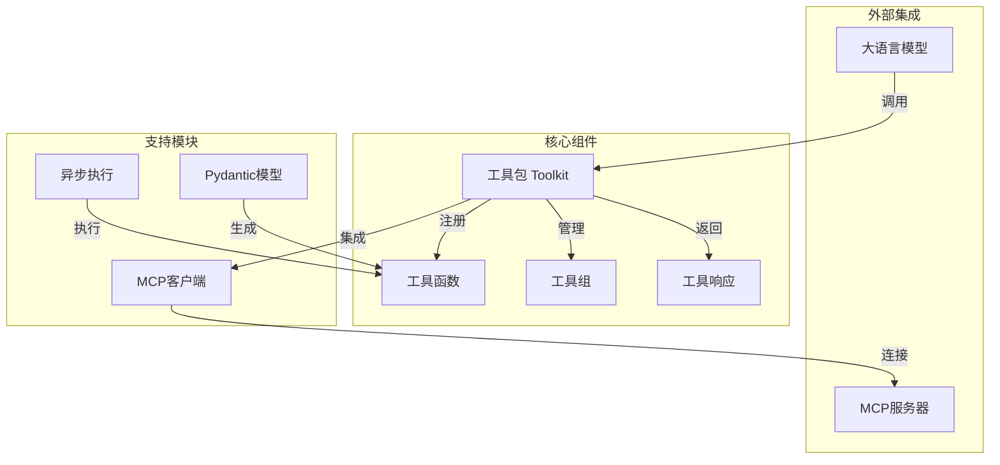
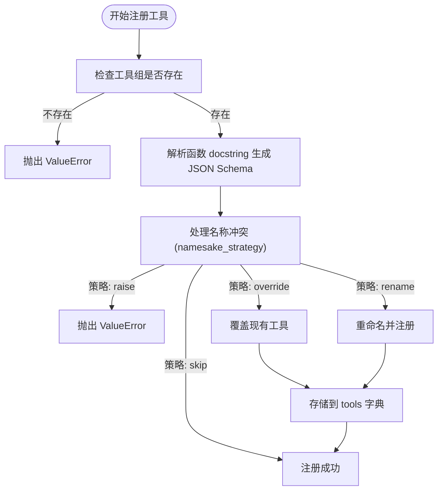
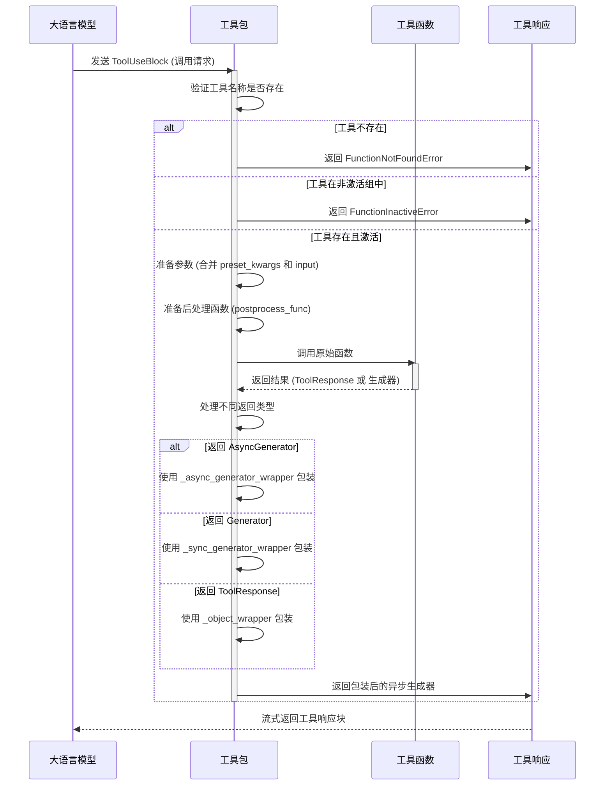
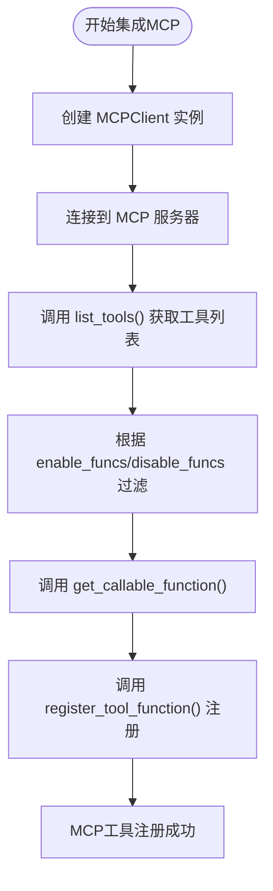

# 工具

<cite>
**本文档中引用的文件**   
- [toolkit.py](file://src/agentscope/tool/_toolkit.py)
- [tool.py](file://src/agentscope/tool/__init__.py)
- [types.py](file://src/agentscope/tool/_types.py)
- [response.py](file://src/agentscope/tool/_response.py)
- [python.py](file://src/agentscope/tool/_coding/_python.py)
- [shell.py](file://src/agentscope/tool/_coding/_shell.py)
- [mcp.py](file://src/agentscope/mcp/__init__.py)
- [common.py](file://src/agentscope/_utils/_common.py)
- [tool_test.py](file://tests/tool_test.py)
- [toolkit_basic_test.py](file://tests/toolkit_basic_test.py)
</cite>

## 目录
1. [引言](#引言)
2. [工具系统架构](#工具系统架构)
3. [工具注册与发现机制](#工具注册与发现机制)
4. [工具调用机制](#工具调用机制)
5. [工具安全性考虑](#工具安全性考虑)
6. [具体工具实现示例](#具体工具实现示例)
7. [MCP工具集成](#mcp工具集成)
8. [性能监控与调用限制](#性能监控与调用限制)
9. [结论](#结论)

## 引言

AgentScope框架中的工具（Tool）系统为智能体提供了扩展能力的重要机制。该系统允许将Python函数暴露为可被大语言模型（LLM）调用的工具，并通过统一的接口进行管理、发现和执行。工具系统不仅支持本地函数的注册，还集成了Model Calling Protocol（MCP）标准，实现了与外部服务的无缝对接。本文档将深入解析工具系统的设计架构，涵盖从工具注册、发现、调用到安全性和性能优化的各个方面。

**Section sources**
- [toolkit.py](file://src/agentscope/tool/_toolkit.py#L1-L1127)
- [tool.py](file://src/agentscope/tool/__init__.py#L1-L45)

## 工具系统架构

AgentScope的工具系统以`Toolkit`类为核心，提供了一套完整的工具管理解决方案。该系统的设计遵循模块化和可扩展性原则，主要由以下几个关键组件构成：

1.  **工具注册中心 (Toolkit)**：`Toolkit`类是整个工具系统的中枢，负责管理所有已注册的工具函数、工具组和代理技能。它提供了注册、查询、调用和移除工具的统一接口。

2.  **工具描述与发现**：系统通过解析函数的docstring自动生成符合JSON Schema标准的工具描述，这些描述可供LLM理解工具的功能和参数，从而实现工具的发现和调用。

3.  **工具执行引擎**：支持同步、异步、生成器等多种函数类型的执行，并通过统一的流式接口返回结果，确保了调用的一致性。

4.  **MCP集成层**：通过`MCPClientBase`等类，实现了对MCP协议的支持，允许将远程MCP服务器提供的功能无缝集成到本地工具系统中。

5.  **安全与控制机制**：包括工具组的动态激活/停用、参数验证、执行沙箱和错误处理，确保了工具调用的安全性和可控性。

**Diagram sources**
- [toolkit.py](file://src/agentscope/tool/_toolkit.py#L55-L1127)
- [types.py](file://src/agentscope/tool/_types.py#L15-L157)

**Section sources**
- [toolkit.py](file://src/agentscope/tool/_toolkit.py#L55-L1127)
- [types.py](file://src/agentscope/tool/_types.py#L15-L157)

## 工具注册与发现机制

### 工具注册

工具的注册是通过`Toolkit`类的`register_tool_function`方法实现的。开发者可以将任何符合`ToolFunction`类型的Python函数注册为工具。注册过程的核心是自动生成工具的JSON Schema描述。

**Diagram sources**
- [toolkit.py](file://src/agentscope/tool/_toolkit.py#L206-L443)
- [common.py](file://src/agentscope/_utils/_common.py#L315-L432)

#### 装饰器与类方法

虽然框架本身没有提供显式的装饰器来注册工具，但其设计允许通过`register_tool_function`方法以编程方式将函数暴露为工具。该方法支持多种函数类型，包括：
*   **普通同步函数**
*   **异步函数 (`async def`)**
*   **生成器函数 (`yield`)**
*   **异步生成器函数 (`async yield`)**
*   **偏函数 (`functools.partial`)**

注册时，系统会自动处理这些函数的调用和结果返回，开发者只需关注业务逻辑的实现。

#### 工具描述生成

工具描述的自动生成是通过`_parse_tool_function`函数实现的。该函数利用`docstring_parser`库解析函数的docstring，提取以下信息：
*   **函数名称**：从函数的`__name__`属性获取。
*   **函数描述**：从docstring的短描述（short description）和长描述（long description）中提取。
*   **参数信息**：分析函数签名（`inspect.signature`），获取每个参数的名称、类型、默认值和描述（从docstring中对应参数的描述获取）。

这些信息被用来动态创建一个Pydantic `BaseModel`，然后通过`model_json_schema()`方法生成最终的JSON Schema。此Schema是LLM理解如何调用该工具的关键。

**Section sources**
- [toolkit.py](file://src/agentscope/tool/_toolkit.py#L206-L443)
- [common.py](file://src/agentscope/_utils/_common.py#L315-L432)

## 工具调用机制

### 核心调用流程

工具的调用由`Toolkit`类的`call_tool_function`方法处理。该方法接收一个`ToolUseBlock`对象，该对象包含了LLM请求调用的工具名称和输入参数。

**Diagram sources**
- [toolkit.py](file://src/agentscope/tool/_toolkit.py#L594-L725)
- [response.py](file://src/agentscope/tool/_response.py#L11-L33)

### 统一流式接口

无论原始工具函数是同步、异步还是生成器，`call_tool_function`方法都保证返回一个`AsyncGenerator[ToolResponse, None]`。这是通过`_async_generator_wrapper`、`_sync_generator_wrapper`和`_object_wrapper`这三个包装函数实现的。这种设计为上层应用（如智能体）提供了统一的、非阻塞的流式API，极大地简化了结果处理逻辑。

**Section sources**
- [toolkit.py](file://src/agentscope/tool/_toolkit.py#L594-L725)
- [response.py](file://src/agentscope/tool/_response.py#L11-L33)

## 工具安全性考虑

### 参数验证

工具系统的参数验证主要依赖于JSON Schema。当LLM生成工具调用请求时，其参数必须符合注册时生成的JSON Schema。虽然框架本身不直接在`call_tool_function`中进行运行时验证，但这个Schema是LLM生成有效调用的基础。开发者应在函数内部实现必要的业务逻辑验证。

### 执行沙箱

框架通过在独立的子进程中执行代码来提供一定程度的沙箱保护。例如，`execute_python_code`工具在临时目录中创建一个`.py`文件，并使用`asyncio.create_subprocess_exec`来执行它。这限制了代码对主进程的直接影响，并且临时文件在执行后会被自动清理。

### 错误处理

系统内置了完善的错误处理机制：
*   **函数未找到**：当调用一个未注册的工具时，返回`FunctionNotFoundError`。
*   **工具组未激活**：当调用一个属于非激活工具组的工具时，返回`FunctionInactiveError`，并提示用户使用`reset_equipped_tools`来激活。
*   **执行异常**：工具函数内部抛出的任何异常都会被捕获，并封装在`ToolResponse`中返回，避免导致整个系统崩溃。
*   **超时处理**：对于可能长时间运行的工具（如代码执行、Shell命令），系统支持设置超时时间。超时后，进程会被终止，并返回相应的超时错误信息。

**Section sources**
- [toolkit.py](file://src/agentscope/tool/_toolkit.py#L614-L707)
- [python.py](file://src/agentscope/tool/_coding/_python.py#L17-L91)
- [shell.py](file://src/agentscope/tool/_coding/_shell.py#L12-L78)

## 具体工具实现示例

### Python代码执行工具

`execute_python_code`工具允许智能体执行任意Python代码。其实现关键点如下：
*   **安全性**：代码在临时文件中执行，执行环境与主进程隔离。
*   **超时控制**：通过`asyncio.wait_for`实现，防止无限循环或长时间阻塞。
*   **结果捕获**：捕获`stdout`和`stderr`，并将结果（包括返回码）通过`ToolResponse`返回。
*   **编码处理**：确保子进程使用UTF-8编码，避免中文乱码问题。

**Section sources**
- [python.py](file://src/agentscope/tool/_coding/_python.py#L17-L91)
- [tool_test.py](file://tests/tool_test.py#L30-L97)

### Shell命令工具

`execute_shell_command`工具用于执行系统Shell命令。其设计与Python代码执行工具类似：
*   **异步执行**：使用`asyncio.create_subprocess_shell`，避免阻塞事件循环。
*   **资源清理**：即使在超时或异常情况下，也尽量确保进程被终止。
*   **跨平台考虑**：测试中对Windows和Unix-like系统进行了区分处理。

**Section sources**
- [shell.py](file://src/agentscope/tool/_coding/_shell.py#L12-L78)
- [tool_test.py](file://tests/tool_test.py#L98-L154)

## MCP工具集成

### MCP集成机制

MCP（Model Calling Protocol）是一种标准化的协议，用于连接LLM与外部工具。AgentScope通过`register_mcp_client`方法实现了对MCP的集成。

**Diagram sources**
- [toolkit.py](file://src/agentscope/tool/_toolkit.py#L727-L865)
- [mcp.py](file://src/agentscope/mcp/__init__.py#L5-L21)

#### 集成流程
1.  **创建客户端**：实例化`HttpStatelessClient`或`HttpStatefulClient`等MCP客户端。
2.  **建立连接**：对于有状态客户端，需要先调用`connect()`方法。
3.  **注册客户端**：调用`toolkit.register_mcp_client(mcp_client)`。该方法会：
    *   调用MCP客户端的`list_tools()`方法获取所有可用工具。
    *   根据`enable_funcs`和`disable_funcs`参数进行过滤。
    *   为每个工具调用`get_callable_function()`，获取一个可调用的本地函数对象。
    *   将这些本地函数对象作为普通工具注册到`Toolkit`中。

通过这种方式，MCP服务器上的远程工具被“本地化”，智能体可以像调用本地工具一样调用它们。

**Section sources**
- [toolkit.py](file://src/agentscope/tool/_toolkit.py#L727-L865)
- [main.py](file://examples/functionality/mcp/main.py#L34-L111)

## 性能监控与调用限制

### 最佳实践

虽然框架本身没有内置复杂的性能监控仪表盘，但其设计为实现这些功能提供了基础：
*   **工具分组与激活**：通过`create_tool_group`和`reset_equipped_tools`，可以按需激活工具组。这不仅是一种安全控制，也是一种性能优化策略——只暴露当前任务需要的工具，可以减少LLM的决策空间，提高响应速度和准确性。
*   **异步非阻塞**：整个调用链路基于`asyncio`，确保了高并发下的性能。
*   **超时设置**：为每个工具设置合理的超时时间，防止个别慢工具拖累整体流程。
*   **日志记录**：框架使用`logger`记录关键操作（如工具注册、移除），可用于后续的性能分析和问题排查。

### 调用限制

直接的调用频率限制（Rate Limiting）需要在应用层实现。但可以通过以下方式间接控制：
*   **状态管理**：利用`toolkit.state_dict()`和`load_state_dict()`保存和恢复工具组的激活状态，实现复杂的调用策略。
*   **后处理函数**：利用`postprocess_func`参数，在工具执行后进行自定义处理，例如记录调用次数或根据结果决定是否允许后续调用。

**Section sources**
- [toolkit.py](file://src/agentscope/tool/_toolkit.py#L867-L918)
- [toolkit.py](file://src/agentscope/tool/_toolkit.py#L937-L999)

## 结论

AgentScope的工具系统是一个功能强大且设计精良的模块，它为构建具备扩展能力的智能体提供了坚实的基础。通过`Toolkit`类，系统实现了工具的集中注册、动态发现和安全调用。其对MCP协议的支持，使得集成外部服务变得简单而标准化。统一的流式接口和完善的错误处理机制，保证了系统的稳定性和易用性。开发者可以轻松地将各种功能（从代码执行到API调用）封装为工具，并通过LLM的自然语言指令来驱动，极大地扩展了智能体的能力边界。未来，可以在此基础上进一步构建更精细的性能监控、调用配额和安全审计系统。