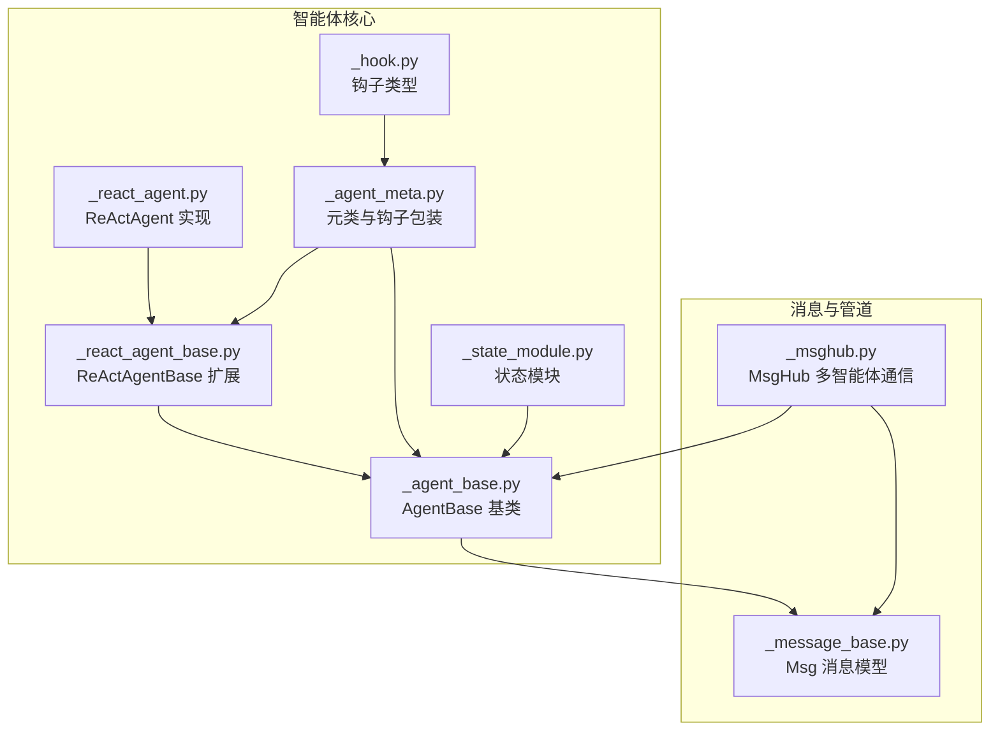
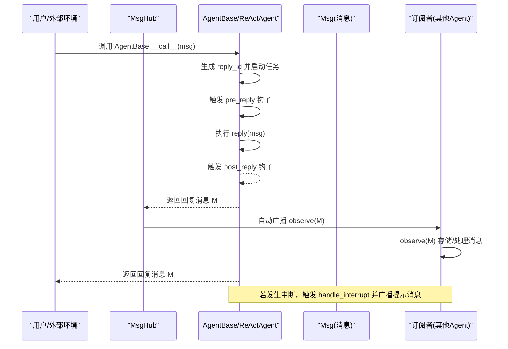
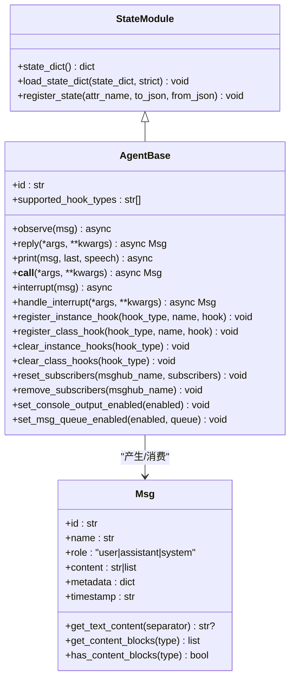
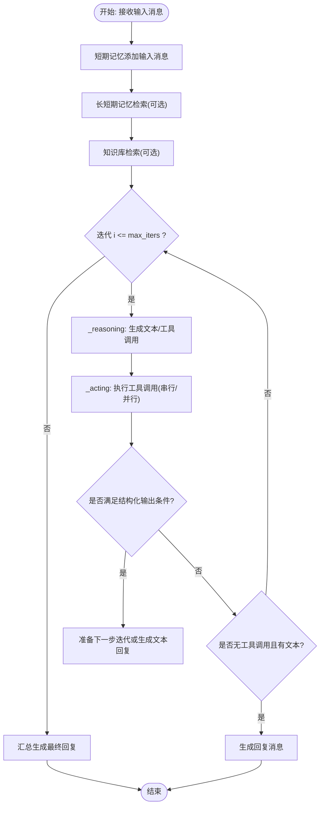
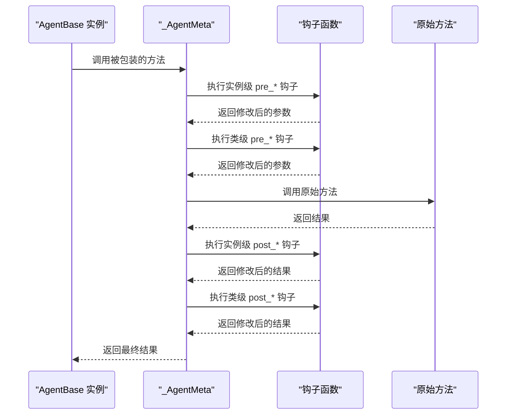
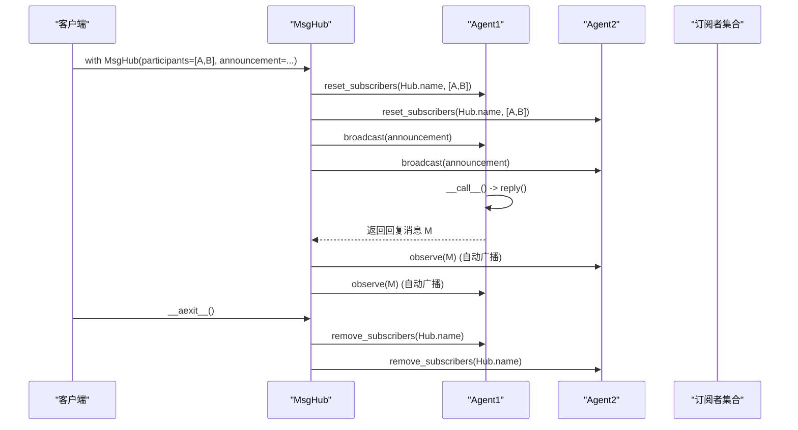
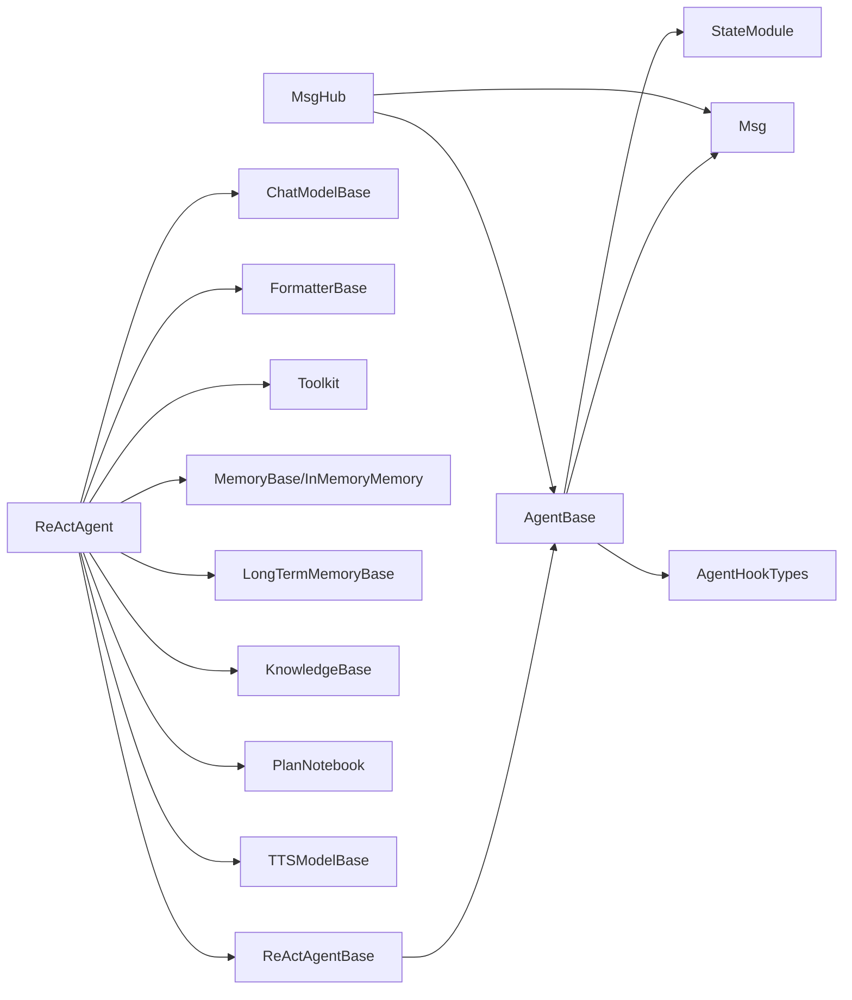

# 智能体

<cite>
**本文引用的文件列表**
- [src/agentscope/agent/_agent_base.py](file://src/agentscope/agent/_agent_base.py)
- [src/agentscope/agent/_react_agent_base.py](file://src/agentscope/agent/_react_agent_base.py)
- [src/agentscope/agent/_react_agent.py](file://src/agentscope/agent/_react_agent.py)
- [src/agentscope/agent/_agent_meta.py](file://src/agentscope/agent/_agent_meta.py)
- [src/agentscope/pipeline/_msghub.py](file://src/agentscope/pipeline/_msghub.py)
- [src/agentscope/message/_message_base.py](file://src/agentscope/message/_message_base.py)
- [src/agentscope/module/_state_module.py](file://src/agentscope/module/_state_module.py)
- [src/agentscope/types/_hook.py](file://src/agentscope/types/_hook.py)
- [examples/agent/react_agent/main.py](file://examples/agent/react_agent/main.py)
</cite>

## 目录
1. [引言](#引言)
2. [项目结构](#项目结构)
3. [核心组件](#核心组件)
4. [架构总览](#架构总览)
5. [详细组件分析](#详细组件分析)
6. [依赖关系分析](#依赖关系分析)
7. [性能与并发特性](#性能与并发特性)
8. [故障排查指南](#故障排查指南)
9. [结论](#结论)
10. [附录：创建自定义智能体与示例路径](#附录创建自定义智能体与示例路径)

## 引言
本章节系统性阐述 agentscope 框架中“智能体（Agent）”的概念与实现，重点围绕以下主题：
- AgentBase 作为所有智能体基类的设计原则：异步特性、唯一标识符生成、核心方法（observe、reply、print）职责与生命周期管理。
- ReActAgentBase 如何扩展基础智能体以支持“推理-行动”循环模式，并引入推理与行动阶段的钩子。
- 智能体生命周期：消息观察、回复生成、中断处理与广播传播。
- 智能体间通过消息传递进行交互的模式，以及 MsgHub 在协调多智能体通信中的作用。
- 智能体状态管理与钩子机制的技术细节，帮助开发者扩展智能体行为。

## 项目结构
围绕智能体的核心代码主要位于 src/agentscope/agent 目录，配合消息模型、管道与钩子类型等模块协同工作。下图给出与智能体相关的关键文件与职责概览。

图表来源
- [src/agentscope/agent/_agent_base.py](file://src/agentscope/agent/_agent_base.py#L1-L120)
- [src/agentscope/agent/_react_agent_base.py](file://src/agentscope/agent/_react_agent_base.py#L1-L117)
- [src/agentscope/agent/_react_agent.py](file://src/agentscope/agent/_react_agent.py#L1-L120)
- [src/agentscope/agent/_agent_meta.py](file://src/agentscope/agent/_agent_meta.py#L1-L181)
- [src/agentscope/message/_message_base.py](file://src/agentscope/message/_message_base.py#L1-L120)
- [src/agentscope/pipeline/_msghub.py](file://src/agentscope/pipeline/_msghub.py#L1-L120)
- [src/agentscope/module/_state_module.py](file://src/agentscope/module/_state_module.py#L1-L120)
- [src/agentscope/types/_hook.py](file://src/agentscope/types/_hook.py#L1-L26)

章节来源
- [src/agentscope/agent/_agent_base.py](file://src/agentscope/agent/_agent_base.py#L1-L120)
- [src/agentscope/agent/_react_agent_base.py](file://src/agentscope/agent/_react_agent_base.py#L1-L117)
- [src/agentscope/agent/_react_agent.py](file://src/agentscope/agent/_react_agent.py#L1-L120)
- [src/agentscope/agent/_agent_meta.py](file://src/agentscope/agent/_agent_meta.py#L1-L181)
- [src/agentscope/message/_message_base.py](file://src/agentscope/message/_message_base.py#L1-L120)
- [src/agentscope/pipeline/_msghub.py](file://src/agentscope/pipeline/_msghub.py#L1-L120)
- [src/agentscope/module/_state_module.py](file://src/agentscope/module/_state_module.py#L1-L120)
- [src/agentscope/types/_hook.py](file://src/agentscope/types/_hook.py#L1-L26)

## 核心组件
- AgentBase：异步智能体基类，提供 observe、reply、print 三大核心方法；内置钩子注册与执行机制；支持消息队列与控制台输出开关；支持订阅者广播与中断处理。
- ReActAgentBase：在 AgentBase 基础上扩展“推理-行动”循环，新增 _reasoning 与 _acting 抽象接口，并引入推理/行动阶段的钩子类型。
- ReActAgent：ReActAgentBase 的具体实现，包含推理-行动循环、工具调用、长短期记忆、RAG 检索、结构化输出、TTS 集成、最大迭代次数控制等。
- MsgHub：多智能体消息共享与自动广播的协调器，负责订阅关系维护与消息分发。
- Msg：统一的消息数据结构，支持文本、工具调用/结果、图像/音频/视频等多模态内容块。
- StateModule：状态模块，用于跟踪可序列化属性，支持嵌套模块的状态保存与恢复。
- 钩子类型：定义支持的钩子类型集合，覆盖 pre/post 观察、回复、打印以及推理/行动阶段。

章节来源
- [src/agentscope/agent/_agent_base.py](file://src/agentscope/agent/_agent_base.py#L1-L200)
- [src/agentscope/agent/_react_agent_base.py](file://src/agentscope/agent/_react_agent_base.py#L1-L117)
- [src/agentscope/agent/_react_agent.py](file://src/agentscope/agent/_react_agent.py#L1-L200)
- [src/agentscope/pipeline/_msghub.py](file://src/agentscope/pipeline/_msghub.py#L1-L120)
- [src/agentscope/message/_message_base.py](file://src/agentscope/message/_message_base.py#L1-L120)
- [src/agentscope/module/_state_module.py](file://src/agentscope/module/_state_module.py#L1-L120)
- [src/agentscope/types/_hook.py](file://src/agentscope/types/_hook.py#L1-L26)

## 架构总览
下图展示了智能体、消息、管道与钩子之间的交互关系。

图表来源
- [src/agentscope/agent/_agent_base.py](file://src/agentscope/agent/_agent_base.py#L444-L485)
- [src/agentscope/agent/_react_agent.py](file://src/agentscope/agent/_react_agent.py#L253-L408)
- [src/agentscope/pipeline/_msghub.py](file://src/agentscope/pipeline/_msghub.py#L73-L120)

## 详细组件分析

### AgentBase 设计与生命周期
- 异步特性与任务管理
  - 使用 asyncio.Task 记录当前回复任务与唯一标识，便于中断与广播传播。
  - __call__ 方法封装 reply 调用，捕获取消异常并调用 handle_interrupt，最后广播回复给订阅者。
- 唯一标识符生成
  - 智能体 id 与消息 id 均使用短 UUID 生成，确保全局唯一性。
- 核心方法职责
  - observe(msg): 接收消息但不生成回复，用于状态更新与历史记录。
  - reply(...): 主逻辑，根据输入与内部状态生成回复消息 Msg。
  - print(msg, last, speech): 控制台输出与流式播放，支持文本、思考块与多模态块；支持消息队列导出与 TTS 音频播放。
- 生命周期管理
  - 订阅者管理：reset_subscribers/remove_subscribers 维护订阅关系；_broadcast_to_subscribers 将回复广播给所有订阅者。
  - 中断处理：interrupt 取消当前任务；handle_interrupt 提供中断后的后处理逻辑（由子类实现）。
- 钩子机制
  - 支持 pre/post observe/reply/print；支持实例级与类级钩子注册与清理。
  - 元类 _AgentMeta 动态包装 observe/reply/print，按序执行实例与类级钩子。
- 状态管理
  - 继承 StateModule，支持注册属性为状态变量，实现序列化/反序列化。

图表来源
- [src/agentscope/agent/_agent_base.py](file://src/agentscope/agent/_agent_base.py#L1-L200)
- [src/agentscope/message/_message_base.py](file://src/agentscope/message/_message_base.py#L1-L120)
- [src/agentscope/module/_state_module.py](file://src/agentscope/module/_state_module.py#L1-L120)

章节来源
- [src/agentscope/agent/_agent_base.py](file://src/agentscope/agent/_agent_base.py#L140-L200)
- [src/agentscope/agent/_agent_base.py](file://src/agentscope/agent/_agent_base.py#L180-L260)
- [src/agentscope/agent/_agent_base.py](file://src/agentscope/agent/_agent_base.py#L444-L485)
- [src/agentscope/agent/_agent_base.py](file://src/agentscope/agent/_agent_base.py#L660-L733)
- [src/agentscope/message/_message_base.py](file://src/agentscope/message/_message_base.py#L1-L120)
- [src/agentscope/module/_state_module.py](file://src/agentscope/module/_state_module.py#L1-L120)

### ReActAgentBase 与 ReActAgent
- ReActAgentBase
  - 在 AgentBase 基础上扩展“推理-行动”循环，新增 _reasoning 与 _acting 抽象方法。
  - 支持 pre/post reasoning/acting 钩子类型，由 _ReActAgentMeta 元类动态包装。
- ReActAgent
  - 实现推理-行动循环：先推理生成工具调用/文本，再行动执行工具调用，支持串行/并行工具调用。
  - 集成长短期记忆、知识检索（RAG）、计划笔记本、结构化输出、TTS 音频合成与流式输出。
  - 最大迭代次数控制，超限后汇总生成最终回复；支持中断后生成“被中断”的提示消息。
  - observe 仅追加消息到短期记忆；handle_interrupt 提供中断后的响应消息。

图表来源
- [src/agentscope/agent/_react_agent.py](file://src/agentscope/agent/_react_agent.py#L253-L408)
- [src/agentscope/agent/_react_agent.py](file://src/agentscope/agent/_react_agent.py#L411-L522)
- [src/agentscope/agent/_react_agent.py](file://src/agentscope/agent/_react_agent.py#L523-L581)

章节来源
- [src/agentscope/agent/_react_agent_base.py](file://src/agentscope/agent/_react_agent_base.py#L1-L117)
- [src/agentscope/agent/_react_agent.py](file://src/agentscope/agent/_react_agent.py#L1-L200)
- [src/agentscope/agent/_react_agent.py](file://src/agentscope/agent/_react_agent.py#L253-L408)
- [src/agentscope/agent/_react_agent.py](file://src/agentscope/agent/_react_agent.py#L411-L522)
- [src/agentscope/agent/_react_agent.py](file://src/agentscope/agent/_react_agent.py#L523-L581)

### 钩子机制与元类包装
- 钩子类型
  - AgentHookTypes：pre/post observe/reply/print。
  - ReActAgentHookTypes：在上述基础上增加 pre/post reasoning/acting。
- 元类 _AgentMeta
  - 对 observe/reply/print 进行包装，按序执行实例与类级钩子；支持同步/异步钩子。
- 元类 _ReActAgentMeta
  - 对 _reasoning/_acting 进行包装，同样支持实例与类级钩子。

图表来源
- [src/agentscope/agent/_agent_meta.py](file://src/agentscope/agent/_agent_meta.py#L1-L181)
- [src/agentscope/types/_hook.py](file://src/agentscope/types/_hook.py#L1-L26)

章节来源
- [src/agentscope/agent/_agent_meta.py](file://src/agentscope/agent/_agent_meta.py#L1-L181)
- [src/agentscope/types/_hook.py](file://src/agentscope/types/_hook.py#L1-L26)

### 智能体间消息交互与 MsgHub 协调
- 订阅与广播
  - 每个智能体维护一个订阅者字典，键为 MsgHub 名称，值为该 Hub 下的智能体列表。
  - MsgHub 在进入上下文时重置订阅关系；退出时可选择移除订阅。
- 自动广播
  - 当启用自动广播时，任意参与者回复的消息会自动广播给其他参与者。
- 手动广播
  - 也可通过 broadcast 显式向所有参与者发送消息。

图表来源
- [src/agentscope/pipeline/_msghub.py](file://src/agentscope/pipeline/_msghub.py#L73-L120)
- [src/agentscope/agent/_agent_base.py](file://src/agentscope/agent/_agent_base.py#L660-L690)

章节来源
- [src/agentscope/pipeline/_msghub.py](file://src/agentscope/pipeline/_msghub.py#L1-L157)
- [src/agentscope/agent/_agent_base.py](file://src/agentscope/agent/_agent_base.py#L660-L690)

### 智能体状态管理
- StateModule
  - 通过 register_state 注册需要跟踪的属性，支持自定义 JSON 序列化/反序列化函数。
  - state_dict/load_state_dict 支持嵌套模块的状态保存与恢复。
- 在 Agent 中的应用
  - ReActAgent 通过 register_state 注册 name、sys_prompt 等关键状态，便于持久化与调试。

章节来源
- [src/agentscope/module/_state_module.py](file://src/agentscope/module/_state_module.py#L1-L152)
- [src/agentscope/agent/_react_agent.py](file://src/agentscope/agent/_react_agent.py#L233-L248)

## 依赖关系分析
- 组件耦合
  - AgentBase 依赖 Msg、StateModule、日志与钩子类型；ReActAgentBase 继承 AgentBase 并引入 ReAct 钩子类型。
  - ReActAgent 依赖模型、格式化器、工具包、内存、长短期记忆、知识库、计划笔记本、TTS 等模块。
  - MsgHub 依赖 AgentBase 与 Msg，用于订阅与广播。
- 外部依赖
  - UUID 生成、异步队列、音频播放等第三方库在 AgentBase 的 print 与音频处理中使用。

图表来源
- [src/agentscope/agent/_agent_base.py](file://src/agentscope/agent/_agent_base.py#L1-L120)
- [src/agentscope/agent/_react_agent.py](file://src/agentscope/agent/_react_agent.py#L1-L120)
- [src/agentscope/pipeline/_msghub.py](file://src/agentscope/pipeline/_msghub.py#L1-L120)
- [src/agentscope/message/_message_base.py](file://src/agentscope/message/_message_base.py#L1-L120)

章节来源
- [src/agentscope/agent/_agent_base.py](file://src/agentscope/agent/_agent_base.py#L1-L120)
- [src/agentscope/agent/_react_agent.py](file://src/agentscope/agent/_react_agent.py#L1-L120)
- [src/agentscope/pipeline/_msghub.py](file://src/agentscope/pipeline/_msghub.py#L1-L120)
- [src/agentscope/message/_message_base.py](file://src/agentscope/message/_message_base.py#L1-L120)

## 性能与并发特性
- 异步与并发
  - 所有核心方法均为异步，支持 asyncio 任务与取消；ReActAgent 支持并行工具调用（parallel_tool_calls）。
- 流式输出
  - print 支持流式文本与音频输出，结合消息队列与 TTS，适合实时交互场景。
- 资源管理
  - 音频播放使用流式输出与缓存前缀，避免重复播放与资源泄漏；流式结束后自动关闭播放器。
- 中断与广播
  - 中断通过任务取消触发，handle_interrupt 提供统一后处理；广播采用异步 observe，避免阻塞。

章节来源
- [src/agentscope/agent/_agent_base.py](file://src/agentscope/agent/_agent_base.py#L205-L272)
- [src/agentscope/agent/_agent_base.py](file://src/agentscope/agent/_agent_base.py#L272-L364)
- [src/agentscope/agent/_react_agent.py](file://src/agentscope/agent/_react_agent.py#L314-L326)
- [src/agentscope/agent/_react_agent.py](file://src/agentscope/agent/_react_agent.py#L451-L490)

## 故障排查指南
- 中断未生效
  - 确认已调用 interrupt 并且当前任务未完成；检查 handle_interrupt 是否正确实现。
- 输出为空或异常
  - 检查 set_console_output_enabled 与 set_msg_queue_enabled 的配置；确认消息队列已启用且非 None。
- 音频播放失败
  - 检查音频块 source 类型与数据格式；确认网络可达与权限；查看错误日志。
- 钩子未执行
  - 确认钩子类型名称正确；检查实例/类级钩子是否注册；确认元类包装是否生效。
- 订阅广播无效
  - 检查 MsgHub 的自动广播开关；确认 reset_subscribers 已在上下文进入时调用；确认订阅者列表不含自身。

章节来源
- [src/agentscope/agent/_agent_base.py](file://src/agentscope/agent/_agent_base.py#L486-L520)
- [src/agentscope/agent/_agent_base.py](file://src/agentscope/agent/_agent_base.py#L708-L733)
- [src/agentscope/pipeline/_msghub.py](file://src/agentscope/pipeline/_msghub.py#L73-L120)

## 结论
agentscope 的智能体体系以 AgentBase 为核心，通过异步设计、钩子机制与消息模型，提供了高内聚、可扩展的智能体框架。ReActAgentBase/ReActAgent 进一步将“推理-行动”循环工程化，结合工具、记忆与知识库，形成完整的多模态智能体能力。MsgHub 则为多智能体协作提供了简洁的订阅-广播机制。开发者可通过继承 AgentBase 或 ReActAgentBase，结合钩子与状态模块，快速构建定制化的智能体应用。

## 附录：创建自定义智能体与示例路径
- 创建自定义智能体步骤
  - 继承 AgentBase 或 ReActAgentBase，实现 observe、reply、print（必要时）与 handle_interrupt。
  - 使用 register_instance_hook/register_class_hook 注册钩子，或通过元类包装增强行为。
  - 使用 register_state 注册状态变量，便于持久化与调试。
  - 通过 MsgHub 管理订阅者，实现多智能体间的自动广播。
- 示例参考
  - ReActAgent 基本用法与工具注册示例：[examples/agent/react_agent/main.py](file://examples/agent/react_agent/main.py#L1-L51)
  - ReActAgent 内部推理-行动循环与工具调用：[src/agentscope/agent/_react_agent.py](file://src/agentscope/agent/_react_agent.py#L253-L408)
  - ReActAgentBase 抽象接口与钩子类型：[src/agentscope/agent/_react_agent_base.py](file://src/agentscope/agent/_react_agent_base.py#L1-L117)
  - AgentBase 核心方法与钩子包装：[src/agentscope/agent/_agent_base.py](file://src/agentscope/agent/_agent_base.py#L180-L260)
  - MsgHub 订阅与广播：[src/agentscope/pipeline/_msghub.py](file://src/agentscope/pipeline/_msghub.py#L73-L120)
  - Msg 消息模型与内容块：[src/agentscope/message/_message_base.py](file://src/agentscope/message/_message_base.py#L1-L120)
  - 钩子类型定义：[src/agentscope/types/_hook.py](file://src/agentscope/types/_hook.py#L1-L26)
  - 元类与钩子包装实现：[src/agentscope/agent/_agent_meta.py](file://src/agentscope/agent/_agent_meta.py#L1-L181)
  - 状态模块注册与序列化：[src/agentscope/module/_state_module.py](file://src/agentscope/module/_state_module.py#L108-L152)