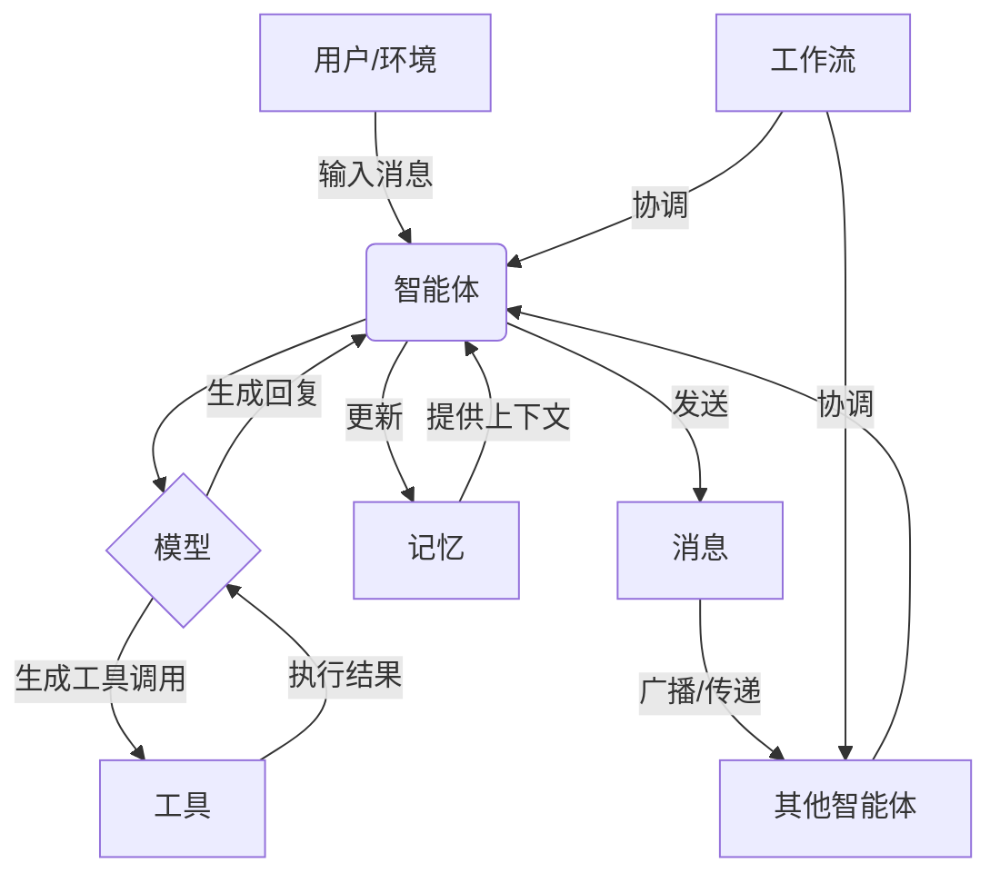

# 核心概念

<cite>
**本文档中引用的文件**   
- [__init__.py](file://src\agentscope\__init__.py)
- [_agent_base.py](file://src\agentscope\agent\_agent_base.py)
- [_model_base.py](file://src\agentscope\model\_model_base.py)
- [_toolkit.py](file://src\agentscope\tool\_toolkit.py)
- [_memory_base.py](file://src\agentscope\memory\_memory_base.py)
- [_message_base.py](file://src\agentscope\message\_message_base.py)
- [_class.py](file://src\agentscope\pipeline\_class.py)
- [_state_module.py](file://src\agentscope\module\_state_module.py)
- [_message_block.py](file://src\agentscope\message\_message_block.py)
- [main.py](file://examples\workflows\multiagent_conversation\main.py)
- [main.py](file://examples\functionality\agent_skill\main.py)
</cite>

## 目录
1. [引言](#引言)
2. [智能体（Agent）](#智能体agent)
3. [模型（Model）](#模型model)
4. [工具（Tool）](#工具tool)
5. [记忆（Memory）](#记忆memory)
6. [消息（Message）](#消息message)
7. [工作流（Pipeline）](#工作流pipeline)
8. [核心抽象之间的关系](#核心抽象之间的关系)
9. [总结](#总结)

## 引言

AgentScope 是一个用于构建多智能体系统的开发框架，其核心设计理念是通过一组清晰、解耦的抽象来简化复杂智能体应用的开发。本文档将深入探讨框架中的六大核心抽象：智能体（Agent）、模型（Model）、工具（Tool）、记忆（Memory）、消息（Message）和工作流（Pipeline）。这些抽象共同构成了一个完整的多智能体应用开发环境，它们各自承担特定的角色，并通过明确定义的接口进行交互。我们将详细解释每个概念的定义、设计原理、生命周期和交互模式，并通过现实世界的应用类比帮助初学者理解，同时为高级用户提供性能特征和扩展可能性的洞察。

## 智能体（Agent）

智能体是 AgentScope 框架中最核心的执行单元，它代表一个能够感知环境、做出决策并采取行动的自主实体。在框架中，`AgentBase` 类是所有智能体的基类，它定义了智能体的基本行为和接口。

### 角色与设计原理
智能体的角色是作为应用的“大脑”和“行动者”。它接收来自环境（通常是其他智能体或用户）的消息，利用其内部的模型和工具进行思考和决策，然后生成回复消息或执行具体操作。其设计遵循异步编程模式，确保在等待模型响应或工具执行时不会阻塞整个系统。`AgentBase` 类通过 `observe()` 方法接收消息，通过 `reply()` 方法生成回复，这两个核心方法都是异步的。

### 生命周期与交互模式
一个智能体的生命周期始于其被实例化。在初始化时，它会获得一个唯一的 ID，并设置好其内部状态。其主要的交互模式是通过消息驱动的：当接收到消息时，`observe()` 方法被调用以更新其内部状态；随后，`reply()` 方法被触发，该方法会调用底层的 `Model` 来生成回复内容。智能体还可以通过 `print()` 方法将消息输出到控制台或流式传输。此外，框架支持通过 `MsgHub` 将多个智能体组织成一个通信网络，实现智能体间的广播和订阅。

### 现实世界类比
可以将智能体类比为一个“专家顾问”。例如，在一个客服系统中，一个智能体就像一位客服专员，它接收客户的咨询（消息），查阅知识库（记忆）和使用内部系统（工具），然后根据公司的服务准则（模型）形成回复并发送给客户。

### 性能与扩展
智能体的性能主要受其底层模型的响应速度和所调用工具的执行效率影响。框架通过异步机制和消息队列（`msg_queue`）支持流式输出，可以有效提升用户体验。通过 `register_instance_hook` 和 `register_class_hook` 方法，用户可以为智能体添加预处理和后处理的钩子函数，从而轻松扩展其功能，例如添加日志记录、性能监控或自定义的错误处理逻辑。

**本节来源**
- [src\agentscope\agent\_agent_base.py](file://src\agentscope\agent\_agent_base.py#L30-L733)
- [src\agentscope\module\_state_module.py](file://src\agentscope\module\_state_module.py#L20-L152)

## 模型（Model）

模型是智能体的“思维引擎”，负责处理自然语言、生成文本和进行推理。在 AgentScope 中，模型通常指代大型语言模型（LLM）的 API 接口。

### 角色与设计原理
模型的核心角色是为智能体提供生成式 AI 能力。`ChatModelBase` 是所有模型类的抽象基类，它定义了模型必须实现的 `__call__()` 方法。该方法接收一个消息列表（对话历史）作为输入，并返回一个 `ChatResponse` 对象或一个响应流。设计上，模型是无状态的，它只负责根据输入生成输出，而状态管理则由智能体和记忆组件负责。

### 生命周期与交互模式
模型的生命周期与其所在的智能体实例紧密相关。当智能体被创建时，会传入一个具体的模型实例（如 `DashScopeChatModel` 或 `OpenAIChatModel`）。在智能体的 `reply()` 方法中，会将当前的对话历史和系统提示组装成一个请求，然后调用模型的 `__call__()` 方法。模型的响应随后被解析并用于构建智能体的回复消息。模型的 `stream` 属性决定了输出是流式还是非流式。

### 现实世界类比
模型可以类比为智能体的“大脑皮层”。就像人脑负责处理感官信息并产生思想一样，模型负责处理输入的文本信息并生成语言输出。不同的模型（如 GPT、Qwen）就像是不同的人，拥有不同的知识背景和表达风格。

### 性能与扩展
模型的性能是整个系统的关键瓶颈，主要体现在 API 调用的延迟和成本上。流式输出可以改善感知延迟。框架通过统一的基类设计，使得用户可以轻松地在不同模型提供商之间切换，而无需修改智能体的业务逻辑，这极大地增强了系统的可扩展性和灵活性。

**本节来源**
- [src\agentscope\model\_model_base.py](file://src\agentscope\model\_model_base.py#L13-L78)
- [examples\workflows\multiagent_conversation\main.py](file://examples\workflows\multiagent_conversation\main.py#L27-L31)

## 工具（Tool）

工具是智能体与外部世界交互的“手和脚”，使智能体能够执行模型本身无法完成的任务，如调用 API、执行代码或读写文件。

### 角色与设计原理
工具的角色是扩展智能体的能力边界。`Toolkit` 类是工具管理的核心，它负责注册、组织和调用工具函数。一个工具函数可以是任何 Python 函数，但必须返回一个 `ToolResponse` 对象。`Toolkit` 会自动解析工具函数的签名和文档字符串，生成符合 LLM 调用规范的 JSON Schema。这使得 LLM 能够理解如何调用这些工具。

### 生命周期与交互模式
工具的生命周期由 `Toolkit` 管理。用户通过 `register_tool_function()` 方法将函数注册到工具包中。当智能体的模型决定调用一个工具时，它会生成一个包含工具名称和参数的 `ToolUseBlock`。这个块被传递给 `Toolkit` 的 `call_tool_function()` 方法，该方法查找并执行对应的函数，然后将结果包装成 `ToolResultBlock` 返回给模型，模型再将其整合到对话中。

### 现实世界类比
工具可以类比为智能体的“工具箱”。就像一个木匠拥有锤子、锯子等工具来完成不同的任务一样，一个智能体也可以拥有搜索、计算、绘图等多种工具来增强其能力。

### 性能与扩展
工具的性能取决于其具体实现。`Toolkit` 支持将工具分组（`create_tool_group`）并动态激活/停用（`update_tool_groups`），这可以有效控制传递给 LLM 的工具数量，避免“工具过载”问题，从而提升决策效率。此外，框架支持 MCP（Model Calling Protocol）客户端，可以方便地集成外部工具服务。

**本节来源**
- [src\agentscope\tool\_toolkit.py](file://src\agentscope\tool\_toolkit.py#L55-L800)
- [examples\functionality\agent_skill\main.py](file://examples\functionality\agent_skill\main.py#L25-L27)

## 记忆（Memory）

记忆是智能体的“记忆库”，用于存储和检索对话历史、上下文信息或其他相关数据。

### 角色与设计原理
记忆的角色是为智能体提供长期和短期的上下文感知能力。`MemoryBase` 是所有记忆实现的抽象基类，定义了 `add`、`retrieve`、`delete` 等核心操作。框架提供了 `InMemoryMemory` 作为默认的短期记忆实现，它将消息存储在内存中。对于长期记忆，框架支持与外部系统（如 Mem0）集成。

### 生命周期与交互模式
记忆的生命周期通常与智能体或会话的生命周期一致。当智能体收到或发送一条消息时，该消息会被自动添加到其记忆中。在生成回复时，智能体可以从记忆中检索相关的上下文信息，并将其作为输入的一部分传递给模型。`MsgHub` 也利用记忆来维护参与智能体之间的共享上下文。

### 现实世界类比
记忆可以类比为智能体的“笔记本”或“大脑记忆”。短期记忆就像一页纸，记录最近的对话；长期记忆则像一个档案柜，可以存储和查找过去的所有重要信息。

### 性能与扩展
内存记忆的性能很高，但数据在程序结束后会丢失。长期记忆的性能取决于后端存储系统的性能。通过实现 `MemoryBase` 接口，用户可以轻松地将记忆系统扩展到数据库、向量存储或其他持久化存储中，以满足不同应用的需求。

**本节来源**
- [src\agentscope\memory\_memory_base.py](file://src\agentscope\memory\_memory_base.py#L11-L45)
- [examples\functionality\agent_skill\main.py](file://examples\functionality\agent_skill\main.py#L49)

## 消息（Message）

消息是智能体之间以及智能体与环境之间通信的“语言”和“信使”。

### 角色与设计原理
消息的核心角色是承载信息。`Msg` 类是消息的载体，它包含发送者名称（`name`）、角色（`role`，如 user, assistant）、内容（`content`）和元数据（`metadata`）。内容可以是纯文本，也可以是多种内容块（`ContentBlock`）的组合，如文本、工具调用、图像、音频等，这使得消息具有高度的灵活性和表现力。

### 生命周期与交互模式
消息的生命周期从被创建开始，通过 `observe()` 方法被智能体接收，可能被添加到记忆中，经过处理后生成新的回复消息，最终被输出或传递给下一个智能体。消息是驱动整个系统工作流的基本单元。

### 现实世界类比
消息可以类比为“信件”或“对话中的每一句话”。就像人们通过语言交流一样，智能体通过发送和接收消息来协作完成任务。

### 性能与扩展
消息的设计是轻量级的，序列化和反序列化效率高。通过 `ContentBlock` 的扩展，消息可以轻松支持多模态内容，为构建更丰富的交互体验提供了基础。

**本节来源**
- [src\agentscope\message\_message_base.py](file://src\agentscope\message\_message_base.py#L21-L242)
- [src\agentscope\message\_message_block.py](file://src\agentscope\message\_message_block.py#L1-L127)

## 工作流（Pipeline）

工作流是协调多个智能体执行任务的“指挥官”和“调度器”。

### 角色与设计原理
工作流的角色是定义和执行智能体的协作模式。`SequentialPipeline` 和 `FanoutPipeline` 是两种预定义的工作流。`SequentialPipeline` 按顺序执行智能体列表，前一个智能体的输出作为后一个的输入。`FanoutPipeline` 则将同一输入分发给多个智能体并行处理。

### 生命周期与交互模式
工作流的生命周期由用户代码控制。用户创建一个工作流实例，传入智能体列表，然后调用它来启动执行。工作流通过调用智能体的 `__call__()` 方法来驱动其执行，并管理整个流程的控制流。

### 现实世界类比
工作流可以类比为“工作流程”或“剧本”。例如，一个客服流程可能规定：先由接待员（智能体A）接待，然后转给技术专家（智能体B），最后由经理（智能体C）确认，这正是一个顺序工作流。

### 性能与扩展
工作流通过 `asyncio.gather()` 支持并发执行，可以显著提高处理效率。用户可以通过编写自定义的异步函数来实现更复杂的工作流逻辑，如条件分支、循环和错误重试。

**本节来源**
- [src\agentscope\pipeline\_class.py](file://src\agentscope\pipeline\_class.py#L10-L91)
- [examples\workflows\multiagent_conversation\main.py](file://examples\workflows\multiagent_conversation\main.py#L58)

## 核心抽象之间的关系

这六大核心抽象通过清晰的接口相互协作，共同构成一个完整的多智能体系统。其数据流和控制流可以概括如下：

**图示来源**
- [src\agentscope\agent\_agent_base.py](file://src\agentscope\agent\_agent_base.py)
- [src\agentscope\model\_model_base.py](file://src\agentscope\model\_model_base.py)
- [src\agentscope\tool\_toolkit.py](file://src\agentscope\tool\_toolkit.py)
- [src\agentscope\memory\_memory_base.py](file://src\agentscope\memory\_memory_base.py)
- [src\agentscope\message\_message_base.py](file://src\agentscope\message\_message_base.py)
- [src\agentscope\pipeline\_class.py](file://src\agentscope\pipeline\_class.py)

1.  **启动**：一个外部事件（如用户输入）产生一条消息。
2.  **感知与决策**：该消息被一个智能体接收，智能体的 `observe()` 方法被调用。智能体随后调用其 `reply()` 方法。
3.  **思考**：`reply()` 方法将当前对话历史（从记忆中检索）和系统提示发送给其关联的 **模型**。
4.  **行动**：如果模型决定调用工具，它会生成一个 `ToolUseBlock`。智能体通过其 **工具包** 执行该工具调用，并将结果（`ToolResultBlock`）返回给模型。
5.  **生成回复**：模型结合工具结果生成最终的回复内容，智能体将其封装成一条新的 **消息**。
6.  **记忆与通信**：新消息被添加到 **记忆** 中，并通过 `print()` 方法输出或传递给其他智能体。
7.  **协调**：**工作流** 负责按预定的顺序或模式（如顺序、并行）调用多个智能体的 `__call__()` 方法，从而实现复杂的多智能体协作。

## 总结

AgentScope 框架通过智能体、模型、工具、记忆、消息和工作流这六大核心抽象，为构建多智能体应用提供了一个模块化、可扩展且易于理解的开发环境。每个抽象都职责单一，接口清晰，使得开发者可以像搭积木一样组合它们来构建复杂的应用。智能体作为执行主体，模型提供认知能力，工具扩展行动能力，记忆保存上下文，消息实现通信，工作流协调协作。这种分层和解耦的设计不仅降低了开发复杂性，也为性能优化和功能扩展提供了坚实的基础。通过深入理解这些核心概念及其相互关系，开发者可以更有效地利用 AgentScope 框架来实现创新的多智能体解决方案。