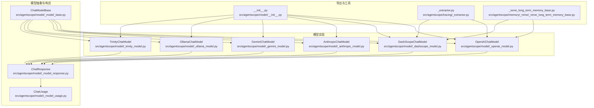
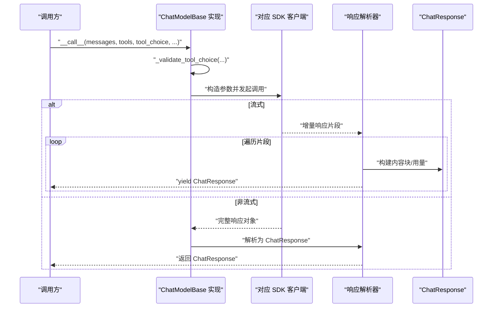
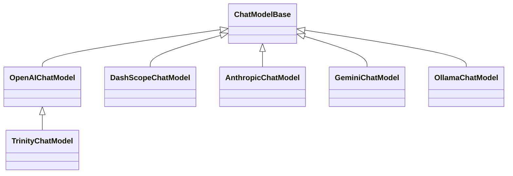

# 模型

<cite>
**本文引用的文件**
- [src/agentscope/model/_model_base.py](file://src/agentscope/model/_model_base.py)
- [src/agentscope/model/_openai_model.py](file://src/agentscope/model/_openai_model.py)
- [src/agentscope/model/_dashscope_model.py](file://src/agentscope/model/_dashscope_model.py)
- [src/agentscope/model/_anthropic_model.py](file://src/agentscope/model/_anthropic_model.py)
- [src/agentscope/model/_gemini_model.py](file://src/agentscope/model/_gemini_model.py)
- [src/agentscope/model/_ollama_model.py](file://src/agentscope/model/_ollama_model.py)
- [src/agentscope/model/_trinity_model.py](file://src/agentscope/model/_trinity_model.py)
- [src/agentscope/model/_model_response.py](file://src/agentscope/model/_model_response.py)
- [src/agentscope/model/_model_usage.py](file://src/agentscope/model/_model_usage.py)
- [src/agentscope/model/__init__.py](file://src/agentscope/model/__init__.py)
- [src/agentscope/tracing/_extractor.py](file://src/agentscope/tracing/_extractor.py)
- [src/agentscope/memory/_reme/_reme_long_term_memory_base.py](file://src/agentscope/memory/_reme/_reme_long_term_memory_base.py)
- [tests/model_openai_test.py](file://tests/model_openai_test.py)
- [tests/model_dashscope_test.py](file://tests/model_dashscope_test.py)
- [docs/tutorial/en/src/task_model.py](file://docs/tutorial/en/src/task_model.py)
</cite>

## 目录
1. [简介](#简介)
2. [项目结构](#项目结构)
3. [核心组件](#核心组件)
4. [架构总览](#架构总览)
5. [详细组件分析](#详细组件分析)
6. [依赖关系分析](#依赖关系分析)
7. [性能与特性](#性能与特性)
8. [故障排查指南](#故障排查指南)
9. [结论](#结论)
10. [附录](#附录)

## 简介
本章节系统性阐述 agentscope 框架中“模型（Model）”的概念与实现，重点围绕以下目标：
- 统一不同大语言模型提供商的接口差异，形成一致的调用体验与响应结构；
- 解析模型抽象层设计目的与职责边界；
- 详解模型基类如何封装请求处理、响应解析与使用统计；
- 说明模型配置机制（API 密钥、基础 URL、模型名称等）；
- 对比 OpenAI、DashScope、Anthropic、Gemini、Ollama 等实现，展示多提供商无缝切换；
- 分析模型调用的性能特征（超时、重试、流式响应等），并解释响应对象结构与使用方法。

## 项目结构
模型子系统位于 src/agentscope/model 目录，包含抽象基类、各提供商实现、响应与用量数据结构，以及导出入口。下图给出关键文件与模块关系概览。

图表来源
- [src/agentscope/model/_model_base.py](file://src/agentscope/model/_model_base.py#L1-L78)
- [src/agentscope/model/_openai_model.py](file://src/agentscope/model/_openai_model.py#L66-L140)
- [src/agentscope/model/_dashscope_model.py](file://src/agentscope/model/_dashscope_model.py#L47-L103)
- [src/agentscope/model/_anthropic_model.py](file://src/agentscope/model/_anthropic_model.py#L38-L125)
- [src/agentscope/model/_gemini_model.py](file://src/agentscope/model/_gemini_model.py#L33-L118)
- [src/agentscope/model/_ollama_model.py](file://src/agentscope/model/_ollama_model.py#L32-L98)
- [src/agentscope/model/_trinity_model.py](file://src/agentscope/model/_trinity_model.py#L17-L64)
- [src/agentscope/model/_model_response.py](file://src/agentscope/model/_model_response.py#L19-L43)
- [src/agentscope/model/_model_usage.py](file://src/agentscope/model/_model_usage.py#L9-L24)
- [src/agentscope/model/__init__.py](file://src/agentscope/model/__init__.py#L1-L22)
- [src/agentscope/tracing/_extractor.py](file://src/agentscope/tracing/_extractor.py#L88-L123)
- [src/agentscope/memory/_reme/_reme_long_term_memory_base.py](file://src/agentscope/memory/_reme/_reme_long_term_memory_base.py#L202-L235)

章节来源
- [src/agentscope/model/__init__.py](file://src/agentscope/model/__init__.py#L1-L22)

## 核心组件
- 抽象基类 ChatModelBase：定义统一的异步调用签名与工具选择校验逻辑，承载 model_name 与 stream 等通用属性。
- 各提供商实现：OpenAI、DashScope、Anthropic、Gemini、Ollama、Trinity（基于 OpenAI 客户端）均继承自 ChatModelBase，负责适配各自 API 的消息格式、工具调用、结构化输出与流式解析。
- 响应与用量：ChatResponse 封装内容块（文本、思考、工具调用、音频等）、唯一标识、创建时间、类型与用量；ChatUsage 记录输入/输出 token 与耗时。

章节来源
- [src/agentscope/model/_model_base.py](file://src/agentscope/model/_model_base.py#L13-L78)
- [src/agentscope/model/_model_response.py](file://src/agentscope/model/_model_response.py#L19-L43)
- [src/agentscope/model/_model_usage.py](file://src/agentscope/model/_model_usage.py#L9-L24)

## 架构总览
下图展示从调用到响应的关键流程：统一的 __call__ 接口、工具选择校验、消息与参数组装、SDK 调用、流式/非流式解析、最终产出 ChatResponse。

图表来源
- [src/agentscope/model/_model_base.py](file://src/agentscope/model/_model_base.py#L46-L78)
- [src/agentscope/model/_openai_model.py](file://src/agentscope/model/_openai_model.py#L147-L281)
- [src/agentscope/model/_dashscope_model.py](file://src/agentscope/model/_dashscope_model.py#L104-L240)
- [src/agentscope/model/_anthropic_model.py](file://src/agentscope/model/_anthropic_model.py#L127-L263)
- [src/agentscope/model/_gemini_model.py](file://src/agentscope/model/_gemini_model.py#L120-L222)
- [src/agentscope/model/_ollama_model.py](file://src/agentscope/model/_ollama_model.py#L100-L171)
- [src/agentscope/model/_model_response.py](file://src/agentscope/model/_model_response.py#L19-L43)

## 详细组件分析

### 抽象基类 ChatModelBase
- 角色与职责
  - 统一模型调用签名：异步 __call__ 返回 ChatResponse 或异步生成器；
  - 工具选择校验：限制 tool_choice 取值范围并验证可用函数名；
  - 通用属性：model_name、stream。
- 关键点
  - 工具选择模式集合与校验逻辑，确保与各提供商能力兼容；
  - 为所有实现提供一致的生命周期与错误处理入口。

章节来源
- [src/agentscope/model/_model_base.py](file://src/agentscope/model/_model_base.py#L13-L78)

### OpenAIChatModel
- 配置机制
  - 支持 api_key、organization、client_kwargs、generate_kwargs、reasoning_effort 等；
  - 兼容 OpenAI 兼容服务：通过 client_kwargs 指定 base_url；
  - 默认 stream=True，可按需关闭。
- 请求与响应
  - 支持工具调用与 tool_choice 格式化；
  - 支持结构化输出（structured_model），自动转换为工具并覆盖工具链路；
  - 流式解析：增量拼接文本、思考、工具调用参数，合并 usage；
  - 非流式解析：提取 choices/message 内容与 usage。
- 特殊处理
  - Qwen-omni 音频数据格式适配；
  - 旧参数 client_args 兼容与警告；
  - structured_model 下禁用流式以满足解析稳定性。

章节来源
- [src/agentscope/model/_openai_model.py](file://src/agentscope/model/_openai_model.py#L66-L140)
- [src/agentscope/model/_openai_model.py](file://src/agentscope/model/_openai_model.py#L147-L281)
- [src/agentscope/model/_openai_model.py](file://src/agentscope/model/_openai_model.py#L282-L580)

### DashScopeChatModel
- 配置机制
  - 必需 api_key，支持 enable_thinking（部分模型）、generate_kwargs；
  - 支持 base_http_api_url 自定义基础地址；
  - 当 enable_thinking=True 且 stream=False 时强制启用流式。
- 请求与响应
  - 统一封装 Generation 与 MultimodalConversation API；
  - 工具调用与 tool_choice 格式化（不支持 required，自动降级为 auto）；
  - 结构化输出通过将 BaseModel 转换为工具并强制 tool_choice；
  - 流式解析：累积思考与文本，拼接工具调用参数，更新 usage；
  - 非流式解析：从 output.choices[0].message 提取内容与工具调用。
- 特殊处理
  - qvq 与 -vl 模型对 content 字段的空值处理；
  - 多模态对话与常规生成的分支调用。

章节来源
- [src/agentscope/model/_dashscope_model.py](file://src/agentscope/model/_dashscope_model.py#L47-L103)
- [src/agentscope/model/_dashscope_model.py](file://src/agentscope/model/_dashscope_model.py#L104-L240)
- [src/agentscope/model/_dashscope_model.py](file://src/agentscope/model/_dashscope_model.py#L242-L532)

### AnthropicChatModel
- 配置机制
  - api_key、max_tokens、stream、thinking、client_kwargs、generate_kwargs；
  - 兼容旧参数 client_args 并发出警告；
  - 未识别参数会记录警告。
- 请求与响应
  - 工具调用与 tool_choice 格式化（required 映射为 any）；
  - 结构化输出通过将 BaseModel 转换为工具并强制 tool_choice；
  - 流式解析：事件驱动，累积文本、思考与工具调用参数，动态更新 usage；
  - 非流式解析：从响应对象提取 content、usage。
- 特殊处理
  - system 消息独立抽取至 system 参数；
  - 严格校验工具 schema 格式。

章节来源
- [src/agentscope/model/_anthropic_model.py](file://src/agentscope/model/_anthropic_model.py#L38-L125)
- [src/agentscope/model/_anthropic_model.py](file://src/agentscope/model/_anthropic_model.py#L127-L263)
- [src/agentscope/model/_anthropic_model.py](file://src/agentscope/model/_anthropic_model.py#L265-L540)

### GeminiChatModel
- 配置机制
  - api_key、stream、thinking_config、client_kwargs、generate_kwargs；
  - 兼容旧参数 client_args 并发出警告；
  - 未识别参数会记录警告。
- 请求与响应
  - 工具调用与 tool_config 格式化（auto/none/required 映射）；
  - 结构化输出通过 response_mime_type 与 response_schema；
  - 流式解析：累积思考与文本，提取 function_calls，计算 usage；
  - 非流式解析：从 candidates/content.parts 与 text、function_calls 提取内容与 usage。
- 特殊处理
  - thinking_config 控制推理过程；
  - 工具 schema 转换为 function_declarations 列表。

章节来源
- [src/agentscope/model/_gemini_model.py](file://src/agentscope/model/_gemini_model.py#L33-L118)
- [src/agentscope/model/_gemini_model.py](file://src/agentscope/model/_gemini_model.py#L120-L222)
- [src/agentscope/model/_gemini_model.py](file://src/agentscope/model/_gemini_model.py#L224-L521)

### OllamaChatModel
- 配置机制
  - model_name、stream、options、keep_alive、enable_thinking、host、client_kwargs、generate_kwargs；
  - 兼容旧参数 client_kwargs 与警告；
  - 未识别参数会记录警告。
- 请求与响应
  - 工具调用与工具 schema 格式化；
  - 结构化输出通过 format 传入 BaseModel 的 JSON Schema；
  - 流式解析：累积 thinking 与文本，拼接工具调用，计算 usage；
  - 非流式解析：从 message.thinking/content/tool_calls 提取内容与 usage。
- 特殊处理
  - Ollama 不支持 tool_choice，会忽略该参数并记录警告；
  - usage 来源于 prompt_eval_count 与 eval_count。

章节来源
- [src/agentscope/model/_ollama_model.py](file://src/agentscope/model/_ollama_model.py#L32-L98)
- [src/agentscope/model/_ollama_model.py](file://src/agentscope/model/_ollama_model.py#L100-L171)
- [src/agentscope/model/_ollama_model.py](file://src/agentscope/model/_ollama_model.py#L173-L353)

### TrinityChatModel
- 设计目的
  - 为 RL 训练场景提供与 OpenAI 兼容的客户端实例，屏蔽底层差异；
  - 固定 stream=False，避免训练场景的流式开销；
  - 可选 enable_thinking 通过 chat_template_kwargs 注入。
- 关键点
  - 从外部传入的 AsyncOpenAI 实例接管 client；
  - 自动读取 model_path 作为 model_name；
  - 若未提供必需属性则抛出异常。

章节来源
- [src/agentscope/model/_trinity_model.py](file://src/agentscope/model/_trinity_model.py#L17-L64)

### 响应对象与用量
- ChatResponse
  - content：内容块序列（文本、思考、工具调用、音频等）；
  - id、created_at、type：唯一标识、创建时间与类型；
  - usage：用量信息；
  - metadata：结构化输出或中间解析结果。
- ChatUsage
  - input_tokens、output_tokens、time、type：输入 token、输出 token、耗时与类型。

章节来源
- [src/agentscope/model/_model_response.py](file://src/agentscope/model/_model_response.py#L19-L43)
- [src/agentscope/model/_model_usage.py](file://src/agentscope/model/_model_usage.py#L9-L24)

## 依赖关系分析
- 继承关系
  - OpenAI、DashScope、Anthropic、Gemini、Ollama、Trinity 均继承自 ChatModelBase；
  - Trinity 进一步继承 OpenAIChatModel，复用其结构化输出与工具链路。
- 导出与工具
  - model/__init__.py 统一导出各模型类；
  - tracing/_extractor.py 依据实例类名与 OpenAI base_url 识别提供商；
  - memory/_reme/_reme_long_term_memory_base.py 从模型实例提取 API 基础地址与密钥。

图表来源
- [src/agentscope/model/_model_base.py](file://src/agentscope/model/_model_base.py#L13-L78)
- [src/agentscope/model/_openai_model.py](file://src/agentscope/model/_openai_model.py#L66-L140)
- [src/agentscope/model/_dashscope_model.py](file://src/agentscope/model/_dashscope_model.py#L47-L103)
- [src/agentscope/model/_anthropic_model.py](file://src/agentscope/model/_anthropic_model.py#L38-L125)
- [src/agentscope/model/_gemini_model.py](file://src/agentscope/model/_gemini_model.py#L33-L118)
- [src/agentscope/model/_ollama_model.py](file://src/agentscope/model/_ollama_model.py#L32-L98)
- [src/agentscope/model/_trinity_model.py](file://src/agentscope/model/_trinity_model.py#L17-L64)

章节来源
- [src/agentscope/model/__init__.py](file://src/agentscope/model/__init__.py#L1-L22)
- [src/agentscope/tracing/_extractor.py](file://src/agentscope/tracing/_extractor.py#L88-L123)
- [src/agentscope/memory/_reme/_reme_long_term_memory_base.py](file://src/agentscope/memory/_reme/_reme_long_term_memory_base.py#L202-L235)

## 性能与特性
- 超时与重试
  - OpenAI/DashScope/Gemini/Ollama 实现均通过各自 SDK 的 client_kwargs/generate_kwargs 传递超时与连接参数；未见内置重试逻辑，建议在上层业务或 SDK 层面配置。
- 流式响应
  - 多数实现支持流式输出，逐片解析并增量产出 ChatResponse，适合长文本与实时交互；
  - 结构化输出在流式场景下需要谨慎处理分片完整性与 JSON 修复。
- 使用统计
  - ChatUsage 统一记录 input_tokens、output_tokens 与 time，便于成本与性能监控；
  - 不同提供商的 usage 字段来源不同（如 OpenAI 的 usage、DashScope 的 input_tokens/output_tokens、Gemini 的 usage_metadata、Ollama 的 prompt_eval_count/eval_count）。
- 结构化输出
  - OpenAI：response_format + parse；
  - DashScope：将 BaseModel 转换为工具并强制 tool_choice；
  - Gemini：response_mime_type + response_schema；
  - Anthropic：将 BaseModel 转换为工具并强制 tool_choice；
  - Ollama：format 传入 JSON Schema；
  - Trinity：复用 OpenAI 的结构化输出路径。
- OpenAI 兼容服务
  - 通过 client_kwargs 指定 base_url 即可接入 vLLM、DeepSeek 等兼容 OpenAI 的服务。

章节来源
- [src/agentscope/model/_openai_model.py](file://src/agentscope/model/_openai_model.py#L81-L143)
- [src/agentscope/model/_dashscope_model.py](file://src/agentscope/model/_dashscope_model.py#L51-L103)
- [src/agentscope/model/_gemini_model.py](file://src/agentscope/model/_gemini_model.py#L36-L118)
- [src/agentscope/model/_ollama_model.py](file://src/agentscope/model/_ollama_model.py#L35-L98)
- [src/agentscope/model/_trinity_model.py](file://src/agentscope/model/_trinity_model.py#L17-L64)
- [docs/tutorial/en/src/task_model.py](file://docs/tutorial/en/src/task_model.py#L58-L83)

## 故障排查指南
- 工具选择无效
  - 现象：tool_choice 抛出异常或被拒绝；
  - 排查：确认工具列表与 tool_choice 是否匹配；DashScope 不支持 required，会被降级为 auto；Anthropic required 会被映射为 any。
- 结构化输出异常
  - 现象：JSON 解析失败或输出不符合预期；
  - 排查：检查 structured_model 的 JSON Schema 与各提供商的格式要求；OpenAI 在非流式下更稳定；DashScope/Gemini/Anthropic 需要将 BaseModel 转换为工具或 schema。
- 流式解析中断
  - 现象：流式响应中途无输出或延迟高；
  - 排查：确认网络与 SDK 超时设置；检查各提供商的流式协议差异；必要时关闭流式以定位问题。
- OpenAI 兼容服务识别
  - 现象：Trace/日志显示提供商识别为 OpenAI；
  - 排查：tracing/_extractor.py 会根据 OpenAI 客户端 base_url 识别 DeepSeek 等兼容服务，确保 client_kwargs 中设置了正确的 base_url。
- 凭据与基础地址
  - DashScope：必须提供 api_key；可通过 base_http_api_url 指定基础地址；
  - OpenAI：优先使用 client_kwargs 中的 api_key/base_url；也可通过环境变量；
  - Gemini：必须提供 api_key；注意 thinking_config 的可用模型范围；
  - Ollama：可指定 host 与 keep_alive；不支持 tool_choice。

章节来源
- [src/agentscope/model/_model_base.py](file://src/agentscope/model/_model_base.py#L46-L78)
- [src/agentscope/model/_dashscope_model.py](file://src/agentscope/model/_dashscope_model.py#L179-L213)
- [src/agentscope/model/_anthropic_model.py](file://src/agentscope/model/_anthropic_model.py#L210-L236)
- [src/agentscope/tracing/_extractor.py](file://src/agentscope/tracing/_extractor.py#L88-L123)
- [src/agentscope/memory/_reme/_reme_long_term_memory_base.py](file://src/agentscope/memory/_reme/_reme_long_term_memory_base.py#L202-L235)

## 结论
agentscope 的模型抽象层通过 ChatModelBase 统一了多提供商的调用接口，结合各实现对工具调用、结构化输出与流式解析的差异化适配，实现了“一处声明、多处运行”的能力。开发者只需关注 messages、tools、tool_choice 与 generate_kwargs 等通用参数，即可在 OpenAI、DashScope、Anthropic、Gemini、Ollama 与 Trinity 之间无缝切换。配合 ChatResponse/ChatUsage 的标准化输出，能够轻松完成成本与性能的度量与优化。

## 附录
- 使用示例与最佳实践
  - OpenAI 兼容服务：通过 client_kwargs 指定 base_url；
  - 预设行为参数：通过 generate_kwargs 预置温度、最大长度等；
  - 结构化输出：优先选择 OpenAI/Gemini 的原生结构化输出能力，DashScope/Anthropic 需要转换为工具；
  - 流式与非流式：长文本与实时交互建议使用流式；结构化输出在非流式下更稳定；
  - 凭据管理：优先显式传入 api_key/base_url，避免硬编码与环境变量泄漏风险。

章节来源
- [tests/model_openai_test.py](file://tests/model_openai_test.py#L22-L57)
- [tests/model_openai_test.py](file://tests/model_openai_test.py#L59-L90)
- [tests/model_dashscope_test.py](file://tests/model_dashscope_test.py#L33-L72)
- [tests/model_dashscope_test.py](file://tests/model_dashscope_test.py#L73-L100)
- [docs/tutorial/en/src/task_model.py](file://docs/tutorial/en/src/task_model.py#L58-L83)