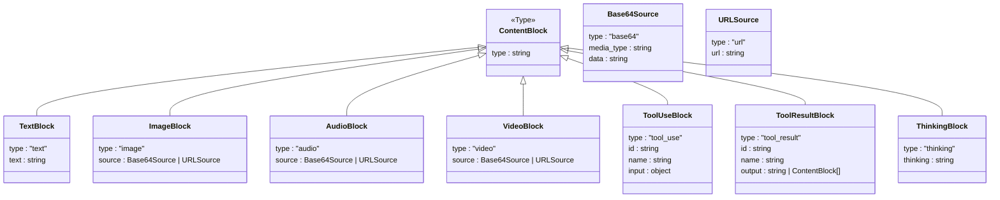
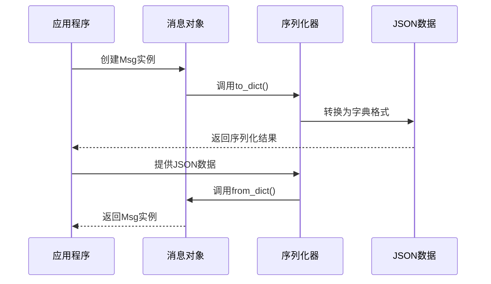
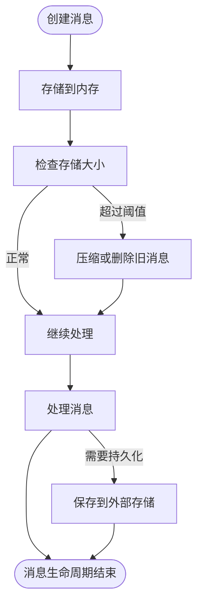

# 消息

<cite>
**本文档中引用的文件**  
- [__init__.py](file://src/agentscope/message/__init__.py)
- [_message_base.py](file://src/agentscope/message/_message_base.py)
- [_message_block.py](file://src/agentscope/message/_message_block.py)
- [quickstart_message.py](file://docs/tutorial/zh_CN/src/quickstart_message.py)
- [_utils.py](file://src/agentscope/tracing/_utils.py)
- [_memory_storage.py](file://examples/functionality/memory/memory_with_compression/_memory_storage.py)
- [browser_agent.py](file://examples/agent/browser_agent/browser_agent.py)
</cite>

## 目录
1. [消息对象设计结构](#消息对象设计结构)
2. [多模态消息支持机制](#多模态消息支持机制)
3. [消息序列化与跨系统传输](#消息序列化与跨系统传输)
4. [消息创建与处理示例](#消息创建与处理示例)
5. [消息生命周期管理](#消息生命周期管理)
6. [消息内容验证与安全过滤](#消息内容验证与安全过滤)

## 消息对象设计结构

在AgentScope框架中，消息（Msg）是智能体间通信的核心数据结构。`Msg`类定义了消息的基本属性，包括发送者、接收者、内容块和元数据等核心字段。

消息对象包含以下核心属性：
- **name**：消息发送者的名称或身份标识
- **role**：发送者的角色，必须是"system"、"assistant"或"user"之一
- **content**：消息内容，可以是字符串或内容块（ContentBlock）的列表
- **metadata**：附加的元数据字典，用于存储结构化输出等信息
- **id**：消息的唯一标识符，使用shortuuid生成
- **timestamp**：消息创建的时间戳
- **invocation_id**：相关的API调用ID，用于跟踪消息上下文

消息对象还包含自动生成的`id`字段和自动设置的`timestamp`字段。`invocation_id`字段对于在API调用上下文中跟踪消息特别有用。

**Section sources**
- [src/agentscope/message/_message_base.py](file://src/agentscope/message/_message_base.py#L24-L73)

## 多模态消息支持机制

AgentScope通过内容块（ContentBlock）机制实现多模态消息支持，允许在单个消息中包含不同类型的数据。这种设计支持丰富的交互体验，包括文本、图像、音频、视频和工具调用等多种内容类型。

主要的内容块类型包括：
- **TextBlock**：纯文本数据
- **ImageBlock**：图像数据，支持URL或Base64编码
- **AudioBlock**：音频数据，支持URL或Base64编码
- **VideoBlock**：视频数据，支持URL或Base64编码
- **ToolUseBlock**：工具调用请求
- **ToolResultBlock**：工具调用结果
- **ThinkingBlock**：模型的思考过程

对于图像、音频和视频块，框架支持两种数据源：URLSource和Base64Source。URLSource用于引用外部资源，而Base64Source用于嵌入编码后的数据。这种设计既支持外部资源引用，也支持数据内嵌，提供了灵活的内容表示方式。



**Diagram sources**
- [src/agentscope/message/_message_block.py](file://src/agentscope/message/_message_block.py#L9-L126)

**Section sources**
- [src/agentscope/message/_message_block.py](file://src/agentscope/message/_message_block.py#L9-L126)

## 消息序列化与跨系统传输

消息对象提供了完整的序列化和反序列化支持，确保消息可以在不同系统间可靠传输。`to_dict()`方法将消息对象转换为JSON兼容的字典格式，而`from_dict()`类方法则可以从JSON数据重建消息对象。

序列化过程包括所有核心字段：id、name、role、content、metadata和timestamp。这种标准化的序列化格式确保了跨平台兼容性，使得消息可以在不同的运行环境和存储系统之间无缝传输。

对于非JSON可序列化的对象，框架提供了`_to_serializable`辅助函数，能够将各种Python对象转换为JSON兼容的格式。该函数处理包括日期时间、枚举、Pydantic模型、数据类等多种类型，确保复杂对象也能被正确序列化。



**Diagram sources**
- [src/agentscope/message/_message_base.py](file://src/agentscope/message/_message_base.py#L75-L99)
- [src/agentscope/tracing/_utils.py](file://src/agentscope/tracing/_utils.py#L15-L79)

**Section sources**
- [src/agentscope/message/_message_base.py](file://src/agentscope/message/_message_base.py#L75-L99)

## 消息创建与处理示例

创建消息对象非常直观，可以通过`Msg`类的构造函数完成。消息可以包含纯文本内容，也可以包含多种内容块的组合。

对于文本消息，可以直接提供字符串作为内容：
```python
msg = Msg(name="Jarvis", role="assistant", content="你好！我能怎么帮助你？")
```

对于多模态消息，可以创建包含多种内容块的列表：
```python
msg = Msg(
    name="Jarvis",
    role="assistant",
    content=[
        TextBlock(type="text", text="这是一个包含图像的多模态消息。"),
        ImageBlock(
            type="image",
            source=URLSource(
                type="url",
                url="https://example.com/image.jpg"
            )
        )
    ]
)
```

消息对象提供了多个实用方法来处理内容：
- `get_text_content()`：提取所有文本块并连接成单个字符串
- `get_content_blocks()`：获取指定类型的内容块列表
- `has_content_blocks()`：检查消息是否包含特定类型的内容块

这些方法简化了消息内容的处理，使得开发者可以轻松地提取和操作特定类型的内容。

**Section sources**
- [docs/tutorial/zh_CN/src/quickstart_message.py](file://docs/tutorial/zh_CN/src/quickstart_message.py#L67-L268)

## 消息生命周期管理

消息的生命周期管理涉及创建、存储、检索和清理等操作。框架通过内存存储机制管理消息的生命周期，确保系统资源的有效利用。

在内存存储中，消息被保存在列表中，并提供了多种操作方法：
- `add()`：向存储中添加消息
- `get()`：检索消息，支持获取最近的n条消息
- `delete()`：根据索引删除指定消息
- `clear()`：清除所有消息
- `size()`：获取存储中的消息数量

内存优化通过选择性删除和压缩机制实现。系统可以配置压缩策略，在消息数量达到阈值时自动压缩或删除旧消息，从而控制内存使用。引用跟踪通过消息的唯一ID实现，确保消息在系统中的引用关系清晰可追溯。

消息存储还支持健康检查和连接管理，确保存储系统的稳定性和可靠性。



**Diagram sources**
- [examples/functionality/memory/memory_with_compression/_memory_storage.py](file://examples/functionality/memory/memory_with_compression/_memory_storage.py#L125-L237)

**Section sources**
- [src/agentscope/memory/_in_memory_memory.py](file://src/agentscope/memory/_in_memory_memory.py#L43-L87)
- [examples/functionality/memory/memory_with_compression/_memory_storage.py](file://examples/functionality/memory/memory_with_compression/_memory_storage.py#L125-L237)

## 消息内容验证与安全过滤

为了防止恶意内容注入，框架提供了多层次的内容验证和安全过滤机制。这些机制确保消息内容的安全性和有效性。

内容验证包括：
- 类型检查：确保内容块的类型正确
- 必需字段验证：检查必需字段是否存在
- 数据格式验证：验证Base64编码、URL格式等
- 大小限制：防止过大的内容块导致性能问题

安全过滤机制在特定场景下应用，例如在浏览器代理中，通过正则表达式过滤掉不必要的JavaScript代码块、控制台消息和YAML内容，只保留有用的信息。这种过滤减少了上下文窗口的占用，提高了处理效率。

此外，元数据字段被设计为不参与LLM提示构建，这提供了一层额外的安全保护，防止敏感信息意外暴露给模型。

最佳实践建议：
- 始终验证输入消息的结构和内容
- 对外部来源的内容进行严格过滤
- 使用元数据字段存储敏感或结构化数据
- 实施适当的内容大小限制
- 定期清理过期的消息以释放内存

**Section sources**
- [examples/agent/browser_agent/browser_agent.py](file://examples/agent/browser_agent/browser_agent.py#L363-L399)