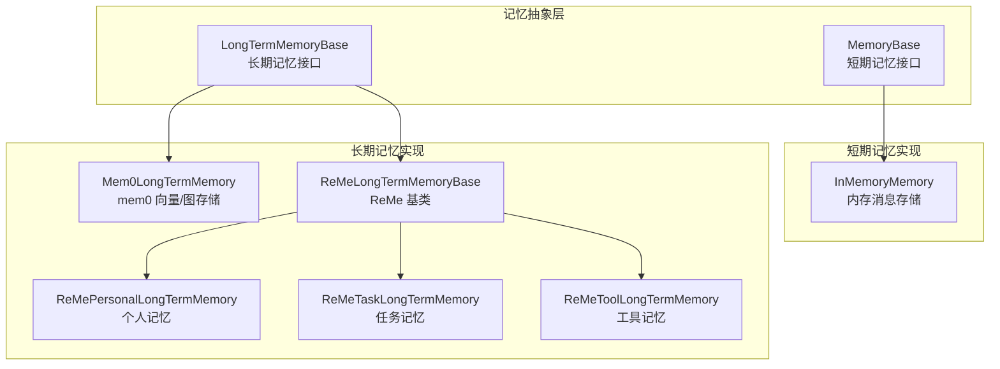
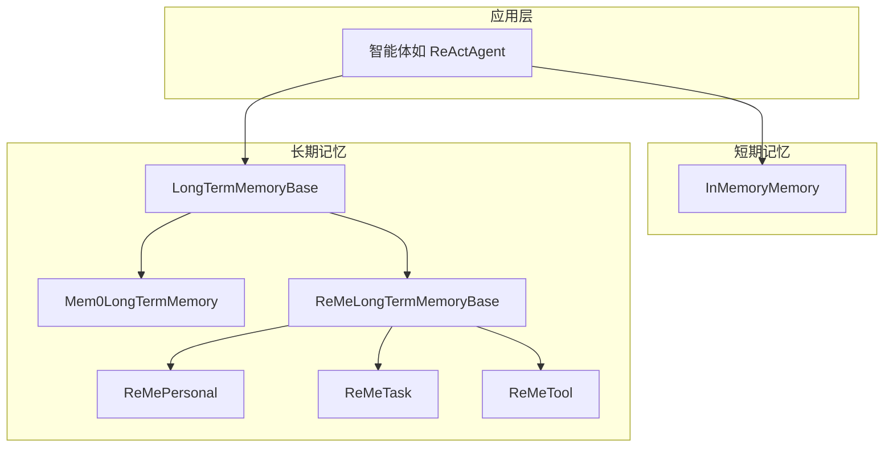
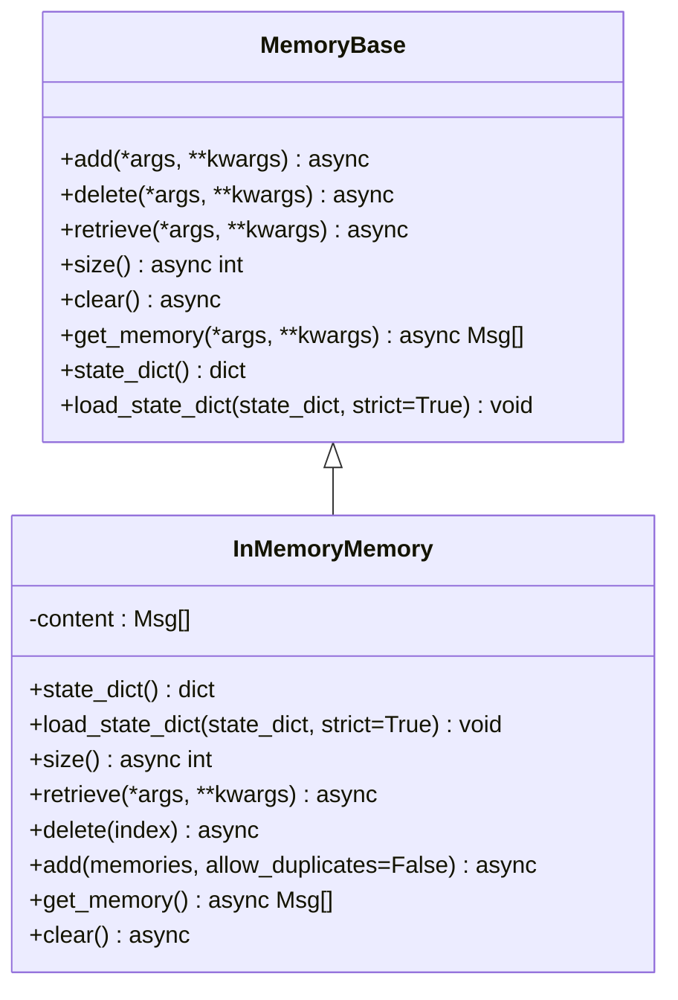
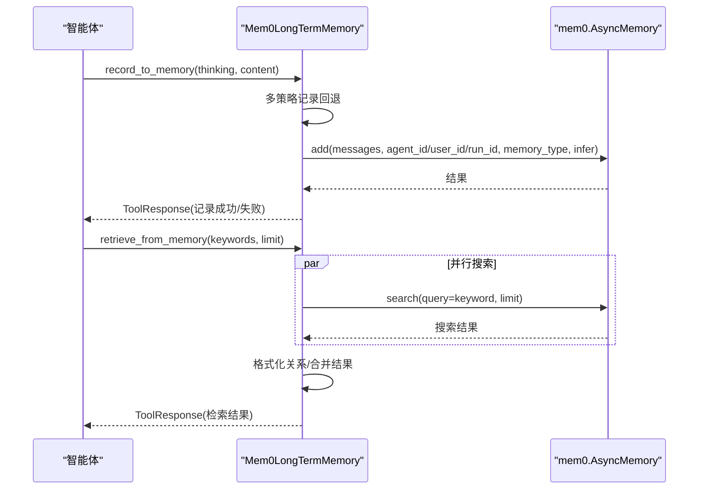
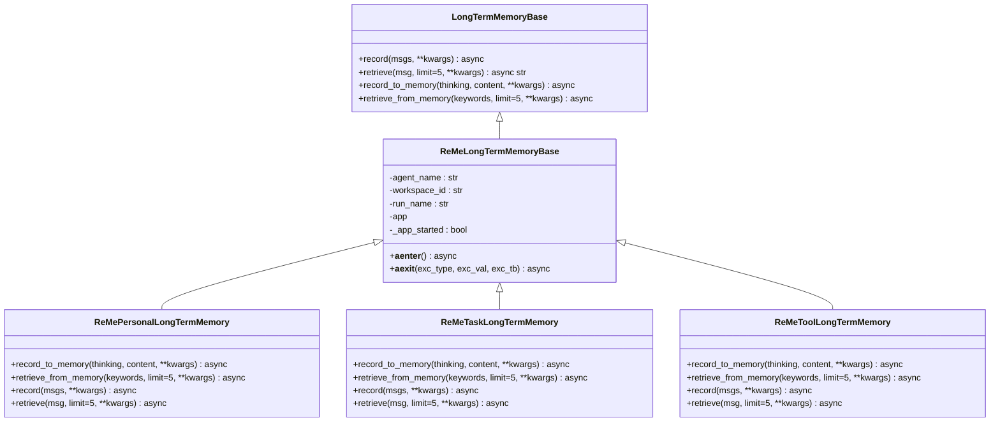
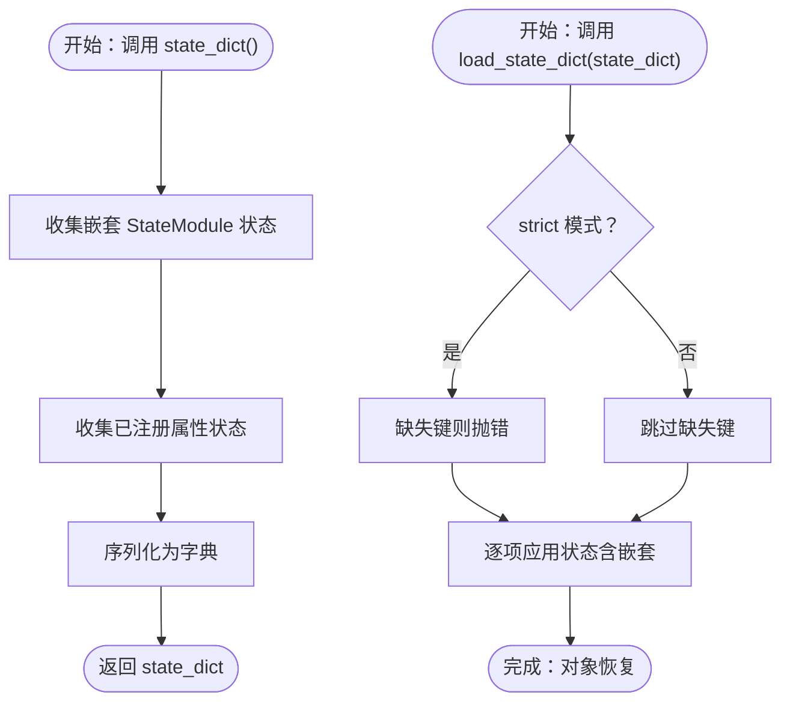
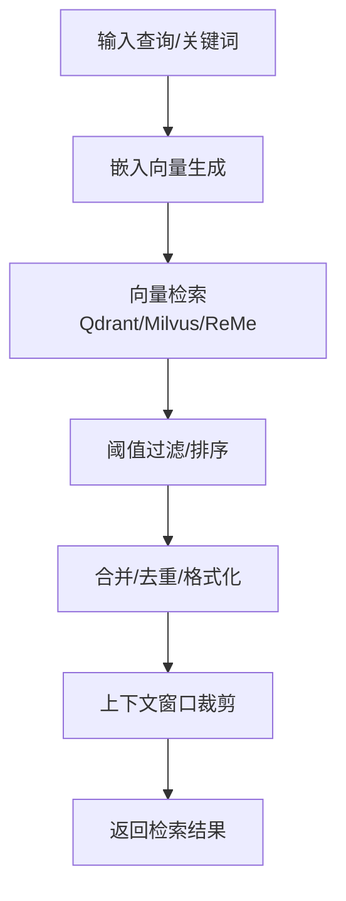
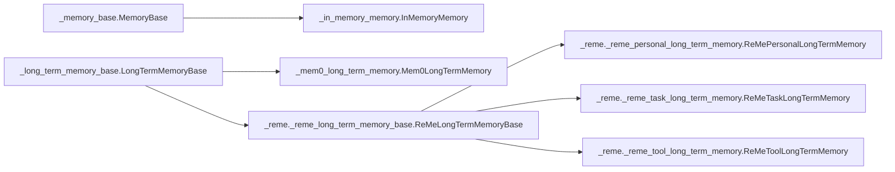

# 记忆

<cite>
**本文引用的文件**
- [src/agentscope/memory/_memory_base.py](file://src/agentscope/memory/_memory_base.py)
- [src/agentscope/memory/_in_memory_memory.py](file://src/agentscope/memory/_in_memory_memory.py)
- [src/agentscope/memory/_long_term_memory_base.py](file://src/agentscope/memory/_long_term_memory_base.py)
- [src/agentscope/memory/_mem0_long_term_memory.py](file://src/agentscope/memory/_mem0_long_term_memory.py)
- [src/agentscope/memory/_reme/_reme_long_term_memory_base.py](file://src/agentscope/memory/_reme/_reme_long_term_memory_base.py)
- [src/agentscope/memory/_reme/_reme_personal_long_term_memory.py](file://src/agentscope/memory/_reme/_reme_personal_long_term_memory.py)
- [src/agentscope/memory/_reme/_reme_task_long_term_memory.py](file://src/agentscope/memory/_reme/_reme_task_long_term_memory.py)
- [src/agentscope/memory/_reme/_reme_tool_long_term_memory.py](file://src/agentscope/memory/_reme/_reme_tool_long_term_memory.py)
- [src/agentscope/memory/__init__.py](file://src/agentscope/memory/__init__.py)
- [src/agentscope/module/_state_module.py](file://src/agentscope/module/_state_module.py)
- [src/agentscope/session/_json_session.py](file://src/agentscope/session/_json_session.py)
- [examples/functionality/long_term_memory/mem0/memory_example.py](file://examples/functionality/long_term_memory/mem0/memory_example.py)
- [examples/functionality/memory/memory_with_compression/main.py](file://examples/functionality/memory/memory_with_compression/main.py)
- [examples/functionality/short_term_memory/reme/short_term_memory_example.py](file://examples/functionality/short_term_memory/reme/short_term_memory_example.py)
</cite>

## 目录
1. [引言](#引言)
2. [项目结构](#项目结构)
3. [核心组件](#核心组件)
4. [架构总览](#架构总览)
5. [详细组件分析](#详细组件分析)
6. [依赖关系分析](#依赖关系分析)
7. [性能与优化](#性能与优化)
8. [故障排查指南](#故障排查指南)
9. [结论](#结论)
10. [附录](#附录)

## 引言
本篇文档围绕 agentscope 框架中的“记忆”（Memory）概念展开，系统性梳理 MemoryBase 抽象接口、短期与长期记忆的分层设计、序列化与持久化机制、检索性能优化（向量相似度搜索与上下文窗口管理），并结合 Mem0 与 ReMe 等外部存储实现，解释不同记忆后端的设计权衡。同时给出多智能体场景下的共享与隔离策略建议，帮助读者在工程实践中高效、安全地构建可扩展的记忆系统。

## 项目结构
agentscope 的记忆模块位于 src/agentscope/memory 下，采用“抽象基类 + 具体实现”的分层组织：
- 抽象层：MemoryBase（短期记忆）、LongTermMemoryBase（长期记忆）
- 内存实现：InMemoryMemory（短期消息存储）
- 外部存储实现：Mem0LongTermMemory（基于 mem0 的向量/图存储）、ReMeLongTermMemoryBase 及其子类（个人记忆、任务记忆、工具记忆）

图表来源
- [src/agentscope/memory/_memory_base.py](file://src/agentscope/memory/_memory_base.py#L1-L45)
- [src/agentscope/memory/_in_memory_memory.py](file://src/agentscope/memory/_in_memory_memory.py#L1-L123)
- [src/agentscope/memory/_long_term_memory_base.py](file://src/agentscope/memory/_long_term_memory_base.py#L1-L95)
- [src/agentscope/memory/_mem0_long_term_memory.py](file://src/agentscope/memory/_mem0_long_term_memory.py#L1-L624)
- [src/agentscope/memory/_reme/_reme_long_term_memory_base.py](file://src/agentscope/memory/_reme/_reme_long_term_memory_base.py#L1-L371)
- [src/agentscope/memory/_reme/_reme_personal_long_term_memory.py](file://src/agentscope/memory/_reme/_reme_personal_long_term_memory.py#L1-L415)
- [src/agentscope/memory/_reme/_reme_task_long_term_memory.py](file://src/agentscope/memory/_reme/_reme_task_long_term_memory.py#L1-L437)
- [src/agentscope/memory/_reme/_reme_tool_long_term_memory.py](file://src/agentscope/memory/_reme/_reme_tool_long_term_memory.py#L1-L546)

章节来源
- [src/agentscope/memory/__init__.py](file://src/agentscope/memory/__init__.py#L1-L23)

## 核心组件
- MemoryBase（短期记忆抽象接口）
  - 定义 add、delete、retrieve、size、clear、get_memory、state_dict、load_state_dict 等统一接口，确保短期记忆具备一致的生命周期与持久化能力。
- InMemoryMemory（短期内存实现）
  - 基于列表存储 Msg 对象，支持去重、批量添加、索引删除、清空与序列化/反序列化。
- LongTermMemoryBase（长期记忆抽象接口）
  - 提供 record、retrieve、record_to_memory、retrieve_from_memory 四个核心方法，既支持开发者直接调用，也支持以工具形式由智能体触发。
- Mem0LongTermMemory（长期记忆：mem0 集成）
  - 通过 mem0 AsyncMemory 实现记录与检索，支持多策略回退记录、关键词检索、关系格式化、向量/图存储配置。
- ReMeLongTermMemoryBase 及其子类（长期记忆：ReMe 集成）
  - ReMePersonalLongTermMemory（个人记忆）、ReMeTaskLongTermMemory（任务记忆）、ReMeToolLongTermMemory（工具记忆）分别面向不同记忆类型，提供异步上下文管理与消息格式转换。

章节来源
- [src/agentscope/memory/_memory_base.py](file://src/agentscope/memory/_memory_base.py#L1-L45)
- [src/agentscope/memory/_in_memory_memory.py](file://src/agentscope/memory/_in_memory_memory.py#L1-L123)
- [src/agentscope/memory/_long_term_memory_base.py](file://src/agentscope/memory/_long_term_memory_base.py#L1-L95)
- [src/agentscope/memory/_mem0_long_term_memory.py](file://src/agentscope/memory/_mem0_long_term_memory.py#L1-L624)
- [src/agentscope/memory/_reme/_reme_long_term_memory_base.py](file://src/agentscope/memory/_reme/_reme_long_term_memory_base.py#L1-L371)
- [src/agentscope/memory/_reme/_reme_personal_long_term_memory.py](file://src/agentscope/memory/_reme/_reme_personal_long_term_memory.py#L1-L415)
- [src/agentscope/memory/_reme/_reme_task_long_term_memory.py](file://src/agentscope/memory/_reme/_reme_task_long_term_memory.py#L1-L437)
- [src/agentscope/memory/_reme/_reme_tool_long_term_memory.py](file://src/agentscope/memory/_reme/_reme_tool_long_term_memory.py#L1-L546)

## 架构总览
下图展示了短期与长期记忆在 agentscope 中的分层与交互关系，以及与外部存储（mem0、ReMe）的对接方式。

图表来源
- [src/agentscope/memory/_in_memory_memory.py](file://src/agentscope/memory/_in_memory_memory.py#L1-L123)
- [src/agentscope/memory/_long_term_memory_base.py](file://src/agentscope/memory/_long_term_memory_base.py#L1-L95)
- [src/agentscope/memory/_mem0_long_term_memory.py](file://src/agentscope/memory/_mem0_long_term_memory.py#L1-L624)
- [src/agentscope/memory/_reme/_reme_long_term_memory_base.py](file://src/agentscope/memory/_reme/_reme_long_term_memory_base.py#L1-L371)
- [src/agentscope/memory/_reme/_reme_personal_long_term_memory.py](file://src/agentscope/memory/_reme/_reme_personal_long_term_memory.py#L1-L415)
- [src/agentscope/memory/_reme/_reme_task_long_term_memory.py](file://src/agentscope/memory/_reme/_reme_task_long_term_memory.py#L1-L437)
- [src/agentscope/memory/_reme/_reme_tool_long_term_memory.py](file://src/agentscope/memory/_reme/_reme_tool_long_term_memory.py#L1-L546)

## 详细组件分析

### MemoryBase 抽象接口与 InMemoryMemory 实现
- 接口职责
  - add：添加消息（支持单条或批量，去重控制）
  - delete：按索引删除（支持单个或多个索引）
  - retrieve：检索（InMemoryMemory 当前未实现）
  - size/clear/get_memory：容量统计、清空、读取全部
  - state_dict/load_state_dict：序列化与反序列化，用于持久化
- InMemoryMemory 特性
  - 使用 Msg 列表存储，支持去重（基于消息 id）
  - load_state_dict 自动从 JSON 字典重建 Msg 对象
  - 适合对话轮次短、无需跨进程/跨会话持久化的短期记忆

图表来源
- [src/agentscope/memory/_memory_base.py](file://src/agentscope/memory/_memory_base.py#L1-L45)
- [src/agentscope/memory/_in_memory_memory.py](file://src/agentscope/memory/_in_memory_memory.py#L1-L123)

章节来源
- [src/agentscope/memory/_memory_base.py](file://src/agentscope/memory/_memory_base.py#L1-L45)
- [src/agentscope/memory/_in_memory_memory.py](file://src/agentscope/memory/_in_memory_memory.py#L1-L123)

### LongTermMemoryBase 抽象接口与 Mem0 集成
- 接口职责
  - record：开发者侧记录（将消息转为语义记忆）
  - retrieve：开发者侧检索（基于消息内容进行语义检索）
  - record_to_memory：工具侧记录（显式记录重要信息）
  - retrieve_from_memory：工具侧检索（基于关键词检索）
- Mem0LongTermMemory 设计要点
  - 支持多策略记录回退（用户角色优先、助手角色回退、禁用推理直记）
  - 检索支持并发查询（关键词并行搜索，聚合结果）
  - 关系数据格式化输出
  - 向量存储默认 Qdrant（可配置磁盘持久化）
  - 与 mem0 的 LLM/Embedder 工厂集成，支持自定义 Provider

图表来源
- [src/agentscope/memory/_mem0_long_term_memory.py](file://src/agentscope/memory/_mem0_long_term_memory.py#L258-L450)
- [src/agentscope/memory/_mem0_long_term_memory.py](file://src/agentscope/memory/_mem0_long_term_memory.py#L451-L624)

章节来源
- [src/agentscope/memory/_long_term_memory_base.py](file://src/agentscope/memory/_long_term_memory_base.py#L1-L95)
- [src/agentscope/memory/_mem0_long_term_memory.py](file://src/agentscope/memory/_mem0_long_term_memory.py#L1-L624)

### ReMe 长期记忆体系（个人/任务/工具）
- ReMeLongTermMemoryBase
  - 通过 async with 管理 ReMeApp 生命周期
  - 提取模型与嵌入参数，注入 ReMe 配置
  - 统一 workspace_id（映射 ReMe 的工作区标识）
- ReMePersonalLongTermMemory
  - 个人偏好/习惯/事实的记忆记录与检索
  - 以 summary_personal_memory/retrieve_personal_memory 流程执行
- ReMeTaskLongTermMemory
  - 任务执行经验与最佳实践的记录与检索
  - 以 summary_task_memory/retrieve_task_memory 流程执行
- ReMeToolLongTermMemory
  - 工具调用结果的记录与使用指南生成
  - 以 add_tool_call_result/summary_tool_memory/retrieve_tool_memory 流程执行

图表来源
- [src/agentscope/memory/_long_term_memory_base.py](file://src/agentscope/memory/_long_term_memory_base.py#L1-L95)
- [src/agentscope/memory/_reme/_reme_long_term_memory_base.py](file://src/agentscope/memory/_reme/_reme_long_term_memory_base.py#L1-L371)
- [src/agentscope/memory/_reme/_reme_personal_long_term_memory.py](file://src/agentscope/memory/_reme/_reme_personal_long_term_memory.py#L1-L415)
- [src/agentscope/memory/_reme/_reme_task_long_term_memory.py](file://src/agentscope/memory/_reme/_reme_task_long_term_memory.py#L1-L437)
- [src/agentscope/memory/_reme/_reme_tool_long_term_memory.py](file://src/agentscope/memory/_reme/_reme_tool_long_term_memory.py#L1-L546)

章节来源
- [src/agentscope/memory/_reme/_reme_long_term_memory_base.py](file://src/agentscope/memory/_reme/_reme_long_term_memory_base.py#L1-L371)
- [src/agentscope/memory/_reme/_reme_personal_long_term_memory.py](file://src/agentscope/memory/_reme/_reme_personal_long_term_memory.py#L1-L415)
- [src/agentscope/memory/_reme/_reme_task_long_term_memory.py](file://src/agentscope/memory/_reme/_reme_task_long_term_memory.py#L1-L437)
- [src/agentscope/memory/_reme/_reme_tool_long_term_memory.py](file://src/agentscope/memory/_reme/_reme_tool_long_term_memory.py#L1-L546)

### 序列化与持久化（state_dict/load_state_dict）
- StateModule 通用机制
  - state_dict：递归收集嵌套 StateModule 与已注册属性的状态
  - load_state_dict：严格/宽松模式加载，支持自定义 JSON 序列化/反序列化
- MemoryBase/MemoryBase 子类
  - InMemoryMemory：将 Msg 序列化为字典列表，反序列化时重建 Msg
  - Mem0/ReMe 实现：通过各自配置与状态字段实现持久化（如向量存储元数据、工作区标识等）
- 会话持久化示例
  - JSON 会话保存/加载：将多个 StateModule 的 state_dict 写入/读取 JSON 文件

图表来源
- [src/agentscope/module/_state_module.py](file://src/agentscope/module/_state_module.py#L49-L108)
- [src/agentscope/memory/_in_memory_memory.py](file://src/agentscope/memory/_in_memory_memory.py#L20-L45)
- [src/agentscope/session/_json_session.py](file://src/agentscope/session/_json_session.py#L53-L117)

章节来源
- [src/agentscope/module/_state_module.py](file://src/agentscope/module/_state_module.py#L49-L108)
- [src/agentscope/memory/_in_memory_memory.py](file://src/agentscope/memory/_in_memory_memory.py#L20-L45)
- [src/agentscope/session/_json_session.py](file://src/agentscope/session/_json_session.py#L53-L117)

### 检索性能优化（向量相似度搜索与上下文窗口）
- 向量相似度搜索
  - Mem0：基于嵌入模型与向量存储（默认 Qdrant）执行相似度检索，支持并发搜索与关系格式化
  - ReMe：通过 ReMeApp 的检索流程返回答案文本
  - RAG 向量库示例：MilvusLiteStore 支持距离阈值过滤、输出字段选择
- 上下文窗口管理
  - MemoryWithCompression：根据 token 数量与触发条件压缩历史，避免上下文溢出
  - ReMeShortTermMemory：通过工作摘要、紧凑比例阈值、最大 token 数等参数控制短期记忆规模

图表来源
- [src/agentscope/memory/_mem0_long_term_memory.py](file://src/agentscope/memory/_mem0_long_term_memory.py#L410-L450)
- [src/agentscope/memory/_reme/_reme_personal_long_term_memory.py](file://src/agentscope/memory/_reme/_reme_personal_long_term_memory.py#L155-L251)
- [src/agentscope/memory/_reme/_reme_task_long_term_memory.py](file://src/agentscope/memory/_reme/_reme_task_long_term_memory.py#L156-L264)
- [src/agentscope/memory/_reme/_reme_tool_long_term_memory.py](file://src/agentscope/memory/_reme/_reme_tool_long_term_memory.py#L175-L277)
- [src/agentscope/rag/_store/_milvuslite_store.py](file://src/agentscope/rag/_store/_milvuslite_store.py#L166-L206)
- [examples/functionality/memory/memory_with_compression/main.py](file://examples/functionality/memory/memory_with_compression/main.py#L1-L84)
- [examples/functionality/short_term_memory/reme/short_term_memory_example.py](file://examples/functionality/short_term_memory/reme/short_term_memory_example.py#L1-L189)

章节来源
- [src/agentscope/memory/_mem0_long_term_memory.py](file://src/agentscope/memory/_mem0_long_term_memory.py#L410-L450)
- [src/agentscope/memory/_reme/_reme_personal_long_term_memory.py](file://src/agentscope/memory/_reme/_reme_personal_long_term_memory.py#L155-L251)
- [src/agentscope/memory/_reme/_reme_task_long_term_memory.py](file://src/agentscope/memory/_reme/_reme_task_long_term_memory.py#L156-L264)
- [src/agentscope/memory/_reme/_reme_tool_long_term_memory.py](file://src/agentscope/memory/_reme/_reme_tool_long_term_memory.py#L175-L277)
- [src/agentscope/rag/_store/_milvuslite_store.py](file://src/agentscope/rag/_store/_milvuslite_store.py#L166-L206)
- [examples/functionality/memory/memory_with_compression/main.py](file://examples/functionality/memory/memory_with_compression/main.py#L1-L84)
- [examples/functionality/short_term_memory/reme/short_term_memory_example.py](file://examples/functionality/short_term_memory/reme/short_term_memory_example.py#L1-L189)

### 多智能体场景下的共享与隔离策略
- 共享策略
  - 公共长期记忆：多个智能体共享同一 Mem0/ReMe 后端，通过 agent_id/user_id/run_id 组织记忆
  - 会话级共享：同一会话内多个智能体共享 InMemoryMemory 或同一 Mem0/ReMe 工作区
- 隔离策略
  - 按用户/工作区隔离：ReMe 的 workspace_id 映射用户标识，避免跨用户污染
  - 按运行会话隔离：run_id 区分不同会话的历史与检索范围
  - 按智能体隔离：agent_id 区分不同智能体的记忆边界
- 示例参考
  - ReActAgent 与 Mem0 长期记忆配合使用，通过工具调用 record_to_memory/retrieve_from_memory 控制记忆的显式记录与检索

章节来源
- [examples/functionality/long_term_memory/mem0/memory_example.py](file://examples/functionality/long_term_memory/mem0/memory_example.py#L1-L186)
- [src/agentscope/memory/_mem0_long_term_memory.py](file://src/agentscope/memory/_mem0_long_term_memory.py#L180-L257)
- [src/agentscope/memory/_reme/_reme_long_term_memory_base.py](file://src/agentscope/memory/_reme/_reme_long_term_memory_base.py#L190-L289)

## 依赖关系分析
- 组件耦合
  - MemoryBase/LongTermMemoryBase 作为抽象层，被具体实现类继承，降低上层对后端实现的耦合
  - Mem0/ReMe 实现依赖外部库（mem0ai、reme_ai），通过工厂与配置注入适配不同 Provider
- 外部依赖
  - 向量存储：Qdrant（默认）、MilvusLite（RAG 示例）
  - 模型与嵌入：DashScope/OpenAI 等 Provider 的 ChatModel/EmbeddingModel
- 循环依赖
  - 模块间通过导入解耦，未见循环依赖迹象

图表来源
- [src/agentscope/memory/_memory_base.py](file://src/agentscope/memory/_memory_base.py#L1-L45)
- [src/agentscope/memory/_in_memory_memory.py](file://src/agentscope/memory/_in_memory_memory.py#L1-L123)
- [src/agentscope/memory/_long_term_memory_base.py](file://src/agentscope/memory/_long_term_memory_base.py#L1-L95)
- [src/agentscope/memory/_mem0_long_term_memory.py](file://src/agentscope/memory/_mem0_long_term_memory.py#L1-L624)
- [src/agentscope/memory/_reme/_reme_long_term_memory_base.py](file://src/agentscope/memory/_reme/_reme_long_term_memory_base.py#L1-L371)
- [src/agentscope/memory/_reme/_reme_personal_long_term_memory.py](file://src/agentscope/memory/_reme/_reme_personal_long_term_memory.py#L1-L415)
- [src/agentscope/memory/_reme/_reme_task_long_term_memory.py](file://src/agentscope/memory/_reme/_reme_task_long_term_memory.py#L1-L437)
- [src/agentscope/memory/_reme/_reme_tool_long_term_memory.py](file://src/agentscope/memory/_reme/_reme_tool_long_term_memory.py#L1-L546)

章节来源
- [src/agentscope/memory/__init__.py](file://src/agentscope/memory/__init__.py#L1-L23)

## 性能与优化
- 向量检索
  - 并发搜索：Mem0 使用 gather 并行执行多个关键词检索，提升吞吐
  - 距离阈值：MilvusLiteStore 支持 score_threshold 过滤低质量匹配
- 上下文控制
  - MemoryWithCompression：基于 token 计数与触发函数动态压缩历史
  - ReMeShortTermMemory：通过最大 token 数、紧凑比例阈值、最近保留数量等参数控制短期记忆规模
- I/O 与持久化
  - JSON 会话持久化：批量序列化/反序列化，减少频繁 I/O
  - ReMe 异步上下文：避免阻塞，提高检索/记录效率

章节来源
- [src/agentscope/memory/_mem0_long_term_memory.py](file://src/agentscope/memory/_mem0_long_term_memory.py#L410-L450)
- [src/agentscope/rag/_store/_milvuslite_store.py](file://src/agentscope/rag/_store/_milvuslite_store.py#L166-L206)
- [examples/functionality/memory/memory_with_compression/main.py](file://examples/functionality/memory/memory_with_compression/main.py#L1-L84)
- [examples/functionality/short_term_memory/reme/short_term_memory_example.py](file://examples/functionality/short_term_memory/reme/short_term_memory_example.py#L1-L189)
- [src/agentscope/session/_json_session.py](file://src/agentscope/session/_json_session.py#L53-L117)

## 故障排查指南
- 常见问题
  - 未安装外部依赖：mem0ai/reme_ai 缺失导致初始化报错；根据异常提示安装对应包
  - 记录失败：Mem0 多策略回退仍无结果时，检查消息角色与内容格式
  - 检索为空：关键词不匹配或阈值过高；调整 limit 与 score_threshold
  - 上下文溢出：MemoryWithCompression 未触发或阈值设置不当；调整 max_token 与触发函数
- 定位手段
  - 查看 ToolResponse 的错误文本字段
  - 检查 state_dict/load_state_dict 的 strict 模式是否导致缺失键报错
  - 使用 JSON 会话保存/加载验证状态一致性

章节来源
- [src/agentscope/memory/_mem0_long_term_memory.py](file://src/agentscope/memory/_mem0_long_term_memory.py#L375-L450)
- [src/agentscope/memory/_reme/_reme_personal_long_term_memory.py](file://src/agentscope/memory/_reme/_reme_personal_long_term_memory.py#L144-L154)
- [src/agentscope/memory/_reme/_reme_task_long_term_memory.py](file://src/agentscope/memory/_reme/_reme_task_long_term_memory.py#L145-L155)
- [src/agentscope/memory/_reme/_reme_tool_long_term_memory.py](file://src/agentscope/memory/_reme/_reme_tool_long_term_memory.py#L164-L174)
- [src/agentscope/module/_state_module.py](file://src/agentscope/module/_state_module.py#L74-L108)
- [src/agentscope/session/_json_session.py](file://src/agentscope/session/_json_session.py#L77-L117)

## 结论
agentscope 的记忆系统通过 MemoryBase/LongTermMemoryBase 抽象出统一接口，短期记忆（InMemoryMemory）与长期记忆（Mem0/ReMe）分别覆盖不同场景：前者轻量易用，后者具备强大的向量/图检索与知识沉淀能力。借助 state_dict/load_state_dict 与会话持久化，系统实现了良好的可恢复性与可移植性。在多智能体场景下，通过 agent_id/user_id/run_id 等维度实现共享与隔离，满足复杂协作需求。针对检索性能，建议结合并发搜索、阈值过滤与上下文压缩策略，平衡准确性与效率。

## 附录
- 快速参考
  - 短期记忆：InMemoryMemory（消息列表 + 去重 + 序列化）
  - 长期记忆：Mem0LongTermMemory（向量/图存储 + 多策略记录 + 并行检索）
  - 长期记忆：ReMe（个人/任务/工具三类记忆 + 异步上下文）
- 使用示例
  - Mem0 长期记忆：参见示例脚本
  - MemoryWithCompression：参见示例脚本
  - ReMe 短期记忆：参见示例脚本

章节来源
- [examples/functionality/long_term_memory/mem0/memory_example.py](file://examples/functionality/long_term_memory/mem0/memory_example.py#L1-L186)
- [examples/functionality/memory/memory_with_compression/main.py](file://examples/functionality/memory/memory_with_compression/main.py#L1-L84)
- [examples/functionality/short_term_memory/reme/short_term_memory_example.py](file://examples/functionality/short_term_memory/reme/short_term_memory_example.py#L1-L189)