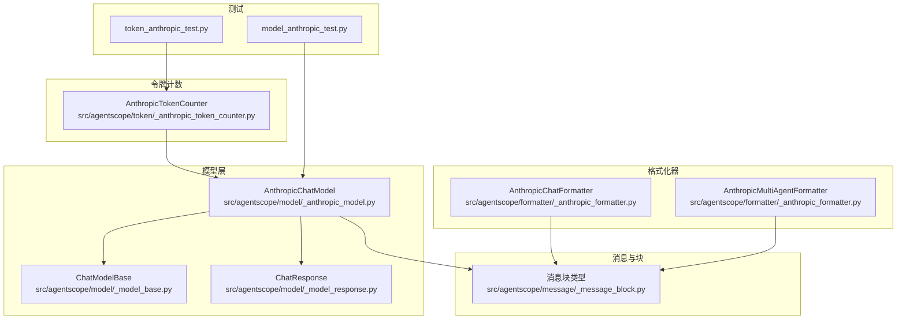
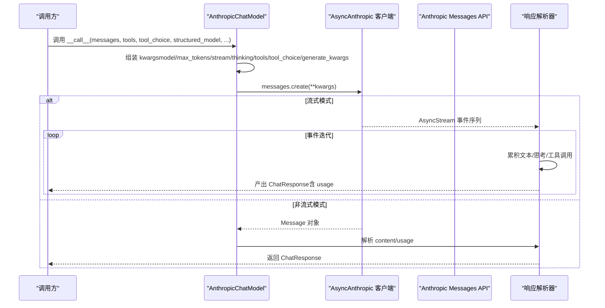
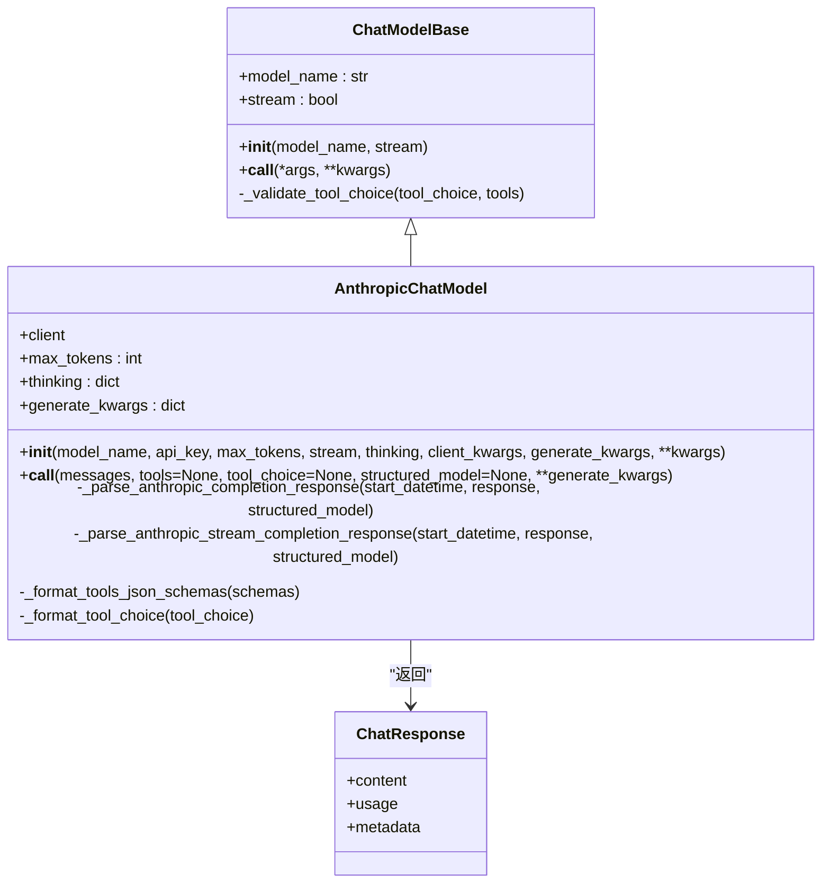
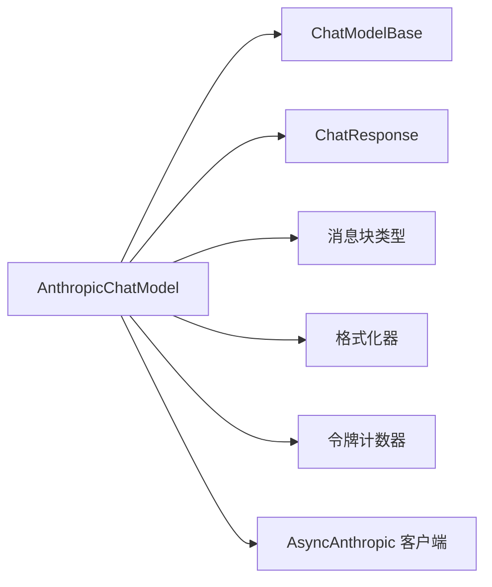
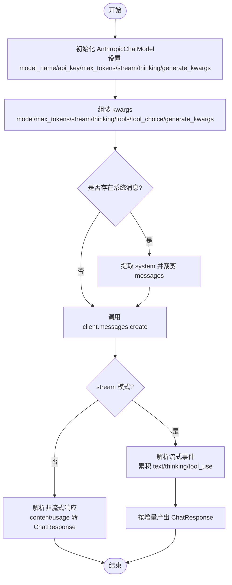

# Anthropic模型集成

<cite>
**本文引用的文件**
- [src/agentscope/model/_anthropic_model.py](file://src/agentscope/model/_anthropic_model.py)
- [src/agentscope/model/_model_base.py](file://src/agentscope/model/_model_base.py)
- [src/agentscope/model/_model_response.py](file://src/agentscope/model/_model_response.py)
- [src/agentscope/message/_message_block.py](file://src/agentscope/message/_message_block.py)
- [src/agentscope/formatter/_anthropic_formatter.py](file://src/agentscope/formatter/_anthropic_formatter.py)
- [src/agentscope/token/_anthropic_token_counter.py](file://src/agentscope/token/_anthropic_token_counter.py)
- [tests/model_anthropic_test.py](file://tests/model_anthropic_test.py)
- [tests/token_anthropic_test.py](file://tests/token_anthropic_test.py)
</cite>

## 目录
1. [简介](#简介)
2. [项目结构](#项目结构)
3. [核心组件](#核心组件)
4. [架构总览](#架构总览)
5. [详细组件分析](#详细组件分析)
6. [依赖关系分析](#依赖关系分析)
7. [性能考量](#性能考量)
8. [故障排除指南](#故障排除指南)
9. [结论](#结论)
10. [附录](#附录)

## 简介
本文件系统性地阐述如何在 agentscope 框架中集成 Anthropic（Claude）模型，围绕 AnthropicChatModel 类展开，覆盖 API 认证配置、请求参数设置、响应解析与流式处理、与 ChatModelBase 的继承关系与接口实现、以及与格式化器（Formatter）、令牌计数器（Token Counter）的协作方式。同时总结 Anthropic API 的特性与最佳实践，如内容安全策略与配额管理提示，并提供常见问题的排查建议。

## 项目结构
与 Anthropic 集成相关的模块主要分布在以下路径：
- 模型层：AnthropicChatModel 实现与抽象基类 ChatModelBase 的对接
- 响应与消息块：ChatResponse、各类消息块类型定义
- 格式化器：AnthropicChatFormatter/AnthropicMultiAgentFormatter 将 Msg 对象转换为 Anthropic API 所需的消息列表
- 令牌计数器：AnthropicTokenCounter 提供对输入消息的令牌估算能力
- 测试用例：验证初始化、工具调用、思维块、流式输出、结构化输出等场景

图表来源
- [src/agentscope/model/_anthropic_model.py](file://src/agentscope/model/_anthropic_model.py#L1-L120)
- [src/agentscope/model/_model_base.py](file://src/agentscope/model/_model_base.py#L1-L78)
- [src/agentscope/model/_model_response.py](file://src/agentscope/model/_model_response.py#L1-L43)
- [src/agentscope/message/_message_block.py](file://src/agentscope/message/_message_block.py#L1-L127)
- [src/agentscope/formatter/_anthropic_formatter.py](file://src/agentscope/formatter/_anthropic_formatter.py#L1-L120)
- [src/agentscope/token/_anthropic_token_counter.py](file://src/agentscope/token/_anthropic_token_counter.py#L1-L62)
- [tests/model_anthropic_test.py](file://tests/model_anthropic_test.py#L1-L120)
- [tests/token_anthropic_test.py](file://tests/token_anthropic_test.py#L1-L60)

章节来源
- [src/agentscope/model/_anthropic_model.py](file://src/agentscope/model/_anthropic_model.py#L1-L120)
- [src/agentscope/model/_model_base.py](file://src/agentscope/model/_model_base.py#L1-L78)
- [src/agentscope/formatter/_anthropic_formatter.py](file://src/agentscope/formatter/_anthropic_formatter.py#L1-L120)
- [src/agentscope/token/_anthropic_token_counter.py](file://src/agentscope/token/_anthropic_token_counter.py#L1-L62)

## 核心组件
- AnthropicChatModel：封装 Anthropic 客户端，负责构造请求参数、调用 messages.create 接口、解析非流式与流式响应，并将结果映射为 ChatResponse。
- ChatModelBase：定义统一的异步调用接口 __call__，并提供工具选择校验逻辑。
- ChatResponse：标准化模型输出，包含 content、usage、metadata 等字段。
- 消息块类型：TextBlock、ThinkingBlock、ToolUseBlock、ToolResultBlock 等，用于承载文本、思考、工具调用与工具结果。
- AnthropicChatFormatter/AnthropicMultiAgentFormatter：将 Msg 列表格式化为 Anthropic API 所需的消息数组；支持多模态与工具调用。
- AnthropicTokenCounter：基于 Anthropic 的计数 API 估算输入令牌数，支持工具与系统消息。

章节来源
- [src/agentscope/model/_anthropic_model.py](file://src/agentscope/model/_anthropic_model.py#L38-L120)
- [src/agentscope/model/_model_base.py](file://src/agentscope/model/_model_base.py#L13-L78)
- [src/agentscope/model/_model_response.py](file://src/agentscope/model/_model_response.py#L1-L43)
- [src/agentscope/message/_message_block.py](file://src/agentscope/message/_message_block.py#L1-L127)
- [src/agentscope/formatter/_anthropic_formatter.py](file://src/agentscope/formatter/_anthropic_formatter.py#L1-L120)
- [src/agentscope/token/_anthropic_token_counter.py](file://src/agentscope/token/_anthropic_token_counter.py#L1-L62)

## 架构总览
下图展示了 AnthropicChatModel 在 agentscope 中的调用链路与数据流转：

图表来源
- [src/agentscope/model/_anthropic_model.py](file://src/agentscope/model/_anthropic_model.py#L126-L264)
- [src/agentscope/model/_anthropic_model.py](file://src/agentscope/model/_anthropic_model.py#L265-L344)
- [src/agentscope/model/_anthropic_model.py](file://src/agentscope/model/_anthropic_model.py#L346-L482)

## 详细组件分析

### AnthropicChatModel 类分析
- 继承关系与职责
  - 继承自 ChatModelBase，实现统一的异步 __call__ 接口。
  - 负责：
    - 初始化 AsyncAnthropic 客户端（支持 client_kwargs 透传）
    - 构造 messages.create 请求参数（model、max_tokens、stream、thinking、tools、tool_choice、generate_kwargs）
    - 处理系统消息提取与消息列表裁剪
    - 解析非流式与流式响应，生成 ChatResponse
    - 工具函数 schema 格式化与 tool_choice 兼容映射
    - 结构化输出（Pydantic BaseModel）自动转为工具并强制 tool_choice

- 关键方法与流程
  - __init__：参数校验与弃用参数警告、导入 anthropic、初始化客户端、保存 max_tokens、thinking、generate_kwargs
  - __call__：组装 kwargs、处理 tools/tool_choice/structured_model、提取 system、调用 client.messages.create、根据 stream 分支解析
  - _parse_anthropic_completion_response：从 Message 对象提取 content_blocks 与 usage，填充 ChatResponse
  - _parse_anthropic_stream_completion_response：逐事件累积文本/思考/工具调用，按增量产出 ChatResponse
  - _format_tools_json_schemas：将 function schema 转换为 Anthropic 所需的工具描述格式
  - _format_tool_choice：将字符串枚举或具体工具名映射为 API 所需的 tool_choice 结构

图表来源
- [src/agentscope/model/_model_base.py](file://src/agentscope/model/_model_base.py#L13-L78)
- [src/agentscope/model/_anthropic_model.py](file://src/agentscope/model/_anthropic_model.py#L38-L120)
- [src/agentscope/model/_anthropic_model.py](file://src/agentscope/model/_anthropic_model.py#L126-L264)
- [src/agentscope/model/_model_response.py](file://src/agentscope/model/_model_response.py#L1-L43)

章节来源
- [src/agentscope/model/_anthropic_model.py](file://src/agentscope/model/_anthropic_model.py#L38-L120)
- [src/agentscope/model/_anthropic_model.py](file://src/agentscope/model/_anthropic_model.py#L126-L264)
- [src/agentscope/model/_anthropic_model.py](file://src/agentscope/model/_anthropic_model.py#L265-L344)
- [src/agentscope/model/_anthropic_model.py](file://src/agentscope/model/_anthropic_model.py#L346-L482)
- [src/agentscope/model/_model_base.py](file://src/agentscope/model/_model_base.py#L13-L78)
- [src/agentscope/model/_model_response.py](file://src/agentscope/model/_model_response.py#L1-L43)

### 请求参数与响应处理机制
- 认证与客户端配置
  - 通过 api_key 初始化 AsyncAnthropic 客户端，支持 client_kwargs 透传（如超时、代理等）
  - 若未安装 anthropic 包，抛出 ImportError 并提示安装命令
- 请求参数设置
  - 必填：model、messages
  - 可选：max_tokens、stream、thinking、tools、tool_choice、generate_kwargs（如 temperature、top_p、seed 等）
  - 系统消息：若第一条消息 role 为 system，则抽取为 system 参数，其余消息进入 messages
  - 工具 schema：由 _format_tools_json_schemas 转换为 Anthropic 所需格式
  - 工具选择：_format_tool_choice 将 "auto"/"none"/"required" 映射为 API 所需结构，或指定具体工具名
  - 结构化输出：当提供 Pydantic BaseModel 时，自动将其转换为工具并强制 tool_choice
- 响应处理
  - 非流式：解析 Message.content，识别 text、thinking、tool_use，填充 ChatResponse.content 与 usage
  - 流式：遍历 AsyncStream 事件，累积 text/thinking/input_json，按增量产出 ChatResponse；usage 在 message_start 与 message_delta 事件中更新
  - metadata：当使用结构化输出时，将工具输入作为 metadata 返回

章节来源
- [src/agentscope/model/_anthropic_model.py](file://src/agentscope/model/_anthropic_model.py#L126-L264)
- [src/agentscope/model/_anthropic_model.py](file://src/agentscope/model/_anthropic_model.py#L265-L344)
- [src/agentscope/model/_anthropic_model.py](file://src/agentscope/model/_anthropic_model.py#L346-L482)

### 与格式化器（Formatter）的协作
- AnthropicChatFormatter
  - 支持工具 API、多模态（图像）、工具调用与结果
  - 将 Msg 的内容块映射为 Anthropic 所需格式；tool_result 会被转换为独立的 user 角色消息
  - 约束：仅首条消息可为 system；其余 system 消息会降级为 user
- AnthropicMultiAgentFormatter
  - 支持多智能体对话，将历史与多模态内容整合为 user 的单条消息
  - 提供 conversation_history_prompt 以增强上下文组织

章节来源
- [src/agentscope/formatter/_anthropic_formatter.py](file://src/agentscope/formatter/_anthropic_formatter.py#L1-L120)
- [src/agentscope/formatter/_anthropic_formatter.py](file://src/agentscope/formatter/_anthropic_formatter.py#L120-L254)

### 令牌计数与配额管理
- AnthropicTokenCounter
  - 通过 client.messages.count_tokens 估算输入令牌数
  - 支持 tools 与 system 参数透传
  - 注意：多模态数据需为 base64 格式（见注释）
- 配额与限制
  - Anthropic API 有速率限制与并发限制；建议在应用层做退避与限流
  - 使用 generate_kwargs 控制温度、采样策略，避免过度消耗
  - 合理设置 max_tokens，防止长输出导致成本上升

章节来源
- [src/agentscope/token/_anthropic_token_counter.py](file://src/agentscope/token/_anthropic_token_counter.py#L1-L62)

### 在 agentscope 中配置与使用示例（路径指引）
以下为关键实现位置的路径指引，便于在项目中定位与复用：
- 初始化 AnthropicChatModel
  - [初始化参数与弃用参数处理](file://src/agentscope/model/_anthropic_model.py#L41-L120)
- 调用 messages.create 与参数组装
  - [请求参数组装与系统消息提取](file://src/agentscope/model/_anthropic_model.py#L197-L244)
- 非流式响应解析
  - [非流式响应解析](file://src/agentscope/model/_anthropic_model.py#L265-L344)
- 流式响应解析
  - [流式响应解析与增量产出](file://src/agentscope/model/_anthropic_model.py#L346-L482)
- 工具 schema 格式化与 tool_choice 映射
  - [工具 schema 格式化](file://src/agentscope/model/_anthropic_model.py#L483-L509)
  - [tool_choice 映射](file://src/agentscope/model/_anthropic_model.py#L510-L540)
- 格式化器使用
  - [单智能体格式化器](file://src/agentscope/formatter/_anthropic_formatter.py#L1-L120)
  - [多智能体格式化器](file://src/agentscope/formatter/_anthropic_formatter.py#L120-L254)
- 令牌计数
  - [令牌计数器实现](file://src/agentscope/token/_anthropic_token_counter.py#L1-L62)

章节来源
- [src/agentscope/model/_anthropic_model.py](file://src/agentscope/model/_anthropic_model.py#L41-L120)
- [src/agentscope/model/_anthropic_model.py](file://src/agentscope/model/_anthropic_model.py#L197-L244)
- [src/agentscope/model/_anthropic_model.py](file://src/agentscope/model/_anthropic_model.py#L265-L344)
- [src/agentscope/model/_anthropic_model.py](file://src/agentscope/model/_anthropic_model.py#L346-L482)
- [src/agentscope/model/_anthropic_model.py](file://src/agentscope/model/_anthropic_model.py#L483-L540)
- [src/agentscope/formatter/_anthropic_formatter.py](file://src/agentscope/formatter/_anthropic_formatter.py#L1-L120)
- [src/agentscope/formatter/_anthropic_formatter.py](file://src/agentscope/formatter/_anthropic_formatter.py#L120-L254)
- [src/agentscope/token/_anthropic_token_counter.py](file://src/agentscope/token/_anthropic_token_counter.py#L1-L62)

## 依赖关系分析
- 组件耦合
  - AnthropicChatModel 强依赖 anthropic.AsyncAnthropic 客户端
  - 与 ChatModelBase 强耦合（继承），遵循统一接口
  - 与 ChatResponse、消息块类型强耦合（输出结构）
  - 与格式化器弱耦合（通过 Msg 列表转换为 API 所需格式）
  - 与令牌计数器弱耦合（独立计数服务）

图表来源
- [src/agentscope/model/_anthropic_model.py](file://src/agentscope/model/_anthropic_model.py#L38-L120)
- [src/agentscope/model/_model_base.py](file://src/agentscope/model/_model_base.py#L13-L78)
- [src/agentscope/model/_model_response.py](file://src/agentscope/model/_model_response.py#L1-L43)
- [src/agentscope/message/_message_block.py](file://src/agentscope/message/_message_block.py#L1-L127)
- [src/agentscope/formatter/_anthropic_formatter.py](file://src/agentscope/formatter/_anthropic_formatter.py#L1-L120)
- [src/agentscope/token/_anthropic_token_counter.py](file://src/agentscope/token/_anthropic_token_counter.py#L1-L62)

## 性能考量
- 流式输出
  - 流式模式可降低首字延迟，适合实时对话；注意在事件循环中及时消费生成器，避免阻塞
- 工具调用与结构化输出
  - 工具 schema 转换与 JSON 修复（_json_loads_with_repair）可能带来额外开销；建议缓存常用 schema
- 令牌估算
  - 使用 AnthropicTokenCounter 进行预估，有助于控制 max_tokens 与成本
- 超时与重试
  - 通过 client_kwargs 传入超时参数；在高并发场景建议引入指数退避与限流策略

[本节为通用指导，不直接分析具体文件]

## 故障排除指南
- 无法导入 anthropic
  - 现象：初始化时报 ImportError
  - 处理：安装 anthropic 包后重试
  - 参考路径：[导入异常处理](file://src/agentscope/model/_anthropic_model.py#L108-L115)
- 未知关键字参数
  - 现象：出现 unknown keyword arguments 警告
  - 处理：检查传入参数是否拼写正确或已弃用
  - 参考路径：[未知参数警告](file://src/agentscope/model/_anthropic_model.py#L102-L106)
- 工具选择无效
  - 现象：tool_choice 抛出错误
  - 处理：确认 tool_choice 是否为 "auto"/"none"/"required" 或可用工具名
  - 参考路径：[工具选择校验](file://src/agentscope/model/_model_base.py#L46-L78)
- 流式解析异常
  - 现象：JSON 片段不完整导致解析失败
  - 处理：内部已使用 _json_loads_with_repair 进行修复；如仍失败，检查工具输入格式
  - 参考路径：[流式 JSON 修复](file://src/agentscope/model/_anthropic_model.py#L458-L464)
- 结构化输出未生效
  - 现象：tools 与 tool_choice 未被忽略
  - 处理：提供 structured_model 时会自动覆盖 tools 与 tool_choice；如需其他工具，请改用工具模式
  - 参考路径：[结构化输出覆盖逻辑](file://src/agentscope/model/_anthropic_model.py#L222-L236)
- 多模态与系统消息
  - 现象：图片未显示或系统消息未生效
  - 处理：确保多模态数据为 base64；系统消息仅首条有效
  - 参考路径：[令牌计数注释](file://src/agentscope/token/_anthropic_token_counter.py#L31-L33)，[格式化器系统消息约束](file://src/agentscope/formatter/_anthropic_formatter.py#L105-L110)

章节来源
- [src/agentscope/model/_anthropic_model.py](file://src/agentscope/model/_anthropic_model.py#L102-L115)
- [src/agentscope/model/_model_base.py](file://src/agentscope/model/_model_base.py#L46-L78)
- [src/agentscope/model/_anthropic_model.py](file://src/agentscope/model/_anthropic_model.py#L458-L464)
- [src/agentscope/model/_anthropic_model.py](file://src/agentscope/model/_anthropic_model.py#L222-L236)
- [src/agentscope/token/_anthropic_token_counter.py](file://src/agentscope/token/_anthropic_token_counter.py#L31-L33)
- [src/agentscope/formatter/_anthropic_formatter.py](file://src/agentscope/formatter/_anthropic_formatter.py#L105-L110)

## 结论
AnthropicChatModel 在 agentscope 中提供了对 Claude 系列模型的完整封装，具备良好的参数扩展性、工具调用与结构化输出能力，并通过格式化器与令牌计数器实现了与框架生态的无缝衔接。结合流式输出与严格的参数校验，可在保证稳定性的同时提升交互体验。建议在生产环境中配合限流、重试与成本控制策略，以获得更稳健的服务质量。

[本节为总结性内容，不直接分析具体文件]

## 附录

### API 调用流程（算法视角）

图表来源
- [src/agentscope/model/_anthropic_model.py](file://src/agentscope/model/_anthropic_model.py#L197-L244)
- [src/agentscope/model/_anthropic_model.py](file://src/agentscope/model/_anthropic_model.py#L265-L344)
- [src/agentscope/model/_anthropic_model.py](file://src/agentscope/model/_anthropic_model.py#L346-L482)

### 关键实现路径索引
- 初始化与弃用参数处理：[路径](file://src/agentscope/model/_anthropic_model.py#L41-L120)
- 请求参数组装与系统消息提取：[路径](file://src/agentscope/model/_anthropic_model.py#L197-L244)
- 非流式响应解析：[路径](file://src/agentscope/model/_anthropic_model.py#L265-L344)
- 流式响应解析与增量产出：[路径](file://src/agentscope/model/_anthropic_model.py#L346-L482)
- 工具 schema 格式化：[路径](file://src/agentscope/model/_anthropic_model.py#L483-L509)
- tool_choice 映射：[路径](file://src/agentscope/model/_anthropic_model.py#L510-L540)
- 单智能体格式化器：[路径](file://src/agentscope/formatter/_anthropic_formatter.py#L1-L120)
- 多智能体格式化器：[路径](file://src/agentscope/formatter/_anthropic_formatter.py#L120-L254)
- 令牌计数器：[路径](file://src/agentscope/token/_anthropic_token_counter.py#L1-L62)