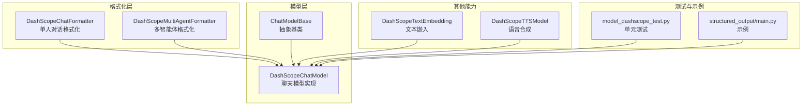
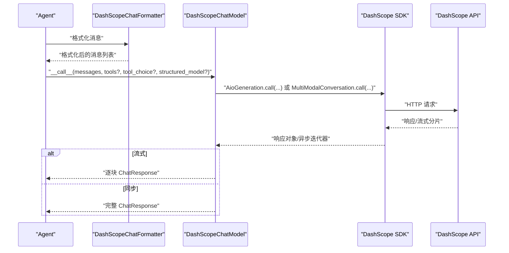
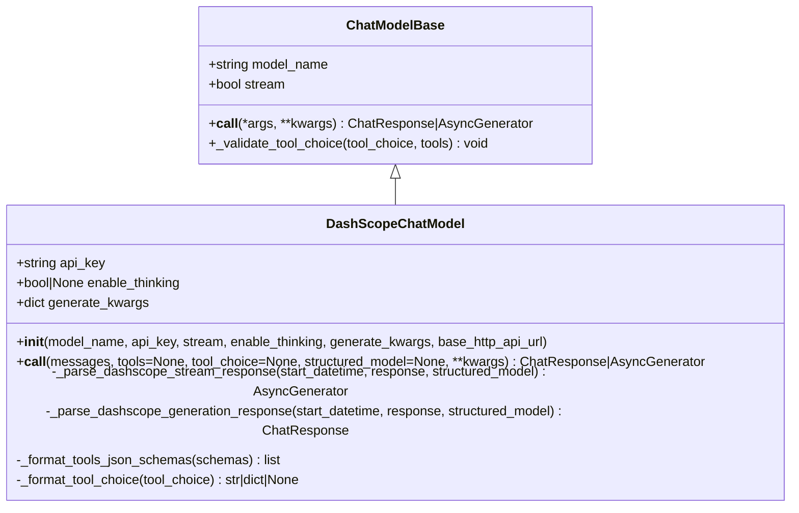
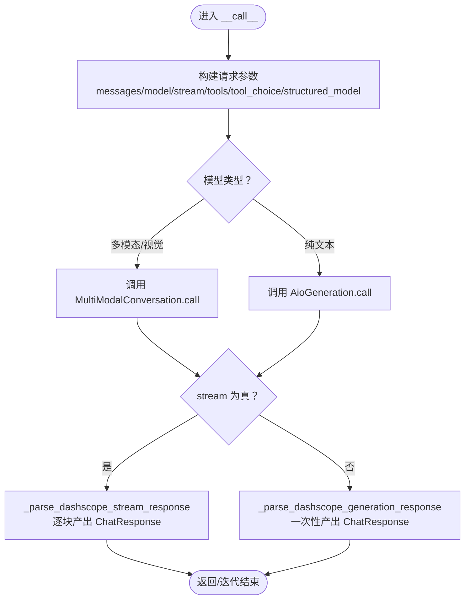
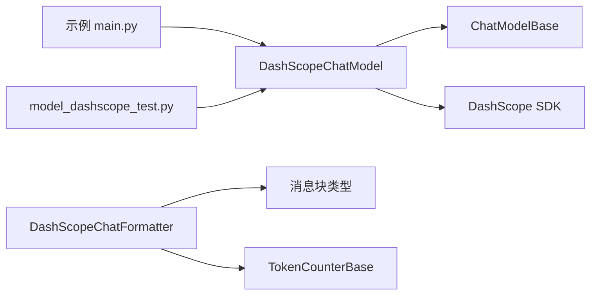

# DashScope模型集成

<cite>
**本文引用的文件列表**
- [src/agentscope/model/_dashscope_model.py](file://src/agentscope/model/_dashscope_model.py)
- [src/agentscope/model/_model_base.py](file://src/agentscope/model/_model_base.py)
- [src/agentscope/formatter/_dashscope_formatter.py](file://src/agentscope/formatter/_dashscope_formatter.py)
- [src/agentscope/embedding/_dashscope_embedding.py](file://src/agentscope/embedding/_dashscope_embedding.py)
- [src/agentscope/tts/_dashscope_tts_model.py](file://src/agentscope/tts/_dashscope_tts_model.py)
- [tests/model_dashscope_test.py](file://tests/model_dashscope_test.py)
- [examples/functionality/structured_output/main.py](file://examples/functionality/structured_output/main.py)
- [examples/functionality/structured_output/README.md](file://examples/functionality/structured_output/README.md)
</cite>

## 目录
1. [简介](#简介)
2. [项目结构](#项目结构)
3. [核心组件](#核心组件)
4. [架构总览](#架构总览)
5. [详细组件分析](#详细组件分析)
6. [依赖关系分析](#依赖关系分析)
7. [性能与适用性](#性能与适用性)
8. [故障排查指南](#故障排查指南)
9. [结论](#结论)
10. [附录：初始化参数与调用示例](#附录初始化参数与调用示例)

## 简介
本文件面向需要在Agentscope框架中接入阿里云通义千问系列模型（DashScope）的开发者，系统化说明如何使用 DashScopeChatModel 类完成模型接入，涵盖：
- API-KEY 与模型名称的配置方式
- 初始化参数与调用示例（同步与流式）
- 与基础模型类 ChatModelBase 的交互机制
- 工具函数调用、结构化输出、推理思考模式等高级能力
- 常见问题排查（认证失败、模型服务不可用等）
- 在多智能体系统中的性能特征与适用场景

## 项目结构
DashScope 集成位于模型层与格式化层，主要涉及以下模块：
- 模型层：DashScopeChatModel 实现与 ChatModelBase 抽象基类
- 格式化层：DashScopeChatFormatter/DashScopeMultiAgentFormatter 将消息块转换为 DashScope API 兼容格式
- 嵌入与TTS：DashScopeTextEmbedding、DashScopeTTSModel 提供向量与语音能力
- 测试与示例：单元测试覆盖初始化、工具调用、流式响应、结构化输出；示例展示结构化输出的完整流程

图表来源
- [src/agentscope/model/_dashscope_model.py](file://src/agentscope/model/_dashscope_model.py#L1-L120)
- [src/agentscope/model/_model_base.py](file://src/agentscope/model/_model_base.py#L1-L78)
- [src/agentscope/formatter/_dashscope_formatter.py](file://src/agentscope/formatter/_dashscope_formatter.py#L1-L120)
- [src/agentscope/embedding/_dashscope_embedding.py](file://src/agentscope/embedding/_dashscope_embedding.py#L1-L120)
- [src/agentscope/tts/_dashscope_tts_model.py](file://src/agentscope/tts/_dashscope_tts_model.py#L1-L120)
- [tests/model_dashscope_test.py](file://tests/model_dashscope_test.py#L1-L120)
- [examples/functionality/structured_output/main.py](file://examples/functionality/structured_output/main.py#L1-L81)

章节来源
- [src/agentscope/model/_dashscope_model.py](file://src/agentscope/model/_dashscope_model.py#L1-L120)
- [src/agentscope/model/_model_base.py](file://src/agentscope/model/_model_base.py#L1-L78)
- [src/agentscope/formatter/_dashscope_formatter.py](file://src/agentscope/formatter/_dashscope_formatter.py#L1-L120)

## 核心组件
- DashScopeChatModel：统一 Generation 与 MultimodalConversation API 的聊天模型实现，支持同步与流式调用、工具调用、结构化输出、推理思考模式等。
- ChatModelBase：所有聊天模型的抽象基类，定义 model_name、stream 以及异步 __call__ 接口。
- DashScopeChatFormatter/DashScopeMultiAgentFormatter：将 Msg 对象及其内容块（文本、图像、音频、视频、工具调用/结果等）格式化为 DashScope API 所需的消息结构。
- DashScopeTextEmbedding：文本嵌入模型，支持批量与缓存。
- DashScopeTTSModel：基于 MultiModalConversation 的 TTS 实现，支持流式与非流式语音合成。

章节来源
- [src/agentscope/model/_dashscope_model.py](file://src/agentscope/model/_dashscope_model.py#L47-L120)
- [src/agentscope/model/_model_base.py](file://src/agentscope/model/_model_base.py#L13-L78)
- [src/agentscope/formatter/_dashscope_formatter.py](file://src/agentscope/formatter/_dashscope_formatter.py#L147-L210)
- [src/agentscope/embedding/_dashscope_embedding.py](file://src/agentscope/embedding/_dashscope_embedding.py#L14-L60)
- [src/agentscope/tts/_dashscope_tts_model.py](file://src/agentscope/tts/_dashscope_tts_model.py#L28-L77)

## 架构总览
DashScopeChatModel 通过 DashScope SDK 调用 Generation 或 MultimodalConversation 接口，内部根据是否启用工具调用、结构化输出、推理思考模式等参数，构造请求并解析响应，最终以 ChatResponse 返回，或在流式模式下逐块产出。

图表来源
- [src/agentscope/model/_dashscope_model.py](file://src/agentscope/model/_dashscope_model.py#L103-L240)
- [src/agentscope/formatter/_dashscope_formatter.py](file://src/agentscope/formatter/_dashscope_formatter.py#L214-L398)

## 详细组件分析

### DashScopeChatModel 类分析
- 继承关系：DashScopeChatModel 继承自 ChatModelBase，复用其 model_name、stream 字段，并实现异步 __call__。
- 初始化参数要点：
  - model_name：模型名称（如 qwen-turbo、qwen-max 等）
  - api_key：DashScope API 密钥
  - stream：是否启用流式输出，默认 True
  - enable_thinking：是否启用推理思考模式（仅部分模型支持），当启用时强制 stream=True
  - generate_kwargs：透传给 DashScope API 的额外参数（如 temperature、seed 等）
  - base_http_api_url：可选，用于覆盖 DashScope SDK 默认基础地址
- 调用逻辑：
  - 根据模型名判断使用 Generation 或 MultimodalConversation
  - 自动设置 result_format=message、incremental_output=stream
  - 处理工具调用与 tool_choice（DashScope 不支持 "required"，会自动降级为 "auto"）
  - 支持 structured_model：将 Pydantic 模型转为工具函数并强制使用该工具进行结构化输出
  - 解析响应：同步返回 ChatResponse；流式返回异步生成器，逐块产出 ChatResponse
- 错误处理：
  - 非流式调用状态码非 200 时抛出异常
  - 流式分片状态码非 200 时抛出异常
  - 工具 schema 校验失败时抛出异常

图表来源
- [src/agentscope/model/_model_base.py](file://src/agentscope/model/_model_base.py#L13-L78)
- [src/agentscope/model/_dashscope_model.py](file://src/agentscope/model/_dashscope_model.py#L47-L120)
- [src/agentscope/model/_dashscope_model.py](file://src/agentscope/model/_dashscope_model.py#L103-L240)
- [src/agentscope/model/_dashscope_model.py](file://src/agentscope/model/_dashscope_model.py#L242-L532)

章节来源
- [src/agentscope/model/_dashscope_model.py](file://src/agentscope/model/_dashscope_model.py#L47-L120)
- [src/agentscope/model/_dashscope_model.py](file://src/agentscope/model/_dashscope_model.py#L103-L240)
- [src/agentscope/model/_dashscope_model.py](file://src/agentscope/model/_dashscope_model.py#L242-L532)

### 与 ChatModelBase 的交互机制
- ChatModelBase 定义了 model_name、stream 字段与抽象的 __call__ 方法，确保所有具体模型遵循一致的调用契约。
- DashScopeChatModel 在 __init__ 中调用父类构造，随后设置自身字段；在 __call__ 中实现具体逻辑并通过装饰器 trace_llm 进行追踪。

章节来源
- [src/agentscope/model/_model_base.py](file://src/agentscope/model/_model_base.py#L13-L78)
- [src/agentscope/model/_dashscope_model.py](file://src/agentscope/model/_dashscope_model.py#L92-L102)

### 工具调用与结构化输出
- 工具调用：
  - 支持 tools 与 tool_choice 参数；DashScope 不支持 "required"，会自动降级为 "auto"
  - 通过 _format_tools_json_schemas 校验工具 schema 格式
  - 通过 _format_tool_choice 将 tool_choice 格式化为 API 可接受的形式
- 结构化输出：
  - 当提供 structured_model 时，内部自动创建工具函数并强制使用该工具，忽略外部 tools 与 tool_choice
  - 将模型返回的工具参数解析为 metadata，便于上层验证与消费

章节来源
- [src/agentscope/model/_dashscope_model.py](file://src/agentscope/model/_dashscope_model.py#L164-L213)
- [src/agentscope/model/_dashscope_model.py](file://src/agentscope/model/_dashscope_model.py#L198-L213)

### 流式与非流式调用流程
- 非流式：调用 DashScope SDK 的 Generation/MultimodalConversation 同步接口，解析完整响应后封装为 ChatResponse
- 流式：调用 AioGeneration.call 或 MultiModalConversation.call 获取异步迭代器，逐块解析并产出 ChatResponse；支持累积文本、工具调用与推理思考内容

图表来源
- [src/agentscope/model/_dashscope_model.py](file://src/agentscope/model/_dashscope_model.py#L164-L240)
- [src/agentscope/model/_dashscope_model.py](file://src/agentscope/model/_dashscope_model.py#L242-L480)

章节来源
- [src/agentscope/model/_dashscope_model.py](file://src/agentscope/model/_dashscope_model.py#L164-L240)
- [src/agentscope/model/_dashscope_model.py](file://src/agentscope/model/_dashscope_model.py#L242-L480)

### 格式化层（Formatter）
- DashScopeChatFormatter：将 Msg 的内容块（文本、图像、音频、视频、工具调用/结果）转换为 DashScope API 所需的消息结构；支持将工具结果提升为用户消息中的多媒体内容
- DashScopeMultiAgentFormatter：支持多智能体场景，将历史消息合并到系统提示中，并保留工具调用/结果消息的独立条目

章节来源
- [src/agentscope/formatter/_dashscope_formatter.py](file://src/agentscope/formatter/_dashscope_formatter.py#L147-L210)
- [src/agentscope/formatter/_dashscope_formatter.py](file://src/agentscope/formatter/_dashscope_formatter.py#L399-L626)

### 嵌入与TTS
- DashScopeTextEmbedding：封装文本嵌入调用，支持缓存与批量限制
- DashScopeTTSModel：封装 TTS 调用，支持流式与非流式语音合成

章节来源
- [src/agentscope/embedding/_dashscope_embedding.py](file://src/agentscope/embedding/_dashscope_embedding.py#L14-L170)
- [src/agentscope/tts/_dashscope_tts_model.py](file://src/agentscope/tts/_dashscope_tts_model.py#L28-L178)

## 依赖关系分析
- DashScopeChatModel 依赖 ChatModelBase 提供的抽象接口与工具校验方法
- DashScopeChatModel 依赖 DashScope SDK 的 Generation 与 MultimodalConversation 接口
- DashScopeChatFormatter 依赖消息块类型（TextBlock、ImageBlock、AudioBlock、VideoBlock、ToolUseBlock、ToolResultBlock）与 Token 计数器
- 示例与测试依赖 DashScopeChatModel 与 DashScopeChatFormatter

图表来源
- [src/agentscope/model/_dashscope_model.py](file://src/agentscope/model/_dashscope_model.py#L1-L120)
- [src/agentscope/model/_model_base.py](file://src/agentscope/model/_model_base.py#L1-L78)
- [src/agentscope/formatter/_dashscope_formatter.py](file://src/agentscope/formatter/_dashscope_formatter.py#L1-L120)
- [examples/functionality/structured_output/main.py](file://examples/functionality/structured_output/main.py#L1-L81)
- [tests/model_dashscope_test.py](file://tests/model_dashscope_test.py#L1-L120)

章节来源
- [src/agentscope/model/_dashscope_model.py](file://src/agentscope/model/_dashscope_model.py#L1-L120)
- [src/agentscope/model/_model_base.py](file://src/agentscope/model/_model_base.py#L1-L78)
- [src/agentscope/formatter/_dashscope_formatter.py](file://src/agentscope/formatter/_dashscope_formatter.py#L1-L120)
- [examples/functionality/structured_output/main.py](file://examples/functionality/structured_output/main.py#L1-L81)
- [tests/model_dashscope_test.py](file://tests/model_dashscope_test.py#L1-L120)

## 性能与适用性
- 流式输出优势：在长对话与工具调用场景中，流式输出能显著降低首字节延迟，改善用户体验
- 工具调用与结构化输出：通过工具 schema 与结构化输出，减少模型“幻觉”，提高任务执行的确定性
- 多模态支持：图像/音频/视频输入在 DashScope 多模态模型上具备良好表现，适合复杂场景
- 多智能体系统：DashScopeMultiAgentFormatter 支持将历史对话压缩进系统提示，结合工具调用实现协作式工作流
- 注意事项：
  - 推理思考模式（enable_thinking）仅部分模型支持，且必须配合流式输出
  - 工具调用在 DashScope 上不支持 "required"，会自动降级为 "auto"
  - 文本嵌入存在批大小与单输入长度限制，示例中已体现

章节来源
- [src/agentscope/model/_dashscope_model.py](file://src/agentscope/model/_dashscope_model.py#L85-L102)
- [src/agentscope/model/_dashscope_model.py](file://src/agentscope/model/_dashscope_model.py#L176-L213)
- [src/agentscope/formatter/_dashscope_formatter.py](file://src/agentscope/formatter/_dashscope_formatter.py#L399-L626)
- [src/agentscope/embedding/_dashscope_embedding.py](file://src/agentscope/embedding/_dashscope_embedding.py#L14-L60)

## 故障排查指南
- 认证失败（401/403）
  - 检查环境变量 DASHSCOPE_API_KEY 是否正确设置
  - 确认 DashScope 控制台中 API Key 权限范围满足所用模型
- 模型服务不可用（5xx/超时）
  - 检查 DashScope 服务状态与网络连通性
  - 适当增加重试与超时时间
- 工具 schema 校验失败
  - 确保每个工具 schema 符合 "type":"function" 且包含 "function" 字段
- 工具选择无效
  - DashScope 不支持 "required"，请改用 "auto" 或指定具体工具名
- 结构化输出未按预期
  - 确认 structured_model 正确传入，且模型返回的参数可被修复为 JSON 对象
- 流式输出异常
  - 确保 enable_thinking 与 stream 配置一致（开启推理思考时必须流式）

章节来源
- [tests/model_dashscope_test.py](file://tests/model_dashscope_test.py#L371-L389)
- [src/agentscope/model/_dashscope_model.py](file://src/agentscope/model/_dashscope_model.py#L176-L213)
- [src/agentscope/model/_dashscope_model.py](file://src/agentscope/model/_dashscope_model.py#L482-L532)

## 结论
DashScopeChatModel 在 Agentscope 中提供了统一、灵活且功能完备的通义千问接入方案，覆盖同步/流式、工具调用、结构化输出与推理思考等关键能力。配合 DashScopeChatFormatter，可在单智能体与多智能体场景中高效构建对话与协作系统。建议在生产环境中结合缓存、重试与可观测性策略，进一步提升稳定性与性能。

## 附录：初始化参数与调用示例

### 初始化参数
- model_name：模型名称（如 qwen-turbo、qwen-max、qwen-plus 等）
- api_key：DashScope API Key（建议从环境变量读取）
- stream：是否启用流式输出（默认 True）
- enable_thinking：是否启用推理思考模式（仅部分模型支持）
- generate_kwargs：透传给 DashScope API 的额外参数（如 temperature、seed 等）
- base_http_api_url：可选，覆盖 DashScope SDK 默认基础地址

章节来源
- [src/agentscope/model/_dashscope_model.py](file://src/agentscope/model/_dashscope_model.py#L51-L102)

### 调用示例（路径）
- 同步调用（无工具）：参考示例脚本中 ReActAgent 的初始化与调用
  - [examples/functionality/structured_output/main.py](file://examples/functionality/structured_output/main.py#L37-L81)
- 流式调用（含工具与推理思考）：参考测试用例对流式响应的断言与处理
  - [tests/model_dashscope_test.py](file://tests/model_dashscope_test.py#L271-L328)
- 结构化输出：通过 structured_model 强制模型返回符合 Pydantic Schema 的 JSON
  - [examples/functionality/structured_output/main.py](file://examples/functionality/structured_output/main.py#L18-L35)
  - [tests/model_dashscope_test.py](file://tests/model_dashscope_test.py#L190-L269)

### 环境变量与运行说明
- 设置 DASHSCOPE_API_KEY 环境变量后运行示例脚本
  - [examples/functionality/structured_output/README.md](file://examples/functionality/structured_output/README.md#L32-L66)