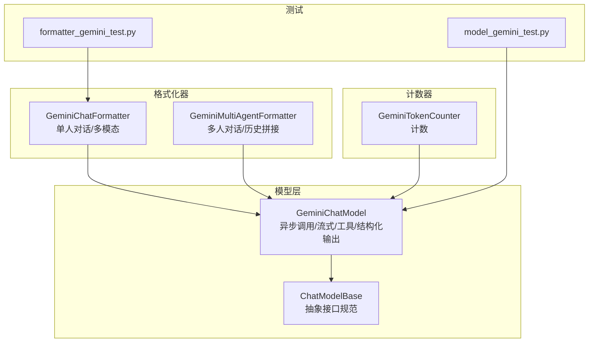
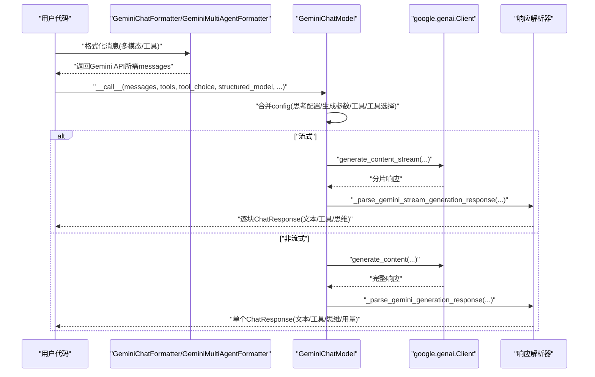
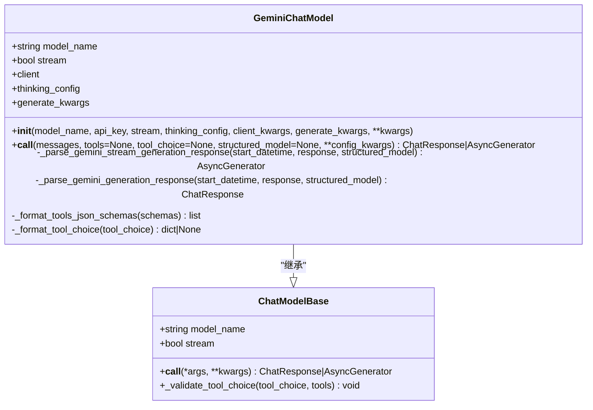
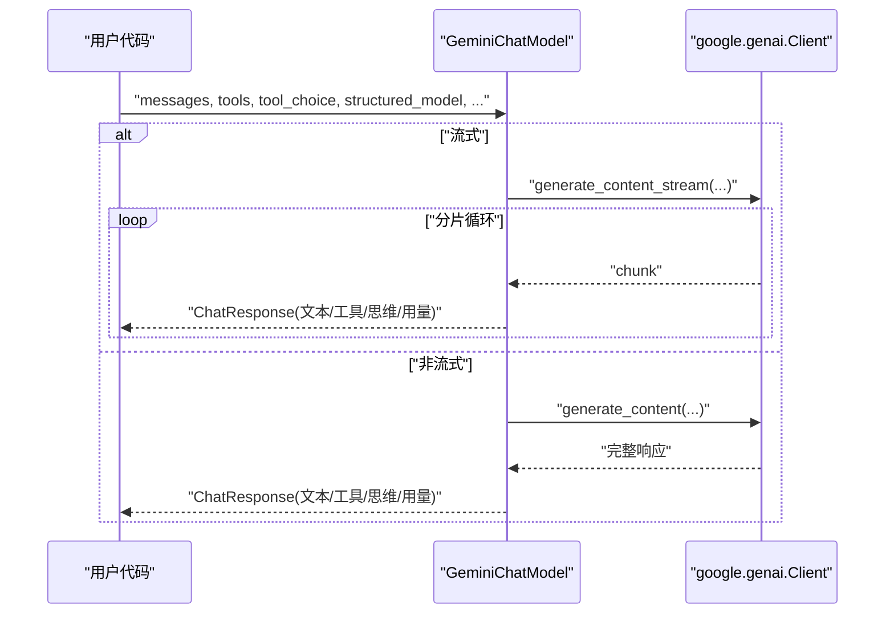
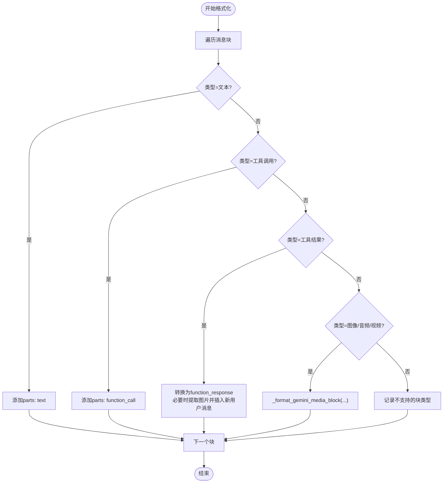
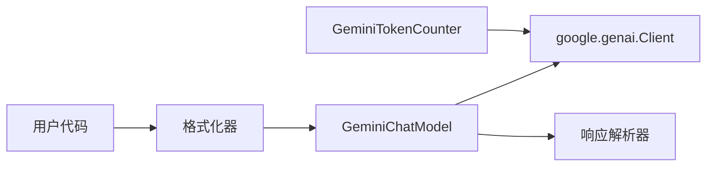

# Gemini模型集成

<cite>
**本文引用的文件列表**
- [src/agentscope/model/_gemini_model.py](file://src/agentscope/model/_gemini_model.py)
- [src/agentscope/model/_model_base.py](file://src/agentscope/model/_model_base.py)
- [src/agentscope/formatter/_gemini_formatter.py](file://src/agentscope/formatter/_gemini_formatter.py)
- [src/agentscope/token/_gemini_token_counter.py](file://src/agentscope/token/_gemini_token_counter.py)
- [tests/model_gemini_test.py](file://tests/model_gemini_test.py)
- [tests/formatter_gemini_test.py](file://tests/formatter_gemini_test.py)
- [README.md](file://README.md)
</cite>

## 目录
1. [简介](#简介)
2. [项目结构](#项目结构)
3. [核心组件](#核心组件)
4. [架构总览](#架构总览)
5. [详细组件分析](#详细组件分析)
6. [依赖关系分析](#依赖关系分析)
7. [性能与资源特性](#性能与资源特性)
8. [错误处理与故障排查](#错误处理与故障排查)
9. [多智能体系统最佳实践](#多智能体系统最佳实践)
10. [结论](#结论)

## 简介
本文件系统化说明如何通过GeminiChatModel类集成Google的Gemini系列模型，覆盖初始化参数（模型名、API密钥、客户端参数、生成参数）、同步与流式调用模式、对ChatModelBase接口规范的遵循、Gemini API特有能力（工具调用、结构化输出、思维块、多模态输入）以及内容安全过滤机制的处理思路。同时提供错误处理指南与多智能体系统中的最佳实践建议，帮助用户快速、稳定地在AgentScope中使用Gemini模型。

## 项目结构
围绕Gemini模型集成的相关模块分布如下：
- 模型层：GeminiChatModel实现异步调用、工具调用、结构化输出、思维块解析与流式返回
- 基类层：ChatModelBase定义统一接口规范
- 格式化器：GeminiChatFormatter与GeminiMultiAgentFormatter负责消息格式转换，支持文本、图像、音频、视频等多模态输入
- 计数器：GeminiTokenCounter封装计数逻辑
- 测试：单元测试覆盖初始化、工具调用、思维块、结构化输出、流式响应、生成参数合并等场景

图表来源
- [src/agentscope/model/_gemini_model.py](file://src/agentscope/model/_gemini_model.py#L33-L521)
- [src/agentscope/model/_model_base.py](file://src/agentscope/model/_model_base.py#L13-L78)
- [src/agentscope/formatter/_gemini_formatter.py](file://src/agentscope/formatter/_gemini_formatter.py#L107-L507)
- [src/agentscope/token/_gemini_token_counter.py](file://src/agentscope/token/_gemini_token_counter.py#L1-L51)
- [tests/model_gemini_test.py](file://tests/model_gemini_test.py#L1-L423)
- [tests/formatter_gemini_test.py](file://tests/formatter_gemini_test.py#L1-L993)

章节来源
- [src/agentscope/model/_gemini_model.py](file://src/agentscope/model/_gemini_model.py#L33-L118)
- [src/agentscope/model/_model_base.py](file://src/agentscope/model/_model_base.py#L13-L78)
- [src/agentscope/formatter/_gemini_formatter.py](file://src/agentscope/formatter/_gemini_formatter.py#L107-L176)
- [src/agentscope/token/_gemini_token_counter.py](file://src/agentscope/token/_gemini_token_counter.py#L1-L51)
- [tests/model_gemini_test.py](file://tests/model_gemini_test.py#L1-L120)
- [tests/formatter_gemini_test.py](file://tests/formatter_gemini_test.py#L1-L120)

## 核心组件
- GeminiChatModel
  - 初始化参数：model_name、api_key、stream、thinking_config、client_kwargs、generate_kwargs
  - 调用入口：异步__call__，支持同步/流式两种返回；支持tools/tool_choice/structured_model三类高级能力
  - 解析逻辑：非流式与流式分别解析candidates、text、function_calls、usage_metadata，组装为ChatResponse
- ChatModelBase
  - 统一接口规范：定义model_name、stream、抽象__call__方法，提供工具选择校验
- GeminiChatFormatter / GeminiMultiAgentFormatter
  - 单人/多人对话格式化，支持文本、图像、音频、视频、工具调用/结果等多模态块
  - 多人对话将历史拼接至首条system消息的特定标签内
- GeminiTokenCounter
  - 基于google.genai.Client的count_tokens接口进行令牌计数

章节来源
- [src/agentscope/model/_gemini_model.py](file://src/agentscope/model/_gemini_model.py#L33-L118)
- [src/agentscope/model/_model_base.py](file://src/agentscope/model/_model_base.py#L13-L78)
- [src/agentscope/formatter/_gemini_formatter.py](file://src/agentscope/formatter/_gemini_formatter.py#L107-L176)
- [src/agentscope/token/_gemini_token_counter.py](file://src/agentscope/token/_gemini_token_counter.py#L1-L51)

## 架构总览
下图展示了GeminiChatModel与基类、格式化器、计数器之间的交互关系，以及调用链路。

图表来源
- [src/agentscope/model/_gemini_model.py](file://src/agentscope/model/_gemini_model.py#L119-L222)
- [src/agentscope/model/_gemini_model.py](file://src/agentscope/model/_gemini_model.py#L224-L325)
- [src/agentscope/model/_gemini_model.py](file://src/agentscope/model/_gemini_model.py#L326-L405)
- [src/agentscope/formatter/_gemini_formatter.py](file://src/agentscope/formatter/_gemini_formatter.py#L177-L308)
- [src/agentscope/formatter/_gemini_formatter.py](file://src/agentscope/formatter/_gemini_formatter.py#L311-L507)

## 详细组件分析

### GeminiChatModel 类
- 初始化与参数
  - model_name：Gemini模型名称
  - api_key：Google Gemini API密钥
  - stream：是否启用流式输出
  - thinking_config：启用“思维”能力的配置（如包含思维预算）
  - client_kwargs：传递给google.genai.Client的额外关键字参数
  - generate_kwargs：传递给生成API的关键字参数（如温度、种子等）
  - 兼容旧参数client_args（已弃用），自动转换为client_kwargs
- 调用流程
  - 合并config：优先级为thinking_config + generate_kwargs + config_kwargs
  - 工具调用：当tools存在时，格式化为function_declarations；tool_choice映射为API期望的function_calling_config
  - 结构化输出：当structured_model存在时，忽略tools与tool_choice，设置response_mime_type与response_schema
  - 同步/流式：根据self.stream选择generate_content或generate_content_stream
  - 响应解析：非流式解析candidates/text/function_calls/usage_metadata；流式按分片累积text/thinking/usage并产出多个ChatResponse
- 错误与兼容
  - 导入异常：未安装google-genai时抛出可读错误
  - 参数冲突：client_args与client_kwargs不可同时指定
  - 未知参数：记录警告并忽略
  - 工具选择兼容：tool_choice="any"被警告并转为"required"

图表来源
- [src/agentscope/model/_model_base.py](file://src/agentscope/model/_model_base.py#L13-L78)
- [src/agentscope/model/_gemini_model.py](file://src/agentscope/model/_gemini_model.py#L33-L118)
- [src/agentscope/model/_gemini_model.py](file://src/agentscope/model/_gemini_model.py#L119-L222)
- [src/agentscope/model/_gemini_model.py](file://src/agentscope/model/_gemini_model.py#L224-L405)

章节来源
- [src/agentscope/model/_gemini_model.py](file://src/agentscope/model/_gemini_model.py#L33-L118)
- [src/agentscope/model/_gemini_model.py](file://src/agentscope/model/_gemini_model.py#L119-L222)
- [src/agentscope/model/_gemini_model.py](file://src/agentscope/model/_gemini_model.py#L224-L405)

### 调用模式：同步与流式
- 同步调用
  - 适用于一次性获取完整响应的场景
  - 使用generate_content，返回单个ChatResponse
- 流式调用
  - 适用于实时渲染、边生成边消费的场景
  - 使用generate_content_stream，逐块产出ChatResponse
- 工具调用与结构化输出
  - 工具调用：通过tools与tool_choice控制模型是否调用工具
  - 结构化输出：通过structured_model约束输出JSON结构，内部自动设置response_mime_type与response_schema

图表来源
- [src/agentscope/model/_gemini_model.py](file://src/agentscope/model/_gemini_model.py#L199-L222)
- [src/agentscope/model/_gemini_model.py](file://src/agentscope/model/_gemini_model.py#L224-L325)
- [src/agentscope/model/_gemini_model.py](file://src/agentscope/model/_gemini_model.py#L326-L405)

章节来源
- [tests/model_gemini_test.py](file://tests/model_gemini_test.py#L297-L330)
- [tests/model_gemini_test.py](file://tests/model_gemini_test.py#L105-L134)
- [tests/model_gemini_test.py](file://tests/model_gemini_test.py#L135-L207)
- [tests/model_gemini_test.py](file://tests/model_gemini_test.py#L257-L296)

### 多模态输入与格式化
- 支持媒体类型：图像、音频、视频
- 支持来源：本地路径、网络URL、Base64
- 格式化规则：
  - 文本块直接映射为text
  - 工具调用映射为function_call
  - 工具结果映射为function_response，并可选将图片提升为后续用户消息以便API接受
  - 多人对话将历史拼接至首条system消息的<history>...</history>标签内
- 扩展支持：不同媒体类型的扩展名白名单

图表来源
- [src/agentscope/formatter/_gemini_formatter.py](file://src/agentscope/formatter/_gemini_formatter.py#L177-L308)
- [src/agentscope/formatter/_gemini_formatter.py](file://src/agentscope/formatter/_gemini_formatter.py#L311-L507)

章节来源
- [src/agentscope/formatter/_gemini_formatter.py](file://src/agentscope/formatter/_gemini_formatter.py#L107-L176)
- [src/agentscope/formatter/_gemini_formatter.py](file://src/agentscope/formatter/_gemini_formatter.py#L177-L308)
- [src/agentscope/formatter/_gemini_formatter.py](file://src/agentscope/formatter/_gemini_formatter.py#L311-L507)
- [tests/formatter_gemini_test.py](file://tests/formatter_gemini_test.py#L1-L200)
- [tests/formatter_gemini_test.py](file://tests/formatter_gemini_test.py#L574-L763)
- [tests/formatter_gemini_test.py](file://tests/formatter_gemini_test.py#L764-L800)

### 结构化输出与思维块
- 结构化输出
  - 当提供structured_model时，自动设置response_mime_type为application/json与response_schema为Pydantic模型
  - 忽略tools与tool_choice，仅执行结构化生成
- 思维块
  - 支持从candidates中提取thought+text组合，作为ThinkingBlock加入内容块
  - 可通过thinking_config控制是否包含思维及思维预算

章节来源
- [src/agentscope/model/_gemini_model.py](file://src/agentscope/model/_gemini_model.py#L158-L191)
- [src/agentscope/model/_gemini_model.py](file://src/agentscope/model/_gemini_model.py#L224-L325)
- [src/agentscope/model/_gemini_model.py](file://src/agentscope/model/_gemini_model.py#L326-L405)
- [tests/model_gemini_test.py](file://tests/model_gemini_test.py#L208-L256)
- [tests/model_gemini_test.py](file://tests/model_gemini_test.py#L257-L296)

### 内容安全过滤机制
- 本实现未直接暴露Gemini的安全过滤开关参数；若需启用，可在generate_kwargs或client_kwargs中传入对应参数（如具体参数名请参考google-genai SDK官方文档）
- 建议在业务侧结合日志与异常捕获，对敏感内容进行二次校验

章节来源
- [src/agentscope/model/_gemini_model.py](file://src/agentscope/model/_gemini_model.py#L158-L191)
- [src/agentscope/model/_gemini_model.py](file://src/agentscope/model/_gemini_model.py#L110-L118)

## 依赖关系分析
- 组件耦合
  - GeminiChatModel强依赖google.genai.Client；格式化器与计数器均依赖google.genai.Client
  - ChatModelBase提供统一接口，降低上层对具体模型SDK的耦合
- 关键依赖链
  - 用户代码 -> 格式化器 -> GeminiChatModel -> google.genai.Client -> Gemini API
  - 计数器独立于模型调用，用于预估token消耗

图表来源
- [src/agentscope/model/_gemini_model.py](file://src/agentscope/model/_gemini_model.py#L110-L118)
- [src/agentscope/token/_gemini_token_counter.py](file://src/agentscope/token/_gemini_token_counter.py#L1-L51)
- [src/agentscope/formatter/_gemini_formatter.py](file://src/agentscope/formatter/_gemini_formatter.py#L177-L308)

章节来源
- [src/agentscope/model/_gemini_model.py](file://src/agentscope/model/_gemini_model.py#L110-L118)
- [src/agentscope/token/_gemini_token_counter.py](file://src/agentscope/token/_gemini_token_counter.py#L1-L51)
- [src/agentscope/formatter/_gemini_formatter.py](file://src/agentscope/formatter/_gemini_formatter.py#L177-L308)

## 性能与资源特性
- 流式输出
  - 适合长文本生成与实时渲染，降低首字延迟
  - 需要正确处理分片累积与最终合并
- 工具调用
  - 增加往返次数，注意控制工具数量与参数大小
- 多模态输入
  - 图像/音频/视频会增加token与带宽开销，建议按需上传与裁剪
- 计数与截断
  - 可使用GeminiTokenCounter预估token，结合TruncatedFormatterBase策略进行截断

章节来源
- [src/agentscope/token/_gemini_token_counter.py](file://src/agentscope/token/_gemini_token_counter.py#L1-L51)
- [src/agentscope/formatter/_gemini_formatter.py](file://src/agentscope/formatter/_gemini_formatter.py#L177-L308)

## 错误处理与故障排查
- 安装与导入
  - 未安装google-genai：初始化时报错提示安装命令
- 认证与配额
  - API密钥无效或未授权：调用时可能触发HTTP/SDK异常；建议在上层捕获并重试或切换密钥
  - 配额超限：SDK可能返回速率限制或配额错误；建议退避重试与降级策略
- 参数校验
  - tool_choice非法：ChatModelBase提供校验，抛出TypeError/ValueError
  - client_args与client_kwargs冲突：抛出ValueError
- 媒体来源
  - 不支持的扩展名或URL/路径无效：抛出TypeError/ValueError
- 响应解析
  - candidates为空或缺少字段：解析器会跳过缺失部分并记录日志

章节来源
- [src/agentscope/model/_gemini_model.py](file://src/agentscope/model/_gemini_model.py#L102-L118)
- [src/agentscope/model/_model_base.py](file://src/agentscope/model/_model_base.py#L46-L78)
- [src/agentscope/formatter/_gemini_formatter.py](file://src/agentscope/formatter/_gemini_formatter.py#L25-L58)
- [src/agentscope/formatter/_gemini_formatter.py](file://src/agentscope/formatter/_gemini_formatter.py#L60-L105)

## 多智能体系统最佳实践
- 消息组织
  - 使用GeminiMultiAgentFormatter将历史对话拼接至首条system消息的<history>标签内，避免上下文丢失
- 工具调用
  - 将工具schema集中管理，确保tool_choice与可用函数一致
  - 对工具结果中的图片进行提升处理，保证多模态输入在API侧被接受
- 流式渲染
  - 在多智能体场景中，建议开启流式输出以提升交互体验
- 安全与合规
  - 在业务层对输出内容进行二次过滤，结合Gemini的安全设置
- 资源控制
  - 使用GeminiTokenCounter预估token，结合TruncatedFormatterBase策略控制上下文长度

章节来源
- [src/agentscope/formatter/_gemini_formatter.py](file://src/agentscope/formatter/_gemini_formatter.py#L311-L507)
- [tests/formatter_gemini_test.py](file://tests/formatter_gemini_test.py#L574-L800)

## 结论
通过GeminiChatModel与配套格式化器、计数器，AgentScope提供了对Google Gemini模型的完整集成方案。其遵循ChatModelBase接口规范，支持同步/流式、工具调用、结构化输出与多模态输入，并在多智能体场景中具备良好的可扩展性。建议在生产环境中结合错误处理、配额监控与内容安全策略，确保稳定性与合规性。