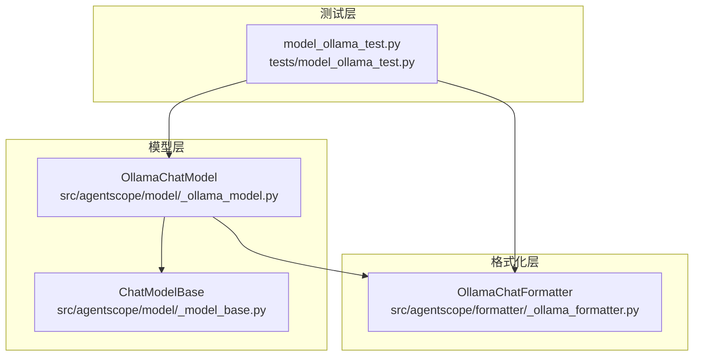
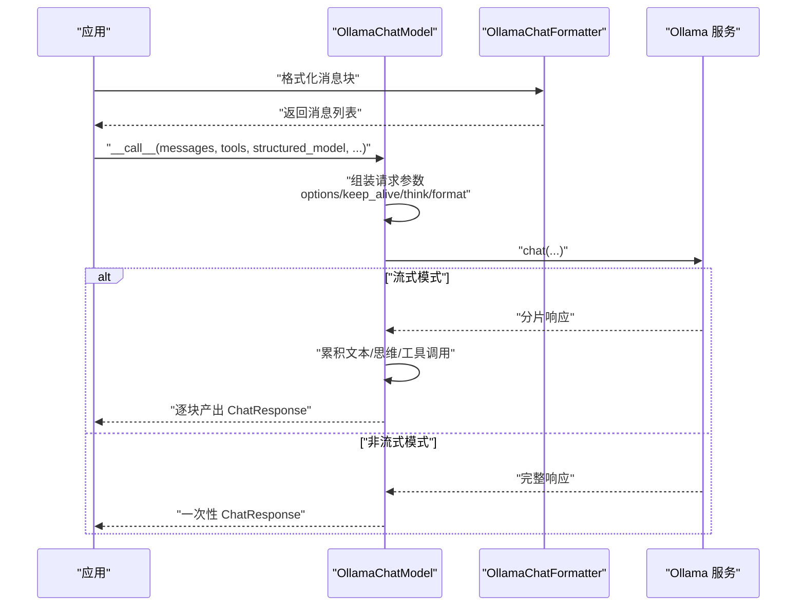
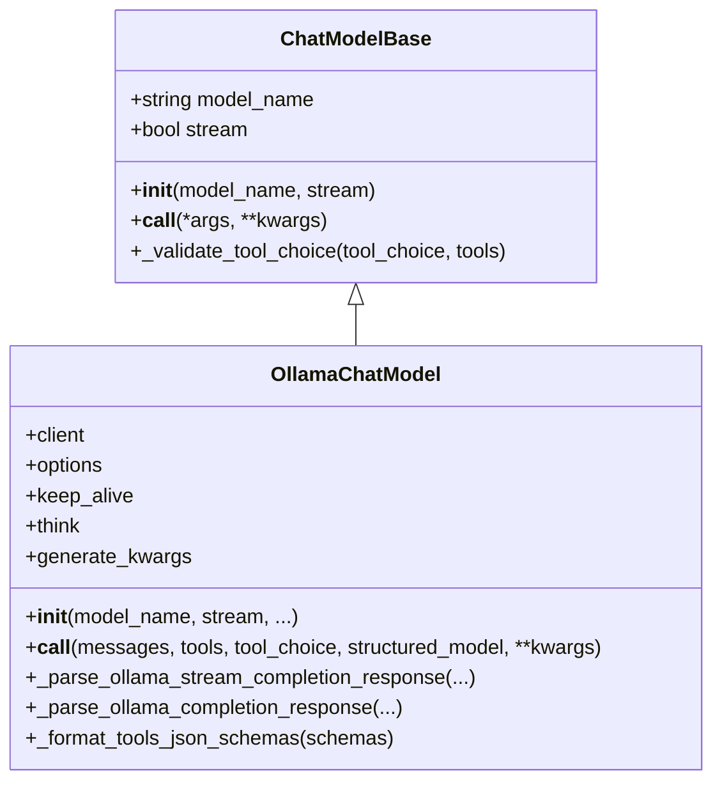
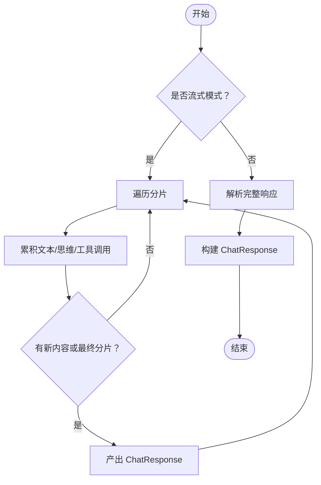
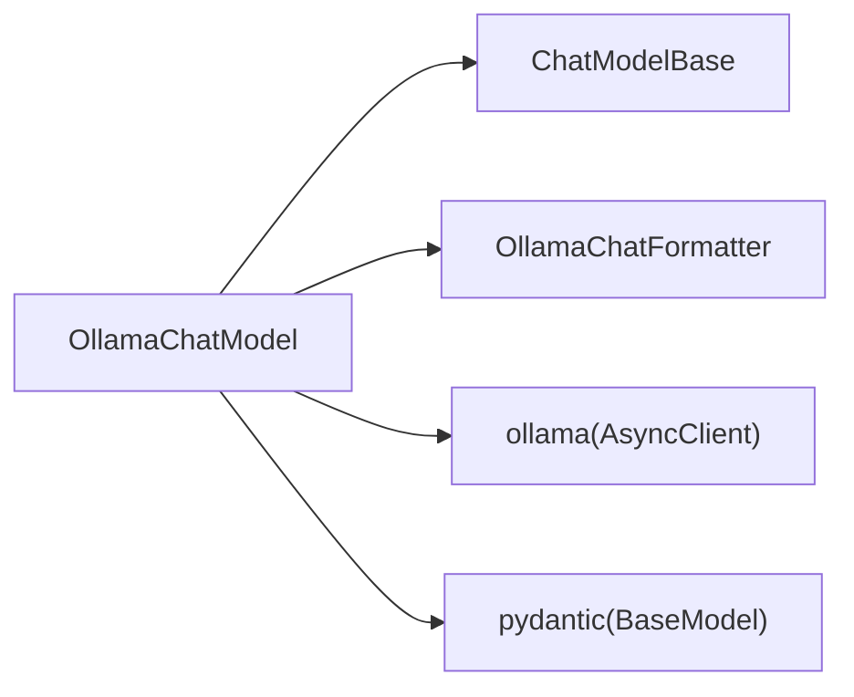

# Ollama本地模型集成

<cite>
**本文引用的文件**
- [src/agentscope/model/_ollama_model.py](file://src/agentscope/model/_ollama_model.py)
- [src/agentscope/model/_model_base.py](file://src/agentscope/model/_model_base.py)
- [src/agentscope/formatter/_ollama_formatter.py](file://src/agentscope/formatter/_ollama_formatter.py)
- [tests/model_ollama_test.py](file://tests/model_ollama_test.py)
</cite>

## 目录
1. [简介](#简介)
2. [项目结构](#项目结构)
3. [核心组件](#核心组件)
4. [架构总览](#架构总览)
5. [详细组件分析](#详细组件分析)
6. [依赖分析](#依赖分析)
7. [性能考虑](#性能考虑)
8. [故障排查指南](#故障排查指南)
9. [结论](#结论)
10. [附录](#附录)

## 简介
本文件面向需要在本地离线环境中集成开源大模型的开发者，系统性讲解如何通过 OllamaChatModel 类与本地 Ollama 服务进行交互。内容涵盖：
- 服务端地址配置、模型名称指定与请求参数调整
- 流式响应处理机制与性能特征
- 与 ChatModelBase 基类的实现关系
- 使用示例（含离线部署与调用）
- 常见部署问题与性能优化建议

## 项目结构
与 Ollama 集成相关的核心文件位于模型与格式化模块中，测试用例覆盖初始化、工具调用、思维块、结构化输出以及流式响应等关键路径。

图表来源
- [src/agentscope/model/_ollama_model.py](file://src/agentscope/model/_ollama_model.py#L1-L353)
- [src/agentscope/model/_model_base.py](file://src/agentscope/model/_model_base.py#L1-L78)
- [src/agentscope/formatter/_ollama_formatter.py](file://src/agentscope/formatter/_ollama_formatter.py#L1-L442)
- [tests/model_ollama_test.py](file://tests/model_ollama_test.py#L1-L368)

章节来源
- [src/agentscope/model/_ollama_model.py](file://src/agentscope/model/_ollama_model.py#L1-L353)
- [src/agentscope/model/_model_base.py](file://src/agentscope/model/_model_base.py#L1-L78)
- [src/agentscope/formatter/_ollama_formatter.py](file://src/agentscope/formatter/_ollama_formatter.py#L1-L442)
- [tests/model_ollama_test.py](file://tests/model_ollama_test.py#L1-L368)

## 核心组件
- OllamaChatModel：封装对本地 Ollama 服务的异步调用，支持普通响应与流式响应，支持工具调用、思维块与结构化输出。
- ChatModelBase：定义统一的聊天模型接口与基础能力（模型名、是否流式）。
- OllamaChatFormatter：将消息块（文本、图像、工具调用/结果）转换为 Ollama API 所需的消息格式。

章节来源
- [src/agentscope/model/_ollama_model.py](file://src/agentscope/model/_ollama_model.py#L32-L353)
- [src/agentscope/model/_model_base.py](file://src/agentscope/model/_model_base.py#L13-L78)
- [src/agentscope/formatter/_ollama_formatter.py](file://src/agentscope/formatter/_ollama_formatter.py#L71-L263)

## 架构总览
下图展示从应用到本地 Ollama 服务的调用链路，以及消息格式化与响应解析的关键节点。

图表来源
- [src/agentscope/model/_ollama_model.py](file://src/agentscope/model/_ollama_model.py#L99-L171)
- [src/agentscope/formatter/_ollama_formatter.py](file://src/agentscope/formatter/_ollama_formatter.py#L123-L263)
- [tests/model_ollama_test.py](file://tests/model_ollama_test.py#L261-L288)

## 详细组件分析

### OllamaChatModel 类
- 初始化参数要点
  - 模型名：用于选择本地已拉取的模型镜像或本地模型。
  - 是否流式：控制响应是整包返回还是分片返回。
  - options：传递给 Ollama 的额外参数（如温度、top_p 等）。
  - keep_alive：模型常驻内存的时间策略。
  - enable_thinking：启用特定模型的“思考”能力（如 qwen3、deepseek-r1）。
  - host：Ollama 服务地址，默认使用本地默认端口。
  - client_kwargs/generate_kwargs：分别用于初始化客户端与生成请求的附加关键字参数。
- 调用流程
  - 组装请求参数（model/messages/stream/options/keep_alive/format/tools/think 等）。
  - 发起异步调用，根据 stream 决定进入流式解析或一次性解析。
  - 解析阶段将文本、思维块、工具调用块与用量信息整合为 ChatResponse 或按块产出。
- 工具调用与结构化输出
  - 工具调用：将工具 JSON Schema 注入请求；解析时将函数名与参数转为工具调用块。
  - 结构化输出：通过 format 字段传入 Pydantic 模式 JSON Schema，解析时尝试修复并放入元数据。
- 思维块处理
  - 当模型返回思维内容时，会以 ThinkingBlock 形式加入内容块集合。

图表来源
- [src/agentscope/model/_model_base.py](file://src/agentscope/model/_model_base.py#L13-L78)
- [src/agentscope/model/_ollama_model.py](file://src/agentscope/model/_ollama_model.py#L32-L353)

章节来源
- [src/agentscope/model/_ollama_model.py](file://src/agentscope/model/_ollama_model.py#L32-L353)

### ChatModelBase 基类
- 角色与职责
  - 定义统一的模型接口与基础字段（model_name、stream）。
  - 提供工具选择参数校验辅助方法（tool_choice 合法性检查）。
- 与 OllamaChatModel 的关系
  - OllamaChatModel 继承自 ChatModelBase，复用其初始化逻辑与抽象接口，专注于 Ollama 特定的请求与解析细节。

章节来源
- [src/agentscope/model/_model_base.py](file://src/agentscope/model/_model_base.py#L13-L78)
- [src/agentscope/model/_ollama_model.py](file://src/agentscope/model/_ollama_model.py#L87-L98)

### OllamaChatFormatter 格式化器
- 支持的消息块类型：文本、图像、工具调用、工具结果。
- 多模态与工具链路
  - 图像：支持 URL 与本地文件，自动转换为 Ollama 可接受的图像数据。
  - 工具结果：可选地将图片从工具结果提升为用户消息中的图像，便于后续模型处理。
- 输出格式
  - 将消息序列转换为 Ollama API 所需的 role/content/tool_calls/images 等字段。

章节来源
- [src/agentscope/formatter/_ollama_formatter.py](file://src/agentscope/formatter/_ollama_formatter.py#L71-L263)

### 流式响应处理机制
- 流式解析要点
  - 累积文本与思维内容，聚合工具调用（按索引+函数名生成稳定 ID），逐块计算用量并产出 ChatResponse。
  - 在最终分片（done=true）且存在内容时，一次性产出最终响应。
- 非流式解析要点
  - 整体响应解析后，将文本、思维块、工具调用与用量封装为一次性的 ChatResponse。

图表来源
- [src/agentscope/model/_ollama_model.py](file://src/agentscope/model/_ollama_model.py#L173-L271)
- [src/agentscope/model/_ollama_model.py](file://src/agentscope/model/_ollama_model.py#L272-L345)

章节来源
- [src/agentscope/model/_ollama_model.py](file://src/agentscope/model/_ollama_model.py#L173-L345)

### 使用示例（离线环境）
以下示例基于测试用例的调用方式，展示如何在本地离线环境中部署与调用 Ollama 模型：
- 初始化模型
  - 指定模型名与是否流式；可设置 options、keep_alive、enable_thinking、host 等参数。
- 准备消息
  - 使用 OllamaChatFormatter 将消息块（文本、图像、工具调用/结果）格式化为 Ollama API 所需的消息列表。
- 调用模型
  - 对于流式模式，遍历异步生成器逐块消费；对于非流式模式，直接获取一次性响应。
- 工具调用与结构化输出
  - 传入工具 JSON Schema 与结构化模型（Pydantic），并在响应中读取工具调用块与元数据。

章节来源
- [tests/model_ollama_test.py](file://tests/model_ollama_test.py#L80-L113)
- [tests/model_ollama_test.py](file://tests/model_ollama_test.py#L114-L193)
- [tests/model_ollama_test.py](file://tests/model_ollama_test.py#L194-L231)
- [tests/model_ollama_test.py](file://tests/model_ollama_test.py#L232-L259)
- [tests/model_ollama_test.py](file://tests/model_ollama_test.py#L261-L288)
- [tests/model_ollama_test.py](file://tests/model_ollama_test.py#L289-L313)
- [src/agentscope/formatter/_ollama_formatter.py](file://src/agentscope/formatter/_ollama_formatter.py#L123-L263)

## 依赖分析
- 组件耦合
  - OllamaChatModel 强依赖 Ollama 客户端（异步），并通过 ChatModelBase 提供统一接口。
  - 格式化器独立于具体模型实现，仅负责消息格式转换。
- 外部依赖
  - ollama 包（异步客户端）
  - pydantic（结构化输出）
  - agentscope 的消息块类型与用量统计

图表来源
- [src/agentscope/model/_ollama_model.py](file://src/agentscope/model/_ollama_model.py#L1-L353)
- [src/agentscope/model/_model_base.py](file://src/agentscope/model/_model_base.py#L1-L78)
- [src/agentscope/formatter/_ollama_formatter.py](file://src/agentscope/formatter/_ollama_formatter.py#L1-L442)

章节来源
- [src/agentscope/model/_ollama_model.py](file://src/agentscope/model/_ollama_model.py#L1-L353)
- [src/agentscope/model/_model_base.py](file://src/agentscope/model/_model_base.py#L1-L78)
- [src/agentscope/formatter/_ollama_formatter.py](file://src/agentscope/formatter/_ollama_formatter.py#L1-L442)

## 性能考虑
- 流式响应的优势
  - 降低首字延迟，适合实时对话场景；逐块产出便于前端增量渲染。
- 资源占用与常驻
  - keep_alive 参数影响模型在内存中的常驻时间，合理设置可减少重复加载开销。
- 工具调用与多模态
  - 图像数据在本地文件与网络 URL 间转换可能带来 I/O 开销；建议在应用侧尽量复用缓存。
- 结构化输出
  - 使用 format 字段时，解析阶段会尝试修复 JSON 文本，注意输入质量对稳定性的影响。

[本节为通用指导，不直接分析具体文件]

## 故障排查指南
- 服务连接失败
  - 现象：初始化或调用时报错，提示无法连接 Ollama 服务。
  - 排查要点：
    - 确认本地 Ollama 服务已启动且监听在默认端口或指定 host。
    - 如需离线部署，请先在可联网机器上拉取所需模型镜像，再将镜像复制到目标机器并加载。
    - 若使用自定义 host，请确保网络可达与防火墙放行。
- 模型下载错误
  - 现象：首次调用时报模型不存在或下载失败。
  - 排查要点：
    - 在目标机器上提前执行模型拉取命令，确保模型已存在于本地存储。
    - 检查磁盘空间与权限，确认模型文件可写。
- 工具调用未生效
  - 现象：传入 tools 后未触发工具调用。
  - 排查要点：
    - 确保使用的模型支持工具调用；部分模型版本或配置可能限制该功能。
    - 检查工具 JSON Schema 的完整性与命名一致性。
- 结构化输出解析异常
  - 现象：期望的结构化 JSON 未正确解析到元数据。
  - 排查要点：
    - 确认模型输出符合 format 模式；必要时放宽容错策略或修正模式定义。
- 流式响应卡顿
  - 现象：流式输出延迟较大或吞吐不足。
  - 排查要点：
    - 适当增大 keep_alive，避免频繁加载模型。
    - 检查网络与 I/O 瓶颈（尤其是图像 URL 下载）。

章节来源
- [src/agentscope/model/_ollama_model.py](file://src/agentscope/model/_ollama_model.py#L79-L88)
- [tests/model_ollama_test.py](file://tests/model_ollama_test.py#L114-L193)
- [tests/model_ollama_test.py](file://tests/model_ollama_test.py#L232-L259)

## 结论
通过 OllamaChatModel 与 Ollama 服务的深度集成，结合 ChatModelBase 的统一接口与 OllamaChatFormatter 的消息格式化能力，可以在本地离线环境中稳定、高效地运行开源大模型。合理配置服务地址、模型名与请求参数，充分利用流式响应与结构化输出能力，可显著提升用户体验与开发效率。遇到部署问题时，优先检查服务连通性、模型可用性与工具/多模态配置，配合 keep_alive 与资源管理策略优化性能。

[本节为总结性内容，不直接分析具体文件]

## 附录
- 关键参数速查
  - 模型名：选择本地已存在的模型镜像或模型名称。
  - 是否流式：true 时采用分片返回，false 时一次性返回。
  - options：温度、top_p 等推理参数。
  - keep_alive：模型常驻内存时长。
  - enable_thinking：启用特定模型的“思考”能力。
  - host：Ollama 服务地址。
  - client_kwargs/generate_kwargs：客户端初始化与生成请求的附加参数。
- 常见调用路径参考
  - 初始化与调用：[tests/model_ollama_test.py](file://tests/model_ollama_test.py#L80-L113)
  - 工具调用集成：[tests/model_ollama_test.py](file://tests/model_ollama_test.py#L140-L193)
  - 结构化输出集成：[tests/model_ollama_test.py](file://tests/model_ollama_test.py#L232-L259)
  - 流式响应处理：[tests/model_ollama_test.py](file://tests/model_ollama_test.py#L261-L288)
  - 选项参数透传：[tests/model_ollama_test.py](file://tests/model_ollama_test.py#L289-L313)