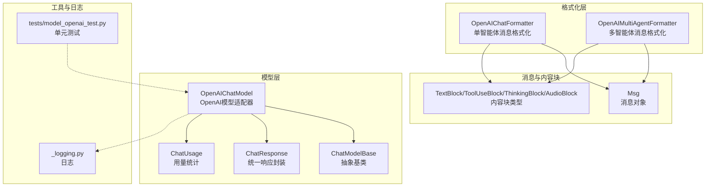
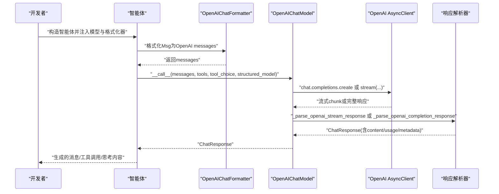
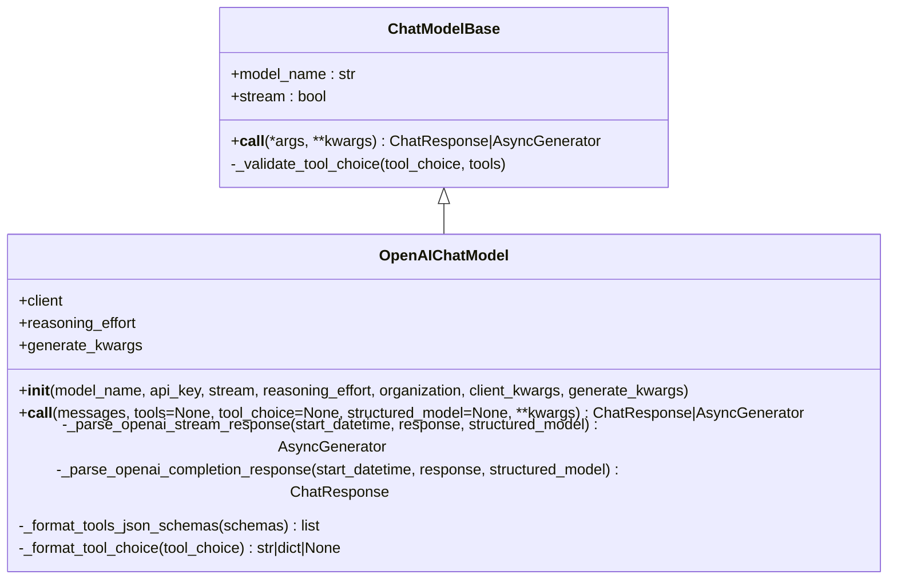
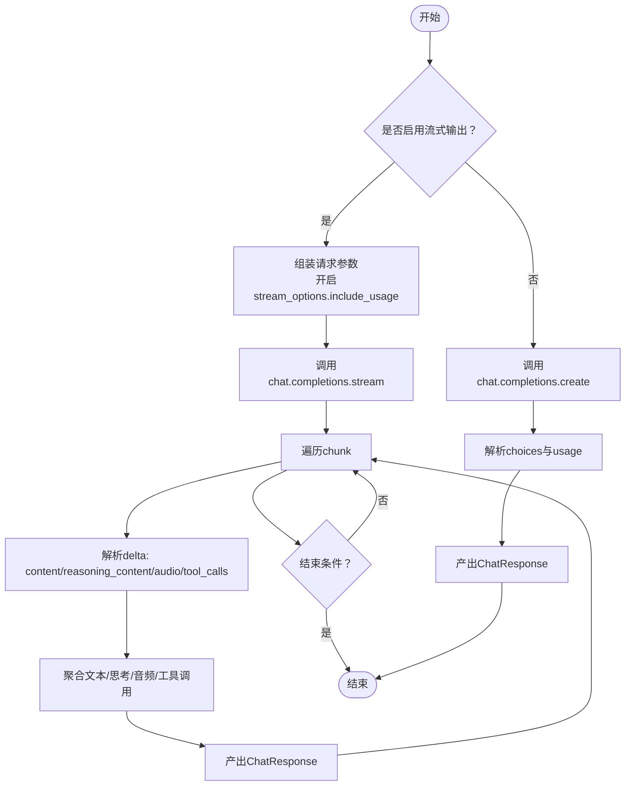
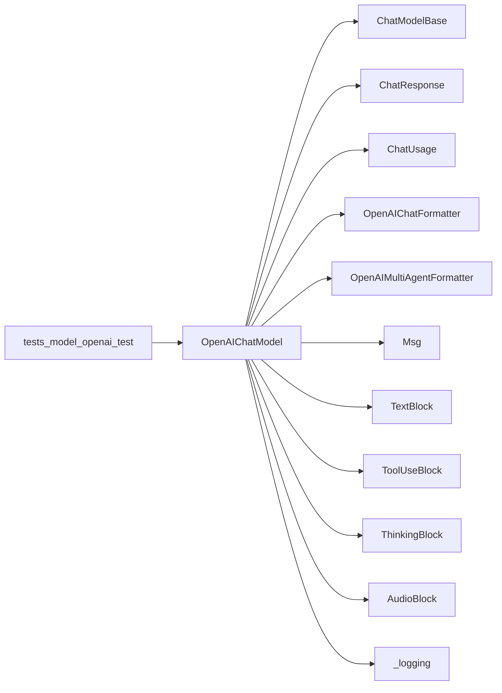

# OpenAI模型集成

<cite>
**本文引用的文件**
- [src/agentscope/model/_openai_model.py](file://src/agentscope/model/_openai_model.py)
- [src/agentscope/model/_model_base.py](file://src/agentscope/model/_model_base.py)
- [src/agentscope/model/_model_response.py](file://src/agentscope/model/_model_response.py)
- [src/agentscope/model/_model_usage.py](file://src/agentscope/model/_model_usage.py)
- [src/agentscope/formatter/_openai_formatter.py](file://src/agentscope/formatter/_openai_formatter.py)
- [src/agentscope/message/_message_base.py](file://src/agentscope/message/_message_base.py)
- [src/agentscope/_logging.py](file://src/agentscope/_logging.py)
- [tests/model_openai_test.py](file://tests/model_openai_test.py)
- [docs/tutorial/en/src/task_model.py](file://docs/tutorial/en/src/task_model.py)
- [examples/functionality/stream_printing_messages/single_agent.py](file://examples/functionality/stream_printing_messages/single_agent.py)
</cite>

## 目录
1. [简介](#简介)
2. [项目结构](#项目结构)
3. [核心组件](#核心组件)
4. [架构总览](#架构总览)
5. [详细组件分析](#详细组件分析)
6. [依赖分析](#依赖分析)
7. [性能考虑](#性能考虑)
8. [故障排查指南](#故障排查指南)
9. [结论](#结论)
10. [附录](#附录)

## 简介
本文件面向希望在AgentScope中集成OpenAI服务的开发者，系统性讲解如何通过OpenAIChatModel类完成OpenAI模型接入，包括：
- API密钥与客户端配置
- 模型参数设置（如temperature、max_tokens等）
- 流式响应处理与非流式响应解析
- 与ChatModelBase基类的继承关系与方法重写
- 错误处理与异常场景（网络异常、速率限制、参数校验等）
- 在多智能体工作流中的最佳实践（成本控制、性能优化）

## 项目结构
围绕OpenAI模型集成的相关模块主要分布在以下路径：
- 模型层：OpenAIChatModel、ChatModelBase、ChatResponse、ChatUsage
- 格式化层：OpenAIChatFormatter/OpenAIMultiAgentFormatter
- 消息与内容块：Msg、TextBlock、ToolUseBlock、ThinkingBlock、AudioBlock等
- 日志与测试：_logging.py、tests/model_openai_test.py
- 教程与示例：docs/tutorial/en/src/task_model.py、examples/.../single_agent.py

图表来源
- [src/agentscope/model/_openai_model.py](file://src/agentscope/model/_openai_model.py#L66-L580)
- [src/agentscope/model/_model_base.py](file://src/agentscope/model/_model_base.py#L1-L78)
- [src/agentscope/model/_model_response.py](file://src/agentscope/model/_model_response.py#L1-L43)
- [src/agentscope/model/_model_usage.py](file://src/agentscope/model/_model_usage.py#L1-L24)
- [src/agentscope/formatter/_openai_formatter.py](file://src/agentscope/formatter/_openai_formatter.py#L1-L521)
- [src/agentscope/message/_message_base.py](file://src/agentscope/message/_message_base.py#L1-L242)
- [src/agentscope/_logging.py](file://src/agentscope/_logging.py#L1-L48)
- [tests/model_openai_test.py](file://tests/model_openai_test.py#L1-L389)

章节来源
- [src/agentscope/model/_openai_model.py](file://src/agentscope/model/_openai_model.py#L66-L145)
- [src/agentscope/model/_model_base.py](file://src/agentscope/model/_model_base.py#L1-L78)
- [src/agentscope/formatter/_openai_formatter.py](file://src/agentscope/formatter/_openai_formatter.py#L158-L521)

## 核心组件
- OpenAIChatModel：OpenAI聊天模型适配器，负责初始化OpenAI AsyncClient、调用chat.completions接口、解析流式与非流式响应、支持工具调用与结构化输出。
- ChatModelBase：所有聊天模型的抽象基类，定义统一的__call__签名与工具选择校验逻辑。
- ChatResponse：统一的模型响应封装，包含content、usage、metadata等字段。
- ChatUsage：记录输入/输出token数与耗时。
- OpenAIChatFormatter/OpenAIMultiAgentFormatter：将Msg与内容块转换为OpenAI API所需的messages格式，支持多模态（文本、图像、音频）、工具调用与结果回传。
- Msg与内容块：消息载体及文本、工具调用、思考、音频等多模态内容块。

章节来源
- [src/agentscope/model/_openai_model.py](file://src/agentscope/model/_openai_model.py#L66-L580)
- [src/agentscope/model/_model_base.py](file://src/agentscope/model/_model_base.py#L1-L78)
- [src/agentscope/model/_model_response.py](file://src/agentscope/model/_model_response.py#L1-L43)
- [src/agentscope/model/_model_usage.py](file://src/agentscope/model/_model_usage.py#L1-L24)
- [src/agentscope/formatter/_openai_formatter.py](file://src/agentscope/formatter/_openai_formatter.py#L158-L521)
- [src/agentscope/message/_message_base.py](file://src/agentscope/message/_message_base.py#L1-L242)

## 架构总览
OpenAIChatModel通过继承ChatModelBase，实现统一的异步调用接口；在内部使用openai.AsyncClient发起请求，并根据是否启用流式输出分别进入不同的解析流程。格式化器负责将Msg与内容块转换为OpenAI API期望的messages列表，支持工具函数schema与多模态输入。

图表来源
- [src/agentscope/model/_openai_model.py](file://src/agentscope/model/_openai_model.py#L146-L281)
- [src/agentscope/formatter/_openai_formatter.py](file://src/agentscope/formatter/_openai_formatter.py#L209-L357)
- [src/agentscope/model/_model_response.py](file://src/agentscope/model/_model_response.py#L19-L43)

## 详细组件分析

### OpenAIChatModel类分析
- 继承关系与职责
  - 继承自ChatModelBase，必须实现__call__方法，返回ChatResponse或异步生成ChatResponse。
  - 负责初始化openai.AsyncClient，拼装messages与generate_kwargs，处理工具调用与结构化输出，解析流式与非流式响应。
- 关键参数
  - model_name：模型名称
  - api_key/organization：认证信息，可从环境变量读取
  - stream：是否启用流式输出
  - reasoning_effort：推理强度（o3/o4系列）
  - client_kwargs/generate_kwargs：分别用于初始化客户端与生成参数（如temperature、max_tokens、top_p、seed等）
- 方法重写与关键流程
  - __call__：参数校验、消息格式化、工具schema与tool_choice格式化、流式/非流式分支、结构化输出分支、usage统计与元数据提取
  - _parse_openai_stream_response：逐chunk解析，聚合文本、思考、音频、工具调用，产出多个ChatResponse
  - _parse_openai_completion_response：解析完整响应，产出单个ChatResponse
  - _format_tools_json_schemas/_format_tool_choice：兼容不同tool_choice模式
- 特殊处理
  - 对“omni”系列模型进行音频base64前缀修正
  - 结构化输出时强制禁用流式、覆盖tools与tool_choice

图表来源
- [src/agentscope/model/_model_base.py](file://src/agentscope/model/_model_base.py#L13-L78)
- [src/agentscope/model/_openai_model.py](file://src/agentscope/model/_openai_model.py#L66-L580)

章节来源
- [src/agentscope/model/_openai_model.py](file://src/agentscope/model/_openai_model.py#L66-L145)
- [src/agentscope/model/_openai_model.py](file://src/agentscope/model/_openai_model.py#L146-L281)
- [src/agentscope/model/_openai_model.py](file://src/agentscope/model/_openai_model.py#L282-L580)

### ChatModelBase基类与方法重写
- 抽象方法__call__：统一的异步调用接口，返回ChatResponse或异步生成ChatResponse
- 工具选择校验：_validate_tool_choice确保tool_choice合法（auto/none/required或具体函数名）

章节来源
- [src/agentscope/model/_model_base.py](file://src/agentscope/model/_model_base.py#L13-L78)

### ChatResponse与ChatUsage
- ChatResponse：封装content（文本、工具调用、思考、音频等）、usage（token与耗时）、metadata（结构化输出时存放解析后的数据）
- ChatUsage：记录input_tokens、output_tokens与time

章节来源
- [src/agentscope/model/_model_response.py](file://src/agentscope/model/_model_response.py#L19-L43)
- [src/agentscope/model/_model_usage.py](file://src/agentscope/model/_model_usage.py#L9-L24)

### OpenAIChatFormatter与多模态支持
- 支持文本、图像、音频、工具调用与工具结果回传
- 图像：支持URL与base64两种来源，自动转换为OpenAI格式
- 音频：支持本地文件与Web URL，自动转为base64并标注格式
- 工具结果图片提升：可将工具结果中的图片提升为用户消息，便于某些API不支持工具结果内图片的情况
- 多智能体格式化：将多实体对话历史整合为用户消息的文本块，保留历史标签

章节来源
- [src/agentscope/formatter/_openai_formatter.py](file://src/agentscope/formatter/_openai_formatter.py#L1-L521)

### 流式响应处理流程

图表来源
- [src/agentscope/model/_openai_model.py](file://src/agentscope/model/_openai_model.py#L237-L281)
- [src/agentscope/model/_openai_model.py](file://src/agentscope/model/_openai_model.py#L282-L437)
- [src/agentscope/model/_openai_model.py](file://src/agentscope/model/_openai_model.py#L438-L542)

## 依赖分析
- OpenAIChatModel依赖
  - openai.AsyncClient：发起异步请求
  - ChatModelBase：继承抽象接口
  - ChatResponse/ChatUsage：统一响应封装与用量统计
  - 内容块类型：TextBlock、ToolUseBlock、ThinkingBlock、AudioBlock
  - 格式化器：OpenAIChatFormatter/OpenAIMultiAgentFormatter
  - 日志：_logging.logger
- 与测试的关系
  - tests/model_openai_test.py覆盖了初始化、工具调用、推理强度、结构化输出、流式响应等场景

图表来源
- [src/agentscope/model/_openai_model.py](file://src/agentscope/model/_openai_model.py#L66-L580)
- [src/agentscope/model/_model_base.py](file://src/agentscope/model/_model_base.py#L13-L78)
- [src/agentscope/model/_model_response.py](file://src/agentscope/model/_model_response.py#L19-L43)
- [src/agentscope/model/_model_usage.py](file://src/agentscope/model/_model_usage.py#L9-L24)
- [src/agentscope/formatter/_openai_formatter.py](file://src/agentscope/formatter/_openai_formatter.py#L158-L521)
- [src/agentscope/message/_message_base.py](file://src/agentscope/message/_message_base.py#L1-L242)
- [src/agentscope/_logging.py](file://src/agentscope/_logging.py#L1-L48)
- [tests/model_openai_test.py](file://tests/model_openai_test.py#L1-L389)

章节来源
- [tests/model_openai_test.py](file://tests/model_openai_test.py#L1-L389)

## 性能考虑
- 流式输出
  - 启用stream可降低首字延迟，适合实时交互；但需注意逐chunk解析带来的CPU开销
  - 建议在高并发场景下评估内存占用与异步迭代开销
- 结构化输出
  - 使用structured_model时会禁用流式并强制使用parse接口，减少工具调用干扰，提高输出稳定性
- 参数预设
  - 将temperature、max_tokens等常用参数放入generate_kwargs，避免每次调用重复传参
- 多模态输入
  - 图像与音频会增加token消耗，建议按需启用并控制分辨率/时长
- 客户端超时与重试
  - 可通过client_kwargs传入timeout等参数；结合业务层重试策略以应对瞬时网络抖动

[本节为通用指导，无需特定文件引用]

## 故障排查指南
- 初始化与参数校验
  - 不得同时指定已废弃的client_args与新的client_kwargs，否则抛出错误
  - 未知关键字参数会被警告忽略
  - 工具选择tool_choice必须为字符串且在允许集合或可用函数名范围内，否则抛出TypeError/ValueError
- 请求与响应
  - messages必须为列表且每条包含role与content键，否则抛出错误
  - 流式响应中若出现usage，会在有内容时先行产出一次中间响应
- 日志与调试
  - 使用logger记录警告与异常信息，便于定位问题
- 单元测试参考
  - tests/model_openai_test.py提供了初始化、工具调用、推理强度、结构化输出、流式响应等场景的断言，可作为行为验证的参考

章节来源
- [src/agentscope/model/_openai_model.py](file://src/agentscope/model/_openai_model.py#L110-L132)
- [src/agentscope/model/_openai_model.py](file://src/agentscope/model/_openai_model.py#L196-L207)
- [src/agentscope/model/_model_base.py](file://src/agentscope/model/_model_base.py#L46-L78)
- [src/agentscope/_logging.py](file://src/agentscope/_logging.py#L1-L48)
- [tests/model_openai_test.py](file://tests/model_openai_test.py#L1-L389)

## 结论
OpenAIChatModel在AgentScope中提供了统一、可扩展的OpenAI服务接入能力。通过ChatModelBase抽象、OpenAIChatFormatter多模态支持以及完善的流式/非流式响应解析，开发者可以快速将OpenAI模型集成到智能体系统中。配合结构化输出、工具调用与用量统计，可在多智能体工作流中实现更稳定、可控的推理体验。

[本节为总结，无需特定文件引用]

## 附录

### API密钥与客户端配置
- 优先从环境变量OPENAI_API_KEY与OPENAI_ORGANIZATION读取
- 可通过client_kwargs传入base_url等参数以适配OpenAI兼容服务（如vLLM、DeepSeek等）
- 可通过generate_kwargs预设temperature、max_tokens等生成参数

章节来源
- [src/agentscope/model/_openai_model.py](file://src/agentscope/model/_openai_model.py#L81-L107)
- [docs/tutorial/en/src/task_model.py](file://docs/tutorial/en/src/task_model.py#L58-L83)

### 模型参数设置示例路径
- temperature、max_tokens等参数预设：见初始化示例片段路径
- OpenAI兼容服务端点配置：见初始化示例片段路径

章节来源
- [docs/tutorial/en/src/task_model.py](file://docs/tutorial/en/src/task_model.py#L58-L83)

### 流式响应处理示例路径
- 单智能体流式打印示例：见示例文件路径
- OpenAIChatModel流式响应解析：见源码路径

章节来源
- [examples/functionality/stream_printing_messages/single_agent.py](file://examples/functionality/stream_printing_messages/single_agent.py#L1-L63)
- [src/agentscope/model/_openai_model.py](file://src/agentscope/model/_openai_model.py#L237-L281)

### 与ChatModelBase的继承关系与方法重写
- 继承关系：OpenAIChatModel -> ChatModelBase
- 必须重写__call__，并可重写工具schema与tool_choice格式化方法
- 工具选择校验由基类提供

章节来源
- [src/agentscope/model/_model_base.py](file://src/agentscope/model/_model_base.py#L13-L78)
- [src/agentscope/model/_openai_model.py](file://src/agentscope/model/_openai_model.py#L544-L580)

### 多智能体工作流最佳实践
- 成本控制
  - 控制max_tokens与图像细节级别，减少token消耗
  - 合理使用结构化输出，避免不必要的工具调用
- 性能优化
  - 在交互场景启用stream，降低首字延迟
  - 对高频调用设置合理的超时与重试策略
- 可靠性
  - 使用OpenAIChatFormatter/OpenAIMultiAgentFormatter保证消息格式一致性
  - 利用ChatUsage统计token与耗时，持续监控成本与性能

[本节为通用指导，无需特定文件引用]