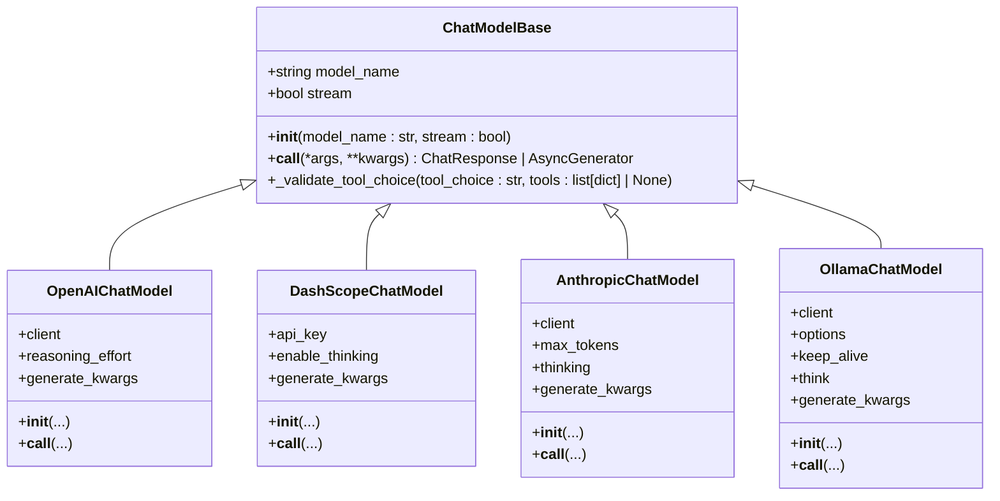
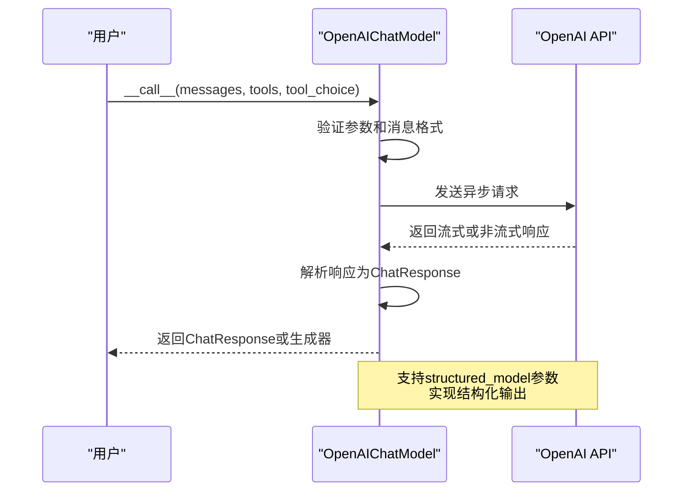
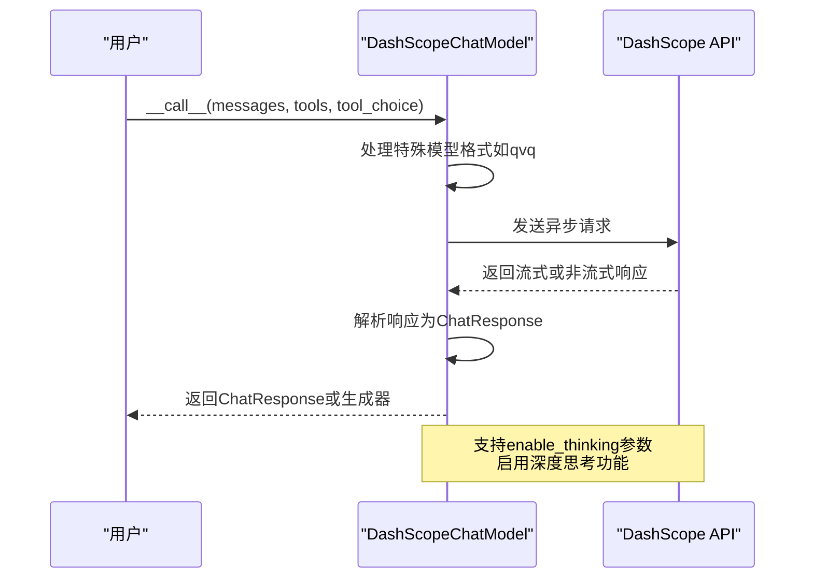
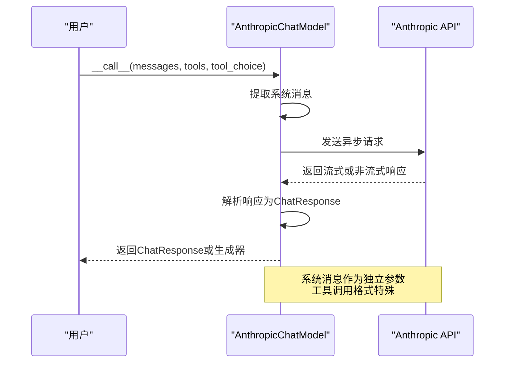
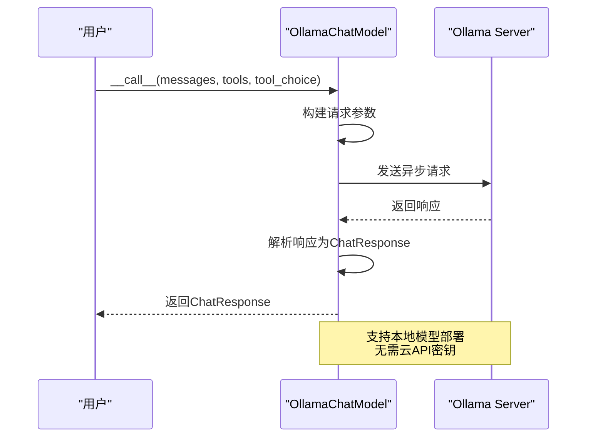
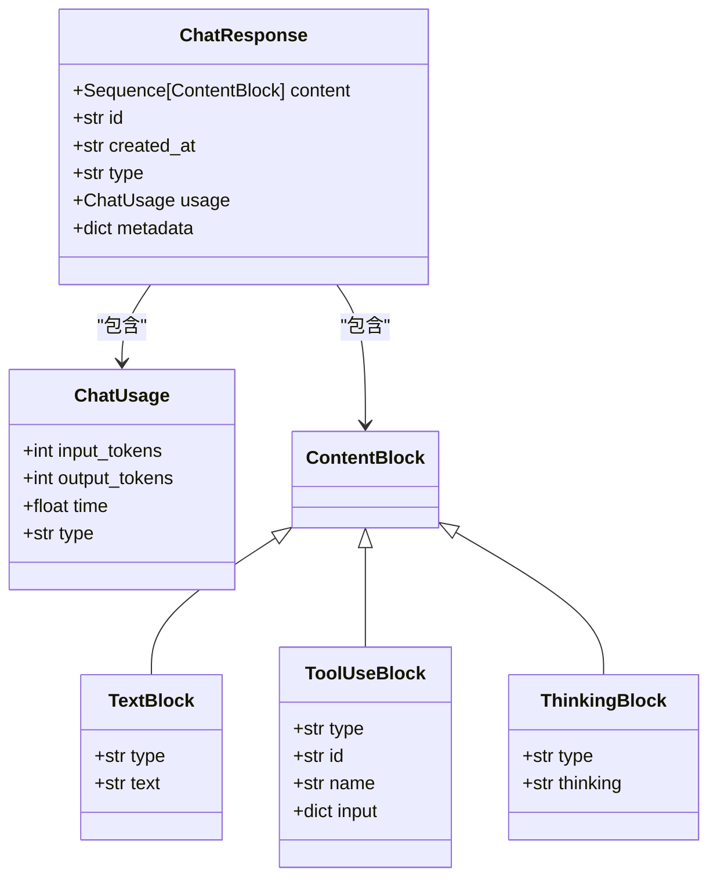

# 模型集成

<cite>
**本文档引用的文件**   
- [model_base.py](file://src/agentscope/model/_model_base.py)
- [openai_model.py](file://src/agentscope/model/_openai_model.py)
- [dashscope_model.py](file://src/agentscope/model/_dashscope_model.py)
- [anthropic_model.py](file://src/agentscope/model/_anthropic_model.py)
- [ollama_model.py](file://src/agentscope/model/_ollama_model.py)
- [model_response.py](file://src/agentscope/model/_model_response.py)
- [model_usage.py](file://src/agentscope/model/_model_usage.py)
- [openai_formatter.py](file://src/agentscope/formatter/_openai_formatter.py)
- [dashscope_formatter.py](file://src/agentscope/formatter/_dashscope_formatter.py)
- [anthropic_formatter.py](file://src/agentscope/formatter/_anthropic_formatter.py)
- [ollama_formatter.py](file://src/agentscope/formatter/_ollama_formatter.py)
</cite>

## 目录
1. [简介](#简介)
2. [模型基类设计](#模型基类设计)
3. [具体提供商实现](#具体提供商实现)
   - [OpenAI](#openai)
   - [DashScope](#dashscope)
   - [Anthropic](#anthropic)
   - [Ollama](#ollama)
4. [配置与使用](#配置与使用)
5. [性能调优](#性能调优)
6. [故障排除](#故障排除)

## 简介

本文档详细介绍了AgentScope框架中模型集成的实现机制。框架通过抽象化不同LLM提供商的接口，实现了模型的可插拔性，使开发者能够轻松地在不同模型提供商之间切换，而无需修改核心业务逻辑。系统设计了统一的模型基类，各具体提供商通过继承该基类来实现特定功能，同时提供了灵活的配置方式和全面的性能优化选项。

**Section sources**
- [model_base.py](file://src/agentscope/model/_model_base.py#L1-L78)
- [openai_model.py](file://src/agentscope/model/_openai_model.py#L1-L580)

## 模型基类设计

框架的核心是`ChatModelBase`基类，它定义了所有聊天模型必须实现的接口和公共属性。该基类采用抽象基类（ABC）模式，确保所有子类都遵循统一的契约。

**Diagram sources **
- [model_base.py](file://src/agentscope/model/_model_base.py#L13-L78)
- [openai_model.py](file://src/agentscope/model/_openai_model.py#L66-L580)
- [dashscope_model.py](file://src/agentscope/model/_dashscope_model.py#L47-L532)
- [anthropic_model.py](file://src/agentscope/model/_anthropic_model.py#L38-L540)
- [ollama_model.py](file://src/agentscope/model/_ollama_model.py#L32-L353)

`ChatModelBase`类定义了两个核心属性：`model_name`用于标识模型名称，`stream`用于控制是否启用流式输出。其`__call__`方法被声明为抽象方法，要求所有子类必须实现具体的API调用逻辑。此外，基类还提供了`_validate_tool_choice`方法，用于验证工具选择参数的有效性，确保符合预定义的模式（"auto"、"none"、"required"）或可用工具列表中的函数名称。

**Section sources**
- [model_base.py](file://src/agentscope/model/_model_base.py#L13-L78)

## 具体提供商实现

### OpenAI

OpenAI模型实现通过`OpenAIChatModel`类提供，封装了对OpenAI API的异步调用。该实现支持OpenAI API的所有主要功能，包括流式输出、工具调用和结构化输出生成。

**Diagram sources **
- [openai_model.py](file://src/agentscope/model/_openai_model.py#L66-L580)

`OpenAIChatModel`的初始化方法接受`api_key`、`organization`等认证参数，以及`generate_kwargs`等生成参数。其`__call__`方法将内部消息格式转换为OpenAI API所需的格式，并处理流式和非流式响应的解析。特别地，当提供`structured_model`参数时，框架会自动将其转换为工具函数并强制模型使用，从而实现结构化输出生成功能。

**Section sources**
- [openai_model.py](file://src/agentscope/model/_openai_model.py#L66-L580)

### DashScope

DashScope模型实现通过`DashScopeChatModel`类提供，支持阿里云通义千问系列模型。该实现统一了DashScope的Generation和MultimodalConversation两个API，为开发者提供了一致的接口。

**Diagram sources **
- [dashscope_model.py](file://src/agentscope/model/_dashscope_model.py#L47-L532)

`DashScopeChatModel`需要`api_key`进行认证，并支持`enable_thinking`参数来启用模型的深度思考能力。与OpenAI不同，DashScope API仅支持"auto"和"none"两种工具选择模式，因此当用户指定"required"时，框架会自动将其转换为"auto"。该实现还特别处理了Qwen-omni等特定模型的音频数据格式差异。

**Section sources**
- [dashscope_model.py](file://src/agentscope/model/_dashscope_model.py#L47-L532)

### Anthropic

Anthropic模型实现通过`AnthropicChatModel`类提供，支持Claude系列模型。该实现遵循Anthropic API的特定要求，如将系统消息作为独立参数传递。

**Diagram sources **
- [anthropic_model.py](file://src/agentscope/model/_anthropic_model.py#L38-L540)

`AnthropicChatModel`的实现中，系统消息（system message）被从消息列表中提取出来，作为独立的`system`参数传递给API。工具调用的格式也与OpenAI不同，需要将工具模式映射为特定的字典结构（如"auto"映射为{"type": "auto"}）。该实现还支持Claude模型特有的`thinking`参数，用于配置模型的内部推理过程。

**Section sources**
- [anthropic_model.py](file://src/agentscope/model/_anthropic_model.py#L38-L540)

### Ollama

Ollama模型实现通过`OllamaChatModel`类提供，支持本地运行的Ollama模型。该实现直接与Ollama服务器通信，适用于需要本地部署的场景。

**Diagram sources **
- [ollama_model.py](file://src/agentscope/model/_ollama_model.py#L32-L353)

`OllamaChatModel`支持通过`host`参数指定Ollama服务器地址，默认为本地`http://localhost:11434`。它还支持`keep_alive`参数来控制模型在内存中的保留时间，以及`options`参数来传递额外的模型配置。值得注意的是，Ollama目前不支持`tool_choice`参数，因此该参数在调用时会被忽略。

**Section sources**
- [ollama_model.py](file://src/agentscope/model/_ollama_model.py#L32-L353)

## 配置与使用

框架支持多种配置方式，包括代码配置和配置文件。模型响应和使用信息通过`ChatResponse`和`ChatUsage`类进行封装，确保了统一的数据结构。

**Diagram sources **
- [model_response.py](file://src/agentscope/model/_model_response.py#L19-L43)
- [model_usage.py](file://src/agentscope/model/_model_usage.py#L9-L24)

不同提供商的格式化器负责将内部消息格式转换为各API所需的特定格式。例如，`OpenAIChatFormatter`将消息转换为包含`name`、`role`和`content`字段的字典列表，而`DashScopeChatFormatter`则使用`role`和`content`字段。这些格式化器还处理多模态数据（如图像和音频）的编码和传输。

**Section sources**
- [model_response.py](file://src/agentscope/model/_model_response.py#L19-L43)
- [model_usage.py](file://src/agentscope/model/_model_usage.py#L9-L24)
- [openai_formatter.py](file://src/agentscope/formatter/_openai_formatter.py#L158-L521)
- [dashscope_formatter.py](file://src/agentscope/formatter/_dashscope_formatter.py#L147-L626)
- [anthropic_formatter.py](file://src/agentscope/formatter/_anthropic_formatter.py#L13-L254)
- [ollama_formatter.py](file://src/agentscope/formatter/_ollama_formatter.py#L71-L442)

## 性能调优

框架提供了多种性能调优选项，包括连接池管理、超时设置和重试策略。通过`generate_kwargs`参数，用户可以传递如`temperature`、`max_tokens`等生成参数来优化模型输出。对于流式输出，框架通过`stream_options`参数控制包含使用信息，帮助用户监控资源消耗。

**Section sources**
- [openai_model.py](file://src/agentscope/model/_openai_model.py#L69-L108)
- [dashscope_model.py](file://src/agentscope/model/_dashscope_model.py#L51-L59)
- [anthropic_model.py](file://src/agentscope/model/_anthropic_model.py#L41-L50)
- [ollama_model.py](file://src/agentscope/model/_ollama_model.py#L35-L45)

## 故障排除

常见问题包括API密钥错误、模型名称错误和网络连接问题。对于连接问题，应首先检查网络连通性和API端点的可达性。对于API限制问题，应监控`ChatUsage`中的token使用情况，并实施适当的重试策略。当遇到特定模型的格式问题时（如Qwen-omni的音频格式），应参考相关文档进行特殊处理。

**Section sources**
- [openai_model.py](file://src/agentscope/model/_openai_model.py#L135-L136)
- [dashscope_model.py](file://src/agentscope/model/_dashscope_model.py#L153-L154)
- [anthropic_model.py](file://src/agentscope/model/_anthropic_model.py#L109-L114)
- [ollama_model.py](file://src/agentscope/model/_ollama_model.py#L79-L85)