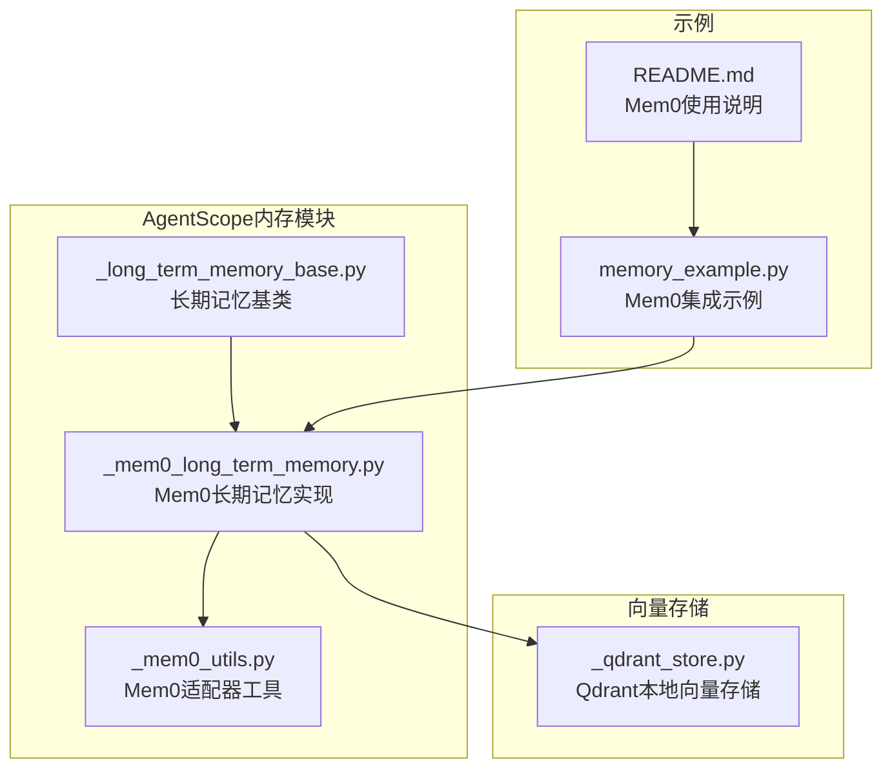
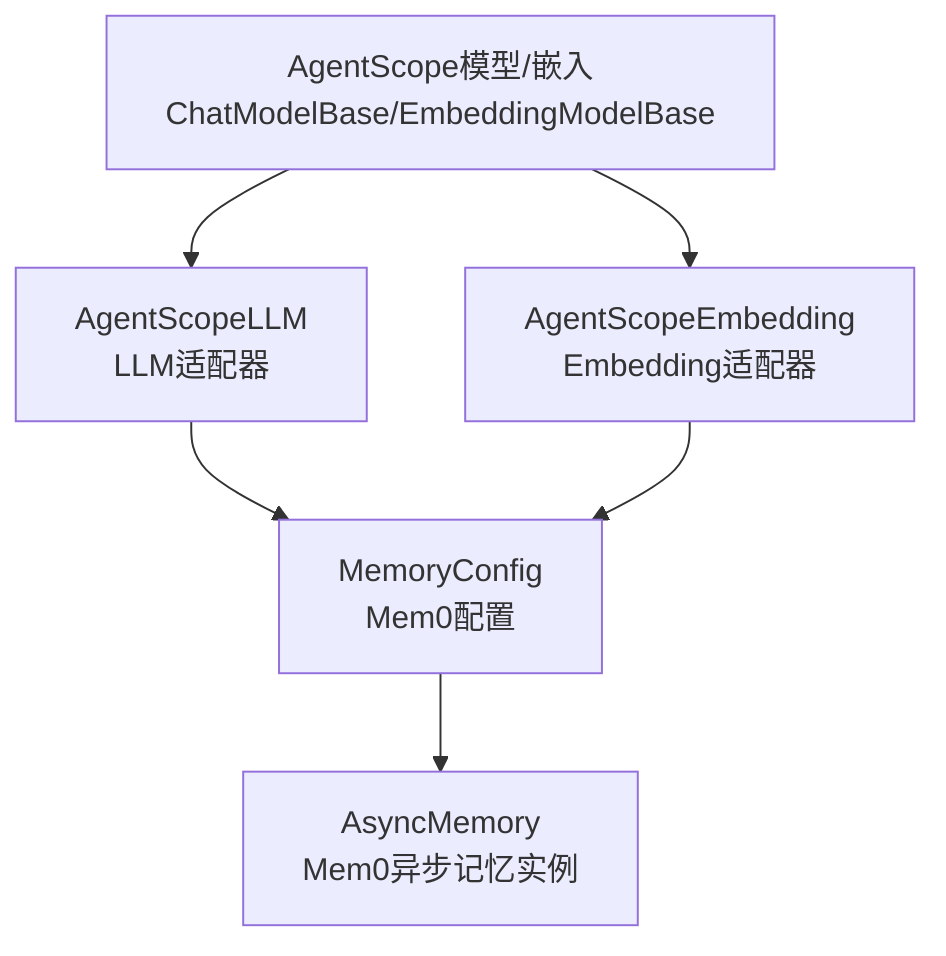
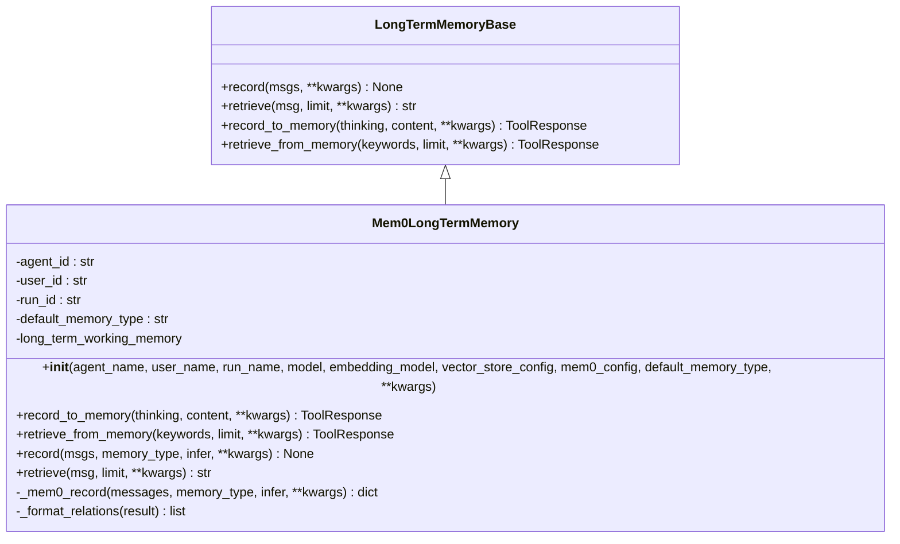
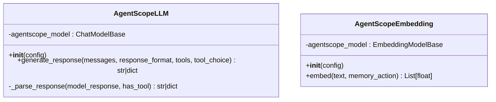
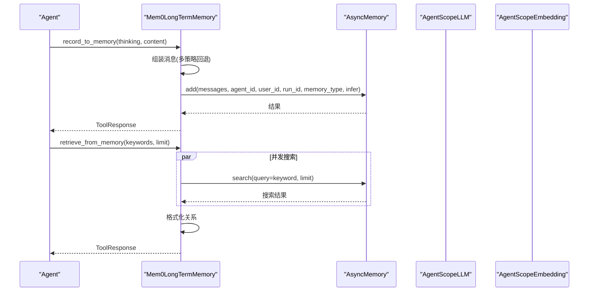
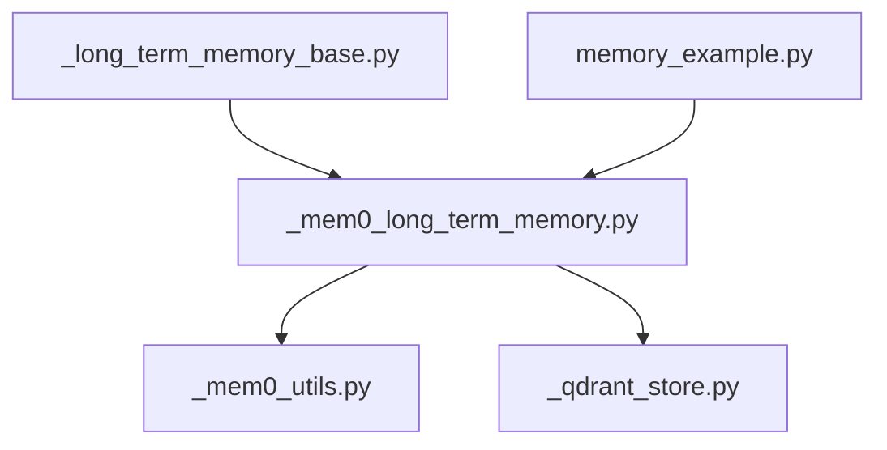

# Mem0集成

<cite>
**本文引用的文件**
- [src/agentscope/memory/_mem0_long_term_memory.py](file://src/agentscope/memory/_mem0_long_term_memory.py)
- [src/agentscope/memory/_mem0_utils.py](file://src/agentscope/memory/_mem0_utils.py)
- [src/agentscope/memory/_long_term_memory_base.py](file://src/agentscope/memory/_long_term_memory_base.py)
- [examples/functionality/long_term_memory/mem0/memory_example.py](file://examples/functionality/long_term_memory/mem0/memory_example.py)
- [examples/functionality/long_term_memory/mem0/README.md](file://examples/functionality/long_term_memory/mem0/README.md)
- [src/agentscope/rag/_store/_qdrant_store.py](file://src/agentscope/rag/_store/_qdrant_store.py)
</cite>

## 目录
1. [简介](#简介)
2. [项目结构](#项目结构)
3. [核心组件](#核心组件)
4. [架构总览](#架构总览)
5. [详细组件分析](#详细组件分析)
6. [依赖关系分析](#依赖关系分析)
7. [性能考虑](#性能考虑)
8. [故障排查指南](#故障排查指南)
9. [结论](#结论)
10. [附录](#附录)

## 简介
本专项文档聚焦于AgentScope中对Mem0记忆系统的集成，系统性阐述Mem0长期记忆的架构特性、与AgentScope框架的对接方式，以及_mem0_long_term_memory模块的封装逻辑与API映射机制。文档还提供配置Mem0客户端、设置向量存储与知识图谱参数的详细步骤，并通过memory_example.py中的实际案例，展示记忆写入、语义检索与记忆演化的完整工作流。同时，文档解释_mem0_utils工具模块中的数据转换与错误处理辅助函数，讨论记忆去重、关联推理与隐私过滤等高级功能的启用方式，并给出性能调优与资源消耗监控的实用建议。

## 项目结构
围绕Mem0集成的相关文件主要分布在以下位置：
- 内存子系统：_mem0_long_term_memory.py、_mem0_utils.py、_long_term_memory_base.py
- 示例与说明：examples/functionality/long_term_memory/mem0/memory_example.py、README.md
- 向量存储适配：src/agentscope/rag/_store/_qdrant_store.py（用于理解向量存储在AgentScope中的通用模式）

图表来源
- [src/agentscope/memory/_long_term_memory_base.py](file://src/agentscope/memory/_long_term_memory_base.py#L1-L95)
- [src/agentscope/memory/_mem0_long_term_memory.py](file://src/agentscope/memory/_mem0_long_term_memory.py#L1-L120)
- [src/agentscope/memory/_mem0_utils.py](file://src/agentscope/memory/_mem0_utils.py#L1-L60)
- [examples/functionality/long_term_memory/mem0/memory_example.py](file://examples/functionality/long_term_memory/mem0/memory_example.py#L1-L60)
- [examples/functionality/long_term_memory/mem0/README.md](file://examples/functionality/long_term_memory/mem0/README.md#L1-L60)
- [src/agentscope/rag/_store/_qdrant_store.py](file://src/agentscope/rag/_store/_qdrant_store.py#L1-L60)

章节来源
- [src/agentscope/memory/_long_term_memory_base.py](file://src/agentscope/memory/_long_term_memory_base.py#L1-L95)
- [src/agentscope/memory/_mem0_long_term_memory.py](file://src/agentscope/memory/_mem0_long_term_memory.py#L1-L120)
- [src/agentscope/memory/_mem0_utils.py](file://src/agentscope/memory/_mem0_utils.py#L1-L60)
- [examples/functionality/long_term_memory/mem0/memory_example.py](file://examples/functionality/long_term_memory/mem0/memory_example.py#L1-L60)
- [examples/functionality/long_term_memory/mem0/README.md](file://examples/functionality/long_term_memory/mem0/README.md#L1-L60)
- [src/agentscope/rag/_store/_qdrant_store.py](file://src/agentscope/rag/_store/_qdrant_store.py#L1-L60)

## 核心组件
- 长期记忆基类：定义开发者与Agent控制两种模式下的统一接口，包括record、retrieve、record_to_memory、retrieve_from_memory四个抽象方法。
- Mem0长期记忆实现：基于Mem0库实现，负责将AgentScope的模型与嵌入模型注册到Mem0工厂，构建MemoryConfig并初始化AsyncMemory实例；提供记忆记录与检索的异步API。
- Mem0适配器工具：AgentScopeLLM与AgentScopeEmbedding分别包装AgentScope的聊天模型与嵌入模型，使其满足Mem0的接口规范，完成响应解析与向量生成。

章节来源
- [src/agentscope/memory/_long_term_memory_base.py](file://src/agentscope/memory/_long_term_memory_base.py#L1-L95)
- [src/agentscope/memory/_mem0_long_term_memory.py](file://src/agentscope/memory/_mem0_long_term_memory.py#L73-L120)
- [src/agentscope/memory/_mem0_utils.py](file://src/agentscope/memory/_mem0_utils.py#L20-L120)

## 架构总览
Mem0集成采用“适配器+配置驱动”的架构：
- 配置阶段：根据传入的ChatModelBase与EmbeddingModelBase动态注册AgentScope提供商至Mem0工厂；若未提供mem0_config，则按参数构建MemoryConfig，默认向量存储为Qdrant且开启磁盘持久化。
- 执行阶段：记录与检索均通过AsyncMemory实例完成，记录支持多策略回退与显式禁用推理的兜底路径；检索支持并发搜索与关系格式化输出。
- 工具层：AgentScopeLLM与AgentScopeEmbedding将AgentScope的消息与嵌入响应转换为Mem0期望的格式，确保跨库兼容。

图表来源
- [src/agentscope/memory/_mem0_long_term_memory.py](file://src/agentscope/memory/_mem0_long_term_memory.py#L140-L257)
- [src/agentscope/memory/_mem0_utils.py](file://src/agentscope/memory/_mem0_utils.py#L20-L120)

## 详细组件分析

### Mem0长期记忆实现（Mem0LongTermMemory）
- 初始化与配置
  - 动态注册AgentScope提供商至Mem0工厂，兼容不同版本的Mem0（旧版与新版注册方式差异）。
  - 支持两种配置路径：直接传入model/embedding_model/vector_store_config构建MemoryConfig；或直接传入mem0_config进行细粒度覆盖。
  - 默认向量存储为Qdrant，且默认开启磁盘持久化（on_disk=True），以保证重启后数据不丢失。
- 记录流程（record_to_memory）
  - 多策略回退：优先以“user”角色消息记录；若结果为空则回退到“assistant”角色消息；最后在infer=False下进行直写兜底。
  - 返回ToolResponse，便于Agent工具链消费。
- 检索流程（retrieve_from_memory）
  - 对每个关键词发起异步搜索，使用asyncio.gather并发执行；合并结果并可选格式化关系三元组。
- 直接记录与检索（record/retrieve）
  - record将消息拼接为单条assistant消息后调用底层add；retrieve对消息列表逐个查询并聚合结果，支持关系输出。

图表来源
- [src/agentscope/memory/_long_term_memory_base.py](file://src/agentscope/memory/_long_term_memory_base.py#L1-L95)
- [src/agentscope/memory/_mem0_long_term_memory.py](file://src/agentscope/memory/_mem0_long_term_memory.py#L73-L120)
- [src/agentscope/memory/_mem0_long_term_memory.py](file://src/agentscope/memory/_mem0_long_term_memory.py#L258-L384)
- [src/agentscope/memory/_mem0_long_term_memory.py](file://src/agentscope/memory/_mem0_long_term_memory.py#L385-L450)
- [src/agentscope/memory/_mem0_long_term_memory.py](file://src/agentscope/memory/_mem0_long_term_memory.py#L451-L559)
- [src/agentscope/memory/_mem0_long_term_memory.py](file://src/agentscope/memory/_mem0_long_term_memory.py#L560-L624)

章节来源
- [src/agentscope/memory/_mem0_long_term_memory.py](file://src/agentscope/memory/_mem0_long_term_memory.py#L73-L120)
- [src/agentscope/memory/_mem0_long_term_memory.py](file://src/agentscope/memory/_mem0_long_term_memory.py#L140-L257)
- [src/agentscope/memory/_mem0_long_term_memory.py](file://src/agentscope/memory/_mem0_long_term_memory.py#L258-L384)
- [src/agentscope/memory/_mem0_long_term_memory.py](file://src/agentscope/memory/_mem0_long_term_memory.py#L385-L450)
- [src/agentscope/memory/_mem0_long_term_memory.py](file://src/agentscope/memory/_mem0_long_term_memory.py#L451-L559)
- [src/agentscope/memory/_mem0_long_term_memory.py](file://src/agentscope/memory/_mem0_long_term_memory.py#L560-L624)

### Mem0适配器工具（AgentScopeLLM与AgentScopeEmbedding）
- AgentScopeLLM
  - 将AgentScope的ChatModelBase包装为Mem0可用的LLM适配器，负责消息格式转换与响应解析，支持返回纯文本或包含tool_calls的字典。
- AgentScopeEmbedding
  - 将AgentScope的EmbeddingModelBase包装为Mem0可用的Embedding适配器，负责生成向量并返回浮点数组。

图表来源
- [src/agentscope/memory/_mem0_utils.py](file://src/agentscope/memory/_mem0_utils.py#L20-L120)
- [src/agentscope/memory/_mem0_utils.py](file://src/agentscope/memory/_mem0_utils.py#L166-L241)

章节来源
- [src/agentscope/memory/_mem0_utils.py](file://src/agentscope/memory/_mem0_utils.py#L20-L120)
- [src/agentscope/memory/_mem0_utils.py](file://src/agentscope/memory/_mem0_utils.py#L166-L241)

### API映射与调用序列（记录与检索）
- 记录调用序列
  - record_to_memory/think与content组合后，依次尝试user角色记录、assistant角色记录、禁用推理的直写记录，最终返回ToolResponse。
- 检索调用序列
  - retrieve_from_memory对每个关键词并发搜索，聚合结果并格式化关系；retrieve对消息列表逐条查询并聚合。

图表来源
- [src/agentscope/memory/_mem0_long_term_memory.py](file://src/agentscope/memory/_mem0_long_term_memory.py#L258-L384)
- [src/agentscope/memory/_mem0_long_term_memory.py](file://src/agentscope/memory/_mem0_long_term_memory.py#L385-L450)
- [src/agentscope/memory/_mem0_utils.py](file://src/agentscope/memory/_mem0_utils.py#L20-L120)
- [src/agentscope/memory/_mem0_utils.py](file://src/agentscope/memory/_mem0_utils.py#L166-L241)

## 依赖关系分析
- 组件耦合
  - Mem0LongTermMemory依赖LongTermMemoryBase定义的统一接口；通过_mem0_utils中的适配器与Mem0工厂交互，实现模型与嵌入的无缝对接。
  - 向量存储默认使用Qdrant，可通过VectorStoreConfig自定义路径与维度；示例中展示了如何指定磁盘持久化与自定义存储路径。
- 外部依赖
  - Mem0库版本差异导致LLM提供商注册方式不同；代码中已做兼容处理。
  - 示例依赖DashScope模型与Qdrant向量存储，演示了完整的端到端工作流。

图表来源
- [src/agentscope/memory/_long_term_memory_base.py](file://src/agentscope/memory/_long_term_memory_base.py#L1-L95)
- [src/agentscope/memory/_mem0_long_term_memory.py](file://src/agentscope/memory/_mem0_long_term_memory.py#L1-L120)
- [src/agentscope/memory/_mem0_utils.py](file://src/agentscope/memory/_mem0_utils.py#L1-L60)
- [examples/functionality/long_term_memory/mem0/memory_example.py](file://examples/functionality/long_term_memory/mem0/memory_example.py#L1-L60)
- [src/agentscope/rag/_store/_qdrant_store.py](file://src/agentscope/rag/_store/_qdrant_store.py#L1-L60)

章节来源
- [src/agentscope/memory/_mem0_long_term_memory.py](file://src/agentscope/memory/_mem0_long_term_memory.py#L140-L257)
- [src/agentscope/memory/_mem0_utils.py](file://src/agentscope/memory/_mem0_utils.py#L20-L120)
- [examples/functionality/long_term_memory/mem0/memory_example.py](file://examples/functionality/long_term_memory/mem0/memory_example.py#L1-L60)

## 性能考虑
- 异步与并发
  - 记录与检索均采用异步实现，检索阶段使用asyncio.gather并发搜索多个关键词，显著降低端到端延迟。
- 向量存储选择
  - 默认Qdrant开启磁盘持久化（on_disk=True），适合生产环境；如需更快的内存访问，可在开发环境临时切换为内存实例。
- 维度与索引
  - 示例中明确指出：若更换嵌入模型或调整维度，需设置新的存储路径或清理旧数据库，避免维度不匹配导致的异常。
- 推理策略
  - 记录阶段提供多策略回退与禁用推理的兜底路径，兼顾可靠性与性能；在高吞吐场景可结合禁用推理减少额外开销。

章节来源
- [src/agentscope/memory/_mem0_long_term_memory.py](file://src/agentscope/memory/_mem0_long_term_memory.py#L385-L450)
- [src/agentscope/memory/_mem0_long_term_memory.py](file://src/agentscope/memory/_mem0_long_term_memory.py#L258-L384)
- [examples/functionality/long_term_memory/mem0/README.md](file://examples/functionality/long_term_memory/mem0/README.md#L80-L100)

## 故障排查指南
- 安装与导入
  - 若未安装Mem0库，初始化时会抛出ImportError并提示安装命令；请先安装mem0ai。
- 版本兼容
  - 代码中对Mem0版本进行检测并采用不同的提供商注册方式；若遇到提供商不可用，检查Mem0版本是否符合预期。
- 配置校验
  - 当未提供mem0_config时，必须同时提供model与embedding_model；否则会触发参数校验错误。
  - 向量存储配置缺失时，默认使用Qdrant并开启磁盘持久化；如需自定义，请通过VectorStoreConfig提供。
- 记录失败
  - 记录流程包含多策略回退；若所有策略均失败，最终会返回错误信息的ToolResponse，便于定位问题。
- 检索异常
  - 检索阶段捕获异常并返回错误信息的ToolResponse；检查关键词与limit参数是否合理，以及向量存储是否正常运行。

章节来源
- [src/agentscope/memory/_mem0_long_term_memory.py](file://src/agentscope/memory/_mem0_long_term_memory.py#L140-L257)
- [src/agentscope/memory/_mem0_long_term_memory.py](file://src/agentscope/memory/_mem0_long_term_memory.py#L258-L384)
- [src/agentscope/memory/_mem0_long_term_memory.py](file://src/agentscope/memory/_mem0_long_term_memory.py#L385-L450)

## 结论
Mem0集成在AgentScope中实现了“即插即用”的长期记忆能力：通过适配器桥接AgentScope模型与Mem0生态，借助统一的长期记忆接口，既支持开发者驱动的记录与检索，也支持Agent自主的记忆管理工具。默认向量存储为Qdrant并开启磁盘持久化，配合并发检索与多策略记录回退，能够在复杂应用场景中稳定高效地提供语义记忆服务。示例与文档提供了从基础配置到高级集成的完整路径，便于快速落地。

## 附录

### 配置Mem0客户端与向量存储
- 基本配置
  - 使用DashScope聊天模型与嵌入模型初始化Mem0LongTermMemory。
  - 通过VectorStoreConfig指定Qdrant向量存储，开启磁盘持久化并设置嵌入维度。
- 知识图谱参数
  - 示例中展示了如何通过Mem0的MemoryConfig与GraphStoreConfig启用Neo4j图存储；具体参数包括连接URL、用户名、密码与数据库名。
- 注意事项
  - 更换嵌入模型或修改维度时，需设置新的存储路径或删除旧数据库文件，避免维度不匹配错误。

章节来源
- [examples/functionality/long_term_memory/mem0/memory_example.py](file://examples/functionality/long_term_memory/mem0/memory_example.py#L26-L90)
- [examples/functionality/long_term_memory/mem0/README.md](file://examples/functionality/long_term_memory/mem0/README.md#L60-L100)
- [examples/functionality/long_term_memory/mem0/README.md](file://examples/functionality/long_term_memory/mem0/README.md#L133-L145)

### 记忆工作流（写入、检索、演化）
- 写入
  - 使用record或record_to_memory将对话内容持久化；前者面向开发者，后者面向Agent工具。
- 检索
  - 使用retrieve或retrieve_from_memory进行语义检索；支持并发搜索与关系格式化。
- 演化
  - 通过多次记录与检索形成上下文积累；在Agent中结合工具调用实现偏好与经验的持续更新。

章节来源
- [examples/functionality/long_term_memory/mem0/memory_example.py](file://examples/functionality/long_term_memory/mem0/memory_example.py#L93-L184)
- [src/agentscope/memory/_mem0_long_term_memory.py](file://src/agentscope/memory/_mem0_long_term_memory.py#L258-L384)
- [src/agentscope/memory/_mem0_long_term_memory.py](file://src/agentscope/memory/_mem0_long_term_memory.py#L385-L450)

### 高级功能与最佳实践
- 记忆去重
  - 通过向量相似度阈值与唯一标识策略减少重复记忆；在Agent中结合工具调用避免重复记录。
- 关联推理
  - 检索结果支持关系格式化输出，便于后续进行三元组推理与知识图谱扩展。
- 隐私过滤
  - 在记录前对敏感信息进行脱敏处理；在检索时通过关键词与阈值过滤敏感内容。
- 性能调优
  - 调整并发度与limit参数；在开发环境可使用内存Qdrant加速迭代；生产环境建议使用磁盘持久化并优化索引参数。

章节来源
- [src/agentscope/memory/_mem0_long_term_memory.py](file://src/agentscope/memory/_mem0_long_term_memory.py#L385-L450)
- [src/agentscope/memory/_mem0_long_term_memory.py](file://src/agentscope/memory/_mem0_long_term_memory.py#L497-L518)
- [examples/functionality/long_term_memory/mem0/README.md](file://examples/functionality/long_term_memory/mem0/README.md#L80-L100)