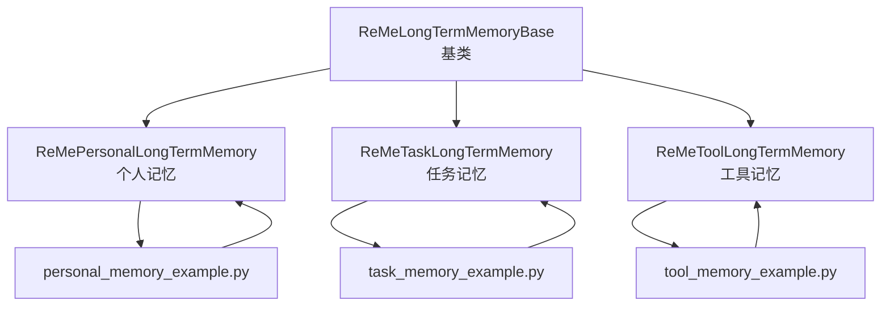
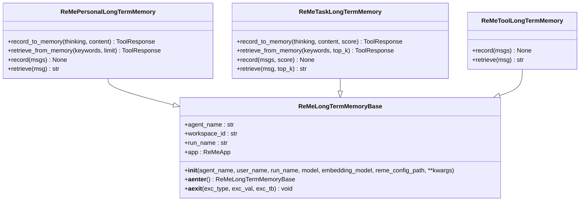
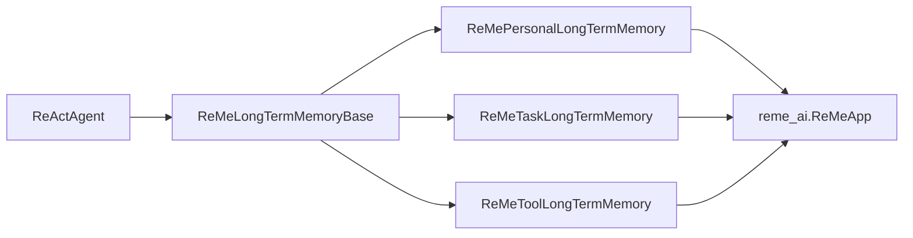

# ReMe集成

<cite>
**本文引用的文件**
- [src/agentscope/memory/_reme/_reme_long_term_memory_base.py](file://src/agentscope/memory/_reme/_reme_long_term_memory_base.py)
- [src/agentscope/memory/_reme/_reme_personal_long_term_memory.py](file://src/agentscope/memory/_reme/_reme_personal_long_term_memory.py)
- [src/agentscope/memory/_reme/_reme_task_long_term_memory.py](file://src/agentscope/memory/_reme/_reme_task_long_term_memory.py)
- [src/agentscope/memory/_reme/_reme_tool_long_term_memory.py](file://src/agentscope/memory/_reme/_reme_tool_long_term_memory.py)
- [examples/functionality/long_term_memory/reme/personal_memory_example.py](file://examples/functionality/long_term_memory/reme/personal_memory_example.py)
- [examples/functionality/long_term_memory/reme/task_memory_example.py](file://examples/functionality/long_term_memory/reme/task_memory_example.py)
- [examples/functionality/long_term_memory/reme/tool_memory_example.py](file://examples/functionality/long_term_memory/reme/tool_memory_example.py)
- [examples/functionality/long_term_memory/reme/README.md](file://examples/functionality/long_term_memory/reme/README.md)
- [tests/memory_reme_test.py](file://tests/memory_reme_test.py)
</cite>

## 目录
1. [简介](#简介)
2. [项目结构](#项目结构)
3. [核心组件](#核心组件)
4. [架构总览](#架构总览)
5. [详细组件分析](#详细组件分析)
6. [依赖关系分析](#依赖关系分析)
7. [性能与可扩展性](#性能与可扩展性)
8. [故障排查指南](#故障排查指南)
9. [结论](#结论)
10. [附录](#附录)

## 简介
本文件面向需要在智能体中集成ReMe（Reflection Memory）持久记忆能力的开发者，系统阐述ReMe长记忆体系的三大组件：个人长期记忆、任务长期记忆与工具长期记忆的职责划分与协同机制；深入解析_reme_long_term_memory_base中定义的核心接口与抽象方法，并对比三个具体实现类的差异化行为；梳理三类记忆的存储策略、访问控制模型与生命周期管理规则；提供在智能体中配置与调用不同ReMe记忆类型的代码示例，展示上下文感知的记忆检索与个性化记忆演化；最后讨论记忆压缩、增量更新与跨会话一致性等关键技术实现。

## 项目结构
ReMe长记忆模块位于agentscope框架内，采用“基类+多态实现”的分层设计：
- 基类：ReMeLongTermMemoryBase，负责ReMeApp初始化、异步上下文管理、模型参数抽取与向量存储隔离。
- 三个具体实现：
  - ReMePersonalLongTermMemory：面向用户偏好、习惯与事实的个人记忆。
  - ReMeTaskLongTermMemory：面向任务执行轨迹的经验学习与检索。
  - ReMeToolLongTermMemory：面向工具使用模式的记录与最佳实践生成。
- 示例与测试：提供完整的ReActAgent集成示例、单元测试覆盖与使用说明。

图表来源
- [src/agentscope/memory/_reme/_reme_long_term_memory_base.py](file://src/agentscope/memory/_reme/_reme_long_term_memory_base.py#L83-L371)
- [src/agentscope/memory/_reme/_reme_personal_long_term_memory.py](file://src/agentscope/memory/_reme/_reme_personal_long_term_memory.py#L1-L415)
- [src/agentscope/memory/_reme/_reme_task_long_term_memory.py](file://src/agentscope/memory/_reme/_reme_task_long_term_memory.py#L1-L437)
- [src/agentscope/memory/_reme/_reme_tool_long_term_memory.py](file://src/agentscope/memory/_reme/_reme_tool_long_term_memory.py#L1-L546)
- [examples/functionality/long_term_memory/reme/personal_memory_example.py](file://examples/functionality/long_term_memory/reme/personal_memory_example.py#L1-L296)
- [examples/functionality/long_term_memory/reme/task_memory_example.py](file://examples/functionality/long_term_memory/reme/task_memory_example.py#L1-L343)
- [examples/functionality/long_term_memory/reme/tool_memory_example.py](file://examples/functionality/long_term_memory/reme/tool_memory_example.py#L1-L437)

章节来源
- [examples/functionality/long_term_memory/reme/README.md](file://examples/functionality/long_term_memory/reme/README.md#L520-L540)

## 核心组件
- ReMeLongTermMemoryBase：封装ReMeApp初始化、LLM/Embedding模型参数抽取、异步上下文管理、workspace_id隔离与错误处理。
- ReMePersonalLongTermMemory：提供个人偏好、习惯与事实的记忆记录与检索，支持工具函数与直接方法两种调用方式。
- ReMeTaskLongTermMemory：记录任务执行轨迹与评分，支持经验检索与直接方法记录/检索。
- ReMeToolLongTermMemory：记录工具调用结果并自动生成使用指南，仅提供直接方法（record/retrieve），不暴露为Agent工具。

章节来源
- [src/agentscope/memory/_reme/_reme_long_term_memory_base.py](file://src/agentscope/memory/_reme/_reme_long_term_memory_base.py#L100-L371)
- [src/agentscope/memory/_reme/_reme_personal_long_term_memory.py](file://src/agentscope/memory/_reme/_reme_personal_long_term_memory.py#L17-L252)
- [src/agentscope/memory/_reme/_reme_task_long_term_memory.py](file://src/agentscope/memory/_reme/_reme_task_long_term_memory.py#L17-L265)
- [src/agentscope/memory/_reme/_reme_tool_long_term_memory.py](file://src/agentscope/memory/_reme/_reme_tool_long_term_memory.py#L17-L278)

## 架构总览
ReMe长记忆通过ReMeApp与向量存储协作，实现跨会话的语义检索与知识沉淀。基类负责：
- 模型参数抽取：从DashScope/OpenAI模型包装器中提取API Key与Endpoint，注入ReMeApp。
- 异步上下文：提供__aenter__/__aexit__，确保ReMeApp正确初始化与资源清理。
- 工作空间隔离：以user_name作为workspace_id，实现多用户/多工作区的数据隔离。
- 错误处理：缺失依赖时抛出明确安装指引，运行期未启动上下文时抛出RuntimeError。

图表来源
- [src/agentscope/memory/_reme/_reme_long_term_memory_base.py](file://src/agentscope/memory/_reme/_reme_long_term_memory_base.py#L83-L371)
- [src/agentscope/memory/_reme/_reme_personal_long_term_memory.py](file://src/agentscope/memory/_reme/_reme_personal_long_term_memory.py#L17-L252)
- [src/agentscope/memory/_reme/_reme_task_long_term_memory.py](file://src/agentscope/memory/_reme/_reme_task_long_term_memory.py#L17-L265)
- [src/agentscope/memory/_reme/_reme_tool_long_term_memory.py](file://src/agentscope/memory/_reme/_reme_tool_long_term_memory.py#L17-L278)

## 详细组件分析

### ReMeLongTermMemoryBase：核心接口与抽象方法
- 初始化参数
  - agent_name：智能体标识，用于组织记忆归属。
  - user_name：工作区标识，映射到ReMe的workspace_id，实现多租户隔离。
  - run_name：当前运行会话标识。
  - model/embedding_model：支持DashScope/OpenAI两类模型包装器，自动抽取API Key与Endpoint。
  - reme_config_path：可选的ReMe配置文件路径。
  - 其他kwargs：透传给ReMeApp构造函数。
- 关键行为
  - 模型参数抽取：根据模型类型选择固定或动态Endpoint，并提取模型名与维度参数。
  - ReMeApp初始化：尝试导入reme_ai并创建ReMeApp实例，失败时抛出明确安装指引。
  - 异步上下文：__aenter__调用ReMeApp.__aenter__，__aexit__负责清理并重置状态。
  - 上下文校验：所有具体实现均在方法入口检查_app_started标志，未启动则抛错。

章节来源
- [src/agentscope/memory/_reme/_reme_long_term_memory_base.py](file://src/agentscope/memory/_reme/_reme_long_term_memory_base.py#L100-L371)

### ReMePersonalLongTermMemory：个人记忆
- 记录接口
  - record_to_memory：面向Agent工具调用，接收thinking与content列表，内部转换为消息序列并通过ReMeApp执行“summary_personal_memory”流程。
  - record：直接方法，接收Msg列表，按消息内容拼接字符串后统一走“summary_personal_memory”。
- 检索接口
  - retrieve_from_memory：关键词检索，逐词查询并组合答案。
  - retrieve：基于最后一条消息内容进行查询，返回字符串。
- 差异化点
  - 与任务记忆类似，提供工具函数与直接方法双通道。
  - 检索关键词建议包含“旅行偏好”、“工作习惯”、“饮品偏好”等多维主题。

章节来源
- [src/agentscope/memory/_reme/_reme_personal_long_term_memory.py](file://src/agentscope/memory/_reme/_reme_personal_long_term_memory.py#L17-L252)
- [src/agentscope/memory/_reme/_reme_personal_long_term_memory.py](file://src/agentscope/memory/_reme/_reme_personal_long_term_memory.py#L253-L415)

### ReMeTaskLongTermMemory：任务记忆
- 记录接口
  - record_to_memory：支持score参数（0.0~1.0），记录任务执行经验与最佳实践。
  - record：支持score的直接记录，适用于对话式轨迹。
- 检索接口
  - retrieve_from_memory：关键词检索任务经验，逐词查询。
  - retrieve：基于最后一条消息内容检索经验。
- 差异化点
  - 提供轨迹评分，便于后续经验排序与优先级筛选。
  - 检索关键词建议包含“数据库优化”、“API设计”、“代码重构”等技术领域。

章节来源
- [src/agentscope/memory/_reme/_reme_task_long_term_memory.py](file://src/agentscope/memory/_reme/_reme_task_long_term_memory.py#L17-L265)
- [src/agentscope/memory/_reme/_reme_task_long_term_memory.py](file://src/agentscope/memory/_reme/_reme_task_long_term_memory.py#L266-L437)

### ReMeToolLongTermMemory：工具记忆
- 记录接口
  - record：接收包含工具调用元数据的JSON字符串消息，先add再summary，自动生成使用指南。
- 检索接口
  - retrieve：基于消息中的工具名称检索使用指南，返回字符串。
- 差异化点
  - 不提供工具函数（record_to_memory/retrieve_from_memory），仅直接方法。
  - 适合程序化增强Agent系统提示，而非作为Agent可调用工具。

章节来源
- [src/agentscope/memory/_reme/_reme_tool_long_term_memory.py](file://src/agentscope/memory/_reme/_reme_tool_long_term_memory.py#L17-L278)
- [src/agentscope/memory/_reme/_reme_tool_long_term_memory.py](file://src/agentscope/memory/_reme/_reme_tool_long_term_memory.py#L279-L546)

### 职责划分与协同机制
- 个人记忆：维护用户画像与个性化上下文，支撑对话个性化与历史一致性。
- 任务记忆：沉淀问题解决经验与最佳实践，提升重复任务的效率与质量。
- 工具记忆：记录工具调用模式与成本特征，形成可复用的使用指南，降低试错成本。
- 协同：三者共享同一ReMeApp与向量存储，通过workspace_id隔离；在Agent侧可通过ReActAgent的long_term_memory_mode控制是否启用工具函数。

章节来源
- [examples/functionality/long_term_memory/reme/README.md](file://examples/functionality/long_term_memory/reme/README.md#L84-L100)
- [examples/functionality/long_term_memory/reme/README.md](file://examples/functionality/long_term_memory/reme/README.md#L418-L437)

### 存储策略与访问控制
- 存储位置与隔离
  - 向量存储目录默认位于“./memory_vector_store/”，可通过配置参数调整。
  - 以user_name作为workspace_id，实现多用户/多工作区的独立存储。
- 访问控制
  - 所有操作必须在async with上下文中执行，否则抛出RuntimeError。
  - 内部通过workspace_id限定检索范围，避免跨会话泄露。
- 生命周期管理
  - 初始化阶段完成模型参数抽取与ReMeApp创建。
  - 运行阶段通过异步上下文管理ReMeApp生命周期，退出时清理资源。

章节来源
- [examples/functionality/long_term_memory/reme/README.md](file://examples/functionality/long_term_memory/reme/README.md#L538-L543)
- [examples/functionality/long_term_memory/reme/README.md](file://examples/functionality/long_term_memory/reme/README.md#L438-L453)
- [src/agentscope/memory/_reme/_reme_long_term_memory_base.py](file://src/agentscope/memory/_reme/_reme_long_term_memory_base.py#L263-L288)

### 配置与调用示例（智能体）
- 个人记忆（ReActAgent集成）
  - 使用long_term_memory=ReMePersonalLongTermMemory，long_term_memory_mode="both"。
  - 在系统提示中明确“先检索再回答”的原则。
  - 参考路径：[personal_memory_example.py](file://examples/functionality/long_term_memory/reme/personal_memory_example.py#L157-L242)
- 任务记忆（ReActAgent集成）
  - 使用long_term_memory=ReMeTaskLongTermMemory，配合score标注轨迹质量。
  - 参考路径：[task_memory_example.py](file://examples/functionality/long_term_memory/reme/task_memory_example.py#L185-L291)
- 工具记忆（系统提示增强）
  - 通过record记录历史调用，retrieve获取使用指南，注入Agent系统提示。
  - 参考路径：[tool_memory_example.py](file://examples/functionality/long_term_memory/reme/tool_memory_example.py#L199-L408)

章节来源
- [examples/functionality/long_term_memory/reme/personal_memory_example.py](file://examples/functionality/long_term_memory/reme/personal_memory_example.py#L157-L242)
- [examples/functionality/long_term_memory/reme/task_memory_example.py](file://examples/functionality/long_term_memory/reme/task_memory_example.py#L185-L291)
- [examples/functionality/long_term_memory/reme/tool_memory_example.py](file://examples/functionality/long_term_memory/reme/tool_memory_example.py#L199-L408)

### 上下文感知检索与个性化演化
- 上下文感知
  - 个人记忆：基于关键词与消息内容进行语义检索，结合最近消息保留策略，维持对话连贯性。
  - 任务记忆：针对技术领域关键词检索过往经验，结合score进行优先级排序。
  - 工具记忆：基于工具名称检索使用指南，结合历史调用的成本与成功率特征。
- 个性化演化
  - 通过持续记录与总结，逐步完善记忆库，使Agent在相似场景下能给出更优决策与更个性化的回复。
  - 测试覆盖验证了记录-检索-再记录的闭环流程。

章节来源
- [tests/memory_reme_test.py](file://tests/memory_reme_test.py#L688-L767)

## 依赖关系分析
- 组件耦合
  - 三个具体实现均继承自ReMeLongTermMemoryBase，共享上下文管理与模型参数抽取逻辑。
  - 与AgentScope的集成通过ReActAgent的long_term_memory与long_term_memory_mode参数实现。
- 外部依赖
  - reme_ai：ReMeApp核心依赖，负责记忆的持久化与检索。
  - 模型包装器：DashScopeChatModel/OpenAIChatModel与DashScopeTextEmbedding/OpenAITextEmbedding。
- 循环依赖
  - 无循环依赖，模块间通过接口契约解耦。

图表来源
- [src/agentscope/memory/_reme/_reme_long_term_memory_base.py](file://src/agentscope/memory/_reme/_reme_long_term_memory_base.py#L263-L288)
- [src/agentscope/memory/_reme/_reme_personal_long_term_memory.py](file://src/agentscope/memory/_reme/_reme_personal_long_term_memory.py#L17-L252)
- [src/agentscope/memory/_reme/_reme_task_long_term_memory.py](file://src/agentscope/memory/_reme/_reme_task_long_term_memory.py#L17-L265)
- [src/agentscope/memory/_reme/_reme_tool_long_term_memory.py](file://src/agentscope/memory/_reme/_reme_tool_long_term_memory.py#L17-L278)

## 性能与可扩展性
- 记忆压缩与增量更新
  - ReMe短记忆模块提供了压缩与增量更新的完整方案（compaction与summarization），可作为长记忆的参考实现思路：
    - 压缩阈值与分组策略：通过max_total_tokens、group_token_threshold等参数控制压缩触发与粒度。
    - 最近消息保留：keep_recent_count确保关键上下文不被压缩。
    - 增量更新：在添加消息后触发检查与替换，保持向量存储规模可控。
  - 长记忆实现建议
    - 对于个人/任务记忆：可借鉴短记忆的阈值策略，在记录后触发摘要或分段存储。
    - 对于工具记忆：对高频工具调用建立索引与缓存，减少重复检索开销。
- 跨会话一致性
  - 通过workspace_id隔离与向量存储持久化，确保跨会话检索的一致性。
  - 在Agent重启或会话切换后，仍能基于相同user_name恢复上下文。

章节来源
- [examples/functionality/short_term_memory/reme/README.md](file://examples/functionality/short_term_memory/reme/README.md#L126-L149)
- [examples/functionality/short_term_memory/reme/README.md](file://examples/functionality/short_term_memory/reme/README.md#L264-L277)
- [examples/functionality/short_term_memory/reme/README.md](file://examples/functionality/short_term_memory/reme/README.md#L293-L327)
- [examples/functionality/short_term_memory/reme/README.md](file://examples/functionality/short_term_memory/reme/README.md#L404-L412)

## 故障排查指南
- 常见问题
  - 未使用async with：抛出“ReMeApp context not started”错误。请确保在async with块内执行所有记忆操作。
  - 缺少reme_ai依赖：初始化时报错，提示安装rememe-ai并提供官方仓库链接。
  - 工具记忆JSON格式错误：record_to_memory会跳过无效JSON并返回提示信息。
  - 无检索结果：确认已先记录，且user_name一致；关键词需具体且与训练分布匹配。
- 单元测试覆盖
  - 初始化参数校验、上下文未启动异常、记录与检索成功路径、错误处理分支均有测试保障。

章节来源
- [tests/memory_reme_test.py](file://tests/memory_reme_test.py#L194-L244)
- [tests/memory_reme_test.py](file://tests/memory_reme_test.py#L337-L371)
- [tests/memory_reme_test.py](file://tests/memory_reme_test.py#L552-L566)
- [tests/memory_reme_test.py](file://tests/memory_reme_test.py#L654-L666)
- [examples/functionality/long_term_memory/reme/README.md](file://examples/functionality/long_term_memory/reme/README.md#L590-L605)

## 结论
ReMe长记忆通过清晰的职责划分与统一的基类抽象，实现了个人、任务与工具三类记忆的协同演进。其异步上下文管理、向量存储隔离与工具函数集成，使得Agent能够在多会话场景下保持一致且个性化的记忆体验。结合单元测试与示例工程，开发者可以快速落地ReMe集成，并在实际应用中持续优化记忆策略与检索效果。

## 附录
- 快速开始
  - 安装：pip install reme-ai python-dotenv
  - 设置API Key后，分别运行personal_memory_example.py、task_memory_example.py、tool_memory_example.py。
- 推荐实践
  - 明确系统提示中的“先检索再回答”原则。
  - 为任务记忆提供有意义的score，提升经验排序效果。
  - 将工具记忆的使用指南注入Agent系统提示，提升工具调用成功率。

章节来源
- [examples/functionality/long_term_memory/reme/README.md](file://examples/functionality/long_term_memory/reme/README.md#L24-L61)
- [examples/functionality/long_term_memory/reme/README.md](file://examples/functionality/long_term_memory/reme/README.md#L545-L589)