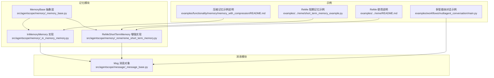
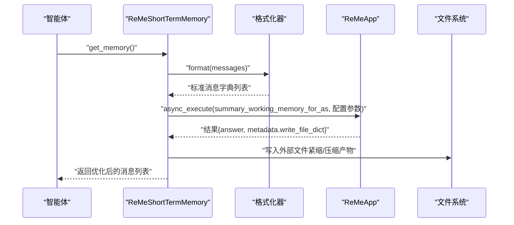
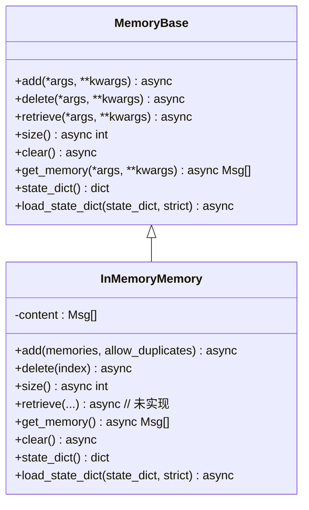
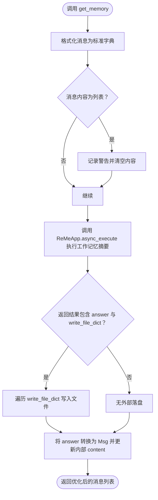
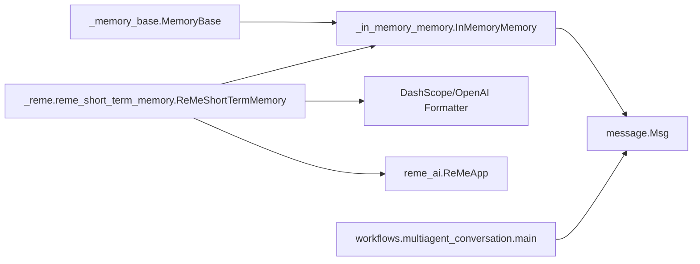

# 短期记忆

<cite>
**本文引用的文件**
- [src/agentscope/memory/_memory_base.py](file://src/agentscope/memory/_memory_base.py)
- [src/agentscope/memory/_in_memory_memory.py](file://src/agentscope/memory/_in_memory_memory.py)
- [src/agentscope/memory/_reme/reme_short_term_memory.py](file://src/agentscope/memory/_reme/reme_short_term_memory.py)
- [src/agentscope/message/_message_base.py](file://src/agentscope/message/_message_base.py)
- [examples/functionality/short_term_memory/reme/short_term_memory_example.py](file://examples/functionality/short_term_memory/reme/short_term_memory_example.py)
- [examples/functionality/short_term_memory/reme/README.md](file://examples/functionality/short_term_memory/reme/README.md)
- [examples/workflows/multiagent_conversation/main.py](file://examples/workflows/multiagent_conversation/main.py)
- [examples/functionality/memory/memory_with_compression/README.md](file://examples/functionality/memory/memory_with_compression/README.md)
</cite>

## 目录
1. [简介](#简介)
2. [项目结构](#项目结构)
3. [核心组件](#核心组件)
4. [架构总览](#架构总览)
5. [详细组件分析](#详细组件分析)
6. [依赖关系分析](#依赖关系分析)
7. [性能与内存特征](#性能与内存特征)
8. [故障排查指南](#故障排查指南)
9. [结论](#结论)
10. [附录：最佳实践与集成建议](#附录最佳实践与集成建议)

## 简介
短期记忆用于在多智能体对话与复杂工作流中维护当前会话上下文，确保模型生成时具备必要的历史信息，同时控制上下文长度以满足不同模型的上下文窗口限制。本文件聚焦以下目标：
- 解释短期记忆的设计目的与适用场景
- 深入解析 InMemoryMemory 的实现机制与内存管理策略
- 说明其作为 MemoryBase 子类的接口实现细节（数据存储结构、读写操作、生命周期）
- 展示在多智能体对话中使用短期记忆的示例，体现消息缓存与上下文维护
- 讨论性能特征、内存占用优化与适用规模限制
- 与其他系统（工作流与消息传递）的集成方式与最佳实践

## 项目结构
短期记忆相关代码主要位于 memory 模块，包含基础抽象、内存实现以及基于 ReMe 的短期记忆增强实现；消息对象定义在 message 模块；示例位于 examples/functionality/short_term_memory/reme 中；多智能体对话示例位于 examples/workflows/multiagent_conversation。

图表来源
- [src/agentscope/memory/_memory_base.py](file://src/agentscope/memory/_memory_base.py#L1-L45)
- [src/agentscope/memory/_in_memory_memory.py](file://src/agentscope/memory/_in_memory_memory.py#L1-L123)
- [src/agentscope/memory/_reme/reme_short_term_memory.py](file://src/agentscope/memory/_reme/reme_short_term_memory.py#L1-L350)
- [src/agentscope/message/_message_base.py](file://src/agentscope/message/_message_base.py#L1-L242)
- [examples/functionality/short_term_memory/reme/short_term_memory_example.py](file://examples/functionality/short_term_memory/reme/short_term_memory_example.py#L1-L189)
- [examples/functionality/short_term_memory/reme/README.md](file://examples/functionality/short_term_memory/reme/README.md#L264-L352)
- [examples/workflows/multiagent_conversation/main.py](file://examples/workflows/multiagent_conversation/main.py#L1-L81)
- [examples/functionality/memory/memory_with_compression/README.md](file://examples/functionality/memory/memory_with_compression/README.md#L1-L318)

章节来源
- [src/agentscope/memory/_memory_base.py](file://src/agentscope/memory/_memory_base.py#L1-L45)
- [src/agentscope/memory/_in_memory_memory.py](file://src/agentscope/memory/_in_memory_memory.py#L1-L123)
- [src/agentscope/memory/_reme/reme_short_term_memory.py](file://src/agentscope/memory/_reme/reme_short_term_memory.py#L1-L350)
- [src/agentscope/message/_message_base.py](file://src/agentscope/message/_message_base.py#L1-L242)
- [examples/functionality/short_term_memory/reme/short_term_memory_example.py](file://examples/functionality/short_term_memory/reme/short_term_memory_example.py#L1-L189)
- [examples/functionality/short_term_memory/reme/README.md](file://examples/functionality/short_term_memory/reme/README.md#L264-L352)
- [examples/workflows/multiagent_conversation/main.py](file://examples/workflows/multiagent_conversation/main.py#L1-L81)
- [examples/functionality/memory/memory_with_compression/README.md](file://examples/functionality/memory/memory_with_compression/README.md#L1-L318)

## 核心组件
- MemoryBase：短期记忆的抽象基类，定义统一的异步接口（add、delete、retrieve、size、clear、get_memory、state_dict、load_state_dict），确保所有记忆实现遵循一致契约。
- InMemoryMemory：基于内存的消息列表存储实现，提供基本的增删查清能力，支持状态序列化与反序列化，适合轻量级、临时性上下文维护。
- ReMeShortTermMemory：在 InMemoryMemory 基础上，引入 ReMe 工作记忆管线，自动进行“压缩”和“紧缩”，在 get_memory 调用时按配置阈值与模式对历史消息进行处理，兼顾上下文长度与信息保留。

章节来源
- [src/agentscope/memory/_memory_base.py](file://src/agentscope/memory/_memory_base.py#L1-L45)
- [src/agentscope/memory/_in_memory_memory.py](file://src/agentscope/memory/_in_memory_memory.py#L1-L123)
- [src/agentscope/memory/_reme/reme_short_term_memory.py](file://src/agentscope/memory/_reme/reme_short_term_memory.py#L1-L350)

## 架构总览
短期记忆在 AgentScope 中的定位是“工作记忆”的承载者，负责在单次交互或短时间内的多轮对话中维持上下文。ReMeShortTermMemory 将外部 ReMe 应用集成进来，在 get_memory 阶段执行“紧缩/压缩”策略，从而在不牺牲关键信息的前提下降低上下文长度。

图表来源
- [src/agentscope/memory/_reme/reme_short_term_memory.py](file://src/agentscope/memory/_reme/reme_short_term_memory.py#L180-L267)

章节来源
- [src/agentscope/memory/_reme/reme_short_term_memory.py](file://src/agentscope/memory/_reme/reme_short_term_memory.py#L180-L267)

## 详细组件分析

### InMemoryMemory 组件分析
- 设计目的：提供最简可用的短期记忆实现，以消息列表形式在内存中缓存对话历史，支持基本的状态持久化与生命周期管理。
- 数据存储结构：内部维护一个 Msg 列表，作为当前工作记忆的载体。
- 接口实现要点：
  - add：支持单个 Msg 或 Msg 列表，可选择是否允许重复（基于消息 id 去重），类型校验严格。
  - delete：支持单索引或索引集合，进行越界检查后删除对应消息。
  - size/get_memory/clear/state_dict/load_state_dict：提供基本的容量查询、内容获取、清空与序列化/反序列化能力。
  - retrieve：未实现，表明该实现专注于工作记忆的紧缩/压缩而非检索。

图表来源
- [src/agentscope/memory/_memory_base.py](file://src/agentscope/memory/_memory_base.py#L1-L45)
- [src/agentscope/memory/_in_memory_memory.py](file://src/agentscope/memory/_in_memory_memory.py#L1-L123)

章节来源
- [src/agentscope/memory/_in_memory_memory.py](file://src/agentscope/memory/_in_memory_memory.py#L1-L123)
- [src/agentscope/memory/_memory_base.py](file://src/agentscope/memory/_memory_base.py#L1-L45)

### ReMeShortTermMemory 组件分析
- 设计目的：在 InMemoryMemory 基础上，通过 ReMe 的工作记忆管线，自动对超长工具响应进行“紧缩”（将大内容落盘，仅保留预览），并对历史消息进行“压缩”（使用 LLM 生成摘要），从而在保持上下文有效性的同时显著降低 token 占用。
- 关键配置与策略：
  - working_summary_mode：支持 compact、compress、auto 三种模式，决定是否进行紧缩与压缩。
  - max_total_tokens：超过此阈值触发压缩流程。
  - max_tool_message_tokens：超过此阈值的工具响应会被紧缩。
  - group_token_threshold：压缩分组的最大 token 数，用于控制 LLM 压缩批次大小。
  - keep_recent_count：最近若干条消息不压缩，保证最新上下文完整。
  - store_dir：外部落盘目录，存放紧缩/压缩产物。
- 生命周期管理：通过 async with 上下文管理器初始化/清理 ReMeApp 资源，推荐在使用前进入上下文，退出时自动释放资源。
- get_memory 流程：格式化消息为标准字典，调用 ReMeApp 的工作记忆摘要流程，根据返回结果写入外部文件，并更新内部 content。

图表来源
- [src/agentscope/memory/_reme/reme_short_term_memory.py](file://src/agentscope/memory/_reme/reme_short_term_memory.py#L180-L267)

章节来源
- [src/agentscope/memory/_reme/reme_short_term_memory.py](file://src/agentscope/memory/_reme/reme_short_term_memory.py#L1-L350)

### 多智能体对话中的短期记忆使用示例
- 示例展示了如何在 ReActAgent 中注入 ReMeShortTermMemory，演示了添加大量工具响应、通过 async with 管理资源、以及在 agent 中使用 memory 的完整流程。
- 关键点：
  - 初始化 ReMeShortTermMemory 时设置 working_summary_mode、阈值等参数。
  - 使用 async with 确保 ReMeApp 正确初始化与清理。
  - 将构造好的消息列表加入 memory，并传给 ReActAgent 使用。

章节来源
- [examples/functionality/short_term_memory/reme/short_term_memory_example.py](file://examples/functionality/short_term_memory/reme/short_term_memory_example.py#L1-L189)
- [examples/functionality/short_term_memory/reme/README.md](file://examples/functionality/short_term_memory/reme/README.md#L264-L352)

## 依赖关系分析
- InMemoryMemory 依赖 MemoryBase 定义的统一接口，并使用 Msg 对象进行存储与序列化。
- ReMeShortTermMemory 在 InMemoryMemory 基础上依赖 ReMeApp（reme_ai 库）与格式化器（DashScope/OpenAI），并在 get_memory 时执行外部落盘与 LLM 压缩。
- 多智能体对话示例通过 MsgHub 和 ReActAgent 与短期记忆交互，形成“消息—记忆—智能体”的闭环。

图表来源
- [src/agentscope/memory/_memory_base.py](file://src/agentscope/memory/_memory_base.py#L1-L45)
- [src/agentscope/memory/_in_memory_memory.py](file://src/agentscope/memory/_in_memory_memory.py#L1-L123)
- [src/agentscope/memory/_reme/reme_short_term_memory.py](file://src/agentscope/memory/_reme/reme_short_term_memory.py#L1-L350)
- [examples/workflows/multiagent_conversation/main.py](file://examples/workflows/multiagent_conversation/main.py#L1-L81)

章节来源
- [src/agentscope/memory/_memory_base.py](file://src/agentscope/memory/_memory_base.py#L1-L45)
- [src/agentscope/memory/_in_memory_memory.py](file://src/agentscope/memory/_in_memory_memory.py#L1-L123)
- [src/agentscope/memory/_reme/reme_short_term_memory.py](file://src/agentscope/memory/_reme/reme_short_term_memory.py#L1-L350)
- [examples/workflows/multiagent_conversation/main.py](file://examples/workflows/multiagent_conversation/main.py#L1-L81)

## 性能与内存特征
- InMemoryMemory
  - 时间复杂度：add 对于去重与类型校验为 O(n)，delete 当前实现为 O(n)（过滤列表），size 为 O(1)。
  - 空间复杂度：O(n)，n 为消息数量；消息对象本身包含内容块，字符串越大占用越高。
  - 适用场景：轻量级、临时性对话，无需持久化或跨进程共享。
- ReMeShortTermMemory
  - 自动紧缩：当工具响应超过阈值时，将大内容写入外部文件，仅保留预览，显著降低上下文长度。
  - 自动压缩：当总 token 超过阈值且模式为 auto/compress 时，使用 LLM 生成摘要，进一步降低 token 占用。
  - 适用规模：适合中等规模对话（例如数千 token 级别），通过阈值与分组策略控制成本。
  - 注意：压缩与紧缩涉及外部 I/O 与 LLM 调用，应结合实际模型与并发需求评估延迟与成本。

章节来源
- [src/agentscope/memory/_reme/reme_short_term_memory.py](file://src/agentscope/memory/_reme/reme_short_term_memory.py#L180-L267)
- [examples/functionality/memory/memory_with_compression/README.md](file://examples/functionality/memory/memory_with_compression/README.md#L1-L318)

## 故障排查指南
- ReMe 依赖缺失
  - 现象：初始化时报错提示缺少 reme_ai 库。
  - 处理：安装 reme-ai 并确保网络可达。
- 模型类型不匹配
  - 现象：传入非 DashScope/OpenAI 模型导致异常。
  - 处理：确认传入模型实例类型正确。
- get_memory 返回空或异常
  - 现象：格式化阶段遇到列表内容被跳过，或外部落盘失败。
  - 处理：检查消息内容结构，确保 content 为字符串或可序列化结构；确认 store_dir 可写。
- 上下文仍过大
  - 现象：即使启用压缩/紧缩，上下文仍超限。
  - 处理：适当提高阈值或减小 keep_recent_count；调整 group_token_threshold 分批压缩。

章节来源
- [src/agentscope/memory/_reme/reme_short_term_memory.py](file://src/agentscope/memory/_reme/reme_short_term_memory.py#L100-L170)
- [src/agentscope/memory/_reme/reme_short_term_memory.py](file://src/agentscope/memory/_reme/reme_short_term_memory.py#L216-L267)

## 结论
短期记忆在 AgentScope 中承担着“工作记忆”的职责，InMemoryMemory 提供简洁可靠的内存实现，ReMeShortTermMemory 则在此基础上引入自动紧缩与压缩，有效平衡上下文长度与信息完整性。结合多智能体对话与工作流，短期记忆能够稳定支撑复杂交互场景，同时通过阈值与模式配置实现可控的成本与性能。

## 附录：最佳实践与集成建议
- 选择合适的记忆实现
  - 若仅需简单缓存与快速原型，优先使用 InMemoryMemory。
  - 若需要长期对话与大上下文管理，优先使用 ReMeShortTermMemory，并合理设置阈值与模式。
- 配置建议
  - working_summary_mode：开发阶段使用 auto，生产环境根据模型成本与效果选择 compact/compress。
  - max_total_tokens：设置为模型上下文窗口的 20%-50% 作为安全边界。
  - keep_recent_count：默认 1 可用于演示，生产建议提升至 10 左右以保留最新上下文。
  - group_token_threshold：根据模型吞吐与稳定性设置，避免单次压缩过大。
- 生命周期管理
  - 强烈建议使用 async with 管理 ReMeShortTermMemory，确保资源正确初始化与释放。
- 与工作流集成
  - 在多智能体对话中，将 memory 注入 ReActAgent 或其他智能体，确保每轮对话都能获得优化后的上下文。
  - 与 MsgHub/sequential_pipeline 等工作流组件配合，实现稳定的广播与顺序执行。

章节来源
- [examples/functionality/short_term_memory/reme/README.md](file://examples/functionality/short_term_memory/reme/README.md#L264-L352)
- [examples/workflows/multiagent_conversation/main.py](file://examples/workflows/multiagent_conversation/main.py#L1-L81)
- [examples/functionality/memory/memory_with_compression/README.md](file://examples/functionality/memory/memory_with_compression/README.md#L290-L318)