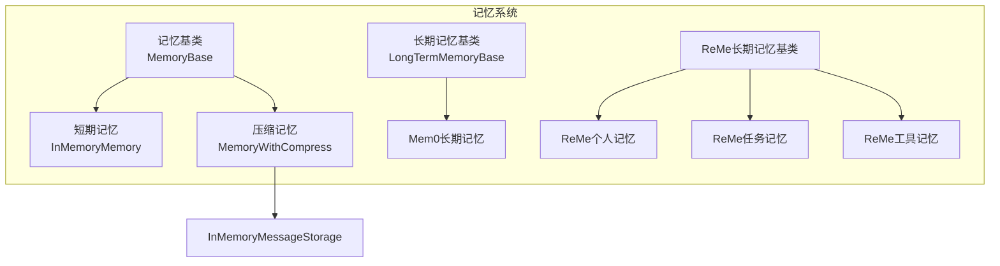
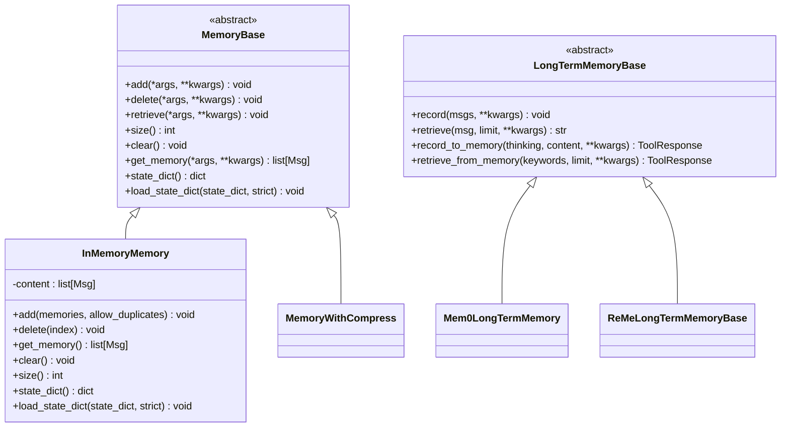
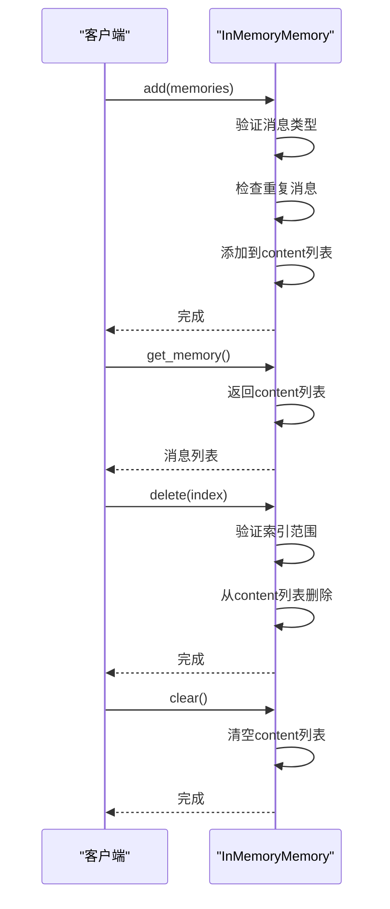
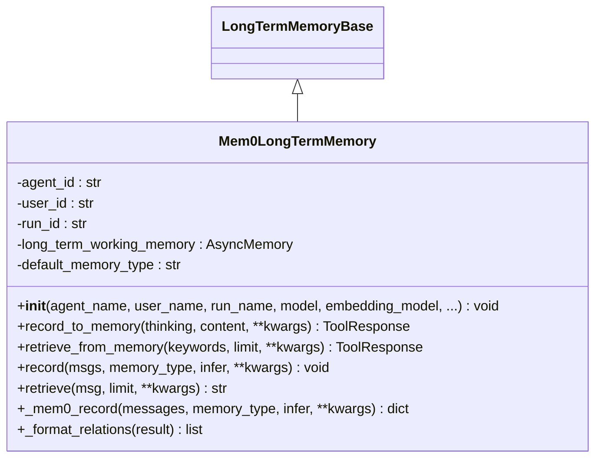
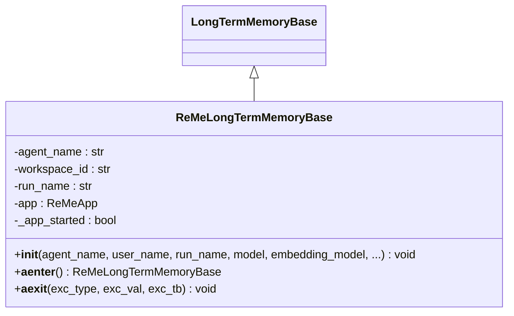
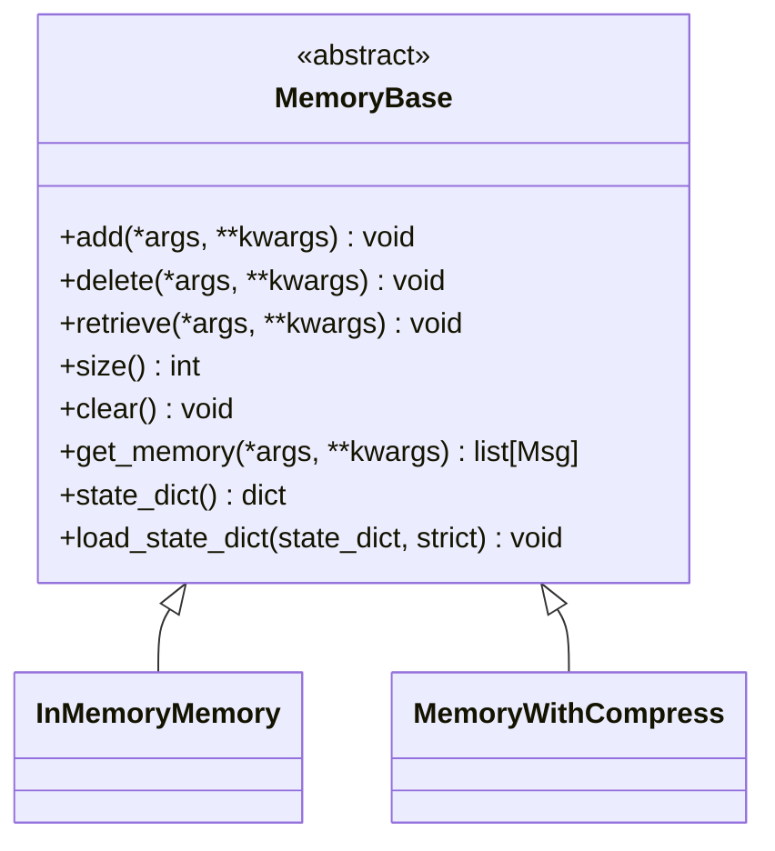
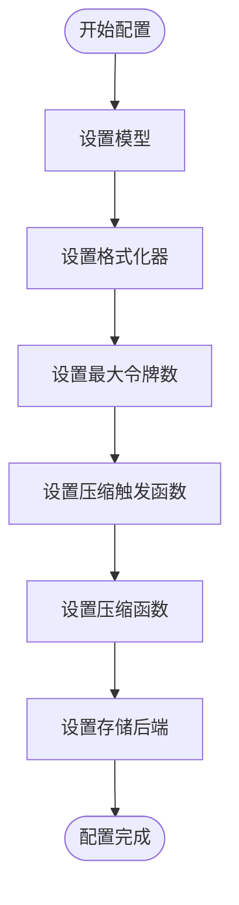
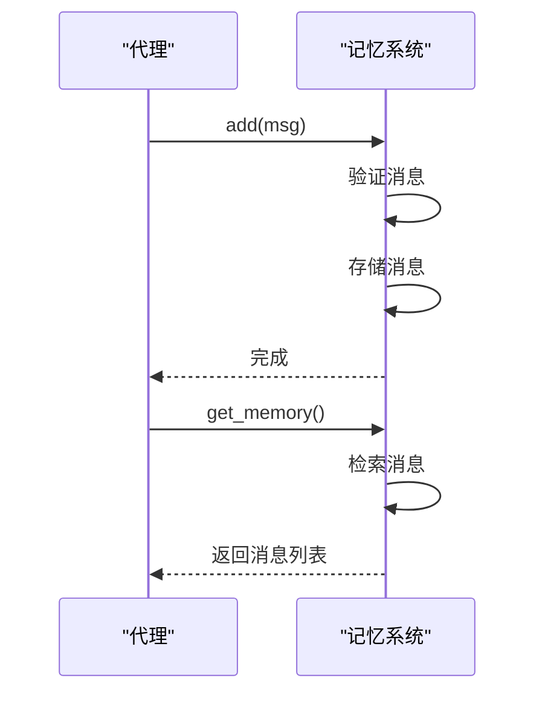
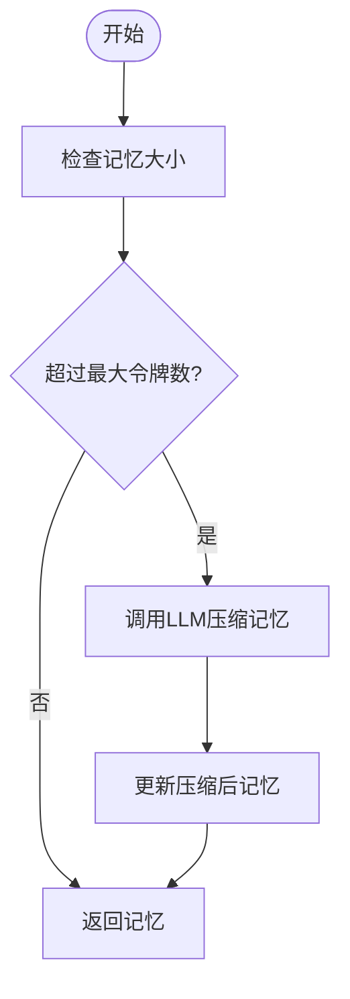

# 记忆系统

<cite>
**本文档中引用的文件**   
- [memory_base.py](file://src/agentscope/memory/_memory_base.py)
- [in_memory_memory.py](file://src/agentscope/memory/_in_memory_memory.py)
- [long_term_memory_base.py](file://src/agentscope/memory/_long_term_memory_base.py)
- [mem0_long_term_memory.py](file://src/agentscope/memory/_mem0_long_term_memory.py)
- [reme_long_term_memory_base.py](file://src/agentscope/memory/_reme/_reme_long_term_memory_base.py)
- [reme_personal_long_term_memory.py](file://src/agentscope/memory/_reme/_reme_personal_long_term_memory.py)
- [reme_task_long_term_memory.py](file://src/agentscope/memory/_reme/_reme_task_long_term_memory.py)
- [reme_tool_long_term_memory.py](file://src/agentscope/memory/_reme/_reme_tool_long_term_memory.py)
- [memory_with_compress.py](file://examples/functionality/memory/memory_with_compression/_memory_with_compress.py)
- [memory_storage.py](file://examples/functionality/memory/memory_with_compression/_memory_storage.py)
- [memory_example.py](file://examples/functionality/long_term_memory/mem0/memory_example.py)
- [personal_memory_example.py](file://examples/functionality/long_term_memory/reme/personal_memory_example.py)
- [task_memory_example.py](file://examples/functionality/long_term_memory/reme/task_memory_example.py)
- [short_term_memory_example.py](file://examples/functionality/short_term_memory/reme/short_term_memory_example.py)
</cite>

## 目录
1. [简介](#简介)
2. [记忆系统架构](#记忆系统架构)
3. [短期记忆与长期记忆](#短期记忆与长期记忆)
4. [内置内存存储机制](#内置内存存储机制)
5. [基于Mem0的长期记忆解决方案](#基于mem0的长期记忆解决方案)
6. [基于ReMe的长期记忆解决方案](#基于reme的长期记忆解决方案)
7. [记忆基类接口设计](#记忆基类接口设计)
8. [配置不同记忆后端](#配置不同记忆后端)
9. [记忆操作示例](#记忆操作示例)
10. [记忆压缩与检索优化](#记忆压缩与检索优化)
11. [数据持久化与备份恢复](#数据持久化与备份恢复)
12. [监控与性能调优](#监控与性能调优)
13. [结论](#结论)

## 简介

记忆系统是AgentScope框架的核心组件，为智能代理提供短期和长期记忆能力。该系统通过分层架构设计，支持多种记忆后端和存储机制，使代理能够跨会话保持上下文、学习经验并提供个性化服务。本文档全面介绍记忆系统的概念、实现方式和使用方法。

**Section sources**
- [memory_base.py](file://src/agentscope/memory/_memory_base.py#L1-L45)
- [in_memory_memory.py](file://src/agentscope/memory/_in_memory_memory.py#L1-L123)

## 记忆系统架构

**Diagram sources**
- [memory_base.py](file://src/agentscope/memory/_memory_base.py#L1-L45)
- [in_memory_memory.py](file://src/agentscope/memory/_in_memory_memory.py#L1-L123)
- [long_term_memory_base.py](file://src/agentscope/memory/_long_term_memory_base.py#L1-L95)
- [mem0_long_term_memory.py](file://src/agentscope/memory/_mem0_long_term_memory.py#L1-L624)
- [reme_long_term_memory_base.py](file://src/agentscope/memory/_reme/_reme_long_term_memory_base.py#L1-L371)

## 短期记忆与长期记忆

### 概念区别

短期记忆和长期记忆在AgentScope中扮演不同的角色。短期记忆主要用于存储当前会话的对话历史，其生命周期与会话绑定，适合处理即时上下文。长期记忆则用于跨会话存储重要信息，如用户偏好、任务经验和工具使用模式，具有持久性。

短期记忆通过`InMemoryMemory`类实现，将消息存储在内存中，支持添加、删除、检索等基本操作。长期记忆通过`LongTermMemoryBase`类及其子类实现，提供更复杂的记忆管理功能，包括基于内容的检索和语义搜索。

### 实现方式

短期记忆的实现基于`MemoryBase`抽象基类，通过`InMemoryMemory`类提供具体实现。该类维护一个消息列表，支持异步操作，确保在高并发场景下的性能。长期记忆的实现则更加多样化，支持Mem0和ReMe两种解决方案。

**Diagram sources**
- [memory_base.py](file://src/agentscope/memory/_memory_base.py#L1-L45)
- [in_memory_memory.py](file://src/agentscope/memory/_in_memory_memory.py#L1-L123)
- [long_term_memory_base.py](file://src/agentscope/memory/_long_term_memory_base.py#L1-L95)

**Section sources**
- [memory_base.py](file://src/agentscope/memory/_memory_base.py#L1-L45)
- [in_memory_memory.py](file://src/agentscope/memory/_in_memory_memory.py#L1-L123)
- [long_term_memory_base.py](file://src/agentscope/memory/_long_term_memory_base.py#L1-L95)

## 内置内存存储机制

### InMemoryMemory实现

`InMemoryMemory`是AgentScope内置的短期记忆实现，基于内存存储。它继承自`MemoryBase`基类，实现了所有抽象方法。该类的核心是`content`字段，一个存储`Msg`对象的列表。

**Diagram sources**
- [in_memory_memory.py](file://src/agentscope/memory/_in_memory_memory.py#L1-L123)

### 消息存储接口

`MessageStorageBase`是消息存储的抽象基类，定义了存储后端的统一接口。`InMemoryMessageStorage`是其具体实现，提供了内存存储功能。该接口支持异步上下文管理器，确保资源的正确初始化和清理。

**Section sources**
- [in_memory_memory.py](file://src/agentscope/memory/_in_memory_memory.py#L1-L123)
- [memory_storage.py](file://examples/functionality/memory/memory_with_compression/_memory_storage.py#L1-L274)

## 基于Mem0的长期记忆解决方案

### Mem0LongTermMemory实现

`Mem0LongTermMemory`类实现了基于Mem0库的长期记忆解决方案。该类通过集成Mem0库，提供了持久化的记忆存储和检索能力。初始化时需要提供代理名称、用户名称、模型和嵌入模型等参数。

**Diagram sources**
- [mem0_long_term_memory.py](file://src/agentscope/memory/_mem0_long_term_memory.py#L1-L624)

### 记忆记录与检索

`record_to_memory`方法采用三级回退策略确保内容持久化：首先尝试作为用户角色消息记录，如果失败则作为助手角色消息记录，最后直接记录而不进行推理。`retrieve_from_memory`方法支持基于关键词的并行搜索，提高检索效率。

**Section sources**
- [mem0_long_term_memory.py](file://src/agentscope/memory/_mem0_long_term_memory.py#L1-L624)
- [memory_example.py](file://examples/functionality/long_term_memory/mem0/memory_example.py#L1-L186)

## 基于ReMe的长期记忆解决方案

### ReMeLongTermMemoryBase实现

`ReMeLongTermMemoryBase`是基于ReMe库的长期记忆基类，为不同类型的长期记忆提供统一的基础。该类通过异步上下文管理器确保ReMe应用的正确初始化和清理。

**Diagram sources**
- [reme_long_term_memory_base.py](file://src/agentscope/memory/_reme/_reme_long_term_memory_base.py#L1-L371)

### 个人记忆实现

`ReMePersonalLongTermMemory`类用于存储用户个人偏好和习惯。它通过`record_to_memory`方法记录用户信息，通过`retrieve_from_memory`方法基于关键词检索相关信息。

**Section sources**
- [reme_long_term_memory_base.py](file://src/agentscope/memory/_reme/_reme_long_term_memory_base.py#L1-L371)
- [reme_personal_long_term_memory.py](file://src/agentscope/memory/_reme/_reme_personal_long_term_memory.py#L1-L415)
- [personal_memory_example.py](file://examples/functionality/long_term_memory/reme/personal_memory_example.py#L1-L296)

### 任务记忆实现

`ReMeTaskLongTermMemory`类用于存储任务执行经验和学习成果。它通过`record_to_memory`方法记录任务相关信息，通过`retrieve_from_memory`方法检索相关任务经验。

**Section sources**
- [reme_task_long_term_memory.py](file://src/agentscope/memory/_reme/_reme_task_long_term_memory.py#L1-L437)
- [task_memory_example.py](file://examples/functionality/long_term_memory/reme/task_memory_example.py#L1-L343)

### 工具记忆实现

`ReMeToolLongTermMemory`类用于记录工具执行结果和生成使用指南。它通过`record_to_memory`方法记录工具调用结果，通过`retrieve_from_memory`方法检索工具使用指南。

**Section sources**
- [reme_tool_long_term_memory.py](file://src/agentscope/memory/_reme/_reme_tool_long_term_memory.py#L1-L546)

## 记忆基类接口设计

### MemoryBase接口

`MemoryBase`是所有记忆实现的基类，定义了统一的接口。该接口包括添加、删除、检索、获取大小、清空、获取记忆内容、状态字典等方法。

**Diagram sources**
- [memory_base.py](file://src/agentscope/memory/_memory_base.py#L1-L45)

### 扩展点

`MemoryBase`类通过抽象方法为子类提供了扩展点。子类可以重写这些方法以提供特定的实现。例如，`InMemoryMemory`类实现了基于内存的存储，而`MemoryWithCompress`类实现了带压缩的记忆存储。

**Section sources**
- [memory_base.py](file://src/agentscope/memory/_memory_base.py#L1-L45)
- [in_memory_memory.py](file://src/agentscope/memory/_in_memory_memory.py#L1-L123)

## 配置不同记忆后端

### 参数设置

配置记忆后端时需要考虑多个参数，如最大令牌数、压缩触发函数、压缩函数等。这些参数可以通过构造函数传递，也可以在运行时动态调整。

**Diagram sources**
- [memory_with_compress.py](file://examples/functionality/memory/memory_with_compression/_memory_with_compress.py#L1-L714)

### 性能考量

选择记忆后端时需要考虑性能因素。内存存储提供最快的访问速度，但数据易失。持久化存储如Qdrant提供数据持久性，但可能有更高的延迟。压缩记忆在内存使用和性能之间提供平衡。

**Section sources**
- [memory_with_compress.py](file://examples/functionality/memory/memory_with_compression/_memory_with_compress.py#L1-L714)
- [memory_storage.py](file://examples/functionality/memory/memory_with_compression/_memory_storage.py#L1-L274)

## 记忆操作示例

### 读写操作

记忆的读写操作通过`add`和`get_memory`方法实现。写操作将消息添加到记忆中，读操作从记忆中检索消息。

**Diagram sources**
- [in_memory_memory.py](file://src/agentscope/memory/_in_memory_memory.py#L1-L123)

### 生命周期管理

记忆的生命周期通过`clear`方法管理。该方法清空记忆内容，重置记忆状态。

**Section sources**
- [in_memory_memory.py](file://src/agentscope/memory/_in_memory_memory.py#L1-L123)

### 查询功能

长期记忆支持基于内容的查询功能。`retrieve`方法根据输入消息检索相关信息，`retrieve_from_memory`方法根据关键词检索记忆。

**Section sources**
- [long_term_memory_base.py](file://src/agentscope/memory/_long_term_memory_base.py#L1-L95)
- [mem0_long_term_memory.py](file://src/agentscope/memory/_mem0_long_term_memory.py#L1-L624)

## 记忆压缩与检索优化

### 压缩技术

`MemoryWithCompress`类实现了记忆压缩功能。当记忆大小超过阈值时，系统会调用LLM将多条消息压缩为一条消息，从而减少内存使用。

**Diagram sources**
- [memory_with_compress.py](file://examples/functionality/memory/memory_with_compression/_memory_with_compress.py#L1-L714)

### 检索优化

检索优化通过并行搜索和缓存机制实现。系统支持基于关键词的并行搜索，提高检索效率。同时，通过缓存常用查询结果，减少重复计算。

**Section sources**
- [memory_with_compress.py](file://examples/functionality/memory/memory_with_compression/_memory_with_compress.py#L1-L714)
- [mem0_long_term_memory.py](file://src/agentscope/memory/_mem0_long_term_memory.py#L1-L624)

## 数据持久化与备份恢复

### 持久化策略

数据持久化通过集成外部存储系统实现。Mem0支持Qdrant等向量数据库，ReMe支持多种存储后端。这些系统提供数据持久化和高可用性。

**Section sources**
- [mem0_long_term_memory.py](file://src/agentscope/memory/_mem0_long_term_memory.py#L1-L624)
- [reme_long_term_memory_base.py](file://src/agentscope/memory/_reme/_reme_long_term_memory_base.py#L1-L371)

### 备份与恢复

备份与恢复通过`state_dict`和`load_state_dict`方法实现。`state_dict`方法将记忆状态序列化为字典，`load_state_dict`方法从字典恢复记忆状态。

**Section sources**
- [in_memory_memory.py](file://src/agentscope/memory/_in_memory_memory.py#L1-L123)
- [memory_with_compress.py](file://examples/functionality/memory/memory_with_compression/_memory_with_compress.py#L1-L714)

## 监控与性能调优

### 监控指标

监控记忆使用情况的关键指标包括记忆大小、访问频率、压缩率等。这些指标可以帮助识别性能瓶颈和优化机会。

**Section sources**
- [memory_with_compress.py](file://examples/functionality/memory/memory_with_compression/_memory_with_compress.py#L1-L714)

### 性能调优建议

性能调优建议包括合理设置最大令牌数、选择合适的压缩触发策略、优化存储后端配置等。定期监控和分析记忆使用模式，根据实际需求调整配置。

**Section sources**
- [memory_with_compress.py](file://examples/functionality/memory/memory_with_compression/_memory_with_compress.py#L1-L714)
- [mem0_long_term_memory.py](file://src/agentscope/memory/_mem0_long_term_memory.py#L1-L624)

## 结论

AgentScope的记忆系统提供了全面的短期和长期记忆解决方案。通过分层架构设计，系统支持多种记忆后端和存储机制，满足不同应用场景的需求。内置的内存存储机制适合短期上下文管理，而基于Mem0和ReMe的长期记忆解决方案提供了持久化的记忆存储和检索能力。通过合理的配置和优化，可以构建高效、可靠的智能代理系统。