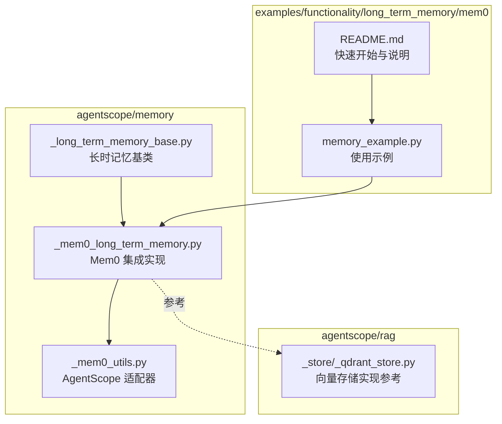
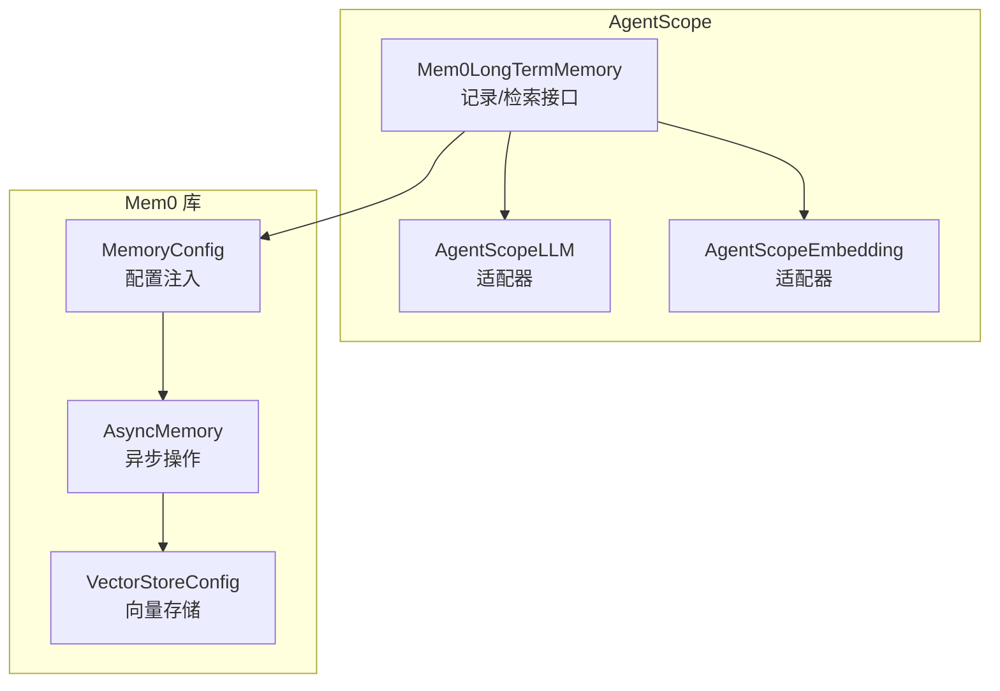
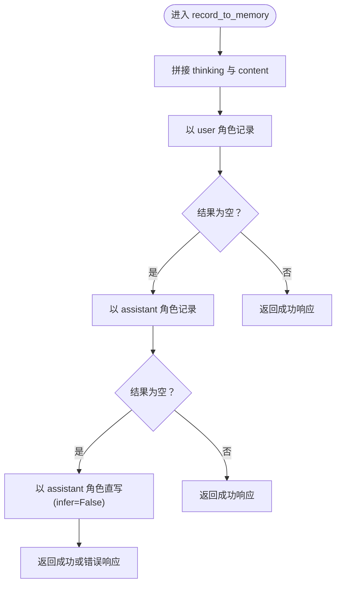
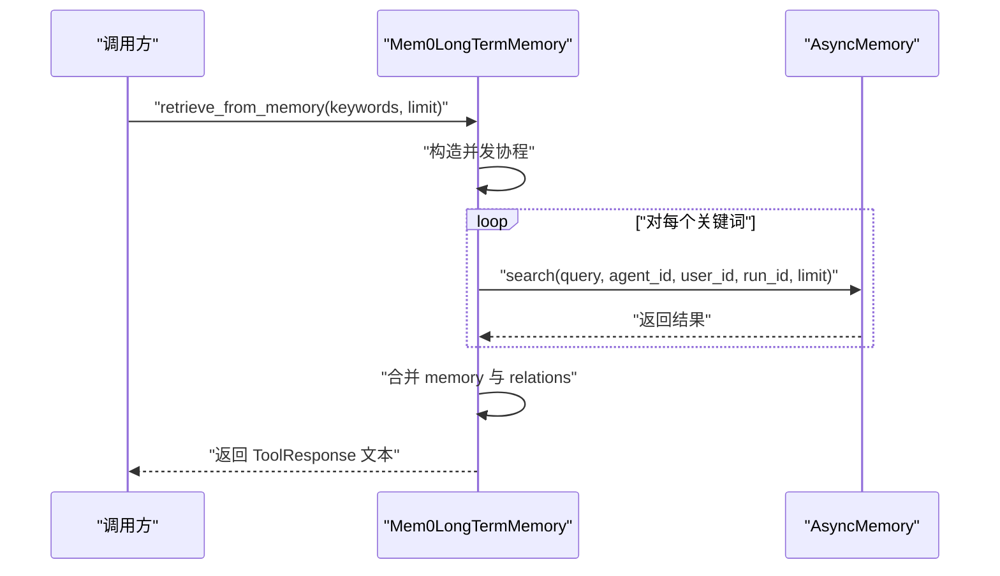
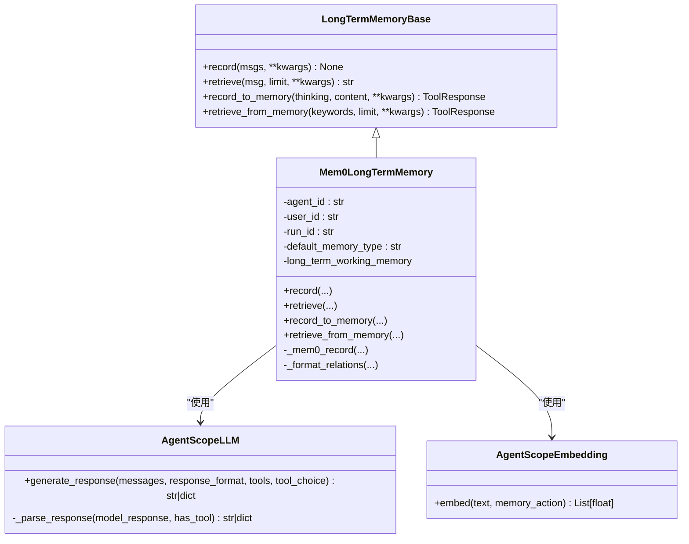

# Mem0 长期记忆集成

<cite>
**本文引用的文件**
- [src/agentscope/memory/_mem0_long_term_memory.py](file://src/agentscope/memory/_mem0_long_term_memory.py)
- [src/agentscope/memory/_mem0_utils.py](file://src/agentscope/memory/_mem0_utils.py)
- [src/agentscope/memory/_long_term_memory_base.py](file://src/agentscope/memory/_long_term_memory_base.py)
- [examples/functionality/long_term_memory/mem0/memory_example.py](file://examples/functionality/long_term_memory/mem0/memory_example.py)
- [examples/functionality/long_term_memory/mem0/README.md](file://examples/functionality/long_term_memory/mem0/README.md)
- [src/agentscope/rag/_store/_qdrant_store.py](file://src/agentscope/rag/_store/_qdrant_store.py)
</cite>

## 目录
1. [引言](#引言)
2. [项目结构](#项目结构)
3. [核心组件](#核心组件)
4. [架构总览](#架构总览)
5. [详细组件分析](#详细组件分析)
6. [依赖关系分析](#依赖关系分析)
7. [性能考量](#性能考量)
8. [故障排查指南](#故障排查指南)
9. [结论](#结论)
10. [附录](#附录)

## 引言
本文件面向希望在 AgentScope 框架中集成 Mem0 长期记忆能力的开发者，系统阐述 Mem0 作为外部记忆系统的架构理念与其在 AgentScope 中的集成机制。重点覆盖以下方面：
- Mem0LongTermMemory 类的初始化流程、配置参数与连接管理
- 与 Mem0 API 的交互协议、数据序列化格式与错误处理策略
- 在实际项目中配置与使用 Mem0 记忆后端的完整示例（含环境变量、依赖安装与性能调优）
- 多智能体场景下的记忆隔离机制与数据一致性保障
- 与其他记忆系统的对比与选型建议

## 项目结构
围绕 Mem0 集成的相关源码主要位于 agentscope/memory 子模块，示例位于 examples/functionality/long_term_memory/mem0。整体组织遵循“接口抽象 + 具体实现 + 工具适配 + 示例”的分层设计。

图表来源
- [src/agentscope/memory/_long_term_memory_base.py](file://src/agentscope/memory/_long_term_memory_base.py#L1-L95)
- [src/agentscope/memory/_mem0_long_term_memory.py](file://src/agentscope/memory/_mem0_long_term_memory.py#L1-L120)
- [src/agentscope/memory/_mem0_utils.py](file://src/agentscope/memory/_mem0_utils.py#L1-L60)
- [examples/functionality/long_term_memory/mem0/memory_example.py](file://examples/functionality/long_term_memory/mem0/memory_example.py#L1-L60)
- [examples/functionality/long_term_memory/mem0/README.md](file://examples/functionality/long_term_memory/mem0/README.md#L1-L60)
- [src/agentscope/rag/_store/_qdrant_store.py](file://src/agentscope/rag/_store/_qdrant_store.py#L1-L40)

章节来源
- [src/agentscope/memory/_long_term_memory_base.py](file://src/agentscope/memory/_long_term_memory_base.py#L1-L95)
- [src/agentscope/memory/_mem0_long_term_memory.py](file://src/agentscope/memory/_mem0_long_term_memory.py#L1-L120)
- [examples/functionality/long_term_memory/mem0/README.md](file://examples/functionality/long_term_memory/mem0/README.md#L1-L60)

## 核心组件
- 长时记忆基类：定义统一的记录与检索接口，支持两类工具方法（由智能体主动调用）与两类开发者方法（由框架自动调用）。
- Mem0 集成实现：基于 Mem0 的 AsyncMemory 实现，负责配置注入、消息转换、异步检索与记录、关系格式化等。
- AgentScope 适配器：为 Mem0 提供 LLM 与 Embedding 的适配器，使 Mem0 能够使用 AgentScope 的模型与嵌入能力。
- 示例与文档：演示如何初始化、记录、检索以及与 ReActAgent 集成。

章节来源
- [src/agentscope/memory/_long_term_memory_base.py](file://src/agentscope/memory/_long_term_memory_base.py#L1-L95)
- [src/agentscope/memory/_mem0_long_term_memory.py](file://src/agentscope/memory/_mem0_long_term_memory.py#L73-L134)
- [src/agentscope/memory/_mem0_utils.py](file://src/agentscope/memory/_mem0_utils.py#L20-L165)

## 架构总览
Mem0 集成采用“适配器 + 配置注入 + 异步操作”的架构模式：
- 适配器层：AgentScopeLLM 与 AgentScopeEmbedding 将 AgentScope 的模型响应与嵌入结果转换为 Mem0 所需的格式。
- 配置层：动态注册 AgentScope 提供商至 Mem0 的工厂映射；根据传入参数或自动生成 MemoryConfig，并注入 LLM、Embedder、VectorStore 等组件。
- 业务层：Mem0LongTermMemory 对外暴露 record/retrieve 与 record_to_memory/retrieve_from_memory 接口，内部通过 AsyncMemory 完成持久化与检索。
- 连接层：默认使用 Qdrant 向量存储（可配置 on_disk 以启用持久化），支持关系检索与格式化输出。

图表来源
- [src/agentscope/memory/_mem0_long_term_memory.py](file://src/agentscope/memory/_mem0_long_term_memory.py#L142-L257)
- [src/agentscope/memory/_mem0_utils.py](file://src/agentscope/memory/_mem0_utils.py#L20-L165)

## 详细组件分析

### Mem0LongTermMemory 初始化与配置
- 参数与约束
  - 至少需要提供 agent_name、user_name 或 run_name 之一，用于检索时的元数据过滤。
  - 若未提供 mem0_config，则必须同时提供 model 与 embedding_model；否则抛出异常。
  - vector_store_config 默认使用 Qdrant，且默认开启 on_disk 以保证持久化。
- 版本兼容性
  - 动态检测 mem0ai 版本，针对不同版本注册 LLM 适配器的方式略有差异。
- 配置注入
  - 当提供 mem0_config 时，可选择性覆盖其中的 llm、embedder、vector_store 字段。
  - 当未提供 mem0_config 时，按传入的 model、embedding_model、vector_store_config 自动构建 MemoryConfig。
- 初始化连接
  - 创建 AsyncMemory 实例，保存默认 memory_type，供后续检索使用。

章节来源
- [src/agentscope/memory/_mem0_long_term_memory.py](file://src/agentscope/memory/_mem0_long_term_memory.py#L142-L257)

### 适配器：AgentScopeLLM 与 AgentScopeEmbedding
- AgentScopeLLM
  - 将 Mem0 的消息格式转换为 AgentScope 的消息列表，调用 ChatModelBase 生成响应，并解析为字符串或包含 tool_calls 的字典。
  - 支持从 ChatResponse 的多种内容块（文本、思考、工具调用）中提取信息。
- AgentScopeEmbedding
  - 将文本或文本列表输入嵌入模型，返回向量数组；对首个 Embedding 对象的 embedding 属性进行提取。

章节来源
- [src/agentscope/memory/_mem0_utils.py](file://src/agentscope/memory/_mem0_utils.py#L20-L165)
- [src/agentscope/memory/_mem0_utils.py](file://src/agentscope/memory/_mem0_utils.py#L166-L241)

### 记录与检索流程

#### 记录流程（record_to_memory）
- 多策略回退机制，确保即使 Mem0 推理失败也能保留原始内容：
  1) 优先以“user”角色消息记录；
  2) 若第一条记录结果为空，尝试以“assistant”角色消息记录；
  3) 若仍为空，直接禁用推理（infer=False）进行直写。
- 返回 ToolResponse，便于智能体工具链消费。

图表来源
- [src/agentscope/memory/_mem0_long_term_memory.py](file://src/agentscope/memory/_mem0_long_term_memory.py#L258-L384)

章节来源
- [src/agentscope/memory/_mem0_long_term_memory.py](file://src/agentscope/memory/_mem0_long_term_memory.py#L258-L384)

#### 检索流程（retrieve_from_memory 与 retrieve）
- 并发查询：对每个关键词并发执行 search，使用 asyncio.gather 收集结果。
- 结果合并：将每条结果中的 memory 字段拼接为字符串；若存在 relations，调用 _format_relations 格式化为“源 -- 关系 -- 目标”形式。
- 元数据过滤：检索时携带 agent_id、user_id、run_id，确保仅返回匹配元数据的记忆。

图表来源
- [src/agentscope/memory/_mem0_long_term_memory.py](file://src/agentscope/memory/_mem0_long_term_memory.py#L385-L450)
- [src/agentscope/memory/_mem0_long_term_memory.py](file://src/agentscope/memory/_mem0_long_term_memory.py#L560-L624)

章节来源
- [src/agentscope/memory/_mem0_long_term_memory.py](file://src/agentscope/memory/_mem0_long_term_memory.py#L385-L450)
- [src/agentscope/memory/_mem0_long_term_memory.py](file://src/agentscope/memory/_mem0_long_term_memory.py#L560-L624)

### 数据序列化与交互协议
- 输入消息格式
  - record_to_memory/retrieve_from_memory：内部将内容转为 Mem0 所需的消息字典（role、content、name）。
  - retrieve：将 Msg 的 content 序列化为 JSON 字符串后作为查询词。
- 输出格式
  - 检索结果以字符串形式返回，包含 memory 与 relations 的格式化内容。
  - 记录结果封装为 ToolResponse，便于智能体工具链消费。
- 适配器协议
  - AgentScopeLLM.generate_response 返回字符串或包含 tool_calls 的字典，符合 Mem0 的期望格式。
  - AgentScopeEmbedding.embed 返回向量数组，满足向量存储的嵌入需求。

章节来源
- [src/agentscope/memory/_mem0_long_term_memory.py](file://src/agentscope/memory/_mem0_long_term_memory.py#L258-L384)
- [src/agentscope/memory/_mem0_long_term_memory.py](file://src/agentscope/memory/_mem0_long_term_memory.py#L560-L624)
- [src/agentscope/memory/_mem0_utils.py](file://src/agentscope/memory/_mem0_utils.py#L20-L165)
- [src/agentscope/memory/_mem0_utils.py](file://src/agentscope/memory/_mem0_utils.py#L166-L241)

### 错误处理与重试策略
- 导入与版本检查
  - 缺失 mem0ai 时抛出 ImportError，并提示安装命令。
  - 动态检测版本，避免因版本差异导致的注册失败。
- 参数校验
  - 未提供 mem0_config 时，若缺少 model 或 embedding_model 则抛出异常。
  - 输入消息类型校验，非 Msg 对象将触发 TypeError。
- 记录与检索的容错
  - 记录阶段采用三段式回退策略，确保至少一次直写成功。
  - 检索阶段捕获异常并返回包含错误信息的 ToolResponse。
- 建议的重试策略
  - 在上层调用处对网络/服务不稳定的情况增加指数退避重试（例如对检索失败进行最多 N 次重试，每次等待 2^i 秒）。
  - 对于嵌入或推理失败，可在上层进行降级处理（如禁用推理或切换到更稳定的模型）。

章节来源
- [src/agentscope/memory/_mem0_long_term_memory.py](file://src/agentscope/memory/_mem0_long_term_memory.py#L142-L257)
- [src/agentscope/memory/_mem0_long_term_memory.py](file://src/agentscope/memory/_mem0_long_term_memory.py#L258-L384)
- [src/agentscope/memory/_mem0_long_term_memory.py](file://src/agentscope/memory/_mem0_long_term_memory.py#L385-L450)
- [src/agentscope/memory/_mem0_long_term_memory.py](file://src/agentscope/memory/_mem0_long_term_memory.py#L560-L624)

### 多智能体场景下的记忆隔离与一致性
- 隔离机制
  - 通过 agent_id、user_id、run_id 三元元数据在检索时进行过滤，确保不同智能体、用户或会话间的数据相互隔离。
- 一致性保障
  - 使用向量相似度检索，结合 on_disk 的 Qdrant 存储，保证跨进程/重启的一致性。
  - 记录阶段的三段式回退策略降低因推理失败导致的数据丢失风险。
- 建议
  - 在多智能体协作场景中，建议为每个智能体分配独立的 agent_id，并为不同用户或工作空间设置不同的 user_id。
  - 对于跨会话的偏好记忆，建议使用 record_to_memory 的直写模式（infer=False）确保关键事实被可靠记录。

章节来源
- [src/agentscope/memory/_mem0_long_term_memory.py](file://src/agentscope/memory/_mem0_long_term_memory.py#L189-L257)
- [src/agentscope/memory/_mem0_long_term_memory.py](file://src/agentscope/memory/_mem0_long_term_memory.py#L385-L450)
- [src/agentscope/memory/_mem0_long_term_memory.py](file://src/agentscope/memory/_mem0_long_term_memory.py#L560-L624)

### 与 AgentScope 框架的集成点
- ReActAgent 集成
  - 通过 Toolkit 注册 record_to_memory 与 retrieve_from_memory 两个工具函数，使智能体在对话过程中自动记录与检索偏好。
  - long_term_memory_mode 设置为 "both" 时，智能体既可使用工具，也可由框架在回复前后自动调用 record/retrieve。
- 短期记忆配合
  - 长期记忆与短期记忆（如 InMemoryMemory）协同使用，短期记忆承载当前对话上下文，长期记忆承载跨会话的偏好与经验。

章节来源
- [examples/functionality/long_term_memory/mem0/memory_example.py](file://examples/functionality/long_term_memory/mem0/memory_example.py#L120-L186)
- [examples/functionality/long_term_memory/mem0/README.md](file://examples/functionality/long_term_memory/mem0/README.md#L93-L132)

## 依赖关系分析

图表来源
- [src/agentscope/memory/_long_term_memory_base.py](file://src/agentscope/memory/_long_term_memory_base.py#L1-L95)
- [src/agentscope/memory/_mem0_long_term_memory.py](file://src/agentscope/memory/_mem0_long_term_memory.py#L73-L134)
- [src/agentscope/memory/_mem0_utils.py](file://src/agentscope/memory/_mem0_utils.py#L20-L165)
- [src/agentscope/memory/_mem0_utils.py](file://src/agentscope/memory/_mem0_utils.py#L166-L241)

章节来源
- [src/agentscope/memory/_long_term_memory_base.py](file://src/agentscope/memory/_long_term_memory_base.py#L1-L95)
- [src/agentscope/memory/_mem0_long_term_memory.py](file://src/agentscope/memory/_mem0_long_term_memory.py#L73-L134)
- [src/agentscope/memory/_mem0_utils.py](file://src/agentscope/memory/_mem0_utils.py#L20-L165)
- [src/agentscope/memory/_mem0_utils.py](file://src/agentscope/memory/_mem0_utils.py#L166-L241)

## 性能考量
- 异步与并发
  - 检索阶段使用 asyncio.gather 并发查询多个关键词，显著降低总延迟。
- 向量存储选择
  - 默认使用 Qdrant，开启 on_disk 可持久化；对于高吞吐场景，建议评估远程 Qdrant 或云原生向量服务。
- 维度与索引
  - 嵌入维度与向量存储配置需保持一致；变更维度或路径时应清理旧数据库或更换新路径，避免维度不匹配。
- 记录策略
  - 对关键事实使用直写（infer=False）减少推理开销与不确定性。
- 资源管理
  - 在多智能体场景中，合理划分 agent_id、user_id、run_id，避免检索范围过大导致的性能下降。

章节来源
- [src/agentscope/memory/_mem0_long_term_memory.py](file://src/agentscope/memory/_mem0_long_term_memory.py#L385-L450)
- [examples/functionality/long_term_memory/mem0/README.md](file://examples/functionality/long_term_memory/mem0/README.md#L90-L92)
- [src/agentscope/rag/_store/_qdrant_store.py](file://src/agentscope/rag/_store/_qdrant_store.py#L18-L40)

## 故障排查指南
- 依赖缺失
  - 现象：导入 mem0ai 报错。
  - 处理：按照提示安装 mem0ai，并确保版本满足要求。
- 参数缺失
  - 现象：初始化时报错，提示缺少 model 或 embedding_model。
  - 处理：提供 mem0_config 或补齐 model 与 embedding_model。
- 维度不匹配
  - 现象：启动或检索时报维度不一致错误。
  - 处理：更换嵌入模型或调整 embedding_model_dims，或清理旧数据库并更换存储路径。
- 检索无结果
  - 现象：检索不到预期记忆。
  - 处理：确认 keywords 是否准确；检查 agent_id、user_id、run_id 是否与记录时一致；必要时使用直写模式重新记录。
- 记录失败
  - 现象：record_to_memory 返回错误信息。
  - 处理：查看返回的 ToolResponse 文本；必要时关闭推理（infer=False）进行直写。

章节来源
- [src/agentscope/memory/_mem0_long_term_memory.py](file://src/agentscope/memory/_mem0_long_term_memory.py#L142-L257)
- [examples/functionality/long_term_memory/mem0/README.md](file://examples/functionality/long_term_memory/mem0/README.md#L90-L92)
- [src/agentscope/memory/_mem0_long_term_memory.py](file://src/agentscope/memory/_mem0_long_term_memory.py#L258-L384)
- [src/agentscope/memory/_mem0_long_term_memory.py](file://src/agentscope/memory/_mem0_long_term_memory.py#L385-L450)

## 结论
Mem0 集成在 AgentScope 中提供了高性能、可扩展的长期记忆能力。通过适配器与配置注入，实现了对 AgentScope 模型与嵌入的无缝对接；通过三段式记录回退策略与并发检索，兼顾了可靠性与性能。在多智能体场景下，借助 agent_id、user_id、run_id 的元数据隔离，能够有效保障数据一致性与隐私。建议在生产环境中结合指数退避重试、合理的向量存储配置与直写策略，进一步提升稳定性与可维护性。

## 附录

### 快速开始与示例
- 安装与依赖
  - 安装 agentscope 并确保具备 DashScope API Key。
  - 安装 mem0ai 依赖。
- 环境变量
  - 设置 DASHSCOPE_API_KEY。
- 初始化与使用
  - 使用 DashScope ChatModel 与 TextEmbedding 初始化 Mem0LongTermMemory。
  - 配置 VectorStoreConfig，推荐开启 on_disk 并指定存储路径。
  - 与 ReActAgent 集成，启用 long_term_memory_mode="both"，通过工具记录与检索偏好。

章节来源
- [examples/functionality/long_term_memory/mem0/README.md](file://examples/functionality/long_term_memory/mem0/README.md#L18-L41)
- [examples/functionality/long_term_memory/mem0/README.md](file://examples/functionality/long_term_memory/mem0/README.md#L56-L92)
- [examples/functionality/long_term_memory/mem0/README.md](file://examples/functionality/long_term_memory/mem0/README.md#L93-L132)
- [examples/functionality/long_term_memory/mem0/memory_example.py](file://examples/functionality/long_term_memory/mem0/memory_example.py#L26-L51)
- [examples/functionality/long_term_memory/mem0/memory_example.py](file://examples/functionality/long_term_memory/mem0/memory_example.py#L120-L186)

### 与其他记忆系统的对比
- 与 ReMe 系统对比
  - Mem0 更强调与外部向量存储（如 Qdrant）的深度集成与关系检索能力；ReMe 则提供更丰富的“个人/任务/工具”记忆类型与上下文生命周期管理。
  - Mem0 在 AgentScope 中通过适配器直接复用现有模型与嵌入；ReMe 需要额外的配置与上下文管理。
- 适用场景
  - 需要强语义检索与关系图谱：优先考虑 Mem0。
  - 需要多类型记忆与上下文生命周期管理：可考虑 ReMe。

章节来源
- [src/agentscope/memory/_reme/_reme_long_term_memory_base.py](file://src/agentscope/memory/_reme/_reme_long_term_memory_base.py#L1-L120)
- [src/agentscope/memory/_mem0_long_term_memory.py](file://src/agentscope/memory/_mem0_long_term_memory.py#L73-L134)