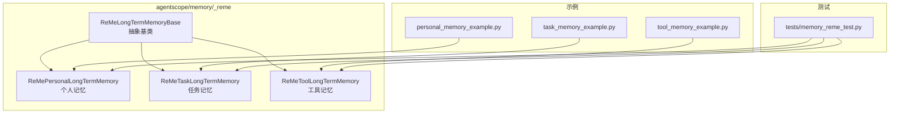
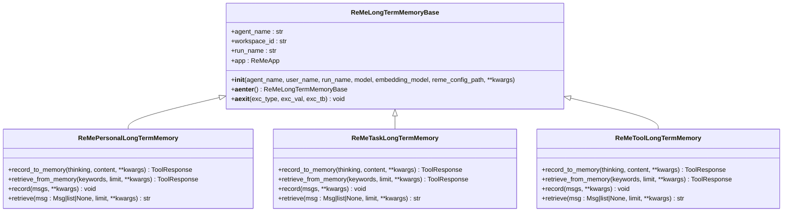
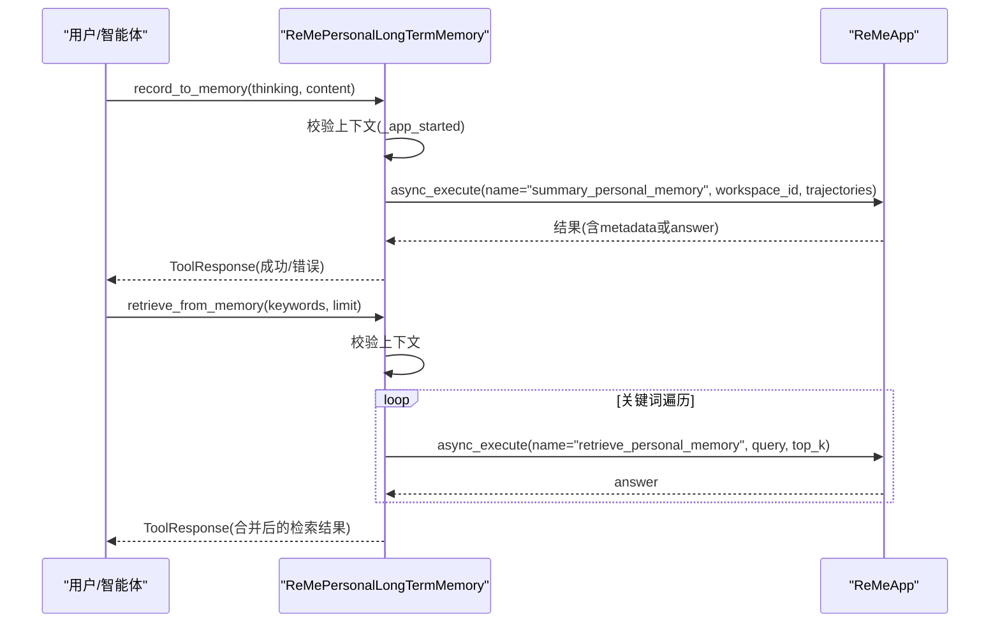
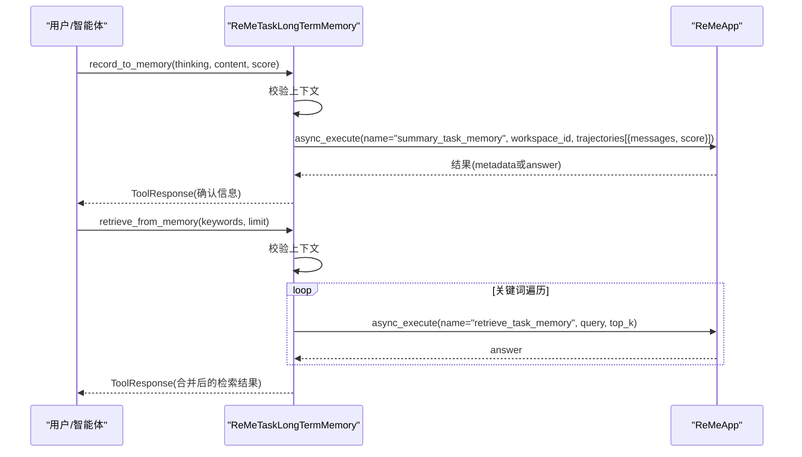
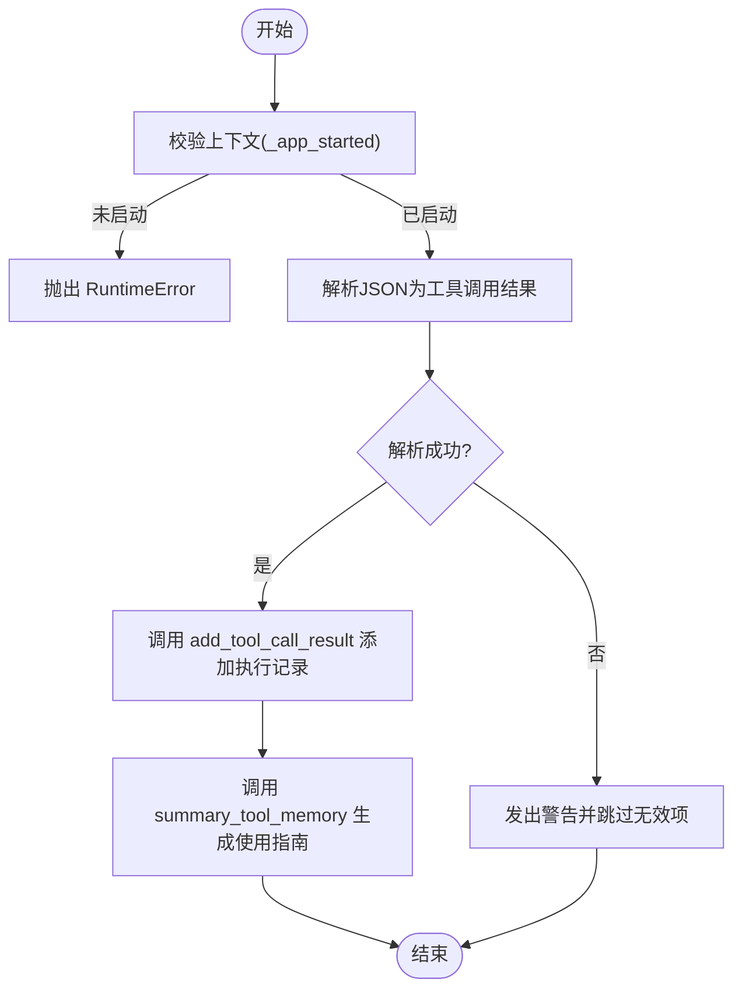
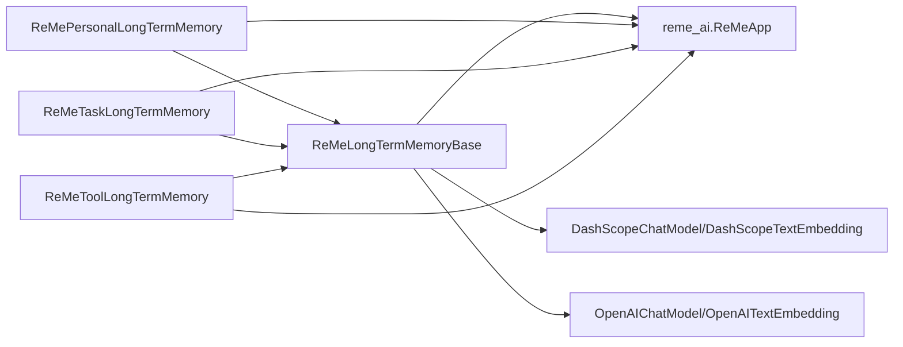

# ReMe 长期记忆系统

<cite>
**本文引用的文件**
- [src/agentscope/memory/_reme/_reme_long_term_memory_base.py](file://src/agentscope/memory/_reme/_reme_long_term_memory_base.py)
- [src/agentscope/memory/_reme/_reme_personal_long_term_memory.py](file://src/agentscope/memory/_reme/_reme_personal_long_term_memory.py)
- [src/agentscope/memory/_reme/_reme_task_long_term_memory.py](file://src/agentscope/memory/_reme/_reme_task_long_term_memory.py)
- [src/agentscope/memory/_reme/_reme_tool_long_term_memory.py](file://src/agentscope/memory/_reme/_reme_tool_long_term_memory.py)
- [examples/functionality/long_term_memory/reme/personal_memory_example.py](file://examples/functionality/long_term_memory/reme/personal_memory_example.py)
- [examples/functionality/long_term_memory/reme/task_memory_example.py](file://examples/functionality/long_term_memory/reme/task_memory_example.py)
- [examples/functionality/long_term_memory/reme/tool_memory_example.py](file://examples/functionality/long_term_memory/reme/tool_memory_example.py)
- [tests/memory_reme_test.py](file://tests/memory_reme_test.py)
</cite>

## 目录
1. [简介](#简介)
2. [项目结构](#项目结构)
3. [核心组件](#核心组件)
4. [架构总览](#架构总览)
5. [详细组件分析](#详细组件分析)
6. [依赖关系分析](#依赖关系分析)
7. [性能与可扩展性](#性能与可扩展性)
8. [故障排查指南](#故障排查指南)
9. [结论](#结论)
10. [附录：使用示例与最佳实践](#附录使用示例与最佳实践)

## 简介
本文件系统性阐述 ReMe 长期记忆系统在 AgentScope 中的架构设计与实现细节，覆盖：
- 抽象基类 ReMeLongTermMemoryBase 及其派生类（个人记忆、任务记忆、工具记忆）的职责划分与接口设计
- 不同类型长期记忆的存储策略、生命周期管理与查询接口
- 在智能体中注入 ReMe 记忆实例并进行读写操作的方法
- 元数据索引机制、异步持久化流程与故障恢复能力
- 性能基准与大规模部署的分片策略建议

## 项目结构
ReMe 长期记忆模块位于 agentscope/memory/_reme 下，包含抽象基类与三种具体记忆类型，配套示例与单元测试。

图示来源
- [src/agentscope/memory/_reme/_reme_long_term_memory_base.py](file://src/agentscope/memory/_reme/_reme_long_term_memory_base.py#L83-L120)
- [src/agentscope/memory/_reme/_reme_personal_long_term_memory.py](file://src/agentscope/memory/_reme/_reme_personal_long_term_memory.py#L17-L25)
- [src/agentscope/memory/_reme/_reme_task_long_term_memory.py](file://src/agentscope/memory/_reme/_reme_task_long_term_memory.py#L17-L24)
- [src/agentscope/memory/_reme/_reme_tool_long_term_memory.py](file://src/agentscope/memory/_reme/_reme_tool_long_term_memory.py#L17-L24)
- [examples/functionality/long_term_memory/reme/personal_memory_example.py](file://examples/functionality/long_term_memory/reme/personal_memory_example.py#L245-L296)
- [examples/functionality/long_term_memory/reme/task_memory_example.py](file://examples/functionality/long_term_memory/reme/task_memory_example.py#L292-L343)
- [examples/functionality/long_term_memory/reme/tool_memory_example.py](file://examples/functionality/long_term_memory/reme/tool_memory_example.py#L347-L437)
- [tests/memory_reme_test.py](file://tests/memory_reme_test.py#L1-L120)

章节来源
- [src/agentscope/memory/_reme/_reme_long_term_memory_base.py](file://src/agentscope/memory/_reme/_reme_long_term_memory_base.py#L83-L120)
- [src/agentscope/memory/_reme/_reme_personal_long_term_memory.py](file://src/agentscope/memory/_reme/_reme_personal_long_term_memory.py#L17-L25)
- [src/agentscope/memory/_reme/_reme_task_long_term_memory.py](file://src/agentscope/memory/_reme/_reme_task_long_term_memory.py#L17-L24)
- [src/agentscope/memory/_reme/_reme_tool_long_term_memory.py](file://src/agentscope/memory/_reme/_reme_tool_long_term_memory.py#L17-L24)

## 核心组件
- 抽象基类 ReMeLongTermMemoryBase
  - 负责 ReMe 应用初始化、模型参数提取、异步上下文管理、错误处理与运行时状态跟踪
  - 提供统一的 async 上下文协议（__aenter__/__aexit__），确保资源正确初始化与清理
  - 维护 agent_name、workspace_id（映射到 ReMe 的 workspace_id）、run_name 等标识
- 派生类职责
  - ReMePersonalLongTermMemory：面向用户偏好、习惯、事实等个人知识的记忆记录与检索
  - ReMeTaskLongTermMemory：面向任务执行经验、最佳实践、失败教训等任务知识的记忆记录与检索
  - ReMeToolLongTermMemory：面向工具调用结果、参数组合、性能指标等工具使用模式的记忆记录与检索，并生成使用指南

章节来源
- [src/agentscope/memory/_reme/_reme_long_term_memory_base.py](file://src/agentscope/memory/_reme/_reme_long_term_memory_base.py#L190-L210)
- [src/agentscope/memory/_reme/_reme_personal_long_term_memory.py](file://src/agentscope/memory/_reme/_reme_personal_long_term_memory.py#L17-L25)
- [src/agentscope/memory/_reme/_reme_task_long_term_memory.py](file://src/agentscope/memory/_reme/_reme_task_long_term_memory.py#L17-L24)
- [src/agentscope/memory/_reme/_reme_tool_long_term_memory.py](file://src/agentscope/memory/_reme/_reme_tool_long_term_memory.py#L17-L24)

## 架构总览
ReMe 长期记忆系统通过 ReMeLongTermMemoryBase 与 ReMeApp 进行集成，支持 DashScope/OpenAI 的 LLM 与 Embedding 模型配置；三类记忆分别封装不同的“摘要/检索”工作流，统一通过 async 上下文管理器进行生命周期控制。

图示来源
- [src/agentscope/memory/_reme/_reme_long_term_memory_base.py](file://src/agentscope/memory/_reme/_reme_long_term_memory_base.py#L83-L120)
- [src/agentscope/memory/_reme/_reme_personal_long_term_memory.py](file://src/agentscope/memory/_reme/_reme_personal_long_term_memory.py#L17-L25)
- [src/agentscope/memory/_reme/_reme_task_long_term_memory.py](file://src/agentscope/memory/_reme/_reme_task_long_term_memory.py#L17-L24)
- [src/agentscope/memory/_reme/_reme_tool_long_term_memory.py](file://src/agentscope/memory/_reme/_reme_tool_long_term_memory.py#L17-L24)

## 详细组件分析

### 抽象基类：ReMeLongTermMemoryBase
- 初始化与配置
  - 接收 agent_name、user_name（映射为 workspace_id）、run_name、LLM/Embedding 模型对象与可选 ReMe 配置路径
  - 自动提取模型名称、API Key、基础地址与嵌入维度，构建 ReMeApp 启动参数
  - 支持 DashScope 固定端点与 OpenAI 自定义 base_url
- 异步上下文管理
  - __aenter__：进入 async with 时启动 ReMeApp，标记 _app_started=True
  - __aexit__：退出时关闭 ReMeApp 并重置 _app_started=False
- 错误处理
  - 若未安装 reme_ai，初始化阶段抛出 ImportError 并提示安装
  - 所有公开方法在未启动上下文时抛出 RuntimeError，避免误用

章节来源
- [src/agentscope/memory/_reme/_reme_long_term_memory_base.py](file://src/agentscope/memory/_reme/_reme_long_term_memory_base.py#L190-L210)
- [src/agentscope/memory/_reme/_reme_long_term_memory_base.py](file://src/agentscope/memory/_reme/_reme_long_term_memory_base.py#L266-L288)
- [src/agentscope/memory/_reme/_reme_long_term_memory_base.py](file://src/agentscope/memory/_reme/_reme_long_term_memory_base.py#L293-L371)

### 个人记忆：ReMePersonalLongTermMemory
- 记录接口
  - record_to_memory：显式记录思考与内容片段，内部转换为消息序列并调用 ReMe 的“摘要”流程
  - record：直接接收消息列表，按对话格式转换后摘要
- 检索接口
  - retrieve_from_memory：关键词检索，逐词查询并合并答案
  - retrieve：从消息中抽取最后一条消息的内容作为查询
- 生命周期与异常
  - 均要求在 async with 内部调用，否则抛出 RuntimeError
  - 异常时返回 ToolResponse 或空字符串，并记录日志

图示来源
- [src/agentscope/memory/_reme/_reme_personal_long_term_memory.py](file://src/agentscope/memory/_reme/_reme_personal_long_term_memory.py#L20-L154)
- [src/agentscope/memory/_reme/_reme_personal_long_term_memory.py](file://src/agentscope/memory/_reme/_reme_personal_long_term_memory.py#L155-L251)
- [src/agentscope/memory/_reme/_reme_personal_long_term_memory.py](file://src/agentscope/memory/_reme/_reme_personal_long_term_memory.py#L253-L415)

章节来源
- [src/agentscope/memory/_reme/_reme_personal_long_term_memory.py](file://src/agentscope/memory/_reme/_reme_personal_long_term_memory.py#L20-L154)
- [src/agentscope/memory/_reme/_reme_personal_long_term_memory.py](file://src/agentscope/memory/_reme/_reme_personal_long_term_memory.py#L155-L251)
- [src/agentscope/memory/_reme/_reme_personal_long_term_memory.py](file://src/agentscope/memory/_reme/_reme_personal_long_term_memory.py#L253-L415)

### 任务记忆：ReMeTaskLongTermMemory
- 记录接口
  - record_to_memory：记录任务执行经验，支持 score 参数评估轨迹质量
  - record：接收消息列表，转换为轨迹并带 score
- 检索接口
  - retrieve_from_memory：关键词检索任务经验
  - retrieve：从消息中抽取最后一条消息内容作为查询
- 特性
  - 任务轨迹评分用于后续检索排序与质量筛选

图示来源
- [src/agentscope/memory/_reme/_reme_task_long_term_memory.py](file://src/agentscope/memory/_reme/_reme_task_long_term_memory.py#L25-L154)
- [src/agentscope/memory/_reme/_reme_task_long_term_memory.py](file://src/agentscope/memory/_reme/_reme_task_long_term_memory.py#L156-L264)
- [src/agentscope/memory/_reme/_reme_task_long_term_memory.py](file://src/agentscope/memory/_reme/_reme_task_long_term_memory.py#L266-L437)

章节来源
- [src/agentscope/memory/_reme/_reme_task_long_term_memory.py](file://src/agentscope/memory/_reme/_reme_task_long_term_memory.py#L25-L154)
- [src/agentscope/memory/_reme/_reme_task_long_term_memory.py](file://src/agentscope/memory/_reme/_reme_task_long_term_memory.py#L156-L264)
- [src/agentscope/memory/_reme/_reme_task_long_term_memory.py](file://src/agentscope/memory/_reme/_reme_task_long_term_memory.py#L266-L437)

### 工具记忆：ReMeToolLongTermMemory
- 记录接口
  - record_to_memory：接收 JSON 字符串列表，解析为工具调用结果，先添加再汇总生成使用指南
  - record：从消息内容中提取 JSON 字符串，解析并执行相同流程
- 检索接口
  - retrieve_from_memory：根据工具名列表检索使用指南
  - retrieve：从消息中抽取工具名，检索对应指南
- 数据结构与流程
  - 工具调用结果需包含 create_time、tool_name、input、output、token_cost、success、time_cost 等字段
  - 解析失败会跳过并发出警告，最终返回确认信息或空字符串

图示来源
- [src/agentscope/memory/_reme/_reme_tool_long_term_memory.py](file://src/agentscope/memory/_reme/_reme_tool_long_term_memory.py#L25-L173)
- [src/agentscope/memory/_reme/_reme_tool_long_term_memory.py](file://src/agentscope/memory/_reme/_reme_tool_long_term_memory.py#L175-L277)
- [src/agentscope/memory/_reme/_reme_tool_long_term_memory.py](file://src/agentscope/memory/_reme/_reme_tool_long_term_memory.py#L353-L433)
- [src/agentscope/memory/_reme/_reme_tool_long_term_memory.py](file://src/agentscope/memory/_reme/_reme_tool_long_term_memory.py#L474-L546)

章节来源
- [src/agentscope/memory/_reme/_reme_tool_long_term_memory.py](file://src/agentscope/memory/_reme/_reme_tool_long_term_memory.py#L25-L173)
- [src/agentscope/memory/_reme/_reme_tool_long_term_memory.py](file://src/agentscope/memory/_reme/_reme_tool_long_term_memory.py#L175-L277)
- [src/agentscope/memory/_reme/_reme_tool_long_term_memory.py](file://src/agentscope/memory/_reme/_reme_tool_long_term_memory.py#L353-L433)
- [src/agentscope/memory/_reme/_reme_tool_long_term_memory.py](file://src/agentscope/memory/_reme/_reme_tool_long_term_memory.py#L474-L546)

## 依赖关系分析
- 外部依赖
  - reme_ai：ReMeApp 初始化与异步执行
  - DashScope/OpenAI 模型与嵌入：用于 LLM 与向量表示
- 内部依赖
  - ReMeLongTermMemoryBase 为三类记忆提供统一的上下文与配置
  - 三类记忆均依赖 ReMeApp 的 async_execute 接口完成“摘要/检索/添加/汇总”等操作
- 关键耦合点
  - workspace_id 作为用户/工作区隔离标识
  - async 上下文确保 ReMeApp 生命周期可控
  - ToolResponse/文本块用于统一输出格式

图示来源
- [src/agentscope/memory/_reme/_reme_long_term_memory_base.py](file://src/agentscope/memory/_reme/_reme_long_term_memory_base.py#L203-L261)
- [src/agentscope/memory/_reme/_reme_personal_long_term_memory.py](file://src/agentscope/memory/_reme/_reme_personal_long_term_memory.py#L111-L141)
- [src/agentscope/memory/_reme/_reme_task_long_term_memory.py](file://src/agentscope/memory/_reme/_reme_task_long_term_memory.py#L118-L143)
- [src/agentscope/memory/_reme/_reme_tool_long_term_memory.py](file://src/agentscope/memory/_reme/_reme_tool_long_term_memory.py#L131-L162)

章节来源
- [src/agentscope/memory/_reme/_reme_long_term_memory_base.py](file://src/agentscope/memory/_reme/_reme_long_term_memory_base.py#L203-L261)
- [src/agentscope/memory/_reme/_reme_personal_long_term_memory.py](file://src/agentscope/memory/_reme/_reme_personal_long_term_memory.py#L111-L141)
- [src/agentscope/memory/_reme/_reme_task_long_term_memory.py](file://src/agentscope/memory/_reme/_reme_task_long_term_memory.py#L118-L143)
- [src/agentscope/memory/_reme/_reme_tool_long_term_memory.py](file://src/agentscope/memory/_reme/_reme_tool_long_term_memory.py#L131-L162)

## 性能与可扩展性
- 存储与索引
  - 嵌入维度通过 embedding_model.dimensions 注入 ReMe 配置，影响向量存储与检索效率
  - workspace_id 实现用户/工作区级隔离，避免跨域检索开销
- 异步持久化与并发
  - 所有外部调用通过 async_execute 完成，适合高并发场景
  - 个人与任务记忆采用逐关键词检索，工具记忆一次性检索多工具名
- 可扩展性建议
  - 分片策略：以 workspace_id 为分片键，结合业务维度（如 agent_name/run_name）进行二级分片
  - 缓存：对高频检索结果进行短期缓存，降低重复查询成本
  - 批量写入：工具记忆在单次调用中先批量添加再汇总，减少往返次数
- 性能基准
  - 当前仓库未提供具体性能基准数据；建议在目标硬件上针对不同关键词数量、嵌入维度与并发度进行压测，记录延迟与吞吐

章节来源
- [src/agentscope/memory/_reme/_reme_long_term_memory_base.py](file://src/agentscope/memory/_reme/_reme_long_term_memory_base.py#L250-L261)
- [src/agentscope/memory/_reme/_reme_tool_long_term_memory.py](file://src/agentscope/memory/_reme/_reme_tool_long_term_memory.py#L131-L162)
- [src/agentscope/memory/_reme/_reme_personal_long_term_memory.py](file://src/agentscope/memory/_reme/_reme_personal_long_term_memory.py#L210-L231)
- [src/agentscope/memory/_reme/_reme_task_long_term_memory.py](file://src/agentscope/memory/_reme/_reme_task_long_term_memory.py#L220-L239)

## 故障排查指南
- 常见问题
  - 未安装 reme_ai：初始化时报 ImportError，提示安装 reme-ai
  - 未使用 async with：调用 record/retrieve 时抛出 RuntimeError，提示需在 async 上下文中使用
  - 工具记忆 JSON 解析失败：无效 JSON 会被跳过并发出警告，最终返回确认信息
  - 检索无结果：返回“未找到”提示文本
- 单元测试参考
  - 测试覆盖了上下文未启动、连接异常、JSON 解析失败、检索无结果等边界情况
  - 验证 record/retrieve 的参数传递、workspace_id 设置与操作调用次数

章节来源
- [src/agentscope/memory/_reme/_reme_long_term_memory_base.py](file://src/agentscope/memory/_reme/_reme_long_term_memory_base.py#L266-L288)
- [src/agentscope/memory/_reme/_reme_personal_long_term_memory.py](file://src/agentscope/memory/_reme/_reme_personal_long_term_memory.py#L73-L110)
- [src/agentscope/memory/_reme/_reme_task_long_term_memory.py](file://src/agentscope/memory/_reme/_reme_task_long_term_memory.py#L83-L118)
- [src/agentscope/memory/_reme/_reme_tool_long_term_memory.py](file://src/agentscope/memory/_reme/_reme_tool_long_term_memory.py#L93-L129)
- [tests/memory_reme_test.py](file://tests/memory_reme_test.py#L194-L244)
- [tests/memory_reme_test.py](file://tests/memory_reme_test.py#L337-L371)
- [tests/memory_reme_test.py](file://tests/memory_reme_test.py#L474-L551)

## 结论
ReMe 长期记忆系统通过统一的抽象基类与三类记忆的具体实现，提供了面向个人偏好、任务经验和工具使用的完整记忆闭环。其异步上下文管理确保了资源安全与可维护性，而基于 ReMeApp 的摘要/检索工作流则实现了语义化的知识组织与高效检索。配合合理的分片与缓存策略，可在大规模部署中保持良好的性能与稳定性。

## 附录：使用示例与最佳实践
- 在智能体中注入 ReMe 记忆
  - 使用 async with 包裹 ReMe 记忆实例，确保上下文正确初始化
  - 将 ReMe 记忆与 InMemoryMemory 组合使用，实现短期与长期记忆协同
- 个人记忆
  - 使用 record_to_memory 显式记录用户偏好与事实
  - 使用 retrieve_from_memory 在回答前进行关键词检索
- 任务记忆
  - 使用 record_to_memory 记录任务执行经验与最佳实践
  - 使用 retrieve_from_memory 在解决问题前检索过往经验
- 工具记忆
  - 使用 record 记录工具调用历史（JSON 字符串）
  - 使用 retrieve 获取工具使用指南并注入到智能体系统提示中
- 最佳实践
  - 严格遵循 async with 生命周期
  - 对工具调用结果进行结构化 JSON 记录，便于自动解析与汇总
  - 合理设置 top_k 与关键词，平衡召回率与相关性
  - 在生产环境启用缓存与分片，提升检索性能

章节来源
- [examples/functionality/long_term_memory/reme/personal_memory_example.py](file://examples/functionality/long_term_memory/reme/personal_memory_example.py#L245-L296)
- [examples/functionality/long_term_memory/reme/task_memory_example.py](file://examples/functionality/long_term_memory/reme/task_memory_example.py#L292-L343)
- [examples/functionality/long_term_memory/reme/tool_memory_example.py](file://examples/functionality/long_term_memory/reme/tool_memory_example.py#L347-L437)
- [src/agentscope/memory/_reme/_reme_tool_long_term_memory.py](file://src/agentscope/memory/_reme/_reme_tool_long_term_memory.py#L131-L162)
- [src/agentscope/memory/_reme/_reme_personal_long_term_memory.py](file://src/agentscope/memory/_reme/_reme_personal_long_term_memory.py#L111-L141)
- [src/agentscope/memory/_reme/_reme_task_long_term_memory.py](file://src/agentscope/memory/_reme/_reme_task_long_term_memory.py#L118-L143)