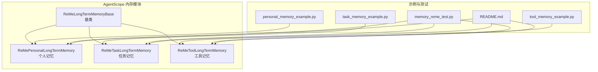
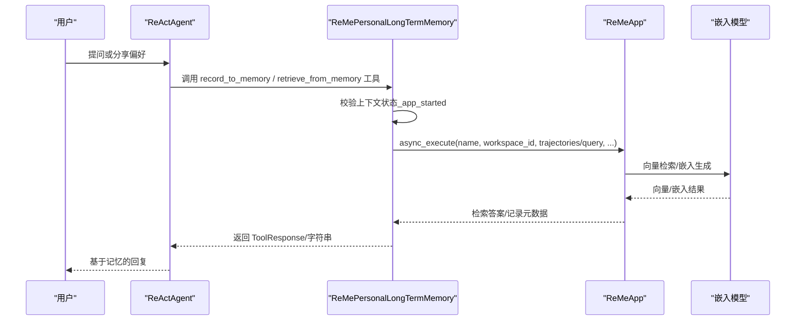
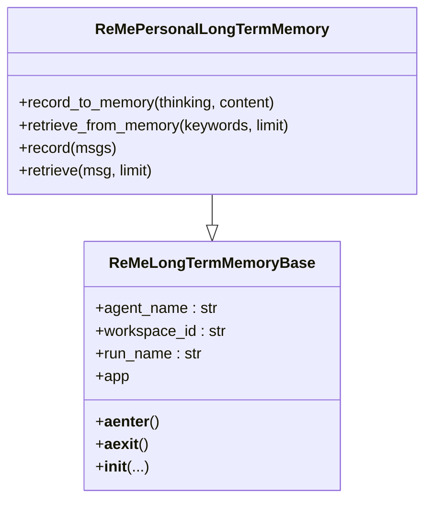
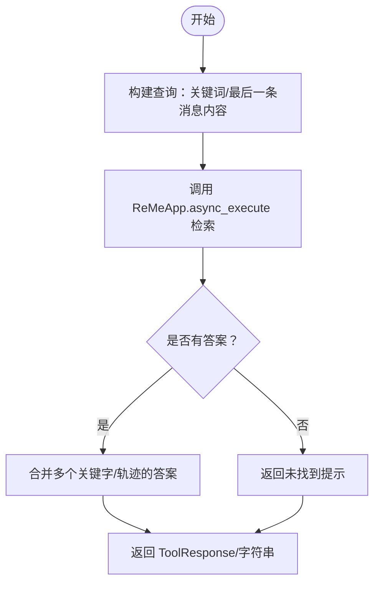

# ReMe个人长期记忆

<cite>
**本文引用的文件列表**
- [personal_memory_example.py](file://examples/functionality/long_term_memory/reme/personal_memory_example.py)
- [task_memory_example.py](file://examples/functionality/long_term_memory/reme/task_memory_example.py)
- [tool_memory_example.py](file://examples/functionality/long_term_memory/reme/tool_memory_example.py)
- [README.md](file://examples/functionality/long_term_memory/reme/README.md)
- [memory_reme_test.py](file://tests/memory_reme_test.py)
- [_reme_personal_long_term_memory.py](file://src/agentscope/memory/_reme/_reme_personal_long_term_memory.py)
- [_reme_long_term_memory_base.py](file://src/agentscope/memory/_reme/_reme_long_term_memory_base.py)
- [_reme_task_long_term_memory.py](file://src/agentscope/memory/_reme/_reme_task_long_term_memory.py)
- [_reme_tool_long_term_memory.py](file://src/agentscope/memory/_reme/_reme_tool_long_term_memory.py)
- [__init__.py（内存模块）](file://src/agentscope/memory/__init__.py)
- [__init__.py（reme子模块）](file://src/agentscope/memory/_reme/__init__.py)
</cite>

## 目录
1. [简介](#简介)
2. [项目结构](#项目结构)
3. [核心组件](#核心组件)
4. [架构总览](#架构总览)
5. [详细组件分析](#详细组件分析)
6. [依赖关系分析](#依赖关系分析)
7. [性能与检索策略](#性能与检索策略)
8. [隐私与安全](#隐私与安全)
9. [故障排查指南](#故障排查指南)
10. [结论](#结论)

## 简介
本文件系统化解析 ReMe 个人长期记忆在 AgentScope 中的实现机制，重点覆盖：
- 个人记忆类如何继承并实现基类接口
- 面向用户个体的记忆存储结构设计
- 记忆条目中的上下文元数据（时间戳、情感标签、重要性评分）及检索加权策略
- 基于语义相似度的检索流程
- 隐私保护、数据隔离与多租户安全考量

## 项目结构
ReMe 个人长期记忆位于 AgentScope 的 memory 子模块中，采用“按类型分层”的组织方式：公共基类负责 ReMe 集成与生命周期管理，各类型记忆（个人、任务、工具）分别实现各自记录与检索逻辑。

图表来源
- [_reme_personal_long_term_memory.py](file://src/agentscope/memory/_reme/_reme_personal_long_term_memory.py#L1-L415)
- [_reme_long_term_memory_base.py](file://src/agentscope/memory/_reme/_reme_long_term_memory_base.py#L1-L371)
- [_reme_task_long_term_memory.py](file://src/agentscope/memory/_reme/_reme_task_long_term_memory.py#L1-L437)
- [_reme_tool_long_term_memory.py](file://src/agentscope/memory/_reme/_reme_tool_long_term_memory.py#L1-L546)
- [personal_memory_example.py](file://examples/functionality/long_term_memory/reme/personal_memory_example.py#L1-L296)
- [task_memory_example.py](file://examples/functionality/long_term_memory/reme/task_memory_example.py#L1-L343)
- [tool_memory_example.py](file://examples/functionality/long_term_memory/reme/tool_memory_example.py#L1-L437)
- [README.md](file://examples/functionality/long_term_memory/reme/README.md#L1-L610)
- [memory_reme_test.py](file://tests/memory_reme_test.py#L1-L768)

章节来源
- [README.md](file://examples/functionality/long_term_memory/reme/README.md#L1-L610)
- [__init__.py（内存模块）](file://src/agentscope/memory/__init__.py#L1-L23)
- [__init__.py（reme子模块）](file://src/agentscope/memory/_reme/__init__.py#L1-L13)

## 核心组件
- ReMeLongTermMemoryBase：ReMe 集成与生命周期管理，提供 async 上下文管理器、模型配置注入、workspace_id 映射等通用能力。
- ReMePersonalLongTermMemory：个人记忆实现，支持显式记录（record_to_memory）、关键词检索（retrieve_from_memory）、消息直接记录（record）、查询检索（retrieve）。
- ReMeTaskLongTermMemory：任务记忆实现，支持带评分的轨迹记录与检索。
- ReMeToolLongTermMemory：工具记忆实现，支持工具执行结果记录与使用指南检索（无 agent 可调用工具函数）。

章节来源
- [_reme_long_term_memory_base.py](file://src/agentscope/memory/_reme/_reme_long_term_memory_base.py#L1-L371)
- [_reme_personal_long_term_memory.py](file://src/agentscope/memory/_reme/_reme_personal_long_term_memory.py#L1-L415)
- [_reme_task_long_term_memory.py](file://src/agentscope/memory/_reme/_reme_task_long_term_memory.py#L1-L437)
- [_reme_tool_long_term_memory.py](file://src/agentscope/memory/_reme/_reme_tool_long_term_memory.py#L1-L546)

## 架构总览
ReMe 个人长期记忆通过 ReMeLongTermMemoryBase 将 AgentScope 的模型与嵌入配置注入 ReMeApp，使用 async 上下文管理器确保资源正确初始化与释放；个人记忆类在该基础上扩展了面向用户的记录与检索接口。

图表来源
- [_reme_personal_long_term_memory.py](file://src/agentscope/memory/_reme/_reme_personal_long_term_memory.py#L155-L251)
- [_reme_long_term_memory_base.py](file://src/agentscope/memory/_reme/_reme_long_term_memory_base.py#L293-L371)

## 详细组件分析

### 继承与接口实现（ReMePersonalLongTermMemory）
- 继承关系：ReMePersonalLongTermMemory 继承自 ReMeLongTermMemoryBase，复用其模型注入、上下文管理与 workspace_id 映射。
- 关键方法：
  - record_to_memory：显式记录用户偏好/事实，返回 ToolResponse，内部将 thinking 与 content 转换为 ReMe 的轨迹格式并调用 summary_personal_memory。
  - retrieve_from_memory：关键词检索，逐个关键字调用 retrieve_personal_memory 并合并结果。
  - record：将 AgentScope 的 Msg 列表转换为 ReMe 消息格式，调用 summary_personal_memory 进行记录。
  - retrieve：从最后一条消息提取查询内容，调用 retrieve_personal_memory 获取回答。

图表来源
- [_reme_personal_long_term_memory.py](file://src/agentscope/memory/_reme/_reme_personal_long_term_memory.py#L1-L415)
- [_reme_long_term_memory_base.py](file://src/agentscope/memory/_reme/_reme_long_term_memory_base.py#L1-L371)

章节来源
- [_reme_personal_long_term_memory.py](file://src/agentscope/memory/_reme/_reme_personal_long_term_memory.py#L1-L415)

### 数据结构与存储隔离
- workspace_id 映射：个人记忆类将 user_name 映射为 ReMe 的 workspace_id，用于用户级数据隔离与持久化。
- 存储位置：默认使用 ./memory_vector_store/，可配置；每个 workspace_id 对应独立存储空间。
- 检索模式：基于嵌入模型与向量存储进行语义相似度检索，支持 top_k 控制返回数量。

章节来源
- [_reme_long_term_memory_base.py](file://src/agentscope/memory/_reme/_reme_long_term_memory_base.py#L190-L262)
- [README.md](file://examples/functionality/long_term_memory/reme/README.md#L537-L543)

### 记忆条目与元数据
- 个人记忆：通过 record_to_memory/content 与 record/msgs 输入自然语言片段，ReMe 在内部进行结构化处理与向量化存储。
- 任务记忆：支持 score 参数对轨迹进行质量打分，用于后续检索排序与优先级控制。
- 工具记忆：要求输入 JSON 字符串，包含 create_time、tool_name、input、output、token_cost、success、time_cost 等字段，便于生成使用指南。

章节来源
- [_reme_task_long_term_memory.py](file://src/agentscope/memory/_reme/_reme_task_long_term_memory.py#L1-L200)
- [_reme_tool_long_term_memory.py](file://src/agentscope/memory/_reme/_reme_tool_long_term_memory.py#L1-L174)

### 检索流程与加权策略
- 关键词检索：个人记忆与任务记忆均支持 keywords 列表，逐个关键字调用检索接口，最终合并答案文本。
- 语义相似度：通过嵌入模型生成查询与候选向量，计算相似度并按 top_k 返回。
- 加权策略：任务记忆使用 score 对轨迹进行加权；工具记忆通过多次执行与自动总结形成使用指南，提升后续检索命中质量。

图表来源
- [_reme_personal_long_term_memory.py](file://src/agentscope/memory/_reme/_reme_personal_long_term_memory.py#L155-L251)
- [_reme_task_long_term_memory.py](file://src/agentscope/memory/_reme/_reme_task_long_term_memory.py#L156-L264)

章节来源
- [_reme_personal_long_term_memory.py](file://src/agentscope/memory/_reme/_reme_personal_long_term_memory.py#L155-L251)
- [_reme_task_long_term_memory.py](file://src/agentscope/memory/_reme/_reme_task_long_term_memory.py#L156-L264)

### 使用示例与最佳实践
- 示例文件展示了 5 个核心接口：record_to_memory、retrieve_from_memory、record、retrieve、ReActAgent 集成。
- 推荐在系统提示中明确记录与检索时机，避免仅凭当前上下文回答用户问题。
- 使用 async with 上下文管理器确保 ReMeApp 初始化与清理。

章节来源
- [personal_memory_example.py](file://examples/functionality/long_term_memory/reme/personal_memory_example.py#L1-L296)
- [task_memory_example.py](file://examples/functionality/long_term_memory/reme/task_memory_example.py#L1-L343)
- [README.md](file://examples/functionality/long_term_memory/reme/README.md#L438-L453)

## 依赖关系分析
- ReMe 集成：通过 reme_ai.ReMeApp 注入 LLM 与嵌入模型配置，支持 DashScope/OpenAI。
- AgentScope 模型与嵌入：ReMeLongTermMemoryBase 从 DashScopeChatModel/OpenAIChatModel 与 DashScopeTextEmbedding/OpenAITextEmbedding 抽取模型名、API Key、维度等参数。
- 工具响应：record_to_memory/retrieve_from_memory 返回 ToolResponse，便于 AgentScope 工具系统集成。

图表来源
- [_reme_long_term_memory_base.py](file://src/agentscope/memory/_reme/_reme_long_term_memory_base.py#L200-L288)
- [_reme_personal_long_term_memory.py](file://src/agentscope/memory/_reme/_reme_personal_long_term_memory.py#L111-L141)

章节来源
- [_reme_long_term_memory_base.py](file://src/agentscope/memory/_reme/_reme_long_term_memory_base.py#L1-L371)

## 性能与检索策略
- 异步非阻塞：所有操作基于 async/await，避免阻塞主线程。
- 向量检索：通过嵌入模型与向量存储实现高效语义检索，top_k 控制召回规模。
- 上下文管理：async with 自动完成资源初始化与清理，降低错误风险。
- 测试覆盖：单元测试验证记录/检索成功路径、错误处理与上下文状态检查。

章节来源
- [memory_reme_test.py](file://tests/memory_reme_test.py#L1-L768)

## 隐私与安全
- 用户隔离：通过 workspace_id（映射 user_name）实现用户级数据隔离，不同用户的工作区互不干扰。
- 外部依赖：需要安装 reme-ai 库并在环境中配置模型 API Key；未安装时会抛出 ImportError 并提示安装指引。
- 安全建议：
  - 严格限制 API Key 的可见范围与传播
  - 在多租户场景下，确保每个租户拥有独立的 workspace_id
  - 对敏感信息进行最小化采集与存储，遵循最小权限原则

章节来源
- [_reme_long_term_memory_base.py](file://src/agentscope/memory/_reme/_reme_long_term_memory_base.py#L263-L288)
- [README.md](file://examples/functionality/long_term_memory/reme/README.md#L1-L610)

## 故障排查指南
- 上下文未启动：若未使用 async with 或手动未调用 __aenter__，将触发“ReMeApp context not started”错误。
- 记录失败：网络异常或 ReMeApp 异常会导致 ToolResponse 中包含错误信息；工具记忆对无效 JSON 有降级处理。
- 无检索结果：确认已先记录记忆、关键词准确、workspace_id 匹配。
- 单测参考：单元测试覆盖了记录/检索成功路径、错误处理与上下文状态校验，可作为定位问题的参考。

章节来源
- [_reme_personal_long_term_memory.py](file://src/agentscope/memory/_reme/_reme_personal_long_term_memory.py#L144-L154)
- [_reme_task_long_term_memory.py](file://src/agentscope/memory/_reme/_reme_task_long_term_memory.py#L145-L154)
- [_reme_tool_long_term_memory.py](file://src/agentscope/memory/_reme/_reme_tool_long_term_memory.py#L164-L173)
- [memory_reme_test.py](file://tests/memory_reme_test.py#L194-L244)

## 结论
ReMe 个人长期记忆通过清晰的继承层次与统一的 ReMe 集成，为 AgentScope 提供了面向用户个体的持久化记忆能力。其以 workspace_id 实现用户级隔离，结合嵌入模型与向量检索实现语义相似度检索，并通过 async 上下文管理器保障资源安全。配合示例与测试，开发者可快速集成并稳定运行个人记忆功能，在多租户环境下实现良好的隐私与安全控制。