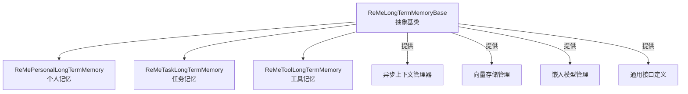
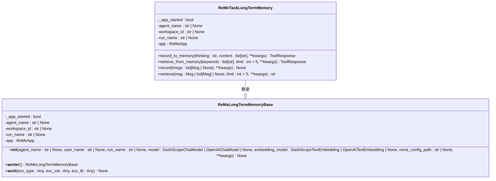
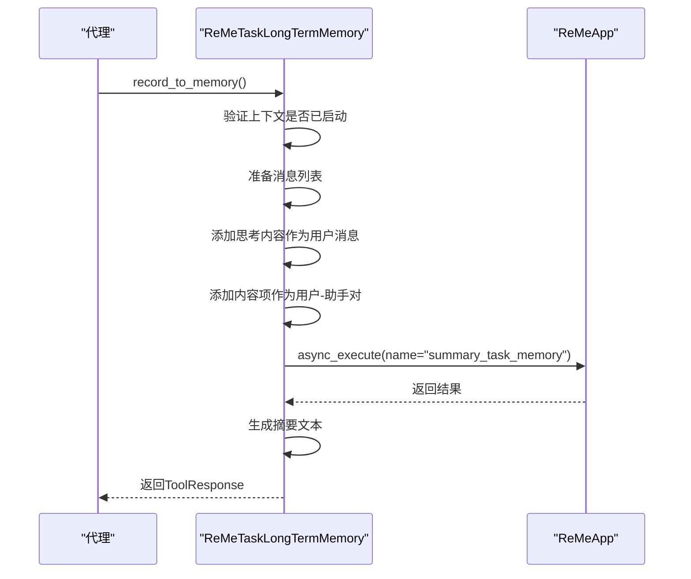
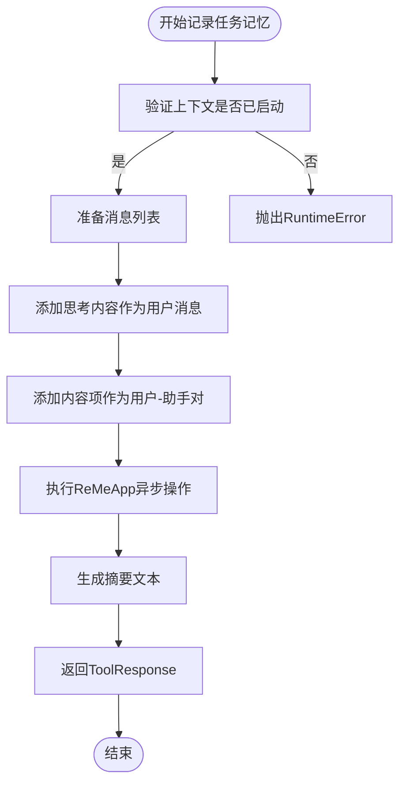
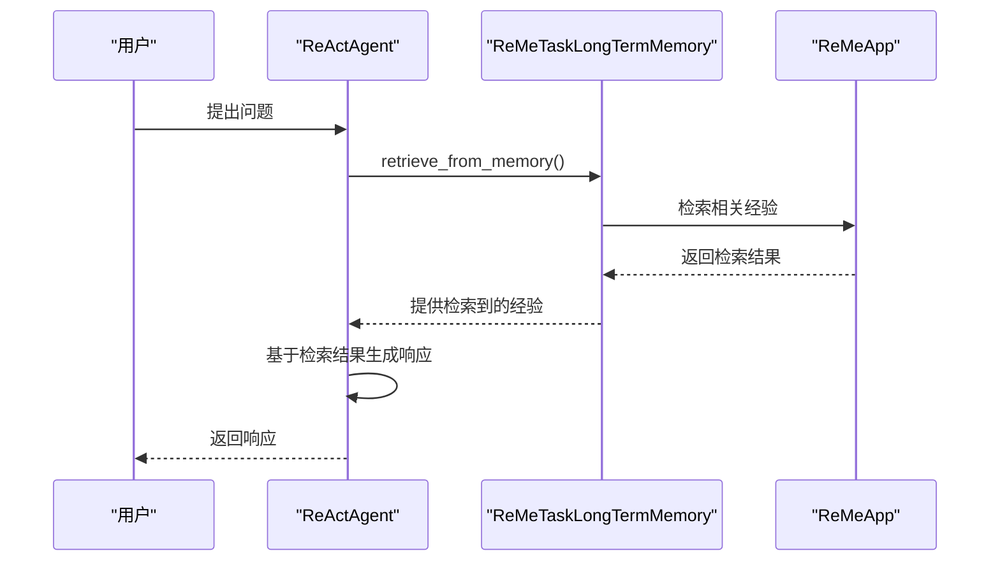
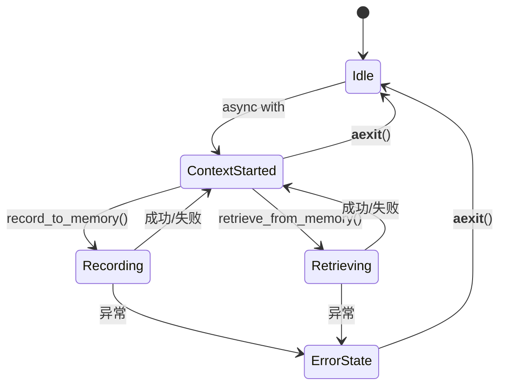

# ReMe任务长期记忆

<cite>
**本文档中引用的文件**   
- [ReMeTaskLongTermMemory](file://src/agentscope/memory/_reme/_reme_task_long_term_memory.py)
- [ReMeLongTermMemoryBase](file://src/agentscope/memory/_reme/_reme_long_term_memory_base.py)
- [ReMePersonalLongTermMemory](file://src/agentscope/memory/_reme/_reme_personal_long_term_memory.py)
- [ReMeToolLongTermMemory](file://src/agentscope/memory/_reme/_reme_tool_long_term_memory.py)
- [LongTermMemoryBase](file://src/agentscope/memory/_long_term_memory_base.py)
- [task_memory_example.py](file://examples/functionality/long_term_memory/reme/task_memory_example.py)
- [personal_memory_example.py](file://examples/functionality/long_term_memory/reme/personal_memory_example.py)
- [tool_memory_example.py](file://examples/functionality/long_term_memory/reme/tool_memory_example.py)
- [README.md](file://examples/functionality/long_term_memory/reme/README.md)
</cite>

## 目录
1. [简介](#简介)
2. [架构概述](#架构概述)
3. [核心组件分析](#核心组件分析)
4. [任务记忆类状态维护机制](#任务记忆类状态维护机制)
5. [与工作流编排系统集成](#与工作流编排系统集成)
6. [实际应用案例](#实际应用案例)
7. [事务性保证与版本控制](#事务性保证与版本控制)
8. [外部系统同步策略](#外部系统同步策略)
9. [结论](#结论)

## 简介

ReMe任务长期记忆是AgentScope框架中的一个关键组件，它为智能代理提供了持久化存储和检索任务执行轨迹的能力。该系统通过集成ReMe（Reflection Memory）库，实现了对任务目标、执行进度、中间结果和决策日志的持久化管理。ReMe任务长期记忆不仅支持基本的记录和检索功能，还提供了评分机制来评估任务执行的成功程度，从而帮助代理从经验中学习并不断改进。

ReMe提供了三种专门化的长期记忆类型：个人记忆、任务记忆和工具记忆。每种记忆类型都有其特定的用途和应用场景。个人记忆用于存储用户的偏好、习惯和个人事实；任务记忆用于学习任务执行轨迹并检索相关经验；工具记忆则用于记录工具使用模式并生成使用指南。这些记忆类型共同构成了一个全面的记忆管理系统，使代理能够在多步骤任务中保持状态一致性，并在复杂业务流程中提供上下文感知的响应。

## 架构概述

ReMe任务长期记忆的架构基于继承层次结构，其中`ReMeLongTermMemoryBase`作为抽象基类，为所有具体的记忆实现提供基础功能。这个基类负责与ReMe库的`ReMeApp`集成，实现异步上下文管理器，定义通用接口，并管理向量存储和嵌入模型。从这个基类派生出三个具体的记忆类：`ReMePersonalLongTermMemory`、`ReMeTaskLongTermMemory`和`ReMeToolLongTermMemory`，分别对应个人记忆、任务记忆和工具记忆。



**图示来源**
- [ReMeLongTermMemoryBase](file://src/agentscope/memory/_reme/_reme_long_term_memory_base.py#L83-L371)
- [ReMeTaskLongTermMemory](file://src/agentscope/memory/_reme/_reme_task_long_term_memory.py#L17-L437)
- [ReMePersonalLongTermMemory](file://src/agentscope/memory/_reme/_reme_personal_long_term_memory.py#L17-L415)
- [ReMeToolLongTermMemory](file://src/agentscope/memory/_reme/_reme_tool_long_term_memory.py#L17-L546)

**本节来源**
- [ReMeLongTermMemoryBase](file://src/agentscope/memory/_reme/_reme_long_term_memory_base.py#L83-L371)
- [README.md](file://examples/functionality/long_term_memory/reme/README.md#L520-L536)

## 核心组件分析

### ReMeTaskLongTermMemory 分析

`ReMeTaskLongTermMemory`类是任务记忆的核心实现，它继承自`ReMeLongTermMemoryBase`，并提供了专门用于任务执行轨迹记录和检索的功能。该类实现了两个主要的工具函数：`record_to_memory`和`retrieve_from_memory`，以及两个直接方法：`record`和`retrieve`。这些接口允许代理以不同的方式与任务记忆进行交互。

#### 类图


**图示来源**
- [ReMeTaskLongTermMemory](file://src/agentscope/memory/_reme/_reme_task_long_term_memory.py#L17-L437)
- [ReMeLongTermMemoryBase](file://src/agentscope/memory/_reme/_reme_long_term_memory_base.py#L83-L371)

#### 任务记忆记录流程


**图示来源**
- [ReMeTaskLongTermMemory](file://src/agentscope/memory/_reme/_reme_task_long_term_memory.py#L25-L144)
- [ReMeLongTermMemoryBase](file://src/agentscope/memory/_reme/_reme_long_term_memory_base.py#L278-L288)

**本节来源**
- [ReMeTaskLongTermMemory](file://src/agentscope/memory/_reme/_reme_task_long_term_memory.py#L17-L437)
- [task_memory_example.py](file://examples/functionality/long_term_memory/reme/task_memory_example.py#L32-L69)

## 任务记忆类状态维护机制

ReMe任务长期记忆通过多种机制来维护特定业务流程或工作流的上下文状态。这些机制包括任务目标的持久化、执行进度的跟踪、中间结果的保存以及决策日志的记录。通过这些机制，代理能够在长时间运行的任务中保持上下文的一致性，并在需要时恢复到之前的状态。

### 任务目标与执行进度维护

任务记忆类通过`record_to_memory`方法来记录任务目标和执行进度。当代理完成一个任务或解决一个问题时，它可以调用此方法将关键的见解和解决方案保存到长期记忆中。这种方法接受两个主要参数：`thinking`和`content`。`thinking`参数用于记录代理的推理过程，解释为什么这个任务经验值得记住；`content`参数则包含具体的任务洞察，每个字符串都应该是清晰、可操作的信息。



**图示来源**
- [ReMeTaskLongTermMemory](file://src/agentscope/memory/_reme/_reme_task_long_term_memory.py#L25-L144)

### 中间结果与决策日志持久化

除了任务目标和执行进度，任务记忆类还能够持久化中间结果和决策日志。这通过`record`方法实现，该方法可以直接记录消息对话。代理可以将整个对话历史作为消息列表传递给`record`方法，同时还可以提供一个可选的`score`参数来表示该轨迹的质量或成功程度。这种机制使得代理能够学习从成功和失败的尝试中，并通过经验检索实现持续改进。

**本节来源**
- [ReMeTaskLongTermMemory](file://src/agentscope/memory/_reme/_reme_task_long_term_memory.py#L266-L343)
- [task_memory_example.py](file://examples/functionality/long_term_memory/reme/task_memory_example.py#L115-L149)

## 与工作流编排系统集成

ReMe任务长期记忆与AgentScope的工作流编排系统紧密集成，确保在多步骤任务中保持状态一致性。这种集成主要通过`ReActAgent`和`SequentialPipeline`等组件实现。代理可以在执行任务的过程中自动记录和检索记忆，从而在复杂的业务流程中提供上下文感知的响应。

### ReActAgent 集成

`ReActAgent`是AgentScope框架中的一个关键组件，它能够与ReMe任务长期记忆无缝集成。通过在`ReActAgent`的初始化过程中指定`long_term_memory`参数，代理可以获得访问长期记忆的能力。此外，`long_term_memory_mode`参数允许开发者控制代理可以使用的记忆工具。例如，设置为`"both"`时，代理将同时拥有`record_to_memory`和`retrieve_from_memory`两个工具。



**图示来源**
- [task_memory_example.py](file://examples/functionality/long_term_memory/reme/task_memory_example.py#L185-L287)
- [README.md](file://examples/functionality/long_term_memory/reme/README.md#L247-L268)

### 工作流编排集成

在更复杂的工作流中，ReMe任务长期记忆可以与`SequentialPipeline`等编排工具结合使用。通过在管道的每个步骤中调用记忆操作，代理可以在整个工作流中保持状态一致性。例如，在一个多步骤的项目规划任务中，代理可以在每个阶段结束时记录其决策和结果，并在后续阶段开始时检索这些信息。

**本节来源**
- [task_memory_example.py](file://examples/functionality/long_term_memory/reme/task_memory_example.py#L185-L287)
- [multiagent_conversation.py](file://examples/workflows/multiagent_conversation/main.py#L38-L80)

## 实际应用案例

### 跨步骤信息传递

在复杂的业务流程中，跨步骤信息传递是一个常见的需求。ReMe任务长期记忆通过其持久化机制解决了这一问题。例如，在一个软件开发项目中，代理可以在需求分析阶段记录用户的需求和偏好，然后在设计和开发阶段检索这些信息，确保最终产品符合用户的期望。

```python
# 示例：跨步骤信息传递
async with task_memory:
    # 需求分析阶段
    await task_memory.record_to_memory(
        thinking="记录用户对Web应用的需求",
        content=[
            "用户需要一个基于React的前端",
            "后端使用FastAPI框架",
            "数据库采用PostgreSQL",
            "采用敏捷开发方法，每两周一个迭代"
        ]
    )
    
    # 设计阶段
    retrieved_requirements = await task_memory.retrieve_from_memory(
        keywords=["Web应用", "需求"]
    )
    # 使用检索到的需求来指导设计决策
```

### 异常恢复

ReMe任务长期记忆还支持异常恢复。当任务因某种原因中断时，代理可以通过检索之前的记忆来恢复到中断前的状态。这对于长时间运行的任务尤其重要，因为它避免了从头开始重新执行整个任务。

```python
# 示例：异常恢复
async with task_memory:
    try:
        # 执行某个任务
        pass
    except Exception as e:
        # 记录失败的经验
        await task_memory.record_to_memory(
            thinking="记录任务失败的原因和教训",
            content=[
                f"任务因{str(e)}而失败",
                "下次应检查网络连接",
                "增加超时重试机制"
            ],
            score=0.2  # 低分表示失败的轨迹
        )
        
        # 恢复到之前的状态并重新尝试
        previous_state = await task_memory.retrieve_from_memory(
            keywords=["任务状态", "进度"]
        )
```

### 审计追踪

任务记忆类还提供了强大的审计追踪功能。通过记录每个任务的执行轨迹，包括代理的思考过程、采取的行动和最终结果，组织可以对代理的行为进行审查和分析。这对于确保代理的决策透明性和可追溯性至关重要。

**本节来源**
- [task_memory_example.py](file://examples/functionality/long_term_memory/reme/task_memory_example.py#L32-L287)
- [README.md](file://examples/functionality/long_term_memory/reme/README.md#L497-L502)

## 事务性保证与版本控制

ReMe任务长期记忆通过其异步上下文管理器机制提供了基本的事务性保证。所有记忆操作都必须在`async with`语句块内执行，这确保了ReMe后端的正确初始化和资源清理。如果在上下文管理器之外尝试执行记忆操作，将会抛出`RuntimeError`。



**图示来源**
- [ReMeLongTermMemoryBase](file://src/agentscope/memory/_reme/_reme_long_term_memory_base.py#L293-L371)
- [README.md](file://examples/functionality/long_term_memory/reme/README.md#L439-L452)

关于版本控制，ReMe任务长期记忆本身不直接提供版本控制功能。然而，通过记录不同版本的任务执行轨迹和为每个轨迹分配评分，代理可以间接实现版本控制。高分的轨迹代表成功的解决方案，而低分的轨迹则代表需要改进的地方。这种机制使得代理能够随着时间的推移学习和进化。

**本节来源**
- [ReMeLongTermMemoryBase](file://src/agentscope/memory/_reme/_reme_long_term_memory_base.py#L293-L371)
- [README.md](file://examples/functionality/long_term_memory/reme/README.md#L439-L452)

## 外部系统同步策略

ReMe任务长期记忆通过向量存储和嵌入模型与外部系统进行同步。默认情况下，记忆数据存储在本地的`./memory_vector_store/`目录中，但这个位置是可配置的。每个`user_name`都有独立的存储空间，确保了不同用户或工作区之间的记忆隔离。

### 向量存储同步

记忆数据以向量嵌入的形式存储，这使得语义搜索成为可能。当代理调用`retrieve_from_memory`方法时，系统会使用嵌入模型将查询转换为向量，然后在向量存储中进行相似性搜索。这种机制确保了即使查询的措辞与存储的记忆不完全匹配，也能找到相关的结果。

### 模型同步

ReMe任务长期记忆支持多种模型提供商，包括DashScope和OpenAI。在初始化记忆实例时，需要提供相应的聊天模型和嵌入模型。这些模型的API凭据和端点会被提取并传递给ReMeApp，从而实现与外部模型服务的同步。

```python
# 示例：配置不同模型提供商
task_memory = ReMeTaskLongTermMemory(
    agent_name="TaskAssistant",
    user_name="task_workspace_123",
    model=DashScopeChatModel(
        model_name="qwen3-max",
        api_key=os.environ.get("DASHSCOPE_API_KEY"),
        stream=False,
    ),
    embedding_model=DashScopeTextEmbedding(
        model_name="text-embedding-v4",
        api_key=os.environ.get("DASHSCOPE_API_KEY"),
        dimensions=1024,
    ),
)
```

**本节来源**
- [ReMeLongTermMemoryBase](file://src/agentscope/memory/_reme/_reme_long_term_memory_base.py#L203-L248)
- [README.md](file://examples/functionality/long_term_memory/reme/README.md#L538-L542)

## 结论

ReMe任务长期记忆为AgentScope框架提供了一个强大而灵活的记忆管理系统。通过其专门化的记忆类型、丰富的接口设计和与工作流编排系统的深度集成，代理能够在复杂的业务流程中保持上下文状态，实现跨步骤信息传递、异常恢复和审计追踪。事务性保证和外部系统同步策略确保了记忆数据的可靠性和一致性。随着代理不断学习和积累经验，ReMe任务长期记忆将成为构建智能、自适应系统的基石。