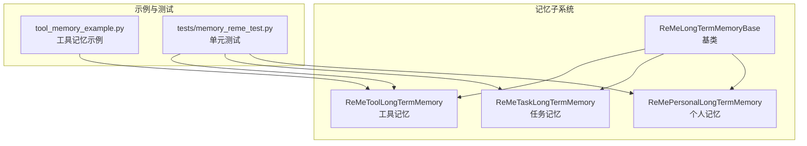
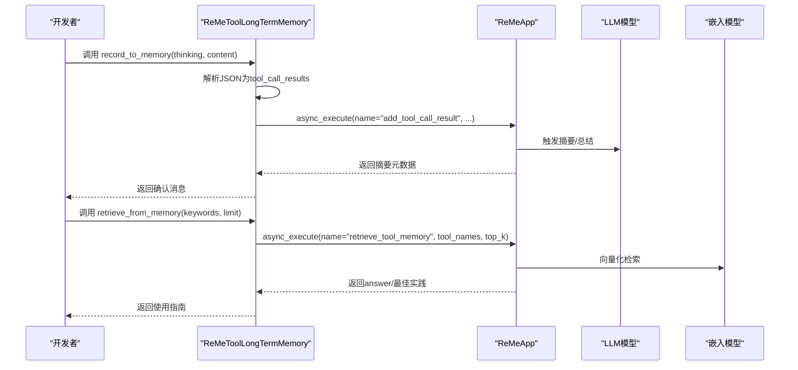
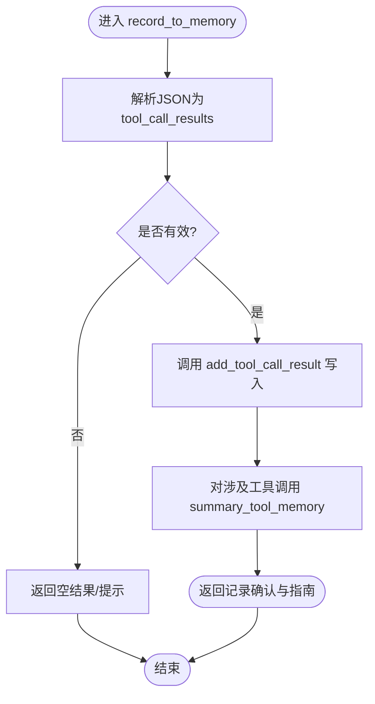
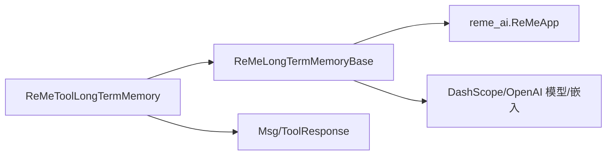

# ReMe工具长期记忆

<cite>
**本文引用的文件**
- [src/agentscope/memory/_reme/_reme_tool_long_term_memory.py](file://src/agentscope/memory/_reme/_reme_tool_long_term_memory.py)
- [src/agentscope/memory/_reme/_reme_long_term_memory_base.py](file://src/agentscope/memory/_reme/_reme_long_term_memory_base.py)
- [src/agentscope/memory/_reme/_reme_personal_long_term_memory.py](file://src/agentscope/memory/_reme/_reme_personal_long_term_memory.py)
- [src/agentscope/memory/_reme/_reme_task_long_term_memory.py](file://src/agentscope/memory/_reme/_reme_task_long_term_memory.py)
- [src/agentscope/memory/_long_term_memory_base.py](file://src/agentscope/memory/_long_term_memory_base.py)
- [examples/functionality/long_term_memory/reme/tool_memory_example.py](file://examples/functionality/long_term_memory/reme/tool_memory_example.py)
- [tests/memory_reme_test.py](file://tests/memory_reme_test.py)
- [src/agentscope/tracing/__init__.py](file://src/agentscope/tracing/__init__.py)
</cite>

## 目录
1. [简介](#简介)
2. [项目结构](#项目结构)
3. [核心组件](#核心组件)
4. [架构总览](#架构总览)
5. [详细组件分析](#详细组件分析)
6. [依赖关系分析](#依赖关系分析)
7. [性能考量](#性能考量)
8. [故障排查指南](#故障排查指南)
9. [结论](#结论)
10. [附录](#附录)

## 简介
本文件系统性解析 ReMe 工具长期记忆的设计与实现，聚焦于其如何记录与管理智能体与外部工具交互的历史，包括工具调用参数、返回结果、执行上下文与性能指标；并阐述其在工具选择优化、错误模式识别与自动化修复中的应用价值。文档通过代码路径示例展示如何配置工具记忆实例、记录工具调用轨迹，并基于历史数据进行智能决策；同时说明其与监控系统的集成、调用链追踪能力以及在大规模工具库环境下的索引优化策略。

## 项目结构
ReMe 工具长期记忆位于 agentscope 的 memory 子模块中，采用“按功能域分层”的组织方式：
- 基类层：提供 ReMe 集成、模型与嵌入配置、异步上下文管理等通用能力
- 具体记忆类型：个人记忆、任务记忆、工具记忆（本篇重点）
- 示例与测试：演示完整工作流与单元测试覆盖

图表来源
- [src/agentscope/memory/_reme/_reme_tool_long_term_memory.py](file://src/agentscope/memory/_reme/_reme_tool_long_term_memory.py#L1-L120)
- [src/agentscope/memory/_reme/_reme_long_term_memory_base.py](file://src/agentscope/memory/_reme/_reme_long_term_memory_base.py#L83-L120)
- [examples/functionality/long_term_memory/reme/tool_memory_example.py](file://examples/functionality/long_term_memory/reme/tool_memory_example.py#L347-L418)
- [tests/memory_reme_test.py](file://tests/memory_reme_test.py#L1-L120)

章节来源
- [src/agentscope/memory/_reme/_reme_tool_long_term_memory.py](file://src/agentscope/memory/_reme/_reme_tool_long_term_memory.py#L1-L120)
- [src/agentscope/memory/_reme/_reme_long_term_memory_base.py](file://src/agentscope/memory/_reme/_reme_long_term_memory_base.py#L83-L120)
- [examples/functionality/long_term_memory/reme/tool_memory_example.py](file://examples/functionality/long_term_memory/reme/tool_memory_example.py#L347-L418)
- [tests/memory_reme_test.py](file://tests/memory_reme_test.py#L1-L120)

## 核心组件
- ReMeLongTermMemoryBase：ReMe 集成基类，负责初始化 ReMeApp、提取模型与嵌入配置、异步上下文管理、错误处理与安装提示
- ReMeToolLongTermMemory：工具记忆实现，支持将工具调用历史记录为 JSON 结构，自动汇总生成使用指南，并在检索时返回最佳实践
- ReMePersonalLongTermMemory：个人记忆实现，用于持久化用户偏好与个人信息
- ReMeTaskLongTermMemory：任务记忆实现，记录任务执行轨迹与经验教训
- LongTermMemoryBase：抽象基类，定义 record/retrieve 与 record_to_memory/retrieve_from_memory 接口

章节来源
- [src/agentscope/memory/_reme/_reme_long_term_memory_base.py](file://src/agentscope/memory/_reme/_reme_long_term_memory_base.py#L83-L120)
- [src/agentscope/memory/_reme/_reme_tool_long_term_memory.py](file://src/agentscope/memory/_reme/_reme_tool_long_term_memory.py#L25-L174)
- [src/agentscope/memory/_reme/_reme_personal_long_term_memory.py](file://src/agentscope/memory/_reme/_reme_personal_long_term_memory.py#L20-L154)
- [src/agentscope/memory/_reme/_reme_task_long_term_memory.py](file://src/agentscope/memory/_reme/_reme_task_long_term_memory.py#L25-L160)
- [src/agentscope/memory/_long_term_memory_base.py](file://src/agentscope/memory/_long_term_memory_base.py#L11-L95)

## 架构总览
ReMe 工具长期记忆通过 ReMeApp 与 ReMe 框架对接，利用 LLM 与嵌入模型完成向量化与语义检索。工具记忆的关键流程包括：
- 记录阶段：将工具调用历史转换为 JSON 结构，写入 ReMe 并触发摘要生成
- 检索阶段：根据工具名或查询词检索使用指南，返回最佳实践与性能特征
- 集成阶段：将检索到的指南注入到智能体系统提示，辅助后续工具选择与参数决策

图表来源
- [src/agentscope/memory/_reme/_reme_tool_long_term_memory.py](file://src/agentscope/memory/_reme/_reme_tool_long_term_memory.py#L25-L174)
- [src/agentscope/memory/_reme/_reme_tool_long_term_memory.py](file://src/agentscope/memory/_reme/_reme_tool_long_term_memory.py#L175-L277)

章节来源
- [src/agentscope/memory/_reme/_reme_tool_long_term_memory.py](file://src/agentscope/memory/_reme/_reme_tool_long_term_memory.py#L25-L277)

## 详细组件分析

### ReMe 工具长期记忆（ReMeToolLongTermMemory）
- 记录接口 record_to_memory
  - 输入：思考性描述与 JSON 字符串列表，每条 JSON 包含时间戳、工具名、输入参数、输出、token 成本、成功标志、耗时等字段
  - 行为：解析 JSON，校验有效性；调用 ReMeApp 的 add_tool_call_result 写入；随后对涉及工具进行 summary_tool_memory 汇总
  - 输出：ToolResponse，包含记录数量与生成的使用指南摘要
- 检索接口 retrieve_from_memory
  - 输入：工具名列表与限制条数
  - 行为：将工具名拼接后一次性调用 ReMeApp 的 retrieve_tool_memory；若无答案则返回提示
  - 输出：ToolResponse，包含检索到的最佳实践
- 直接记录 record 与直接检索 retrieve
  - record：从消息内容中提取 JSON 字符串，解析为 tool_call_results 后写入并汇总
  - retrieve：从最后一条消息中抽取工具名或查询文本，调用 ReMeApp 的检索接口

图表来源
- [src/agentscope/memory/_reme/_reme_tool_long_term_memory.py](file://src/agentscope/memory/_reme/_reme_tool_long_term_memory.py#L25-L174)
- [src/agentscope/memory/_reme/_reme_tool_long_term_memory.py](file://src/agentscope/memory/_reme/_reme_tool_long_term_memory.py#L353-L433)

章节来源
- [src/agentscope/memory/_reme/_reme_tool_long_term_memory.py](file://src/agentscope/memory/_reme/_reme_tool_long_term_memory.py#L25-L277)
- [src/agentscope/memory/_reme/_reme_tool_long_term_memory.py](file://src/agentscope/memory/_reme/_reme_tool_long_term_memory.py#L353-L546)

### ReMe 个人与任务长期记忆（对比参考）
- 个人记忆：以自然语言形式记录用户偏好与事实，检索时按关键词组合回答
- 任务记忆：以轨迹形式记录问题解决步骤与经验，支持评分机制，检索时按查询返回相关经验

章节来源
- [src/agentscope/memory/_reme/_reme_personal_long_term_memory.py](file://src/agentscope/memory/_reme/_reme_personal_long_term_memory.py#L20-L251)
- [src/agentscope/memory/_reme/_reme_task_long_term_memory.py](file://src/agentscope/memory/_reme/_reme_task_long_term_memory.py#L25-L264)

### ReMe 集成基类（ReMeLongTermMemoryBase）
- 初始化：从 DashScope/OpenAI 模型中提取 API Key、基础地址与模型名称，构建 ReMeApp 配置
- 异步上下文：__aenter__/__aexit__ 管理 ReMeApp 生命周期，确保资源正确释放
- 错误处理：未安装 reme-ai 时抛出导入异常并给出安装指引；运行时检测 app 上下文状态，避免未启动调用

章节来源
- [src/agentscope/memory/_reme/_reme_long_term_memory_base.py](file://src/agentscope/memory/_reme/_reme_long_term_memory_base.py#L110-L371)

### 抽象基类（LongTermMemoryBase）
- 定义统一接口：record/retrieve 与 record_to_memory/retrieve_from_memory
- 为具体记忆类型提供扩展点，便于在不同场景下复用

章节来源
- [src/agentscope/memory/_long_term_memory_base.py](file://src/agentscope/memory/_long_term_memory_base.py#L11-L95)

### 示例与测试
- 示例：演示从注册工具、记录历史、检索指南到增强系统提示并使用 ReActAgent 的完整工作流
- 测试：覆盖初始化、记录/检索、错误处理、上下文管理、直接方法与工具方法等关键路径

章节来源
- [examples/functionality/long_term_memory/reme/tool_memory_example.py](file://examples/functionality/long_term_memory/reme/tool_memory_example.py#L1-L437)
- [tests/memory_reme_test.py](file://tests/memory_reme_test.py#L1-L768)

## 依赖关系分析
- 外部依赖：reme_ai（ReMeApp），需单独安装
- 内部依赖：模型与嵌入模型（DashScope/OpenAI）用于 ReMeApp 的 LLM 与向量检索
- 组件耦合：工具记忆依赖基类提供的 ReMeApp 与上下文管理；与消息、工具响应类型解耦，便于在不同智能体框架中复用

图表来源
- [src/agentscope/memory/_reme/_reme_tool_long_term_memory.py](file://src/agentscope/memory/_reme/_reme_tool_long_term_memory.py#L1-L40)
- [src/agentscope/memory/_reme/_reme_long_term_memory_base.py](file://src/agentscope/memory/_reme/_reme_long_term_memory_base.py#L268-L288)

章节来源
- [src/agentscope/memory/_reme/_reme_tool_long_term_memory.py](file://src/agentscope/memory/_reme/_reme_tool_long_term_memory.py#L1-L40)
- [src/agentscope/memory/_reme/_reme_long_term_memory_base.py](file://src/agentscope/memory/_reme/_reme_long_term_memory_base.py#L268-L288)

## 性能考量
- 记录开销
  - JSON 解析与校验：对大量历史记录建议批量处理，避免逐条解析带来的 CPU 开销
  - ReMeApp 摘要：summary_tool_memory 会触发 LLM 摘要，建议在高频记录场景中合并批次，减少调用次数
- 检索效率
  - 单次检索多工具：工具记忆检索会将所有工具名拼接后一次性调用，降低多次往返开销
  - 向量检索：依赖嵌入模型与 ReMe 的向量存储，建议合理设置 top_k 与过滤条件，避免过度召回
- 上下文管理
  - 使用 async with 管理 ReMeApp 生命周期，避免重复初始化与资源泄漏

章节来源
- [src/agentscope/memory/_reme/_reme_tool_long_term_memory.py](file://src/agentscope/memory/_reme/_reme_tool_long_term_memory.py#L175-L277)
- [src/agentscope/memory/_reme/_reme_tool_long_term_memory.py](file://src/agentscope/memory/_reme/_reme_tool_long_term_memory.py#L25-L174)

## 故障排查指南
- 未安装 reme-ai
  - 现象：导入时报错并提示安装 reme-ai
  - 处理：按照提示安装 reme-ai，并确保网络可达
- 未启动 ReMeApp 上下文
  - 现象：调用 record_to_memory/retrieve_from_memory 或 record/retrieve 抛出运行时错误
  - 处理：使用 async with 正确初始化上下文，或显式调用 __aenter__/__aexit__
- JSON 格式不合法
  - 现象：工具记忆记录时跳过无效 JSON，最终返回“无有效工具调用结果”
  - 处理：检查工具调用历史的 JSON 结构，确保包含必需字段（如 tool_name、input、output、success、time_cost、token_cost）
- 检索无结果
  - 现象：retrieve_from_memory 返回“未找到工具指南”
  - 处理：确认已先记录历史；检查工具名是否一致；适当提高 limit 或补充更多历史样本

章节来源
- [src/agentscope/memory/_reme/_reme_long_term_memory_base.py](file://src/agentscope/memory/_reme/_reme_long_term_memory_base.py#L268-L288)
- [src/agentscope/memory/_reme/_reme_tool_long_term_memory.py](file://src/agentscope/memory/_reme/_reme_tool_long_term_memory.py#L87-L118)
- [tests/memory_reme_test.py](file://tests/memory_reme_test.py#L194-L244)

## 结论
ReMe 工具长期记忆通过结构化的工具调用历史记录与摘要生成，为智能体提供了可解释、可复用的工具使用指南。其与 ReMe 框架的深度集成使得检索具备语义能力，结合异步上下文管理与错误处理，能够在复杂工具库环境中稳定运行。通过将检索到的最佳实践注入系统提示，可显著提升工具选择的准确性与成功率，同时为错误模式识别与自动化修复提供数据基础。

## 附录

### 配置与使用要点
- 初始化
  - 提供 agent_name、user_name（映射为 workspace_id）、模型与嵌入模型配置
  - 可选 reme_config_path 与额外 kwargs 传递给 ReMeApp
- 记录工具调用历史
  - 使用 record_to_memory 或 record，传入 JSON 字符串列表，包含工具名、输入、输出、成功标志、耗时与 token 成本
- 检索使用指南
  - 使用 retrieve_from_memory 或 retrieve，传入工具名或查询文本，获取最佳实践与性能特征
- 集成到智能体
  - 将检索到的指南注入系统提示，指导后续工具选择与参数决策

章节来源
- [src/agentscope/memory/_reme/_reme_tool_long_term_memory.py](file://src/agentscope/memory/_reme/_reme_tool_long_term_memory.py#L25-L174)
- [examples/functionality/long_term_memory/reme/tool_memory_example.py](file://examples/functionality/long_term_memory/reme/tool_memory_example.py#L347-L418)

### 与监控与追踪的集成
- 追踪接口
  - agentscope 提供 tracing 模块，包含 trace、trace_llm、trace_reply、trace_format、trace_toolkit、trace_embedding 等装饰器与函数，可用于采集调用链、格式化与工具调用的追踪信息
- 应用建议
  - 在工具调用前后包裹 trace_toolkit，记录工具名、参数、返回值与耗时，便于后续回放与分析
  - 将追踪元数据与工具记忆记录相结合，形成端到端的可观测性闭环

章节来源
- [src/agentscope/tracing/__init__.py](file://src/agentscope/tracing/__init__.py#L1-L23)

### 大规模工具库的索引优化策略
- 历史聚合
  - 对频繁使用的工具进行批量记录与定期摘要，减少 ReMeApp 的调用频次
- 查询优化
  - 在检索前对工具名进行规范化与去重，减少无关关键词干扰
- 分层检索
  - 先按工具名精确检索，再按主题/场景扩展，控制 top_k 与过滤条件
- 数据治理
  - 定期清理低质量或过时的历史记录，保持知识库的时效性与准确性

章节来源
- [src/agentscope/memory/_reme/_reme_tool_long_term_memory.py](file://src/agentscope/memory/_reme/_reme_tool_long_term_memory.py#L175-L277)
- [src/agentscope/memory/_reme/_reme_tool_long_term_memory.py](file://src/agentscope/memory/_reme/_reme_tool_long_term_memory.py#L25-L174)