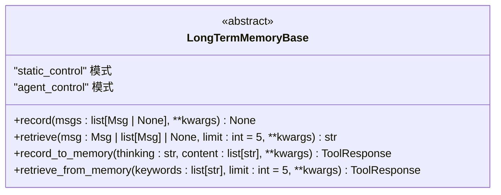
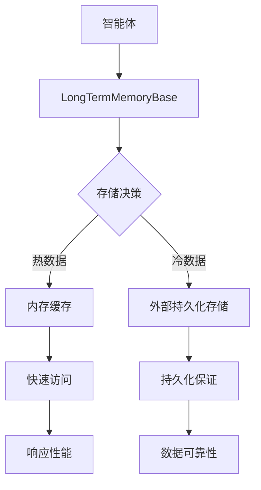
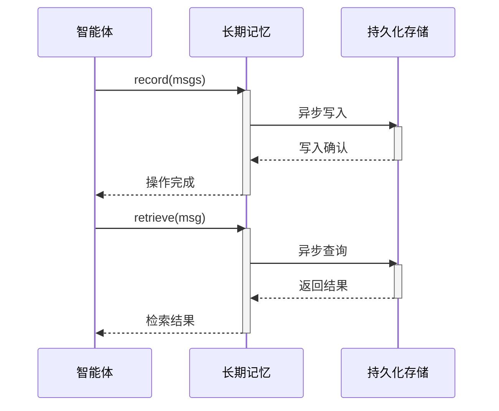
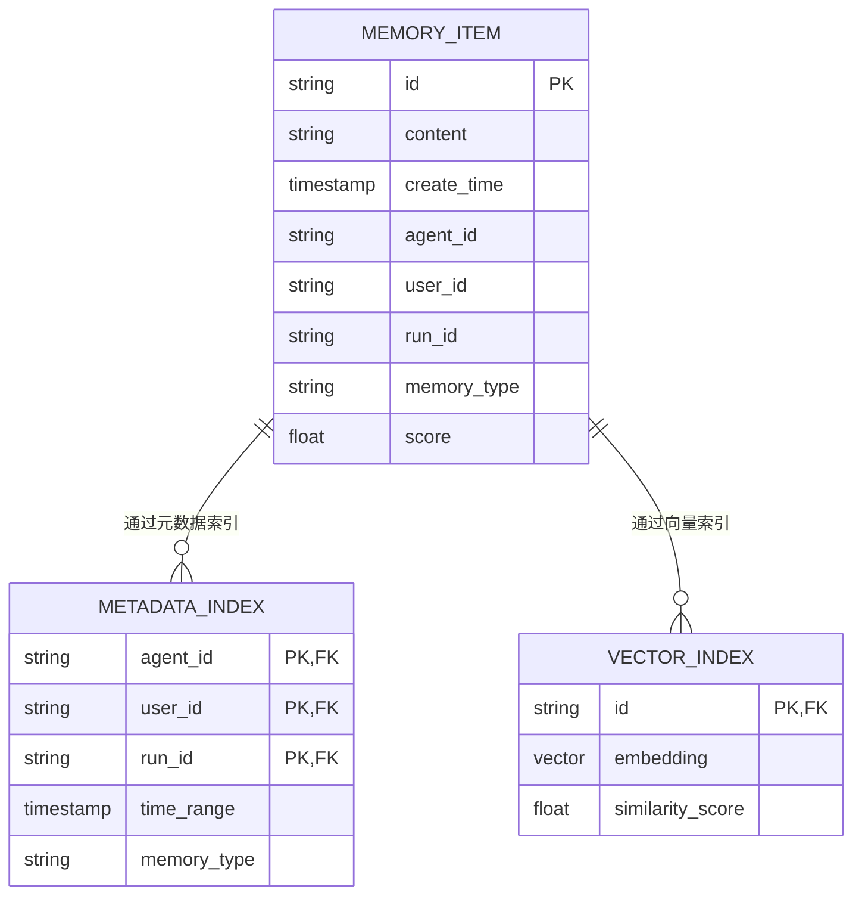
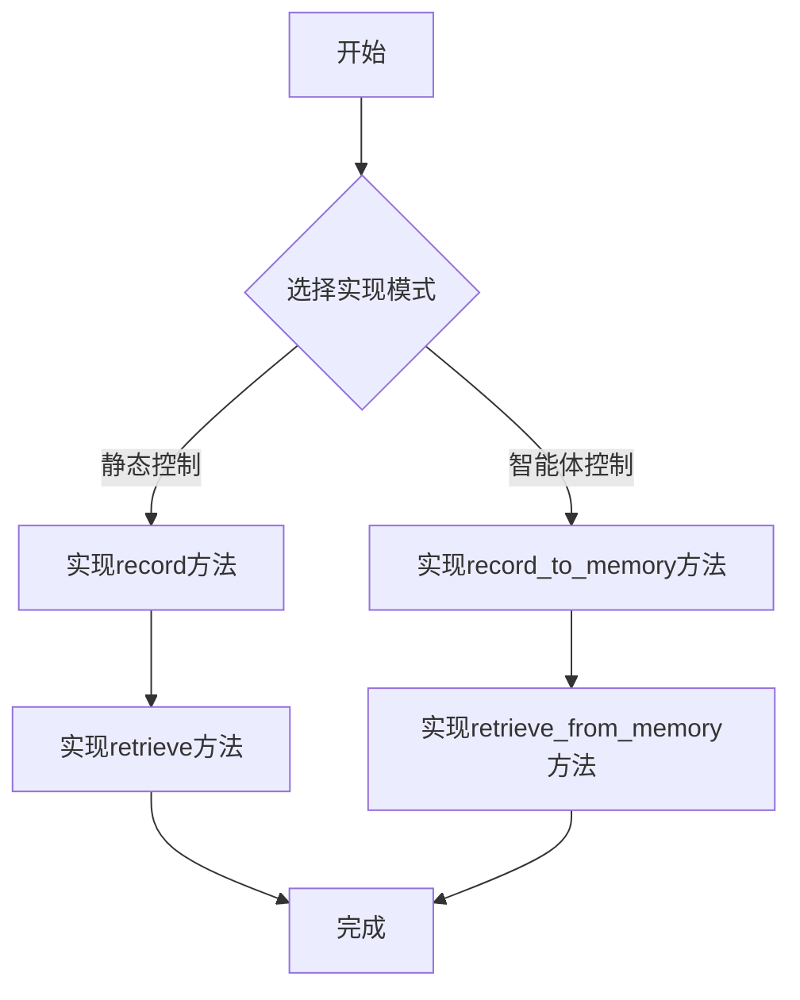
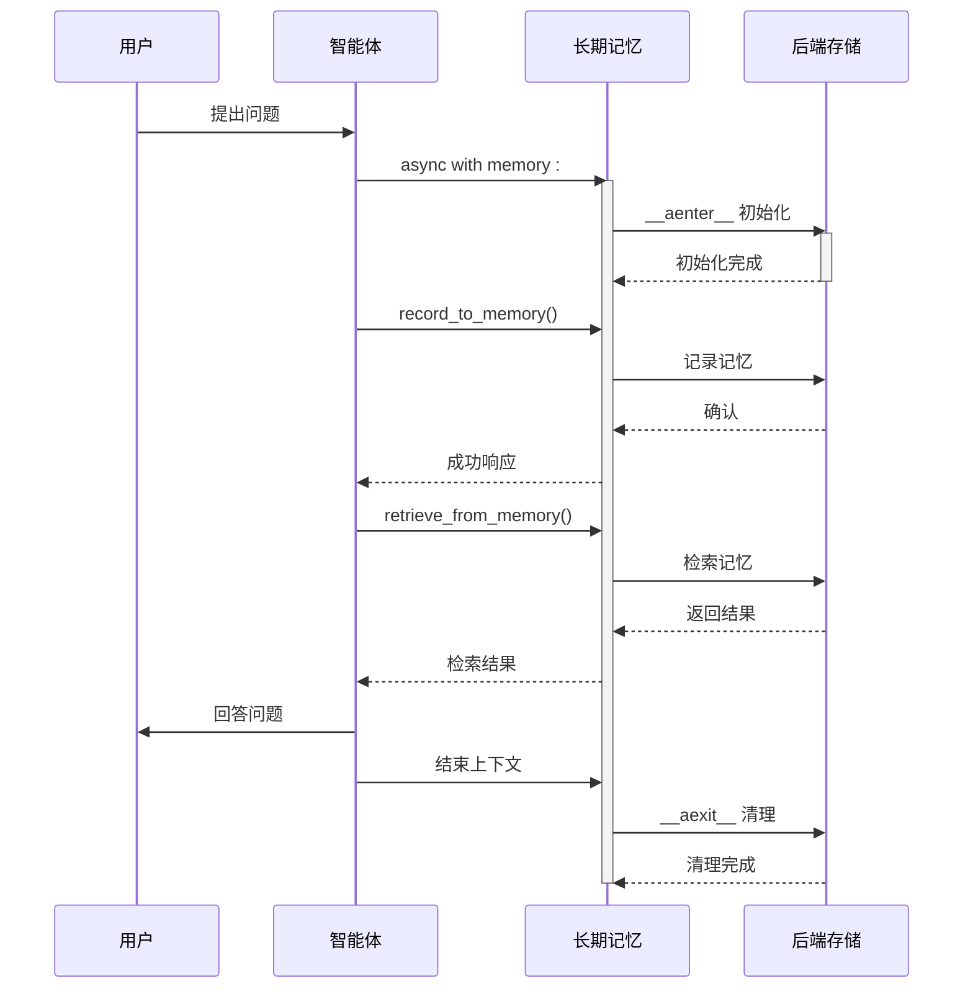
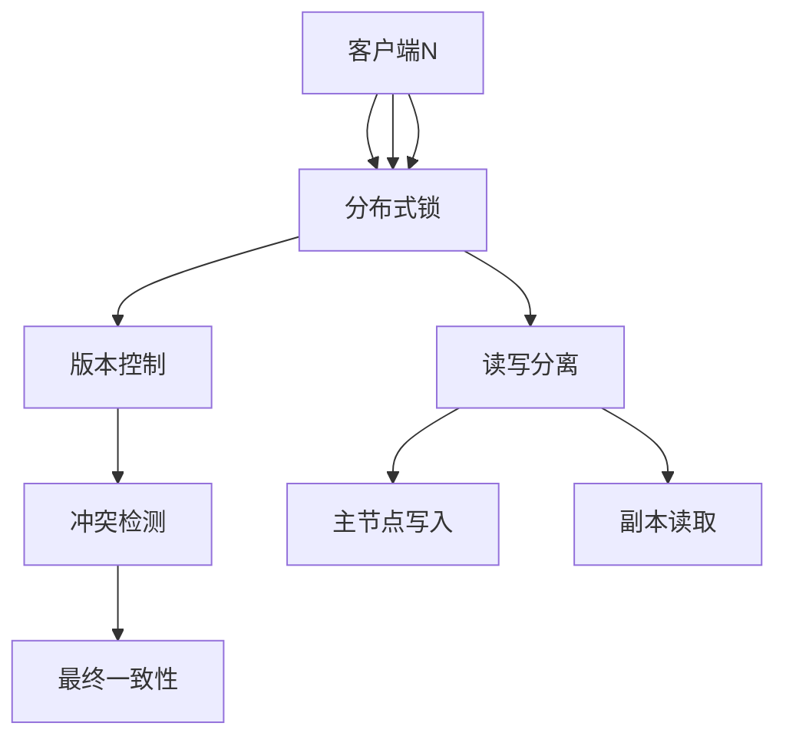

# 长期记忆

<cite>
**本文档中引用的文件**   
- [LongTermMemoryBase](file://src/agentscope/memory/_long_term_memory_base.py)
- [ReMeLongTermMemoryBase](file://src/agentscope/memory/_reme/_reme_long_term_memory_base.py)
- [Mem0LongTermMemory](file://src/agentscope/memory/_mem0_long_term_memory.py)
- [ReMePersonalLongTermMemory](file://src/agentscope/memory/_reme/_reme_personal_long_term_memory.py)
- [ReMeTaskLongTermMemory](file://src/agentscope/memory/_reme/_reme_task_long_term_memory.py)
- [ReMeToolLongTermMemory](file://src/agentscope/memory/_reme/_reme_tool_long_term_memory.py)
- [StateModule](file://src/agentscope/module/_state_module.py)
</cite>

## 目录
1. [引言](#引言)
2. [长期记忆与短期记忆的架构差异](#长期记忆与短期记忆的架构差异)
3. [LongTermMemoryBase 抽象基类接口定义](#longtermmemorybase-抽象基类接口定义)
4. [持久化存储设计](#持久化存储设计)
5. [异步I/O处理与状态同步](#异步i/o处理与状态同步)
6. [元数据管理与索引策略](#元数据管理与索引策略)
7. [自定义长期记忆后端实现指南](#自定义长期记忆后端实现指南)
8. [智能体与长期记忆系统交互流程](#智能体与长期记忆系统交互流程)
9. [分布式环境下的并发访问控制](#分布式环境下的并发访问控制)
10. [总结](#总结)

## 引言

长期记忆系统是智能体实现持续学习和上下文感知的核心组件。与短期记忆不同，长期记忆提供跨会话的持久化存储能力，使智能体能够积累知识、学习经验并建立个性化交互模式。本技术文档全面阐述了AgentScope框架中长期记忆系统的架构设计、核心接口和实现机制，为开发者提供深入的技术指导。

**Section sources**
- [LongTermMemoryBase](file://src/agentscope/memory/_long_term_memory_base.py)

## 长期记忆与短期记忆的架构差异

长期记忆与短期记忆在系统架构上存在根本性差异。短期记忆通常采用内存存储，具有快速访问特性，但生命周期局限于单次会话；而长期记忆则通过持久化存储机制实现数据的跨会话保留。在AgentScope框架中，长期记忆系统通过异步I/O操作与外部存储系统交互，确保数据持久性的同时不影响智能体的实时响应性能。

长期记忆的设计权衡主要体现在存储成本、检索效率和数据一致性之间。与短期记忆的简单队列或列表结构不同，长期记忆需要复杂的索引机制和查询优化策略。此外，长期记忆系统必须处理并发访问、数据版本控制和故障恢复等分布式系统特有的挑战，而这些在短期记忆中通常可以忽略。

**Section sources**
- [LongTermMemoryBase](file://src/agentscope/memory/_long_term_memory_base.py)
- [StateModule](file://src/agentscope/module/_state_module.py)

## LongTermMemoryBase 抽象基类接口定义

`LongTermMemoryBase`作为长期记忆系统的抽象基类，定义了四个核心抽象方法，形成了两种不同的使用模式：

**Diagram sources**
- [LongTermMemoryBase](file://src/agentscope/memory/_long_term_memory_base.py#L11-L94)

### 接口扩展契约

`LongTermMemoryBase`定义了两种互补的接口模式：

1. **开发者控制模式**（`record`和`retrieve`方法）：供开发者在系统层面使用，通常在每次回复开始时自动调用，将检索到的记忆添加到系统提示中。

2. **智能体控制模式**（`record_to_memory`和`retrieve_from_memory`方法）：作为工具函数供智能体主动管理长期记忆，允许智能体根据需要自愿记录和检索信息。

这种双重模式设计提供了灵活性，既支持自动化的记忆管理，又允许智能体进行主动的知识积累和检索。

**Section sources**
- [LongTermMemoryBase](file://src/agentscope/memory/_long_term_memory_base.py#L24-L94)

## 持久化存储设计

长期记忆系统的持久化存储设计采用分层架构，将内存缓存与外部持久化存储相结合。系统通过`StateModule`基类提供的状态管理机制，确保内存状态与持久化存储的一致性。

**Diagram sources**
- [LongTermMemoryBase](file://src/agentscope/memory/_long_term_memory_base.py)
- [StateModule](file://src/agentscope/module/_state_module.py)

存储系统支持多种后端实现，包括基于mem0库的向量存储和基于ReMe框架的专用记忆系统。每种实现都遵循相同的接口契约，但针对特定使用场景进行了优化。例如，ReMe系统专注于个人记忆、任务记忆和工具记忆的分类管理，而mem0系统则强调语义记忆的提取和关联。

**Section sources**
- [Mem0LongTermMemory](file://src/agentscope/memory/_mem0_long_term_memory.py)
- [ReMeLongTermMemoryBase](file://src/agentscope/memory/_reme/_reme_long_term_memory_base.py)

## 异步I/O处理与状态同步

长期记忆系统采用异步I/O处理机制，以避免阻塞智能体的核心推理过程。所有与持久化存储的交互都通过异步方法执行，确保系统的响应性能。

**Diagram sources**
- [LongTermMemoryBase](file://src/agentscope/memory/_long_term_memory_base.py)
- [Mem0LongTermMemory](file://src/agentscope/memory/_mem0_long_term_memory.py)

状态同步模式采用写后读一致性模型，在写操作完成后立即更新本地缓存，确保后续读操作能够获取最新数据。对于分布式环境，系统提供可配置的一致性级别，允许在性能和数据一致性之间进行权衡。

**Section sources**
- [LongTermMemoryBase](file://src/agentscope/memory/_long_term_memory_base.py#L24-L94)
- [Mem0LongTermMemory](file://src/agentscope/memory/_mem0_long_term_memory.py#L519-L558)

## 元数据管理与索引策略

长期记忆系统采用多维度元数据管理策略，支持基于时间、上下文和语义的复合索引。每个记忆条目都关联丰富的元数据，包括创建时间、相关智能体、用户标识和运行会话等。

**Diagram sources**
- [Mem0LongTermMemory](file://src/agentscope/memory/_mem0_long_term_memory.py#L76-L134)
- [ReMeLongTermMemoryBase](file://src/agentscope/memory/_reme/_reme_long_term_memory_base.py#L100-L145)

查询接口设计支持多种检索模式，包括关键词搜索、语义相似度检索和复合条件查询。系统自动选择最优的索引策略，结合元数据过滤和向量相似度计算，实现高效精准的记忆检索。

**Section sources**
- [Mem0LongTermMemory](file://src/agentscope/memory/_mem0_long_term_memory.py#L560-L624)
- [ReMePersonalLongTermMemory](file://src/agentscope/memory/_reme/_reme_personal_long_term_memory.py#L332-L415)

## 自定义长期记忆后端实现指南

实现自定义长期记忆后端需要继承`LongTermMemoryBase`抽象基类，并根据需求实现相应的抽象方法。以下是实现指南：

### 必需重写的方法

根据使用模式，需要实现不同的方法组合：

- **静态控制模式**：必须实现`record`和`retrieve`方法
- **智能体控制模式**：必须实现`record_to_memory`和`retrieve_from_memory`方法

**Diagram sources**
- [LongTermMemoryBase](file://src/agentscope/memory/_long_term_memory_base.py#L24-L94)

### 推荐的错误处理模式

长期记忆系统应采用防御性编程策略，对可能的异常情况进行妥善处理：

1. **依赖缺失处理**：当外部依赖（如ReMe库）未安装时，应提供清晰的错误信息和安装指引
2. **连接失败处理**：对存储系统连接失败实施重试机制和降级策略
3. **数据一致性处理**：在异常情况下确保数据状态的一致性，避免部分写入导致的数据损坏

**Section sources**
- [ReMeLongTermMemoryBase](file://src/agentscope/memory/_reme/_reme_long_term_memory_base.py#L266-L275)
- [Mem0LongTermMemory](file://src/agentscope/memory/_mem0_long_term_memory.py#L142-L174)

## 智能体与长期记忆系统交互流程

智能体与长期记忆系统的交互遵循严格的生命周期管理，通过异步上下文管理器确保资源的正确初始化和清理。

**Diagram sources**
- [ReMeLongTermMemoryBase](file://src/agentscope/memory/_reme/_reme_long_term_memory_base.py#L293-L371)
- [ReMePersonalLongTermMemory](file://src/agentscope/memory/_reme/_reme_personal_long_term_memory.py#L73-L77)

交互流程强调资源管理的重要性，所有记忆操作必须在异步上下文管理器中执行，确保ReMe后端的正确初始化和资源清理。

**Section sources**
- [ReMeLongTermMemoryBase](file://src/agentscope/memory/_reme/_reme_long_term_memory_base.py#L293-L371)

## 分布式环境下的并发访问控制

在分布式环境下，长期记忆系统采用多层并发控制策略，确保数据一致性和系统性能。

**Diagram sources**
- [StateModule](file://src/agentscope/module/_state_module.py#L49-L107)

系统通过`state_dict`和`load_state_dict`方法实现状态的序列化和反序列化，支持跨节点的状态同步。对于高并发场景，建议采用最终一致性模型，通过异步复制和冲突解决策略平衡性能和一致性。

**Section sources**
- [StateModule](file://src/agentscope/module/_state_module.py#L49-L107)

## 总结

长期记忆系统是智能体实现持续学习和个性化交互的关键基础设施。通过`LongTermMemoryBase`抽象基类定义的清晰接口契约，开发者可以灵活实现各种持久化存储后端。系统采用异步I/O处理、多维度索引和严格的资源管理，确保了高性能和数据可靠性。在分布式环境下，通过多层并发控制策略实现了可扩展的一致性保证。这些设计共同构成了一个强大而灵活的长期记忆框架，为构建更智能的AI系统奠定了基础。