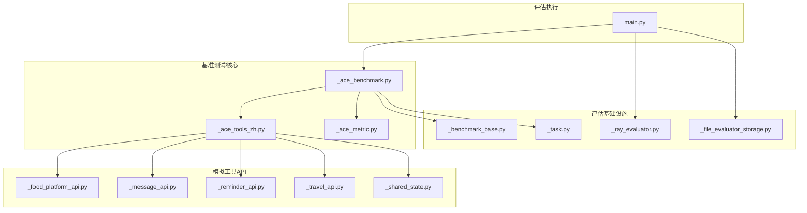
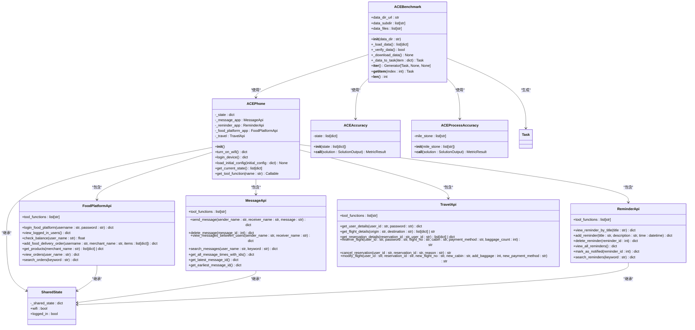
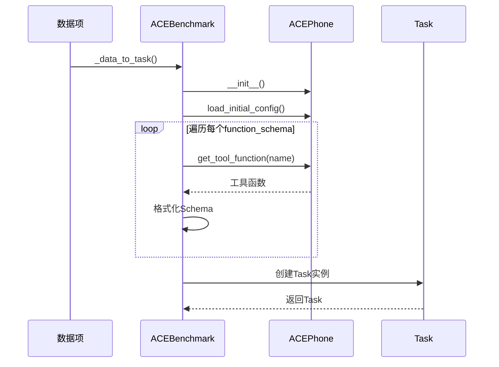
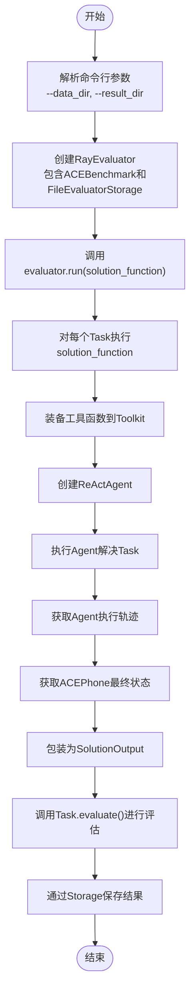
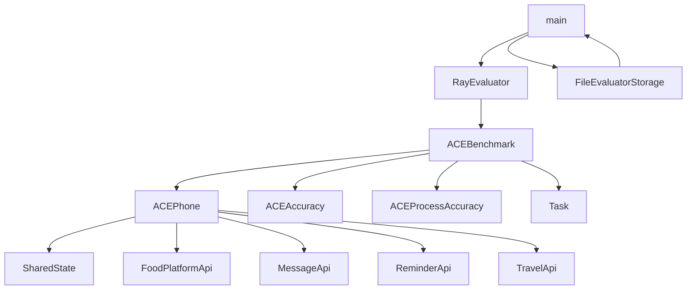

# ACEBench基准测试

<cite>
**本文档中引用的文件**  
- [main.py](file://examples/evaluation/ace_bench/main.py)
- [README.md](file://examples/evaluation/ace_bench/README.md)
- [_ace_benchmark.py](file://src/agentscope/evaluate/_ace_benchmark/_ace_benchmark.py)
- [_ace_tools_zh.py](file://src/agentscope/evaluate/_ace_benchmark/_ace_tools_zh.py)
- [_food_platform_api.py](file://src/agentscope/evaluate/_ace_benchmark/_ace_tools_api/_food_platform_api.py)
- [_message_api.py](file://src/agentscope/evaluate/_ace_benchmark/_ace_tools_api/_message_api.py)
- [_reminder_api.py](file://src/agentscope/evaluate/_ace_benchmark/_ace_tools_api/_reminder_api.py)
- [_travel_api.py](file://src/agentscope/evaluate/_ace_benchmark/_ace_tools_api/_travel_api.py)
- [_shared_state.py](file://src/agentscope/evaluate/_ace_benchmark/_ace_tools_api/_shared_state.py)
- [_ace_metric.py](file://src/agentscope/evaluate/_ace_benchmark/_ace_metric.py)
- [_benchmark_base.py](file://src/agentscope/evaluate/_benchmark_base.py)
- [_task.py](file://src/agentscope/evaluate/_task.py)
- [_ray_evaluator.py](file://src/agentscope/evaluate/_evaluator/_ray_evaluator.py)
- [_file_evaluator_storage.py](file://src/agentscope/evaluate/_evaluator_storage/_file_evaluator_storage.py)
</cite>

## 目录
1. [简介](#简介)
2. [项目结构](#项目结构)
3. [核心组件](#核心组件)
4. [架构概述](#架构概述)
5. [详细组件分析](#详细组件分析)
6. [依赖分析](#依赖分析)
7. [性能考量](#性能考量)
8. [故障排除指南](#故障排除指南)
9. [结论](#结论)

## 简介
ACEBench基准测试是AgentScope框架中的一个评估模块，旨在为AI智能体提供标准化的评估标准。该基准测试通过模拟真实场景中的多应用交互，评估智能体在复杂任务中的表现。其设计目标是衡量智能体在处理多步骤、多工具调用任务时的准确性和流程完整性。应用场景包括但不限于智能助手、自动化客服、任务规划系统等。ACEBench目前主要支持中文数据集，并计划未来扩展英文版本。

**Section sources**
- [README.md](file://examples/evaluation/ace_bench/README.md#L1-L19)

## 项目结构
ACEBench基准测试的代码主要位于`src/agentscope/evaluate/_ace_benchmark`目录下，包含核心的基准测试类、工具API和评估指标。数据集和评估结果的管理通过`examples/evaluation/ace_bench`目录下的示例脚本进行。项目结构清晰地分离了数据加载、任务执行和结果评估三个主要功能模块。

**Diagram sources**
- [main.py](file://examples/evaluation/ace_bench/main.py#L1-L131)
- [_ace_benchmark.py](file://src/agentscope/evaluate/_ace_benchmark/_ace_benchmark.py#L1-L241)
- [_ace_tools_zh.py](file://src/agentscope/evaluate/_ace_benchmark/_ace_tools_zh.py#L1-L123)
- [_food_platform_api.py](file://src/agentscope/evaluate/_ace_benchmark/_ace_tools_api/_food_platform_api.py#L1-L303)
- [_message_api.py](file://src/agentscope/evaluate/_ace_benchmark/_ace_tools_api/_message_api.py#L1-L341)
- [_reminder_api.py](file://src/agentscope/evaluate/_ace_benchmark/_ace_tools_api/_reminder_api.py#L1-L215)
- [_travel_api.py](file://src/agentscope/evaluate/_ace_benchmark/_ace_tools_api/_travel_api.py#L1-L835)
- [_shared_state.py](file://src/agentscope/evaluate/_ace_benchmark/_ace_tools_api/_shared_state.py#L1-L21)
- [_ace_metric.py](file://src/agentscope/evaluate/_ace_benchmark/_ace_metric.py#L1-L132)
- [_benchmark_base.py](file://src/agentscope/evaluate/_benchmark_base.py#L1-L44)
- [_task.py](file://src/agentscope/evaluate/_task.py#L1-L54)
- [_ray_evaluator.py](file://src/agentscope/evaluate/_evaluator/_ray_evaluator.py)
- [_file_evaluator_storage.py](file://src/agentscope/evaluate/_evaluator_storage/_file_evaluator_storage.py)

**Section sources**
- [main.py](file://examples/evaluation/ace_bench/main.py#L1-L131)
- [_ace_benchmark.py](file://src/agentscope/evaluate/_ace_benchmark/_ace_benchmark.py#L1-L241)

## 核心组件
ACEBench的核心组件包括`ACEBenchmark`类，负责数据集的加载、验证和任务生成；`ACEPhone`类，作为模拟手机的中心，集成多个应用API；以及`ACEAccuracy`和`ACEProcessAccuracy`评估指标，用于衡量任务完成的准确性和流程正确性。这些组件协同工作，为AI智能体提供一个完整的评估环境。

**Section sources**
- [_ace_benchmark.py](file://src/agentscope/evaluate/_ace_benchmark/_ace_benchmark.py#L1-L241)
- [_ace_tools_zh.py](file://src/agentscope/evaluate/_ace_benchmark/_ace_tools_zh.py#L1-L123)
- [_ace_metric.py](file://src/agentscope/evaluate/_ace_benchmark/_ace_metric.py#L1-L132)

## 架构概述
ACEBench的架构遵循模块化设计原则，将数据管理、任务执行和结果评估分离。`ACEBenchmark`继承自`BenchmarkBase`，实现了数据集的迭代接口。`ACEPhone`类通过组合模式集成了`FoodPlatformApi`、`MessageApi`、`ReminderApi`和`TravelApi`，并通过`SharedState`类共享设备状态（如WiFi和登录状态）。评估过程由`RayEvaluator`驱动，支持分布式并行评估。

**Diagram sources**
- [_ace_benchmark.py](file://src/agentscope/evaluate/_ace_benchmark/_ace_benchmark.py#L1-L241)
- [_ace_tools_zh.py](file://src/agentscope/evaluate/_ace_benchmark/_ace_tools_zh.py#L1-L123)
- [_food_platform_api.py](file://src/agentscope/evaluate/_ace_benchmark/_ace_tools_api/_food_platform_api.py#L1-L303)
- [_message_api.py](file://src/agentscope/evaluate/_ace_benchmark/_ace_tools_api/_message_api.py#L1-L341)
- [_reminder_api.py](file://src/agentscope/evaluate/_ace_benchmark/_ace_tools_api/_reminder_api.py#L1-L215)
- [_travel_api.py](file://src/agentscope/evaluate/_ace_benchmark/_ace_tools_api/_travel_api.py#L1-L835)
- [_shared_state.py](file://src/agentscope/evaluate/_ace_benchmark/_ace_tools_api/_shared_state.py#L1-L21)
- [_ace_metric.py](file://src/agentscope/evaluate/_ace_benchmark/_ace_metric.py#L1-L132)

## 详细组件分析

### 数据集加载与验证机制
ACEBench的数据集加载机制首先检查指定的数据目录是否存在且为有效路径。如果目录不存在，会创建该目录。然后通过`_verify_data()`方法检查数据完整性，确保所有必需的数据文件和对应的真值文件都存在。如果验证失败，会从预设的URL（`https://raw.githubusercontent.com/ACEBench/ACEBench/main/data_all`）下载数据。数据目录结构包含`data_zh`子目录，其中存放`data_agent_multi_step.json`等数据文件，以及`possible_answer`子目录存放对应的真值文件。文件完整性校验通过检查文件是否存在来完成。

**Section sources**
- [_ace_benchmark.py](file://src/agentscope/evaluate/_ace_benchmark/_ace_benchmark.py#L58-L84)

### 任务转换与执行
数据项通过`_data_to_task()`方法转换为`Task`对象。此过程包括：1) 初始化`ACEPhone`实例并加载初始配置；2) 从数据项中提取工具函数和JSON Schema，通过`ACEPhone`的`get_tool_function()`方法获取实际的工具函数，并将其与Schema一起注册到工具包中；3) 创建`Task`对象，注入输入、真值、标签、评估指标和元数据（包括`ACEPhone`实例和工具列表）。元数据中的`phone`用于在任务完成后提取最终状态，`tools`用于装备智能体。

**Diagram sources**
- [_ace_benchmark.py](file://src/agentscope/evaluate/_ace_benchmark/_ace_benchmark.py#L176-L227)
- [_ace_tools_zh.py](file://src/agentscope/evaluate/_ace_benchmark/_ace_tools_zh.py#L99-L122)

### 任务迭代接口
ACEBench实现了Python的迭代器协议，允许通过索引访问特定任务。`__iter__()`方法返回一个生成器，可以遍历所有任务。`__getitem__(index)`方法根据索引返回对应的任务，`__len__()`方法返回任务总数。这使得用户可以方便地对任务集进行遍历或随机访问。

**Section sources**
- [_ace_benchmark.py](file://src/agentscope/evaluate/_ace_benchmark/_ace_benchmark.py#L229-L238)

### 评估执行流程
结合`examples/evaluation/ace_bench/main.py`中的示例，完整的评估流程如下：1) 通过命令行参数指定数据目录和结果目录；2) 创建`RayEvaluator`实例，配置`ACEBenchmark`、存储后端（`FileEvaluatorStorage`）和工作进程数；3) 定义解决方案函数（如`react_agent_solution`），该函数接收`Task`对象，装备工具，创建并执行ReAct智能体；4) 调用`evaluator.run()`方法启动评估。评估结果将保存到指定的结果目录中。

**Diagram sources**
- [main.py](file://examples/evaluation/ace_bench/main.py#L86-L130)

## 依赖分析
ACEBench的依赖关系清晰。`ACEBenchmark`依赖于`ACEPhone`、`ACEAccuracy`、`ACEProcessAccuracy`和`Task`。`ACEPhone`依赖于`SharedState`和四个具体的API类。评估流程依赖于`RayEvaluator`和`FileEvaluatorStorage`。这种设计确保了高内聚低耦合，便于维护和扩展。

**Diagram sources**
- [_ace_benchmark.py](file://src/agentscope/evaluate/_ace_benchmark/_ace_benchmark.py#L1-L241)
- [_ace_tools_zh.py](file://src/agentscope/evaluate/_ace_benchmark/_ace_tools_zh.py#L1-L123)
- [main.py](file://examples/evaluation/ace_bench/main.py#L1-L131)

## 性能考量
ACEBench通过`RayEvaluator`支持分布式和并行评估，显著提升了大规模评估的效率。数据集在初始化时一次性加载到内存中，避免了重复的I/O操作。工具函数的调用是轻量级的内存操作，不涉及外部网络请求，保证了评估过程的稳定性和可重复性。

## 故障排除指南
ACEBench包含明确的错误处理策略。在`ACEBenchmark`的初始化过程中，如果提供的`data_dir`不是有效的目录路径，会抛出`RuntimeError`。在工具函数执行过程中，如`login_food_platform`，会检查WiFi状态和用户凭据，返回包含错误信息的字典。这些错误处理机制确保了评估过程的健壮性，并为调试提供了清晰的反馈。

**Section sources**
- [_ace_benchmark.py](file://src/agentscope/evaluate/_ace_benchmark/_ace_benchmark.py#L75-L78)
- [_food_platform_api.py](file://src/agentscope/evaluate/_ace_benchmark/_ace_tools_api/_food_platform_api.py#L137-L143)

## 结论
ACEBench基准测试为AI智能体提供了一个全面、可扩展的评估框架。其核心设计围绕模拟真实手机环境，通过`ACEPhone`集成多个应用API，构建复杂的多步骤任务。数据集的加载、验证和下载机制确保了评估的可重复性。任务转换过程将数据项无缝转换为可执行的`Task`对象，并通过迭代接口提供灵活的访问方式。结合`RayEvaluator`，ACEBench支持高效的分布式评估。目前主要支持中文数据集，未来计划扩展英文版本，以支持更广泛的评估需求。其清晰的错误处理和模块化架构使其成为一个强大且易于使用的评估工具。