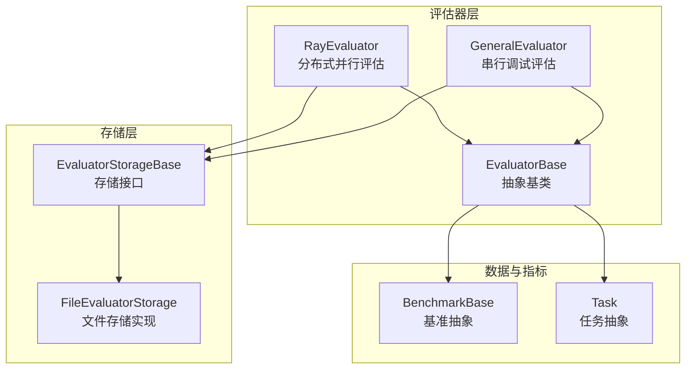
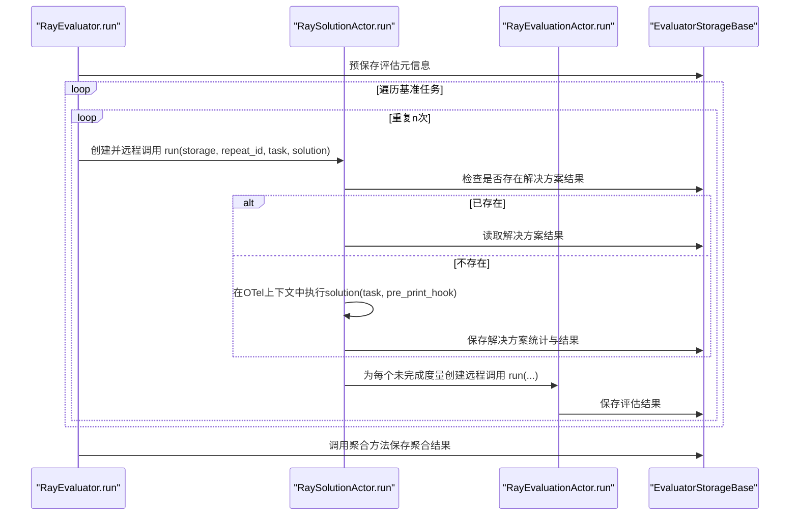
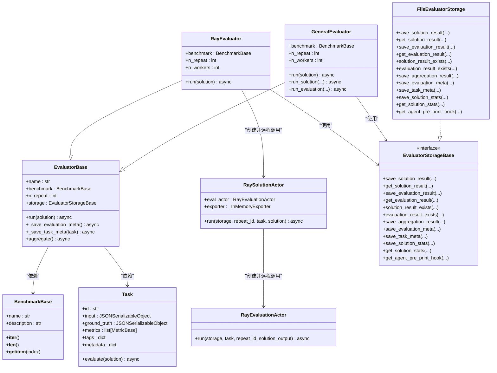
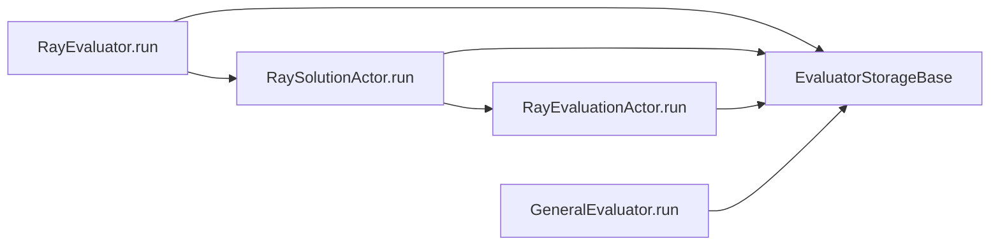
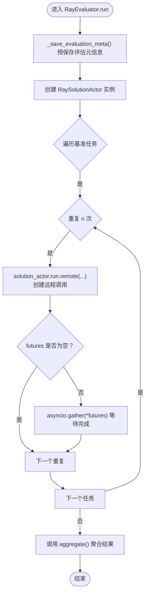

# Ray分布式评估器

<cite>
**本文引用的文件列表**
- [src/agentscope/evaluate/_evaluator/_ray_evaluator.py](file://src/agentscope/evaluate/_evaluator/_ray_evaluator.py)
- [src/agentscope/evaluate/_evaluator/_general_evaluator.py](file://src/agentscope/evaluate/_evaluator/_general_evaluator.py)
- [src/agentscope/evaluate/_evaluator/_evaluator_base.py](file://src/agentscope/evaluate/_evaluator/_evaluator_base.py)
- [src/agentscope/evaluate/_evaluator_storage/_evaluator_storage_base.py](file://src/agentscope/evaluate/_evaluator_storage/_evaluator_storage_base.py)
- [src/agentscope/evaluate/_evaluator_storage/_file_evaluator_storage.py](file://src/agentscope/evaluate/_evaluator_storage/_file_evaluator_storage.py)
- [src/agentscope/evaluate/_benchmark_base.py](file://src/agentscope/evaluate/_benchmark_base.py)
- [src/agentscope/evaluate/_task.py](file://src/agentscope/evaluate/_task.py)
- [tests/evaluation_test.py](file://tests/evaluation_test.py)
</cite>

## 目录
1. [简介](#简介)
2. [项目结构](#项目结构)
3. [核心组件](#核心组件)
4. [架构总览](#架构总览)
5. [关键组件详解](#关键组件详解)
6. [依赖关系分析](#依赖关系分析)
7. [性能与吞吐特性](#性能与吞吐特性)
8. [故障排查指南](#故障排查指南)
9. [结论](#结论)
10. [附录](#附录)

## 简介
本文件系统化阐述Ray分布式评估器（RayEvaluator）的设计与实现，重点覆盖以下方面：
- 初始化阶段对Ray运行时可用性的检查机制
- 基于Ray Actor模型的分布式执行流程：如何创建具备最大并发限制的解决方案Actor（RaySolutionActor），并将任务分发为远程异步调用（futures）
- 任务元数据的预保存、重复执行ID的生成策略，以及所有评估任务的并发聚合（asyncio.gather）
- 与通用评估器（GeneralEvaluator）的对比，突出RayEvaluator在高吞吐场景下的优势
- 通过test_ray_evaluator测试用例验证分布式评估的正确性与结果一致性
- 如何集成自定义的同步或异步解决方案函数，并处理其返回值
- 评估结果聚合的最终步骤

## 项目结构
RayEvaluator位于评估模块中，与通用评估器、存储接口、基准与任务抽象共同构成完整的评估流水线。下图展示与本文相关的关键文件与职责划分。

图表来源
- [src/agentscope/evaluate/_evaluator/_ray_evaluator.py](file://src/agentscope/evaluate/_evaluator/_ray_evaluator.py#L190-L268)
- [src/agentscope/evaluate/_evaluator/_general_evaluator.py](file://src/agentscope/evaluate/_evaluator/_general_evaluator.py#L1-L179)
- [src/agentscope/evaluate/_evaluator/_evaluator_base.py](file://src/agentscope/evaluate/_evaluator/_evaluator_base.py#L1-L305)
- [src/agentscope/evaluate/_evaluator_storage/_evaluator_storage_base.py](file://src/agentscope/evaluate/_evaluator_storage/_evaluator_storage_base.py#L1-L255)
- [src/agentscope/evaluate/_evaluator_storage/_file_evaluator_storage.py](file://src/agentscope/evaluate/_evaluator_storage/_file_evaluator_storage.py#L1-L461)
- [src/agentscope/evaluate/_benchmark_base.py](file://src/agentscope/evaluate/_benchmark_base.py#L1-L44)
- [src/agentscope/evaluate/_task.py](file://src/agentscope/evaluate/_task.py#L1-L54)

章节来源
- [src/agentscope/evaluate/_evaluator/_ray_evaluator.py](file://src/agentscope/evaluate/_evaluator/_ray_evaluator.py#L1-L268)
- [src/agentscope/evaluate/_evaluator/_general_evaluator.py](file://src/agentscope/evaluate/_evaluator/_general_evaluator.py#L1-L179)
- [src/agentscope/evaluate/_evaluator/_evaluator_base.py](file://src/agentscope/evaluate/_evaluator/_evaluator_base.py#L1-L305)
- [src/agentscope/evaluate/_evaluator_storage/_evaluator_storage_base.py](file://src/agentscope/evaluate/_evaluator_storage/_evaluator_storage_base.py#L1-L255)
- [src/agentscope/evaluate/_evaluator_storage/_file_evaluator_storage.py](file://src/agentscope/evaluate/_evaluator_storage/_file_evaluator_storage.py#L1-L461)
- [src/agentscope/evaluate/_benchmark_base.py](file://src/agentscope/evaluate/_benchmark_base.py#L1-L44)
- [src/agentscope/evaluate/_task.py](file://src/agentscope/evaluate/_task.py#L1-L54)

## 核心组件
- RayEvaluator：基于Ray的分布式并行评估器，负责创建解决方案Actor、分发任务、聚合结果
- RaySolutionActor：解决方案执行Actor，封装解决方案函数调用、上下文追踪、统计收集与评估任务分发
- RayEvaluationActor：评估执行Actor，按度量逐个执行评估并写入存储
- EvaluatorBase：评估器抽象基类，提供元信息与聚合逻辑
- EvaluatorStorageBase/FileEvaluatorStorage：存储接口与文件存储实现，支持断点续跑
- BenchmarkBase/Task：基准与任务抽象，定义迭代、索引与评估流程

章节来源
- [src/agentscope/evaluate/_evaluator/_ray_evaluator.py](file://src/agentscope/evaluate/_evaluator/_ray_evaluator.py#L190-L268)
- [src/agentscope/evaluate/_evaluator/_general_evaluator.py](file://src/agentscope/evaluate/_evaluator/_general_evaluator.py#L1-L179)
- [src/agentscope/evaluate/_evaluator/_evaluator_base.py](file://src/agentscope/evaluate/_evaluator/_evaluator_base.py#L1-L305)
- [src/agentscope/evaluate/_evaluator_storage/_evaluator_storage_base.py](file://src/agentscope/evaluate/_evaluator_storage/_evaluator_storage_base.py#L1-L255)
- [src/agentscope/evaluate/_evaluator_storage/_file_evaluator_storage.py](file://src/agentscope/evaluate/_evaluator_storage/_file_evaluator_storage.py#L1-L461)
- [src/agentscope/evaluate/_benchmark_base.py](file://src/agentscope/evaluate/_benchmark_base.py#L1-L44)
- [src/agentscope/evaluate/_task.py](file://src/agentscope/evaluate/_task.py#L1-L54)

## 架构总览
RayEvaluator采用“主评估器 + 解决方案Actor + 评估Actor”的分层架构：
- 主评估器负责元信息与任务元数据的预保存、任务遍历与重复次数循环、解决方案Actor的创建与远程调用
- 解决方案Actor负责：检查/加载已存在的解决方案结果；若不存在则在OpenTelemetry上下文中执行用户提供的解决方案函数；保存解决方案统计与结果；为每个未完成的度量创建评估Actor远程调用
- 评估Actor负责：对单个度量执行评估并将结果写入存储
- 存储层负责：持久化解决方案、评估结果、聚合统计与元信息

图表来源
- [src/agentscope/evaluate/_evaluator/_ray_evaluator.py](file://src/agentscope/evaluate/_evaluator/_ray_evaluator.py#L222-L268)
- [src/agentscope/evaluate/_evaluator/_ray_evaluator.py](file://src/agentscope/evaluate/_evaluator/_ray_evaluator.py#L70-L188)
- [src/agentscope/evaluate/_evaluator/_evaluator_base.py](file://src/agentscope/evaluate/_evaluator/_evaluator_base.py#L96-L305)

## 关键组件详解

### RayEvaluator：分布式并行评估入口
- 初始化校验：在构造函数中调用可用性检查，确保Ray已安装
- 元信息与任务元数据预保存：在开始前统一保存评估元信息与每个任务的元数据
- 并发控制：通过n_workers参数控制解决方案Actor的最大并发度
- 任务分发：对每个任务与重复ID组合创建RaySolutionActor远程调用，使用asyncio.gather聚合等待
- 结果聚合：完成后调用EvaluatorBase的聚合方法，汇总统计与指标分布

章节来源
- [src/agentscope/evaluate/_evaluator/_ray_evaluator.py](file://src/agentscope/evaluate/_evaluator/_ray_evaluator.py#L190-L268)
- [src/agentscope/evaluate/_evaluator/_evaluator_base.py](file://src/agentscope/evaluate/_evaluator/_evaluator_base.py#L65-L94)

### RaySolutionActor：解决方案与评估调度中心
- 上下文追踪：在OpenTelemetry中设置baggage（task_id、repeat_id），并在span结束时强制刷新
- 解决方案执行：调用用户提供的solution函数，传入Task与pre-print钩子，支持同步或异步
- 统计与结果持久化：保存解决方案统计与结果
- 度量评估分发：对每个未完成的度量创建RayEvaluationActor远程调用，使用asyncio.gather聚合等待

章节来源
- [src/agentscope/evaluate/_evaluator/_ray_evaluator.py](file://src/agentscope/evaluate/_evaluator/_ray_evaluator.py#L70-L188)

### RayEvaluationActor：度量评估执行器
- 评估执行：对单个度量执行Task.evaluate，逐个度量保存评估结果
- 存储写入：将每个度量的评估结果写入存储

章节来源
- [src/agentscope/evaluate/_evaluator/_ray_evaluator.py](file://src/agentscope/evaluate/_evaluator/_ray_evaluator.py#L38-L68)

### 通用评估器（对比参考）：串行调试路径
- 串行执行：先保存元信息与任务元数据，再逐任务、逐重复ID顺序执行
- 解决方案与评估在同一进程内串行进行，便于调试
- 最终同样调用聚合方法

章节来源
- [src/agentscope/evaluate/_evaluator/_general_evaluator.py](file://src/agentscope/evaluate/_evaluator/_general_evaluator.py#L1-L179)
- [src/agentscope/evaluate/_evaluator/_evaluator_base.py](file://src/agentscope/evaluate/_evaluator/_evaluator_base.py#L96-L305)

### 存储接口与文件存储
- 接口职责：提供解决方案与评估结果的存取、聚合结果写入、元信息与统计的持久化
- 文件存储实现：以目录结构组织数据，支持断点续跑与结果一致性校验

章节来源
- [src/agentscope/evaluate/_evaluator_storage/_evaluator_storage_base.py](file://src/agentscope/evaluate/_evaluator_storage/_evaluator_storage_base.py#L1-L255)
- [src/agentscope/evaluate/_evaluator_storage/_file_evaluator_storage.py](file://src/agentscope/evaluate/_evaluator_storage/_file_evaluator_storage.py#L1-L461)

### 基准与任务抽象
- 基准抽象：提供迭代、长度与索引访问能力
- 任务抽象：包含输入、标签、度量集合等，evaluate方法按度量顺序执行并返回结果列表

章节来源
- [src/agentscope/evaluate/_benchmark_base.py](file://src/agentscope/evaluate/_benchmark_base.py#L1-L44)
- [src/agentscope/evaluate/_task.py](file://src/agentscope/evaluate/_task.py#L1-L54)

### 类关系图（代码级）

图表来源
- [src/agentscope/evaluate/_evaluator/_ray_evaluator.py](file://src/agentscope/evaluate/_evaluator/_ray_evaluator.py#L190-L268)
- [src/agentscope/evaluate/_evaluator/_general_evaluator.py](file://src/agentscope/evaluate/_evaluator/_general_evaluator.py#L1-L179)
- [src/agentscope/evaluate/_evaluator/_evaluator_base.py](file://src/agentscope/evaluate/_evaluator/_evaluator_base.py#L1-L305)
- [src/agentscope/evaluate/_evaluator_storage/_evaluator_storage_base.py](file://src/agentscope/evaluate/_evaluator_storage/_evaluator_storage_base.py#L1-L255)
- [src/agentscope/evaluate/_evaluator_storage/_file_evaluator_storage.py](file://src/agentscope/evaluate/_evaluator_storage/_file_evaluator_storage.py#L1-L461)
- [src/agentscope/evaluate/_benchmark_base.py](file://src/agentscope/evaluate/_benchmark_base.py#L1-L44)
- [src/agentscope/evaluate/_task.py](file://src/agentscope/evaluate/_task.py#L1-L54)

## 依赖关系分析
- 运行时依赖：Ray（通过条件装饰器与可用性检查）
- 分布式执行：RaySolutionActor与RayEvaluationActor均通过ray.remote装饰，形成Actor模型
- 并发控制：通过Actor的max_concurrency选项限制每个Actor内的并发度
- 异步聚合：使用asyncio.gather对多个远程调用进行并发等待
- 存储依赖：EvaluatorStorageBase接口解耦具体存储实现，当前示例使用FileEvaluatorStorage

图表来源
- [src/agentscope/evaluate/_evaluator/_ray_evaluator.py](file://src/agentscope/evaluate/_evaluator/_ray_evaluator.py#L222-L268)
- [src/agentscope/evaluate/_evaluator/_general_evaluator.py](file://src/agentscope/evaluate/_evaluator/_general_evaluator.py#L124-L179)
- [src/agentscope/evaluate/_evaluator_storage/_evaluator_storage_base.py](file://src/agentscope/evaluate/_evaluator_storage/_evaluator_storage_base.py#L1-L255)

## 性能与吞吐特性
- 并发粒度：RayEvaluator通过n_workers控制解决方案Actor的最大并发度，从而提升整体吞吐
- 执行模式：RaySolutionActor内部对每个未完成度量创建独立的RayEvaluationActor远程调用，度量间并行执行
- 聚合策略：使用asyncio.gather一次性等待所有远程调用完成，避免串行等待带来的延迟
- 对比优势：相较GeneralEvaluator的串行执行，RayEvaluator在多任务、多度量场景下具有更高的吞吐与更低的总耗时

章节来源
- [src/agentscope/evaluate/_evaluator/_ray_evaluator.py](file://src/agentscope/evaluate/_evaluator/_ray_evaluator.py#L222-L268)
- [src/agentscope/evaluate/_evaluator/_general_evaluator.py](file://src/agentscope/evaluate/_evaluator/_general_evaluator.py#L124-L179)

## 故障排查指南
- Ray不可用：初始化时会触发可用性检查，如未安装Ray将抛出导入错误
- 重复执行ID：使用字符串化的重复索引作为repeat_id，确保与存储层约定一致
- 结果一致性：测试用例通过断言评估结果与期望值一致来验证正确性
- Ray环境：测试中演示了如何初始化Ray并配置工作目录与模块路径，避免序列化问题

章节来源
- [src/agentscope/evaluate/_evaluator/_ray_evaluator.py](file://src/agentscope/evaluate/_evaluator/_ray_evaluator.py#L14-L23)
- [tests/evaluation_test.py](file://tests/evaluation_test.py#L243-L274)
- [tests/evaluation_test.py](file://tests/evaluation_test.py#L194-L208)

## 结论
RayEvaluator通过Ray Actor模型实现了大规模并行评估，结合max_concurrency与asyncio.gather显著提升了吞吐与效率。其与通用评估器相比，在高负载场景下具备明显优势；同时通过存储接口与聚合逻辑保证了结果的一致性与可观测性。测试用例验证了分布式执行的正确性与结果一致性，为实际工程落地提供了可靠基础。

## 附录

### RayEvaluator执行流程（算法级）

图表来源
- [src/agentscope/evaluate/_evaluator/_ray_evaluator.py](file://src/agentscope/evaluate/_evaluator/_ray_evaluator.py#L222-L268)
- [src/agentscope/evaluate/_evaluator/_evaluator_base.py](file://src/agentscope/evaluate/_evaluator/_evaluator_base.py#L96-L305)

### 测试用例要点
- 使用ToyBenchmark与CheckEqual度量构造简单数学题评估场景
- 通过dummy_solution_generation模拟解决方案生成，返回数值型答案
- 断言两个任务的评估结果分别为正确与错误，验证RayEvaluator与GeneralEvaluator的一致性

章节来源
- [tests/evaluation_test.py](file://tests/evaluation_test.py#L243-L274)