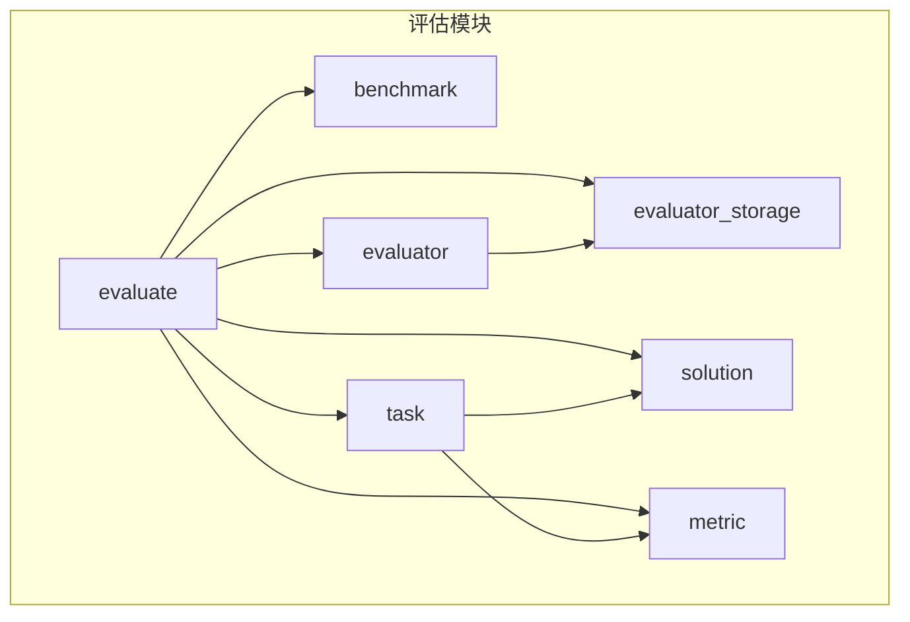
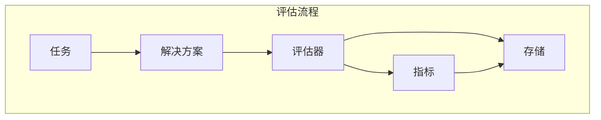
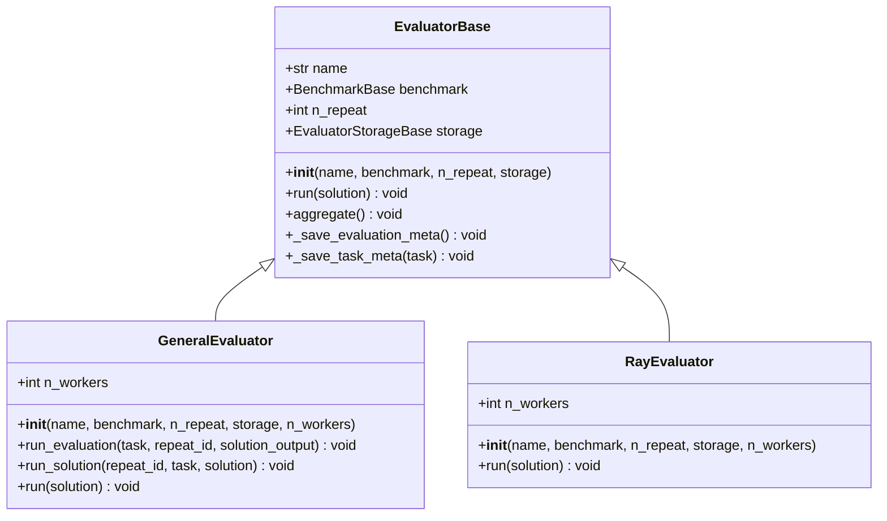
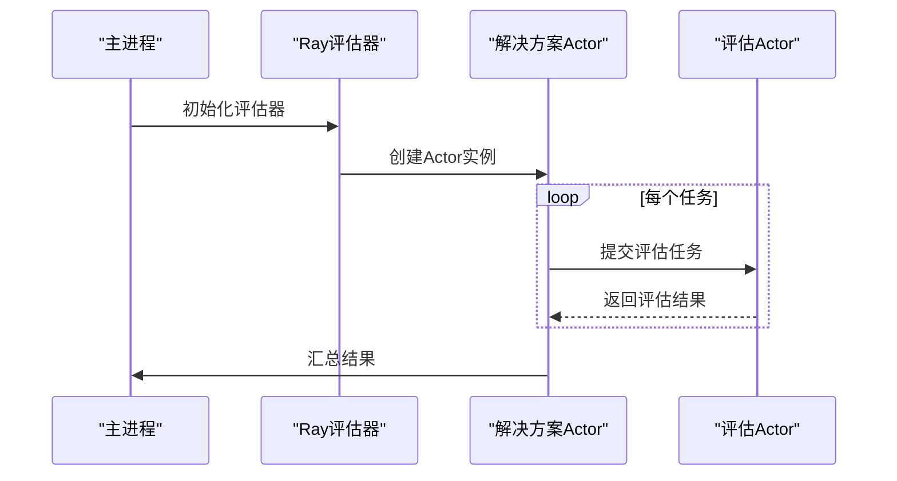
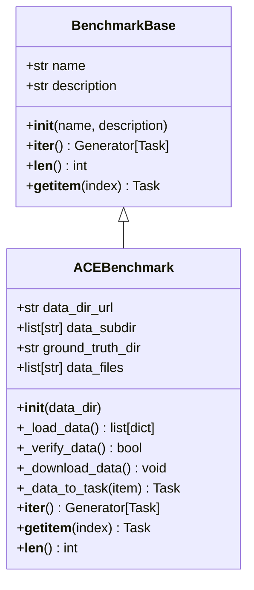
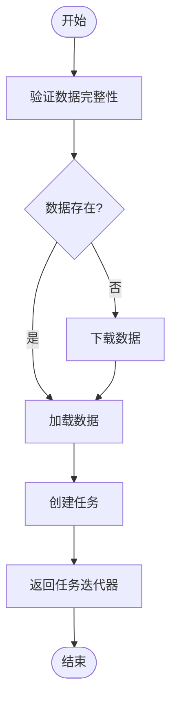
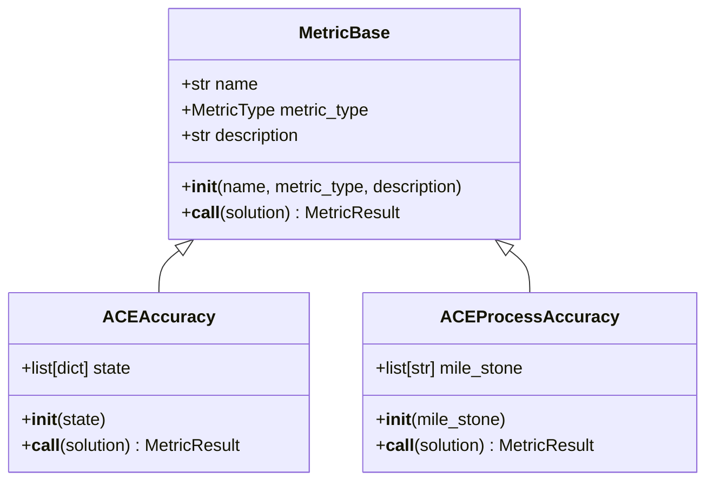
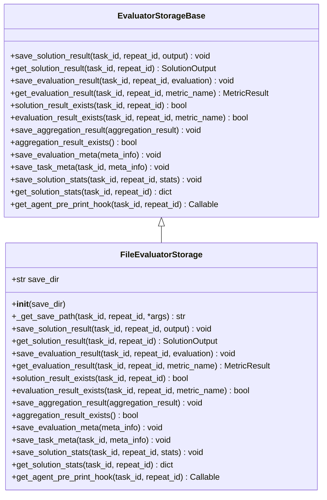
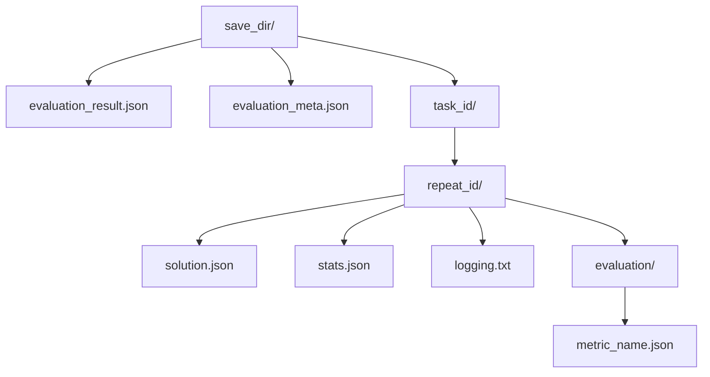
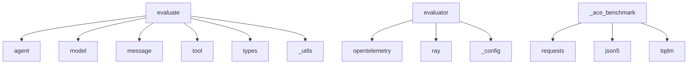

# 评估系统

<cite>
**本文档中引用的文件**  
- [main.py](file://examples/evaluation/ace_bench/main.py)
- [README.md](file://examples/evaluation/ace_bench/README.md)
- [__init__.py](file://src/agentscope/evaluate/__init__.py)
- [_evaluator_base.py](file://src/agentscope/evaluate/_evaluator/_evaluator_base.py)
- [_general_evaluator.py](file://src/agentscope/evaluate/_evaluator/_general_evaluator.py)
- [_ray_evaluator.py](file://src/agentscope/evaluate/_evaluator/_ray_evaluator.py)
- [_ace_benchmark.py](file://src/agentscope/evaluate/_ace_benchmark/_ace_benchmark.py)
- [_ace_metric.py](file://src/agentscope/evaluate/_ace_benchmark/_ace_metric.py)
- [_file_evaluator_storage.py](file://src/agentscope/evaluate/_evaluator_storage/_file_evaluator_storage.py)
- [_benchmark_base.py](file://src/agentscope/evaluate/_benchmark_base.py)
- [_task.py](file://src/agentscope/evaluate/_task.py)
- [_solution.py](file://src/agentscope/evaluate/_solution.py)
</cite>

## 目录
1. [简介](#简介)
2. [项目结构](#项目结构)
3. [核心组件](#核心组件)
4. [架构概述](#架构概述)
5. [详细组件分析](#详细组件分析)
6. [依赖分析](#依赖分析)
7. [性能考虑](#性能考虑)
8. [故障排除指南](#故障排除指南)
9. [结论](#结论)

## 简介
本文件旨在为AgentScope框架中的评估系统提供全面文档。重点介绍ACEBench基准测试的集成和使用方法，解释通用评估器的设计原理和扩展机制，并提供分布式评估的配置指南（包括Ray集成）。通过示例展示自定义评估指标的创建和评估任务的执行，讨论评估结果的收集、分析和可视化。涵盖性能基准测试和质量评估的最佳实践，提供评估框架的扩展点和插件开发指南，包含常见评估场景的模板和示例。

## 项目结构
评估系统主要位于`src/agentscope/evaluate`目录下，包含多个子模块和核心组件。该系统设计用于支持多种评估场景，特别是与ACEBench基准测试的集成。

**图源**  
- [__init__.py](file://src/agentscope/evaluate/__init__.py)

**本节来源**  
- [__init__.py](file://src/agentscope/evaluate/__init__.py)

## 核心组件
评估系统的核心组件包括评估器（Evaluator）、基准测试（Benchmark）、任务（Task）、解决方案输出（SolutionOutput）、指标（Metric）和存储（Storage）。这些组件协同工作，形成一个完整的评估流程。

**本节来源**  
- [__init__.py](file://src/agentscope/evaluate/__init__.py)
- [_benchmark_base.py](file://src/agentscope/evaluate/_benchmark_base.py)
- [_task.py](file://src/agentscope/evaluate/_task.py)

## 架构概述
评估系统的架构基于模块化设计，允许灵活的扩展和集成。核心架构包括评估器、基准测试、任务、解决方案和存储组件。

**图源**  
- [_evaluator_base.py](file://src/agentscope/evaluate/_evaluator/_evaluator_base.py)
- [_task.py](file://src/agentscope/evaluate/_task.py)

## 详细组件分析

### 评估器分析
评估器是评估系统的核心，负责协调整个评估流程。系统提供了两种主要的评估器实现：`GeneralEvaluator`用于本地调试，`RayEvaluator`用于分布式并行评估。

#### 评估器基类

**图源**  
- [_evaluator_base.py](file://src/agentscope/evaluate/_evaluator/_evaluator_base.py)
- [_general_evaluator.py](file://src/agentscope/evaluate/_evaluator/_general_evaluator.py)
- [_ray_evaluator.py](file://src/agentscope/evaluate/_evaluator/_ray_evaluator.py)

#### 分布式评估器
RayEvaluator利用Ray框架实现分布式和并行评估，通过Ray的Actor模型支持高并发评估任务。

**图源**  
- [_ray_evaluator.py](file://src/agentscope/evaluate/_evaluator/_ray_evaluator.py)

**本节来源**  
- [_evaluator_base.py](file://src/agentscope/evaluate/_evaluator/_evaluator_base.py)
- [_general_evaluator.py](file://src/agentscope/evaluate/_evaluator/_general_evaluator.py)
- [_ray_evaluator.py](file://src/agentscope/evaluate/_evaluator/_ray_evaluator.py)

### ACEBench基准测试分析
ACEBench是评估系统中的一个重要基准测试实现，专门用于评估AI代理的性能。

#### ACEBench类结构

**图源**  
- [_ace_benchmark.py](file://src/agentscope/evaluate/_ace_benchmark/_ace_benchmark.py)
- [_benchmark_base.py](file://src/agentscope/evaluate/_benchmark_base.py)

#### ACEBench评估流程

**图源**  
- [_ace_benchmark.py](file://src/agentscope/evaluate/_ace_benchmark/_ace_benchmark.py)

**本节来源**  
- [_ace_benchmark.py](file://src/agentscope/evaluate/_ace_benchmark/_ace_benchmark.py)

### 评估指标分析
评估指标用于衡量任务完成的质量，ACEBench提供了多种预定义的指标。

#### 指标类结构

**图源**  
- [_ace_metric.py](file://src/agentscope/evaluate/_ace_benchmark/_ace_metric.py)
- [_metric_base.py](file://src/agentscope/evaluate/_metric_base.py)

**本节来源**  
- [_ace_metric.py](file://src/agentscope/evaluate/_ace_benchmark/_ace_metric.py)

### 评估存储分析
评估存储组件负责持久化评估结果，支持评估过程的恢复和结果的复用。

#### 存储类结构

**图源**  
- [_file_evaluator_storage.py](file://src/agentscope/evaluate/_evaluator_storage/_file_evaluator_storage.py)
- [_evaluator_storage_base.py](file://src/agentscope/evaluate/_evaluator_storage/_evaluator_storage_base.py)

#### 文件存储结构

**图源**  
- [_file_evaluator_storage.py](file://src/agentscope/evaluate/_evaluator_storage/_file_evaluator_storage.py)

**本节来源**  
- [_file_evaluator_storage.py](file://src/agentscope/evaluate/_evaluator_storage/_file_evaluator_storage.py)

## 依赖分析
评估系统与其他组件有明确的依赖关系，确保了系统的模块化和可扩展性。

**图源**  
- [_ray_evaluator.py](file://src/agentscope/evaluate/_evaluator/_ray_evaluator.py)
- [_ace_benchmark.py](file://src/agentscope/evaluate/_ace_benchmark/_ace_benchmark.py)

**本节来源**  
- [_ray_evaluator.py](file://src/agentscope/evaluate/_evaluator/_ray_evaluator.py)
- [_ace_benchmark.py](file://src/agentscope/evaluate/_ace_benchmark/_ace_benchmark.py)

## 性能考虑
评估系统的性能主要受以下几个因素影响：

1. **分布式评估**：使用RayEvaluator可以显著提高评估速度，特别是在处理大量任务时。
2. **存储效率**：FileEvaluatorStorage使用文件系统存储，适合长期保存和复用评估结果。
3. **内存管理**：评估过程中需要合理管理内存，避免内存泄漏。
4. **并发控制**：在分布式评估中，需要合理设置工作线程数以平衡资源利用率和性能。

## 故障排除指南
在使用评估系统时，可能会遇到以下常见问题：

1. **Ray未安装**：使用RayEvaluator时需要确保Ray已安装。
2. **数据目录问题**：确保数据目录存在且可写。
3. **网络问题**：下载ACEBench数据时可能遇到网络问题。
4. **文件权限问题**：确保评估结果存储目录有适当的读写权限。

**本节来源**  
- [_ray_evaluator.py](file://src/agentscope/evaluate/_evaluator/_ray_evaluator.py)
- [_ace_benchmark.py](file://src/agentscope/evaluate/_ace_benchmark/_ace_benchmark.py)

## 结论
AgentScope的评估系统提供了一个强大而灵活的框架，用于评估AI代理的性能。通过集成ACEBench基准测试，系统能够支持复杂的评估场景。通用评估器的设计允许轻松扩展和定制，而Ray集成则提供了高效的分布式评估能力。文件存储机制确保了评估结果的持久化和可复用性。整体架构清晰，组件职责明确，为评估AI代理提供了全面的解决方案。