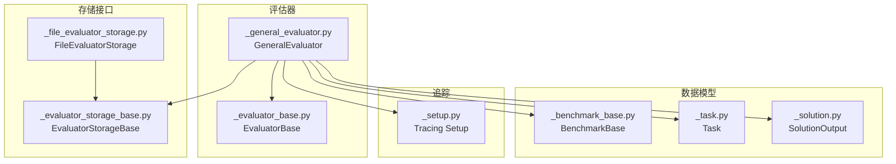
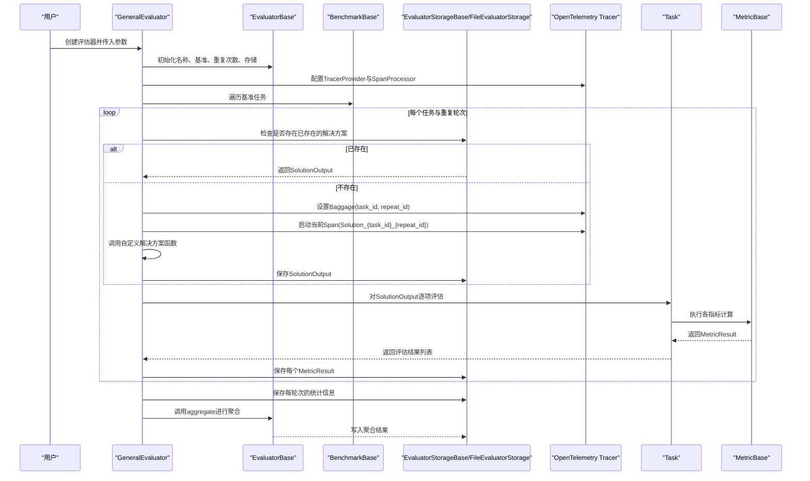
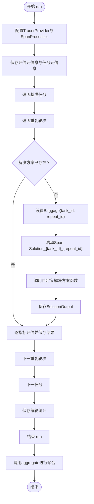
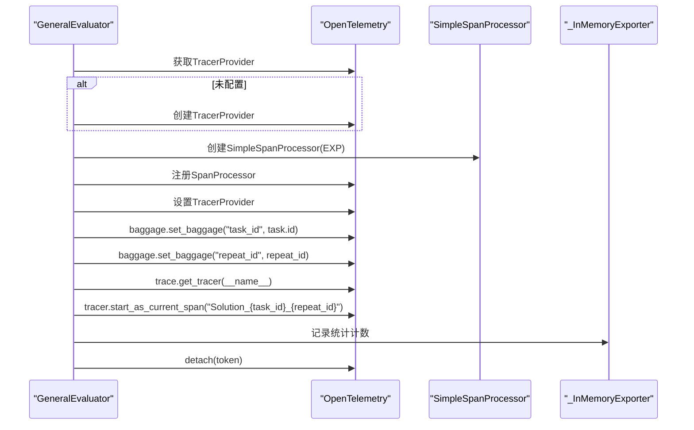
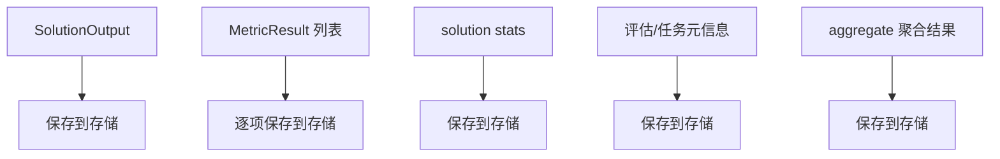
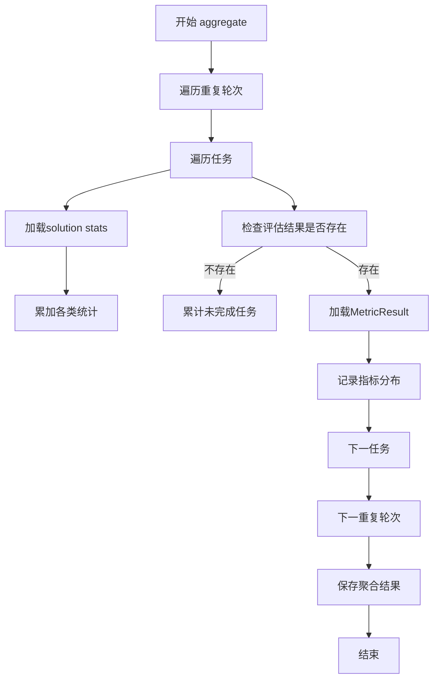
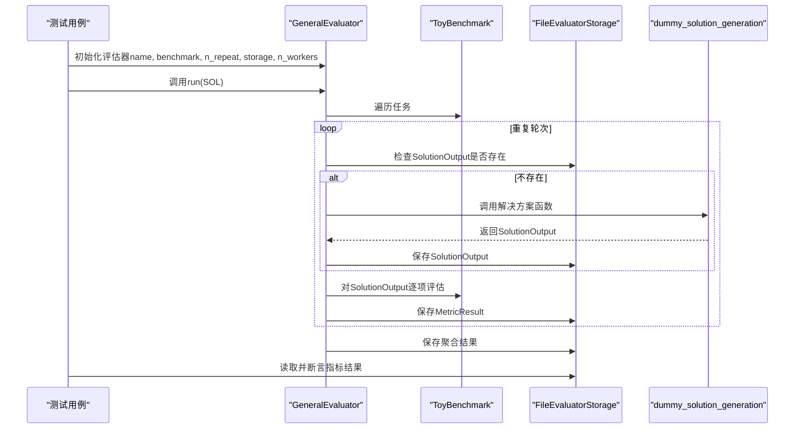
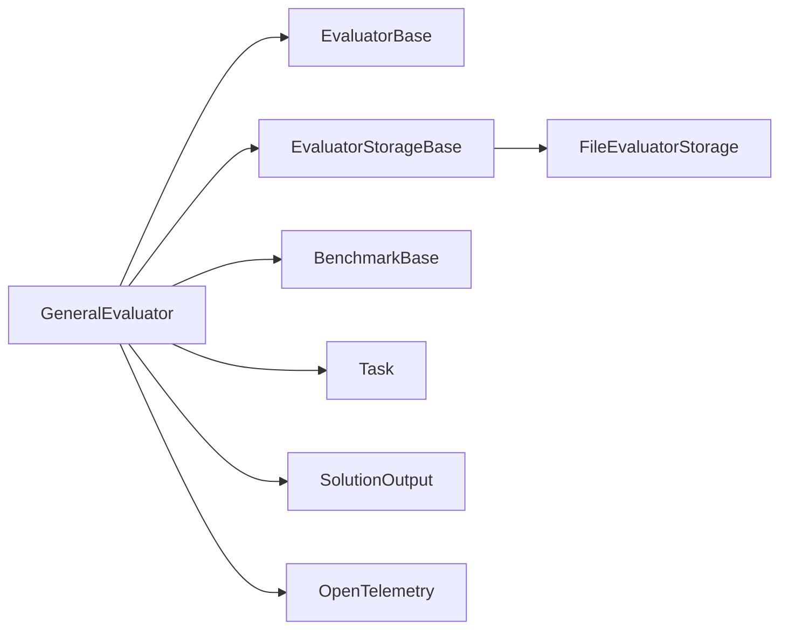

# 通用评估器

<cite>
**本文引用的文件列表**
- [src/agentscope/evaluate/_evaluator/_general_evaluator.py](file://src/agentscope/evaluate/_evaluator/_general_evaluator.py)
- [src/agentscope/evaluate/_evaluator/_evaluator_base.py](file://src/agentscope/evaluate/_evaluator/_evaluator_base.py)
- [src/agentscope/evaluate/_evaluator_storage/_evaluator_storage_base.py](file://src/agentscope/evaluate/_evaluator_storage/_evaluator_storage_base.py)
- [src/agentscope/evaluate/_evaluator_storage/_file_evaluator_storage.py](file://src/agentscope/evaluate/_evaluator_storage/_file_evaluator_storage.py)
- [src/agentscope/evaluate/_benchmark_base.py](file://src/agentscope/evaluate/_benchmark_base.py)
- [src/agentscope/evaluate/_task.py](file://src/agentscope/evaluate/_task.py)
- [src/agentscope/evaluate/_solution.py](file://src/agentscope/evaluate/_solution.py)
- [src/agentscope/tracing/_setup.py](file://src/agentscope/tracing/_setup.py)
- [tests/evaluation_test.py](file://tests/evaluation_test.py)
- [docs/tutorial/en/src/task_eval.py](file://docs/tutorial/en/src/task_eval.py)
- [docs/tutorial/zh_CN/src/task_eval.py](file://docs/tutorial/zh_CN/src/task_eval.py)
</cite>

## 目录
1. [简介](#简介)
2. [项目结构](#项目结构)
3. [核心组件](#核心组件)
4. [架构总览](#架构总览)
5. [详细组件分析](#详细组件分析)
6. [依赖关系分析](#依赖关系分析)
7. [性能考量](#性能考量)
8. [故障排查指南](#故障排查指南)
9. [结论](#结论)
10. [附录](#附录)

## 简介
本文件面向开发者与研究者，系统性阐述通用评估器（GeneralEvaluator）在 AgentScope 评估框架中的定位、职责与实现细节。重点覆盖：
- 初始化参数的约束与语义：名称、基准实例、重复次数、存储后端、工作线程数
- 异步评估执行流程：解决方案运行、OpenTelemetry 追踪上下文激活、行李袋（baggage）传递、跨度（span）创建
- 评估结果持久化策略：通过存储接口保存解决方案输出、评估指标与性能统计
- 聚合阶段的执行时机与目的
- 自定义解决方案函数的编写规范：异步调用签名与返回类型要求
- 结合测试用例与教程，给出端到端评估流程验证方法

## 项目结构
通用评估器位于评估模块的“评估器”子模块中，围绕任务（Task）、基准（BenchmarkBase）、指标（MetricBase）与存储（EvaluatorStorageBase）等核心抽象构建。文件组织遵循“按功能域分层”的设计原则，便于扩展与维护。

图表来源
- [src/agentscope/evaluate/_evaluator/_general_evaluator.py](file://src/agentscope/evaluate/_evaluator/_general_evaluator.py#L1-L179)
- [src/agentscope/evaluate/_evaluator/_evaluator_base.py](file://src/agentscope/evaluate/_evaluator/_evaluator_base.py#L1-L305)
- [src/agentscope/evaluate/_evaluator_storage/_evaluator_storage_base.py](file://src/agentscope/evaluate/_evaluator_storage/_evaluator_storage_base.py#L1-L255)
- [src/agentscope/evaluate/_evaluator_storage/_file_evaluator_storage.py](file://src/agentscope/evaluate/_evaluator_storage/_file_evaluator_storage.py#L1-L461)
- [src/agentscope/evaluate/_benchmark_base.py](file://src/agentscope/evaluate/_benchmark_base.py#L1-L44)
- [src/agentscope/evaluate/_task.py](file://src/agentscope/evaluate/_task.py#L1-L54)
- [src/agentscope/evaluate/_solution.py](file://src/agentscope/evaluate/_solution.py#L1-L37)
- [src/agentscope/tracing/_setup.py](file://src/agentscope/tracing/_setup.py#L1-L50)

章节来源
- [src/agentscope/evaluate/_evaluator/_general_evaluator.py](file://src/agentscope/evaluate/_evaluator/_general_evaluator.py#L1-L179)
- [src/agentscope/evaluate/_evaluator/_evaluator_base.py](file://src/agentscope/evaluate/_evaluator/_evaluator_base.py#L1-L305)

## 核心组件
- 通用评估器（GeneralEvaluator）
  - 继承自 EvaluatorBase，负责在本地同步执行评估，便于调试与快速迭代
  - 提供 run_solution、run_evaluation、run 等关键方法，串联“解决方案运行—评估—持久化—聚合”的完整链路
- 评估器基类（EvaluatorBase）
  - 定义统一的评估生命周期：保存元信息、遍历任务与重复、调用具体评估器实现的 run 方法、聚合结果
- 存储接口（EvaluatorStorageBase）与文件存储（FileEvaluatorStorage）
  - 抽象了解决方案输出、评估结果、统计信息、元信息的读写与存在性检查
  - 文件存储实现以目录结构组织数据，支持断点续跑与结果回溯
- 基准与任务（BenchmarkBase、Task）
  - 基准提供可迭代的任务集合；任务包含输入、期望输出、指标列表等
- 解决方案输出（SolutionOutput）
  - 封装一次求解的结果：成功标志、最终输出、轨迹与附加元数据
- 追踪（Tracing）
  - 通过 OpenTelemetry 提供跨组件的追踪能力，支持在评估期间记录上下文与统计

章节来源
- [src/agentscope/evaluate/_evaluator/_general_evaluator.py](file://src/agentscope/evaluate/_evaluator/_general_evaluator.py#L1-L179)
- [src/agentscope/evaluate/_evaluator/_evaluator_base.py](file://src/agentscope/evaluate/_evaluator/_evaluator_base.py#L1-L305)
- [src/agentscope/evaluate/_evaluator_storage/_evaluator_storage_base.py](file://src/agentscope/evaluate/_evaluator_storage/_evaluator_storage_base.py#L1-L255)
- [src/agentscope/evaluate/_evaluator_storage/_file_evaluator_storage.py](file://src/agentscope/evaluate/_evaluator_storage/_file_evaluator_storage.py#L1-L461)
- [src/agentscope/evaluate/_benchmark_base.py](file://src/agentscope/evaluate/_benchmark_base.py#L1-L44)
- [src/agentscope/evaluate/_task.py](file://src/agentscope/evaluate/_task.py#L1-L54)
- [src/agentscope/evaluate/_solution.py](file://src/agentscope/evaluate/_solution.py#L1-L37)
- [src/agentscope/tracing/_setup.py](file://src/agentscope/tracing/_setup.py#L1-L50)

## 架构总览
下图展示了通用评估器在评估流水线中的角色与交互关系。

图表来源
- [src/agentscope/evaluate/_evaluator/_general_evaluator.py](file://src/agentscope/evaluate/_evaluator/_general_evaluator.py#L124-L179)
- [src/agentscope/evaluate/_evaluator/_evaluator_base.py](file://src/agentscope/evaluate/_evaluator/_evaluator_base.py#L96-L305)
- [src/agentscope/evaluate/_evaluator_storage/_file_evaluator_storage.py](file://src/agentscope/evaluate/_evaluator_storage/_file_evaluator_storage.py#L1-L461)
- [src/agentscope/evaluate/_task.py](file://src/agentscope/evaluate/_task.py#L38-L54)

## 详细组件分析

### 初始化参数与约束
- 名称（name: str）
  - 用于标识本次评估会话，便于后续检索与报告
- 基准（benchmark: BenchmarkBase）
  - 必须是基准实例，提供可迭代的任务集合
- 重复次数（n_repeat: int）
  - 至少为 1；用于对同一任务进行多次独立评估，提升统计稳健性
- 存储后端（storage: EvaluatorStorageBase）
  - 必须实现存储接口，支持保存/读取解决方案、评估结果、统计与元信息
- 工作线程数（n_workers: int）
  - 通用评估器当前为本地同步执行，该参数在通用评估器中不直接参与并发调度，但保留于构造签名以保持与分布式评估器的一致性

约束与语义要点
- 参数校验：n_repeat ≥ 1、n_workers ≥ 1
- 类型约束：benchmark 必须继承自基准基类
- 可扩展性：通过存储接口抽象，可替换为内存、数据库或文件等多种实现

章节来源
- [src/agentscope/evaluate/_evaluator/_general_evaluator.py](file://src/agentscope/evaluate/_evaluator/_general_evaluator.py#L17-L42)
- [src/agentscope/evaluate/_evaluator/_evaluator_base.py](file://src/agentscope/evaluate/_evaluator/_evaluator_base.py#L21-L47)

### 异步评估执行流程
- run_solution
  - 先检查存储中是否已有该任务与重复轮次的解决方案
  - 若无，则设置 OpenTelemetry 上下文（baggage），启动一个名为 “Solution_{task_id}_{repeat_id}” 的 Span
  - 调用自定义解决方案函数，传入 Task 与预打印钩子（pre-print hook），并将结果保存至存储
- run_evaluation
  - 对单个解决方案输出调用 Task 的 evaluate，得到指标结果列表，并逐条保存
- run
  - 配置 OpenTelemetry TracerProvider 与 SimpleSpanProcessor（内存导出器），保存评估元信息与任务元信息
  - 遍历基准任务与重复轮次，依次执行 run_solution，并在每轮结束后保存统计信息
  - 最终调用 EvaluatorBase.aggregate 进行聚合

图表来源
- [src/agentscope/evaluate/_evaluator/_general_evaluator.py](file://src/agentscope/evaluate/_evaluator/_general_evaluator.py#L124-L179)
- [src/agentscope/evaluate/_evaluator/_evaluator_base.py](file://src/agentscope/evaluate/_evaluator/_evaluator_base.py#L65-L95)

章节来源
- [src/agentscope/evaluate/_evaluator/_general_evaluator.py](file://src/agentscope/evaluate/_evaluator/_general_evaluator.py#L59-L123)
- [src/agentscope/evaluate/_evaluator/_general_evaluator.py](file://src/agentscope/evaluate/_evaluator/_general_evaluator.py#L124-L179)

### OpenTelemetry 追踪上下文、Baggage 与 Span
- Baggage 传递
  - 在 run_solution 中，将 task_id 与 repeat_id 放入 baggage，确保后续组件可访问这些上下文键
- Span 创建
  - 以 “Solution_{task_id}_{repeat_id}” 作为 Span 名称，包裹解决方案执行过程
- TracerProvider 配置
  - run 中创建 SimpleSpanProcessor 并注册到全局 TracerProvider，用于收集本次评估期间的跨度数据
- 追踪导出
  - 通用评估器使用内存导出器（_InMemoryExporter）收集统计计数，随后保存到存储中

图表来源
- [src/agentscope/evaluate/_evaluator/_general_evaluator.py](file://src/agentscope/evaluate/_evaluator/_general_evaluator.py#L141-L179)
- [src/agentscope/evaluate/_evaluator/_general_evaluator.py](file://src/agentscope/evaluate/_evaluator/_general_evaluator.py#L74-L110)

章节来源
- [src/agentscope/evaluate/_evaluator/_general_evaluator.py](file://src/agentscope/evaluate/_evaluator/_general_evaluator.py#L74-L110)
- [src/agentscope/evaluate/_evaluator/_general_evaluator.py](file://src/agentscope/evaluate/_evaluator/_general_evaluator.py#L141-L179)

### 评估结果持久化策略
- 解决方案输出（SolutionOutput）
  - 由 run_solution 保存；若存储中已存在则直接复用
- 评估指标结果（MetricResult）
  - 由 run_evaluation 逐项保存；每个指标对应一个独立文件
- 统计信息（solution stats）
  - 由 run 在每轮结束后保存；用于后续聚合阶段
- 元信息与聚合结果
  - 评估元信息与任务元信息在 run 开始时保存
  - 聚合结果在 aggregate 阶段生成并保存

图表来源
- [src/agentscope/evaluate/_evaluator/_general_evaluator.py](file://src/agentscope/evaluate/_evaluator/_general_evaluator.py#L124-L179)
- [src/agentscope/evaluate/_evaluator/_evaluator_base.py](file://src/agentscope/evaluate/_evaluator/_evaluator_base.py#L65-L95)
- [src/agentscope/evaluate/_evaluator_storage/_file_evaluator_storage.py](file://src/agentscope/evaluate/_evaluator_storage/_file_evaluator_storage.py#L72-L124)
- [src/agentscope/evaluate/_evaluator_storage/_file_evaluator_storage.py](file://src/agentscope/evaluate/_evaluator_storage/_file_evaluator_storage.py#L125-L157)
- [src/agentscope/evaluate/_evaluator_storage/_file_evaluator_storage.py](file://src/agentscope/evaluate/_evaluator_storage/_file_evaluator_storage.py#L330-L356)
- [src/agentscope/evaluate/_evaluator_storage/_file_evaluator_storage.py](file://src/agentscope/evaluate/_evaluator_storage/_file_evaluator_storage.py#L258-L276)

章节来源
- [src/agentscope/evaluate/_evaluator_storage/_evaluator_storage_base.py](file://src/agentscope/evaluate/_evaluator_storage/_evaluator_storage_base.py#L1-L255)
- [src/agentscope/evaluate/_evaluator_storage/_file_evaluator_storage.py](file://src/agentscope/evaluate/_evaluator_storage/_file_evaluator_storage.py#L1-L461)

### 聚合阶段（aggregate）
- 执行时机
  - run 的最后一步调用 EvaluatorBase.aggregate
- 目的
  - 基于存储中的统计与评估结果，计算每轮次的完成/未完成任务数量、指标分布与聚合值（如均值、最大/最小）
  - 汇总 LLM 使用量、工具调用次数、嵌入调用次数与聊天用量等总体统计
  - 将聚合结果写入存储，便于后续报告与可视化

图表来源
- [src/agentscope/evaluate/_evaluator/_evaluator_base.py](file://src/agentscope/evaluate/_evaluator/_evaluator_base.py#L96-L305)

章节来源
- [src/agentscope/evaluate/_evaluator/_evaluator_base.py](file://src/agentscope/evaluate/_evaluator/_evaluator_base.py#L96-L305)

### 自定义解决方案函数编写规范
- 函数签名
  - 接收两个参数：Task 与 Callable（预打印钩子）
  - 返回类型：SolutionOutput
  - 异步：函数本身为异步，返回协程
- 返回类型要求
  - 必须返回 SolutionOutput 实例，包含 success、output、trajectory、meta 等字段
- 预打印钩子
  - 通过 storage.get_agent_pre_print_hook(task_id, repeat_id) 获取
  - 用于在评估过程中记录代理打印内容，便于审计与复现

章节来源
- [src/agentscope/evaluate/_evaluator/_general_evaluator.py](file://src/agentscope/evaluate/_evaluator/_general_evaluator.py#L95-L107)
- [src/agentscope/evaluate/_evaluator_storage/_evaluator_storage_base.py](file://src/agentscope/evaluate/_evaluator_storage/_evaluator_storage_base.py#L233-L255)
- [src/agentscope/evaluate/_solution.py](file://src/agentscope/evaluate/_solution.py#L16-L37)

### 端到端评估流程验证（基于测试与教程）
- 测试用例（tests/evaluation_test.py）
  - 构造 ToyBenchmark，包含两条数学问题任务
  - 定义 CheckEqual 指标，判断答案是否等于期望值
  - 使用 dummy_solution_generation 生成 SolutionOutput
  - 调用 GeneralEvaluator.run，执行评估并断言指标结果
- 教程示例（docs/tutorial）
  - 展示如何创建 GeneralEvaluator、配置 FileEvaluatorStorage、调用 run 并传入自定义解决方案函数

图表来源
- [tests/evaluation_test.py](file://tests/evaluation_test.py#L176-L241)
- [tests/evaluation_test.py](file://tests/evaluation_test.py#L243-L274)
- [docs/tutorial/en/src/task_eval.py](file://docs/tutorial/en/src/task_eval.py#L239-L255)
- [docs/tutorial/zh_CN/src/task_eval.py](file://docs/tutorial/zh_CN/src/task_eval.py#L238-L255)

章节来源
- [tests/evaluation_test.py](file://tests/evaluation_test.py#L176-L241)
- [tests/evaluation_test.py](file://tests/evaluation_test.py#L243-L274)
- [docs/tutorial/en/src/task_eval.py](file://docs/tutorial/en/src/task_eval.py#L239-L255)
- [docs/tutorial/zh_CN/src/task_eval.py](file://docs/tutorial/zh_CN/src/task_eval.py#L238-L255)

## 依赖关系分析
- 组件耦合
  - GeneralEvaluator 依赖 EvaluatorBase（生命周期管理）、EvaluatorStorageBase（持久化）、BenchmarkBase（任务源）、Task（评估对象）、SolutionOutput（结果载体）
- 外部依赖
  - OpenTelemetry 用于追踪上下文与统计采集
  - 文件存储实现依赖 JSON 序列化与目录结构约定
- 循环依赖
  - 未发现循环导入；模块间通过接口与数据类解耦

图表来源
- [src/agentscope/evaluate/_evaluator/_general_evaluator.py](file://src/agentscope/evaluate/_evaluator/_general_evaluator.py#L1-L179)
- [src/agentscope/evaluate/_evaluator/_evaluator_base.py](file://src/agentscope/evaluate/_evaluator/_evaluator_base.py#L1-L305)
- [src/agentscope/evaluate/_evaluator_storage/_evaluator_storage_base.py](file://src/agentscope/evaluate/_evaluator_storage/_evaluator_storage_base.py#L1-L255)
- [src/agentscope/evaluate/_evaluator_storage/_file_evaluator_storage.py](file://src/agentscope/evaluate/_evaluator_storage/_file_evaluator_storage.py#L1-L461)
- [src/agentscope/evaluate/_benchmark_base.py](file://src/agentscope/evaluate/_benchmark_base.py#L1-L44)
- [src/agentscope/evaluate/_task.py](file://src/agentscope/evaluate/_task.py#L1-L54)
- [src/agentscope/evaluate/_solution.py](file://src/agentscope/evaluate/_solution.py#L1-L37)

章节来源
- [src/agentscope/evaluate/_evaluator/_general_evaluator.py](file://src/agentscope/evaluate/_evaluator/_general_evaluator.py#L1-L179)
- [src/agentscope/evaluate/_evaluator/_evaluator_base.py](file://src/agentscope/evaluate/_evaluator/_evaluator_base.py#L1-L305)

## 性能考量
- 本地同步执行
  - 通用评估器采用本地同步执行，避免分布式开销，适合调试与小规模评估
- 统计采集
  - 通过内存导出器收集统计计数，减少外部依赖；大规模评估建议切换到更高效的导出器
- I/O 优化
  - 文件存储采用 JSON 序列化，建议在高并发场景下考虑批量写入与缓存策略
- 指标计算
  - 聚合阶段对每轮次与每个指标进行遍历汇总，复杂度与任务数、指标数成正比

## 故障排查指南
- 解决方案输出缺失
  - 检查 storage.solution_result_exists 与 get_solution_result 的实现与路径
- 评估结果缺失
  - 检查 evaluation_result_exists 与 get_evaluation_result 的实现与文件命名
- 追踪未生效
  - 确认 TracerProvider 是否正确配置，SpanProcessor 是否注册
- 聚合结果为空
  - 检查 aggregate 阶段是否被调用，以及存储中是否存在统计与评估结果

章节来源
- [src/agentscope/evaluate/_evaluator_storage/_file_evaluator_storage.py](file://src/agentscope/evaluate/_evaluator_storage/_file_evaluator_storage.py#L125-L157)
- [src/agentscope/evaluate/_evaluator_storage/_file_evaluator_storage.py](file://src/agentscope/evaluate/_evaluator_storage/_file_evaluator_storage.py#L158-L205)
- [src/agentscope/evaluate/_evaluator_storage/_file_evaluator_storage.py](file://src/agentscope/evaluate/_evaluator_storage/_file_evaluator_storage.py#L206-L257)
- [src/agentscope/evaluate/_evaluator/_general_evaluator.py](file://src/agentscope/evaluate/_evaluator/_general_evaluator.py#L141-L179)
- [src/agentscope/evaluate/_evaluator/_evaluator_base.py](file://src/agentscope/evaluate/_evaluator/_evaluator_base.py#L96-L305)

## 结论
通用评估器以简洁的接口与清晰的生命周期，提供了在本地调试与快速迭代场景下的高效评估能力。通过 OpenTelemetry 的上下文与统计采集、完善的存储接口与聚合逻辑，它能够稳定地支撑从单机到小规模集群的评估需求。对于需要更高吞吐与更强容错的场景，可参考分布式评估器的实现思路进行扩展。

## 附录
- 关键接口与数据结构
  - 评估器：EvaluatorBase、GeneralEvaluator
  - 存储接口：EvaluatorStorageBase、FileEvaluatorStorage
  - 数据模型：BenchmarkBase、Task、SolutionOutput
  - 追踪：Tracing Setup

章节来源
- [src/agentscope/evaluate/_evaluator/_evaluator_base.py](file://src/agentscope/evaluate/_evaluator/_evaluator_base.py#L1-L305)
- [src/agentscope/evaluate/_evaluator/_general_evaluator.py](file://src/agentscope/evaluate/_evaluator/_general_evaluator.py#L1-L179)
- [src/agentscope/evaluate/_evaluator_storage/_evaluator_storage_base.py](file://src/agentscope/evaluate/_evaluator_storage/_evaluator_storage_base.py#L1-L255)
- [src/agentscope/evaluate/_evaluator_storage/_file_evaluator_storage.py](file://src/agentscope/evaluate/_evaluator_storage/_file_evaluator_storage.py#L1-L461)
- [src/agentscope/evaluate/_benchmark_base.py](file://src/agentscope/evaluate/_benchmark_base.py#L1-L44)
- [src/agentscope/evaluate/_task.py](file://src/agentscope/evaluate/_task.py#L1-L54)
- [src/agentscope/evaluate/_solution.py](file://src/agentscope/evaluate/_solution.py#L1-L37)
- [src/agentscope/tracing/_setup.py](file://src/agentscope/tracing/_setup.py#L1-L50)