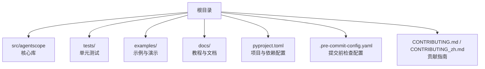
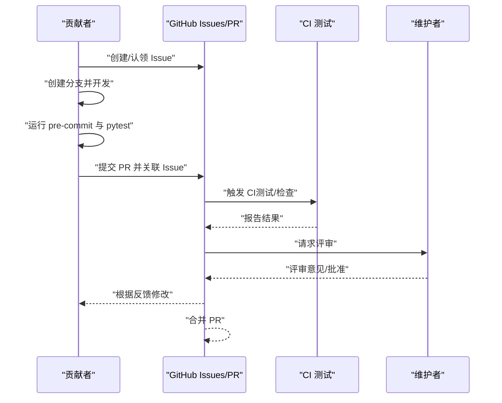
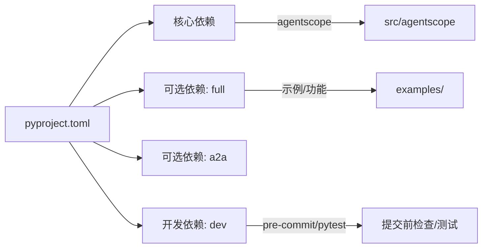

# 贡献指南

<cite>
**本文引用的文件**
- [CONTRIBUTING.md](file://CONTRIBUTING.md)
- [CONTRIBUTING_zh.md](file://CONTRIBUTING_zh.md)
- [README.md](file://README.md)
- [README_zh.md](file://README_zh.md)
- [pyproject.toml](file://pyproject.toml)
- [.pre-commit-config.yaml](file://.pre-commit-config.yaml)
- [react_agent_test.py](file://tests/react_agent_test.py)
- [tool_test.py](file://tests/tool_test.py)
- [model_openai_test.py](file://tests/model_openai_test.py)
</cite>

## 目录
1. [简介](#简介)
2. [项目结构](#项目结构)
3. [核心组件](#核心组件)
4. [架构总览](#架构总览)
5. [详细组件分析](#详细组件分析)
6. [依赖关系分析](#依赖关系分析)
7. [性能考虑](#性能考虑)
8. [故障排查指南](#故障排查指南)
9. [结论](#结论)
10. [附录](#附录)

## 简介
本指南面向所有希望为 AgentScope 做贡献的开发者，覆盖开发流程、分支策略、提交规范、代码审查流程、环境搭建、代码风格与格式化、测试要求与覆盖率标准、新功能开发与 Bug 修复流程，以及文档更新规范与示例。我们力求对首次贡献者友好，同时为资深贡献者提供效率提示。

## 项目结构
AgentScope 采用模块化设计，核心代码位于 src/agentscope 下，测试用例集中在 tests/，文档与教程位于 docs/，示例位于 examples/。根目录提供贡献指南、安装与开发依赖配置文件。

图表来源
- [pyproject.toml](file://pyproject.toml#L1-L108)
- [.pre-commit-config.yaml](file://.pre-commit-config.yaml#L1-L108)
- [CONTRIBUTING.md](file://CONTRIBUTING.md#L1-L246)
- [CONTRIBUTING_zh.md](file://CONTRIBUTING_zh.md#L1-L241)

章节来源
- [pyproject.toml](file://pyproject.toml#L1-L108)
- [.pre-commit-config.yaml](file://.pre-commit-config.yaml#L1-L108)
- [README.md](file://README.md#L158-L200)
- [README_zh.md](file://README_zh.md#L160-L201)

## 核心组件
- 分支策略
  - 主分支：main，用于稳定发布与合并经审查的 PR。
  - 功能分支：feature/* 或 feat/*，用于新功能开发；修复分支：fix/*，用于 Bug 修复；文档分支：docs/*。
  - 合并策略：建议使用 squash 合并以保持提交历史整洁；大改动请拆分为多个小 PR 以便评审。
- 提交规范
  - 遵循 Conventional Commits，类型包括 feat、fix、docs、style、refactor、perf、ci、chore 等。
  - 示例参考贡献指南中的格式与示例。
- 代码审查流程
  - 在 GitHub 上创建 Pull Request，关联相关 Issue。
  - 至少一名维护者审查并通过 CI；必要时进行讨论与修改。
  - 合并前确保通过所有检查（提交前检查、单元测试、文档更新）。

章节来源
- [CONTRIBUTING.md](file://CONTRIBUTING.md#L28-L56)
- [CONTRIBUTING_zh.md](file://CONTRIBUTING_zh.md#L27-L54)
- [README.md](file://README.md#L416-L420)
- [README_zh.md](file://README_zh.md#L419-L422)

## 架构总览
AgentScope 的开发流程围绕“问题驱动—PR—CI—评审—合并—发布”闭环展开。贡献者首先在 Issues 中沟通需求，随后在本地分支开发并通过提交前检查与测试，提交 PR 后由维护者评审与 CI 验证，最终合并至主分支。

图表来源
- [CONTRIBUTING.md](file://CONTRIBUTING.md#L12-L27)
- [CONTRIBUTING.md](file://CONTRIBUTING.md#L57-L104)
- [CONTRIBUTING_zh.md](file://CONTRIBUTING_zh.md#L12-L26)
- [CONTRIBUTING_zh.md](file://CONTRIBUTING_zh.md#L55-L103)

## 详细组件分析

### 环境设置与安装
- Python 版本要求：3.10 及以上。
- 推荐安装方式：
  - 从源码安装（可编辑模式）
  - 使用 uv（更快的安装器）
  - 从 PyPI 安装
- 开发依赖
  - dev 依赖包含 full 与 a2a 依赖，以及 pre-commit、pytest、文档构建工具等。
- 一键安装与验证
  - 安装后可运行示例脚本或单元测试验证环境。

章节来源
- [README.md](file://README.md#L160-L200)
- [README_zh.md](file://README_zh.md#L160-L201)
- [pyproject.toml](file://pyproject.toml#L44-L89)

### 提交前检查（Pre-commit）
- 安装与启用
  - 安装 pre-commit 并在仓库中安装钩子，之后每次提交将自动运行。
- 默认检查项
  - AST/JSON/YAML/TOML/文档头校验、私钥检测、空白字符清理、尾随逗号、类型检查（mypy）、代码风格（black）、静态分析（flake8、pylint）、包质量（pyroma）。
- 常见问题
  - 若本地未安装依赖导致检查失败，按提示安装相应工具或使用 dev 依赖集合。
  - 针对特定文件/路径可临时排除，但建议尽量通过修复消除。

章节来源
- [CONTRIBUTING.md](file://CONTRIBUTING.md#L57-L76)
- [CONTRIBUTING_zh.md](file://CONTRIBUTING_zh.md#L55-L74)
- [.pre-commit-config.yaml](file://.pre-commit-config.yaml#L1-L108)

### 代码风格与格式化
- 代码风格
  - 使用 black（行宽 79）统一格式；flake8 与 pylint 作为补充静态检查。
  - mypy 用于类型检查，忽略部分路径与错误类型以平衡项目现状。
- 导入与懒加载
  - 遵循“按需导入”原则，避免在模块顶层导入重型依赖，保证 import agentscope 的轻量性。
- 文档与注释
  - 保持 docstring 规范，必要时在 PR 中补充使用示例与变更说明。

章节来源
- [.pre-commit-config.yaml](file://.pre-commit-config.yaml#L51-L62)
- [.pre-commit-config.yaml](file://.pre-commit-config.yaml#L23-L47)
- [CONTRIBUTING.md](file://CONTRIBUTING.md#L77-L87)
- [CONTRIBUTING_zh.md](file://CONTRIBUTING_zh.md#L75-L87)

### 测试要求与覆盖率
- 单元测试
  - 新功能必须配套单元测试；在提交 PR 前确保所有测试通过。
  - 使用 pytest 运行 tests/ 目录下的测试。
- 测试示例参考
  - ReActAgent 测试：验证钩子注册与调用、结构化输出与工具调用路径。
  - 工具模块测试：覆盖 Python 代码执行、Shell 命令执行、文本文件读写与插入等。
  - OpenAI 模型测试：覆盖初始化参数、常规调用、工具集成、推理努力、结构化输出、流式响应等。
- 覆盖率
  - 贡献指南未明确指定覆盖率阈值；建议在新增功能时尽量覆盖关键分支与异常路径，保持整体覆盖率稳步提升。

章节来源
- [CONTRIBUTING.md](file://CONTRIBUTING.md#L90-L104)
- [CONTRIBUTING_zh.md](file://CONTRIBUTING_zh.md#L88-L103)
- [react_agent_test.py](file://tests/react_agent_test.py#L1-L192)
- [tool_test.py](file://tests/tool_test.py#L1-L351)
- [model_openai_test.py](file://tests/model_openai_test.py#L1-L389)

### 新功能开发流程
- 问题与规划
  - 在 Issues 中描述需求与预期行为；若已有相关任务，可认领并留言沟通。
- 示例先行
  - 在 examples/ 下先实现原型，验证可行性后再抽象为核心模块。
- 核心集成
  - 将示例中的通用能力抽取到 src/agentscope 对应模块，确保模块化、可组合与可插拔。
- 文档与示例
  - 更新教程与示例，补充 README 与 API 文档链接。
- 测试与提交
  - 补充单元测试；运行 pre-commit 与 pytest；提交 PR 并关联 Issue。

章节来源
- [CONTRIBUTING.md](file://CONTRIBUTING.md#L168-L211)
- [CONTRIBUTING_zh.md](file://CONTRIBUTING_zh.md#L163-L205)
- [README.md](file://README.md#L351-L415)
- [README_zh.md](file://README_zh.md#L354-L418)

### Bug 修复流程
- 重现与定位
  - 在 tests/ 中新增或完善测试用例以复现问题。
- 修复与验证
  - 提供最小可复现的测试用例；修复后确保原有测试不回退。
- 文档与注释
  - 在 PR 描述中说明问题背景、修复方案与验证方法。
- 合并与跟进
  - 通过评审与 CI 后合并；如需回归测试，可在后续版本中补充。

章节来源
- [CONTRIBUTING.md](file://CONTRIBUTING.md#L90-L104)
- [CONTRIBUTING_zh.md](file://CONTRIBUTING_zh.md#L88-L103)

### 文档更新规范与示例
- 更新范围
  - 新功能或变更影响用户行为时，需更新 README 与教程文档。
- 示例补充
  - 在 examples/ 下新增或完善示例，配套 README 说明用途与用法。
- 链接与导航
  - 在 README 中补充相关教程与 API 文档链接，便于读者查阅。

章节来源
- [CONTRIBUTING.md](file://CONTRIBUTING.md#L99-L104)
- [CONTRIBUTING_zh.md](file://CONTRIBUTING_zh.md#L98-L102)
- [README.md](file://README.md#L351-L415)
- [README_zh.md](file://README_zh.md#L354-L418)

## 依赖关系分析
- 核心依赖
  - 包含异步工具、主流模型 SDK、MCP、OpenTelemetry、音频与数据处理等。
- 可选依赖
  - full：模型生态、评估、长期记忆、RAG、Milvus Lite 等；a2a：A2A 协议支持。
- 开发依赖
  - dev：包含 full 与 a2a，以及 pre-commit、pytest、文档构建工具等。

图表来源
- [pyproject.toml](file://pyproject.toml#L22-L89)

章节来源
- [pyproject.toml](file://pyproject.toml#L22-L89)

## 性能考虑
- 懒加载导入
  - 避免在模块顶层导入重型依赖，减少 import agentscope 的开销。
- 异步执行
  - 核心模块广泛支持异步调用与工具并行，建议在新功能中延续异步设计。
- 流式与非流式
  - 根据场景选择合适的返回模式；流式适合长文本与实时交互。
- 资源管理
  - 注意外部 API 的速率限制与配额；在工具与模型层做好重试与降级策略。

章节来源
- [CONTRIBUTING.md](file://CONTRIBUTING.md#L77-L87)
- [CONTRIBUTING_zh.md](file://CONTRIBUTING_zh.md#L75-L87)

## 故障排查指南
- 提交前检查失败
  - 按 pre-commit 输出逐项修复；必要时使用 --all-files 全量运行定位问题。
- 测试失败
  - 使用 pytest tests 定位失败用例；结合测试日志与断言信息定位问题。
- 依赖冲突
  - 使用 dev 依赖集合安装完整开发环境；如遇版本冲突，参考 pyproject.toml 中的版本约束。
- 文档与示例
  - 更新 README 与教程链接；确保示例可运行并输出符合预期。

章节来源
- [CONTRIBUTING.md](file://CONTRIBUTING.md#L57-L76)
- [CONTRIBUTING_zh.md](file://CONTRIBUTING_zh.md#L55-L74)
- [pyproject.toml](file://pyproject.toml#L44-L89)

## 结论
本指南提供了从环境搭建到代码审查与发布的完整流程，强调了提交规范、提交前检查、单元测试与文档更新的重要性。建议贡献者遵循“小步快跑、先示例后核心”的原则，确保代码质量与可维护性。对于复杂改动，务必提前在 Issues 中沟通，以获得及时反馈与支持。

## 附录
- 常用命令
  - 安装（可编辑/uv/PyPI）
  - 运行测试：pytest tests
  - 提交前检查：pre-commit run --all-files
- 贡献入口
  - Issues：讨论需求与问题
  - PR：提交代码与文档更新
  - Discussions：交流与求助

章节来源
- [README.md](file://README.md#L160-L200)
- [README_zh.md](file://README_zh.md#L160-L201)
- [CONTRIBUTING.md](file://CONTRIBUTING.md#L28-L56)
- [CONTRIBUTING_zh.md](file://CONTRIBUTING_zh.md#L27-L54)