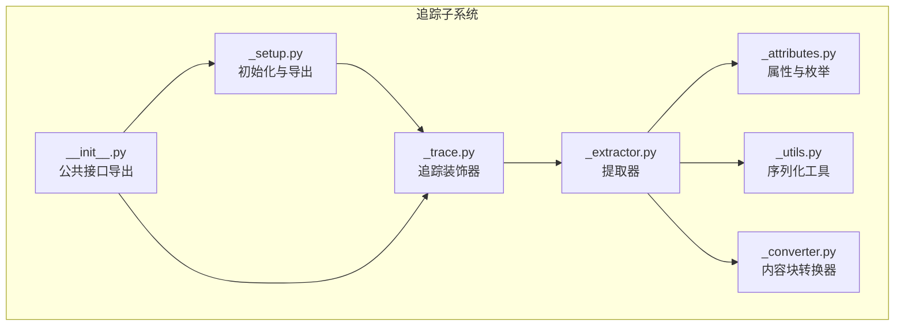
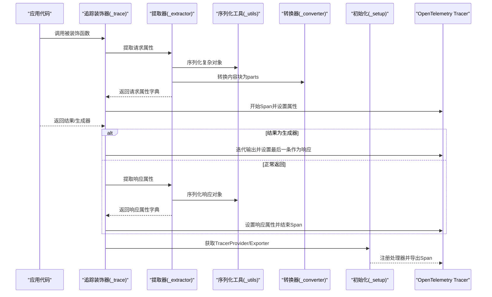
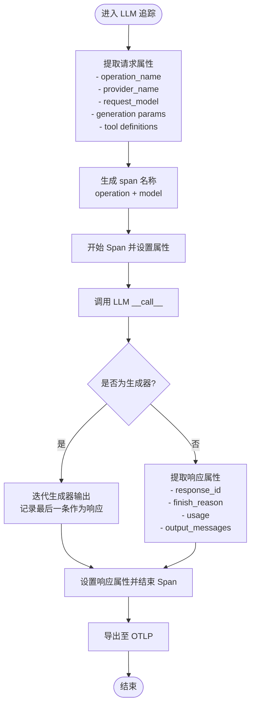
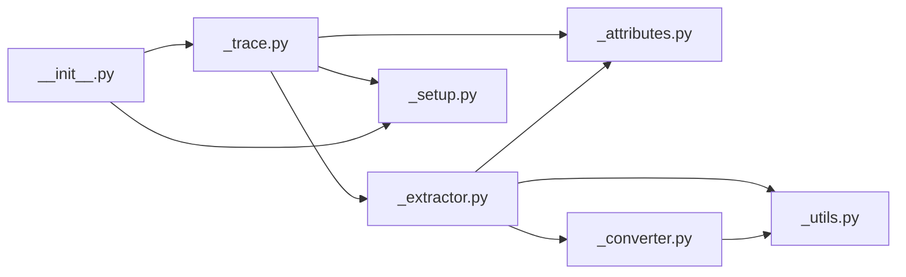

# 追踪数据分析

<cite>
**本文引用的文件列表**
- [src/agentscope/tracing/_attributes.py](file://src/agentscope/tracing/_attributes.py)
- [src/agentscope/tracing/_extractor.py](file://src/agentscope/tracing/_extractor.py)
- [src/agentscope/tracing/_trace.py](file://src/agentscope/tracing/_trace.py)
- [src/agentscope/tracing/_utils.py](file://src/agentscope/tracing/_utils.py)
- [src/agentscope/tracing/_converter.py](file://src/agentscope/tracing/_converter.py)
- [src/agentscope/tracing/_setup.py](file://src/agentscope/tracing/_setup.py)
- [src/agentscope/tracing/__init__.py](file://src/agentscope/tracing/__init__.py)
- [tests/tracing_test.py](file://tests/tracing_test.py)
- [tests/tracing_extractor_test.py](file://tests/tracing_extractor_test.py)
- [docs/tutorial/zh_CN/src/task_tracing.py](file://docs/tutorial/zh_CN/src/task_tracing.py)
</cite>

## 目录
1. [引言](#引言)
2. [项目结构](#项目结构)
3. [核心组件](#核心组件)
4. [架构总览](#架构总览)
5. [详细组件分析](#详细组件分析)
6. [依赖关系分析](#依赖关系分析)
7. [性能监控指标提取](#性能监控指标提取)
8. [可视化与关键路径分析](#可视化与关键路径分析)
9. [故障排查指南](#故障排查指南)
10. [结论](#结论)

## 引言
本文件面向追踪数据分析，系统性阐述 AgentScope 追踪子系统的数据结构设计、属性分类、操作名（operation_name）的定义与使用场景，并给出从追踪数据中提取性能监控指标（如延迟、错误率）的方法。同时，结合提取器能力，展示如何从追踪数据中抽取有价值的信息，辅助进行关键路径分析与性能瓶颈识别，并通过可视化示例帮助读者建立直观理解。

## 项目结构
追踪子系统位于 src/agentscope/tracing 目录，主要由以下模块组成：
- 属性与枚举：定义 Span 属性键、操作名值、提供商名值等
- 提取器：从具体组件（LLM、Agent、Tool、Formatter、Embedding、通用函数）提取请求/响应属性
- 装饰器：为不同组件提供统一的 OpenTelemetry 追踪入口
- 工具与转换器：序列化对象、转换内容块为标准部分格式
- 初始化与导出：配置 TracerProvider、OTLP 导出器，暴露公共 API

图表来源
- [src/agentscope/tracing/_attributes.py](file://src/agentscope/tracing/_attributes.py#L1-L184)
- [src/agentscope/tracing/_extractor.py](file://src/agentscope/tracing/_extractor.py#L1-L893)
- [src/agentscope/tracing/_trace.py](file://src/agentscope/tracing/_trace.py#L1-L649)
- [src/agentscope/tracing/_utils.py](file://src/agentscope/tracing/_utils.py#L1-L79)
- [src/agentscope/tracing/_converter.py](file://src/agentscope/tracing/_converter.py#L1-L126)
- [src/agentscope/tracing/_setup.py](file://src/agentscope/tracing/_setup.py#L1-L50)
- [src/agentscope/tracing/__init__.py](file://src/agentscope/tracing/__init__.py#L1-L23)

章节来源
- [src/agentscope/tracing/_attributes.py](file://src/agentscope/tracing/_attributes.py#L1-L184)
- [src/agentscope/tracing/_extractor.py](file://src/agentscope/tracing/_extractor.py#L1-L893)
- [src/agentscope/tracing/_trace.py](file://src/agentscope/tracing/_trace.py#L1-L649)
- [src/agentscope/tracing/_utils.py](file://src/agentscope/tracing/_utils.py#L1-L79)
- [src/agentscope/tracing/_converter.py](file://src/agentscope/tracing/_converter.py#L1-L126)
- [src/agentscope/tracing/_setup.py](file://src/agentscope/tracing/_setup.py#L1-L50)
- [src/agentscope/tracing/__init__.py](file://src/agentscope/tracing/__init__.py#L1-L23)

## 核心组件
- 属性与枚举（SpanAttributes、OperationNameValues、ProviderNameValues）
  - 定义 GenAI 规范中的请求/响应/用量/消息/代理/工具/嵌入等属性键
  - 定义 operation_name 值集合（format、invoke_generic_function、chat、invoke_agent、execute_tool、embeddings）
  - 定义提供商名值集合（dashscope、openai、anthropic、gemini、ollama、deepseek、moonshot、azure_ai_openai、aws_bedrock）
- 提取器（_extractor.py）
  - 为 LLM 请求/响应、Agent 请求/响应、Tool 请求/响应、Formatter 请求/响应、Embedding 请求/响应、通用函数请求/响应分别提供属性提取
  - 提供 span 名称生成逻辑
  - 提供内容块到 OpenTelemetry GenAI 部分格式的转换
- 追踪装饰器（_trace.py）
  - trace_llm、trace_reply、trace_format、trace_toolkit、trace_embedding、trace（通用）
  - 统一处理同步/异步、生成器/异步生成器、异常记录与状态设置
- 序列化工具（_utils.py）
  - 将复杂对象安全序列化为字符串，确保属性可写入 OpenTelemetry
- 转换器（_converter.py）
  - 将内部内容块转换为 OpenTelemetry GenAI 规范的 parts
- 初始化与导出（_setup.py、__init__.py）
  - 配置 TracerProvider、BatchSpanProcessor、OTLPSpanExporter
  - 暴露公共 API（setup_tracing、trace、trace_llm、trace_reply、trace_format、trace_toolkit、trace_embedding）

章节来源
- [src/agentscope/tracing/_attributes.py](file://src/agentscope/tracing/_attributes.py#L1-L184)
- [src/agentscope/tracing/_extractor.py](file://src/agentscope/tracing/_extractor.py#L1-L893)
- [src/agentscope/tracing/_trace.py](file://src/agentscope/tracing/_trace.py#L1-L649)
- [src/agentscope/tracing/_utils.py](file://src/agentscope/tracing/_utils.py#L1-L79)
- [src/agentscope/tracing/_converter.py](file://src/agentscope/tracing/_converter.py#L1-L126)
- [src/agentscope/tracing/_setup.py](file://src/agentscope/tracing/_setup.py#L1-L50)
- [src/agentscope/tracing/__init__.py](file://src/agentscope/tracing/__init__.py#L1-L23)

## 架构总览
下图展示了追踪数据从采集到导出的关键流程，以及各组件之间的依赖关系。

图表来源
- [src/agentscope/tracing/_trace.py](file://src/agentscope/tracing/_trace.py#L1-L649)
- [src/agentscope/tracing/_extractor.py](file://src/agentscope/tracing/_extractor.py#L1-L893)
- [src/agentscope/tracing/_utils.py](file://src/agentscope/tracing/_utils.py#L1-L79)
- [src/agentscope/tracing/_converter.py](file://src/agentscope/tracing/_converter.py#L1-L126)
- [src/agentscope/tracing/_setup.py](file://src/agentscope/tracing/_setup.py#L1-L50)

## 详细组件分析

### Span 属性结构设计与分类
- 通用属性（Conversation ID）
  - 作用：跨组件、跨调用关联同一运行会话
  - 键：GEN_AI_CONVERSATION_ID
  - 来源：提取器公共属性函数
- 请求属性（Request Attributes）
  - GenAI 请求属性：模型名、温度、top_p/top_k、最大 token、惩罚项、停止序列、种子等
  - Agent 请求属性：Agent ID、名称、描述、输入消息
  - Tool 请求属性：工具调用 ID、名称、参数、描述
  - Formatter 请求属性：目标提供商、函数输入
  - Embedding 请求属性：维度数等
- 响应属性（Response Attributes）
  - GenAI 响应属性：响应 ID、结束原因、用量（输入/输出 token）、输出消息
  - Agent/Tool/Formatter/Embedding 响应属性：输出消息/结果、函数输出
- 扩展属性（AgentScope 自定义）
  - agentscope.function.name、agentscope.function.input、agentscope.function.output、agentscope.format.target、agentscope.format.count、gen_ai.tool.call.arguments、gen_ai.tool.call.result、gen_ai.tool.definitions、gen_ai.embeddings.dimension.count

章节来源
- [src/agentscope/tracing/_extractor.py](file://src/agentscope/tracing/_extractor.py#L52-L893)
- [src/agentscope/tracing/_attributes.py](file://src/agentscope/tracing/_attributes.py#L1-L184)

### operation_name 的定义与使用场景
- 定义位置
  - OperationNameValues：包含 format、invoke_generic_function、chat、invoke_agent、execute_tool、embeddings 等
- 使用场景
  - LLM：chat
  - Agent：invoke_agent
  - Tool：execute_tool
  - Formatter：format
  - Embedding：embeddings
  - 通用函数：invoke_generic_function
- 用途
  - 作为 Span 的 operation_name 属性，便于按操作类型聚合与查询
  - 作为 span 名称的一部分，提升可读性

章节来源
- [src/agentscope/tracing/_attributes.py](file://src/agentscope/tracing/_attributes.py#L131-L152)
- [src/agentscope/tracing/_extractor.py](file://src/agentscope/tracing/_extractor.py#L270-L800)

### 提取器工作流（以 LLM 为例）
- 请求阶段
  - 从 ChatModelBase 实例与调用参数中提取 GenAI 请求属性
  - 识别提供商名（含 OpenAI 兼容 API 的 base_url 片段匹配）
  - 可选提取工具定义（扁平化为 OpenTelemetry GenAI 格式）
- 响应阶段
  - 从 ChatResponse 中提取响应 ID、finish_reason、usage（input/output tokens）
  - 将内容块转换为标准化 parts 并序列化为输出消息
- span 名称
  - 由 operation_name 与 model 组合生成

图表来源
- [src/agentscope/tracing/_extractor.py](file://src/agentscope/tracing/_extractor.py#L198-L392)
- [src/agentscope/tracing/_trace.py](file://src/agentscope/tracing/_trace.py#L569-L649)

章节来源
- [src/agentscope/tracing/_extractor.py](file://src/agentscope/tracing/_extractor.py#L198-L392)
- [src/agentscope/tracing/_trace.py](file://src/agentscope/tracing/_trace.py#L569-L649)

### 内容块转换器（ContentBlock -> GenAI Part）
- 支持文本、思考、工具调用/结果、图像/音频/视频等
- 将内部结构映射为 OpenTelemetry GenAI 的 parts（text、reasoning、tool_call、tool_call_response、uri/blob 等）
- 对媒体资源进行类型判定与默认媒体类型推断

章节来源
- [src/agentscope/tracing/_converter.py](file://src/agentscope/tracing/_converter.py#L1-L126)

### 序列化工具（复杂对象安全落盘）
- 处理基础类型、容器类型、Msg/Pydantic/Dataclass、日期时间、timedelta、枚举等
- 无法序列化的对象降级为字符串表示
- 统一以 JSON 字符串形式写入属性

章节来源
- [src/agentscope/tracing/_utils.py](file://src/agentscope/tracing/_utils.py#L1-L79)

### 追踪装饰器（统一异常与状态管理）
- 支持同步/异步、生成器/异步生成器
- 记录异常并设置 Span 状态为 ERROR
- 对生成器场景，以最后一条输出作为响应属性
- 为每个装饰器注入公共属性（如 Conversation ID）与函数名

章节来源
- [src/agentscope/tracing/_trace.py](file://src/agentscope/tracing/_trace.py#L1-L200)
- [src/agentscope/tracing/_trace.py](file://src/agentscope/tracing/_trace.py#L200-L649)

## 依赖关系分析
- 组件耦合
  - _trace 依赖 _extractor、_attributes、_setup
  - _extractor 依赖 _attributes、_utils、_converter
  - _converter 依赖 _utils
  - _setup 仅依赖 OpenTelemetry SDK
- 导出接口
  - __init__.py 汇聚 setup_tracing 与各类 trace 装饰器，形成对外统一入口

图表来源
- [src/agentscope/tracing/_trace.py](file://src/agentscope/tracing/_trace.py#L1-L120)
- [src/agentscope/tracing/_extractor.py](file://src/agentscope/tracing/_extractor.py#L1-L120)
- [src/agentscope/tracing/_attributes.py](file://src/agentscope/tracing/_attributes.py#L1-L184)
- [src/agentscope/tracing/_utils.py](file://src/agentscope/tracing/_utils.py#L1-L79)
- [src/agentscope/tracing/_converter.py](file://src/agentscope/tracing/_converter.py#L1-L126)
- [src/agentscope/tracing/_setup.py](file://src/agentscope/tracing/_setup.py#L1-L50)
- [src/agentscope/tracing/__init__.py](file://src/agentscope/tracing/__init__.py#L1-L23)

## 性能监控指标提取
基于提取器提供的属性，可直接或间接计算如下指标：
- 延迟分析
  - 通过 Span 的开始/结束时间差计算端到端延迟；也可在上层框架中使用 OpenTelemetry 的时序数据
  - 关键属性：无直接“开始/结束时间”属性，但可由 OTel 后端统计
- 错误率统计
  - 通过 Span 状态（OK/ERROR）与异常记录进行统计
  - 关键属性：Span 状态、异常记录
- Token 使用与成本估算
  - 输入/输出 token：GEN_AI_USAGE_INPUT_TOKENS、GEN_AI_USAGE_OUTPUT_TOKENS
  - 可据此估算成本（需外部定价表）
- QPS/吞吐
  - 按 operation_name 分组统计调用次数与时延分布
- 响应时间分布
  - 按 operation_name、provider_name、model 维度统计 p50/p90/p99

章节来源
- [src/agentscope/tracing/_extractor.py](file://src/agentscope/tracing/_extractor.py#L346-L392)
- [src/agentscope/tracing/_trace.py](file://src/agentscope/tracing/_trace.py#L80-L120)

## 可视化与关键路径分析
- 可视化示例（概念性）
  - 在 AgentScope Studio 或第三方平台（如阿里云云监控、Arize Phoenix、Langfuse）中，按 operation_name、provider_name、model、conversation_id 进行聚合与筛选
  - 通过“关键路径”视角，串联 chat -> invoke_agent -> execute_tool -> embeddings 等步骤，定位耗时环节
- 关键路径识别方法
  - 以 conversation_id 为线索，按时间顺序拼接各 Span
  - 重点观察：
    - LLM 调用的输入参数（temperature/top_p/top_k/max_tokens）与输出 token 数
    - Agent 的输入消息数量与类型
    - Tool 调用的参数与结果大小
    - Embedding 的维度数与调用频次
- 性能瓶颈定位
  - 若 chat 延迟高：检查 max_tokens、top_p、top_k、stop_sequences 是否过大
  - 若 invoke_agent 慢：检查输入消息复杂度与工具链长度
  - 若 execute_tool 慢：检查工具实现与外部服务响应
  - 若 embeddings 慢：检查维度数与批量大小

章节来源
- [docs/tutorial/zh_CN/src/task_tracing.py](file://docs/tutorial/zh_CN/src/task_tracing.py#L1-L214)
- [src/agentscope/tracing/_extractor.py](file://src/agentscope/tracing/_extractor.py#L198-L392)

## 故障排查指南
- 常见问题
  - 追踪未生效：确认已调用初始化并启用 tracing
  - Provider 识别错误：OpenAI 兼容 API 的 base_url 片段匹配逻辑可能影响提供商判断
  - 工具定义为空：当 tool_choice 为 "none" 或工具列表为空时，不会写入工具定义
  - 内容块转换失败：非标准内容块会被降级为文本占位
- 定位手段
  - 检查 Span 状态与异常记录
  - 校验请求/响应属性是否完整
  - 使用测试用例对照期望行为（见单元测试）

章节来源
- [src/agentscope/tracing/_trace.py](file://src/agentscope/tracing/_trace.py#L80-L120)
- [tests/tracing_test.py](file://tests/tracing_test.py#L1-L382)
- [tests/tracing_extractor_test.py](file://tests/tracing_extractor_test.py#L1-L562)

## 结论
AgentScope 的追踪子系统通过规范化的属性设计与强大的提取器，实现了对 LLM、Agent、Tool、Formatter、Embedding、通用函数等关键组件的统一追踪。借助 operation_name 与提供商/模型维度，可高效提取延迟、错误率、Token 使用等性能指标，并结合可视化平台进行关键路径分析与瓶颈定位。建议在生产环境中：
- 明确 tracing 启动时机与导出端点
- 为关键业务路径添加 trace 装饰器
- 建立基于 operation_name/provider_name/model 的聚合看板
- 将 Token 用量与成本纳入预算与告警体系