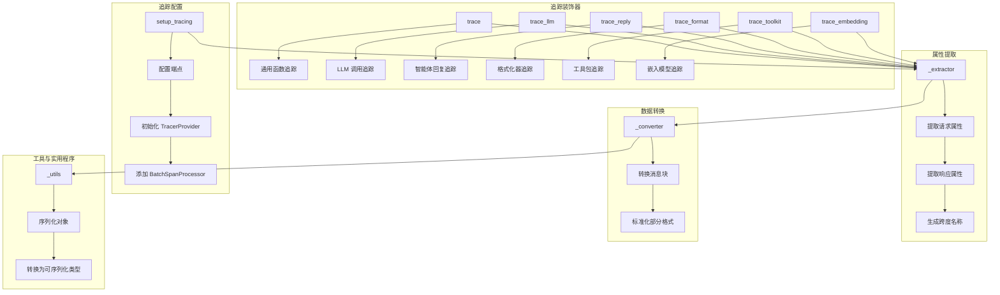
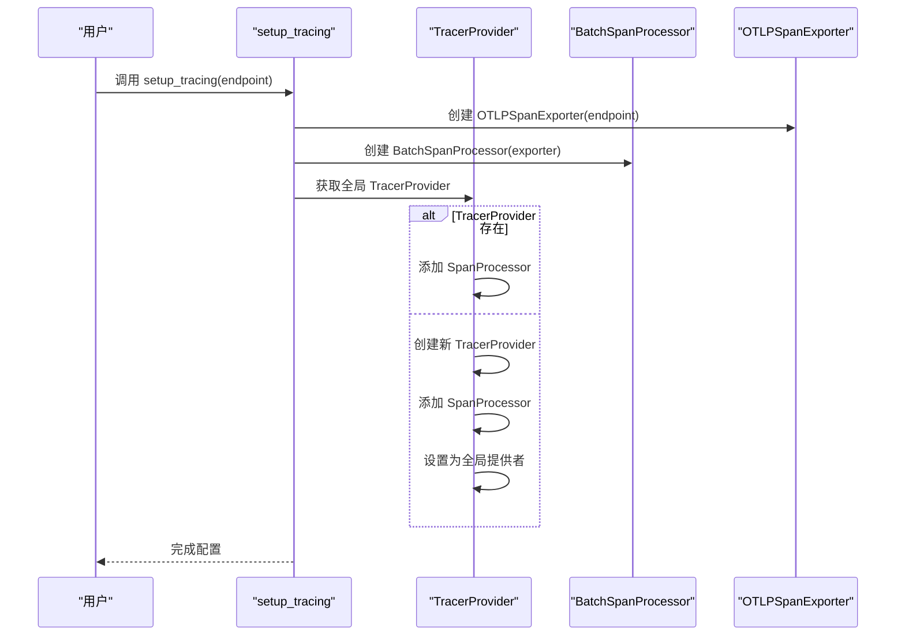
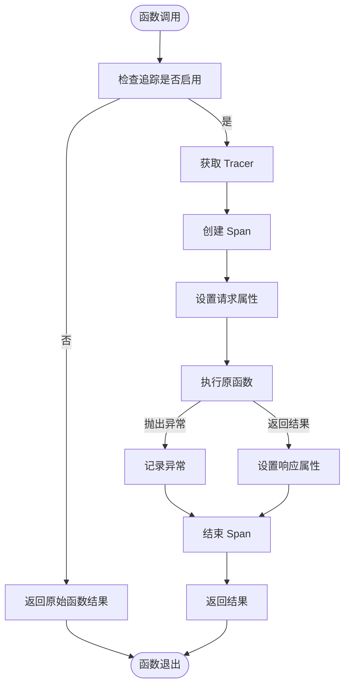
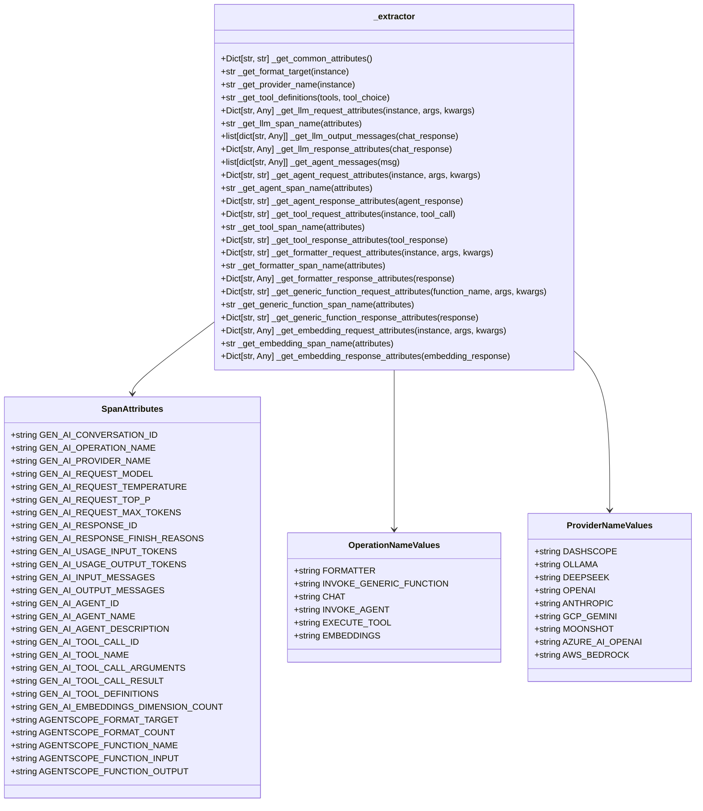
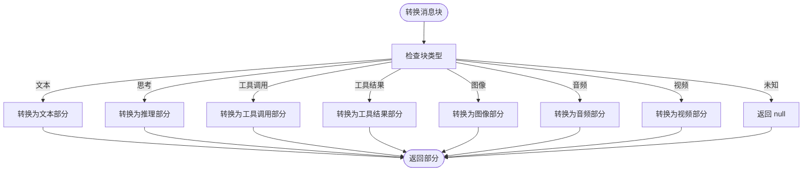
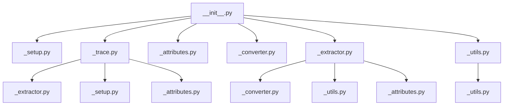

# 追踪系统

<cite>
**本文档中引用的文件**   
- [__init__.py](file://src/agentscope/tracing/__init__.py)
- [_setup.py](file://src/agentscope/tracing/_setup.py)
- [_trace.py](file://src/agentscope/tracing/_trace.py)
- [_attributes.py](file://src/agentscope/tracing/_attributes.py)
- [_converter.py](file://src/agentscope/tracing/_converter.py)
- [_extractor.py](file://src/agentscope/tracing/_extractor.py)
- [_utils.py](file://src/agentscope/tracing/_utils.py)
- [task_tracing.py](file://docs/tutorial/zh_CN/src/task_tracing.py)
- [_run_config.py](file://src/agentscope/_run_config.py)
</cite>

## 目录
1. [简介](#简介)
2. [核心组件](#核心组件)
3. [架构概述](#架构概述)
4. [详细组件分析](#详细组件分析)
5. [依赖分析](#依赖分析)
6. [性能考虑](#性能考虑)
7. [故障排除指南](#故障排除指南)
8. [结论](#结论)

## 简介
AgentScope 实现了基于 OpenTelemetry 的追踪系统，用于监控和调试智能体应用程序的执行。该系统提供了对 LLM、工具、智能体、格式化器等组件的内置追踪功能，支持错误和异常追踪，并能在 AgentScope Studio 中提供原生的追踪可视化。此外，系统还支持连接到第三方平台，如阿里云云监控、Arize-Phoenix 和 Langfuse 等。

**Section sources**
- [task_tracing.py](file://docs/tutorial/zh_CN/src/task_tracing.py#L8-L15)

## 核心组件

追踪系统的核心组件包括 `setup_tracing` 函数，用于配置追踪端点；`trace` 装饰器，用于追踪一般函数；以及特定的追踪装饰器如 `trace_llm`、`trace_reply`、`trace_format` 等，分别用于追踪 LLM 调用、智能体回复和格式化器调用。

**Section sources**
- [__init__.py](file://src/agentscope/tracing/__init__.py#L4-L12)
- [_setup.py](file://src/agentscope/tracing/_setup.py#L11-L39)

## 架构概述

**Diagram sources **
- [__init__.py](file://src/agentscope/tracing/__init__.py#L4-L12)
- [_setup.py](file://src/agentscope/tracing/_setup.py#L11-L39)
- [_trace.py](file://src/agentscope/tracing/_trace.py#L192-L649)
- [_extractor.py](file://src/agentscope/tracing/_extractor.py#L52-L800)
- [_converter.py](file://src/agentscope/tracing/_converter.py#L11-L126)
- [_utils.py](file://src/agentscope/tracing/_utils.py#L15-L79)

## 详细组件分析

### 追踪配置分析
`setup_tracing` 函数负责初始化追踪系统，通过配置端点 URL 来设置 `OTLPSpanExporter`，并将其添加到 `TracerProvider` 的 `BatchSpanProcessor` 中。如果 `TracerProvider` 已经存在，则直接添加处理器；否则，创建新的 `TracerProvider` 并设置为全局提供者。

**Diagram sources **
- [_setup.py](file://src/agentscope/tracing/_setup.py#L11-L39)

**Section sources**
- [_setup.py](file://src/agentscope/tracing/_setup.py#L11-L39)

### 追踪装饰器分析
追踪装饰器通过 `@trace`、`@trace_llm`、`@trace_reply` 等实现，它们在函数调用前后创建和结束跨度（Span），并记录请求和响应的属性。这些装饰器支持同步和异步函数，以及生成器函数。

**Diagram sources **
- [_trace.py](file://src/agentscope/tracing/_trace.py#L192-L649)

**Section sources**
- [_trace.py](file://src/agentscope/tracing/_trace.py#L192-L649)

### 属性提取分析
`_extractor` 模块中的函数负责从不同的组件中提取属性，如 LLM 请求、智能体请求、工具请求等，并将这些属性转换为 OpenTelemetry 兼容的格式。例如，`_get_llm_request_attributes` 提取 LLM 请求的模型、温度、top_p 等参数。

**Diagram sources **
- [_attributes.py](file://src/agentscope/tracing/_attributes.py#L8-L184)
- [_extractor.py](file://src/agentscope/tracing/_extractor.py#L52-L800)

**Section sources**
- [_attributes.py](file://src/agentscope/tracing/_attributes.py#L8-L184)
- [_extractor.py](file://src/agentscope/tracing/_extractor.py#L52-L800)

### 数据转换分析
`_converter` 模块中的函数负责将消息块（如文本、图像、音频等）转换为 OpenTelemetry GenAI 格式的部分（part）。例如，`_convert_block_to_part` 函数将 `ContentBlock` 转换为标准化的 `part` 字典。

**Diagram sources **
- [_converter.py](file://src/agentscope/tracing/_converter.py#L11-L126)

**Section sources**
- [_converter.py](file://src/agentscope/tracing/_converter.py#L11-L126)

## 依赖分析

**Diagram sources **
- [__init__.py](file://src/agentscope/tracing/__init__.py#L4-L12)
- [_trace.py](file://src/agentscope/tracing/_trace.py#L24-L47)
- [_extractor.py](file://src/agentscope/tracing/_extractor.py#L11-L17)
- [_utils.py](file://src/agentscope/tracing/_utils.py#L8-L13)

**Section sources**
- [__init__.py](file://src/agentscope/tracing/__init__.py#L4-L12)
- [_trace.py](file://src/agentscope/tracing/_trace.py#L24-L47)
- [_extractor.py](file://src/agentscope/tracing/_extractor.py#L11-L17)
- [_utils.py](file://src/agentscope/tracing/_utils.py#L8-L13)

## 性能考虑
追踪系统的性能影响主要体现在以下几个方面：
- **初始化开销**：`setup_tracing` 函数在首次调用时会进行一些初始化操作，如导入 OpenTelemetry 库和创建 `TracerProvider`。
- **跨度创建开销**：每次函数调用都会创建一个新的跨度，这会增加一定的 CPU 和内存开销。
- **网络传输开销**：追踪数据需要通过网络传输到后端，这可能会增加网络延迟和带宽消耗。

为了最小化性能影响，建议在生产环境中仅对关键路径进行追踪，并合理配置采样策略。

**Section sources**
- [_setup.py](file://src/agentscope/tracing/_setup.py#L11-L39)
- [_trace.py](file://src/agentscope/tracing/_trace.py#L192-L649)

## 故障排除指南
在使用追踪系统时，可能会遇到以下常见问题：
- **追踪未启用**：确保在调用 `agentscope.init` 时正确设置了 `tracing_url` 或 `studio_url` 参数。
- **追踪数据丢失**：检查网络连接是否正常，确保追踪后端服务可用。
- **属性提取失败**：确保被追踪的类正确继承自相应的基类（如 `ChatModelBase`、`AgentBase` 等）。

**Section sources**
- [task_tracing.py](file://docs/tutorial/zh_CN/src/task_tracing.py#L44-L72)
- [_trace.py](file://src/agentscope/tracing/_trace.py#L396-L403)
- [_trace.py](file://src/agentscope/tracing/_trace.py#L525-L532)

## 结论
AgentScope 的追踪系统基于 OpenTelemetry 实现，提供了全面的追踪功能，支持多种组件的追踪，并能与第三方平台集成。通过合理的配置和使用，可以有效地监控和调试智能体应用程序的执行，提高开发效率和系统可靠性。