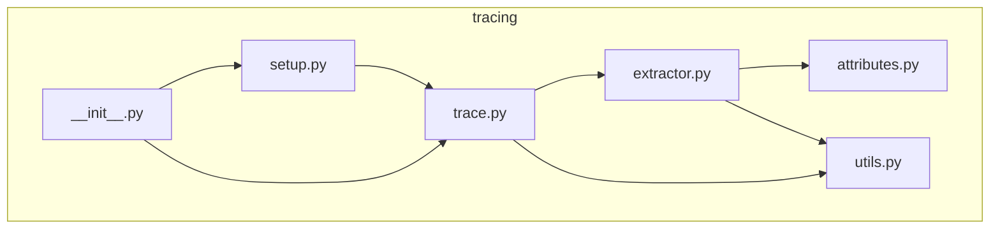
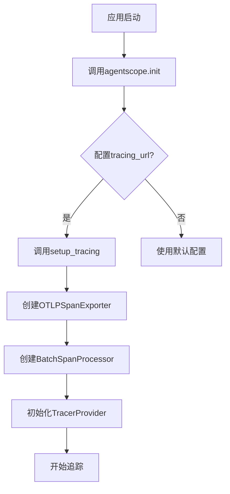
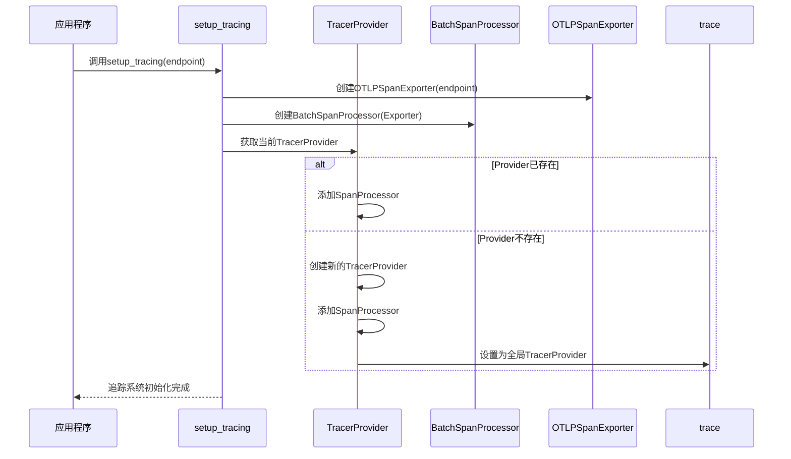
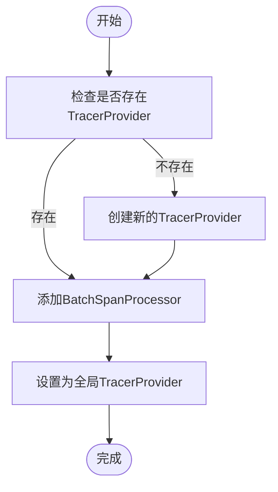
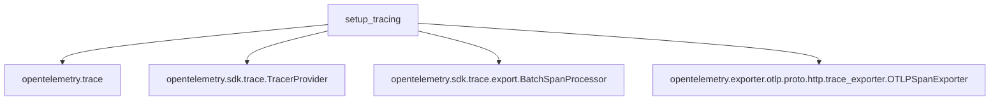

# 追踪系统配置

<cite>
**本文档中引用的文件**   
- [setup.py](file://src/agentscope/tracing/_setup.py)
- [trace.py](file://src/agentscope/tracing/_trace.py)
- [__init__.py](file://src/agentscope/tracing/__init__.py)
- [attributes.py](file://src/agentscope/tracing/_attributes.py)
- [extractor.py](file://src/agentscope/tracing/_extractor.py)
- [utils.py](file://src/agentscope/tracing/_utils.py)
- [task_tracing.py](file://docs/tutorial/zh_CN/src/task_tracing.py)
- [tracing_test.py](file://tests/tracing_test.py)
</cite>

## 目录
1. [简介](#简介)
2. [项目结构](#项目结构)
3. [核心组件](#核心组件)
4. [架构概述](#架构概述)
5. [详细组件分析](#详细组件分析)
6. [依赖分析](#依赖分析)
7. [性能考虑](#性能考虑)
8. [故障排除指南](#故障排除指南)
9. [结论](#结论)
10. [附录](#附录)（如有必要）

## 简介
本文档详细介绍了AgentScope中的追踪系统配置。重点说明了`setup_tracing`函数的使用方法，包括endpoint参数的配置和OpenTelemetry导出器的设置。文档解释了tracer_provider的初始化过程和BatchSpanProcessor的工作机制，提供了配置Jaeger、Zipkin等后端系统的具体示例，说明了采样策略的配置方法和性能影响，并通过代码示例展示了如何在应用启动时正确初始化追踪系统。

## 项目结构
AgentScope的追踪系统位于`src/agentscope/tracing`目录下，包含多个核心模块文件，这些文件共同实现了基于OpenTelemetry的追踪功能。系统通过模块化设计，将追踪的设置、属性定义、数据提取和工具函数分离，确保了代码的可维护性和扩展性。



**图表来源**
- [setup.py](file://src/agentscope/tracing/_setup.py)
- [trace.py](file://src/agentscope/tracing/_trace.py)
- [__init__.py](file://src/agentscope/tracing/__init__.py)

**本节来源**
- [setup.py](file://src/agentscope/tracing/_setup.py)
- [trace.py](file://src/agentscope/tracing/_trace.py)

## 核心组件
追踪系统的核心组件包括`setup_tracing`函数，用于配置追踪端点；`tracer_provider`，负责管理追踪器实例；以及`BatchSpanProcessor`，用于批量处理和导出追踪数据。这些组件协同工作，确保应用的执行过程能够被完整地记录和分析。

**本节来源**
- [setup.py](file://src/agentscope/tracing/_setup.py#L11-L39)
- [trace.py](file://src/agentscope/tracing/_trace.py#L41-L49)

## 架构概述
AgentScope的追踪架构基于OpenTelemetry标准，通过`setup_tracing`函数初始化追踪提供者和处理器。系统支持多种后端平台，如Jaeger、Zipkin和Langfuse，通过OTLP协议将追踪数据导出。架构设计允许在应用启动时灵活配置追踪参数，确保追踪功能的无缝集成。



**图表来源**
- [setup.py](file://src/agentscope/tracing/_setup.py#L11-L39)
- [__init__.py](file://src/agentscope/__init__.py#L72-L157)

## 详细组件分析

### setup_tracing函数分析
`setup_tracing`函数是追踪系统的核心入口，负责配置OpenTelemetry的追踪导出器和处理器。该函数接受一个`endpoint`参数，用于指定追踪数据的接收地址。

#### 函数调用流程


**图表来源**
- [setup.py](file://src/agentscope/tracing/_setup.py#L11-L39)

#### 参数配置
`setup_tracing`函数的`endpoint`参数是配置追踪系统的关键。该参数指定了OpenTelemetry收集器的URL，可以是任何支持OTLP协议的服务器地址。例如，连接到阿里云云监控、Arize-Phoenix或Langfuse等第三方平台。

**本节来源**
- [setup.py](file://src/agentscope/tracing/_setup.py#L11-L17)
- [task_tracing.py](file://docs/tutorial/zh_CN/src/task_tracing.py#L45-L46)

### tracer_provider初始化分析
`tracer_provider`的初始化是追踪系统的核心部分，它决定了追踪器的行为和配置。

#### 初始化机制


**图表来源**
- [setup.py](file://src/agentscope/tracing/_setup.py#L30-L38)

#### BatchSpanProcessor工作机制
`BatchSpanProcessor`负责将生成的追踪数据批量导出到指定的后端系统。它通过缓冲机制减少网络请求次数，提高性能。

**本节来源**
- [setup.py](file://src/agentscope/tracing/_setup.py#L27-L28)

### 后端系统配置示例
以下是配置不同后端系统的具体示例：

#### 阿里云云监控配置
```python
agentscope.init(tracing_url="https://tracing-cn-hangzhou.arms.aliyuncs.com/adapt_xxx/api/otlp/traces")
```

#### Arize-Phoenix配置
```python
import os
PHOENIX_API_KEY = os.environ.get("PHOENIX_API_KEY")
os.environ["OTEL_EXPORTER_OTLP_HEADERS"] = f"api_key={PHOENIX_API_KEY}"
agentscope.init(tracing_url="https://app.phoenix.arize.com/v1/traces")
```

#### Langfuse配置
```python
import os, base64
LANGFUSE_PUBLIC_KEY = os.environ["LANGFUSE_PUBLIC_KEY"]
LANGFUSE_SECRET_KEY = os.environ["LANGFUSE_SECRET_KEY"]
LANGFUSE_AUTH_STRING = f"{LANGFUSE_PUBLIC_KEY}:{LANGFUSE_SECRET_KEY}"
LANGFUSE_AUTH = base64.b64encode(LANGFUSE_AUTH_STRING.encode("utf-8")).decode("ascii")
os.environ["OTEL_EXPORTER_OTLP_HEADERS"] = f"Authorization=Basic {LANGFUSE_AUTH}"
agentscope.init(tracing_url="https://cloud.langfuse.com/api/public/otel/v1/traces")
```

**本节来源**
- [task_tracing.py](file://docs/tutorial/zh_CN/src/task_tracing.py#L57-L101)

### 采样策略配置
虽然当前代码中未直接实现采样策略，但OpenTelemetry SDK支持通过环境变量或代码配置采样率。采样策略可以显著影响性能，特别是在高负载场景下。

**本节来源**
- [tracing_test.py](file://tests/tracing_test.py)

## 依赖分析
追踪系统依赖于OpenTelemetry SDK的核心组件，包括`trace`、`TracerProvider`、`BatchSpanProcessor`和`OTLPSpanExporter`。这些依赖通过懒加载方式引入，确保在不需要追踪功能时不会影响应用性能。



**图表来源**
- [setup.py](file://src/agentscope/tracing/_setup.py#L19-L24)

**本节来源**
- [setup.py](file://src/agentscope/tracing/_setup.py#L19-L24)

## 性能考虑
追踪系统的性能影响主要来自数据序列化和网络传输。`BatchSpanProcessor`通过批量处理减少了网络请求次数，但增加了内存使用。在高并发场景下，应合理配置批处理大小和导出间隔，以平衡性能和追踪数据的实时性。

**本节来源**
- [setup.py](file://src/agentscope/tracing/_setup.py)
- [utils.py](file://src/agentscope/tracing/_utils.py)

## 故障排除指南
当追踪系统无法正常工作时，应首先检查`tracing_url`配置是否正确，以及目标服务器是否可达。可以通过查看应用日志来确认追踪初始化是否成功。如果使用第三方平台，还需确保认证信息（如API密钥）已正确设置。

**本节来源**
- [setup.py](file://src/agentscope/tracing/_setup.py)
- [task_tracing.py](file://docs/tutorial/zh_CN/src/task_tracing.py)

## 结论
AgentScope的追踪系统通过`setup_tracing`函数提供了灵活的配置选项，支持多种后端平台。系统基于OpenTelemetry标准，确保了追踪数据的兼容性和可扩展性。正确配置追踪系统可以显著提升应用的可观测性，帮助开发者快速定位和解决问题。