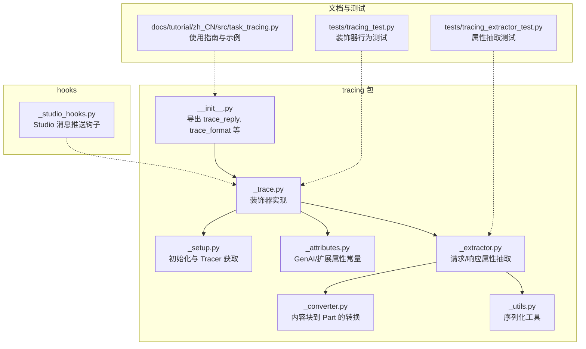
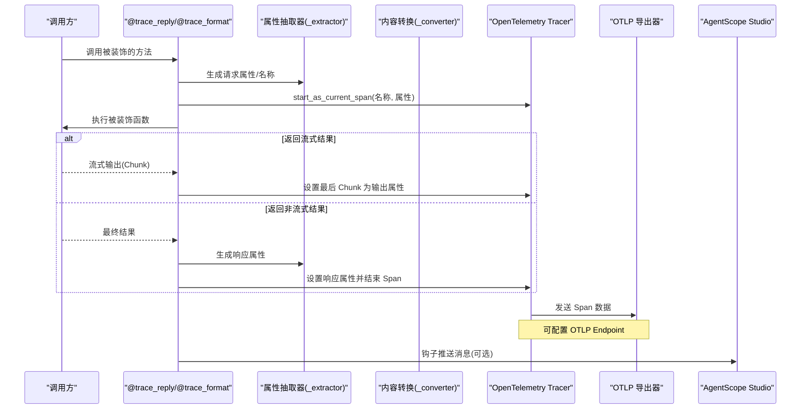
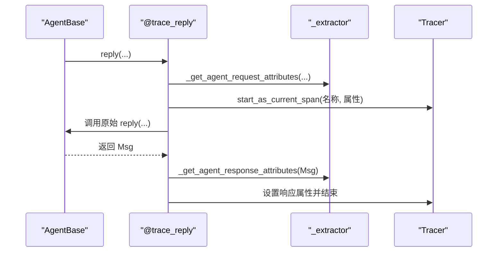
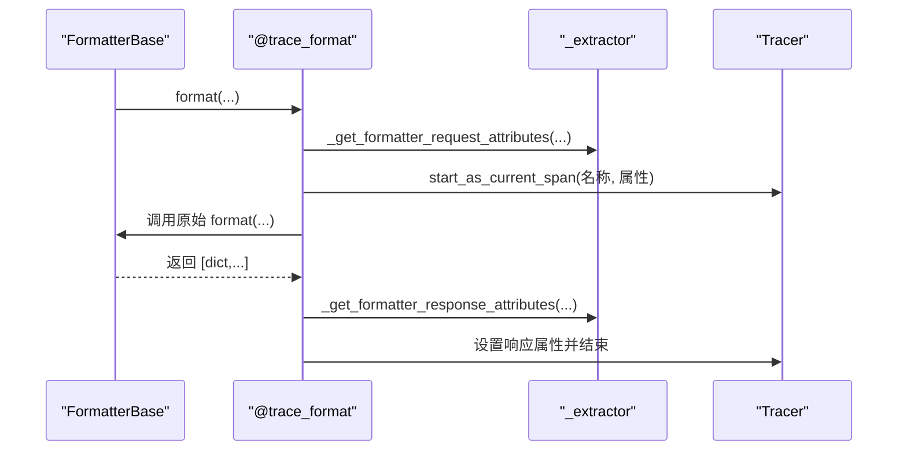
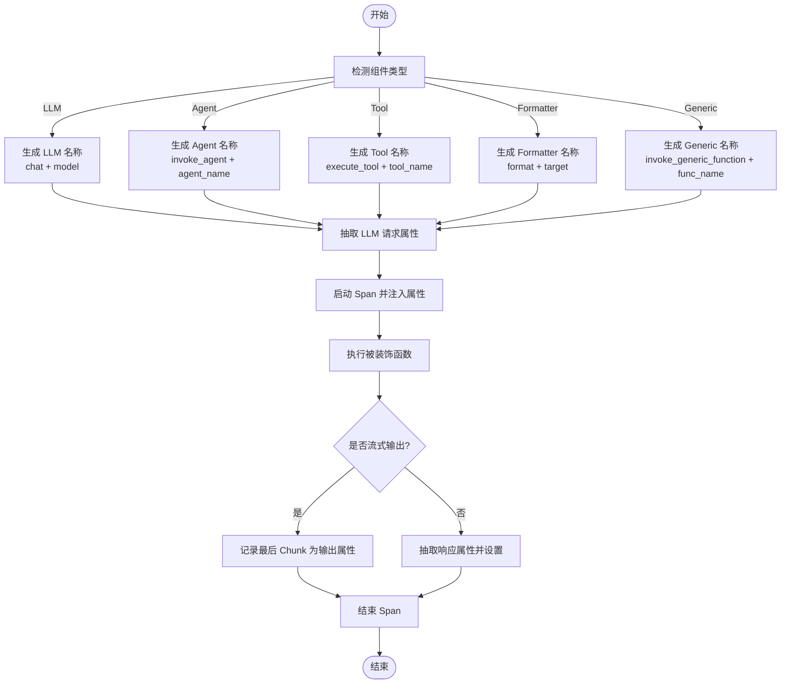
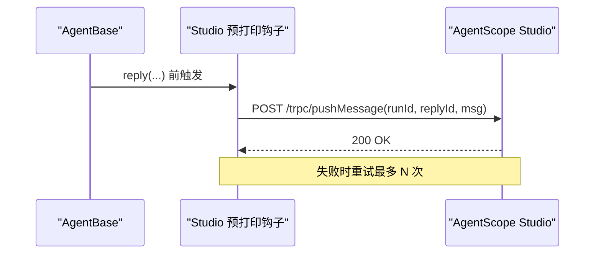
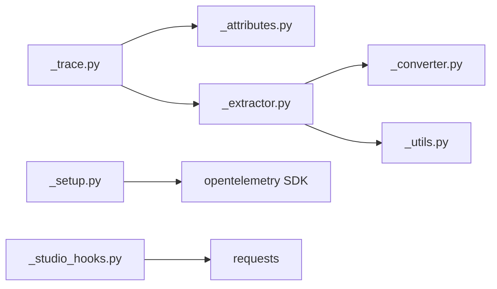

# 追踪系统集成

<cite>
**本文引用的文件列表**
- [tracing/__init__.py](file://src/agentscope/tracing/__init__.py)
- [tracing/_trace.py](file://src/agentscope/tracing/_trace.py)
- [tracing/_setup.py](file://src/agentscope/tracing/_setup.py)
- [tracing/_attributes.py](file://src/agentscope/tracing/_attributes.py)
- [tracing/_extractor.py](file://src/agentscope/tracing/_extractor.py)
- [tracing/_converter.py](file://src/agentscope/tracing/_converter.py)
- [tracing/_utils.py](file://src/agentscope/tracing/_utils.py)
- [hooks/_studio_hooks.py](file://src/agentscope/hooks/_studio_hooks.py)
- [docs/tutorial/zh_CN/src/task_tracing.py](file://docs/tutorial/zh_CN/src/task_tracing.py)
- [tests/tracing_test.py](file://tests/tracing_test.py)
- [tests/tracing_extractor_test.py](file://tests/tracing_extractor_test.py)
</cite>

## 目录
1. [简介](#简介)
2. [项目结构](#项目结构)
3. [核心组件](#核心组件)
4. [架构总览](#架构总览)
5. [详细组件分析](#详细组件分析)
6. [依赖关系分析](#依赖关系分析)
7. [性能考量](#性能考量)
8. [故障排查指南](#故障排查指南)
9. [结论](#结论)
10. [附录](#附录)

## 简介
本文件面向希望在 AgentScope 中集成与使用追踪能力的开发者，系统性讲解以下内容：
- 装饰器 trace_reply、trace_format 的实现机制与集成方式
- 如何将追踪功能集成到智能体回复、消息格式化等核心流程
- _span_name 的生成策略与属性注入方法
- 与 AgentScope Studio 的集成方案（实时监控数据传输与可视化）
- 在自定义组件中添加追踪支持的实际示例路径

## 项目结构
追踪系统位于 agentscope/tracing 包内，围绕 OpenTelemetry 提供统一的装饰器与属性抽取逻辑，并通过 hooks 与 Studio 进行对接。

图表来源
- [tracing/__init__.py](file://src/agentscope/tracing/__init__.py#L1-L23)
- [tracing/_trace.py](file://src/agentscope/tracing/_trace.py#L1-L649)
- [tracing/_setup.py](file://src/agentscope/tracing/_setup.py#L1-L50)
- [tracing/_attributes.py](file://src/agentscope/tracing/_attributes.py#L1-L184)
- [tracing/_extractor.py](file://src/agentscope/tracing/_extractor.py#L1-L800)
- [tracing/_converter.py](file://src/agentscope/tracing/_converter.py#L1-L126)
- [tracing/_utils.py](file://src/agentscope/tracing/_utils.py#L1-L79)
- [hooks/_studio_hooks.py](file://src/agentscope/hooks/_studio_hooks.py#L1-L54)
- [docs/tutorial/zh_CN/src/task_tracing.py](file://docs/tutorial/zh_CN/src/task_tracing.py#L1-L214)
- [tests/tracing_test.py](file://tests/tracing_test.py#L1-L200)
- [tests/tracing_extractor_test.py](file://tests/tracing_extractor_test.py#L1-L200)

章节来源
- [tracing/__init__.py](file://src/agentscope/tracing/__init__.py#L1-L23)
- [docs/tutorial/zh_CN/src/task_tracing.py](file://docs/tutorial/zh_CN/src/task_tracing.py#L1-L214)

## 核心组件
- 装饰器层：trace、trace_llm、trace_reply、trace_format、trace_toolkit、trace_embedding
- 属性与命名：SpanAttributes、OperationNameValues、ProviderNameValues
- 属性抽取：_extractor（按组件类型抽取请求/响应属性）
- 名称生成：_get_*_span_name（根据属性生成 span 名称）
- 序列化：_utils（对象到可序列化字符串）
- 转换：_converter（ContentBlock 到 OpenTelemetry GenAI Part）
- 初始化：_setup（配置 OTLP 导出器与 TracerProvider）
- Studio 钩子：_studio_hooks（向 Studio 推送消息）

章节来源
- [tracing/_trace.py](file://src/agentscope/tracing/_trace.py#L1-L649)
- [tracing/_attributes.py](file://src/agentscope/tracing/_attributes.py#L1-L184)
- [tracing/_extractor.py](file://src/agentscope/tracing/_extractor.py#L1-L800)
- [tracing/_converter.py](file://src/agentscope/tracing/_converter.py#L1-L126)
- [tracing/_utils.py](file://src/agentscope/tracing/_utils.py#L1-L79)
- [tracing/_setup.py](file://src/agentscope/tracing/_setup.py#L1-L50)
- [hooks/_studio_hooks.py](file://src/agentscope/hooks/_studio_hooks.py#L1-L54)

## 架构总览
下图展示了从调用入口到 OpenTelemetry 的完整链路，以及与 Studio 的集成点。

图表来源
- [tracing/_trace.py](file://src/agentscope/tracing/_trace.py#L369-L566)
- [tracing/_extractor.py](file://src/agentscope/tracing/_extractor.py#L447-L550)
- [tracing/_converter.py](file://src/agentscope/tracing/_converter.py#L57-L126)
- [tracing/_setup.py](file://src/agentscope/tracing/_setup.py#L11-L50)
- [hooks/_studio_hooks.py](file://src/agentscope/hooks/_studio_hooks.py#L11-L54)

## 详细组件分析

### 装饰器：trace_reply（智能体回复）
- 功能：为 AgentBase 的 reply 方法添加 OpenTelemetry 追踪，自动注入输入消息、Agent 元信息、运行 ID 等属性，并在成功/失败时设置状态与异常记录。
- 关键点：
  - 输入参数抽取：从 args/kwargs 中提取消息，转换为标准化消息数组。
  - 名称生成：基于 OperationNameValues.INVOKE_AGENT 与 Agent 名称。
  - 输出属性：将最终 Msg 对象转换为标准化输出消息。
  - 错误处理：捕获异常并记录，同时设置错误状态。
- 集成方式：在自定义 Agent 的 reply 方法上添加 @trace_reply 装饰器即可。

图表来源
- [tracing/_trace.py](file://src/agentscope/tracing/_trace.py#L369-L435)
- [tracing/_extractor.py](file://src/agentscope/tracing/_extractor.py#L447-L550)

章节来源
- [tracing/_trace.py](file://src/agentscope/tracing/_trace.py#L369-L435)
- [tracing/_extractor.py](file://src/agentscope/tracing/_extractor.py#L447-L550)

### 装饰器：trace_format（消息格式化）
- 功能：为 FormatterBase 的 format 方法添加追踪，自动识别目标平台（Provider），并将格式化结果与计数等属性写入 Span。
- 关键点：
  - 目标平台识别：通过类名映射与前缀规则推断格式化目标。
  - 名称生成：基于 OperationNameValues.FORMATTER 与目标平台。
  - 输出属性：将格式化后的消息列表序列化为属性，并统计条数。
- 集成方式：在自定义 Formatter 的 format 方法上添加 @trace_format 装饰器。

图表来源
- [tracing/_trace.py](file://src/agentscope/tracing/_trace.py#L498-L566)
- [tracing/_extractor.py](file://src/agentscope/tracing/_extractor.py#L655-L732)

章节来源
- [tracing/_trace.py](file://src/agentscope/tracing/_trace.py#L498-L566)
- [tracing/_extractor.py](file://src/agentscope/tracing/_extractor.py#L655-L732)

### span 名称生成策略与属性注入
- 通用策略：
  - LLM：OperationNameValues.CHAT + 模型名
  - Agent：OperationNameValues.INVOKE_AGENT + Agent 名称
  - 工具：OperationNameValues.EXECUTE_TOOL + 工具名
  - 格式化器：OperationNameValues.FORMATTER + 目标平台
  - 通用函数：OperationNameValues.INVOKE_GENERIC_FUNCTION + 函数名
- 属性注入：
  - 请求属性：包含 GenAI 规范字段（如模型、温度、top_p、工具定义等）、AgentScope 扩展字段（函数名、输入、会话 ID 等）。
  - 响应属性：包含输出消息、Token 使用、工具调用结果、通用函数输出等。
- 序列化：
  - 复杂对象通过 _utils._serialize_to_str 转为 JSON 字符串，确保跨平台兼容。

图表来源
- [tracing/_extractor.py](file://src/agentscope/tracing/_extractor.py#L270-L287)
- [tracing/_extractor.py](file://src/agentscope/tracing/_extractor.py#L507-L524)
- [tracing/_extractor.py](file://src/agentscope/tracing/_extractor.py#L609-L626)
- [tracing/_extractor.py](file://src/agentscope/tracing/_extractor.py#L691-L708)
- [tracing/_extractor.py](file://src/agentscope/tracing/_extractor.py#L771-L788)
- [tracing/_trace.py](file://src/agentscope/tracing/_trace.py#L107-L190)

章节来源
- [tracing/_extractor.py](file://src/agentscope/tracing/_extractor.py#L270-L287)
- [tracing/_extractor.py](file://src/agentscope/tracing/_extractor.py#L507-L524)
- [tracing/_extractor.py](file://src/agentscope/tracing/_extractor.py#L609-L626)
- [tracing/_extractor.py](file://src/agentscope/tracing/_extractor.py#L691-L708)
- [tracing/_extractor.py](file://src/agentscope/tracing/_extractor.py#L771-L788)
- [tracing/_trace.py](file://src/agentscope/tracing/_trace.py#L107-L190)

### 与 AgentScope Studio 的集成
- 实时监控数据传输：
  - 通过 hooks 中的预打印钩子，将消息在发送前推送到 Studio 的 /trpc/pushMessage 接口，支持重试与状态校验。
- 可视化：
  - 文档中提供了 Studio 追踪页面截图，展示在 Studio 中查看追踪的能力。
- 使用建议：
  - 在应用初始化时提供 studio_url，即可启用 Studio 推送；若需第三方平台，使用 tracing_url 指定 OTLP Endpoint。

图表来源
- [hooks/_studio_hooks.py](file://src/agentscope/hooks/_studio_hooks.py#L11-L54)
- [docs/tutorial/zh_CN/src/task_tracing.py](file://docs/tutorial/zh_CN/src/task_tracing.py#L1-L120)

章节来源
- [hooks/_studio_hooks.py](file://src/agentscope/hooks/_studio_hooks.py#L11-L54)
- [docs/tutorial/zh_CN/src/task_tracing.py](file://docs/tutorial/zh_CN/src/task_tracing.py#L1-L120)

### 在自定义组件中添加追踪支持
- LLM 模型：在 ChatModelBase.__call__ 上使用 @trace_llm
- Agent：在 AgentBase.reply 上使用 @trace_reply
- Formatter：在 FormatterBase.format 上使用 @trace_format
- 通用函数：使用 @trace(name="...") 包裹任意函数，支持同步/异步、生成器/异步生成器
- 示例路径（不直接展示代码）：
  - LLM 追踪示例：[docs/tutorial/zh_CN/src/task_tracing.py](file://docs/tutorial/zh_CN/src/task_tracing.py#L121-L140)
  - Agent 追踪示例：[docs/tutorial/zh_CN/src/task_tracing.py](file://docs/tutorial/zh_CN/src/task_tracing.py#L141-L156)
  - Formatter 追踪示例：[docs/tutorial/zh_CN/src/task_tracing.py](file://docs/tutorial/zh_CN/src/task_tracing.py#L158-L172)
  - 通用函数追踪示例：[docs/tutorial/zh_CN/src/task_tracing.py](file://docs/tutorial/zh_CN/src/task_tracing.py#L173-L213)

章节来源
- [docs/tutorial/zh_CN/src/task_tracing.py](file://docs/tutorial/zh_CN/src/task_tracing.py#L121-L213)
- [tests/tracing_test.py](file://tests/tracing_test.py#L1-L200)

## 依赖关系分析
- 组件耦合：
  - _trace.py 依赖 _extractor.py 与 _attributes.py，负责装饰器实现与属性注入。
  - _extractor.py 依赖 _converter.py 与 _utils.py，负责内容块转换与序列化。
  - _setup.py 仅依赖 opentelemetry SDK，负责 TracerProvider 与导出器配置。
  - hooks 与 tracing 解耦，通过消息推送与追踪解耦。
- 外部依赖：
  - OpenTelemetry SDK（TracerProvider、BatchSpanProcessor、OTLPSpanExporter）
  - requests（Studio 推送）

图表来源
- [tracing/_trace.py](file://src/agentscope/tracing/_trace.py#L1-L649)
- [tracing/_extractor.py](file://src/agentscope/tracing/_extractor.py#L1-L800)
- [tracing/_converter.py](file://src/agentscope/tracing/_converter.py#L1-L126)
- [tracing/_utils.py](file://src/agentscope/tracing/_utils.py#L1-L79)
- [tracing/_setup.py](file://src/agentscope/tracing/_setup.py#L1-L50)
- [hooks/_studio_hooks.py](file://src/agentscope/hooks/_studio_hooks.py#L1-L54)

章节来源
- [tracing/_trace.py](file://src/agentscope/tracing/_trace.py#L1-L649)
- [tracing/_extractor.py](file://src/agentscope/tracing/_extractor.py#L1-L800)
- [tracing/_converter.py](file://src/agentscope/tracing/_converter.py#L1-L126)
- [tracing/_utils.py](file://src/agentscope/tracing/_utils.py#L1-L79)
- [tracing/_setup.py](file://src/agentscope/tracing/_setup.py#L1-L50)
- [hooks/_studio_hooks.py](file://src/agentscope/hooks/_studio_hooks.py#L1-L54)

## 性能考量
- 流式输出处理：装饰器对 AsyncGenerator/Generator 进行包装，仅在 finally 阶段设置最后 Chunk 为输出属性，避免逐块写入带来的开销。
- 序列化成本：复杂对象通过 _utils._serialize_to_str 序列化，尽量减少 JSON 编码失败的重试成本。
- 导出器批处理：使用 BatchSpanProcessor，降低网络往返次数，提升吞吐。
- 条件追踪：通过 _check_tracing_enabled 判断是否启用追踪，未启用时直接透传调用，避免额外开销。

章节来源
- [tracing/_trace.py](file://src/agentscope/tracing/_trace.py#L107-L190)
- [tracing/_setup.py](file://src/agentscope/tracing/_setup.py#L11-L50)
- [tracing/_utils.py](file://src/agentscope/tracing/_utils.py#L1-L79)

## 故障排查指南
- 追踪未生效：
  - 确认已调用 setup_tracing 或通过 agentscope.init 设置 tracing_url/studio_url。
  - 检查 _config.trace_enabled 是否为 True。
- 属性缺失或为空：
  - 检查组件实例是否具备必要字段（如 model_name、Agent.id/name、工具定义等）。
  - 确认 _get_*_attributes 的输入参数是否正确传递。
- 流式输出只记录最后一块：
  - 这是预期行为，确保只记录最终输出；如需中间观测，可在业务侧自行记录。
- Studio 推送失败：
  - 查看重试日志与异常栈；确认 studio_url 正确且网络可达。
- 单元测试参考：
  - 装饰器行为与流式输出：[tests/tracing_test.py](file://tests/tracing_test.py#L1-L200)
  - 属性抽取逻辑验证：[tests/tracing_extractor_test.py](file://tests/tracing_extractor_test.py#L1-L200)

章节来源
- [tests/tracing_test.py](file://tests/tracing_test.py#L1-L200)
- [tests/tracing_extractor_test.py](file://tests/tracing_extractor_test.py#L1-L200)
- [hooks/_studio_hooks.py](file://src/agentscope/hooks/_studio_hooks.py#L11-L54)

## 结论
AgentScope 的追踪系统以 OpenTelemetry 为核心，通过统一的装饰器与属性抽取机制，覆盖 LLM、Agent、Formatter、工具与通用函数等关键路径，并提供与 AgentScope Studio 的无缝集成。通过合理的 span 名称生成与属性注入策略，开发者可以在不侵入业务代码的前提下获得完整的可观测性与可视化体验。

## 附录
- 快速开始（示例路径）：
  - LLM 追踪：[docs/tutorial/zh_CN/src/task_tracing.py](file://docs/tutorial/zh_CN/src/task_tracing.py#L121-L140)
  - Agent 追踪：[docs/tutorial/zh_CN/src/task_tracing.py](file://docs/tutorial/zh_CN/src/task_tracing.py#L141-L156)
  - Formatter 追踪：[docs/tutorial/zh_CN/src/task_tracing.py](file://docs/tutorial/zh_CN/src/task_tracing.py#L158-L172)
  - 通用函数追踪：[docs/tutorial/zh_CN/src/task_tracing.py](file://docs/tutorial/zh_CN/src/task_tracing.py#L173-L213)
- 初始化与导出器配置：
  - setup_tracing(endpoint)：[tracing/_setup.py](file://src/agentscope/tracing/_setup.py#L11-L50)
- 属性与命名常量：
  - SpanAttributes/OperationNameValues/ProviderNameValues：[tracing/_attributes.py](file://src/agentscope/tracing/_attributes.py#L1-L184)